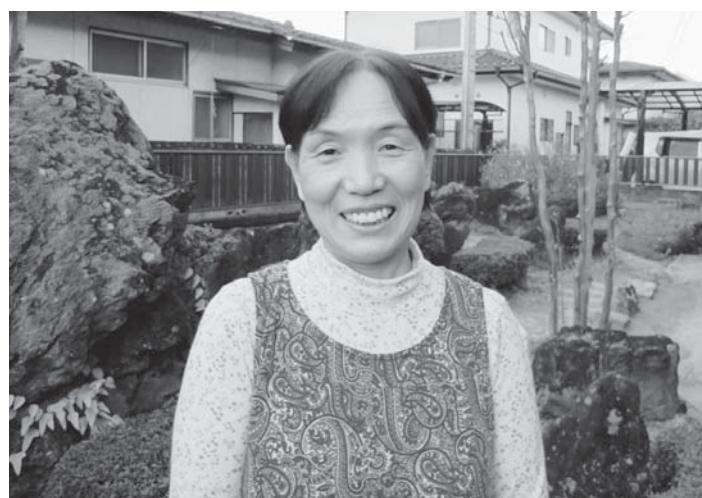
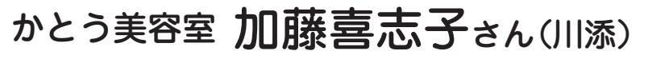
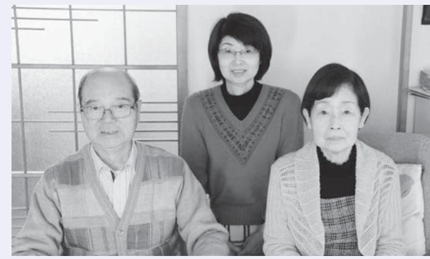
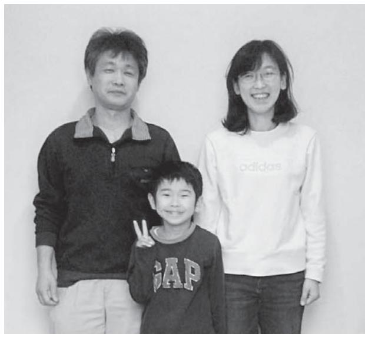
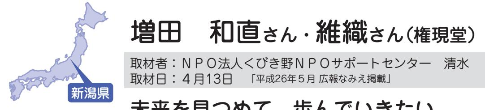
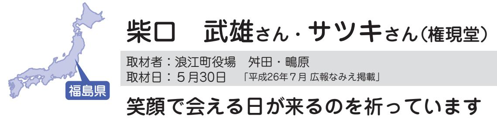
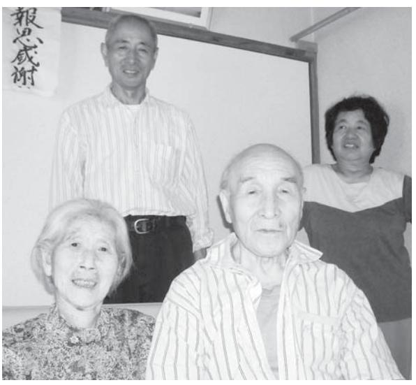
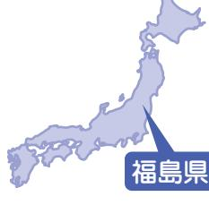

#### この時期の復興に向けた主な動き

- 町内の井戸水・沢水等の放射性物質モニタリング検査開始H26. 2月
	- 復興まちづくり計画を策定 3月
	- 県営復興公営住宅の第一期募集が開始 4月
	- 水稲実証栽培を開始(町内で4年振りの田植え) 5月
	- 平成26年度浪江町住民意向調査を実施 8月
	- 浪江町防犯見守り隊(町民で構成)のパトロール開始 12月
- 町営大平山霊園が完成H27. 3月
	- 常磐自動車道が全線開通(浪江IC~常磐富岡IC間開通) 3月

平成26年1月号~平成27年3月号掲載分

# ະݭƱƔƘƂƽơ ǟǥ½Ǯ

ݖƞƲDžૌƴƾ£ ƨƾƈƛơࣰଙƞƄ

警察と常備消防の常駐開始(4月1日) 浪江町防犯見守り隊の発足(11月27日)

津島小学校再開(4月7日) 川添芸能保存会の活動再開

## 鎌田理恵子さん(権現堂)

取材者:NPO法人ちば市民活動・市民事業サポートクラブ鍋嶋取材日:12月5日 「平成26年1月広報なみえ掲載」

### 一緒にがんばろう! というメッセージを歌で伝えたい

シンガーソングライター『理恵子』として、東京を拠点に、福島と東京でライブ活動を行っている理恵子さん。「父母や兄をはじめとする浪江の人たちの応援に元気をもらっている。 音楽を通して、復興の後押しができたら」と活動を続けています。

私は、高校まで浪江町で暮らしていました 。 高校卒業の頃から、歌手になりたいという思いが強くなり両親に伝えたところ、 「 大学に進学し、資格を身に付けたら好きなことをしていいよ 」 と言われ、短大で栄養士の資格を取りました 。 東日本大震災の時は東京近辺で歌手としての修業中でした 。 自宅のテレビで、福島の状況が映し出されるのをどきどきしながら一人で見ていました 。

▲Tシャツも作りました。

父母がいました 。 家族の安否が心配で、震災直後から、家族に電話をかけ続けましたが、家族全員の無事が確認できたのは、震災から約 1 週間ほど過ぎた頃でした 。 父は学校の先生、長兄は役場の職員、次兄は東京電力の協力会社に勤めています 。 次兄は、震災の時に、福島第一原子力発電所の 4 号機で働いていました 。 普段は 15 分で帰れる距離を 6 時間かけて帰ったとのことです 。 浪江での一番の思い出は 『 十日市 』、一日目は友だちと、二日目は家族と、といった具合で三日間通いました 。 学校帰りに、友だちと行った文房具屋さん 「 ほていや 」、「 サンプラザ 」 や 「 スーパーフジコシ 」 では、行くと必ずと言っていいほど、知り合いに会えました 。 カフェ 「 はるく 」 は人生初めてのアルバイト先、ケーキ作りの補助やホールのお手伝いをさせてもらったりしました 。 歌を始めて 6 年目になります 。 今は、オリジナルの曲を聴いてもらえるようになりました 。 震災以降は、東京をメインに時折福島へ 。 東京ではロック系の曲が、福島ではバラード系の曲が

好まれます 。 震災直後には、東京の人たちに福島の人たちの思いを伝えるため 「 3 1 1 」 という曲を作りました 。 福島の人たちからは 「 本当に歌詞の通りだ 」 と言われ、作って良かったと思いました 。 元 々 は震災を経験されていない方 々 に福島を忘れないで頂けたらという想いで作った曲でした 。 最近できた曲 「 るいぶらいゆ 」 は、聴いた人たちが明るい気持ちになれればと思って歌詞を考えました 。 今年の 『 十日市 』 で歌ったら子どもたちが、曲に合わせて楽しそうに踊ってくれて、うれしかったですね 。 一緒にキャラクターや絵本、Tシャツも作りました 。 震災から 2 年 9 カ月、東京の人たちの意識から震災は遠くなってきているように思います 。 一方で、被災者の人たちの多くは、暮らしの不安を抱えています 。 そのギャップに戸惑いを覚えますが、時に、東京でも復興のために動いている人に出会うと、うれしくなります 。 これからも 「 頑張って 」 ではなく 「 一緒にがんばろう ! 」 というメッセージを歌で伝えていきたいと思います 。

国分勝さん(酒田)

取材者:浪江町役場鴫原取材日:12月3日 「平成26年1月広報なみえ掲載」

## いつもチャレンジャーでいたい

浪江で建築板金業を営んでいらした国分さんは、震災後、仮設住宅の建築などに携わり、現在は役場二本松事務所の生活支援課で臨時職員として勤務されています。 以前とは全く違うお仕事ですが、"今までやってきてない事を新たなチャレンジだと考えて楽しんでいます。常にチャレンジャーでいたいですね。"と、毎日元気な声で親しみやすい電話対応を心がけていらっしゃいます。

▲仕事の様子(役場二本松事務所にて)

震災が起こった時は、作業場のある幾世橋の実家に仕事の材料を取りに行っていました 。 作業場は地震の影響で物が散乱しましたが誰も怪我はありませんでした 。 子どもたちも無事で、両親と一緒に電気と井戸水が使える酒田の自宅で 2 日間過ごしました 。 13 日に弟のいる小高へ避難し、水素爆発の翌日に二本松市にあるJICAの研修施設に移動して 3 カ月程いました 。 その後、 2 次避難所を経て震災

の年の 8 月から二本松の借上げ住宅で暮らしています 。 浪江では、色 々 な人と関わりを持ちながら建築板金業をしていました 。 その繋がりで浪江の建築組合から仮設住宅を建てるのに力を貸してほしいと依頼があり、数百棟の仮設住宅に係わりました 。 福島の仮設住宅はあらかた回りましたが、初めの桑折仮設には朝 5 時に起きて二本松から 1 時間半かけて通っていました 。 その時は大変だという気持ちはなくて、〝 とにかく建てなきゃいけない 。 仮設を建てるのが第一優先だ 〞 という意気込みでやっていました 。 その後、教育委員会から浪小・浪中を再開したいので 1 カ月で何とかして欲しいと言われて、 12 人の仲間と夏休みが終わるまでに使えるように準備をしました 。 廃校になっていた校舎だったので、子どもたちに気持ち良く学校生活を送ってもらえるようにみんなで力を合わせて頑張りました 。 その仕事も終わり、役場の臨時職員として一時立ち入りの受付業務に就いたのは 10 月です 。 畑違いの仕事ではあり

ますが、その分、何をやっても新鮮でチャレンジャーの気持ちで取り組んでいます 。 電話を受けていると、皆さんの様 々 な思いにふれる機会が多くあります 。 建築業をやっていたときに知り合った人と話す機会があったり、おじいちゃん、おばあちゃんの話の聞き役になることもあります 。 元 々 役場に勤めていたわけではないので、皆さんの立場も分かり、その視点に立って仕事をしていきたいと思っています 。 建築の仕事は、子どもの学校の転校を伴うので今始める事は難しいですが、何の仕事であっても子どもに親が働いている姿を見せていかなければいけないと考えています 。 子ども達は自分の張り合いで、いつでも子どもたちの一番の応援団で在りたいと思っています 。 悪いことを考えたら終わりなので、常にやってやろうという心構えでいます 。 そうしないと人生がつまらなくなります 。 皆さん、どんどん働いて元気にいきましょう !

## 石井絹江さん(赤宇木)

取材者:高崎経済大学櫻井研究室櫻井取材日:12月6日 「平成26年1月広報なみえ掲載」

#### 皆さんが浪江に戻りたくなる環境づくりの一助になりたい ~ふるさとの力こそが私たちの心を支えてくれると信じて~

石井絹江さんは、震災後、阿武隈地域の伝統食を活かした「かーちゃんの力・プロジェクト」に参加し、仮設住宅に弁当を届けるなど、ふるさとの力を復興へと結びつける取り組みを続けてきている。石井さんのお話からは、必ず浪江に戻って復興させたいとの強い思いが伝わってくる。

かーちゃんの力・プロジェクトは、震災の年の 10 月頃から始まりました 。 復興に向けて自分たちにできることはないかと思い立った女性たちとともに、栄養に配慮した健康弁当の配食などを進めてきました 。 今は、父の体調が悪くなり、そのお世話をするためにプロジェクトを離れましたが、まだまだ自分にできることはあると思っています 。 私は、役場職員として退職ま

> で地

きま

町の

今度

に恩

と強

町内

心に

掘り

する

あり

にん

域の皆さんに育てていただした 。 だから 50 歳の頃から、産業振興に携わりながら、は支えていただいた皆さん返しがしたいという思いがずっくありました 。 大震災前は、にできた 5 つの直売所を中、地域にある豊富な食材を起こしながら、全国に発信取り組みが軌道に乗りつつました 。 直売所では 〝 行者にく 〞〝 ブルーベリー 〞〝 りんどう 〞〝 キノコ 〞〝 かぼちゃ饅頭 〞〝 サケの燻製 〞 そして菜種やツバキから搾った油など、地域の皆さんと様 々 な取り組みに挑戦してきました 。 大震災によって、すべては止まってしまいましたが、それまで培ってきた経験、そして何よりも地域の皆さんとのつながりは今も力強く生きていると思っています 。 現在も、金谷川など福島市

うにと頑張っています 。 震災から 2 年半が過ぎて、それぞれの土地での生活が定着してきている方もいると思います 。 けれども、何か心の中にぽっかりと穴が開いている感じがします 。 やっぱり私は浪江に戻りたい 。 ふるさとが私たちの心を満たしてくれるはず 。 浪江に戻って、高齢の方 々 と一緒に畑を作りながら、浪江のおいしい食べ物を食べさせてあげたい 。 将来、町への帰還が始まったら、なるべく支え合って暮らせるように、公営住宅を整備したり、その周辺には皆で野菜を作ったり、草取りができるように農園を確保するなど、戻った人びとが生きがいを持って暮らせるまちづくりを進めていただきたいです 。 実際の作付け、できた野菜などを使っての食事作りや配食は、私たちに頑張らせてほしい 。 そうして浪江町にみんなが戻りたくなるような環境づくりに取り組みたい 。 それが今の私の願いです 。 私は浪江町が大好きです 。 ふるさとの力こそが、私たちを支えてくれると信じてこれからも頑張っていきます 。

の周辺に農地を確保し、

野菜などを作付けして、

その灯を絶やさないよ

## 野裕美さん(南津島)

取材者:NPO法人市民公益活動パートナーズ古山取材日:12月7日 「平成26年1月広報なみえ掲載」

#### 望みは、「落ち着いた暮らし」

現在、福島市の西部、吾妻連峰の麓に近い佐原仮設住宅にお住いの野さん。故郷の津島には月に1回帰れるようになったけれども、だんだん用事も少なくなってきたと話されていました。まもなく仮設住宅から復興住宅への移行時期が来ますが、お子さん方の進学もあり、福島市での次の暮らしを考えていらっしゃるとのことです。

▲佐原小学校跡地応急仮設住宅・集会所の前にて

いと思っています 。

| 知 設 月 | し | た | ほ | に | 子 | 呼 |   | 渋 | た | 避 | の | ど | の | 中 |   |   | ■ |
|-------------|---|---|---|---|---|---|---|---|---|---|---|---|---|---|---|---|---|
| ら 住 間 | た | 福 | ど | 避 | ど | び | そ | 滞 | ち | 難 | 道 | 家 | も | は | 東 | ま | 佐 |
| さ 宅 避 | 。 | 島 | い | 難 | も | か | の | で | や | す | は | で | の | 物 | 日 | す | 原 |
| れ が 難 | 4 | 市 | た | し | た | け | 後 | し | 町 | る | 、 | 生 | は | が | 本 |   | は |
| て 出 生 | 月 | の | 後 | ま | ち | ま | 、 | た | な | 請 | 津 | 活 | 大 | 散 | 大 |   | 、 |
| 、 来 活 | 〜 | 土 | 、 | し | を | し | 浪 | 。 | か | 戸 | 島 | し | 丈 | 乱 | 震 |   | 故 |
| 子 た を | 夏 | 湯 | 二 | た | 連 | た | 江 |   | の | 周 | の | て | 夫 | し | 災 |   | 郷 |
| ど こ し | 頃 | 温 | 次 | 。 | れ | の | 町 |   | 人 | 辺 | 公 | い | で | ま | 発 |   | ・ |
| も と 、 | ま | 泉 | 避 | そ | て | で | が |   | た | の | 民 | ま | 、 | し | 生 |   | 津 |
| が を そ | で | に | 難 | こ | 岩 | 、 | 全 |   | ち | 海 | 館 | し | 約 | た | 直 |   | 島 |
| い 役 の | 4 | 移 | 所 | に | 代 | 父 | 町 |   | の | に | や | た | 1 | が | 後 |   | に |
| る 場 後 | 、 | 動 | と | 2 | 体 | や | 避 |   | 車 | 近 | 学 | 。 | 週 | 、 | 、 |   | 似 |
| 家 か 、 | 5 | し | な | 週 | 育 | 母 | 難 |   | で | い | 校 | 辺 | 間 | 家 | 家 |   | て |
| は ら 仮 | カ | ま | っ | 間 | 館 | 、 | を |   | 大 | 人 | に | り | ほ | そ | の |   | い |
|             |   |   |   |   |   |   |   |   |   |   |   |   |   |   |   |   |   |

| た 父 が 亡 く な り ま し た が 、 母 は | 先 月 、 入 退 院 を 繰 り 返 し て い | ま す 。      | 1 軒 と 、 転 居 す る 家 が 増 え て い | ま す 。 既 に 先 月 は 2 軒 、 今 月 は | 住 宅 な ど に 転 居 す る こ と に な り | 年 数 の 期 限 が 来 ま す の で 、 復 興 | 後 1 年 く ら い で 仮 設 住 宅 の 耐 久 | い る 人 は 一 人 も い ま せ ん 。 で も 、 | 拶 を 交 わ し ま す 。 引 き こ も っ て | 目 で す が 、 住 民 全 員 が 気 軽 に 挨 | 現 在 、 自 治 会 長 を 務 め て 2 年 | い て い ま す | ■ 佐 原 か ら 転 居 す る 時 期 が 近 づ | 分 慣 れ て き た よ う で す 。 | 変 で し た が 、 2 年 も 過 ぎ る と 大 | た 地 区 は バ ラ バ ラ で 、 最 初 は 大 | い ま す が 、 震 災 以 前 に 住 ん で い | こ の 仮 設 に は 22 世 帯 が 住 ん で | 品 で す 。 | 周 り に は 店 が 少 な く 、 車 は 必 需 | A コ ー プ の 移 動 販 売 が あ る も の の 、 | と こ ろ は 静 か な こ と で す 。 反 面 、 | う な 気 候 風 土 で す 。 こ こ の 良 い | る し 、 風 も 強 い 。 津 島 と 同 じ よ | 市 内 に 比 べ て 雪 も た く さ ん 積 も | 福 島 市 の 西 部 に 位 置 す る 佐 原 は 、 | ま し た 。 | 学 校 に 一 貫 し て 通 う こ と が 出 来 | て か ら も 、 荒 井 小 学 校 と 西 信 中 | お か げ で 土 湯 温 泉 の 時 も 佐 原 に 移 っ | す る 時 も 子 ど も た ち が 優 先 さ れ 、 | 二 次 避 難 所 も 仮 設 住 宅 に 入 居 | 佐 原 か 、 し の ぶ 台 か の 選 択 で し た 。 |
|--------------------------------------------------------------------|---------------------------------------------------------------|------------------|--------------------------------------------------------------------|--------------------------------------------------------------------|--------------------------------------------------------------------|--------------------------------------------------------------------|--------------------------------------------------------------------|-------------------------------------------------------------------------|--------------------------------------------------------------------|--------------------------------------------------------------------|---------------------------------------------------------------|-----------------------|--------------------------------------------------------------------|-----------------------------------------------------|--------------------------------------------------------------------|--------------------------------------------------------------------|--------------------------------------------------------------------|----------------------------------------------------------------|------------------|--------------------------------------------------------------------|------------------------------------------------------------------------------|-------------------------------------------------------------------------|--------------------------------------------------------------------|--------------------------------------------------------------------|--------------------------------------------------------------------|-------------------------------------------------------------------------|------------------|--------------------------------------------------------------------|--------------------------------------------------------------------|------------------------------------------------------------------------------|-------------------------------------------------------------------------|---------------------------------------------------------------|------------------------------------------------------------------------------|
| て 頂 き た                                                   | よ う が な                                              | の 見 通 し | は 相 当 の                                                   | で す し 、                                                   | な い こ と                                                   | 町 と し                                                        | な い よ う                                                   | に 住 む こ                                                        | 時 期 が 10                                                  | り た い お                                                   | と 私 は 思                                              | 帰 る こ と      | う で す が                                                   | 今 の 技                                         | 人 影 も あ                                                   | い な い 土                                                   | う に な り                                                   | 変 わ り 、                                               | 放 射 線      | い で す                                                        | 目 途 を                                                                  | ■ 町 に は                                                        | で す ね 。                                                   | か ら 一 戸                                                   | 安 も あ り                                                   | う か ら 、                                                        | た だ 、      | に 残 る こ                                                   | と が あ り                                                   | 3 年 は 最                                                             | 進 学 を 希                                                        | 下 の 子                                                   | 元 気 で す                                                             |

ơƆƆǀࢉႜ§اࣰ **再取材シリーズ**

取材者:浪江町役場舛田・鴫原取材日:12月4日 「平成26年1月広報なみえ掲載」

#### 美容室を憩いの場にしたい

『浪江のこころ通信』第12号掲載の加藤喜志子さんは、新潟からご主人と同じ二本松市の仮設住宅に引っ越され、12月12日に本宮市の恵向仮設住宅内で"かとう美容室"をオープンされました。 「沢山のお客様に来ていただければ嬉しいですが、だれでも入ってきて話だけでもしてくれる憩いの場になったらいいな。」と、おっしゃいます。

福島県

震災の年の 4 月に生まれた孫が新潟にいますので、 2 年間はそばにいてあげようと決めて、 3 人の孫たちの世話をしたり一緒に遊んだりしていました 。 浪江で美容室をやっている時は忙しかったので、のんびり過

▲娘さんたちと一緒に後列左長女久保田寛美さん、後列右三女渡邊直美さん

▲12月12日、オープン当日の様子

ごすのが夢だったはずなのに、仕事を離れている間はマイナスの気持ちになってしまいました 。 そして、忙しくてもきちんと働いて得た収入で楽しいことをするのが幸せだと気付きました 。 浪江のお客さんはいい人ばかりで、あんなに幸せなことはなかったなと思います 。 町で友だちとすれ違って手を振るだけで幸せだったと思うと、新潟ではそれが出来ないのが寂しいことでした 2 。 年が過ぎてから、店を再開する情報を集めに役場へ行き、中小機構の仮設施設整備事業制度を知りました 。 そして、これなら出来ると考えて、恵向仮設住宅自治会長の平本佳司さんをはじめ、仮設の皆さんのご理解をいただいて再開を決めました 。 仕事をしたいというだけでなく、 3 人の娘たちに自分の足跡を残しておかなければと思ったからです 。 初めはひとりで店を始めるつもりでしたが、娘も心配してくれたので美容師をしている下の娘に、「 ケンカしながら一緒にやろうね 。」 と誘ったら、一緒にやってくれることになりました 。 わざわざ引っ越してく

れた娘夫婦に感謝ですね 。 上の娘も美容師なので、孫が大きくなったらいつか一緒にやりたいという夢もあります 。 オープンした 12 月 12 日は、浪江の 〝 かとう美容室 〞 が昭和 63 年に開店した記念の日です 。 いちに、いちに、と一歩ずつ進むように同じ日を選びました 。 恵向仮設住宅の中にあるお店なので、店づくりをいろいろ考えて、お年寄りに優しい美容室づくりとして、シャンプーもセットも移動なしで出来るようにしました 。 若い方にも喜んでもらえるように、パーマは最新の髪に優しいエアウエーブです 。 また、待っている間も終わってからもお茶のみの場としてゆっくりしてもらえればと、着付け室にはこたつを置いて待合室にしました 。 朝から晩まで居てもらってもいいです 。 皆さんの顔を見て話すのが本当に楽しみですね 。 女の人が仕事を持っているのは大変ですが、幸せな事だと思うのでこれからも頑張っていきたいと思います 。 皆さん、どうぞ気軽に 〝 かとう美容室 〞 にお越しください 。 お会いするのを心待ちにしています 。

熊川勝さん(請戸)

取材者:NPO法人市民公益活動パートナーズ古山取材日:12月26日 「平成26年2月広報なみえ掲載」

## ここを出る時のことを何も思い浮かべることができないのです

津波で奥様を目の前で亡くした熊川さんは、今でも仮設に祀る遺影に向かって語りかけ続けているそうです。これまでの出来事を「あの時こうだったら」「もっとこうしていたら」と振り返るたびに悲しかったり悔しかったりするけれど、まもなく3年目を迎える二本松市塩沢での暮らしにすっかり馴染み、自治会長として毎日みんなとどう楽しく過ごすのかが元気の源、とおっしゃいます。

■ 私だけが大した怪我もなく、助かりましたあの日の午前中は中学校の卒業式に出席し、午後のグランドゴルフからの帰り道で地震に遭いました 。 道が浮き上がり、電柱が倒れてくる中、車を飛ばして帰宅すると、両膝の手術をして歩行が不自由だった妻が私を見て、安堵した表情を浮かべました 。 ふと見上げると今まで真っ青だった空が突然真っ暗になり、津波が家を直撃しました 。 妻を抱え階段の踊り場まで駈け上がりましたが、直ぐに波に囲まれてしまい、死を覚悟しながらひっしと抱き合い 「 これで終いか、

▲「妻とは見合いでしたが、一目惚れでした」と照れながら話してくださった熊川さん

| 妻 に 会 い た い 一 心 で 福 島 へ 戻 り | 遺 体 捜 索 が 始 ま る こ と を 知 り 、 | テ 。 レ ビ で 4 月 14 日 か ら 浪 江 の | た      | て よ か っ た 」 と 答 え て く れ ま し | と 「 お 父 さ ん だ け で も 生 き て い | 助 け ら れ な か っ た こ と を 詫 び る | ま で 辿 り 着 き ま し た 。 娘 に 妻 を | げ で 那 須 塩 原 か ら 新 幹 線 で 横 浜 | 来 た 親 切 な 青 年 と 出 会 い 、 お か | 向 か い ま し た 。 そ こ で 青 森 か ら | 僅 か な 情 報 を 頼 り に 福 島 空 港 へ | 横 浜 に 嫁 い だ 娘 を 頼 る こ と に し 、 | さ れ 次 兄 と 飯 舘 に 移 動 後 、 私 は | ま し た 。 こ こ で も 避 難 指 示 が 出 | は 長 兄 を 頼 っ て 南 相 馬 市 に 移 り | 向 っ て し ま い 、 取 り 残 さ れ た 私 | 声 と 共 に 大 勢 の 人 た ち が 津 島 へ | 翌 。 朝 「 バ ス に 乗 れ ! 」 と い う | た | ま ま 毛 布 1 枚 で 一 晩 過 ご し ま し | そ の 日 は 役 場 へ 避 難 し 、 裸 の | い ま す | さ ま ざ ま な 出 会 い に 感 謝 し て | ■ 理 不 尽 な 思 い も し た け れ ど 、 | い る 家 か ら 飛 び 移 り ま し た 。 | て い る の が 見 え た の で 流 さ れ て | 線 の 古 い 橋 桁 に 網 が 引 っ か か っ | ど う に か 屋 根 に 登 れ 、 2 5 4 号 | カ ー が 浮 輪 替 わ り に な っ た の か 、 | ま い ま し た 。 私 は ウ イ ン ド ブ レ ー | ち に 、 妻 が 波 に 引 き 込 ま れ て し | こ れ ま で あ り が と う 」 と 言 う う |
|--------------------------------------------------------------------|--------------------------------------------------------------------|------------------------------------------------------------------|--------|--------------------------------------------------------------------|--------------------------------------------------------------------|--------------------------------------------------------------------|--------------------------------------------------------------------|--------------------------------------------------------------------|--------------------------------------------------------------------|--------------------------------------------------------------------|--------------------------------------------------------------------|-------------------------------------------------------------------------|--------------------------------------------------------------------|--------------------------------------------------------------------|--------------------------------------------------------------------|--------------------------------------------------------------------|--------------------------------------------------------------------|-----------------------------------------------------------------|---|--------------------------------------------------------------------|---------------------------------------------------------------|-------------|---------------------------------------------------------------|--------------------------------------------------------------------|---------------------------------------------------------------|--------------------------------------------------------------------|--------------------------------------------------------------------|--------------------------------------------------------------------|-------------------------------------------------------------------------|-------------------------------------------------------------------------|--------------------------------------------------------------------|--------------------------------------------------------------------|
| ら れ                                                             | 先 が                                                             | ら 復                                                           | 思 っ | 安 ら                                                             | 浪                                                                  | 皆 さ                                                             | す 。                                                             | し て                                                             | フ 等                                                             | 松 自                                                             | 性 も                                                             | ス マ                                                                  | か で                                                             | 人 だ                                                             | 63 世                                                            | 90 世                                                            | 会 長                                                             | 仮 設                                                          | 2 | す                                                                  | ■ 忙                                                        | す 。      | は 本                                                        | て い                                                             | 戸 で                                                        | 松 市                                                             | 壇 を                                                             | 成 23                                                            | 在 先                                                                  | 遺 骨                                                                  | と が                                                             | ま し                                                             |

| で だ 身 や 作 交 く 体 ラ 他 て 今 い 小 が 。 同 こ 紛 ら 域 の に た は で 持 で し 認 景 す 何 は り り 流 し の ン に 来 年 る 学 、 最 時 の れ っ の 供 は り 部 し ち い な が 園 も こ た 、 会 て 会 ド も な の と 生 現 初 に 塩 て て 方 養 妻 、 屋 た で ま い 遅 」( す 考 れ い 妻 す で い 長 ゴ 二 い ク 賑 は 在 は 自 沢 い い 々 を や 二 に 。 れ し 。 。 え 、 か と を は ま を ル 本 男 リ や 1 は 約 治 の ま ま に し 請 本 祭 平 滞 、 | れ 復 さ が 浪 2 す 。 23 が っ ら 。 て 等 自 も マ で だ 世 世 長 設 忙 本 い で 市 を 先 骨 な 興 ん 合 が 見 て か 江 ま お 、 治 参 ス し け 帯 帯 を 住 0 し 当 た 亡 内 置 年 と の い と わ 住 、 え い に に た り い 会 加 会 ょ で 1 あ 務 宅 1 い に だ く の い 9 な 土 の 会 宅 ず 夕 な ま 成 早 、 、 ろ 連 し に う 、 0 っ め へ 1 日 良 い な 鏡 て 月 っ 湯 が 話 に に 方 く 年 い す 仏 仮 結 い 合 ま は け も 0 た て の 中 く た っ 石 く 廃 て 温 正 を 入 遺 が 今 。 さ お 設 構 ろ 会 し 普 れ う 人 の い 入 8 は し り た 寺 だ 業 の 泉 直 楽 る 体 辛 、 私 せ 墓 で 忙 な や た 段 ど 少 弱 で ま 居 月 気 て 、 方 さ さ ) 再 「 な し の 気 い ま 自 て を の し 団 グ 。 出 、 し 。 す す と に が も 地 々 ん っ で 会 ん 気 天 も 確 |
|----------------------------------------------------------------------------------------------------------------------------------------------------------------------------------------------------------------------------------------------------------------------------------------------------------------------------------------------------------------------------------------------------------------------------------------------------------------------------------------------------------------------------------------------------------------------------------------------------------------------------------------------------------------------------------------------------------------------------------------------------------------------------------|----------------------------------------------------------------------------------------------------------------------------------------------------------------------------------------------------------------------------------------------------------------------------------------------------------------------------------------------------------------------------------------------------------------------------------------------------------------------------------------------------------------------------------------------------------------------------------------------------------------------------------------------------------------------------------------------------------------------------------------------------------------------------------------------------------------------------------------------------------------------------------------------------------------------------------------------------------------------------------------------------------------------------------------------------------------------------------------------------------------------------------------------------------------------------------------------------------------------------------------------------------------------------------------------------------------|
|----------------------------------------------------------------------------------------------------------------------------------------------------------------------------------------------------------------------------------------------------------------------------------------------------------------------------------------------------------------------------------------------------------------------------------------------------------------------------------------------------------------------------------------------------------------------------------------------------------------------------------------------------------------------------------------------------------------------------------------------------------------------------------|----------------------------------------------------------------------------------------------------------------------------------------------------------------------------------------------------------------------------------------------------------------------------------------------------------------------------------------------------------------------------------------------------------------------------------------------------------------------------------------------------------------------------------------------------------------------------------------------------------------------------------------------------------------------------------------------------------------------------------------------------------------------------------------------------------------------------------------------------------------------------------------------------------------------------------------------------------------------------------------------------------------------------------------------------------------------------------------------------------------------------------------------------------------------------------------------------------------------------------------------------------------------------------------------------------------|

取材者:コミュニティ・ワークス青木取材日:12月25日 「平成26年2月広報なみえ掲載」

### お世話になった皆さまにまた会える日を願って!

明美さんのご両親と息子さん、そして愛犬クッキーとフェリーに乗り、震災5日目には、叔母夫婦が暮らす北海道恵庭市へ。当時中学校を卒業したばかりの息子さんも、3月には高校を卒業します。「3年通いました。ここで…」と、時間の経過をあらためて実感しながらお話くださいました。

北海道

■ 浪江町から恵庭市へ父の代で 3 代目となる 「 松乃家 」 を両親とともに営んでおりました 。 あの日は、お店が休みだったのでみんな家におり、子どもは中学校の卒業式でした 。 式典が終わり、昼食を済ませ買い物に行こうと、私が外に出たら珍しく犬が吠えたので戻ったところ揺れが始まり、ものすごく怖かったことを覚えています 。 夫は仕事で、同僚とトラックで走っていて、茨城の鹿島の辺りで地震に遭いました 。 無線で

▲愛犬クッキーも一緒にポーズ!

やりとりし、日立の山の方から裏道を通り、迷いながらも茨城で 6 号線へ出ました 。 津波を被った後で道路には冷蔵庫などが転がっていたそうです 。 普通なら 4 〜 5 時間くらいの道のりだけど、 20 時間以上かかって富岡まで来ました 。 会社の社長が迎えに来てくれて、原町から川俣に避難して、 3 日目に家族と合流しました 。 それから新潟周りで車にガソリンを入れ、フェリーで北海道に向かい、恵庭市にいる叔母のところに一旦お世話になりました 。 避難生活が長引くことがわかったので、その後叔母の家に近い団地に移りました 。 はじめは両親も同じ団地にいましたが、今は近くのマンションで暮らしています 。 ■ 楽しみをひとつずつ広げて子どもはこちらの高校に入学しました 。 はじめは誰も知りませんでしたが、入学後すぐに宿泊学習があり、それをきっかけにお友達ができて楽しそうに通学してくれるようになり、安心しました 。 今は進学したいと頑張っています 。 両親は、越して

伊集院律子さん(大堀)

取材者:浪江町役場舛田・鴫原取材日:12月5日 「平成26年2月広報なみえ掲載」

# 音楽が結んでくれた人との繋がり福島県

『浪江のこころ通信』第1号に掲載の伊集院律子さんは、当初の取材時には新潟県上越市に避難されていましたが、震災の年の10月末から南相馬市でご両親と3人暮らしをなさっています。現在お住まいの借上げ住宅の一室でピアノを教えるだけでなく、合唱団の指導や自らも合唱団員として歌うなど音楽と関わることで生き生きと過ごしていらっしゃいます。

▲ご両親と一緒に (左から)父近藤洋さん、律子さん、母近藤スミ子さん

上越にいたときは、これからこで生活したらいいのか漠然していて、どこに住むか当てない状態でした 。 そんな時、浪江の時から関わっいた南相馬市の合唱団 〝 ゆめっと 〞 のメンバーの方が、福に戻ってこないかと言って住いを探して下さり引っ越すこができました 。 ひとりではど

て

は

島

ま

と

ど

と

が

浪江町の友だちには、用事に合わせて東京まで会いに出掛けたり、メールをしています 。 住まいが離れてしまった孫たちの姿は、フォトフレームから送られてくる写真を見たり、保育園の行事がある時は岐阜県の下呂市に会いに行きます 。 それから気掛かりなのは、浪江町で教えていた生徒たちが、避難先で元気なのかな、音楽は続けているのかなということです 。 音楽をやめるのはもったいないので続けてくれていればと思います 。 生徒たちが音楽を好きでいて欲しいですね 。 色 々 なことが不安と言えば不安ですが、何をどう考えていいか分からなかった震災当時とは違います 。 浪江にいた時より忙しい日 々 ですが、目一杯やれて充実しています 。 自分が出来ることをやれるのは良いです 。 好きなことを仕事にしているので、仕事がある以上は続けていきたいと思っています 。

現在、笹木さんご夫妻は、新潟県新潟市内で息子さん(次男)と2匹のワンちゃんと一緒に生活しています。現在高校2年生の息子さんが卒業したら、福島県中通りへ移り新生活を始める予定です。

| ン が あ る よ ! | ら 「 新 潟 方 面 | ま い 不 安 は 募 | ど ん ど ん ガ | こ と も あ り ま | 川 俣 の 道 の 駅 | け 入 れ て く れ | た 。 な か な か | の 道 具 だ け を | れ る と 思 っ て | 震 災 発 生 時 | 潟 へ 避 難 | ■ ガ ソ リ ン を |  |
|----------------------------|----------------------------|----------------------------|-----------------------|----------------------------|----------------------------|----------------------------|----------------------------|----------------------------|----------------------------|-----------------------|------------------|----------------------------|--|
| 」 と                     | に 行                     | る ば                     | ソ リ                | し た                     | で 車                     | る 避                     | ペ ッ                     | 持 っ                     | い た                     | 、 す                |                  | 求 め                     |  |
| い う                     | く と                     | か り                     | ン が                | 。                          | 中 3                     | 難 所                     | ト を                     | て 避                     | の で                     | ぐ に                |                  | 、 た                     |  |
| 情 報 だ                | 、 ガ ソ                | 。 知 人                | 減 っ て           |                            | 泊 と い                | が な く                | 一 緒 に                | 難 し ま                | 、 ペ ッ                | 自 宅 へ           |                  | ま た ま                |  |
| け                          | リ                          | か                          | し                     |                            | う                          | 、                          | 受                          | し                          | ト                          | 帰                     |                  | 新                          |  |

▲一緒に避難してきた2匹のワンちゃんと

| せ 族      | の | 者 |   | て | 必 | 域 | す | 町 | 就 | だ | 浪 |   | も | い | 月 | 潟 | 少 |   | と | ま | て | で | 市 | 思 |
|-------------|---|---|---|---|---|---|---|---|---|---|---|---|---|---|---|---|---|---|---|---|---|---|---|---|
| る み      | よ | 〞 | ど | い | 要 | で | 。 | で | 職 | ま | 江 | 雇 | 少 | ま | 1 | 市 | し | 私 | い | で | い | き | 内 | い |
| 日 ん      | う | と | こ | ま | に | の | そ | き | や | だ | 町 | 用 | な | す | 回 | 内 | ず | 自 | う | こ | る | 、 | の | ま |
| が な      | に | い | ま | す | な | 定 | の | な | 家 | 多 | で | や | い | 。 | ラ | に | つ | 身 | の | こ | よ | 充 | 高 | す |
| 来 で      | 普 | う | で | 。 | っ | 住 | よ | い | 庭 | く | 生 | イ | よ | 今 | ン | 避 | 慣 | も | が | で | う | 実 | 校 | 。 |
| れ 何      | 通 | 立 | も |   | て | 支 | う | 町 | な | の | 活 | ン | う | 年 | チ | 難 | れ | 新 | 今 | 過 | で | し | で | 現 |
| ば 気      | に | 場 | い |   | く | 援 | な | 民 | ど | 課 | 再 | フ | で | は | に | し | て | 潟 | の | ご | す | た | 友 | 在 |
| 良 な      | 働 | で | つ |   | る | へ | 町 | も | 様 | 題 | 建 | ラ | 一 | 、 | 出 | て | き | 市 | 願 | さ | 。 | 高 | だ | 通 |
| い い      | き | は | ま |   | だ | の | 民 | 多 | 々 | が | を | の | 安 | 例 | か | い | て | 内 | い | せ | し | 校 | ち | っ |
| と 日 思 | 、 | な | で |   | ろ | 切 | へ | い | な | あ | す | 整 | 心 | 年 | け | る | 、 | で | で | て | っ | 生 | も | て |
| 常 い      | 普 | く | も |   | う | り | 、 | と | 事 | り | る | 備 | で | に | た | マ | 同 | の | す | あ | か | 活 | た | い |
| を ま      | 通 | 、 | 〝 |   | と | 替 | 他 | 思 | 情 | ま | の | な | す | 比 | り | マ | じ | 生 | 。 | げ | り | を | く | る |
| す 過      | に | 以 | 避 |   | 感 | え | の | い | で | す | は | ど | 。 | べ | し | 友 | く | 活 |   | た | 卒 | 送 | さ | 新 |
| 。 ご      | 家 | 前 | 難 |   | じ | も | 地 | ま | 帰 | 。 | ま | 、 |   | 雪 | て | と | 新 | に |   | い | 業 | っ | ん | 潟 |
|             |   |   |   |   |   |   |   |   |   |   |   |   |   |   |   |   |   |   |   |   |   |   |   |   |

ơƆƆǀࢉႜ§اࣰ **再取材シリーズ**

# 三原優蔵さん・裕子さん(権現堂)

取材者:NPO法人ちば市民活動・市民事業サポートクラブ鍋嶋取材日:1月31日 「平成26年3月広報なみえ掲載」

### 千葉県様々な人との出会いと支援に感謝しています

震災後、避難所を経

て、昨年 12 月まで山形県

米沢市の借り上げ住宅で

3年近く暮らした山形県米沢市から昨年12月に転居し、千葉県柏市で暮らす三原さんご夫妻。 今の状況を前向きにとらえ、生活を楽しむ工夫をされています。

▲三原優蔵さん、裕子さんご夫妻

▲お・す・そ・わ・けの柚子

暮らしていました 。 私は、もともと松戸生まれですが、結婚を機に妻の実家のある浪江町に入り、自転車兼玩具店を継ぎました 。 店舗は新町商店街にあり、店内には玩具の他に、ゲーム機を 30 台近く置いていましたので、学校帰りの子どもたちの遊び場になっていました 。 子どもたちは、私のことを 「 ゆうぞうさん 」 と名前で呼び慕ってくれ、成人したかつての子どもたちから結婚式の案内が届くこともありました 。 妻の裕子は、何事にもひたむきに取り組む性格で、趣味で始めたパッチワークやエステをもとに、パッチワーク教室やエステサロンを

開業していました 。 震災がなかったら、死ぬまで仕事を続けられたのにと口惜しくなります 。 今は、 2 カ月に 1 回ほど、浪江町に帰りますが、ネズミの糞や死骸で家中が臭くて、掃除をする手も止まってしまいます 。 店側の片づけは全くしておらず、ショーウインドウが壊れたままになっています 。 震災当初は、「 どうなるんだろう 」 という不安ばかりでしたが、「 浪江のこころ通信 」 の取材が縁で交流が始まったNPO法人きらりよしじまネットワークの人たちが、生活面のこと、仕事のことなど様 々 サポートをしてくれ、ほんとうに有り難かったです 。 末の息子が大学生で、教育費が必要だったこともあり、私はホームセンターで、妻はスーパーマーケットで働きました 。 二人とも今まで、人の下で働くといったことがなかったので、最初はたいへんでしたが、そのうち、子どもたちと同年代の上司の相談相手のようになり、楽しく働くことができました 。 浪江では家業が忙しく、食事づくりは三原のお母さんが担ってくれていたので、妻はほとんど台所に立つことがありませんでした 。 そんな妻が、スーパーマー

ケットで惣菜づくりをし、店舗内で行われたコンテストで賞をもらったのです 。 震災がもとで、浪江では会えなかった様 々 な人との出会いと体験がありました 。 現在住んでいる家は、姉の持家を譲ってもらいました 。 借家にしていましたが空いたので、昨年の 12 月 14 日に越して来ました 。 雪のある暮らしは辛いと、いわき市の借り上げ住宅で暮らす三原のお母さんも、車で迎えに行き、柏で一緒に過ごすことが多くなっています 。 柏に来て 1 カ月半、ご近所付き合いのきっかけになればと、庭の木になった 「 ゆず 」 を籠に入れ、 「 自然の恵みをどう蔵 〜 ! お・す・そ・わ・け 」 の案内をつけて、玄関先に置きました 。 うれしいことに、お礼の言葉といっしょに頂き物をしたり、仕事先の紹介をしてもらったりしています 。 震災に遭い、友人のありがたさを実感しました 。 電話をくれた人、みかんやお米を送ってくれた人、人の温かさに触れることができました 。 悪いほうにばかり考えると、どんどん気持ちが重たくなります 。 周囲の人からの支援を当たり前と受け止めず、感謝の気持ちを忘れずに暮らしていけたらと思っています 。

の猪苗代町沼尻温泉で 5 か月過

ごして、平成 23 年 9 月より本宮

市の恵向仮設住宅で暮らしてい

ます 。 恵向仮設住宅を選んだのは、

交通の便から浪江に行きやすい

ことと、借上げに比べて仮設な

前田哲子さん(権現堂)

取材者:浪江町役場小島・中川・鴫原取材日:2月28日 「平成26年4月広報なみえ掲載」

## 人とのお付き合いを大事にして物づくりを楽しむ日々

浪江町で30年間麻雀荘を経営されていた前田さんは、現在、本宮市の仮設住宅で暮らしています。朝1時間の散歩を日課とし、クラフトのかご作りや手織りのショール作りなど新しいことに取り組まれ、毎日を生き生きと過ごされています。気さくで明るい人柄に自然と友人も増えていらっしゃるようです。

| ▲ショールを作っている前田さん |
|-----------------|
|-----------------|

| す を 。 続 け て い た だ ろ う な | 原 発 事 故 が な け れ ば 、 | も 作 り ま し た 。 | 身 に 着 け て い ま す し 、 | ー ル な ど 自 分 の 物 も 何 | 学 ん だ 〝 手 織 り 〞 で す 。 | か に 楽 し ん で い る の | 起 こ り ま す 。 | 売 れ る と 喜 び を 感 じ て | れ ば 販 売 し て い ま す 。 | ら 楽 し ん で 作 っ て イ ベ | 教 え て い た だ き 、 工 | ラ フ ト の か ご 作 り を | ま た 、 集 会 所 で ク | 人 が で き ま し た 。 | 員 に な っ て 新 し い 友 | 材 セ ン タ ー の 特 例 会 | 本 宮 市 の シ ル バ ー 人 | と を や ろ う と 思 い 、 | き た 頃 に 、 出 来 る こ | ち 着 き 心 の 余 裕 が で | 住 。 ま い に 慣 れ て 落 | す      | し て い た だ い て い ま | 方 に も と て も 親 切 に | こ こ で は 、 地 元 の | ら で す 。 | き て い い と 思 っ た か | ら 浪 江 の 人 と 話 が で |
|----------------------------------------------------------|------------------------------------------------|---------------------------------|------------------------------------------------|------------------------------------------------|-----------------------------------------------------|-------------------------------------------|----------------------------|------------------------------------------------|------------------------------------------------|------------------------------------------------|-------------------------------------------|-------------------------------------------|--------------------------------------|--------------------------------------|-------------------------------------------|-------------------------------------------|-------------------------------------------|-------------------------------------------|-------------------------------------------|-------------------------------------------|----------------------------------------|--------|-------------------------------------------|-------------------------------------------|--------------------------------------|------------------|-------------------------------------------|-------------------------------------------|
| 思 い                                                   | 付 け                                         | と い                          | も 数                                         | れ か                                         | 先                                                   | と 思                                    | 外 に                     | と な                                         | た 人                                         | 有 難                                         | で 、                                    | て の                                    | く り                               | だ り                               | 始 ま                                    | 朝                                         | き て                                    | 今 住                                    | 子 家                                    | 浪 江                                    | と も                                 | の 人 | い ま                                    | 浪                                         | だ                                    | し                | い                                         | 浪                                         |

が

あ

も

が

ほ

は、昨年

春のショ

枚か作り

孫たちに

震災・

今もお店

と思いま

> 浪江町は生まれてからずっとた町です 。 ありふれた生活でたが、今はそれがいかに大事ったかと思います 。「 いずれ江に帰ろうね 。」 と、言ってますが、果たしてどれくらい人が帰るのだろうかと思うこもあり、心は揺れています 。 江に戻りたいと思う一方、息家族や友人が暮らすいわきや、住んでいる本宮にも馴染んでているので迷います 。 朝早くからの 1 時間の散歩にまり、ラジオを聞いて楽しんり、用事で出掛けたり、物づりをしたりとうまく時間を使っの暮らしです 。 避難生活の中、以前のお客様との繋がりの難さを感じたり、新しくでき人の繋がりと新しく始めたこなど楽しい出会いがあって、に出て行くことは大事だなあ思います 。 先 々 の不安はありますが、こからもかごの販売やショール数を作って将来的に販売するいう夢を持って、健康に気をけ前向きにやっていきたいといます 。

## 佐藤亜由子さん(川添)

取材者:NPO法人市民公益活動パートナーズ古山取材日:3月6日 「平成26年4月広報なみえ掲載」

## アンジーとジャックを真ん中に、大好きな家族がしっかりつながって

震災・原発事故による佐藤さんご家族の避難の日々と、愛犬たちを浪江町で救出し、大切に保護したNPO法人アニマルレフュージ関西(以下、ARK)の活動を通して、愛犬と家族の感動的な再会が綴られた物語『おかえり!アンジー』が3月5日、本になりました(集英社みらい文庫高橋うらら・著)。

あの未曽有の大災害の際にペットを置いたまま避難せざるを得なかった家族の様子や、ペットに対するきちんとしたレスキュー活動を知って頂きたいと、亜由子さんは今回の取材を希望されました。

福島市飯坂町のご自宅を訪ねると、がっしりした体格の大きなアンジーが出迎えてくれました。震災後に飼われた猫のジャックも、私を不思議そうに見ながら「遊ぼうよ」と言わんばかりに、時折可愛いちょっかいを出してくれました。

▲また一緒に暮らせてよかったね。犬のアンジーと、猫のジャックを抱いた亜由子さん

▲「本を通じて、大災害が起こった時に家族の一員であるペットをどう守るのかを考えたり、ペットや飼い主家族を支援してくださるARKのような活動も知るきっかけにもして欲しいですね。」

■「 心が決まるまで、犬たちはお預かりしますよ 」 ARKの言葉に、勇気を貰って 3 ・ 11 当日は自宅にいましたが、断水以外、被害はさほど酷くはありませんでした 。 翌 12 日に有線放送で避難指示が出された時も 「 大したことはないだろう 。 念のための避難だろうから、すぐ帰れるよ 」 と、犬のアンジー、クラリス、シンバは自宅に置いたまま、ケージに入れた猫のジタンと財布、携帯電話だけを持って、車で国道 1 4 4 号を通り津島へ向かい、体育館に 3 日間、寝泊まりしました 。 15 日に起きた 4 号機の事故から再び避難するために、二本松市に向けて山を下ると、携帯電話がつながり、安否を問うメールがたくさん入っていて、福島市飯坂町に住むいとこと連絡を取り合い、頼ることにしました 。 4 月末に同じ飯坂町内のアパートに移り、長女は地元の中学に、長男は 5 月の連休明けから安達のサテライト高に通うことになりました 。 夫は浪江に戻るたびに犬たちの安否を確かめ、出来るだけの世話をしていました 。 6 月 12 日に夫が帰宅し、ARKが残してくれた貼り紙から、犬たちは無事に保護され、遥か大阪府能勢町で暮らしていることが分かりました 。 私もARKと連絡を取って犬たちの安否を確認し、そのご支援の確かさを

| す | る 仕 | が      | 家 | い | 言 |   | が | て      | た | て | 一 | れ | 大  | 被 |   |   | ■ | し | か | え | ア | ら      | え | 成  | う | 一 | き | ン | い | で | に | ド | た      | い | 心 |
|---|--------|--------|---|---|---|---|---|--------|---|---|---|---|----|---|---|---|---|---|---|---|---|--------|---|----|---|---|---|---|---|---|---|---|--------|---|---|
| よ | 。 事 | い      | 族 | と | わ | 私 | い | る      | ち | や | 員 | て | 型  | 曝 | ア | し | も | な | ら | て | ン | 約      | に | し  | や | 緒 | ま | バ | 易 | 引 | 、 | の | 。      | て | の |
| 。 | 私 が | る      | 4 | 思 | れ | た | た | こ      | 夫 | り | と | い | 犬  | し | ン | て | う | い | は | い | ジ | 2      | 行 | 、  | く | に | し | に | い | き | 飼 | ア | オ      | 何 | 支 |
|   | た あ | と      | 人 | い | る | ち | か | と      | 婦 | た | し | ま | の  | て | ジ | あ | 離 | の | 私 | て | ー | 年      | き | 7  | 2 | 住 | た | は | 他 | 取 | い | ン | ー      | 度 | え |
|   | ち っ | こ      | と | ま | ま | は | ら | が      | が | い | て | す | 寿  | い | ー | り | れ | で | た | 、 | は | 半      | ま | 月  | 0 | め | 。 | 関 | の | る | 方 | ジ | ス      | も | に |
|   | は て | ろ      | ア | す | で | 「 | こ | 出      | 頑 | と | 共 | 。 | 命  | る | は | ま | 離 | す | ち | こ | 私 | が      | し | 27 | 1 | る | そ | 西 | 2 | 決 | が | ー | ト      | 家 | 、 |
|   | 、 、 | が      | ン | が | 浪 | 本 | そ | 来      | 張 | 思 | に | で | は  | か | 原 | せ | れ | 。 | の | の | た | 経      | た | 日  | 3 | 家 | う | の | 頭 | 心 | 難 | は | ラ      | 族 | 犬 |
|   | 今 出 | 、 ふ | ジ | 、 | 江 | 当 | で | た の | っ | っ | 過 | も | 14 | も | 発 | ん | に |   | 傍 | 家 | ち | っ て | 。 | に  | 年 | が | な | 里 | 、 | を | し | 珍 | リ ア | で | た |
|   | と 来 | る      | ー | 私 | 町 | に | し | も      | て | て | ご | 仲 | 、  | し | 事 |   | な |   | を | に | を | い      | 大 | 福  | 7 | 必 | る | 親 | ク | し | い | し | ン      | 話 | ち |
|   | て る | さ      | 、 | に | に | 大 | た | 、      | こ | い | し | 良 | 5  | れ | 故 |   | る |   | 離 | 帰 | ち | ま      | 震 | 島  | 月 | 要 | と | を | ラ | 、 | 犬 | い | ・      | し | の |
|   | も こ | と      | ジ | と | は | 丈 | 。 | ア      | の | ま | 、 | し | 年  | な | の |   | こ |   | れ | っ | ゃ | し      | 災 | 空  | に | で | 大 | 探 | リ | 比 | で | 犬 | シ      | 合 | 今 |
|   | 幸 と | で      | ャ | っ | 戻 | 夫 |   | ン      | 家 | す | 看 | 家 | と  | い | 影 |   | と |   | よ | て | ん | た      | の | 港  | 家 | す | 型 | し | ス | 較 | し | 種 | ェ      | い | 後 |
|   | せ も | す      | ッ | て | ら | 」 |   | ジ      | を | 。 | 取 | 族 | 言  | し | 響 |   | は |   | う | き | と | が      | 日 | に  | が | 。 | 犬 | て | と | 的 | た | の | パ      | ま | に |
|   | で あ | 。      | ク | は | な | と |   | ー      | 建 | 私 | っ | の | わ  | 、 | で |   | 決 |   | と | て | 覚 | 、      | か | 迎  | 完 | よ | と | 頂 | シ | 飼 | の | 上 | ー      | し | つ |

東日本大震災後、間もなくつくばに避難してきた佐々 木さんご家族。慣れ親しんだつくばから今年1月に静岡県に引っ越してきたばかりです。お母さんのキヨ子さんも一緒に新天地での生活が始まりました。フォトビジョンから送られるまちの様子に思いを寄せ、これからの復旧・復興のみちのりを気にかけておられます。

| し |   | あ | か | さ | ん | ど | ま | 終 | 妻 | 稚 | 葉 | の | み |   |   | ■ |
|---|---|---|---|---|---|---|---|---|---|---|---|---|---|---|---|---|
| た | そ | り | ら | ん | 。 | こ | し | わ | の | 園 | 工 | 日 | 、 | 当 | し | 震 |
| が | れ | ま | 大 | と | と | に | た | っ | 両 | に | 業 | の | 妻 | 時 | た | 災 |
| 、 | か | し | 丈 | お | り | 避 | が | て | 親 | 通 | 団 | 朝 | は | 私 |   | の |
| 携 | ら | た | 夫 | ば | あ | 難 | 、 | か | に | う | 地 | も | つ | と |   | 時 |
| 帯 | 私 | 。 | と | あ | え | し | も | ら | 預 | 息 | へ | 、 | く | 息 |   | 、 |
| は | は |   | い | さ | ず | た | う | 息 | け | 子 | の | 私 | ば | 子 |   | 家 |
| つ | 浪 |   | う | ん | 息 | の | 誰 | 子 | ま | を | 通 | は | に | と |   | 族 |
| な | 江 |   | 安 | が | 子 | か | も | を | し | 夜 | 勤 | 会 | い | 母 |   | は |
| が | に |   | 心 | つ | に | わ | い | 迎 | た | の | 途 | 社 | ま | は |   | バ |
| ら | 向 |   | 感 | い | は | か | な | え | 。 | 森 | 中 | の | し | 請 |   | ラ |
| ず | か |   | だ | て | お | り | く | に | 仕 | に | に | あ | た | 戸 |   | バ |
| 、 | い |   | け | い | じ | ま | て | 行 | 事 | い | 、 | る | 。 | に |   | ラ |
| 迂 | ま |   | は | る | い | せ | 、 | き | が | る | 幼 | 楢 | あ | 住 |   | で |

▲4月から4年生になる大輝くんを囲んでニッコリ!

| ■ つ も つ よ く く く ば ば し で で て は は も 市 い ら 役 ろ い 所 ん ま の な し 方 方 た 々 に に と 随 て                                                                                                                                                                                                    | ら 子 り で と 、 し 会 私 た え も ね た 妻 。 の と 小 は 連 学 1 絡 校 週 が へ 間 と 入 経 れ 学 っ て す て 、 る か 息 | が か て の や め い 弟 っ な た 夫 と い の 婦 宇 ま で の 都 ま す い 宮 。 が る と つ 、 宇 携 く そ 都 帯 ば の 宮 が に 消 に つ い 息 避 な た も 難 が 妻 つ し | た 回 し 時 な に が 津 ら 波 楢 が 葉 見 の え 道 た の の 駅 で に 、 上 請 が 戸 っ                                                                                                                                                                                                                                                                                                                                                                                                                                                                                                                                                                                                                                                                                                                                                                                                                                                                                             |
|-----------------------------------------------------------------------------------------------------------------------------------------------------------------------------------------------------------------------------------------------------------------------------------------------------------------------------------------------------------------------------------------------|----------------------------------------------------------------------------------------------------------------------------------------------------------------------------------------------------------------|--------------------------------------------------------------------------------------------------------------------------------------------------------------------------------------------------------------------------------------------------------------------------------------|-------------------------------------------------------------------------------------------------------------------------------------------------------------------------------------------------------------------------------------------------------------------------------------------------------------------------------------------------------------------------------------------------------------------------------------------------------------------------------------------------------------------------------------------------------------------------------------------------------------------------------------------------------------------------------------------------------------------------------------------------------------------------------------------------------------------------------------------------------------------------------------------------------------------------------------------------------------------------------------------------------------------------------------------|
|                                                                                                                                                                                                                                                                                                                                                                                               |                                                                                                                                                                                                                |                                                                                                                                                                                                                                                                                      | な 難 つ 止 仕 た 早 り ま 知 の 夜 信 の く り 指 な め 事 気 の 合 し り 山 道 し 家 夜 で ま 示 が に 帰 が い た 、 の を ま は の す か し の ら な り に 。 避 た 走 し も 森 。 り た た ず り に 会 着 難 め り た う へ 。 め 、 、 は は い い 所 先 6 。 津 迎 そ 迎 さ 携 通 息 、 て の に 号 津 波 え の え ら 帯 れ 子 母 早 浪 進 線 波 で に で 頃 に に は た の 々 江 め の が 流 出 息 は 津 相 踏 し 無 玄 町 な 先 引 さ ま 子 行 島 変 切 た 事 関 に い か い れ し は け へ わ が 。 を 先 向 こ ら た た た 、 な の ら 通 翌 聞 で か と 瓦 後 と が 妻 く 避 ず 行 、 朝 い 知 い を 礫 、 確 |
| 入 か り 中 波 た 学 り の か で め し 、 ブ ら 流 に ま 息 ル や さ 揃 し 子 ー っ れ え た は の と ま て 。 つ ラ の し い く ン こ た た ば ド と の も の セ で で の 小 ル お 、 全 学 が 気 品 部 校 見 に 薄 が に つ 入 の 津 |                                                                                                                                                                                                                |                                                                                                                                                                                                                                                                                      |                                                                                                                                                                                                                                                                                                                                                                                                                                                                                                                                                                                                                                                                                                                                                                                                                                                                                                                                                                                                                                           |
|                                                                                                                                                                                                                                                                                                                                                                                               |                                                                                                                                                                                                                |                                                                                                                                                                                                                                                                                      |                                                                                                                                                                                                                                                                                                                                                                                                                                                                                                                                                                                                                                                                                                                                                                                                                                                                                                                                                                                                                                           |
|                                                                                                                                                                                                                                                                                                                                                                                               |                                                                                                                                                                                                                |                                                                                                                                                                                                                                                                                      |                                                                                                                                                                                                                                                                                                                                                                                                                                                                                                                                                                                                                                                                                                                                                                                                                                                                                                                                                                                                                                           |
|                                                                                                                                                                                                                                                                                                                                                                                               |                                                                                                                                                                                                                |                                                                                                                                                                                                                                                                                      |                                                                                                                                                                                                                                                                                                                                                                                                                                                                                                                                                                                                                                                                                                                                                                                                                                                                                                                                                                                                                                           |

横浜に避難で帰ってきたのは30年ぶりとのこと。前にいた時からの顔なじみで同年代のご近所の方々がいて、日々の暮らしを楽しく元気に過ごされている竹田さんご夫妻。近くに住むお子さんとも連絡をとりあい、お孫さんの健やかな成長を楽しみにしておられます。

| 生 は 枯 れ て | 昨 年 の 一      | 今 も 言 い ま | す 。「 浪 江     | よ う で 楽 し | 子 ど も た ち | た り 嫁 に い | こ ち ら の 大 | で 浪 江 に 移 | 校 低 学 年 ま | た 。 子 ど も | 結 婚 し て 10 | が 住 ん で い | 震 災 後 6 〜 | 家 内 と 一      | ■ 浪 江 と 横 |  |
|-----------------------|-----------------------|-----------------------|-----------------------|-----------------------|-----------------------|-----------------------|-----------------------|-----------------------|-----------------------|-----------------------|------------------------|-----------------------|-----------------------|-----------------------|-----------------------|--|
| い ま し た      | 時 帰 宅 の      | す 。                | に 行 き た      | み に し て      | に と っ て      | っ た り 。 浪 | 学 を 卒 業      | っ て 高 校      | で 、 そ の      | た ち は 幼      | 年 間 暮 ら       | て 、 私 も      | 7 日 目 。      | 緒 に 横 浜 へ | 浜 の 自 然 に |  |
| が 、 ド ウ ダ | 時 、 庭 の 芝 |                       | い ! 」 っ て | い た よ う で | 田 舎 に 帰 る | 江 の 家 は 、 | し 、 就 職 し | ま で い て 、 | 後 私 の 転 勤 | 稚 園 と 小 学 | し て い ま し  | こ こ に い て | こ の 家 は 母 | 来 た の は 、 | 癒 さ れ て      |  |

▲清子さんが作られた木目込み人形と一緒に

| 気 分 | ロ メ ー タ ー み た い な も の で す ね 。 |
|--------|-------------------------------------------------------------------------|
|        |                                                                         |
| と も | か な と 。 走 れ る こ と は 健 康 の バ      |
| て き | そ 私 も 元 気 で い な き ゃ な ら な い      |
| 分 の | と 思 っ て 見 た り し て 。 だ か ら こ      |
| で 余 | な ん か 見 る と 載 っ て な い か な ?      |
| と 。 | た ま に 気 に な り ま す 。 こ の 通 信      |
| な ん | て い る の か 、 元 気 で い る の か と 、 |
| く に | 間 を 思 い 出 し て は 、 み ん な 頑 張 っ |
| 黒 山 | と を 聞 く と 、 昔 一 緒 に 働 い た 仲      |
| る さ | 私 よ り も 若 く し て 亡 く な っ た こ      |
| さ と | 浪 江 に い た 頃 の 同 じ 職 場 の 人 が      |
| と こ | 避 難 し て 3 年 経 ち ま す け ど 、           |
| 会 い | そ こ は も う 一 回 出 て み た い 。           |
| 鶴 岡 | 派 な の で 何 か 力 を も ら え る 。 あ      |
| そ      | と ダ ム の コ ー ス か な 。 樹 木 が 立      |
| に 会 | ス で 印 象 的 な の は 、 三 春 の 滝 桜      |
| み な | り ま し た 。 今 ま で に 走 っ た コ ー      |
| に 一 | キ ロ の 部 の 50 歳 以 上 で 3 位 に な     |
| が わ | り ま し た 。 10 年 以 上 前 か な 、 10    |
| 玉 に | モ ス マ ラ ソ ン に 出 て 、 何 回 も 走      |
| 人 形 | す 。 浪 江 に い る 頃 も 地 元 の コ ス      |
|        | 好 き な 市 民 マ ラ ソ ン に 出 て い ま      |
| し た | 食 べ る の が 日 課 。 年 間 10 本 位 、     |
| に も | そ れ か ら ひ と 汗 流 し て ご は ん を      |
| 昨 年 | 普 段 は 週 に 4 〜 5 日 朝 走 っ て 、      |
| だ 本 | て し ま う と 思 う と 、 残 念 で す 。      |
| て 外 | 芝 生 や 庭 の 土 も 全 部 堀 り 返 さ れ      |
| な か | ま し た ね 。 で も こ れ か ら 除 染 で      |
| 体 調 | で し た 。 す ご く 癒 さ れ 、 救 わ れ      |
| こ      | 面 に 敷 き 詰 め ら れ と っ て も 綺 麗      |
| 元      | の な ん と も 言 え な い 青 色 が 、 一      |
| ■ 顔 | ン ツ ツ ジ の 紅 葉 の 赤 と リ ン ド ウ      |

| 分 も に と な そ り こ ま が し 実 た 家 。 だ っ た よ う な                          |                                                                    |                                                               | 墨 絵 の 山 が 四 方 に 広 が り 、      | や 庄 内 平 野 の 景 観 と か 、 遠           | と だ っ た ん で す け れ ど 、 羽 | に な り そ う で す 。 浪 江 も ふ | ろ で す ね 、 私 の 第 二 の ふ る | に 行 き ま し た 。 鶴 岡 は い い | に 避 難 さ れ た の で み ん な で | の 人 形 教 室 の 先 生 が 山 形 の | う と 元 気 に な り ま す ね 。 | ん で す 。 や っ ぱ り み な さ ん | 度 位 、 東 京 で 会 う の が 楽 し | か り ま し て 、 今 で は 2 ヵ 月 | 4 〜 5 人 い ら っ し ゃ る こ と | 教 室 の お 仲 間 が 、 東 京 や 埼 | 江 で 懇 意 に し て い た だ い た | 。 | 一 人 で 行 け る よ う に な り ま | 位 か ら 大 分 良 く な り 買 い 物 | 調 子 と は い か な い け れ ど も 、 | 出 に 不 安 が あ り ま し た 。 ま | っ た の 。 も と も と 大 病 を し | が す ご く 悪 く て 一 人 で 歩 け | こ に 避 難 し て 1 年 半 位 は 、 |   |
|--------------------------------------------------------------------------------------------------------------------------------|--------------------------------------------------------------------|---------------------------------------------------------------|---------------------------------------------------------------|--------------------------------------------------------------------|----------------------------------------------------------|----------------------------------------------------------|----------------------------------------------------------|----------------------------------------------------------|----------------------------------------------------------|----------------------------------------------------------|-----------------------------------------------------|----------------------------------------------------------|----------------------------------------------------------|----------------------------------------------------------|----------------------------------------------------------|----------------------------------------------------------|----------------------------------------------------------|---|----------------------------------------------------------|----------------------------------------------------------|---------------------------------------------------------------|----------------------------------------------------------|----------------------------------------------------------|----------------------------------------------------------|----------------------------------------------------------|---|
|                                                                                                                                | の ふ る さ と で は な い の に 〝 帰 っ | 余 計 に 素 敵 に 感 じ ま し た 。 自 | 。 横 浜 に う ず く ま っ て い る の | ん に て 素 敵 な と こ ろ な ん だ ろ う | 山                                                        | さ                                                        | と                                                        | こ                                                        | い                                                        | 岡                                                        | そ                                                   | 会                                                        | な                                                        | 一                                                        | わ                                                        | に                                                        | 形                                                        | 浪 | た                                                        | も                                                        | 年                                                             | 本                                                        | 外                                                        | か                                                        | 調                                                        | こ |
| き た 〞 と い う 感 じ が し て 、 も                                                                  |                                                                    |                                                               |                                                               |                                                                    |                                                          |                                                          |                                                          |                                                          |                                                          |                                                          |                                                     |                                                          |                                                          |                                                          |                                                          |                                                          |                                                          |   |                                                          |                                                          |                                                               |                                                          |                                                          |                                                          |                                                          |   |
| 元 顔 気 な に じ な み り の ま み す な 〜 さ 清 ん 子 に さ 会 ん う 〜 と |                                                                    |                                                               |                                                               |                                                                    |                                                          |                                                          |                                                          |                                                          |                                                          |                                                          |                                                     |                                                          |                                                          |                                                          |                                                          |                                                          |                                                          |   |                                                          |                                                          |                                                               |                                                          |                                                          |                                                          |                                                          |   |

## 只野とよ子さん(北幾世橋)

取材者:NPO法人市民公益活動パートナーズ古山取材日:4月3日 「平成26年5月広報なみえ掲載」

## 元気で働ける、学校に通えるということが、今は一番です

▲「100枚もの手づくりの心温まるご支援でしたので、頂いたお手紙とセットにして、全世帯に配りました」と、昨年度、自治会長を務められた只野さん(今年3月31日に退任)。 北海道、帯広市のご家族から郭内公園仮設住宅に贈られた「はり絵」の葉書を持って、微笑んでくださいました。

「あの日、津波を見ても信じられなかったし、信じたくなかった」と只野さんは話し始めました。

「家族を失った人たちのことを思うと、今回の災害や事故に対して悲観的になったり、周りを非難したりするのではなく、自分たちの出来ることを精一杯しながら、前向きに進んでいきたい」とおっしゃる只野さんには、"母は強し"という言葉が良くお似合いです。

■ 次男の命が助かったのだから、やり直せないことなんかないはずあの 3 月 11 日は中学生だった次男の卒業式で、私は仕事から戻り自宅にいました 。 家には義母と高校生の長男が一緒でしたが、次男は海から 1 分くらいの友人宅に遊びに行っていました 。 大きな揺れや次 々 に落ちてくる瓦に危険を感じ、 3 人で避難しようとしました 。 でも、よほど動転していたのか車の鍵が見つからず、その上、次男が気がかりでしたが、約 1 ・ 5 ㎞ 離れた小高い丘に建つ小学校を目指して歩き出したところに、近所の方の軽トラックが通りかかり、便乗させて頂きました 。 小学校に着いても次男の姿は見当たらず、一旦丘を下ってみると、目の前まで海の泥や瓦礫が押し寄せてきていました 。 もう 9 割方だめだと思いましたね、津波に遭ってしまったのではないか 。 でもお友だちのお母さんはしっかりした方だから一緒に避難しているかもしれない、などと思いながら、地面にひれ伏して泣きました 。 長男が避難所まで探しに行ってくれましたが、その間、何度丘を下ったり登ったりしたでしょうか 。 別の避難所にいた次男を長男

#### 未来を見つめて、歩んでいきたい

現在、増田さんは一家で新潟市内に生活しています。家族は徐々に新しい暮らしにも慣れはじめた様子です。

今回は新潟での生活について和直さんと維織さん(息子さん)にお話を伺いました。 いおり

■ 戸惑った気候や環境の違いあの 3 月 11 日、私は仕事で柏崎に、妻と息子は浪江町にいて、娘は東京で大学受験をしていました 。 家族がバラバラに行動していたので、それぞれ 「 無事 」 の声を聞くまでかなり不安な気持ちになったことを覚えています 。 その後再会し車中泊や福島の避難所を経て、ガソリンや物資の心配もあり、両親の実家のある新潟市で暮らすことにしました 。 移り住んで家族は気候の違い

▲にこやかに微笑む増田さんご一家

| む し い し ま こ ろ っ と こ た は れ こ                                                                                           | ろ ん 今 解 す | 望 み を た 言 い え | 来 を 見 つ め                                                                                                                                                            | 謝 し て い | 潟 人 の 優 | れ に せ |  | ス ワ ン | 増 え た | す 時 間 | 際 の お | 博 物 館 | 会 の 良 | 々 に 慣 れ | 現 在 は | ね 。 | い け な | う 訳 に | が な ど |
|--------------------------------------------------------------------------------------------------------------------------------------------------------------|-----------------------|---------------------------------|----------------------------------------------------------------------------------------------------------------------------------------------------------------------------------|------------------|------------------|-------------|--|-------------|-------------|-------------|-------------|-------------|-------------|------------------|-------------|--------|-------------|-------------|-------------|
| 慣 に も 利 く た 気 れ 帰 う に な よ 軽 て り 一 な い 。 に                                                        | 気                     |                                 |                                                                                                                                                                                  |                  |                  |             |  |             |             |             |             |             |             |                  |             |        |             |             |             |
| は 大 都                                                                                                                                                  | 会 き                |                                 |                                                                                                                                                                                  |                  |                  |             |  |             |             |             |             |             |             |                  |             |        |             |             |             |
| る 。 ま                                                                                                                                                  |                       | 度 、                          | よ る か た で は 店 足 、 い 家 い い を た な し が て ま た 生 と な だ サ 浪 も を 水 と 族 こ か 山 浪 |                  |                  |             |  |             |             |             |             |             |             |                  |             |        |             |             |             |
| ち 町 ■ 感 新 ず 便 良 し ク も ご る て や 都 徐 ■ た ば い う 市 降 は に 蒸 戸 し 惑 暑 っ |                       |                                 | く た 、 よ                                                                                                                                                                 |                  |                  |             |  |             |             |             |             |             |             |                  |             |        |             |             |             |

| き れ ば と 考 え て い ま す 。 | て 、 自 分 の 思 い 描 く 夢 を 実 現 で | め に も 高 校 で し っ か り 勉 強 し | と い う 思 い が 強 い で す 。 そ の た | な れ る よ う な 人 間 に な り た い 」 | の 役 に 立 ち た い 」「 人 の 助 け に | す 。 現 在 は 、「 今 度 は 自 分 が 人 | け て い た だ い た 実 感 が あ り ま | 震 災 後 、 本 当 に 多 く の 方 に 助 | た 全 て の 方 に 感 謝 し て い ま す 。 | ム メ イ ト の ご 家 族 、 支 え て く れ | 出 を 作 り ま し た 。 顧 問 の 先 生 や チ ー | 多 く の 仲 間 と 一 緒 に 楽 し い 思 い | バ ス ケ ッ ト ボ ー ル 部 に 所 属 し 、 | 校 に 進 学 し ま し た 。 中 学 時 代 は | こ の 春 、 中 学 校 を 卒 業 し て 高 | た い ― 維 織 さ ん | ■ 人 の 助 け い に お り な れ る 人 間 に な り | い で す ね 。 | て 少 し で も 良 い 未 来 を 期 待 し た | な( 笑 )。 と に か く 私 た ち に と っ | 長 か っ た の で 短 く な れ ば 嬉 し い | 前 は 18 文 字 ( 字 ・ 大 字 含 む ) と | 備 し て 。 あ と 浪 江 町 の 住 所 が 以 | か ら 道 路 も 広 く 、 高 速 道 路 も 整 | を 目 指 し て ほ し い 。 せ っ か く だ | る 町 」「 子 ど も を 連 れ て 帰 れ る 町 」 | る な ど 「 こ れ か ら の 人 材 が 集 ま | の 教 育 に か か る 費 用 を 少 な く す | し や す い 施 策 を 行 う と か 子 ど も | い ま す 。 例 え ば 、 若 い 人 が 起 業 | 震 災 前 よ り 良 い 町 に な れ ば と 思 |
|-----------------------------------------------------|--------------------------------------------------------------------|---------------------------------------------------------------|--------------------------------------------------------------------|--------------------------------------------------------------------|----------------------------------------------------------------|----------------------------------------------------------------|---------------------------------------------------------------|---------------------------------------------------------------|--------------------------------------------------------------------|--------------------------------------------------------------------|------------------------------------------------------------------------------|--------------------------------------------------------------------|--------------------------------------------------------------------|--------------------------------------------------------------------|---------------------------------------------------------------|---------------------------------|-----------------------------------------------------------------------------------|-----------------------|--------------------------------------------------------------------|-----------------------------------------------------------------|--------------------------------------------------------------------|---------------------------------------------------------------------|--------------------------------------------------------------------|--------------------------------------------------------------------|--------------------------------------------------------------------|--------------------------------------------------------------------------|--------------------------------------------------------------------|--------------------------------------------------------------------|--------------------------------------------------------------------|--------------------------------------------------------------------|--------------------------------------------------------------------|
|-----------------------------------------------------|--------------------------------------------------------------------|---------------------------------------------------------------|--------------------------------------------------------------------|--------------------------------------------------------------------|----------------------------------------------------------------|----------------------------------------------------------------|---------------------------------------------------------------|---------------------------------------------------------------|--------------------------------------------------------------------|--------------------------------------------------------------------|------------------------------------------------------------------------------|--------------------------------------------------------------------|--------------------------------------------------------------------|--------------------------------------------------------------------|---------------------------------------------------------------|---------------------------------|-----------------------------------------------------------------------------------|-----------------------|--------------------------------------------------------------------|-----------------------------------------------------------------|--------------------------------------------------------------------|---------------------------------------------------------------------|--------------------------------------------------------------------|--------------------------------------------------------------------|--------------------------------------------------------------------|--------------------------------------------------------------------------|--------------------------------------------------------------------|--------------------------------------------------------------------|--------------------------------------------------------------------|--------------------------------------------------------------------|--------------------------------------------------------------------|

ơƆƆǀࢉႜ§اࣰ **再取材シリーズ**

> ■ 社員や同業者仲間の応援を受

> 寮を確保するのに精いっぱいだっ

たね 。 借上げは見つからなかっ

たですよ 。

その後、親御さんの世話や家

族の転居などの理由で 5 人が退

職し、現在は浪江町当時からの

社員 3 人に加えて、地元、二本

松市で採用した社員が 5 名で、

た 。

域で仕事

今の現場

った海沿

道路、田

旧のため

ある二本

ます 。 けての事業再開でした

避難していた山形から、遠く

は山梨や埼玉、宮城や県内のあ

ちこちに避難した社員たちに連

絡を取ると、みんな 「 仕事をし

たい 」 と 。 一方、相双地区の同

業者からは仕事を手伝って欲し

## 中西總一郎さん(田尻)

取材者:NPO法人市民公益活動パートナーズ古山取材日:4月7日 「平成26年5月広報なみえ掲載」

## 災害や苦労をチャンスに変えて

中西さんは、山形県南陽市に避難されていた平成23年7月から二本松市に営業所を開き、測量設計の仕事を早々と再開されました。

一緒に山形に避難していた奥さまや娘さんと生後間もないお孫さんは、一時、中西さんの友人のつてによって長野県東御市に避難されていましたが、平成 25年3月に、娘さんたちは嫁ぎ先のいわき市に戻られたそうです。 今、中西さんは相双地区と二本松市等を営業範囲として、事業を行っていらっとうみし

しゃいます。

▲「有限会社中西測量設計」 二本松営業所にて

# いろんなことがあっても、仕事が救いでした福島県

もともと洋裁師の資格を持っていた三浦さんですが、震災前はパワーストーンの鑑定などをされていました。震災直後から県内外での3か月間の避難を経て、2011年6月に福島市の仮設住宅に入居され、9月25日にはリメイクをベースにした洋裁店を開業。現在は、福島市栄町AXC(アックス)ビル2階のショップ「ふく福」で頑張っていらっしゃいます。 ご主人と娘さんが鹿沼市に、息子さんが須賀川市、幸子さんとお母様は福島市と、今は離れ離れの生活ですが、家族はもちろん、親族や友人、隣近所の方々が集えるような、自然に囲まれた楽しい家を再建したいとおっしゃいます。

■ 家族や親戚、大勢であちこち避難しました義母と一緒に帰宅した途端、地震に遭いました 。 息子もおりましたが、主人は仕事、娘はクラブ活動で小高商業高校に出かけていました 。 異様な揺れに動けなくなった義母を守りつつ、車を家から離し、空き地に停めて余震に備えました 。 地域の指定避難場所である加倉運動場には誰も避難せず、不気味でした 。 そのうちに親戚たちが車で駆けつけ、 6 号線近くまで津波が来ていることを聞きましたので、ホッカイロや毛布、上着などを車に詰め込み、大堀のグラウンドで夜を明かしました 。 電話も繋がらず、どうしていいか分からない状態でしたが、主人や娘と翌

> 三浦さんとのおしゃべりも楽しめますよ。 朝 6 時頃にと連絡が取本当に安ました 。 家族ととで津島山の親戚川市の弟を頼りまし弟の仕事の方にはいご支援きながら湖の家で生活をしたり、猪苗代町のウント磐梯 」 にお世話になりしました 。 当時高校生だ子どもたちの学校の情報は所以外では入手が難しかっめ東和町の公民館に移り、時に福島市の仮設住宅の募知り、母と義母を連れて入ました 。 残念ながらその翌年の義母は避難や狭い仮設住宅ストレスや疲労のせいでしょう急に体調を崩して亡くなりまし ■ お客さまに助けられ、支

れて今があります最初に開いたチェンバおおまの店には、大原病院に近かっことも幸いしたのでしょうか、江の方 々 や福島市のお客さま大勢来てくださいました 。 福市の方はものを大事にする方

ち

た

浪

が

島

| ※ 10 「 0 〜 ふ お 合 所 8 18 く 問 も 用 0 時 福 い あ の ・ 」 合 り た 5 日 わ ま め 5 曜 せ す 臨 7 休 く の 時 7 み だ で 休 さ 、 6 業 い 0 事 す 。 8 前 る 8 に 場 | 慰 休 に な た た ち 宅 に 休 隣 の な 店 ど 力 い 町 リ 開 田 方 方 び も が 家 店 な め と 講 み こ り ち で に 行 日 仕 が 先 さ で ろ や メ は が 心 ち 多 に か ど っ に 習 ま に と し に す 住 っ に 事 ら の 裂 な い イ 、 お を ろ く 住 ら か て な 会 ざ は が て た が む た は を 、 掲 織 地 わ ク 遠 見 持 ん 、 む 約 ら 仕 っ な ま 終 自 あ い く 、 と り 一 そ 示 や 域 き し く え っ 、 和 母 1 も 事 て ど な 然 っ る し 緒 え う 板 手 の 市 た は に た 暮 服 さ 時 料 と 年 訪 が い も 商 と た ん ん 折 理 て に て い や 工 方 、 洋 京 な さ ら や 晩 後 ね 活 ま や 品 触 け で 作 帰 を い 山 自 っ 電 芸 々 相 服 都 り ま し 洋 酌 に て 力 す っ も 30 れ れ す っ る し ま 形 宅 た 話 品 馬 の や ま ざ に 服 を A く の 。 て 増 に 、 人 市 他 首 す ま 対 に 合 ど よ て 夫 な す に 楽 作 で X だ 源 い え し C さ う 、 。 、 や く 。 山 戻 者 声 バ 程 な に 都 。 な し 対 で ま ま ん に い こ 今 い 持 子 な 仮 菜 る の を ッ の ど 、 圏 浪 世 て し あ す し だ 移 ま と の ろ た ど り 設 採 と 方 か ク ご い 飯 、 江 代 も て り 。 た す り り が 、 私 ん せ も が 住 り 、 々 け な 協 ろ 野 秋 の の 遊 は |
|-----------------------------------------------------------------------------------------------------------------------------------------------------------------------------------------------------------------------------------------------------------------------------------------------------------------|------------------------------------------------------------------------------------------------------------------------------------------------------------------------------------------------------------------------------------------------------------------------------------------------------------------------------------------------------------------------------------------------------------------------------------------------------------------------------------------------------------------------------------------------------------------------------------------------------------------------------------------------------------------------------------------------------------------------------------------------------------------------------------------------------------------------------------------------------------------------------------------------------------------------------------------------------------------------------------------------------------------------------------------------------------------------------------------------------------------------------------------------------------------------------------------------------------------------------------------------------------------------------------------------------------------------------------------------------------------------------------------------------------------------------------------------------------------------------------------------------------------------------------------------------------------------------------------------------------------------------------------------------------------------------------------------------------------------------------------------------------------------------------------------------------------------------------------------------------------------------------------------------------------------------------------------------------|
|-----------------------------------------------------------------------------------------------------------------------------------------------------------------------------------------------------------------------------------------------------------------------------------------------------------------|------------------------------------------------------------------------------------------------------------------------------------------------------------------------------------------------------------------------------------------------------------------------------------------------------------------------------------------------------------------------------------------------------------------------------------------------------------------------------------------------------------------------------------------------------------------------------------------------------------------------------------------------------------------------------------------------------------------------------------------------------------------------------------------------------------------------------------------------------------------------------------------------------------------------------------------------------------------------------------------------------------------------------------------------------------------------------------------------------------------------------------------------------------------------------------------------------------------------------------------------------------------------------------------------------------------------------------------------------------------------------------------------------------------------------------------------------------------------------------------------------------------------------------------------------------------------------------------------------------------------------------------------------------------------------------------------------------------------------------------------------------------------------------------------------------------------------------------------------------------------------------------------------------------------------------------------------------|

、

▲福島駅東口から徒歩約5分。まちなかにお出かけの際はぜひ、お立ち寄りください。 素敵な洋服や手仕事の品はもちろん、

やっ

れ、

心し

親戚

や郡

。

、

、市

など

た 。

関係

手厚

を頂

。

相模

避難

「 マ

った

った

避難

たた

その

集を

居し

秋、

での

か、

た 。

えら

## 猪狩彌市さん・君子さん(権現堂)

取材者:NPO法人ちば市民活動・市民事業サポートクラブ鍋嶋取材日:5月7日 「平成26年6月広報なみえ掲載」

# どこにいても、人とのつながりを大切に千葉県

柏市にあるNTT社宅には、今も60世帯余りの人たちが福島県等から避難して暮らしています。猪狩さんご夫婦は、社宅周辺の人たちとも自然な形でつながりを作り、自治会等の行事に積極的に参加しています。

> んでいまし店舗兼住宅駅前商店街一本中に入郵便局の向か車の通りはくなく、適当に人通りのあい場所にあります 。 創業 85 祖父の代からの店ですが、自体は 28 年前に建て替えたです 。 店には、手芸用品だなく輸入雑貨なども置き、の店として親しんでもらえたのではと思います 。 震災る建物の被害は少なく、商雨風にさらされることなくり傷んでいません 。 さりと販売もできず、今の住まいち込むには限りがあるので

▲君子さん手作りの「つるし雛」で明るい玄関

震災時、地震の揺れがおさまると、隣の床屋の店員の吉田さんが、「 ガスが漏れてる 。 どうしたらいい ? 」 と飛び込んできました 。 あわてて覗くと、石油タンクが倒れているうえに、ガスが漏れて音を立てていました 。 近所にも聞こえるように、「 ガスボンベ閉めろー 」 と叫びました 。 近所の畳屋さんがつぶれ、向かいの大黒屋さんが強い西風に乗り崩れて行くのを見た時はショックでしたが、街中から火災が起きず、本当に良かったと思います 。 役場や警察署に行きましたが、職員も気の毒なくらい混乱していて、原子力発電所の事故など誰も頭になかったと思います 。 早朝の防災無線の避難指示を聞き、妻と娘 2 人と一緒に車で津島高校に行きましたが、津島高校は人であふれ、寒さもあり一時だけ居て、福島市へ向かいま

した 。 途中、川俣南小学校に行き着き、娘と私は、後から避難してくる人たちのために、大きな案内看板を手に道路に立ち、いわきナンバーの車を見つけては誘導しました 。 その後、私たちは親戚を頼って、柏市に避難して来ました 。 今、暮らしている借り上げ住宅は、取り壊し予定だったNTTの社宅です 。 狭くて、古い住宅で、以前の暮らしとは比べようもありませんが、周囲の人たちの暖かさに支えられています 。 お正月の餅つき大会、お花見やクリスマスパーティなど自治会や疎開支援の会、ライオンズクラブ主催等の行事がたくさんあります 。 また、支援してくださる獣医さん提供の交流スペースがあり、いつでも開放されています 。 私は商工会の役員をしていて、今も二本松で開かれる役員会に参加していますが、店の再開は難しいと思っています 。 85 年続けてきた商売への思いはありますが、一方で娘たちが安心して住める場所を作っておきたいという親としての思いもあります 。 1 年更新の借り上げ住宅の暮らしはとても不安定です 。 今の状況を受け入れ、今後の暮らしを家族と一緒に考えていきたいと思っています 。

震災前、私は

妻と娘と 3 人で

手芸用品店を営

た 。

は、

から

った

い、

激し

る良

年、

店舗

もの

けで

趣味

てい

によ

品は

、余

て、

に持

、ほ

とんどそのままの状態にしてあ

ります 。

▲猪狩さんご夫婦

ơƆƆǀࢉႜ§اࣰ **再取材シリーズ**

柴恵美さん(請戸)

取材者:NPO法人くびき野NPOサポートセンター新保取材日:5月10日 「平成26年6月広報なみえ掲載」

#### 家族の笑顔を守りたい

新潟県

平成23年7月の『浪江のこころ通信』 第1号に掲載された柴さん。現在、震災当時の避難先である新潟県柏崎市で暮らしています。息子さんの進学や新たに増えた家族(ペット)のこと、現在の心境などお話しいただきました。

| 当 時 中 学 1 年 生 だ っ た 息 | か っ た の が 一 番 の 思 い で す | も よ り 良 い 環 境 に 変 え て あ | 娘 、 子 ど も た ち の 環 境 を 少 | 生 の 息 子 、 ピ ア ノ を 習 っ て | た 部 屋 も な い 状 態 で し た 。 | パ ー ト は 、 子 ど も た ち の 独 | 以 前 同 じ 市 内 で 住 ん で い | り ま し た 。 | 軒 家 を 借 り 、 新 た な 生 活 が | 昨 年 秋 、 新 潟 県 柏 崎 市 内 | ■ 現 在 の 家 族 の カ タ チ |
|-----------------------------------------------------|----------------------------------------------------------|----------------------------------------------------------|----------------------------------------------------------|----------------------------------------------------------|----------------------------------------------------------|----------------------------------------------------------|-----------------------------------------------------|-----------------------|----------------------------------------------------------|-----------------------------------------------------|------------------------------------------------|
| 子 は 、                                         | 。                                                        | げ た                                                   | し で                                                   | い る                                                   | 受 験                                                   | 立 し                                                   | た ア                                              |                       | 始 ま                                                   | で 一                                              |                                                |

▲柴さんご夫妻と新たに家族に加わった"チョコ"くんと一緒に

|                                                               | ち の 部 活 動 な ど を 通 じ て マ マ 友      |
|---------------------------------------------------------------|-------------------------------------------------------------------------|
|                                                               | あ り ま し た が 、 今 で は 子 ど も た      |
|                                                               | ん 。 避 難 当 時 は 不 安 も た く さ ん      |
| や 笑 顔 を 守 っ て い き た い で す | 知 っ て い る 人 も ほ と ん ど い ま せ      |
| し た が 、 こ れ か ら も 家 族 の      | 柏 崎 市 内 で 生 活 を 始 め た 当 初 は      |
| 震 災 に よ っ て 生 活 は 一 変           | て い る 人 た ち ば か り で し た が 、      |
| ま す 。                                                   | 近 所 の ス ー パ ー に 行 っ て も 知 っ      |
| う ま く い か な い 場 合 も 考 え      | 浪 江 町 に 住 ん で い た と き は 、           |
| た ち を 転 校 さ せ た り す る こ と | ■ N P O の 活 動 を は じ め ま し た      |
| こ ろ や 仕 事 を 変 え た り 、 子      |                                                                         |
| 本 当 に 大 変 な こ と で す 。 住      | の 写 真 を 送 っ て い ま す 。                     |
| 生 活 を 変 え る と い う こ と           | 愛 が っ て い た の で 、 よ く チ ョ コ      |
| と 考 え て い ま す 。                          | 人 懐 っ こ い 性 格 で す 。 息 子 も 可      |
| ど を 考 え る と 〝 現 状 維 持 〞 か | 仲 間 入 り 。 と っ て も 元 気 が よ く      |
| 子 ど も た ち の 学 校 生 活 の こ      | て ト イ プ ー ド ル の 〝 チ ョ コ 〞 が      |
| あ り ま し た が 、 今 は 夫 の 仕      | 人 家 族 で す が 、 新 た な 家 族 と し      |
| 江 に 帰 り た い 」 と い う 気 持      | 息 子 が 寮 生 活 の た め 、 現 在 3           |
| 「 こ こ に 落 ち 着 き た く な い      | ち が 強 い よ う で す 。                               |
| に 浪 江 に 帰 れ る と 思 っ て い      | だ 地 域 で 生 活 し た い と い う 気 持      |
| に も 書 い て い る よ う に 、「          | や は り 、 知 人 の 多 い 慣 れ 親 し ん      |
| 当 時 の 『 浪 江 の こ こ ろ 通           | 現 在 福 島 県 内 で 暮 ら し て い ま す 。 |
| だ い て い ま す 。                               | お じ い ち ゃ ん と お ば あ ち ゃ ん は 、 |
| な さ ん と も 交 流 を 持 た せ て      | 震 災 当 時 一 緒 に 避 難 し て き た           |
| 柏 崎 市 内 で 生 活 す る 浪 江 町      | て い る よ う で す 。                                    |
| サ ロ ン の 活 動 を 通 じ て 、 同      | 入 部 、 充 実 し た 学 校 生 活 を 送 っ      |
| り 』 の 活 動 に 携 わ っ て い ま      | 中 学 校 へ 通 い ソ フ ト テ ニ ス 部 に      |
| 市 内 の 避 難 者 サ ロ ン 『 あ ま      | て い ま す 。 ま た 、 娘 も 兄 と 同 じ      |
| ま た 、 昨 年 の 10 月 よ り 、          | の 強 豪 校 へ 進 学 し 、 寮 生 活 を 送 っ |
| や 知 り 合 い も 増 え て き ま し た | 今 年 の 春 よ り 新 潟 市 に あ る 野 球      |

。

柏崎

やど

す 。

じく

のみ

いた

信 』

すぐ

た 」

、浪

ちも

事、

とな

な、

は、

むと

ども

が、

られ

しま

幸せ

。

## 叶谷守さん(請戸)

取材者:NPO法人市民公益活動パートナーズ古山取材日:5月30日 「平成26年7月広報なみえ掲載」

### まずは健康でいることと、自分に言い聞かせています

大震災発生当日、津波から逃れる最中に奥さまを亡くされ、ご自分も足に大怪我を負われたため、県外での長期入院を強いられたそうです。退院後は土湯温泉に避難した後、2011年7月から福島市笹谷東部仮設住宅に移られ、別所帯ですが、ご長男家族と共に暮らしていらっしゃいます。

■ 詩吟の先生が訪ねてくださらなかったら、どうなっていたでしょう 3 月 11 日は、いわきでの会議から昼に戻り自宅で一休みした後、勤務先だった相馬双葉漁業組合請戸支所に行き、地震に遭いました 。 鉄筋 2 階建の建物が左右に大きく揺れ、地面のコンクリートの間からは水が吹き出していました 。 咄嗟に津波が来ると思い、急いで帰宅しました 。 妻は笑いながら倒れたテレビや額の片付けをしていましたが、車で大平山の麓まで行きました 。 振り返ると、真っ黒い大きな壁とモヤモヤとした水蒸気が立ち上り、私は思わず崖によじ登

▲40歳代の頃にご夫婦で撮った思い出の写真と共に

り、妻を引き上げようとしましたが、左足が木の根に引っかかり、手を放してしまいました 。 山頂に這い上がると人影がありましたが、ようやく呼びかけに応えてくれたのは後輩でした 。 離れ離れになった両親を探しに行った彼を待つ間、落ち葉を服の中に詰め込み、寒さを凌いでいました 。 手を借りながら山を下り、瓦礫だらけの中を歩いていると、消防車が通りかかり、浪江町役場に避難できました 。 翌朝、避難指示が出ると大勢の人たちが一斉に移動し、私は知人に便乗して南相馬市に向かい、かかりつけの病院に行くと即刻入院、骨折した足の手術をすることになりました 。 その 2 日後、南相馬市にも避難指示が出され、 17 日に白石市の公立刈田綜合病院に移され、足の手術を受けました 。 病院には一人も知り合いはおらず、とても不安でした 。 福島市に避難していた息子たちと連絡を取り、妻を探しました 。 二本松や相馬の遺体安置所を廻り、ようやく 6 月 25 日にDNA鑑定によって本人と認められ、 7 月 31 日に葬式を行いました 。 最後まで一緒にいたのに妻を助けることができなかったことに、自分で自分を責める日 々 が続きました 。 そんな時に、詩吟の先生が避難先の土湯温泉に

| を て お 生 願 活 い す し る た た い め で に す も ね 、 。 環 境 整 備 | も 建 遅 設 れ な て ど い 、 ま 浪 す 江 。 の 帰 復 還 興 し は 安 何 心 も | 染 見 ね の 通 。 仮 し け 置 す れ き ら ど 場 立 も 、 っ 原 復 て 発 興 い 事 公 ま 故 営 せ の 住 ん 収 宅 。 束 | ら ば 破 忘 壊 れ と る 復 こ 興 と の も 繰 で り き 返 る し し で 、 す 昔 | い 津 と 思 波 っ は て 天 い 災 ま で す す 。 。 年 月 が 経 | の の 信 魚 頼 は を 美 得 味 る し の い は け 、 れ か ど な 、 り 消 厳 費 | て 安 安 全 心 で と あ は る 違 と う い と う 思 こ い と ま と す 、 。 食 | き カ 昨 ラ ま オ 年 し ケ た 6 な 。 月 ど 汚 、 を 漁 染 や 水 協 っ や の て 放 組 い 合 射 ま 線 長 す 量 は | か い ら ま 、 す 健 。 康 年 の 々 た 年 め 老 に い 詩 る 吟 わ や け 体 で 操 | け が な い い つ で ま す で が 続 、 く 気 の 力 か で と 過 思 ご う し と | 居 浪 は 江 無 に 理 い で た し 頃 ょ の う よ 。 う こ な の 三 暮 世 ら 代 | を 長 し 男 て い 家 ま 族 す と は が 、 朝 こ 晩 れ 一 緒 か ら に 先 食 | ■ 情 外 け 出 な し い て と 帰 感 宅 じ す ま る す 時 、 本 当 | る 出 ん 周 ま 転 せ す で り 機 ん も し と と か の た の な 」 で が 会 っ と す 、 話 た お ね 声 が よ っ 。 っ な う し そ て く に ゃ れ 思 声 思 い が い も い ま 立 切 出 ま し す ち っ ま た | 訪 ね て 来 ら れ 、「 声 を 出 し て |
|---------------------------------------------------------------------------------------------------------------------------|--------------------------------------------------------------------------------------------------------------------------------|-------------------------------------------------------------------------------------------------------------------------------------------------------------------------------------------------|--------------------------------------------------------------------------------------------------------------------------------|-------------------------------------------------------------------------------------------------------|--------------------------------------------------------------------------------------------------------------------------------|--------------------------------------------------------------------------------------------------------------------------------|--------------------------------------------------------------------------------------------------------------------------------------------------------------------------------------------|-------------------------------------------------------------------------------------------------------------------------------------|--------------------------------------------------------------------------------------------------------------------------------|--------------------------------------------------------------------------------------------------------------------------------|---------------------------------------------------------------------------------------------------------------------------|------------------------------------------------------------------------------------------------------------|---------------------------------------------------------------------------------------------------------------------------------------------------------------------------------------------------------------------------------------------------------------------------------------------------------------------------------------------|-----------------------------------------------------------|
|---------------------------------------------------------------------------------------------------------------------------|--------------------------------------------------------------------------------------------------------------------------------|-------------------------------------------------------------------------------------------------------------------------------------------------------------------------------------------------|--------------------------------------------------------------------------------------------------------------------------------|-------------------------------------------------------------------------------------------------------|--------------------------------------------------------------------------------------------------------------------------------|--------------------------------------------------------------------------------------------------------------------------------|--------------------------------------------------------------------------------------------------------------------------------------------------------------------------------------------|-------------------------------------------------------------------------------------------------------------------------------------|--------------------------------------------------------------------------------------------------------------------------------|--------------------------------------------------------------------------------------------------------------------------------|---------------------------------------------------------------------------------------------------------------------------|------------------------------------------------------------------------------------------------------------|---------------------------------------------------------------------------------------------------------------------------------------------------------------------------------------------------------------------------------------------------------------------------------------------------------------------------------------------|-----------------------------------------------------------|

埼玉での避難生活を経て、今年4月から南相馬市で暮らし始めた柴口ご夫妻。赤い帽子がトレードマークの武雄さんは、若いころから興味のある天文や考古学を情熱を持って続けていらっしゃいます。奥様のサツキさんは、避難後に新たにパッチワークを始めたり、日本舞踊を再度習うなど何事にも意欲的です。

現在入居されている施設では、ご夫婦が隣同士のお部屋のため、壁を"トントン"とノックして"おやすみなさい"の合図をなさるなど、穏やかに暮らしながら、浪江を忘れることなく帰ることを願っていらっしゃいます。

| 引      |        | 思      | が      | 人      | 所      | 良      | ご      | て      | 山      |        |
|--------|--------|--------|--------|--------|--------|--------|--------|--------|--------|--------|
| っ 越 | 4 月 | っ て | 、      | も で | の 人 | い 所 | し ま | か ら | 形 で | 息 子 |
| す      | に      | い      | ず っ | き      | に      | で      | し      | 、      | 2      | の      |
| こ      | 息 子 | ま し | と      | て      | も      | 風      | た      | 娘      | 週      | お      |
| と を | 家      | た      | 福      | 楽 し | 良 く | 邪 ひ | 。 埼 | の い | 間 避 | 嫁 さ |
| き      | 族      | 。      | 島 に | く      | し      | と      | 玉      | る      | 難      | ん      |
| っ か | が 家 |        | 帰      | 暮 ら | て も | つ ひ | は 大 | 埼 玉 | さ せ | の 実 |
| け      | を      |        | り      | し      | ら      | か      | 変      | で      | て      | 家      |
| に 、 | 建 て |        | た い | ま し | い 、 | ず 、 | 気 候 | 3 年 | も ら | が あ |
| 私      | て      |        | と      | た      | 友      | 近      | の      | 過      | っ      | る      |

▲ご友人が撮影した日食の写真を手にする武雄さんと手作りのパッチワーク作品を手にするサツキさん

暮らすことにしました 。 離れていた家族と集まれるようになり嬉しく思います 。 浪江の自宅には、望遠鏡や専門のカメラを設置した手作りの天文ドームがあります 。 趣味の天文に打ち込めると思っていた時に震災が起きました 。 今は、そのままにしてきた機材が使えるか心配です 。 を持ったのは中学年ほど前から日食ブラジル、タイ、国など海外にも行真をマリンパークてもらったりして難していた埼玉は、空が綺麗で、妻にえることができまでも二人で星空を 。 住まいの近くに

天文に興味

生の頃で、 20

を観るために

アフリカ、中

き、撮った写

や役場に飾っ

いました 。 避

予想以上に星

星の名前を教

した 。 南相馬

眺めています

| こ 祈 み 思 舞 は ー 。 が る ま 思 大 浪 う と あ い さ ア 歩 た ど 琴 一 た っ ん い と 踊 、 ク そ な よ す っ 丈 江 に は り に せ ル し 桜 を や 度 。 て を 浪 を の い う が て 夫 を 〞 〝 、 は た バ て 井 送 パ 行 | ま す 。 い | 笑 ま 顔 す で 。 会 浪 え 江 る に よ 帰 う っ に て と 、 な | 度 も な く 、 海 の 匂 い を 出 | 浪 江 の こ と を 忘 れ た は | 1 回 始 め る こ と に し ま し | で 10 年 や っ て い た 日 本 | け て い ま す 。 6 月 か ら | て く れ る の で パ ッ チ ワ | で き た 友 人 が 今 も 生 地 な | チ ワ ー ク を 始 め ま し た | い け な い と 思 っ て 、 大 正 | 埼 玉 に い る 時 に 何 か | * サ ツ キ さ ん | お 願 い し た い で す 。 | 町 に は 1 日 も 早 く 帰 れ | ま す 。 元 気 に や っ て い | 将 来 は 浪 江 に 帰 れ る と | し て 呼 ん で く れ る か ら | い う こ と で す 。 町 長 が | 射 能 が 早 く な く な る よ | 日 、 一 番 初 め に 頼 む こ | 息 子 の 手 作 り の 神 棚 が | と 思 っ て い ま す 。 住 ま | て 説 明 文 を つ け て 完 成 | を 作 っ て い ま す が 、 も う | 真 を 撮 っ て き ま し た 。 | 墳 で 、 先 日 は 二 人 で 散 | に 参 加 し 史 跡 指 定 さ れ |
|--------------------------------------------------------------------------------------------------------------------------------------------------------------------------------------------------------------------------------------------------------------------------------------------------------------------------------------------------------------------------------|------------------|-------------------------------------------------------------------------------------------------------|-----------------------------------------------------|------------------------------------------------|-----------------------------------------------------|-------------------------------------------------|------------------------------------------------|------------------------------------------------|-----------------------------------------------------|------------------------------------------------|-----------------------------------------------------|-------------------------------------------|----------------------------|-------------------------------------------|------------------------------------------------|------------------------------------------------|------------------------------------------------|------------------------------------------------|------------------------------------------------|------------------------------------------------|------------------------------------------------|------------------------------------------------|------------------------------------------------|------------------------------------------------|-----------------------------------------------------|------------------------------------------------|------------------------------------------------|------------------------------------------------|
|--------------------------------------------------------------------------------------------------------------------------------------------------------------------------------------------------------------------------------------------------------------------------------------------------------------------------------------------------------------------------------|------------------|-------------------------------------------------------------------------------------------------------|-----------------------------------------------------|------------------------------------------------|-----------------------------------------------------|-------------------------------------------------|------------------------------------------------|------------------------------------------------|-----------------------------------------------------|------------------------------------------------|-----------------------------------------------------|-------------------------------------------|----------------------------|-------------------------------------------|------------------------------------------------|------------------------------------------------|------------------------------------------------|------------------------------------------------|------------------------------------------------|------------------------------------------------|------------------------------------------------|------------------------------------------------|------------------------------------------------|------------------------------------------------|-----------------------------------------------------|------------------------------------------------|------------------------------------------------|------------------------------------------------|

たちも南相馬で

## 小野田康浩さん(幾世橋)

取材者:NPO法人市民公益活動パートナーズ古山取材日:6月5日 「平成26年7月広報なみえ掲載」

### 仮設の生活には慣れたけれど、だんだん腹が立ってきました

小野田さんは浪江で生まれ、ご両親の仕事の関係で東京に育ちましたが、浪江の祖母が亡くなったことをきっかけに、約10年前にご家族で浪江に戻ってこられました。震災前に脳梗塞を発症し、その後遺症のために休職中とのことです。

現在お住いの二本松市岳下住民センター仮設住宅では、三代目の自治会会長を2年務めていらっしゃいます。

■ まさか、まさかの連続で、寒かったことだけを覚えていますあの日は、母と一緒に家に居ました 。 相当な揺れでしたが、母屋のグシ瓦が崩れ、壁に亀裂は入ったものの、さほどの損害はありませんでした 。 停電でしたので、蝋燭と石油ストーブで夜を明かしました 。 時 々 大きな余震があり、その度にストーブを消したり点けたりしていました 。 翌朝午前 6 時頃に避難指示の放送があり、母を隣家に預け、私は犬を連れて浪江高校に行きました 。 そこから苅野小学校に移動すると、バスに乗せられ津島に向かいましたが、 2 時間くらいしか滞在しなかったと思います 。 川俣高校体育館に避難しましたが、 4 月に高校の授業が再開することになり、月半ばに川俣町の旧小島小学校に移り、さらに猪苗代町の民宿に二次避難をしていました 。 避難の際に離れ離れになった母は、隣の家族と共に二本松市東和の体育館に避難したものの、気管支を患って二本松病院に入院しました 。 私も何度も猪苗代から通いました 。 病院から介護老人施設 「 サンビュー 」 へ移り、仮設住宅に入居する 1 ヵ月前の 7 月に亡くなりました 。 入院中に友だちが出来て退院したくなかったように、移転先の 「 サン

ビュー 」 から仮設住宅に移ろうという時も、友だちと離れることは相当な精神的な苦痛だったようです 。 母だけでなく、避難している多くの方も血圧が高くなったり、体調が悪くなったりしていたようです 。 ■ 仮設での生活がいつまでなのか、復興公営住宅はいつ入れるのか、知りたいですこの仮設住宅 64 戸のうち、今は 53 世帯が住んでいます 。 二本院が近いからか、透析を受方が結構います 。 買い物は圏にヨークベニマルやコメしまむらなどがあり、便利です 。 また、帰宅困難区域だと思いますが、ここを出本松市内や大玉村、福島市自宅を再建された方もいらっいます 。 集会所は卓球や縫物を楽住民が利用したり、定期的援活動団体さんが訪れておや体操教室などが開かれた野菜の差し入れもしてくだ

松病

ける

徒歩

リ、

な所

の方

て二

等に

しゃ

しむ

に支

茶会

り、

さい

ます 。 毎週火曜日には近所の農家さんによる野菜の移動販売もあります 。 自治会では集会所の非常口を窓ではなく掃出し戸にして欲しいとか、雨漏りがする風除室を修繕して欲しいなどの要望を町にお願いしているのですが、なかなか難しいようですね 。 今、私個人の望みは、復興公営住宅を早く建てて欲しいということだけです 。 はっきりとした時期を示せない町の立場も解りますが、やっぱり先の見通しを知りたいというのが本音ですよ 。

▲年末恒例、絆まつりの写真の前でこの地域全体のお祭りは、岳下住民センターの住民ばかりではなく、永田農村広場仮設住宅や市内の借上げ住宅の方々も参加され、地域の方々やJICA二本松(独立行政法人国際協力機構)や支援活動団体の協力により賑やかに開催されているそうです。

## 枡谷拓郎さん(権現堂)

取材者:浪江町役場舛田・鴫原・中川取材日:6月30日 「平成26年8月広報なみえ掲載」

"Nowornever" 今やれることは、一生懸命やろう

さわやかな明るい笑顔の枡谷さんは、日本DMAT*の資格を持つ看護師さんです。お世話になった方々へ、今度は自分が恩返しをしていきたいという気持ちを強く持っていらっしゃいます。震災により、たくさんの友人と離ればなれになってしまったことで、あらためて友人の大切さが実感できたとおっしゃいます。

震災当日は、夜勤明けで自宅にいました 。 家族の安否を確認した後、町の状況を見て職場が大変なことになっているだろうと考えて、すぐに南相馬市立総合病院に向かいました 。 津波被害に遭われた方や家屋で怪我をされた方を救命していく状況で、そのまま 3 日間泊まり込みました 。 14 日に職員へ避難命令が出たため、山形に 1 週間避難しましたが、病院業務を再開することになり南相馬市のアパートで暮らすことに決めて仕事を続けました 。 その頃、新潟や山形のDMATが来て病院支援をしてくれました 。 DMATは、

▲ソフトボールチーム「浪江大吉SSB」のチームTシャツのロゴ

| 思 い ま | も 交 流 | 年 の 大 | 畠 の 方 | ら っ て | か っ た | ボ ー ル | り 浪 江 | 大 会 で | 町 の 総 | た ご 縁 | ボ ー ル | で な く | 残 っ て | を 助 け | を 掛 け | を 休 め | ど 、 自 | 力 し て | こ と が | 間 、 新 | 健 康 状 | 震 災      | 思 っ て | に 恩 返 | 自 分 が | T の 資 | い と 思 | で 、 様 | す 。 私 | 源 で 救 | 多 く の |
|-------------|-------------|-------------|-------------|-------------|-------------|-------------|-------------|-------------|-------------|-------------|-------------|-------------|-------------|-------------|-------------|-------------|-------------|-------------|-------------|-------------|-------------|-------------|-------------|-------------|-------------|-------------|-------------|-------------|-------------|-------------|-------------|
| す           | が           | 会           | 々           | 、           | こ           | が           | 町           | 、           | 合           | で           | チ           | 、           | い           | て           | て           | る           | 分           | く           | あ           | 潟           | 態           | の           | い           | し           | 、           | 格           | い           | 々           | も           | 命           | 患           |
| 。           | 続           | が           | に           | 温           | と           | で           | チ           | 仲           | 体           | 、           | ー           | 所           | ま           | も           | く           | の           | た           | れ           | り           | 県           | を           | 年           | ま           | を           | お           | を           | 、           | な           | 研           | し           | 者           |
| お           | い           | 楽           | 感           | か           | で           | き           | ー           | 間           | 育           | 山           | ム           | 属           | す           | ら           | れ           | は           | ち           | た           | ま           | 長           | み           | の           | す           | し           | 世           | 取           | そ           | 人           | 修           | て           | さ           |
| 世 話      | て い け | し み で | 謝 し て | く 迎 え | す 。 参 | た の      | ム と      | と 久 し | 祭 ・ ソ | 形 県 東 | 代 表 の | し て      | 。 ま た | っ た      | て 、 自 | 大 切 だ | も 被 災 | 方 が      | し た 。 | 岡 市 に | る た      | 5 月 に | 。           | て い      | 話 に な | り ま し | の 後 、 | た ち の | を 受      | い く 医 | ん を 少 |
| に           | ば           | 、           | い           | て           | 加           | は           | し           | ぶ           | フ           | 置           | 避           | い           | 、           | こ           | 分           | よ           | 者           | 、「          | そ           | 派           | め           | 、           |             | く           | っ           | た           | 日           | 役           | け           | 療           | な           |
| な           | い           | こ           | ま           | く           | さ           | す           | て           | り           | ト           | 賜           | 難           | た           | 仕           | と           | の           | 」           | だ           | 仕           | の           | 遣           | に           | 避           |             | 立           | た           | 。           | 本           | に           | て           | チ           | い           |
| っ           | い           | れ           | す           | れ           | せ           | ご           | ソ           | に           | ボ           | 郡           | 先           | ソ           | 事           | が           | 気           | と           | か           | 事           | 時           | さ           | 1           | 難           |             | 場           | 人           | 今           | D           | 立           | い           | ー           | 医           |
| た           | な           | か           | 。           | た           | て           | く           | フ           | 集           | ー           | 高           | だ           | フ           | だ           | 心           | 持           | 、           | ら           | だ           | 、           | れ           | か           | 者           |             | だ           | た           | 度           | M           | ち           | た           | ム           | 療           |
| 方           | と           | ら           | 毎           | 高           | も           | 良           | ト           | ま           | ル           | 畠           | っ           | ト           | け           | に           | ち           | 声           | 心           | け           | 協           | た           | 月           | の           |             | と           | ち           | は           | A           | た           | の           | で           | 資           |
|             |             |             |             |             |             |             |             |             |             |             |             |             |             |             |             |             |             |             |             |             |             |             |             |             |             |             |             |             |             |             |             |

| *                          | さ ろ ら お  | あ 吉 う           | 知 も | い て | り      | の し  | れ せ | で も | り      | ま      | を て に |
|----------------------------|-------------------|-----------------------|--------|--------|--------|---------|--------|--------|--------|--------|-------------|
| D M                     | ん う 、 り  | る と S ソ      | り 通 | 人 い | ! 震 | で れ  | て ん | 、 気 | ま 浪 | し 大 | し 盛 、 |
| A                          | に 」 今       | 思 フ S           | 、 り | が た | 〞 災 | み ま  | も で | 都 心 | し 江 | 学 た | た り 物 |
| T                          | 、「 、 そ や | N っ ト B o | 1 あ | 亡 日 | と 前 | ん せ  | 、 し | 会 の | た 町 | 生 が | い 上 や |
| : 的 け 災           | 今 そ う れ  | て 」 ボ w      | 日 る | く 常 | 言 は | な ん  | 簡 た | と      | 。 は | 、 の | と げ 形 |
| な 、 害                | は う 思 る  | い の ー           | 1 か | な 生 | い 、 | と が  | 単 。 | 知 比 | 海      | 卒 時 | 思 て で |
| 訓 救 時 練 急 に | 伝 今 っ こ  | o ま チ ル      | 日 わ | っ 活 | た 当 | 集 、  | に 避 | れ べ | も      | 業 は | い い な |
| を 治 被                | え し て と  | r す チ ー      | を か | て で | い た | 31 ま | は 難 | た て | 山      | 東 後 | ま く く |
| 受 療 災 け を 地 | た か い は  | 。 n ム ー      | 楽 ら | 、 し | で り | っ 年  | 帰 指 | 友 不 | も      | は 京 | す こ て |
| た 行 に                | い な ま 一  | e T ム           | し な | 明 た | す 前 | て 育  | れ 示 | 人 便 | あ      | 浪 に | 。 と も |
| 医 う 迅 療           | で い す 生  | v シ 「           | く い | 日 が | 。 だ | 〝 っ  | な が | も は | り      | 江 住 | で 、      |
| た 速 チ め に      | す の し 懸  | e ャ 浪 r      | 生 こ | が 、 | と      | 久 た  | い 解 | い 感 | 、      | 町 ん | 恩 参      |
| ー の 駆                | 。 、 命 だ  | ツ 江 の           | き と | い 親 | 思      | し 町  | か 除 | た じ | 家      | に で | 返 加      |
| ム 専 け 門 つ      | 皆 や か       | と に 大           | よ を | つ し | っ      | ぶ な  | も さ | ま の | 族      | 戻 い | し し      |
|                            |                   |                       |        |        |        |         |        |        |        |        |             |

## 山田正博さん(大堀)

取材者:浪江町復興支援員茨城県駐在石田・大山・田中・八橋取材日:6月25日 「平成26年8月広報なみえ掲載」

# 伝統工芸の技術を後世へ伝えるために・・・茨城県

浪江では、伝統工芸品の「大堀相馬焼」 を作っていた山田さん。現在は、茨城県つくば市に避難しながら福島県矢吹町に工房を構え、忙しい毎日を送っています。

▲現在の山田さん

▲年末に集まった山田さん家族

|                                                                    | ま た 、 震 災 前 一 緒 に 仕 事 を し      |
|--------------------------------------------------------------------|--------------------------------------------------------------------|
|                                                                    | ま す 。                                                        |
| 楽 し み で す 。                                         | ん だ な 」 と 考 え る と 不 安 に な り |
| 一                                                                  | ト                                                                  |
| 度                                                                  | し                                                                  |
| 呑                                                                  | な                                                                  |
| み                                                                  | け                                                                  |
| 会                                                                  | れ                                                                  |
| を                                                                  | ば                                                                  |
| す                                                                  | な                                                                  |
| る                                                                  | ら                                                                  |
| の                                                                  | な                                                                  |
| が                                                                  | い                                                                  |
| 何                                                                  | 時                                                                  |
| よ                                                                  | が                                                                  |
| り                                                                  | 来                                                                  |
| の                                                                  | る                                                                  |
| の                                                                  | く                                                                  |
| 思                                                                  | に                                                                  |
| い                                                                  | は                                                                  |
| 出                                                                  | 「                                                                  |
| 話                                                                  | ま                                                                  |
| し                                                                  | た                                                                  |
| を                                                                  | 、                                                                  |
| し                                                                  | ゼ                                                                  |
| な                                                                  | ロ                                                                  |
| が                                                                  | か                                                                  |
| ら                                                                  | ら                                                                  |
| 、                                                                  | ス                                                                  |
| 月                                                                  | タ                                                                  |
| に                                                                  | ー                                                                  |
| 難                                                                  | も                                                                  |
| し                                                                  | 5                                                                  |
| て                                                                  | 年                                                                  |
| い                                                                  | の                                                                  |
| る                                                                  | た                                                                  |
| 近                                                                  | め                                                                  |
| 所                                                                  | 、                                                                  |
| の                                                                  | そ                                                                  |
| 方                                                                  | の                                                                  |
| 々                                                                  | 後                                                                  |
| と                                                                  | 続                                                                  |
| 浪                                                                  | け                                                                  |
| 江                                                                  | て                                                                  |
| 町                                                                  | い                                                                  |
| 送                                                                  | 物                                                                  |
| っ                                                                  | な                                                                  |
| て                                                                  | の                                                                  |
| い                                                                  | で                                                                  |
| ま                                                                  | 耐                                                                  |
| す                                                                  | 久                                                                  |
| が                                                                  | 性                                                                  |
| 、                                                                  | も                                                                  |
| つ                                                                  | な                                                                  |
| く                                                                  | く                                                                  |
| ば                                                                  | 契                                                                  |
| 市                                                                  | 約                                                                  |
| に                                                                  | 期                                                                  |
| 避                                                                  | 間                                                                  |
| き                                                                  | し                                                                  |
| 来                                                                  | か                                                                  |
| す                                                                  | し                                                                  |
| る                                                                  | 、                                                                  |
| と                                                                  | そ                                                                  |
| い                                                                  | の                                                                  |
| っ                                                                  | 工                                                                  |
| た                                                                  | 房                                                                  |
| 忙                                                                  | は                                                                  |
| し                                                                  | 仮                                                                  |
| い                                                                  | 設                                                                  |
| 毎                                                                  | 的                                                                  |
| 日                                                                  | な                                                                  |
| を                                                                  | 建                                                                  |
| 房                                                                  | 工                                                                  |
| と                                                                  | 房                                                                  |
| つ                                                                  | を                                                                  |
| く                                                                  | 開                                                                  |
| ば                                                                  | く                                                                  |
| 市                                                                  | こ                                                                  |
| の                                                                  | と                                                                  |
| 借                                                                  | を                                                                  |
| 上                                                                  | 決                                                                  |
| げ                                                                  | め                                                                  |
| 住                                                                  | ま                                                                  |
| 宅                                                                  | し                                                                  |
| を                                                                  | た                                                                  |
| 行                                                                  | 。                                                                  |
| か                                                                  | ら                                                                  |
| っ                                                                  | の                                                                  |
| た                                                                  | 知                                                                  |
| で                                                                  | り                                                                  |
| す                                                                  | 合                                                                  |
| 。                                                                  | い                                                                  |
| ま                                                                  | を                                                                  |
| た                                                                  | 通                                                                  |
| 、                                                                  | じ                                                                  |
| 矢                                                                  | て                                                                  |
| 吹                                                                  | 矢                                                                  |
| 町                                                                  | 吹                                                                  |
| の                                                                  | 町                                                                  |
| 工                                                                  | に                                                                  |
| し                                                                  | れ                                                                  |
| ぶ                                                                  | ば                                                                  |
| り                                                                  | な                                                                  |
| に                                                                  | ら                                                                  |
| 釣                                                                  | な                                                                  |
| り                                                                  | い                                                                  |
| 仲                                                                  | 」                                                                  |
| 間                                                                  | と                                                                  |
| と                                                                  | 思                                                                  |
| 会                                                                  | い                                                                  |
| え                                                                  | 、                                                                  |
| て                                                                  | 以                                                                  |
| 嬉                                                                  | 前                                                                  |
| し                                                                  | か                                                                  |
| と                                                                  | 「                                                                  |
| 鮎                                                                  | 何                                                                  |
| 釣                                                                  | と                                                                  |
| り                                                                  | か                                                                  |
| に                                                                  | 伝                                                                  |
| 行                                                                  | 統                                                                  |
| く                                                                  | を                                                                  |
| こ                                                                  | 守                                                                  |
| と                                                                  | っ                                                                  |
| が                                                                  | て                                                                  |
| で                                                                  | い                                                                  |
| き                                                                  | か                                                                  |
| 、                                                                  | な                                                                  |
| 久                                                                  | け                                                                  |
| め た の で 、 今 年 6 月 に 友 人 3 人 | 体 を 持 て 余 し て い た と こ ろ 、      |
| い                                                                  | 震                                                                  |
| ろ                                                                  | 災                                                                  |
| ん                                                                  | 後                                                                  |
| な                                                                  | 、                                                                  |
| こ                                                                  | 何                                                                  |
| と                                                                  | も                                                                  |
| が                                                                  | す                                                                  |
| 落                                                                  | る                                                                  |
| ち                                                                  | こ                                                                  |
| 着                                                                  | と                                                                  |
| き                                                                  | が                                                                  |
| は                                                                  | な                                                                  |
| じ                                                                  | く                                                                  |
| ■ 仲 間 と 共 に                                         | ■ 伝 統 を 守 っ て                                    |
|                                                                    |                                                                    |
| て い っ て 欲 し い で す 。                     | ま し た 。                                                   |
| 0                                                                  | ば                                                                  |
| 年                                                                  | 市                                                                  |
| 、                                                                  | に                                                                  |
| 1                                                                  | 一                                                                  |
| 0                                                                  | 旦                                                                  |
| 0                                                                  | 落                                                                  |
| 0                                                                  | ち                                                                  |
| 年                                                                  | 着                                                                  |
| と                                                                  | く                                                                  |
| 受                                                                  | こ                                                                  |
| け                                                                  | と                                                                  |
| 継                                                                  | が                                                                  |
| が                                                                  | で                                                                  |
| れ                                                                  | き                                                                  |
| い                                                                  | し                                                                  |
| ま                                                                  | 、                                                                  |
| す                                                                  | 平                                                                  |
| 。                                                                  | 成                                                                  |
| 今                                                                  | 24                                                                 |
| の                                                                  | 年                                                                  |
| 頑                                                                  | 12                                                                 |
| 張                                                                  | 月                                                                  |
| り                                                                  | に                                                                  |
| が                                                                  | 茨                                                                  |
| 今                                                                  | 城                                                                  |
| 後                                                                  | 県                                                                  |
| 1                                                                  | つ                                                                  |
| 0                                                                  | く                                                                  |
| 精 一 杯 や っ て い き た い と 思 っ て | と 親 戚 10 人 で 県 内 外 を 転 々 と     |
| を                                                                  | ま                                                                  |
| 持                                                                  | っ                                                                  |
| っ                                                                  | て                                                                  |
| て                                                                  | い                                                                  |
| 、                                                                  | ま                                                                  |
| 自                                                                  | し                                                                  |
| 分                                                                  | た                                                                  |
| が                                                                  | 。                                                                  |
| で                                                                  | 翌                                                                  |
| き                                                                  | 日                                                                  |
| る                                                                  | か                                                                  |
| こ                                                                  | ら                                                                  |
| と                                                                  | 家                                                                  |
| を                                                                  | 族                                                                  |
| 世                                                                  | た                                                                  |
| に                                                                  | 。                                                                  |
| つ                                                                  | 当                                                                  |
| な                                                                  | 然                                                                  |
| ぐ                                                                  | 、                                                                  |
| た                                                                  | 作                                                                  |
| め                                                                  | 品                                                                  |
| に                                                                  | も                                                                  |
| 、                                                                  | 全                                                                  |
| 強                                                                  | て                                                                  |
| い                                                                  | 壊                                                                  |
| 気                                                                  | れ                                                                  |
| 持                                                                  | て                                                                  |
| ち                                                                  | し                                                                  |
| し か し 、 伝 統 工 芸 の 技 術 を 後      | て 、 手 が 付 け ら れ な い 状 態 で し |
| な り ま す 。                                              | な い く ら い 滅 茶 苦 茶 に な っ て い |
| し                                                                  | た                                                                  |
| を                                                                  | が                                                                  |
| 思                                                                  | 、                                                                  |
| い                                                                  | 工                                                                  |
| 出                                                                  | 房                                                                  |
| す                                                                  | の                                                                  |
| と                                                                  | 中                                                                  |
| 寂                                                                  | は                                                                  |
| し                                                                  | 足                                                                  |
| い                                                                  | の                                                                  |
| 気                                                                  | 踏                                                                  |
| 持                                                                  | み                                                                  |
| ち                                                                  | 場                                                                  |
| に                                                                  | も                                                                  |
| は                                                                  | る                                                                  |
| な                                                                  | と                                                                  |
| い                                                                  | 、                                                                  |
| か                                                                  | 自                                                                  |
| と                                                                  | 宅                                                                  |
| 思                                                                  | と                                                                  |
| い                                                                  | 家                                                                  |
| 、                                                                  | 族                                                                  |
| 震                                                                  | は                                                                  |
| 災                                                                  | 大                                                                  |
| 前                                                                  | 丈                                                                  |
| の                                                                  | 夫                                                                  |
| 暮                                                                  | で                                                                  |
| ら                                                                  | し                                                                  |
| 緒                                                                  | 房                                                                  |
| に                                                                  | が                                                                  |
| で                                                                  | 心                                                                  |
| き                                                                  | 配                                                                  |
| な                                                                  | に                                                                  |
| く                                                                  | な                                                                  |
| な                                                                  | り                                                                  |
| っ                                                                  | 急                                                                  |
| て                                                                  | い                                                                  |
| し                                                                  | で                                                                  |
| ま                                                                  | 戻                                                                  |
| う                                                                  | っ                                                                  |
| の                                                                  | て                                                                  |
| で                                                                  | み                                                                  |
| 本                                                                  | セ                                                                  |
| 格                                                                  | ン                                                                  |
| 的                                                                  | タ                                                                  |
| に                                                                  | ー                                                                  |
| な                                                                  | に                                                                  |
| っ                                                                  | い                                                                  |
| て                                                                  | ま                                                                  |
| し                                                                  | し                                                                  |
| ま                                                                  | た                                                                  |
| っ                                                                  | 。                                                                  |
| た                                                                  | 家                                                                  |
| ら                                                                  | 族                                                                  |
| 、                                                                  | と                                                                  |
| 一                                                                  | 工                                                                  |
| 教 室 の 講 師 を し て お り 、 そ れ が | 地 震 発 生 時 は 、 町 内 の ホ ー ム      |
| て い た 息 子 は 現 在 、 東 京 で 陶 芸 | ■ 当 時 を 振 り 返 っ て                          |

西康至さん(立野)

取材者:NPO法人市民公益活動パートナーズ古山取材日:7月11日 「平成26年8月広報なみえ掲載」

#### 今も元気に

▲家族4人、全員勢揃いで。 (左からシオさん、貞治郎さん、康至さん、久美子さん)

西さんは妻シオさんと息子の貞治郎さん、久美子さん夫婦と4人で、福島市笹谷の借上げ住宅で暮らしていらっしゃいます。

今回の取材では、康至さんのお話を貞治郎さんが補足してくださったり、剣道の資料を見せてくださったり、父子お二人からお話を伺うことができました。病後のリハビリをされているシオさんの一日も早い恢復と、腰痛が辛そうな久美子さんの痛みが少しでも楽になられるといいですね。

大地震があった 3 月 11 日は、庭の掃除などをしておりました 。 突然の激しい揺れに、思わずしゃがみ込みました 。 屋根の瓦は落ち、家の中では冷蔵庫が跳ね上がって、びっくりしました 。 酪農をやっていたので、牛舎の中で牛が吠えるように啼いていたのを覚えています 。 私たちは親子 3 代夫婦とひ孫 2 人の 8 人で暮らしておりました 。 直ぐに停電になり、水も使えなくなり、地域の酪農家と発電機を持ち回りで使っておりましたが、原発が危ないということで、家族全員で逃げましたが、

気を克服し、その後剣道 7 段士を頂き、体に自信を取り戻ことができました 。 苅野剣道ポーツ少年団では、若い先生と一緒に子どもたちと稽古にみ、汗を流すのが楽しみでし震 。 災の 1 週間前、 3 月 6 日に第 25 回牛乳杯争奪少年剣道大が開催されましたが、これが区切りとなってしまい、大変念です 。 各地にそれぞれ避難れましたが、その年の 7 月、河で行われた中体連では、浪町や双葉郡内の方 々 にお会いることができ、大変嬉しい時でした 。 避難して 3 年が経ちました、家の近くには浪江の仮設住もありますので、何かと心強思っています 。 また、孫やひがお盆や正月にここに来る時、とても賑やかになり、楽しです 。 スポ少や各種剣道大会を見学行っては刺激を貰い、リハビのつもりで竹刀の素振りを毎しております 。 高齢なので病が近いことも精神安定剤のよになっています 。 なるようにかならないので、今を元気にきたいと思います 。

## 今野秀則さん(下津島)

取材者:NPO法人市民公益活動パートナーズ古山取材日:7月9日 「平成26年8月広報なみえ掲載」

人がつながって生きていくことや、ふるさとの祭、伝統芸能。 そういった全てが断ち切られたことが、悔しくてなりません。

震災当時、今野さんは(社福)福島県社会福祉協議会に勤務され、同時に下津島地区の行政区長さんも務めておられました。その今野さんは、地区の人々16人から聞き取った被災の記録『3.11ある被災地の記録浪江町津島地区のこれまで、あのとき、そしてこれから』を上梓され、読売新聞(2014年7 月6日福島版)などに大きく取り上げられました。

今回は、奥さまの芳子さんと共に「聞かれる側」になっていただき、震災当日から今日までのこと、ご近所や地域での交流など、さまざまなお話を伺いました。

■ 私は福島市の仕事場で、妻と娘は外出先の原ノ町で、大震災に遭いました物凄い揺れに、立って歩けないほどでしたが、机上のパソコンを手で押さえながら収まるのを待ちました 。 職員と共に外へ避難したものの、歯の根も合わないほど寒かったし、極度の緊張もしていました 。 頻繁に余震があり、その度に駐車場の車が大きく揺れました 。 急いで家族に連絡を取りましたが、自宅にも子どもたちにもつながらず、そのうちようやく娘からメールが来て無事を知りました 。 芳子さんによると 「 原ノ町でも大きな揺れだったので、原浪トンネルを避けて山麓線で帰ろうとしたけれど、馬事公苑の辺りでこの先は通行できないと言

▲仲睦まじく、素敵な笑顔をみせてくださった秀則さんと芳子さん。芳子さんは避難後、いろいろな会に参加するなど、ご自分の趣味を楽しむ時間が増えたそうです。

われました 。 国道 6 号に出ようとしたが、思い返して原浪トンネル経由で戻りました 。 あのまま走っていたら津波に遭っていたかもしれません 。 今思うと、本当に怖いです 。 原ノ町は多くの家の瓦が落ち、大変なことになっていました 。」 日が暮れるころにようやく建物の中に入り、今後の対応に関する協議をした後、帰路に着きました 。 川俣町は停電のため真っ暗で心細くなりましたが、山木屋を越え、津島の家 々 の明かりが見えた時には本当に安堵しました 。 帰宅すると、築 1 3 0 年の古い家や 10 年程前に建てた家の中は壁が落ち食器類が落下して割れるなど散 々 な有様で、親子 3 人、こたつで服を着たまま寝ました 。 ■ 翌日から 4 日間、津島は人と車で溢れていました 12 日早朝、町から大勢の町民が津島に避難をするので地区の集会所で受け入れをして欲しいとの要請があり、役員の方 々 とその準備に追われました 。 また、我が家は元 々 旅館と煙草の小売を営んでおり、幾世橋の恩師家族をお泊めしたり、煙草を売ったりしていました 。 津島の人口は 1 ,4 0 0 人程ですから、 7 倍を超す 1 万人以上が避難して来たと思います 。 小中学校のグラウンドから溢れた車が路肩に駐車 。 その間を進もうとする

| る 域 す 活 に 目 長 ま 末 ま 生 し 方 く し ま 低 月 沢 ■ し を 5 し 流 区 足 妻 生 下 た そ 地 白 、 や 。 〞 も 途 期 す を す 活 々 し た し 限 末 の 我 同 月 た し の 先 と 活 。 域 一 津 借 の 沢 人 私 と し も 間 が 真 。 を と て ね た の か が じ に 娘 ま 人 に 娘 を 緒 の と は 、 っ 立 も 、 剣 私 始 島 お く 。 し 家 ら 上 後 の 家 く は の し た 避 は 望 縁 に の 自 気 か た 定 仮 に た め で 伊 だ 近 、 財 暮 げ 、 家 の し 、 ア た ち 難 福 ん を 移 つ 然 持 り な か 設 考 ち る は 勢 さ 所 本 は ら 住 友 と よ て 私 パ 。 に し 島 で 大 動 他 宅 人 、 な と ち 〝 い で ・ え も 人 参 り の 当 津 し う 娘 の ー 4 声 、 市 い 切 し が 接 の 根 中 は 借 た こ た の り 、 方 に 島 始 で の つ に が 定 ト 月 を 私 の ま に ま り し 整 を で な 上 い れ ち 地 に 先 々 恵 か め 2 紹 な 感 原 年 に に か は 妻 す し し 0 が な 理 下 、 く げ と か が 域 行 日 も ま ら ま 介 が じ ノ 退 移 な け 翌 の 。 た た で 1 で り 実 が が ろ 何 、 住 思 ら 増 っ は 本 れ 持 し つ 町 職 り る て 日 実 。 い 感 ら 必 し を 帰 宅 っ の え 新 て 地 当 て ち た 1 こ 始 つ に と 、 と か ま 家 で 、 要 た す 町 の て 行 て た き 域 に い 込 。 年 の め あ 転 時 翌 就 ら で に 11 き 地 で 生 る の 延 い く い な ま の よ ま め 最 白 た る 勤 期 年 職 合 地 一 | 津 た く 車 15 こ 島 人 が と 日 の も 列 の 混 に 大 を な 雑 は 勢 な い は 全 い し 光 町 無 ま 、 景 く 避 し 荷 で な 難 た 物 し り が 。 を た 決 ま 本 抱 ね し ま 当 え 。 た り に て 。 、 見 歩 |
|-----------------------------------------------------------------------------------------------------------------------------------------------------------------------------------------------------------------------------------------------------------------------------------------------------------------------------------------------------------------------------------------------------------------------------------------------------------------------------------------------------------------------------------------------------------------------------------------------------------------------------------------------------------------------------------------------------------------------------------------------------------------------------------------------------------------------------------------------------------------------------------------------------------------------------------------------------------------------------------------------------------------------------------------------------------------------------------------------------------------------------------------------------------------------------------------------------------------------------------------------------------------------------------------------------------------------------------------------------------------------------------------------------------------------------------------------------------------------------------------------------------------------------------------------------------------------------------------------------------------------------------------------------------------------------------------------------------------------------------------------------------------------------------------------------------------------------------------------------------------------------------------------------------------------------------------------------------------------------------------------------------------------------------------------------------------------------------------------------------------------------------------------------------------------------------------------------------------|---------------------------------------------------------------------------------------------------------------------------------------------------------------------------------------------------------------------------------------------------------------------------------------------------------------------------------------------------|
|-----------------------------------------------------------------------------------------------------------------------------------------------------------------------------------------------------------------------------------------------------------------------------------------------------------------------------------------------------------------------------------------------------------------------------------------------------------------------------------------------------------------------------------------------------------------------------------------------------------------------------------------------------------------------------------------------------------------------------------------------------------------------------------------------------------------------------------------------------------------------------------------------------------------------------------------------------------------------------------------------------------------------------------------------------------------------------------------------------------------------------------------------------------------------------------------------------------------------------------------------------------------------------------------------------------------------------------------------------------------------------------------------------------------------------------------------------------------------------------------------------------------------------------------------------------------------------------------------------------------------------------------------------------------------------------------------------------------------------------------------------------------------------------------------------------------------------------------------------------------------------------------------------------------------------------------------------------------------------------------------------------------------------------------------------------------------------------------------------------------------------------------------------------------------------------------------------------------|---------------------------------------------------------------------------------------------------------------------------------------------------------------------------------------------------------------------------------------------------------------------------------------------------------------------------------------------------|

ơƆƆǀࢉႜ§اࣰ **再取材シリーズ**

# 山形県

髙野康幸さん(請戸)

取材者:NPO法人山形の公益活動を応援する会・アミル柴田取材日:7月2日 「平成26年8月広報なみえ掲載」

#### 浪江でのつながりも、山形でのつながりにも感謝しながら暮らしています

▲「ウチョウラン」がきれいに咲きました。 髙野さんご家族(左:サダ子さん、中央:タキ子さん、右:康幸さん)

浪江のこころ通信第19号に掲載された髙野さんご家族は、現在も3人で山形県中山町の借上げアパートで暮らしています。母・タキ子さん、康幸さんサダ子さんご夫妻、それに近くに住んでいる娘・博美さんご家族と支え合いながら生活しています。大好きな山野草を育て咲かせることがなによりの楽しみだそうです。

今年南相馬か相馬に引っ越そうかと考えていましたが、娘に 「 あと 3 年は近くにいてもらえないか 」 と頼まれて、もうしばらく中山町にいることにしました 。 ここに一緒に逃げた時から孫たちが大きくなるまでは近くにいたいと思っていました 。 孫の翔は山形の高校に入学し、部活動の野球も本当によく頑張っています 。 私も朝 5 時半にグラウンドまで送り届けたり夜遅く迎えに行ったり 。 妹の稜もバスケットボールを始め、父親母親も仕事にPTAにと忙しいよう

| で す 。 母 は 今 年 94 歳 に な り ま し                                                                      | 水 は 安 全 な の か 、 何 十 年                                                        |
|------------------------------------------------------------------------------------------------------------------------------------------|------------------------------------------------------------------------------------------------------------|
| く た 体 が に 、 変 ど わ こ り も な 悪 く い 安 所 心 痛 し い て 所 い が ま な | の 地 か 下 、 水 生 が 活 汚 基 染 盤 さ は れ ど る の 危 程 険 |
| す                                                                                                                                        | の か 、 ま た 次 世 代 の 若 い                                                        |
| 震 。 災 後 1 度 目 の 一 時 帰 宅 し た                                                                          | ら な い 中 、 高 齢 の 者 ば か                                                        |
| 際 、 大 切 に 手 入 れ を し て き た 自                                                                       | ま っ て も 暮 ら し て い く こ                                                        |
| 宅 の 松 、 藤 、 つ つ じ が 津 波 に 負                                                                       | し い の で は な い か な ど 、                                                        |
| け ず 残 っ て お り 、 目 印 に し て 帰                                                                       | 感 じ て い ま す 。                                                                            |
| り ま し た 。 藤 は 花 芽 も 持 っ て い                                                                       | こ こ 中 山 町 に い て も 、                                                             |
| て 当 時 と て も 元 気 づ け ら れ ま し                                                                       | に い た 頃 か ら 付 き 合 い が あ                                                   |
| た 。 で す が そ の 後 、 木 は 跡 形 も                                                                       | さ ん と は 、 今 ま で 通 り 連 絡                                                   |
| な く な っ て し ま い 、 先 日 帰 宅 し                                                                       | 合 っ て お り 、 さ く ら ん ぼ 狩                                                   |
| た 際 、 土 地 の 上 に は 大 き な コ ン                                                                       | て く れ る 方 も い ま し た 。 心                                                   |
| ク リ ー ト が 移 動 さ れ て い ま し                                                                            | く れ る 人 は 遠 く に い て も 心                                                   |
| た 。 自 宅 の 姿 形 は な く な っ て し                                                                       | く れ ま す ね 。 ま た 、 避 難 し                                                   |
| ま い ま し た が 、 自 分 の 土 地 に は                                                                       | 当 時 か ら 誘 っ て く だ さ る                                                        |
| 変 わ ら ず 、 大 切 に し て き た 想 い                                                                       | 方 々 の お 宅 に 2 、 3 日 お き                                                   |
| 出 が あ り 、 荒 れ て い く 土 地 を 見                                                                       | の み に 誘 っ て も ら い 、 ち ょ                                                   |
| る と 憤 り を ど こ に 向 け た ら よ い                                                                       | を 出 さ な い と 「 ど う し た の                                                   |
| の か わ か ら な い 時 も あ り ま す 。                                                                       | 声 掛 け し て く れ ま す 。 ま た                                                   |
| 今 も 浪 江 町 に は 必 ず 春 、 お                                                                                 | 者 を 無 料 で 入 浴 さ せ て く れ                                                   |
| 盆 、 秋 と 墓 参 り に 帰 っ て い ま                                                                            | 町 の 温 泉 施 設 『 ゆ ら ら 』 の                                                   |
| す 。 地 区 に よ っ て は 、 車 の 中 で                                                                       | フ の 皆 さ ん も 親 し く し て く                                                   |
| も 線 量 計 の 警 報 が 鳴 る 場 所 も あ                                                                       | り 、 今 は 恩 返 し に 、 お 風 呂                                                   |
| り 、 線 量 が 高 い 場 所 も あ る と い                                                                       | 手 伝 い も し て い ま す 。 浪 江                                                   |
| う こ と を 実 感 す る 時 も あ り ま し                                                                       | た 頃 の つ な が り も 、 こ ち ら                                                   |
| た 。 先 日 、 集 団 移 転 の 意 見 交 換                                                                       | か ら の つ な が り に も 感 謝 し                                                   |
| 会 に 参 加 し 説 明 を 聞 き ま し た                                                                            | と も 協 力 し な が ら 、 も う し                                                   |
| が 、 住 む 場 合 生 活 に 欠 か せ な い                                                                       | こ ち ら で 暮 ら し て い き ま す                                                   |

後かに

はない

度整う

人が戻

りが集

とは難

不安も

浪江町

った皆

を取り

りに来

配して

配して

てきた

近所の

にお茶

っと顔

? 」 と

、避難

た中山

スタッ

れてお

掃除の

町にい

に来て

、家族

ばらく

。

## 木村幸高さん(酒田)

取材者:NPO法人山形の公益活動を応援する会・アミル柴田取材日:7月27日 「平成26年9月広報なみえ掲載」

## 仲間と楽しく話ができた浪江の生活を懐かしく思い出します

▲スナックエルベ(山形県南陽市)にて終始優しい表情でお話しを聞かせてくださった木村さん。

木村さんは、山形県南陽市の借上げ住宅に単身で暮らしています。口下手だからと恥ずかしがりながらもお話ししてくださった木村さん。「こっちに来たら来たで、つながりもできて暮らしやすいよ」とにこやかにお話されていましたが、これからの生活に不安も抱えているそうです。

普段はふれあいセンターなみえに勤務しており、地震のあった 11 日は 16 時から仕事でした 。 地震の後、職場は避難してきた人でいっぱいになりました 。 近くの幼稚園も借り、水と電気が止まっていたので、トイレや食事の水を用意したり、発電機を用意したり 。 その後、落ち着いたので 22 時頃、一旦私は自宅に帰りました 。 帰ると、同じ住宅に住む皆が集まっているし、まずは安心だなと思い、その日は床についたのですが、翌日朝起きたら誰もいなくなっていました 。 電気も使えなかったため原

発事故の情報も知るすべがなく、どこに避難すればよいかわからず、 17 日に自衛隊が救助にくるまで自宅で過ごしました 。 その後、よく行っていた 『 スナックエルベ 』 の福原さんが知人を通して連絡をくれ、「 自分が避難している山形にまず来てはどうか 」 と言ってくれ、福原さんの義理の息子さんに迎えに来てもらい、山形県南陽市に避難しました 。 福原さんの娘さんと以前同じ職場だったことが縁で仲良くしてもらっていました 。 本当にありがたかった 。 浪江では、あんまり出歩かなかったけれど、職場の人と一緒によくパークゴルフや釣りをしていました 。 こちらに来てからは仲間がいなくてなかなかできていません 。 前震のあった 3 月 8 、 9 日も請戸でパークゴルフをしておりすごい揺れでしたが、皆逃げようとしなかったですね 。 11 日も 4 人で行く予定でしたが、仕事で行けなくなり今思うと行っていたら危なかったと思います 。 この 3 年の間には、家に閉じこもり正直誰とも会いたくなかった時期もありました 。 賠償について心ない言葉を投げられ

ることもありました 。 ですが、こちらに来てから福原さん家族や避難先のたくさんの方にすごく世話になりました 。 声を掛けてもらっていたので出かけていたけれど、声を掛けられなかったら閉じこもってしまったかもしれません 。 知らない土地に来ましたがとても心強かった 。 恩返しができていないことを申し訳なく思っています 。 昨年住まいの近くに 『 スナックエルベ 』 が営業を再開し、ちょくちょく遊びに行き楽しく過ごさせてもらっています 。 どちらにしろ、生きている間に浪江に帰れないとは思っているのですが、これからどうなるのか心配です 。 いずれ借上げ住宅の補償が打ち切りになったら、家賃がどれくらいかかるのかわからないですし、私は一人暮らしで頼るところがなく、住まいへの不安は大きいです 。 また、毎日楽しく過ごしていた仕事や仲間との時間を奪われてしまったのも大変残念です 。 浪江にいたら、老後の設計が立てられたと思うことがあります 。 復興住宅を早く建ててもらいたい、それが今一番の望みです 。

上野昭平さん(立野)

取材者:NPO法人市民公益活動パートナーズ古山・松田取材日:8月11日 「平成26年9月広報なみえ掲載」

## 帰ってみることは出来るけど、住むことはできない

昭平さんは本宮市恵向仮設住宅にお住まいで、隣には長男の明宣さん一家がおられ、ご一緒に暮らしていらっしゃいます。

浪江では、養豚業を長年営んだ後、イチジクやふき、わらび、みょうがなど野菜を直売所や市場に卸していた昭平さんは、住宅の軒先で自慢の野菜作りに精を出していらっしゃいます。 また、常福寺(浪江町権現堂)の総代も務められ、故あって震災前の平成18年には、北陸へ上野家の御先祖を訪ねる旅をされた行動的な方で、今年86才を迎えますが、大変お元気です。

▲昭平さんを囲んで、長男の明宣さんと妻、みき子さん。 明宣さんとみき子さんは「浪江の家に帰って、東京オリンピックが観たい」とおっしゃっていました。

■ 避難中に病に倒れて震災当日午後 2 時 30 分頃、私は家の中にいたけれど、随分長い揺れだったな 。 屋根のぐしは全部落ちてしまった 。 孫が 4 ㎞ も離れている仕事場から、「 大丈夫か 」 と駆け戻ってくれたことは、本当に嬉しかった 。 忘れられません 。 翌朝に避難指示が出て、息子たちは津島中学校に避難しましたが、私は山麓線で原町のいとこの所へ向かいました 。 けれどその晩には家に戻り、水や電気

| あ る 。 最 近 は 週 2 回 、 院 長 | 谷 病 院 へ 1 年 間 通 っ て 治 り | 一 時 、 腰 痛 が 酷 く て 、 近 | シ な よ う に 思 う な 。 | 設 住 宅 と は い っ て も ち ょ っ | 向 は 便 利 が い い 所 だ し | 恵ど | ■ 出 来 る こ と な ら 帰 り た い | 日 に こ こ に 越 し て 来 た 。 | 院 に 1 か 月 ほ ど 入 院 し 、 9 | 肺 炎 で 会 津 若 松 市 の 竹 田 綜 | か っ た の か な 、 4 月 半 ば に | た な ぁ 。 避 難 先 は や っ ぱ | 居 た 。 浪 江 の 人 も 5 所 帯 ほ | ン に 避 難 し 、 4 月 か ら 8 月 | 流 し て 磐 梯 町 の 七 つ 森 ペ ン | 移 っ た ん だ 。 そ の 後 、 家 族 | 報 が 少 な い の で あ づ ま 体 育 | 間 世 話 に な っ た け れ ど 、 地 | い 居 た か な 。 息 子 た ち に は | の 家 へ 行 っ て 、 私 は 1 か 月 | 津 島 か ら 福 島 市 南 向 台 の | ん だ 。 | 合 い と 一 緒 に 迎 え に 来 て く | か 」 と 言 っ て く れ 、 長 男 が | い る ぞ 。 誰 が 逃 げ 遅 れ て い | に 向 か う 人 が 「 家 の 窓 が 開 | ン を 食 べ た 。 避 難 の た め に | が 止 ま っ て い た の で 即 席 ラ |
|----------------------------------------------------------|----------------------------------------------------------|-----------------------------------------------------|-------------------------------------------|----------------------------------------------------------|------------------------------------------------|-----|----------------------------------------------------------|-----------------------------------------------------|----------------------------------------------------------|----------------------------------------------------------|----------------------------------------------------------|-----------------------------------------------------|----------------------------------------------------------|----------------------------------------------------------|----------------------------------------------------------|----------------------------------------------------------|----------------------------------------------------------|----------------------------------------------------------|----------------------------------------------------------|----------------------------------------------------------|-----------------------------------------------------|-------------|----------------------------------------------------------|----------------------------------------------------------|----------------------------------------------------------|----------------------------------------------------------|----------------------------------------------------------|----------------------------------------------------------|
| 先 生                                                   | つ つ                                                   | く の                                              |                                           | と マ                                                   | 、 仮                                         |     | け れ                                                   |                                                     | 月 1                                                   | 合 病                                                   | 急 性                                                   | り 寒                                              | ど い                                                   | ま で                                                   | シ ョ                                                   | が 合                                                   | 館 に                                                   | 元 情                                                   | 1 週                                                   | く ら                                                   | 次 男                                              |             | れ た                                                   | 知 り                                                   | な い                                                   | い て                                                   | 津 島                                                   | ー メ                                                   |

| で 祝 は い 元 を 気 し で た い か た ら い 、 な そ ぁ の 。 く ら い | ら う な 。 い 浪 生 け 江 が れ に 過 ど 帰 ぎ 、 れ る 私 る の の か は 父 ど 早 は う い 米 か と 寿 わ | な こ 一 。 れ を 全 部 す る の は 大 変 だ ろ | で 計 、 画 広 が い あ 田 っ 畑 た が ほ 広 ど が 平 っ ら て な い 土 る | だ 除 け 染 ど は 立 大 野 分 は 進 昔 ん 、 で 飛 い 行 る 場 よ に う す だ | 宅 帰 の っ 建 て 設 る も 。 遅 ま れ ち て の い 復 る 興 け も れ 復 ど 興 | の 車 診 療 を 日 運 に 転 通 し 院 て し 浪 て 江 い に る よ も 。 時 |
|----------------------------------------------------------------------------------------------------------------------|----------------------------------------------------------------------------------------------------------------------------------------------------------------------------------|---------------------------------------------------------------------------|---------------------------------------------------------------------------------------------------------------------------|--------------------------------------------------------------------------------------------------------------------------------|--------------------------------------------------------------------------------------------------------------------------------|----------------------------------------------------------------------------------------------------------------------|
| ま                                                                                                                    | の か 思                                                                                                                                                                      | う                                                                         | 。 地                                                                                                                    | る 。                                                                                                                         | 、 住                                                                                                                         | 々                                                                                                                    |

▲恵向のご自宅の前で。

ơƆƆǀࢉႜ§اࣰ **再取材シリーズ**

鈴木卓さん(請戸)

取材者:コミュニティ・ワークス青木取材日:7月6日 「平成26年9月広報なみえ掲載」

## ほんとはもっとみんなで集まって話したい! 神奈川県

「もう3年になりますね。なんかもう落ち着きすぎた感じです」と、お子さんの成長を見守りながら将来に思いを馳せる一方で、復興には想定も想像もできないくらいの時間がかかっていて、物事が進まないことへの苛立ちを感じている様子がうかがえました。

■ 横浜でやりがいのある仕事に就く二次避難で旅館や温泉施設に避難していた山形から横浜に出てきたのが 5 月 。 まずは自分一人で来て、 1 か月くらいで住む所を見つけました 。 東京や神奈川に親戚がいて、応援するよと言ってくれたのがきっかけでした 。 ちょうどそのゴールデンウィーク前に仮設住宅の応募の話があって、父親から 「 お前たちはどうする ? 」 って聞かれましたが、自分たちは申込みませんでした 。 それから両親が仮設住宅に入居したのは夏前だった

▲こうたくん(7歳)、りんかちゃん(4歳) いわき湯本にて

と思います 。 自分たちはもう横浜に来てからの話でしたね 。 横浜で妻と子どもと一緒に暮らし始めて、その後、仕事が決まったのは 9 月頃でした 。 もっと仕事は豊富にあるんじゃないかとイメージしていましたが、実際は決まるまで大変でした 。 決まってからずっと今の太陽光発電システムを取り扱っている会社で働いています 。 今回の震災と原発事故があったことで、クリーンで再生可能なエネルギーに魅力を感じてやってみようと思い、始めてみてやりがいも感じています 。 これからのことを考えて取り付けてくださるお客様も多いです 。 最近は出張で、茨城、山梨、長野、静岡に行きますけど、地方の需要は伸びていると思います 。 東北にも支店があり、これから忙しくなるという話は聞いています 。 ■ 揺れ動く心境横浜に来てここの生活にも馴染んできていますが、そもそもここでずっと暮らすということまで考えて移動してきてはいないので、 3 年も経って落ち着いてはきていますが、福島で親は仮設住宅に入っている状況です

| ま ど し 、 い そ で う す も 。 い か な い 。 そ れ が 悩 | っ て 早 め に 連 絡 が あ れ ば 、 合      | 難 し い で す け ど 、 何 か 設 定 が           | 代 と か で ね 。 時 間 を つ く る の | 。 例 え ば 、 子 育 て 世 代 と か 親 | が で き る 場 が ほ し い と 思 い ま | 、 同 じ 悩 み を 持 っ た 者 同 士 で | と は も っ と 同 年 代 で 集 ま っ | 後 ど う 生 活 し て い く の か 、 ほ | う い う 考 え を し て い る の か 、 | れ か ら み ん な が ど う 動 く か 、 | 切 り の よ う な 感 じ で す け ど 、 | 3 年 と い う と 、 一 つ の 節 目 や | が で き る 場 が ほ し い | 同 じ 悩 み を 持 っ た 者 同 士 で 話 | で す ね 。 | こ ろ へ の 支 援 策 を 考 え て ほ し | け れ ば ば ら な い 。 そ う い っ た | 新 天 地 で 基 盤 を つ く っ て い か | ス テ ッ プ を 踏 む た め に 、 一 か | ね 。 戻 れ な い な り の 次 の 新 た | い っ て 、 個 人 的 な 考 え で す け | 、 戻 れ な い な ら 戻 れ な い で も | 反 面 、 今 3 年 以 上 た っ た 状 況 | ま す 。 |   | し 、 自 分 は 長 男 な の で 、 戻 れ る |
|--------------------------------------------------------------------------------------------------|--------------------------------------------------------------------|-------------------------------------------------------------------------|---------------------------------------------------------------|---------------------------------------------------------------|---------------------------------------------------------------|---------------------------------------------------------------|----------------------------------------------------------|---------------------------------------------------------------|---------------------------------------------------------------|---------------------------------------------------------------|---------------------------------------------------------------|---------------------------------------------------------------|-------------------------------------------|---------------------------------------------------------------|------------------|---------------------------------------------------------------|---------------------------------------------------------------|---------------------------------------------------------------|---------------------------------------------------------------|---------------------------------------------------------------|---------------------------------------------------------------|---------------------------------------------------------------|---------------------------------------------------------------|-------------|---|--------------------------------------------------------------------|
|                                                                                                  | 何 も 考 え ず に 今 の ま ま 突 き 進 め | わ あ せ ら れ る か な と も 思 い ま す 。 | は                                                             | 世                                                             | す                                                             | 話                                                             | て                                                        | ん                                                             | 今                                                             | ど                                                             | こ                                                             | 区                                                             |                                           |                                                               | ■                | い                                                             | と                                                             | な                                                             | ら                                                             | な                                                             | ど                                                             | い                                                             | で                                                             |             | り | な ら ば 戻 り た い 気 持 ち は 当 然 あ |

恒男さんは浪江のご出身。南相馬市原町区にある建設会社にお勤めでした。南相馬生まれのトシ子さんは、卒業後に東京で13年間仕事をし、福島に戻って恒男さんと出会いました。「私たちの子ども」とおっしゃる動物たちとともに、現在いわき市内の借上げ住宅にお住まいです。

■ 避難先では人に恵まれてご自宅が西台のため、津波被害の甚大さは翌朝まで知らなかった、というお二人 。 避難指示が出た後は、恒男さんの仕事の関係もあり、多くの浪江町民とは別のルートで避難しました 。 昨年 11 月に現在のいわきへ移るまでの 2 年 8 か月、原町区 ⇩ 新潟県小千谷市 ⇩ 再び原町区 ⇩ 二本松市 ⇩ 長野県松本市と居を移してきました 。 トシ子さん 「 小千谷では 『 中越地震のときの恩返し 』 ということで、救援物資も豊富で、大変良くしていただきました 。 その後、主人が会社で行方不明者捜索に協力するため原町に戻り、

▲避難中もずっと苦楽を共にしている猫のミルクちゃん、犬のもみじちゃんと。2匹とも幸せそうです。

| が 、 南 相 馬 に は 兄 が い ま す | り ま す 。 二 本 松 の 仮 設 に | 社 員 時 代 の 友 人 と 会 う こ と | で す 。 た ま に 東 京 に 行 っ て | だ か ら 次 は 私 が 会 い に い く | を 訪 ね て き て く れ た ん で す | ル 仲 間 が 、 先 日 こ こ ( い わ | プ リ ザ ー ブ ド フ ラ ワ ー の サ | ト シ 子 さ ん 「 松 本 時 代 に 始 | そ う で す 。 | 課 。 1 日 1 5, 0 0 0 歩 が 目 | ほ か 、 朝 晩 犬 と 散 歩 す る の | は 釣 り や パ ー ク ゴ ル フ を 楽 | は と て も 活 動 的 で す 。 恒 男 | 引 退 さ れ た と は い え 、 お | ■ い ま の 暮 ら し | 通 り へ 戻 る こ と に し ま し た | 繁 に 手 入 れ し に 帰 れ る よ う | す が 、 そ れ で も 我 が 家 で す | ネ ズ ミ 害 な ど で 住 め な い 状 | り 浪 江 か ら は 遠 い 。 西 台 の | 年 半 ほ ど 暮 ら し ま し た が 、 | た 。 松 本 は と て も 気 に 入 っ | を 崩 し 、 ほ ど な く 引 退 し | が 、 慣 れ な い こ と も あ っ て | こ で 新 た な 仕 事 に 就 い た の | い 。 す ば ら し い と こ ろ で す | た 。 空 気 も よ く 食 べ 物 も お | の あ る 方 々 に 囲 ま れ て 最 高 | 恒 男 さ ん 「 松 本 で は 、 思 い | い た だ い た の で す 」 | 来 て い た 方 と 知 り 合 い 、 誘 | ま し た 。 そ こ で 松 本 か ら 支 | し て 掲 示 す る 仕 事 な ど に 携 | 地 で 見 つ か っ た 写 真 を き れ | 私 は ボ ラ ン テ ィ ア で 、 津 波 |
|----------------------------------------------------------|-----------------------------------------------------|----------------------------------------------------------|----------------------------------------------------------|----------------------------------------------------------|----------------------------------------------------------|----------------------------------------------------------|----------------------------------------------------------|----------------------------------------------------------|-----------------------|-----------------------------------------------------------|----------------------------------------------------------|----------------------------------------------------------|----------------------------------------------------------|-----------------------------------------------------|---------------------------------|----------------------------------------------------------|----------------------------------------------------------|----------------------------------------------------------|----------------------------------------------------------|----------------------------------------------------------|----------------------------------------------------------|----------------------------------------------------------|-----------------------------------------------------|----------------------------------------------------------|----------------------------------------------------------|----------------------------------------------------------|----------------------------------------------------------|----------------------------------------------------------|----------------------------------------------------------|-------------------------------------------|----------------------------------------------------------|----------------------------------------------------------|----------------------------------------------------------|----------------------------------------------------------|----------------------------------------------------------|
| し 、                                                   | は 姉                                              | も あ                                                   | 、 会                                                   | 予 定                                                   | よ 。                                                   | き )                                                   | ー ク                                                   | め た                                                   |                       | 標 だ                                                    | が 日                                                   | し む                                                   | さ ん                                                   | 二 人                                              |                                 | 」                                                        | 、 浜                                                   | 。 頻                                                   | 態 で                                                   | 家 は                                                   | や は                                                   | て 2                                                   | ま し                                              | 体 調                                                   | で す                                                   | 。 そ                                                   | い し                                                   | で し                                                   | や り                                                   |                                           | っ て                                                   | 援 に                                                   | わ り                                                   | い に                                                   | 被 災                                                   |

| か      | く | と | や | て | ぬ | い | 人 | 必 | 流 | を | も | 通 | と | な | で | ト | い | 建 | な | が | 営 | て | に | た | も | 除 | 恒 | い      | 帰 | い |   |   | ■「     | に      | 浪 |
|--------|---|---|---|---|---|---|---|---|---|---|---|---|---|---|---|---|---|---|---|---|---|---|---|---|---|---|---|--------|---|---|---|---|--------|--------|---|
| り      | さ | 。 | り | 生 | か | 、 | の | ず | さ | し | 、 | の | お | 魚 | し | シ | ま | て | の | い | 住 | 帰 | な | 人 | い | さ | 男 | る      | れ | う | 浪 | 間 |        | は      | 江 |
| 生      | ん | 悔 | 残 | き | と | 私 | 運 | 再 | れ | た | 津 | 暮 | し | を | た | 子 | す | た | で | る | 宅 | る | っ | も | る | れ | さ | 状      | る | お | 江 | で | 帰      | ほ      | に |
| き      | あ | し | し | て | 思 | は | 転 | 興 | て | と | 波 | ら | ゃ | 買 | 。 | さ | 」 | ほ | は | 世 | も | と | た | い | し | た | ん | 態      | の | 二 | は |   | り      | と      | も |
| て      | り | い | た | い | い | 大 | 中 | で | も | き | 被 | し | べ | っ | 毎 | ん |   | う | な | 帯 | 遅 | い | ら | る | 、 | ら | 「 | だ      | か | 人 | 日 |   | た      | ん      | よ |
| い      | ま | こ | こ | ま | ま | ケ | に | き | 、 | 思 | 災 | を | り | て | 日 | 「 |   | が | い | は | れ | う | ( | 。 | も | ) | 周 | と      | 疑 | は | 本 |   | い      | ど      | く |
| き      | す | と | と | す | し | ガ | も | ま | 人 | い | 地 | 取 | し | 、 | 請 | 浪 |   | い | か | そ | て | 人 | 建 | 一 | う | す | 囲 | い      | 問 | 、 | で |   | 」 と | い      | 帰 |
| た      | が | も | が | 。 | た | を |   | す | が | ま | で | り | て | ご | 戸 | 江 |   | い | 。 | の | い | も | て | 方 | 他 | ぐ | に | い      | が | 3 | 一 |   | 「      | ま      | り |
| い で | 、 | 心 | あ | そ | が | し | ら | 。 | 残 | し | ボ | 戻 | 。 | 近 | の | は |   | の | 私 | 中 | る | い | た | 、 | 所 | 帰 | は | ま す | 拭 | 年 | 番 |   | 帰      | せ ん | ま |
| す      | 日 | 配 | る | れ | 、 | ま | い | 松 | っ | た | ラ | し | そ | 所 | 市 | 自 |   | か | た | で | し | る | 家 | 帰 | で | る | ( | 。      | え | 後 | い |   | れ      |        | す |
| ね      | 々 | ご | と | は | 今 | し | 事 | 本 | て | │ | ン | た | う | の | 場 | 然 |   | 、 | ち | も | 、 | 。 | を | れ | 家 | と | 指 |        | ず | に | い |   | な      | ね(     | か |
| 」      | を | と | い | 、 | こ | た | 故 | で | い | │ | テ | い | い | 人 | で | が |   | 悩 | も | 後 | ペ | 復 | ) | る | を | い | 示 |        | 迷 | 本 | 町 |   | い      | 笑      | ら |
|        | し | も | う | ま | う | 。 | に | は | れ | 家 | ィ | 。 | う | た | 新 | 豊 |   | ん | 家 | 回 | ッ | 興 | 売 | よ | 買 | う | が |        | っ | 当 | 、 |   | 」      | )」     | 、 |
|        | っ | た | こ | だ | し | 死 | 遭 | 主 | ば | は | ア | で | 普 | ち | 鮮 | か |   | で | を | し | ト | 公 | っ | う | っ | 人 | 解 |        | て | に | と |   | の      |        | 家 |

#### 今も浪江の夢を見る。でも前を向いて生きよう。

浪江に生まれ育って80年。畑中さんは人生で二度、家をなくされました。一度目は先の大戦での空襲。そして東日本大震災。息子さん夫婦と3人のお孫さんに囲まれ、幸せな暮らしを送っていた中浜の自宅は、津波にさらわれました。一度はバラバラになったご一家ですが、現在はいわき市に新築されたご自宅で、再び皆さん一緒に平穏な暮らしを取り戻しておられます。

| 人 す し は よ 死 追 息 と 到 レ 地 全 う ■ の じ 達 ビ 大 。 、 そ で い 子 叫 震 員 場 震 て 情 登 切 ま で 災 そ ま 逃 か は び の が 所 ん 次 け っ な で 津 当 の ず げ け 、 ま あ 無 に な に に て の あ 波 後 一 、 て バ し と 事 い 日 経 大 助 助 は と 警 の 番 間 く ッ た 一 で ま 、 験 切 け か 命 10 報 生 大 一 る ク 。 度 し し 家 を な ら り と 分 を 族 活 事 髪 の ミ 別 自 た た れ 経 ま 人 の 。「 知 で な で を ラ の 宅 。 が 7 ま し の て は っ は の 山 見 ー 場 に 私 、 人 逃 し た 情 た 、 思 、 は の な で 所 戻 と 奇 は げ た 。 け の 人 う 本 命 斜 が 津 に り 妻 跡 み ろ 。 で こ 情 当 。 面 ら 波 い 、 は 的 な ! す に で そ と を 必 が た 」 テ 、 に 違 。 |
|----------------------------------------------------------------------------------------------------------------------------------------------------------------------------------------------------------------------------------------------------------------------------------------------------------------------------------------------------------------------------------------------------------------------------------------------------------------------------------------------------------------------------------------------------------------------------------------------------------------------------------------------------------------------------------------------------------------------------------------------------------------------------------------------------------------------------------------------------------------------------------------------------------------------------------------------------------------------------------------------------------------------------------------------------------------------------------------------------------------------------------------------------------------------------------------------|
|----------------------------------------------------------------------------------------------------------------------------------------------------------------------------------------------------------------------------------------------------------------------------------------------------------------------------------------------------------------------------------------------------------------------------------------------------------------------------------------------------------------------------------------------------------------------------------------------------------------------------------------------------------------------------------------------------------------------------------------------------------------------------------------------------------------------------------------------------------------------------------------------------------------------------------------------------------------------------------------------------------------------------------------------------------------------------------------------------------------------------------------------------------------------------------------------|

▲仲睦まじい畑中さんご夫婦です

| な る な は っ 謝 ま 月 大 に 、 っ だ 合 動 旅 し 東 て 月 間 に な 車 憊 っ ロ 所 呼 い つ い 幸 て の で に 震 昔 私 た き っ に 行 た 京 く 末 ほ 大 き で で た の で び し も 場 せ い 気 開 東 災 話 は こ 、 た 参 に 。 都 れ に ど 変 を 搬 倒 の 道 朝 寄 、 | た が 暮 つ 当 送 昨 ち 供 か き を で ろ っ な ほ え た 、 ご 幸 。 疲 し 、 。 い 子 。 家 70 。 住 ら な に 別 年 ろ た に く い 知 な て り ど に 。 3 一 い 救 労 て 避 て の が し 家 戻 め が 感 会 2 ん ち も 載 た り 活 、 ま 、 来 3 週 事 急 困 い キ 難 、 大 学 | で 帰 っ 人 の も 本 、 。 も 子 ほ 大 像 こ い 入 と 年 迎 し き の 、 た は 転 み す に 息 す る | に し も き 、 り き し り 居 す 聞 の 。 い 会 住 ら 娘 り た 、 た ま 着 で け の 会 た い は で そ ま う で 、 は た 、 で 。 に 仏 そ ろ に 民 2 が ま だ が し 後 運 飲 で 津 。 | っ 。 江 て は わ い さ と ま た 芝 ま 新 り た 、 人 の か む な い は し い 到 分 だ た が し ぱ | で し 。 い の 津 な 一 ら く 去 も か の あ 話 手 ま た の 川 そ に 話 し れ し が を の く 級 い い た 浪 っ 帯 い な だ る し せ 紙 り が 作 し り 老 区 こ 住 に て で ま ま 、 自 粥 れ 生 ま | す 今 た ち 会 ま に の 戻 て を 話 き 作 も の に し っ 元 戸 、 京 世 く さ て す り 杯 て 同 か | 所 あ で ■ 持 い 京 の を 自 と そ 方 加 い 地 江 て 東 お よ 得 送 れ で の 一 せ の 向 |
|------------------------------------------------------------------------------------------------------------------------------------------------------------------------------------------------------------------------------------------------------------------------------------------------------------------------------------------------------------------------------------------------------------------------------------------------------|----------------------------------------------------------------------------------------------------------------------------------------------------------------------------------------------------------------------------------------------------------------------------------------------------------------------------------------------------------------------------------------------------------------------------------------------------------------------|-------------------------------------------------------------------------------------------------------------------------------------------------------------------|---------------------------------------------------------------------------------------------------------------------------------------------------------------------------------------------------------------------------------------------------------------------------------------------------------------|-------------------------------------------------------------------------------------------------------------------------------------------------------------------|-----------------------------------------------------------------------------------------------------------------------------------------------------------------------------------------------------------------------------------------------------------------------------------------------------------------------------------|-------------------------------------------------------------------------------------------------------------------------------------------------------------------|----------------------------------------------------------------------------------------------------------------------------------------------------|
|------------------------------------------------------------------------------------------------------------------------------------------------------------------------------------------------------------------------------------------------------------------------------------------------------------------------------------------------------------------------------------------------------------------------------------------------------|----------------------------------------------------------------------------------------------------------------------------------------------------------------------------------------------------------------------------------------------------------------------------------------------------------------------------------------------------------------------------------------------------------------------------------------------------------------------|-------------------------------------------------------------------------------------------------------------------------------------------------------------------|---------------------------------------------------------------------------------------------------------------------------------------------------------------------------------------------------------------------------------------------------------------------------------------------------------------|-------------------------------------------------------------------------------------------------------------------------------------------------------------------|-----------------------------------------------------------------------------------------------------------------------------------------------------------------------------------------------------------------------------------------------------------------------------------------------------------------------------------|-------------------------------------------------------------------------------------------------------------------------------------------------------------------|----------------------------------------------------------------------------------------------------------------------------------------------------|

鈴木悦夫さん・良美さん(田尻)

取材者:コミュニティ・ワークス青木取材日:10月9日 「平成26年11月広報なみえ掲載」

## 四季の移ろいを楽しみながら、元気で長生き!

実家のある平泉で暮しはじめて3年7か月。「今年ぐらいからやっと落ち着いてきた感じがする」と時間の経過とともに変化してきたお気持ちをふりかえり、ご家族やご近所の方とのお付き合いを大切にしながら、またその存在のありがたさを実感する日々。目の前には金鶏山、その麓に広がる四季折々の表情に癒されて、お二人とも楽しみながら暮らしておられます。

■ 懐かしい浪江良美さん平泉へ来たのは、震災があって 3 日か 4 日後でした 。 地震の後に家の片付けをしていると、原発のことで無線連絡があり、どこでもいいから逃げてくれって 。 その頃私は腰が悪かったので、床に座れる状態ではありませんでした 。 避難所に行っても迷惑かをかけることになるので、実家に連絡をとり、こちらに来ることにしました 。 実家でも心配していたので、顔を見られて安心したようでした 。 今では文句を言い合いながらも、近くにいるありがたさを実感しています 。 今住んでいるところは眺めがよく、毎日自然の移り変わりを

▲「ここまできたら長生きしないとね」という良美さんのとなりで、にっこり微笑む悦夫さん。

楽しんでいます 。 朝は北上川から雲がかかって山が浮かんでいるように見え、夜空も綺麗です 。 そう、ちょうど皆既月食も見ましたよ 。 主人がカメラで撮っていました 。 夏は前沢の花火、お盆には金鶏山の大文字、これからの季節は紅葉も楽しめますね 。 冬は金鶏山や手前の田んぼの雪景色もとっても綺麗で、景色がほんとに変わります 。 風も入って気持ちがいいのですが、夏、蝉の声がうるさすぎるのが難点かしらね( 笑 )。 こちらに来た頃は言葉もたどたどしく、よそ行きの言葉を使っていましたが、今ではだいぶこちらの生活に慣れました 。 「 みなさん平泉にいっぱい来てください ! 」 って、観光客を迎える側の気持ちで、もう地元の気分でいます 。 町からの通信を見たり、テレビに出ている町長さんを見たりすると、懐かしいなと思いますね 。「 浪江 」 って聞くと耳がピピッと反応しますね 。 ■ いまはここで、のんびりと悦夫さんそもそも浪江で暮らすようになったのは仕事がきっかけでした 。 盛岡の警備会社に勤めて、その現場が福島原発でした 。 最初は大熊で暮らしてい

| い い み | る | 5 | 今 |   | ま      | こ | け | す | ら | 晩 | ま | て |   | あ      | の | も | り | に | ま |
|-------------|---|---|---|---|--------|---|---|---|---|---|---|---|---|--------|---|---|---|---|---|
| で ま ん | の | 、 | に | そ | で      | に | て | 。 | 、 | い | し | い | 震 | ん      | ん | 支 | 、 | 越 | し |
| す す な | で | 6 | 至 | の | は      | 行 | 、 | 大 | お | て | た | た | 災 | な      | び | 払 | 家 | し | た |
| ね 。 で | 、 | 分 | り | 後 | 不      | っ | 家 | 熊 | っ | 、 | 。 | の | の | こ      | り | い | を | て | が |
| 。 こ 食 | 今 | 位 | ま | 車 | 安      | た | に | の | か | 翌 | 私 | で | 時 | と      | し | が | 構 | お | 、 |
| こ べ      | で | の | す | で | で      | の | 戻 | 務 | ぁ | 朝 | は | 相 | は | に      | よ | 終 | え | 世 | 4 |
| は た      | は | と |   | 平 | し      | か | っ | め | が |   | 津 | 馬 | 、 | な      | う | わ | ま | 話 | 、 |
| 温 り      | よ | こ | 。 | 泉 | た      | 心 | た | 先 | 帰 | 家 | 島 | で | 別 | っ      | と | っ | し | に | 5 |
| 泉 飲      | く | ろ | こ | に | ね 。 | 配 | そ | か | っ | に | の | 仕 | の | ち ま | い | て | た | な | 年 |
| が ん      | 行 | に | こ | 避 |        | で | う | ら | て | 帰 | 避 | 事 | 会 | っ      | う | 、 | 。 | る | 経 |
| あ だ      | き | 実 | か | 難 |        | 、 | で | 6 | い | っ | 難 | を | 社 | て      | 矢 | こ | や | よ | っ |
| っ り      | 来 | 家 | ら | し |        | 会 | す | 時 | た | て | 所 | し | に | ね      | 先 | れ | っ | う | て |
| て し      | し | が | 車 | て |        | え | 。 | 間 | ん | き | に | て | 勤 | 。      | に | か | と | に | 浪 |
| い て      | て | あ | で | 、 |        | る | ど | か | で | た | 一 | い | め |        | 、 | ら | 家 | な | 江 |

▲庭先から一望できる金鶏山

## 八幡万里子さん(室原)

取材者:NPO法人まちなか研究所わくわく宮道・下地取材日:10月1日 「平成26年11月広報なみえ掲載」

夢は福島に戻って「琉球かすり」を広めること

2011年3月末にご夫婦で沖縄に避難された万里子さん。避難してすぐに出会った沖縄の織物である「琉球かすり」織りを、現在も続けていらっしゃいます。「沖縄には娘夫婦もいて、かすり織りができて生活に不満はないけれど、ふるさと浪江への思いは消えません。気持ちは悶々としています」と話します。

| お い て 織 り を さ せ て も ら っ て い ま | ね 」 と 言 っ て も ら い 、 組 合 に 席 を | い つ で も 言 っ て く れ た ら い い か ら | 組 合 の 理 事 長 に 「 帰 り た か っ た ら | て い た だ い て い る 琉 球 絣 事 業 協 同 | る か わ か ら な い 私 の 立 場 を 理 解 し | 工 房 に 入 り ま す が 、 い つ 福 島 に 帰 | て い ま す 。 通 常 、 織 り の 研 修 後 は | か す り 」 織 り は 、 今 も 通 っ て 織 っ | 沖 縄 に 来 て 習 い 始 め た 「 琉 球 | 織 り | ■ 今 も 続 け て い る 「 琉 球 か す り 」 |
|-------------------------------------------------------------------------|-------------------------------------------------------------------------|-------------------------------------------------------------------------|-------------------------------------------------------------------------|-------------------------------------------------------------------------|-------------------------------------------------------------------------|-------------------------------------------------------------------------|-------------------------------------------------------------------------|-------------------------------------------------------------------------|---------------------------------------------------------------|--------|-------------------------------------------------------------------------|
|-------------------------------------------------------------------------|-------------------------------------------------------------------------|-------------------------------------------------------------------------|-------------------------------------------------------------------------|-------------------------------------------------------------------------|-------------------------------------------------------------------------|-------------------------------------------------------------------------|-------------------------------------------------------------------------|-------------------------------------------------------------------------|---------------------------------------------------------------|--------|-------------------------------------------------------------------------|

- ▲万里子さんが今後チャレンジしたい「南風原花織」
▲ご自身で織った「裂織」

す 。 織りを習い始めた頃は、一日、織り機の前に座るのも辛く、かすりの模様が合わなかったりなど大変でしたが、やめたいとは思いませんでした 。 一反織りができ上がった時には感激して涙が出ました 。 昨年、二本松市で開催された 「 復興なみえ町十日市祭 」 でも 「 琉球かすり 」 を出展し、みなさんに見ていただきました 。「 琉球かすり 」 は薄くて軽く、模様がきれいでとても素晴らしいです 。 今後は、織る技術が難しい 「 南風原花織 」 にもチャレンジしてみたいです 。 ■ ふるさとを思う気持ちは消えない今は、福島県に帰りたい気持ちが強いです 。 友達が恋しい 。 でも福島県のどこに帰るのか ? 福島県内で住む場所を探したとしても、ご近所は知らない人ばかりだろうし … そんな不安があります 。 また、沖縄には娘夫婦、孫もいます 。 福島に帰ると会えなくなるので、それはさみしい 。 帰りたいという気持ちがあってもどうしたらいいのか … 。 毎と論ろい思ふせ ■ 平どままや解戻たま球私県らきい途

| ば り た い で す 。 が ん | 途 い 中 も 。 の 夢 を を 伝 叶 え え た ら い れ で る す よ 。 う 今 に は 夢 | き ら 、 、「 ま 琉 た 球 沖 縄 か に す あ り る 」 た を く 広 さ め ん て の | 県 内 に 家 を 建 て て 機 織 り し な | 私 球 の か 使 す 命 り か 」 と 織 思 り っ を て や い っ ま て す い 。 く 福 の | ま れ た わ け で は な い け れ ど 、「 | た 戻 い っ と て い 「 う 琉 夢 球 が か あ す り り ま 」 す 織 。 り 誰 を に 続 | 解 放 さ れ ま す 。 い つ か は 、 福 島 | や ま っ す て が い 、「 る と 琉 き 球 は か 、 す こ り の 」 悩 織 み り か | ま せ ん 。 悶 々 と し た 気 持 ち は あ | ど 平 、 不 望 満 郷 が の あ 念 る だ わ け け は で ど は う な に い も け な | 沖 縄 の 生 活 は 幸 せ で 、 特 に | ■ 今 は 夢 の 途 中 | せ ん 。 | ふ る さ と を 思 う 気 持 ち は 消 え | 思 い っ う た 神 り 様 も の し 言 ま 葉 す な 。 の で か も な や と っ 勝 ぱ 手 | ろ 」「 も う ち ょ っ と が ん ば れ 」 | 論 と が 同 で じ な よ い う の な は 話 「 を も し う て 少 い し ま 辛 す 抱 。 | 毎 日 「 ど こ に い く ? ど う す る ? | 浪 江 に 戻 れ る わ け で は な く |
|-------------------------------------------|-------------------------------------------------------------------------------------------------------------------------------------|---------------------------------------------------------------------------------------------------------------------------------|---------------------------------------------------------------|------------------------------------------------------------------------------------------------------------------------------------------|----------------------------------------------------------------|------------------------------------------------------------------------------------------------------------------------------------------|--------------------------------------------------------------------|---------------------------------------------------------------------------------------------------------------------------------|--------------------------------------------------------------------|-------------------------------------------------------------------------------------------------------------------------------------|----------------------------------------------------------|---------------------------------|-------------|---------------------------------------------------------------|------------------------------------------------------------------------------------------------------------------------------------------|----------------------------------------------------------------|------------------------------------------------------------------------------------------------------------------------------------------|--------------------------------------------------------------------|----------------------------------------------------------|
|-------------------------------------------|-------------------------------------------------------------------------------------------------------------------------------------|---------------------------------------------------------------------------------------------------------------------------------|---------------------------------------------------------------|------------------------------------------------------------------------------------------------------------------------------------------|----------------------------------------------------------------|------------------------------------------------------------------------------------------------------------------------------------------|--------------------------------------------------------------------|---------------------------------------------------------------------------------------------------------------------------------|--------------------------------------------------------------------|-------------------------------------------------------------------------------------------------------------------------------------|----------------------------------------------------------|---------------------------------|-------------|---------------------------------------------------------------|------------------------------------------------------------------------------------------------------------------------------------------|----------------------------------------------------------------|------------------------------------------------------------------------------------------------------------------------------------------|--------------------------------------------------------------------|----------------------------------------------------------|

ơƆƆǀࢉႜ§اࣰ **再取材シリーズ**

取材者:NPO法人山形の公益活動を応援する会・アミル柴田取材日:10月5日 「平成26年11月広報なみえ掲載」

## ありがとう高畠 4年目の感謝を込めて ~つながった絆をこれからも大切にします~

「ナイスピッチング!」浪江大吉SSBチームの活気のある掛け声が、今年も山形県高畠町のグラウンドに響きました。チームの代表・松﨑光平さんらが山形県高畠町に避難し、やきとり大吉高畠店店長の伊藤さんと出会ったことがきっかけで、高畠町総合体育大会ソフトボール種目に出場するようになってから4年目です。「震災当時後押ししてくれた高畠町の皆さんに感謝の気持ちでいっぱいです」と、松﨑さんとキャプテンの小桧山さんは話してくださいました。今回は出場したメンバーの皆さんにお話を伺ってきました。

| す ね 。 年 に 数 回 で す が 、 集 ま れ | を す る と 震 災 当 時 を 思 い 出 し ま | あ る ん だ な と 思 い ま す 。 こ の 話 | 変 あ り が た い 話 で 、 な に か 縁 が | を 与 え て も ら っ て い る こ と は 大 | 話 に な っ た 所 で 、 こ う い う 機 会 | た 。 こ う し て 身 近 な 人 間 が お 世 | 災 後 再 会 し た の も こ こ 高 畠 で し | を や っ て い る 光 平 や 祖 母 と 、 震 | ち ら に 避 難 し て い ま し た 。 代 表 | ら し て お り 、 一 時 的 に 祖 母 も こ | 3 回 目 で す 。 今 叔 母 が 高 畠 に 暮 | 冨 沢 こ の 大 会 に 出 場 す る の は | の 想 い                          | ◆ チ ー ム へ の 想 い 、 こ の 大 会 へ |                                 |                                 |                            |                                 |                                 |                                 |                                 |                                    |                                 |                                 |                                 |                                 |                                 |                                 |                            |        |
|--------------------------------------------------------------------|--------------------------------------------------------------------|--------------------------------------------------------------------|--------------------------------------------------------------------|--------------------------------------------------------------------|--------------------------------------------------------------------|--------------------------------------------------------------------|--------------------------------------------------------------------|--------------------------------------------------------------------|--------------------------------------------------------------------|--------------------------------------------------------------------|--------------------------------------------------------------------|---------------------------------------------------------------|--------------------------------------|--------------------------------------------------------------------|---------------------------------|---------------------------------|----------------------------|---------------------------------|---------------------------------|---------------------------------|---------------------------------|------------------------------------|---------------------------------|---------------------------------|---------------------------------|---------------------------------|---------------------------------|---------------------------------|----------------------------|--------|
| に お 世 話 に                                              | よ う な 感 じ                                              | 皆 兄 の よ う                                              | 私 に と っ て                                              | 非 常 に 楽 し                                              | と は 、 リ フ                                              | て 皆 で ソ フ                                              | で き る 場 も                                              | い で す し 、                                              | ま す が 、 ま                                              | た 。 今 は 、                                              | が 、 こ の 大                                              | 木 幡 夜 勤                                              | こ と は 本 当                | の 高 畠 大 会                                              |                                 |                                 | ▲お話を伺った皆さん                 |                                 |                                 |                                 |                                 | 左から、平田邦之さん、冨沢和正さん、 木幡健一さん、熊谷徹さん |                                 |                                 |                                 |                                 |                                 |                                 |                            |        |
| な り 感 謝 し て い ま                               | で す ね 。 メ ン バ                                    | な 存 在 で す 。 家                                    | チ ー ム の メ ン バ                                    | み に し て い ま し                                    | レ ッ シ ュ で き る                                    | ト ボ ー ル が で き                                    | な い の で 、 こ う                                    | 楽 し み が な く 息                                    | だ お 店 も 再 開 し                                    | 南 相 馬 市 に 住 ん                                    | 会 を 楽 し み に 来                                    | 明 け だ っ た の                                    | に 嬉 し い で す ね 。 | く ら い 。 皆 と 会                                    | る の は 町 村 大 会 | が 、 メ ン バ ー に | た り は し て い | ね 。 個 人 個 人 で | 時 は 嬉 し か っ た | か っ た の で 再 開 | で き る と 思 っ て | ま た 町 村 大 会 が    | ま っ た 中 で 、 ま | ば ら ば ら に な っ | た だ い て い ま す | 気 持 ち で 出 さ せ | あ り が た い な と | 訳 な い な と い う | 平 田 私 は 毎 年 | ね 。 |

| ら し な ま い し の た で 。 、 先 ま の だ こ 決 と め は ら ま れ だ | に ま い す て 。 、 震 昨 災 年 後 相 は 馬 、 市 群 に 馬 引 県 っ 館 | 平 田 今 は 相 馬 市 に 暮 ら し | ル し た い で す よ ね 。 | ま た 浪 江 で ま た 皆 と ソ フ ト | れ が 一 つ の 夢 で す ね 。 そ し | 思 っ て い る ん で す け ど 、 ま | 落 ち 着 く の で は な い か な | 思 っ て い ま す 。 そ の 頃 に は | に な っ た ら 浪 江 に 帰 り た い | で と 考 え て い ま す 。 私 は 、 | お り 、 ひ と ま ず 定 年 ま で は | 冨 沢 今 は 仙 台 市 で 仕 事 を | つ い て | ◆ こ れ か ら の 暮 ら し や 進 み | し て い ま す 。 | 毎 年 、 秋 口 の こ の 日 を 楽 し | 畠 の 皆 さ ん に は 感 謝 し な が | れ る 機 会 は な い の で 、 本 当 | る 。 こ の 場 が な け れ ば 皆 が | う し て ま た 毎 年 誘 っ て い た | も 震 災 後 か ら の き っ か け で | に 参 加 さ せ て い た だ い て い | バ ー も 何 名 か い ま す 。 こ の | の 大 会 の た め に 来 て い る | で す ね 。 今 日 も 関 東 の 方 か | き た 時 の 嬉 し さ は 半 端 な か | 難 し 、 ま た 皆 と 集 ま り 試 合 | 熊 谷 震 災 当 時 は ば ら ば ら |
|----------------------------------------------------------------------------------------------------------------------|----------------------------------------------------------------------------------------------------------------------|-----------------------------------------------------|-------------------------------------------|----------------------------------------------------------|----------------------------------------------------------|----------------------------------------------------------|-----------------------------------------------------|----------------------------------------------------------|----------------------------------------------------------|----------------------------------------------------------|----------------------------------------------------------|-----------------------------------------------------|-------------|----------------------------------------------------------|----------------------------|----------------------------------------------------------|----------------------------------------------------------|----------------------------------------------------------|----------------------------------------------------------|----------------------------------------------------------|----------------------------------------------------------|----------------------------------------------------------|----------------------------------------------------------|-----------------------------------------------------|----------------------------------------------------------|----------------------------------------------------------|----------------------------------------------------------|-----------------------------------------------------|
| な わ い か                                                                                                     | 越 林 し 市                                                                                                     | て い                                              |                                           | ボ ー                                                   | た ら                                                   | あ そ                                                   | と は                                              | 町 も                                                   | な と                                                   | 定 年                                                   | 仙 台                                                   | し て                                              |             | 方 に                                                   |                            | み に                                                   | ら 、                                                   | に 高                                                   | 集 ま                                                   | だ け                                                   | 、 こ                                                   | る の                                                   | 大 会                                                   | メ ン                                              | ら こ                                                   | っ た                                                   | が で                                                   | に 避                                              |

るのは楽しいですよ

申し

か、

いう

てい

。 皆

てし

さか

再開

いな

した

です

会っ

ます

会え

とこ

える

です

まし

でい

てな

抜き

やっ

るこ

ので

た 。

ーは

族の

ー皆

す 。

と思っています 。 とりあえずは毎日を精一杯に過ごすということが今できることですね 。 あとは、毎年この大会に出させてもらい参加するだけでなくて、何

▲今年は惜しくも準優勝 ▲声を掛けマウンドへ

| 浪      | え      | 向      | 過      | ね      | た | び      | で      | ま      | 場      | が      | 出      | 木      | と      | こ      | う      | ま      | う      | う      |        | で | と      | の      | ま      | 戻      | 状      | ま      | 熊      | き      | か |
|--------|--------|--------|--------|--------|---|--------|--------|--------|--------|--------|--------|--------|--------|--------|--------|--------|--------|--------|--------|---|--------|--------|--------|--------|--------|--------|--------|--------|---|
| 江      | な      | き      | ご      | 。      | 皆 | に      | 、      | す      | 所      | 、      | ま      | 幡      | 思      | れ      | し      | れ      | な      | 近      | メ      | す | を      | 紅      | す      | り      | 況      | だ      | 谷      | ゃ      | 高 |
| 町      | い      | に      | し      | 皆      | で | 行      | 近      | 。      | で      | 今      | し      |        | い      | か      | た      | る      | 存      | く      | ン      | ね | 思      | 葉      | け      | た      | で      | そ      |        | な      | 畠 |
| で 試 | で      | 頑      | て      | さ      | 浪 | っ      | く      | 熊      | す      | も      | た      | 就      | ま す | ら      | 機      | と      | 在      | に      | バ      | 。 | い      | は      | れ      | い      | す      | こ      | 正      | と 思 | の |
| 合      | す      | 張      | い      | ん      | 江 | て      | の      | 谷      | 。      | 線      | 。      | 職      | 。      | も      | 会      | い      | で      | い      | ー      |   | 出      | と      | ど      | な      | ね      | ま      | 直      | っ      | 皆 |
| を      | 。      | り      | る      | い      | 町 | い      | 熊      | 君      | 悔      | 量      | 実      | と      |        | 参      | を      | う      | す      | る      | は      |   | し      | て      | も      | と      | 。      | で      | な      | て      | さ |
| し      | ぜ      | ま      | と      | ろ      | で | ま      | 谷      | と      | し      | が      | 家      | 同      |        | 加      | 大      | の      | 。      | の      | 家      |   | ま      | も      | 。      | い      | き      | は      | と      | い      | ん |
| た      | ひ ま | し ょ | 思 い | い ろ | 飲 | し た | 君 の | は 高 | い 気 | 高 く | は 津 | 時 に |        | し て | 切 に | は 嬉 | こ う | が 当 | 族 の |   | す 。 | き れ | こ の | う 気 | っ か | 考 え | こ ろ | ま      | に |
| い      | た      | う      | ま      | 苦      | み | 。      | 家      | 校      | 持      | て      | 島      | 南      |        | い      | し      | し      | し      | た      | よ      |   | ま      | い      | 時      | 持      | け      | ら      | を      | す      | 恩 |
| で      | 皆      | と      | す      | 労      | た | い      | に      | の      | ち      | 入      | な      | 相      |        | き      | な      | い      | て      | り      | う      |   | た      | だ      | 期      | ち      | が      | れ      | 言      | 。      | 返 |
| す      | さ      | し      | が      | し      | い | つ      | よ      | 同      | は      | れ      | の      | 馬      |        | た      | が      | し      | 毎      | 前      | に      |   | 見      | っ      | は      | は      | あ      | て      | う      |        | し |
| !      | ん      | か      | 、      | て      | で | か      | く      | 級      | あ      | な      | で      | 市      |        | い      | ら      | 、      | 年      | の      | 、      |   | た      | た      | 津      | あ      | れ      | な      | と      |        | し |
|        | と      | 言      | 前      | 今      | す | ま      | 遊      | 生      | り      | い      | す      | に      |        | な      | 、      | こ      | 集      | よ      | も      |   | い      | こ      | 島      | り      | ば      | い      | 、      |        | な |

左から、高畠町ソフトボール協会会長高橋さん、山形県議会議員島津さん、副会長菅野さん浪江町復興支援員山形駐在

小松原さん、佐藤さん、渡邊さん

**お世話になっている方からコメントをいただきました!**

●高畠町ソフトボール協会会長高橋英助さん、副会長菅野康雄さん

高畠町の協会としては、参加していただくのが当たり前のようになっており、「今年も来ていただきありがとうございます」という気持ちです。浪江チームは、動きも速いし元気もいい!この日だけでも一日楽しんでいただきたいと思っています。これからも交流していきたいですね。また来年も会いましょう。待っています。

#### ●やきとり大吉高畠店店長伊藤健彦さん

Welcome.まほろばの里・高畠町へ、ようこそ。 4年連続、高畠町ソフトボール大会にご参加頂き、誠に有難うございます。今年も、皆さんの元気な姿を拝見し、ほっとしているところです。充分な練習時間もとれないなか、松﨑代表を中心としたチームとしてのポテンシャルの高さと、久しぶりに会った友人のように気さくに接してくださる皆さんの人間としての魅力を毎回毎回、優しく感じております。ユニホームを新調されドレスアップされた 『新生・浪江大吉SSBチーム』を、来年も心よりお待ち申し上げます。

#### ●山形県議会議員(総合体育大会副実行委員長) 島津良平さん

全国に散らばった方々が集まり、高畠で試合していただけるということは私たちも大変嬉しいことです。町長杯も復活したということで、高畠の大会が活気を取り戻すきっかけになったのならと思っています。今年は交流のために芋煮会も行います。これからも町としてできることをしていきたいと思います。また来年も元気にお会いしたいですね。

#### ●浪江町復興支援員山形駐在

 佐藤眞敏さん、小松原慶子さん、渡邊健太さんソフトボール競技は浪江町を挙げて盛んなスポーツで、歴史があります。チームの皆さん鍛えられており、これまで練習してきた成果がわかりました。 個々のプレーがどのチームよりも勝っているし、活気がある素晴らしいチームでした!

五十嵐英明さん(請戸)

取材者:地域社会デザイン・ラボ中島取材日:11月8日 「平成26年12月広報なみえ掲載」

## 漁師として生き、請戸の漁業の伝統を若者に伝えたい

3代続く漁業家で、震災前はほっき貝を漁獲していた五十嵐英明さん(66歳)。現在は奥さまと2人、南相馬市の借上げアパートで暮らしています。漁業が再開できない現状に悔しさをにじませつつ、「町が復興し、若い世代が漁業の伝統を引き継いでくれる未来」 を見据えた取り組みが必要と話してくれました。

■ 九死に一生を得たあの日請戸に住み、 15 歳の時から漁に出ていました 。 浪江で一番の思い出は、漁業の仲間たちと年 1 回、家族旅行を楽しんだことです 。 しかし、一番若かった仲間は震災の犠牲になり、未だにご遺体も見つからない 。 なんともやりきれない思いがします 。 震災当日は、私も九死に一生を得ました 。 保育園と小学校に通っている孫たちの無事を確かめた後、家内と一緒にいったんは車で逃げたけれど、「 津波の高さは 6 メートル 」 という放送を聞き、油断して自宅近くに戻っ

▲原ノ町駅近くの市立図書館の庭にて

| あ れ て み 江 ■ ト 南 馬 申 ど 女 底 し 私 家 会 思 て た 夜 隊 に の な あ 内 で 南 風 に 避 い っ ど 暮 、 相 市 込 暮 の ほ れ も し い と に 上 岸 ん っ に 評 住 は 出 、 相 難 て 原 ら 体 馬 に み ら 住 っ な 家 た っ 思 助 る に と と 少 30 私 被 ん す 風 発 し が 馬 市 移 に し む と い 内 の 先 た い け こ 建 か い し の 分 害 で の 評 の た 動 市 原 り 当 ま 茨 し と は は の 人 ま 出 と っ 助 う で 死 遅 の い が 被 汚 か く に 町 、 選 し 城 ま 思 助 5 い も す さ が て か 間 も を か 払 ま 一 移 わ 害 染 っ か 区 今 し た 県 し っ か 日 い 。 れ で い っ に 近 覚 っ 拭 す 番 が 水 た ぎ 転 の 年 た が 古 た て ら 後 き て 目 た き た た 流 悟 た に 。 辛 い ひ 問 か り し 借 の の 、 河 。 い な の 市 、 の の た 二 の さ し ら 向 い と ど 題 ら は た 上 8 を 仮 市 そ た か 3 で そ 前 は か 階 は れ て 命 け で こ く の で 漁 の げ 月 機 設 で の の っ 月 家 の で そ ら 家 、 ま い が て す ろ 、 影 す 師 は ア か に 住 2 後 で た 16 族 こ 流 の 。 の 請 し た な 。 に 漁 響 。 と 、 パ ら 南 宅 年 、 、 か 日 と と さ 日 救 屋 戸 た し か 業 も け し 住 浪 ー は 相 の ほ 長 心 も 、 。 再 を れ っ の 助 根 川 。 | た 時 黒 、 い 壁 津 の 波 よ に う 襲 な わ 波 れ が ま 押 し し た 寄 。 せ 、 |
|-------------------------------------------------------------------------------------------------------------------------------------------------------------------------------------------------------------------------------------------------------------------------------------------------------------------------------------------------------------------------------------------------------------------------------------------------------------------------------------------------------------------------------------------------------------------------------------------------------------------------------------------------------------------------------------------------------------------------------------------------------------------------------------------------------------------------------------------------------------------------------------------------------------------------------------------------------------------------------------------------------------------------------------------------------------------------------------------------------------------------------------------------------------------------------------------------------------------------------------------------------------------------------------------------------------------------------------------------------------------------------------------------------------------------------------------------------------------------------------------------------------------------------------------------------------------------------------------------------------------------------------------------------------------------------------------------------------------------------------------------------------------------------------------------------------------------------------------------------------------------------------------------------------------------------------------------------------------------------------------|-------------------------------------------------------------------------------------------------------------------------------------|
|-------------------------------------------------------------------------------------------------------------------------------------------------------------------------------------------------------------------------------------------------------------------------------------------------------------------------------------------------------------------------------------------------------------------------------------------------------------------------------------------------------------------------------------------------------------------------------------------------------------------------------------------------------------------------------------------------------------------------------------------------------------------------------------------------------------------------------------------------------------------------------------------------------------------------------------------------------------------------------------------------------------------------------------------------------------------------------------------------------------------------------------------------------------------------------------------------------------------------------------------------------------------------------------------------------------------------------------------------------------------------------------------------------------------------------------------------------------------------------------------------------------------------------------------------------------------------------------------------------------------------------------------------------------------------------------------------------------------------------------------------------------------------------------------------------------------------------------------------------------------------------------------------------------------------------------------------------------------------------------------|-------------------------------------------------------------------------------------------------------------------------------------|

| め 復 て 興 ほ 住 し 宅 い や と 生 願 活 っ 環 て 境 い の ま 整 す 備 。 も | ま す 。 そ し て 浪 江 に 戻 | っ て お く 責 任 が あ る と | ち に は 伝 統 を 残 し 、 | と し て 生 き て い け る よ | 業 を や り た い 若 者 が い た | れ た 時 、 何 も な い 町 で は 困 | 郷 に 将 来 、 若 者 が 帰 っ て | え た 歴 史 が あ り ま す 。 そ | 請 戸 は 、 江 戸 時 代 か ら 漁 | ち ゃ い け な い 。 最 大 の 課 | ん と 伝 え ら れ る よ う に な | 以 上 に 勉 強 し て 、 安 全 性 | い ま す 。 そ し て 漁 業 関 係 | る と い っ た 仕 組 み も 必 要 | 漁 協 が 協 力 し 、 国 が 予 算 | 国 で 開 い て ほ し い で す 。 | ベ ン ト を 福 島 県 だ け で な | わ っ て い た だ く 。 こ う い | か っ て も ら っ た 上 で 皆 さ | グ 検 査 を し て 「 安 全 で す | 操 業 で 獲 っ た 魚 を 、 モ ニ | れ た 「 い わ き 魚 ま つ り 」) | あ る ん で す ( 11 月 9 日 に | 害 を 払 拭 す る た め の イ ベ | 明 日 、 小 名 浜 の 魚 市 場 で | て い ま す 。 | 思                               | 漁 師 仲 間 と 時 々 会 っ て 話 を し |
|--------------------------------------------------------------------------------------------------------------------------------|------------------------------------------------|------------------------------------------------|-------------------------------------------|------------------------------------------------|-----------------------------------------------------|----------------------------------------------------------|-----------------------------------------------------|-----------------------------------------------------|-----------------------------------------------------|-----------------------------------------------------|-----------------------------------------------------|-----------------------------------------------------|-----------------------------------------------------|-----------------------------------------------------|-----------------------------------------------------|-----------------------------------------------------|-----------------------------------------------------|-----------------------------------------------------|-----------------------------------------------------|-----------------------------------------------------|-----------------------------------------------------|------------------------------------------------------|------------------------------------------------------|-----------------------------------------------------|-----------------------------------------------------|-----------------------|---------------------------------|---------------------------------------------------------------|
|                                                                                                                                |                                                |                                                | い 作                                    | た                                              | 師 下 り 思 う                               | 漁                                                        | く                                                   | 故                                                   | 栄                                                   | 風 評 被 害 の 払 拭 で す 。      | く                                                   | ち                                                   | 今                                                   | 思                                                   | け                                                   |                                                     |                                                     |                                                     | の 全 イ 味                                    |                                                     |                                                     |                                                      |                                                      |                                                     |                                                     |                       | 分 ン 験 さ が 被 し | が 、 み ん な 本 当 に 悔 し い           |

## 佐藤啓子さん(棚塩)

取材者:NPO法人おおむた・わいわいまちづくりネットワーク彌永取材日:11月1日 「平成26年12月広報なみえ掲載」

## 浪江の皆さん、私たちは九州で元気に過ごしていますよ

佐藤さんご一家は、宮崎県宮崎市で三世代8名 +愛犬のクーちゃんと暮らしておられます。「浪江のこころ通信~震災後3年間の記録~」を暗記するほど毎日読んでおられるお父様をはじめ皆さんから、とてもこの紙面には収めきれない沢山の想いを聞かせていただきました。

浪江では、権現堂の東邦銀行の向かいで公文式の学習塾を開いていました 。 幼児から高校生を相手に、大好きな仕事でした 。 3 月 11 日、次女と二人で近くのヨークベニマルで買い物をしていたら、これまで経験したことのない大きな地震が来ました 。 その時は、津波とか原発の不安は全くなくて、家にいた両親は大丈夫か、地震の被害で、もうこれまでと同じような暮らしはできないのだろうな、と考えていました 。 幸いにも、当日のうちに家族の無事は確認できまし

▲お母様(陽子さん)お父様(忠夫さん)啓子さんクーちゃんお姉様(松田香さん)

たが、避難所で父の体調が悪くなり、薬の入手も大変だったことから、まずは少なくとも薬が手に入るところへ、そして子ども達を放射能の被害から守りたいとの思いで、姉が嫁いでいた宮崎へと避難することにしました 。 吹雪の中を出て、 3 月 19 日、東京駅に着いた時は、着の身着のまま 。 柱の影に固まって、子どもたちは何も尋ねず、泣きもしなくて … 、それが余計に心配でした 。 公文の生徒たちには震災直後に電話をしましたが、全員と連絡が取れたのはもっと後です 。 しばらくは、公文の青い看板を見るのも嫌でした 。 10 年間心血を注いで、人と人との信頼を築いてようやくできてきたことが一瞬で無くなってしまい、心をもぎ取られたような気持ちでした 。 震災から一年過ぎたころ、ご縁があって宮崎の公文の教室でお手伝いに入りました 。 やってみると、子どもたちの学ぶ姿に、また心に火のついた感じになり、 2 0 1 3 年 4 月に、宮崎で教室を開くことにしました 。 宮崎で仕事も見つけ家も建てましたが、浪江に帰りたいという想いはどんどん大きくなって

います 。 先日は、昔からの友達が訪ねてきてくれました 。 どこかへ観光案内しようと思っていましたが、結局、ひたすら取りとめのない話をしていました 。 友達が帰るとき、「 また来るね 」 と言ってもらったけど、なんだかまた一人ぼっちになってしまったような気持ちです 。 子どもたちも環境が大きく変わってしまったのに、この間よく頑張っていたと思います 。 ただ、一度、元の学校の担任の先生から電話をいただいたことがあり、その時は、子どもたちは電話口でずっと泣いていました 。 親の前では泣けないんだな、とも感じました 。 子どもたちには、震災に遭ったからと、何か特別に頑張るとかいい子になることはしなくていい 。 普通の子どもの暮らしをして欲しいと思っています 。 宮崎のように遠くに来てしまうと、震災のことが話題になることは少なく、それがさみしいと感じる一方、震災から離れられるという面から、ほっとすることもあります 。「 この子達が巣立ったら、やっぱり浪江に帰りたいね 」 と、主人と話しています 。

ơƆƆǀࢉႜ§اࣰ **再取材シリーズ**

佐藤博美さん(北幾世橋)

取材者:NPO法人山形の公益活動を応援する会・アミル柴田取材日:11月5日 「平成26年12月広報なみえ掲載」

#### 子どもたちの成長を近くで見ることができる幸せ私が頑張ることができる原動力です

息子・翔くん、娘・綾ちゃんと共に山形県中山町で暮らす佐藤博美さん。夫・勝文さんは、現在、福島県内に単身赴任中です。泣いて悩んで考えて、でも前に進まなくてはいけない中、まず心にひとつの区切りがついたのが昨年3年目だったそうです。この3年間で、翔くんは勝文さんの背を、綾ちゃんはおばあちゃんの背を超えるくらいに成長しました。佐藤さんが、日々の中で子どもたちの成長を見守り、家族を大切に思う気持ちが伝わってきました。

▲博美さんと綾ちゃんと一緒に

ものを無くしてここからスタートというのは、子どもなりにも辛かっただろうと改めて感じた時でした 。 避難当時、友達と小学校の想い出話もできず、中山町の話を聞かされてもわからなかったことが、一番の心の傷だったようです 。 でも、ありがたいことに今は同じ中学校野球部を卒業した先輩に大会などで会うと声をかけてもらえるようにもなり、ここでの 3 年があったからこそだと嬉しく思っています 。 綾は、ミニバスケットボールのスポ少で頑張っています 。 この家に越してきてから一人部屋ができたので、友達を連れてきて遊ぶことができるようになり、「 幾世橋のおうちみたい 」 と言います 。 中山町の方から助けていただいて、何の不便不安もなく学校生活を送らせてもらっていることが一番安心しているところですね 。 私は今、綾の通う小学校で絵本の読み聞かせ活動に参加しています 。 本一冊でも伝えられることは大きく、本で自分の思っていること、気持ちを伝えることもできます 。 浪江でもこうした活動をしたかったですね 。 いろいろな出会いや経験があるこ

とにとても感謝しています 。 そして、今でも年 1 回開催している幾世橋小 「 再会の集い 」 は、震災当時に在学していた子どもたち皆を卒業させたいという先生と親の想いが一緒になり、続けてくることができて、協力してくださるすべての先生方に感謝しています 。 10 月に行われた町長杯 ( 家庭婦人バレーボール ) では、「 きよはし 」 が優勝しました ! このチームに戻ると、浪江で生まれ育った自分でいられるような気がします 。 こうして時間も過ぎると、穏やかに生活できてはいますが、どんなことがあっても、浪江町民だということは忘れることはないし、無くすことはありません 。 言葉ではなかなか表すことができないのですが、どんな状況でもその気持ちがあるから頑張っていけるというのは皆さん同じではないかと思います 。 今は、浪江や福島に戻ることを考えることは留めておきます 。 のびのびやりたいことを思いっきりやらせてあげられる山形で、子どもたちが納得するまでそばで見守っていければと思っています 。

現在、新潟県柏崎市内で家族と一緒に生活を送っている亜美さん。4月から、福島県内の高校に進学する予定です。今回は、柏崎市内の「共に育ち合い(愛)サロンむげん」で日々の生活や「わたしの主張柏刈地区大会」に登壇した際のお話しを伺いました。

| さ ん は 、 こ ち ら で 復 興 支 援 | 育 ち 合 い( 愛 )サ ロ ン む げ | 今 日 取 材 を 受 け て い る 「 | と て も 印 象 に 残 っ て い ま す | 岡 市 の 大 花 火 大 会 へ 行 っ た | で も 慣 れ ま せ ん 。 ま た 、 隣 | ら な か っ た の で 、 こ ち ら の 冬 | の は 、 雪 で す 。 浪 江 町 で は 雪 | 柏 崎 市 で の 生 活 で 一 番 驚 | 県 柏 崎 市 に 避 難 し て き ま し | 況 に な り 、 母 と 姉 と 一 緒 に | ま っ た の で す が 、 避 難 が 必 要 | 年 の 3 月 で し た 。 ま ず 実 家 | 震 災 が 発 生 し た の は 、 小 | 生 活 | ■ 震 災 発 生 か ら 柏 崎 市 内 |
|----------------------------------------------------------|--------------------------------------------------|-----------------------------------------------------|----------------------------------------------------------|----------------------------------------------------------|----------------------------------------------------------|---------------------------------------------------------------|---------------------------------------------------------------|-----------------------------------------------------|----------------------------------------------------------|----------------------------------------------------------|---------------------------------------------------------------|----------------------------------------------------------|-----------------------------------------------------|--------|-----------------------------------------------------|
| 員 を                                                   | ん 」                                           | 共 に                                              | 。                                                        | の が                                                   | の 長                                                   | は 今                                                        | が 降                                                        | い た                                              | た 。                                                   | 新 潟                                                   | な 状                                                        | に 集                                                   | 学 5                                              |        | で の                                              |

▲お姉さんの桃子さんと一緒に (左:桃子さん、右:亜美さん)

| な | に | す | も | 分 | る | 会 | こ | い | 謝 | う | 感  | 母 | い | 前 | 、 | い | 間 | に | め | っ | こ | て | え | い | い | 。  | そ  | に | れ | て | に |
|---|---|---|---|---|---|---|---|---|---|---|----|---|---|---|---|---|---|---|---|---|---|---|---|---|---|----|----|---|---|---|---|
| れ | 、 | 。 | に | な | か | い | れ | ま | や | 、 | じ  | の | ま | 進 | 母 | を | は | 出 | 、 | て | の | く | て | い | る | で  | ん  | 思 | 以 | い | ・ |
| ば | 自 | 母 | 言 | り | も | が | か | す | 気 | た | ま  | 言 | す | す | の |   | か | す | 泣 | い | 言 | れ | 、 | ん | こ | き  | な  | い | 上 | る | ・ |
| と | 分 | の | 葉 | の | し | あ | ら | 。 | 遣 | っ |    | 葉 | 。 | る | 一 | 友 | か | 練 | き | た | 葉 | た | 前 | だ | と |    | 私  | ま | 踏 | 。 | 。 |
| 思 | の | 言 | を | 伝 | れ | り | も |   | い | た | す  | に |   | こ | 言 | 人 | り | 習 | な | 友 | を | 母 | に | よ | 、 | る  |    | し | み | 頑 | 自 |
| い |   |   |   |   |   |   |   |   |   |   | 。〝 |   |   |   |   | に |   |   |   |   |   | 。 |   |   |   | か  | に  | た |   |   |   |
| ま | 言 | 葉 | つ | え | ま | 、 | た |   | の | 一 | あ  | は |   | と | に | 伝 | ま | を | が | 人 | き |   | 進 | 。 | そ | ら  | 向  | 。 | 込 | 張 | 分 |
|   | 葉 | に | な | 方 | せ | ま | く |   | 気 | つ |    | 、 |   | が | 背 |   | し | し | ら | に | っ |   | も | 相 | の |    | か  |   | ま | っ | で |
| す | が | 助 | い | で | ん | た | さ |   | 持 | の | り  | 言 |   | で | 中 | え | た | ま | 何 | 思 | か |   | う | 手 | ま | 』『 | っ  |   | な | て | も |
| 。 | 誰 | け | で | 〝 | 。 | 悩 | ん |   | ち | 言 | が  | 葉 |   | き | を | る | が | し | 度 | い | け |   | 』 | に | ま | 亜  |    |   | い | い | ち |
|   | か | ら | い | 思 | け | む | の |   | が | 葉 | と  | の |   | た | 押 | こ | 、 | た | も | を | に |   | と | ち | 言 | 美  | て  |   | で | る | ゃ |
|   |   |   |   |   |   |   |   |   |   |   |    |   |   |   |   |   |   |   |   |   |   |   |   |   |   |    | 、『 |   |   |   |   |
|   | の | れ | き | い | れ | こ | 人 |   | つ | に | う  | 力 |   | と | さ | と | 自 | 。 | 言 | 伝 | 、 |   | 声 | ゃ | 葉 | が  |    |   | 』 | の | ん |
|   | 助 | た | た | 〞 | ど | と | と |   | ま | も | 〞  | 強 |   | 思 | れ | が | 分 | 少 | 葉 | え | す |   | を | ん | に | 思  | 大  |   | と | に | と |
|   |   |   |   |   |   |   |   |   |   |   |    |   |   |   |   |   |   |   |   |   |   |   |   |   |   |    |    |   |   |   |   |
|   | け | よ | い | と | 、 | が | の |   | っ | 、 | と  | さ |   | っ | 一 | で | の | し | を | る | れ |   | か | と | し | っ  | 丈  |   | 疑 | 。 | 考 |

## 古場泉さん・容史子さん(幾世橋)

取材者:浪江町復興支援員茨城県駐在田中NPO法人茨城NPOセンター・コモンズ横田取材日:1月18日 「平成27年3月広報なみえ掲載」

## みなが集える場をつくり元気に過ごす

古場さんご夫婦は、原発災害により、息子さんのいるつくば市へご夫婦で避難しました。そして、あるきっかけから、つくば周辺に避難している方の集まる会を主宰するようになったそうです。

▲新年会のステージで演奏する古場さんご夫妻と息子さん

ての交流会の企画を応募してみたところ、残念ながら企画は不採用でしたが、原田さんからは出演の了承も得ていたので、自力で開催することにしました 。 浪江町の協力を受けるために自治会を作ろうと 「 元気つく場会 ( いい仲間つく浪会 )」 という会を立ち上げ、平成 24 年 6 月から活動を開始しました 。 原田さんの交流会は同年 9 月に実施でき 2 0 0 名参加と大盛況で、現在も毎月、茶話会を中心に、様 々 なゲストを招いて避難者同士や避難先の地元住民と交流できる活動を継続しています 。 安心して参加できる楽しい交流会にすることを心がけ、しゃべり場に加え、体操、音楽などいろいろな方の協力をいただきながら企画し、時にはバスツアーなども実施しています 。 ■ 今後に向けて最初は、つくば市に避難された方を中心とした会でしたが、会の情報を聞きつけたつくば市民の皆さまや学生さん達、さらにはつくば市外へ避難された避難者の方も、新たにしゃべり場に来てくだ

▲今年1月の交流会の様子

さるようになり、たくさんのご縁

が繋がってきました 。

「 少しでも明るい話題で語ら

い合い、元気を分かち合える場

を作ろう 」 という想いで、住み

慣れた家を離れた人同士心の絆

を深めつつ、避難生活のさらな

る安定の一助になればと思って

います 。

元気つく場会 ( いい仲間つく

浪会 ) を通じて、いろいろな人が

に出会えるよう、今後も仲間を増

やしていきたいと思います 。 多く

の皆さんのご参加をお待ちしてお

りますので、ぜひ、私たちの会に

お立ち寄りください 。