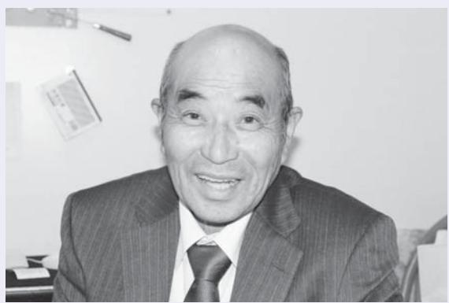

#### この時期の復興に向けた主な動き

- 地域防災計画の見直し開始(浪江町防災会議開催) H27. 5月
	- 平成27年度浪江町住民意向調査を実施 9月
	- 避難指示解除に向けた検証開始 (避難指示解除に関する有識者検証委員会開催) 9月
	- 浪江産米の販売再開 11月
	- 浪江浄化センター(下水処理施設)の復旧が完了 3月
	- 浪江町地域スポーツセンターが完成 3月
	- 避難指示解除に関する有識者検証委員会が検証結果とりまとめを報告 3月
	- 浪江町人口ビジョン、まち・ひと・しごと創生浪江町総合戦略を策定 3月

ॡֿƛ်ơૌ£ શơƗƝſƽDž ٢žƝƵơƞ

なみえ請戸川リバーライン桜まつりが本宮市で復活 (4月18日)(提供:本宮市)

郡山市に「コスモスふれあいセンター」がオープン (7月16日)

福島市に「あつまっぺ交流館」がオープン (5月23日)

### 日本福祉大学1年生の佐藤さんは、震災後に学校に通えなくなった経験を経て、特別支援学校の教師になりたいという目標に向かって頑張っています。これからやりたいことを笑顔で話すその姿から、しっかりとした強い意志と若いエネルギーが伝わってきました。(今回は役場二本松事務所でお話しを伺いました)

▲笑顔で話す佐藤まみさんのこれからが楽しみです

| そ | 障 | 学 | た | 校 | き | 言 | い | が |   | ま | と | 場 | い | 出 | で |   |  |
|---|---|---|---|---|---|---|---|---|---|---|---|---|---|---|---|---|--|
| れ | が | 部 | 。 | し | ま | 葉 | 、 | で | 避 | し | の | に | 家 | た | 、 | 震 |  |
| は | い | 心 | 現 | て | し | さ | な | き | 難 | た | 4 | 向 | 族 | 時 | 友 | 災 |  |
| 、 | 児 | 理 | 在 | 卒 | た | え | か | ず | 先 | 。 | 人 | か | は | に | だ | 当 |  |
| 自 | の | 臨 | 大 | 業 | が | 交 | な | 不 | の |   | で | っ | 無 | 地 | ち | 日 |  |
| 分 | 勉 | 床 | 学 | す | 、 | わ | か |   | 高 |   | 不 | た | 事 | 震 | と | は |  |
| が | 強 | 学 | で | る | 通 | せ | 外 | 登 | 校 |   | 安 | た | で | が | 食 |   |  |
| 経 | を | 科 | は | こ | 信 | な | に | 校 | で |   | な | め | し | 起 | 事 | 中 |  |
| 験 | し | で | 、 | と | 制 | い | も | に | は |   | 時 | 、 | た | き | を | 学 |  |
| し | て | 小 | こ | が | の | 辛 | 出 | な | 馴 |   | 間 | 祖 | が | ま | 終 | 校 |  |
| た | い | さ | ど | で | 高 | い | ら | っ | 染 |   | を | 父 | 両 | し | え | の |  |
| こ | ま | い | も | き | 校 | 日 | れ | て | む |   | 過 | 母 | 親 | た | て | 卒 |  |
| と | す | 子 | 発 | ま | に | が | ず | し | こ |   | ご | と | は | 。 | 店 | 業 |  |
| で | 。 | や | 達 | し | 転 | 続 | 、 | ま | と |   | し | 弟 | 職 | 幸 | を | 式 |  |

今住んでいるところは半島で海に囲まれています 。 ゼミで南海トラフについて考えてみようという活動をやっていて、一度スライドショーで講演をしました 。 次は大学で、震災から今までのことを講演したいと思っています 。 震災を経験しているからこそ伝えられることを愛知で広めていきたいと思っています 。 震災が起きたことで高校は楽しめなかったけど、震災がなかったら大学には行ってなかったと思います 。 だからチャンスをもらった、勉強させてもらったと考えています 。 充実感があって、今がとても楽しいです 。 将来の目標は、特別支援学校の教師になること、障がいを持っている子と携わっていくことです 。 自分が経験したからこそ言えることを伝えたいです 。 震災を経験した子はナイーブで、少しのことでも傷つきます 。 そういうところを支援していきたいと思っています 。 不登校だったけど、こうやってちゃんとやっていける人がいるから大丈夫だよ 。 今がダメでもきっと良くなる時があるから、いくらでも直せるから大丈夫だよと伝えたいです 。

### 浪江高校陸上部女子は、いつまでもいつまでも、ずっと仲良しです

今回は、東日本大震災・原発事故発生の直前、3月1日に卒業式を終えたばかりだった、平成 22年度浪江高校卒業生3人に集まっていただきました。この中の一人、岡裕美さんは、浪江のこころ通信第2号に登場しました。あれから4年経ち、20代になった女性たちに話を聞きました。 集まっていただいたのは、熊倉江理さんが住む茨城県水戸市。熊倉さんが長女の茉穂ちゃん(生後7か月)を連れてくることになり、梅まつりで賑わう偕楽園の眼前に広がる千波湖畔「好文cafe」でのインタビューとなりました。 まほ

| 習 、                          | 岡                                                   | で す | と も                                                   | で 開                                                   | 走 る                                                   | ネ ー                                                   | す 。                                                   | は 、                                              | 横 山                                              | 熊 倉                     | 横 山                                    | 岡                          | ◆ て 部 種 浪                                                                                                                                                                                     |
|---------------------------------|-----------------------------------------------------|--------|----------------------------------------------------------|----------------------------------------------------------|----------------------------------------------------------|----------------------------------------------------------|----------------------------------------------------------|-----------------------------------------------------|-----------------------------------------------------|----------------------------|-------------------------------------------|----------------------------|-----------------------------------------------------------------------------------------------------------------------------------------------------------------------------------------------------------|
| 練 習 で し た ね 。 | 毎 日 一 緒 に 、 と に か く 練 | 。      | か く 、 完 走 で き た の が 自 慢 | 催 さ れ た の で す が 、 成 績 は | こ と に な り ま し た 。 猪 苗 代 | ジ ャ ー も 含 め て 、 み ん な で | 陸 上 部 の 部 員 が 少 な く 、 マ | 2 年 生 の 時 の 高 校 駅 伝 で | 一 番 印 象 に 残 っ て い る の | 短 距 離 で す 。 | マ ネ ー ジ ャ ー で す 。 | 長 距 離 で す 。 | 目 く 活 江 を だ や 高 得 さ 学 校 意 い 校 陸 に の 上 し 思 部 て い で い 出 は ま も 、 し 聞 ど た か ん か せ ? な |

岡裕美さん福島市在住。今年からスノボを始めました!ライブに行ったりフェスに行ったり休みを楽しんでいます!

は全員浪江で、とにかく仲がい

いんです 。 今でも後輩も含めて

6 人くらいで旅行に行っていま

す 。 一昨年は那須、昨年は鬼怒

報

す

族

お

| い ま      | 就 職      | 伊 達      | 年 、      | 家 族      | 岡           | ◆ ね 告 川 聞 の 。 皆 と で           |  |
|-------------|-------------|-------------|-------------|-------------|-------------|----------------------------------------------------------|--|
| す 。      | し 、      | 市 内      | 仙 台      | と 一      | 私           | か こ さ 高 し せ と ん 校 た           |  |
| 今 、 と | リ ハ      | の 介      | の 専      | 緒 に      | は 福      | く 、 の や 。 だ 今 避 部 会           |  |
| て も      | ビ リ      | 護 老      | 門 学      | 住 ん      | 島 市      | さ の 難 活 う い 暮 の の と           |  |
| 忙 し      | の 仕 事 | 人 保 健 | 校 を 卒 | で い ま | に 避 難 | ら 様 話 、 し 子 に 専 な や な ら |  |
| い で す | を し      | 施 設      | 業 し      | す 。      | し て      | ど ご り 近 を 家 ま 況                     |  |
|             |             |             |             |             |             |                                                          |  |

、

昨

、

に

て

。

横山東沙さんいわき市在住。気心の知れた友人と旅行をするのが好きです。陸部との旅行では朝練は欠かせません(笑)

▲茨城県水戸市。千波湖畔にて

| く な た が 熊 れ い り 、 倉 て ふ 前 水 「 い る だ 戸 住 る さ っ も め の と た い ば で で 浪 い 都 と す す 江 」 が 。 は こ と 、 夫 、 ろ 言 い も 一 で い つ 言 つ す ま か っ し 。 私 て か 当 す | し 張 ょ る う 元 か 気 。 の 源 み た い な も の で | て い る か ら 、 私 も 頑 張 れ る 。 頑 | ま て っ い て ま い す ま が す 、 。 思 友 い だ 出 ち は が そ 頑 こ 張 で っ 止 | と 横 、 山 つ く 浪 づ 江 く に 思 は い 帰 ま れ す な 。 い と 思 っ | 熊 倉 年 月 の 経 つ の は 早 い な ぁ | で 精 い っ ぱ い で す 。 | た 。 毎 日 が 忙 し く 、 自 分 の こ と | 思 い 出 す こ と が 少 な く な り ま し | 横 山 あ の 日 の こ と は 、 最 近 は | ん な ふ う に 思 っ て い ま す か ? | ふ え る ま さ す と が 浪 、 江 あ に の 対 時 し の て こ 、 と 今 や ど 、 | ◆ ま も な く 4 度 目 の 3 ・ 11 を 迎 | で す 。 | て か ら は 、 子 育 て に 忙 し い 毎 日 | は 今 、 郡 山 市 で す 。 娘 が 生 ま れ | 日 に 合 わ せ て 越 し ま し た 。 実 家 | ま っ て い た の で 、 水 戸 に は 入 社 | そ れ か ら 仙 台 で し た 。 就 職 が 決 | 熊 倉 私 も 最 初 は 津 島 か ら 川 俣 、 |
|-------------------------------------------------------------------------------------------------------------------------------------------------------------------------------------------------------------------------------------------------------------------------------------------------------------------------------------------------------|----------------------------------------------------------------------------------------|--------------------------------------------------------------------|------------------------------------------------------------------------------------------------------------------------------------------|----------------------------------------------------------------------------------------------------------------------|---------------------------------------------------------------|-------------------------------------------|--------------------------------------------------------------------|--------------------------------------------------------------------|---------------------------------------------------------------|---------------------------------------------------------------|--------------------------------------------------------------------------------------------------------------------------------|---------------------------------------------------------------------|-------------|--------------------------------------------------------------------|--------------------------------------------------------------------|--------------------------------------------------------------------|--------------------------------------------------------------------|--------------------------------------------------------------------|--------------------------------------------------------------------|
|                                                                                                                                                                                                                                                                                                                                                       |                                                                                        |                                                                    |                                                                                                                                          |                                                                                                                      |                                                               |                                           |                                                                    |                                                                    |                                                               |                                                               |                                                                                                                                |                                                                     |             |                                                                    |                                                                    |                                                                    |                                                                    |                                                                    |                                                                    |

横山

津島から埼玉、栃木、新

潟と、結構点々としましたよ。 新潟で就職が決まりました。転勤し、今はいわき市に住んでいます。仕事は機械のメンテナンスを行う技術職で、現場での仕事が多いです。家族もいわき市

にいます。

| 仲 ば よ あ 岡 く ち し ゃ 私 て ん た い に ち た な は い っ こ で て れ す も か 。 、 ら ず も っ 、 と お | に す で 復 。 、 帰 そ 子 し れ ど た と も い 、 も で な 3 す る 人 。 べ は く 欲 早 し く い 仕 事 で | し い が 熊 横 と 多 ょ 倉 山 思 い う い ま の 私 か ま ず で の 。 す は 、 仕 私 。 娘 そ 事 は の れ は 三 無 ら 、 人 事 を 必 姉 な 制 要 妹 成 覇 な な 長 し 資 の で た 格 | ね そ 。 れ 岡 か 早 ら く 、 仕 結 事 婚 に も 慣 し れ た た い い で で す す 。 | ◆ ト ど 最 を 、 後 聞 こ に か れ 、 せ か 皆 て ら さ く に ん だ 向 の さ け 目 い た 標 コ 、 メ 夢 ン な | 気 郷 だ あ の が げ を ち 故 岡 し た つ で 郷 ま い な す 一 を す と い 。 緒 子 。 思 で 帰 ど に い く れ 遊 も ま れ な ぶ た す て い の ち 。 い け は に る れ 浪 も よ ど 江 見 う 、 の せ な 故 友 て |
|---------------------------------------------------------------------------------------------------------------------------------------------------------------------------------------|----------------------------------------------------------------------------------------------------------------------------------------------------------------------------------|----------------------------------------------------------------------------------------------------------------------------------------------------------------------------------------------------------------------------------------------------------------------------------------------------------|------------------------------------------------------------------------------------------------------------------------------------------|---------------------------------------------------------------------------------------------------------------------------------------------------------------------------------------|------------------------------------------------------------------------------------------------------------------------------------------------------------------------------------------------------------------------------------------------------------------------------------------------------------------------------------------------------------|
|---------------------------------------------------------------------------------------------------------------------------------------------------------------------------------------|----------------------------------------------------------------------------------------------------------------------------------------------------------------------------------|----------------------------------------------------------------------------------------------------------------------------------------------------------------------------------------------------------------------------------------------------------------------------------------------------------|------------------------------------------------------------------------------------------------------------------------------------------|---------------------------------------------------------------------------------------------------------------------------------------------------------------------------------------|------------------------------------------------------------------------------------------------------------------------------------------------------------------------------------------------------------------------------------------------------------------------------------------------------------------------------------------------------------|

■

む

を

て

ま

も

兄

ら

私

い

を

姉

の

ら

現在、井上さんは、大熊町から避難してきた妹さんと二人で神奈川県の市営アパートで暮らしています。 毎日声をかけていただくお友達に恵まれて、穏やかに暮らされているご様子でした。

▲右:妹の常盤ツメ子さん「姉は昔から、途中で投げ出さず、自分で頑張る努力家です」

義兄に感謝地震から 4 日後、神奈川に住義兄が甥と一緒に、ガソリン工面して悪路の中を迎えに来くれました 。 嬉しくて涙が出した 。 私たち姉妹とその子どや孫まで総勢 10 人ほどが、義の家に避難し一か月半ほど暮しました 。 着のみ着のままのたちのために、義兄の知り合の方 々 が毎日いろいろな品物届けてくださいました 。 実のは震災前に既に他界しているに、義兄はいつまでも縁を切ずにいてくれて、私たちに手

| 4 年 年 会 近 い く に こ 行 こ く で の 暮 も ら 楽 し し て み 、 で す す っ 。 | 暮 ら す 娘 も 毎 月 顔 を 見 に 来 て く | 旅 行 を 楽 し ん で い ま す 。 福 島 に | お 蔭 さ ま で 、 散 歩 や 買 い 物 、 | こ に あ る か わ か り ま せ ん( 笑 )。 | も で き ま し た 。 今 で は 、 杖 が ど | し た 。 散 歩 に 出 た こ と で 、 友 達 | い て 歩 い て 、 1 年 半 毎 日 歩 き ま | 心 で 、 歩 く こ と に し ま し た 。 歩 | 言 わ れ 、 迷 惑 を か け ら れ な い 一 | 「 歩 か な い と 歩 け な く な る 」 と | 安 な 気 持 ち で い ま し た 。 妹 か ら | ず れ 車 い す 生 活 に な る の か と 不 | 杖 を つ い て 歩 い て い た の で 、 い | こ こ に 来 た 時 は 、 家 の 中 で も | 耐 え ら れ て き た と 思 い ま す 。 | ま せ ん で し た 。 二 人 で い る か ら | 緒 に 暮 ら す こ と に な る と は 思 い | き 来 し て い ま し た が 、 ま さ か 一 | は 、 浪 江 に い た 時 に も 頻 繁 に 行 | 大 熊 町 か ら 避 難 し て い る 妹 と | と 妹 は こ こ で 暮 ら し て い ま す 。 | り 、 2 0 1 1 年 5 月 1 日 よ り 私 | 市 営 ア パ ー ト の 抽 選 に 当 た | ■ 人 も 気 候 も あ た た か い |  | を 差 し 伸 べ て く れ た こ と に 感 謝 |
|------------------------------------------------------------------------------------------------------------------------------------------|--------------------------------------------------------------------|--------------------------------------------------------------------|---------------------------------------------------------------|-----------------------------------------------------------------|--------------------------------------------------------------------|--------------------------------------------------------------------|--------------------------------------------------------------------|--------------------------------------------------------------------|--------------------------------------------------------------------|--------------------------------------------------------------------|--------------------------------------------------------------------|--------------------------------------------------------------------|--------------------------------------------------------------------|---------------------------------------------------------------|---------------------------------------------------------------|--------------------------------------------------------------------|--------------------------------------------------------------------|--------------------------------------------------------------------|--------------------------------------------------------------------|---------------------------------------------------------------|--------------------------------------------------------------------|--------------------------------------------------------------------|----------------------------------------------------------|-----------------------------------------------------|--|--------------------------------------------------------------------|
|                                                                                                                                          |                                                                    |                                                                    |                                                               |                                                                 |                                                                    |                                                                    |                                                                    |                                                                    |                                                                    |                                                                    |                                                                    |                                                                    |                                                                    |                                                               |                                                               |                                                                    |                                                                    |                                                                    |                                                                    |                                                               |                                                                    |                                                                    |                                                          |                                                     |  | し て い ま す 。                                         |

| い こ ま 浪 。 で す の 江 。 暮 で ら の し 思 を い 楽 出 を し み 大 た 切 に い と 、 | た き 林 た 、 公 。 懐 子 先 か 先 日 し 生 、「 く か ふ お ら き し お の ゃ 電 と べ 話 う り を 」 し い の ま た | 前 ろ し 後 ん 芸 の な 、 と こ と て と っ も を く 楽 や り し り 踊 い ま り 集 し 、 ま た 音 り 。 楽 で 15 と | 半 思 う し ま い 」 か で 出 に っ 、 で 通 た 人 す っ の 形 。 て で 作 週 い す り に た が 、 1 こ 、「 踊 回 と ふ り 、 が き 、 昼 一 の か 12 番 | れ ■ 野 が 浪 た 馬 江 く 追 で 思 や の い お 思 始 祭 い め り 出 て 、 い 老 ま 人 す 会 。 も | で あ 浪 か き り 江 り 、 ま に こ 気 す 帰 こ 候 が り の も 、 た 生 温 信 い 活 暖 頼 と に な で 思 慣 こ き っ れ の る た ま 地 友 こ し を 達 と た |
|-------------------------------------------------------------------------------------------------------------------------------------------------|--------------------------------------------------------------------------------------------------------------------------------------------------------------------------------------------------|--------------------------------------------------------------------------------------------------------------------------------------------------------------------------------------------------|---------------------------------------------------------------------------------------------------------------------------------------------------------------------------------------------------------------------------------------------------------------|-------------------------------------------------------------------------------------------------------------------------------------------------------------------|------------------------------------------------------------------------------------------------------------------------------------------------------------------------------------------------------------------------------------------------------------------|
| 思 こ                                                                                                                                          | し だ 小                                                                                                                                                                                      | し 人 い                                                                                                                                                                                      | く 時 の と                                                                                                                                                                                                                                              | 楽                                                                                                                                                                 | 離 も も 。                                                                                                                                                                                                                                                 |

## 森野俊惠さん・裕子さん(川添)

取材者:NPO法人ちば市民活動・市民事業サポートクラブ鍋嶋取材日:3月15日 「平成27年5月広報なみえ掲載」

いつか浪江に帰れる日が来ることを願い山梨県

俊惠さんの勤務地となった山梨での暮らしも 4年近くなり、今は、孫の祐輝くんの成長が楽しみという森野さん夫婦です。

▲左から裕子さん、娘の美恵さん、孫の祐輝くん、俊惠さん

私も妻も孫たちの面倒をみるこ

■ 大家族での暮らし震災前、我が家は、私たち夫婦と母、長女夫婦、次女、孫たちと総勢 10 人の大家族でした 。

> りました 。 震災がなかったら、

みんなで賑やかに暮らしていら

| し て い た 母 は 昨 年 12 月 に 亡 く な | 暮 ら し 、 山 形 の 福 祉 施 設 に 入 居 | で す 。 長 女 夫 婦 は 、 い わ き 市 で | と 次 女 、 孫 の 祐 輝 の 4 人 暮 ら し | に な り ま す 。 今 は 、 私 た ち 夫 婦 | 4 年 近 く 山 梨 で 暮 ら し た こ と | わ っ た の で 、 山 梨 に 来 ま し た 。 | 場 か ら 山 梨 工 場 に 勤 務 地 が 変 | に 日 立 パ ワ ー デ バ イ ス 南 相 馬 工 | と 避 難 し ま し た 。 そ の 後 、 5 月 | て 、 栃 木 、 千 葉 、 い わ き と 転 々 | い て す ぐ に 、 車 2 台 に 分 乗 し | で 、 妻 と 娘 た ち は 避 難 指 示 を 聞 | 何 よ り 幼 い 孫 た ち の こ と が 心 配 | 母 の こ と も 気 に な り ま し た が 、 | シ ョ ー ト ス テ ィ し て い ま し た 。 | 震 災 の 時 、 母 は 近 く の 施 設 に | ■ 山 梨 に 来 て |   | し ば し ば や り ま し た 。 | 会 の 仲 間 の 飲 み 会 も 我 が 家 で 、 | 獣 駆 除 を し て い ま し た が 、 猟 友 | は 猟 が 趣 味 で 、 猟 友 会 に 入 り 害 | 帰 っ て い く よ う な 家 で し た 。 私 | り 、 新 聞 を 見 て お 茶 を 飲 ん で | 人 が 「 こ ん に ち は 」 と 立 ち 寄 | と 言 っ て 遊 び に 来 た り 、 近 所 の | が 、 学 校 帰 り に 「 た だ い ま ! 」 | と が 楽 し み で し た 。 孫 の 友 だ ち |
|---------------------------------------------------------------------|--------------------------------------------------------------------|--------------------------------------------------------------------|--------------------------------------------------------------------|--------------------------------------------------------------------|---------------------------------------------------------------|--------------------------------------------------------------------|---------------------------------------------------------------|--------------------------------------------------------------------|--------------------------------------------------------------------|--------------------------------------------------------------------|---------------------------------------------------------------|--------------------------------------------------------------------|--------------------------------------------------------------------|--------------------------------------------------------------------|--------------------------------------------------------------------|---------------------------------------------------------------|----------------------------|---|------------------------------------------------|--------------------------------------------------------------------|--------------------------------------------------------------------|--------------------------------------------------------------------|--------------------------------------------------------------------|---------------------------------------------------------------|---------------------------------------------------------------|--------------------------------------------------------------------|--------------------------------------------------------------------|--------------------------------------------------------------------|
| の                                                                   | を                                                                  | 話                                                                  | 思                                                                  | 帰                                                                  | 言                                                             |                                                                    | て                                                             | も                                                                  | り                                                                  | り                                                                  | 山                                                             | 妻                                                                  | ま                                                                  | ま                                                                  | 人                                                                  | て                                                             | 家                          | い | ま                                              | シ                                                                  |                                                                    | ■                                                                  |                                                                    | え                                                             | 必                                                             | 誘                                                                  | こ                                                                  | ね                                                                  |

| を 馳 せ て 暮 ら し て い ま す 。 | い ま す 。 今 は 、 帰 れ る 日 | の 役 に 立 て る 年 齢 の う ち | を 活 か し 害 獣 駆 除 を す る | 話 に な る だ け で は な く 、 | 思 っ て い ま す 。 た だ し 、 | 帰 れ る 時 が 来 た ら 帰 り た | 言 っ て い ま す が 、 私 た ち | 娘 た ち は 、 も う 帰 ら な | て し ま い ま す 。 | も 、 た だ 歩 く だ け の こ と | り が で き ま し た 。 散 歩 と | り も で き 、 川 に 行 け ば 、 | 山 に 行 け ば 、 散 歩 が て ら | 妻 と 二 人 で よ く 散 歩 し ま | ま す 。 浪 江 に 住 ん で い た | ま し た が 、 浪 江 と は 風 景 | 人 た ち に と て も よ く し て | て い ま す 。 山 梨 に 来 て 、 | 家 に い る こ と に な り 、 寂 | い ま す の で 、 日 中 は 妻 が | ま す 。 次 女 も 同 じ 工 場 で | シ ニ ア 社 員 と し て 今 も 働 | 私 は 、 日 立 パ ワ ー デ バ | ■ 散 歩 道 が 違 う | え や め ま し た 。 | 必 要 が あ り 、 帰 る 時 の こ | 誘 わ れ ま し た が 、 住 民 票 | こ ち ら の 猟 友 会 に 入 ら な | ね 。 山 梨 に 来 て し ば ら く | れ た の に と 思 う と 悔 し |
|----------------------------------------------------------|-----------------------------------------------------|-----------------------------------------------------|-----------------------------------------------------|-----------------------------------------------------|-----------------------------------------------------|-----------------------------------------------------|-----------------------------------------------------|------------------------------------------------|---------------------------------|-----------------------------------------------------|-----------------------------------------------------|-----------------------------------------------------|-----------------------------------------------------|-----------------------------------------------------|-----------------------------------------------------|-----------------------------------------------------|-----------------------------------------------------|-----------------------------------------------------|-----------------------------------------------------|-----------------------------------------------------|-----------------------------------------------------|-----------------------------------------------------|------------------------------------------------|---------------------------------|---------------------------------|-----------------------------------------------------|-----------------------------------------------------|-----------------------------------------------------|-----------------------------------------------------|------------------------------------------------|
|                                                          | に 思 い                                         | に と 思                                         | 等 、 人                                         | 猟 の 腕                                         | 人 の 世                                         | い と                                              | 夫 婦 は                                         | い と                                         |                                 | に な っ                                         | い っ て                                         | ア ユ 獲                                         | 山 菜 取                                         | し た 。                                         | 頃 は 、                                         | が 違 い                                         | も ら い                                         | 周 囲 の                                         | し が っ                                         | 一 人 で                                         | 働 い て                                         | い て い                                         | イ ス で                                    |                                 |                                 | と を 考                                         | を 移 す                                         | い か と                                         | し て 、                                         | い で す                                    |

ơƆƆǀࢉႜ§اࣰ **再取材シリーズ**

取材者:浪江町役場三瓶・中川取材日:4月2日 「平成27年5月広報なみえ掲載」

### またあの場所で、浪江の空の下で、みんなに会いたい

今年3月に新曲「いつかまた浪江の空を」をリリースし、充実した音楽活動を展開中の牛来さん。前回の「こころ通信」ご登場は3 年前のことです。先般、活動を通じて集めた義援金を役場にお持ちくださった際に(p10参照)、いまの想いを伺いました。

牛来さんオフィシャルウェブサイトhttp://mica-gorai.jimdo.com/

| 「 の 帰 悔 ら し な さ い が の 加 ? わ 」 っ と て 聞 い か ま れ す る 。 ん よ で く | ! 」 と 思 い な が ら 作 り ま し た 。 変 | ら ! み ん な の 気 持 ち を 歌 う か      | 、「 み ん な 待 っ て て 、 い ま 歌 う | 曲 | に く                                                        | こ と が わ か っ た と き 、 こ ん な こ | 震 災 後 、「 家 に 帰 れ な い 」 と い               | だ き ま し た 。 | 上 を こ の た び 町 に 寄 付 さ せ て い | グ ッ ズ の 販 売 も 始 め 、 1 年 間 の | 始 し ま し た 。 合 わ せ て オ リ ジ ナ | も | で 呼 ん で い た だ く こ と が 増 え 、 | そ の 後 は 様 々 な イ ベ ン ト に ゲ ス | 町 で 生 ま れ 育 っ た 。」 で す 。 | 浪 | て 。 震 災 の 3 日 後 に 携 帯 に つ | ら こ そ 音 楽 や ら な い か 、 と 言 わ | だ | ス                                                             | で                                                             | し                                                        | し た が 、 腰 を 据 え て 曲 作 り に 取 | 前 か ら ラ イ ブ ハ ウ ス で 歌 っ て い | 震 | を                                                             |                                                               | ■ み ん な 待 っ て て ! と 思 い な が ら                |
|----------------------------------------------------------------------------------------------------------------------------------------------------|-------------------------------------------------------------------------|--------------------------------------------------------------------|----------------------------------------------------------------|---|---------------------------------------------------------------|--------------------------------------------------------------------|------------------------------------------------------------------------------|----------------------------|--------------------------------------------------------------------|--------------------------------------------------------------------|--------------------------------------------------------------------|---|--------------------------------------------------------------------|--------------------------------------------------------------------|-----------------------------------------------------------|---|---------------------------------------------------------------|--------------------------------------------------------------------|---|---------------------------------------------------------------|---------------------------------------------------------------|----------------------------------------------------------|--------------------------------------------------------------------|--------------------------------------------------------------------|---|---------------------------------------------------------------|---------------------------------------------------------------|----------------------------------------------------------------------------------------|
|                                                                                                                                                    |                                                                         | ら そ の と き の 悔 し さ は 、 今 で も | か                                                              | は | は 音 楽 し か な か っ た 。 最 初 の | し く て 。 そ の 気 持 ち を 伝 え る      | 悔 と う が 起 こ る な ん て 、 も う と に か |                            |                                                                    |                                                                    |                                                                    |   | 年 3 月 か ら は ワ ン マ ン ラ イ ブ      |                                                                    | た 売 ル 開 昨 ト                                |   | っ た 詩 に 音 楽 を 付 け た の が 「 |                                                                    |   | 店 長 さ ん か ら 、 こ う い う と き | 。 お 世 話 に な っ た ラ イ ブ ハ ウ | フ ァ ー ス ト ア ル バ ム が 最 初 | 組 ん だ の は 、 震 災 の 翌 年 に 出      |                                                                    |   | め た の は 小 学 生 の 頃 で し た 。 | 詩 を 書 い た り 作 曲 ら し い こ と | 江 づ れ か の す た り ま 災 始 作 っ た 最 初 の 曲 |

すよ 。 帰れないという状況にあることすら知られていない 。 ライブでは、浪江の現状をお話しするほか、毎日の当たり前の幸せをどうか忘れないでください、という話もしています 。 ■ 今の自分にできることを私のライブを聞いて、今の自分にできることをしようと思った、と言っていただけるのがいちばんうれしいですね 。 その際、浪江のため、被災地のために何ができるか考えるのも大事ですけど、具体的にはなかなか難しいと思います 。 だから、「 できること 」 というのは、( 被災地の困難な状況を ) 自分に置き換えて考えるということだと思うんです 。 目の前にある課題から逃げないこと 。 諦めず、ひとつずつ悩み苦しみを乗り越えていくこと 。 それも大震災から学べることのひとつではないでしょうか 。 今年 3 月にリリースした 「 いつかまた浪江の空を 」 は、文字通り 「 あの空の下で、またみんなに会いたい 」 という想いを込めた歌です 。 海がそのまま反射しているような浪江の空は、とにかくきれい 。 生まれ育ったあの空の下で、またみんなに会いたい 。 そうなんですよ、浪江町で会いたい 。

他所じゃだめなんです 。 あの場所でなければ 。 ■ あきらめる理由はない現実的には、避難指示が解除されてもみんなが戻るのは難しいと思います 。 私もやはり、小学生の娘のことをまず考えますから、 「 帰りたいけど帰れない 」 状態は変わらないでしょう 。 でも、想像はしますね 。 将来は浪江に帰って浪江から発信することもできるかなと 。 これまで築いてきた音楽のネットワークを生かして、たとえば 3 月 11 日に浪江と中継をつなげて各地で同時ライブをやるとか 。 そういう 「 妄想 」 はいっぱいありますよ 。 あきらめる理由はないって思うんです 。 難しい現実はあるけど、そこにみんなが存在していた、もう一度その姿を見てみたい、あの場所でまたみんなに会いたいという想いに、叶うのかどうか ? という問いは要らないと思っています 。 ◀ご来庁いただいた日は、牛来さんの笑顔のご来庁いただいた日は、牛来さんの笑顔のような、気持ちいのいい晴天でした。 ような、気持ちいのいい晴天でした。 ◀ご来庁いただいた日は、牛来さんの笑顔のような、気持ちのいい晴天でした。

菅野さんは南相馬市小高区生まれ。20歳の時から東京で美容師の修業をされ、浪江で就職。同じ美容師の妻、真里子さんと、平成元年から震災前まで美容室『かぐや姫』を経営。さらに平成21年から、釣りの趣味と寿司職人だった10代の頃の経験を活かし、居酒屋『真釣り』も営んでいました。老後、悠々自適に暮らすための準備として、自宅に程近い所に店を開いたとのことです。 まつ

現在は、真里子さんと、元気に働く次女の3人で福島市笹谷東部仮設住宅にお住まいです。

|                                                                    | と も あ り 、 遠 く ま で の                          | 崩 し 、 震 災 の 翌 |
|--------------------------------------------------------------------|-------------------------------------------------------------------------|---------------------------------|
|                                                                    | 移 動 は 無 理 だ と 判 断 し                          | が ら 浪 江 に 帰 る |
|                                                                    | て 南 相 馬 市 小 高 区 の 叔                          | り ま し た 。           |
|                                                                    | ▲菅野信雄さんと真里子さん。「焦っても仕方ないよ」と 母 の 家 に 避 難 し ま し |                                 |
|                                                                    | た 。 3 日 目 、 小 高 区 に                          | ■ 避 難 も こ こ ま |
|                                                                    | も 避 難 命 令 が 出 て 、 原                          | び り 構 え る こ      |
|                                                                    | 町 区 の 「 ゆ め は っ と 」                          | 震 災 当 初 は 、      |
|                                                                    | に 行 き ま し た 。 4 日 目                          | え 、 ゼ ロ か ら 再 |
|                                                                    | か ら 宮 城 県 の 実 兄 の 家                          | 考 え ま し た が 、 |
|                                                                    | に 3 週 間 世 話 に な っ た                          | 考 え る と あ ま り |
|                                                                    | 笑っていらっしゃいました。 後 、 東 和 町 の 避 難 所 で         | き く 、 今 の こ の |
|                                                                    | 5 日 間 を 過 ご し 、 さ ら                          | と に し ま し た 。 |
|                                                                    | に 猪 苗 代 町 の ヴ ィ ラ ホ                          | 美 容 師 を し て い |
|                                                                    | テ ル に 約 3 か 月 滞 在 し                          | と こ ろ 福 島 に は |
|                                                                    | ま し た 。 7 月 に 今 の 笹                          | の で 、 今 後 は 福 |
|                                                                    | 谷 東 部 仮 設 住 宅 に 入 居                          | 住 宅 で 暮 ら す こ |
| ■ 残 念 な の は 、 一 緒 に 避 難 し た | し ま し た 。                                                   | す                               |
| 母 の 死                                                        | 福 島 市 に 来 た 当 初 は 、 県 が 実           | 浪 。 江 町 に は お    |
| 5 年 前 、 大 地 震 が 起 き た 時           | 施 す る ホ ー ル ボ デ ィ カ ウ ン タ ー      | 参 り 、 一 時 期 帰 |
| は 、 居 酒 屋 の 仕 込 み が 終 わ り 、 | 測 定 の ア ル バ イ ト で 、 1 年 半 ほ      | と が あ り ま す が |
| 休 憩 中 の 出 来 事 で し た 。 あ ま り | ど 添 乗 員 を 務 め ま し た 。 今 は 妻      | だ 進 ん で お ら ず |
| の 揺 れ に 立 っ て い ら れ ず 、 た だ | と 二 人 、 こ の 家 で の ん び り と そ      | は で き な い で      |
| 茫 然 と 地 震 が 収 ま る の を 待 つ だ | れ ぞ れ の 趣 味 を 楽 し ん で い ま           | も 、 い つ か 遠 い |
| け で し た 。 そ の 日 の 夜 は 服 を 着 | す 。 妻 は 小 物 づ く り な ど の 手           | 環 境 に 近 づ き 、 |
| た ま ま 、 い つ で も 外 に 飛 び 出 せ | 芸 、 私 は ペ ー パ ー ク ラ フ ト を           | で 釣 り が で き た |
| る 格 好 で 床 に 就 き ま し た が 、 母 | 習 っ た り し て い ま す 。 最 近 、 テ      | だ ろ う と 思 い ま |
| と 私 た ち 夫 婦 、 次 女 と 家 族 4 人 | ニ ス も 始 め ま し た 。 週 2 回 で す      |                                 |
| 眠 れ な い ま ま で し た 。                     | が 、 浜 通 り か ら 避 難 さ れ て い る      |                                 |
| 翌 日 、 避 難 命 令 が 出 ま し た           | メ ン バ ー も い ま す 。                               |                                 |
| が 、 年 老 い た 母 が 一 緒 と い う こ | ま た 、 母 は 心 労 か ら か 体 調 を           |                                 |
|                                                                    |                                                                         |                                 |

崩し、震災の翌年 1 月、残念な

ことなく亡くな

で来たら、のん

とに

避難先で店を構

出発することも

私たちの年齢を

にもリスクが大

生活を楽しむこ

ましてや東京で

る長女は、今の

戻らないような

島市の復興公営

とを考えていま

彼岸やお盆の墓

宅などで帰るこ

、除染はまだま

、帰っても生活

しょう 。 けれど

日に人が住める

あのきれいな海

らどんなにいい

す 。

震災前は、富岡と浪江で写真館㈱サンフォートを経営していた桝井さんご夫婦。神奈川県の教会関連の住宅に避難し、愛犬と一緒に穏やかな暮らしを送っています。

▲桝井さんご夫婦と愛犬のナナ

| し | 卒 | コ |   |   | ■ |  |
|---|---|---|---|---|---|--|
| た | 業 | ン | 震 | ま | 現 |  |
| 。 | ア | ピ | 災 | し | 像 |  |
| 浪 | ル | ュ | 前 | た | 所 |  |
| 江 | バ | ー | は |   | と |  |
| 町 | ム | タ | 、 |   | 写 |  |
| と | の | ー | 写 |   | 真 |  |
| 富 | 制 | 画 | 真 |   | 館 |  |
| 岡 | 作 | 像 | の |   | を |  |
| 町 | を | 処 | 現 |   | 経 |  |
| に | し | 理 | 像 |   | 営 |  |
| 店 | て | 、 | 処 |   | し |  |
|   |   |   |   |   |   |  |

「アドベンチスト福祉会」機関誌の表紙に

え、長女

フ、私た

で働いていました 。 双葉郡内と

|--|

教師を目指して、邁進中!

この春から大学生となり、東北学院大学へ通い始めた小野田さん。美里町から仙台の泉キャンパスまで通学時間は2時間余り。ちょうど大学の講義が午後からという日に、キャンパスの近くでお話を伺いました。

| し く | 免 許 | 体 を | 今      | を 鍛 | 習 の | や っ | の 毎 | け ら | ン ド | し た | ぞ 」 | た け | た 。 | て 、 | 中 学 | 東      | ■ 野 |
|--------|--------|--------|--------|--------|--------|--------|--------|--------|--------|--------|--------|--------|--------|--------|--------|--------|--------|
| な      | を 取 | 動 か | は      | え て | あ      | て      | 日      | れ      | リ      | 。      | っ      | ど      | 自 分 | 小      | 3      | 日      | 球 一 |
| い と | り      | し      | 大 学 | い      | と 、 | 、 野 | 。 夏 | ま し | ー に | 学 校 | て あ | 「 最 | は      | 牛 田 | 年 に | 本 大 | 直      |
| こ ろ | た い | て い | の サ | ま し | 走 り | 手 の | 頃 か | た 。 | 接 し | の 友 | と か | 初 は | そ ん | 中 学 | な る | 震 災 | 線 の |
| で      | の で | ま す | ー      | た      | 込      | バ      | ら      | 高      | て      | 達      | ら      | ガ      | な 風 | 校      | 時      | が      | 10     |
| 野 球 | 、      | 。      | ク ル | ね 。 | み を | ッ テ | ピ ッ | 校 は | く れ | が と | 親 に | チ ガ | に      | に 転 | に 美 | あ り | 年      |
| も      | そ ん | 自 分 | で      |        | し      | ィ      | チ      | 野      | た      | て      | 言      | チ      | 感 じ | 入      | 里      | 、      |        |
| や り | な に | は 教 | 週 1 |        | て 足 | ン グ | ャ ー | 球 漬 | の で | も フ | わ れ | だ っ | な か | し ま | 町 に | そ の |        |
| た      | 忙      | 員      | 、      |        | 腰      | 練      | を      | け      | 助      | レ      | ま      | た      | っ      | し      | 来      | 春      |        |

加者の一人

ました 。 福

災 3 県の高

象で、最終

た復興企画

ンしたんで

ちで行った

興について

れました 。

学の教師

時に小学 1

った子に震

とになる 。

らなくて、

うと思うん

こと、浪江

▲人懐っこそうな笑顔が印象的な小野田さん

いのでサークルに入りました 。 自分はもちろん楽天ファンです 。 大学の入学式が終わってから、午後の楽天の試合を母と二人で観に行きました 。 野球をやっていた身としては、横山投手が活躍している姿は嬉しいです 。 自分は小学 3 年から野球を始めたんですけど、少年野球で当時中学生の横山さんが投げてくれたんです 。 球早くて打てなかったですけど( 笑 )。 その時からズバ抜けていました 。 ■ 教えることの楽しさ大学が始まって朝が早いです 。 8 時 50 分が 1 講目なので、 5 時半に起きて、家を 6 時半に出て、キャンパスに着くのが 8 時半頃 。 家から電車、地下鉄、バスを乗り換えて通っています 。 はっきりと教員を目指そうと思ったのは中学 2 年ですね 。 少年野球の監督をやっていた父親の姿を見ていて、俺も人に何か教えることが好きだったんです 。 数学が得意なので、それを生かして教員を目指すのもありかなと、そこから思い始めました 。 人に教えるのが楽しくて、解ってもらえた時の嬉しさがあるんです 。 ■ 教師になって、胸張って高校 3 年の時、先生に声をかけてもらって 「 ビヨンドトゥモロー東北未来リーダーズサミット 2 0 1 4 」 に応募しました 。 2 5 0 人くらい応募があったよ

うですが、 56 人の参に 。 自分はついてい島、宮城、岩手、被校 1 年 〜 3 年生が対的に自分たちが考えをプレゼンテーショす 。 初めは軽い気持んですけど、震災復ものすごく考えさせらもし自分が高校か中になったら、震災の年生とか幼稚園児だ災のことを伝えるこ何があったのか分か今に至っているだろです 。 しかも地元ののこととか、全然分からない子もいると思うので、自分が教師になったら、教えていくのもありじゃないかと、考えるようになりました 。 自分は地元のことは忘れられないですね 。 生まれてからずっといたので 。 「 自分は浪江町民だ 」 って胸張って言っていきます 。 〈参考〉

●「ビヨンドトゥモロー」とは、東日本大震災により被災した若者のリーダーシップ教育支援プログラムのこと。

- ●小野田さんが参加した『ビヨンドトゥモロー東北未来リーダーズサミット 2014』の様子は、YouTube(141011-13_BT_ リーダーズサミット)の動画で見ることができます。またホームページ (http://beyond-tomorrow.org/program/past-program/tfls2 014/)より、報告書(PDF)をダウンロードできます。

ふるさとへの思いと人々への祈りを込めて、川添神楽、新たな出発

▲4月18日に本宮市で行われた「しらさわ桜まつり~復活! 桜と花火の競演請戸川リバーライン桜まつり~」で披露されました。

| ら 5 年 が 経 っ て 、 歳 と 共 に 体 力 | 神 楽 を や っ て い ま し た 。 震 災 か | 門 馬 20 代 前 半 か ら 盆 踊 り と か | と 思 っ て い た ん で す 。                     | む こ と が で き な い か っ て 、 ず っ | け と い う か 、 何 か 一 緒 に 取 り 組 | じ 境 遇 の 仲 間 と 集 ま れ る き っ か | 田 澤 避 難 し て い て 、 地 域 の 同      | 会 し て 、 声 を か け ら れ ま し た 。 | 川 添 で 門 馬 さ ん と 田 澤 さ ん に 再 | た で す ね 。 で も 偶 然 に 、 し か も | ん で し ま い 、 人 に 会 い た く な か っ | 石 澤 震 災 後 、 気 持 ち が 落 ち 込      |                                                               | い て 、 聞 か せ て く だ さ い | 会 ) に 参 加 し た き っ か け に つ      | ◆ 浪 江 町 川 添 芸 能 保 存 会 ( 以 下 、 |
|--------------------------------------------------------------------|--------------------------------------------------------------------|----------------------------------------------------------------|--------------------------------------------------------------------|--------------------------------------------------------------------|--------------------------------------------------------------------|--------------------------------------------------------------------|--------------------------------------------------------------------|--------------------------------------------------------------------|--------------------------------------------------------------------|--------------------------------------------------------------------|-------------------------------------------------------------------------|--------------------------------------------------------------------|---------------------------------------------------------------|-----------------------------------------------------|--------------------------------------------------------------------|-------------------------------------------------------------------------|
|                                                                    | や っ て い き た い と 思 い ま す 。      | の つ な が り を 大 事 に 、 楽 し く  | 震 災 後 、 再 び 集 ま れ た の で 、 こ | れ よ 」 っ て 言 わ れ て い ま し た 。 | 震 災 前 、 保 存 会 に は 「 来 年 は 入 | 佐 藤 今 日 が 初 稽 古 な ん で す 。      | な と 思 っ て 参 加 を 決 め ま し た 。 | ん な に 喜 ん で も ら え た ら 嬉 し い | い た 時 、 仮 設 住 宅 を 廻 っ て 、 み | ん か ら 再 開 し た い と い う 話 を 聞 | 一 切 無 く な っ て し ま い 、 石 澤 さ      | が 楽 し か っ た ん で す よ 。 そ れ が | 伴 場 震 災 前 、 神 楽 を す る こ と | し く な る と 思 い ま し た 。 | 今 や ら な き ゃ 復 活 さ せ る の は 難 | が 落 ち 、 年 月 が 経 つ に つ れ て 、      |

明治40年頃、修行を積んだ地元の神楽の名人が村人に披露したのが始まりとされ、脈々と受け継がれてきた獅子神楽。正月に悪魔祓いや豊年万作の祈願をしながら舞い歩くこの伝統芸能は、踊り手(前かぶりと、「尻尾持ち」と呼ばれる後かぶりの2名)と、横笛や太鼓などの囃子方で編成され、川添地区の住民の方々が代々務めてきたそうです。

震災以前から神楽を行ってきた40代の男性たちが中心となり、新たに結成されたのが「浪江町川添芸能保存会」です。東日本大震災と原発事故からの避難によって地区の人々が離散してしまった中で、ふるさとの伝統芸能を再び継承することによって、人と人をつなぎ、ふるさとの記憶を風化させない活動が始まりました。 今年の元旦に県北地域の仮設住宅数か所でお披露目を行い、4月18日に本宮市で開催される 「しらさわ桜まつり」では一般の方々にも披露されました。

▲笛の担当(豊永和洋さん)がもう一人いらっしゃるそうですが、残念ながらこの日は欠席でした。

▲取材当日、初めての話が飛び出したり、それぞれの思いが語られたり、賑やかなインタビューとなりました。

伴場裕史さん福島市在住。

佐藤篤さん福島市在住。

田澤義秀さん宮城県仙台市在住。

門馬和彦さん福島市在住。

石澤孝行さん西白河郡西郷村在住。

◆ 今年の正月、元旦に初披露を

された時の感想や、エピソー

ドを聞かせてください

伴場

ちの笑顔が印象的でした 。 浪江

の人たちが一か所に集まってい

るだけで、その空間、空気が心

地良かったです 。

田澤

再開

頂け

方 々

> 方 々 が

喜んで集まってくださった人た

▲かなりの体力を要する獅子神楽。 「幕舞」「幣束舞」「鈴舞」「乱獅子」の 4種が演じられます。

川添のでくれました 。 門馬川添に自分は居たんだな、という感慨がありました 。 石澤初披露に向けて、浪江町の仮設住宅自治会を全部訪ねました 。 津波の被

|                                      |             |                  |                  |             |             | も 本 当 に 喜 | た こ と が 一 | を 祝 っ て く | 獅 子 神 楽 |
|--------------------------------------|-------------|------------------|------------------|-------------|-------------|-----------------------|-----------------------|-----------------------|------------------|
| の 向 仮 け 設 て 住 、 | 石 澤 初 | が あ り ま | な 、 と い | 分 は 居 | 門 馬 川 | ん で く れ      | 番 で す 。      | だ さ り 、      | の O B の |

| り 保 言 て は る も 江 代 出 会 代 石 も 存 っ 失 と 巡 の の 会 し 前 い 澤 復 会 て く 思 り 時 育 い て 半 ま 活 で い し っ 会 計 成 は く の 本 す さ や な て て え は は 少 れ 若 日 。 せ 初 っ か は い る 止 不 な そ 者 そ た て っ な ま 人 ま 可 い う が 参 れ い い た ら す と っ 欠 で で 数 加 か ん の た け ぬ し は て で す す 名 ら で も 、 き い す が 。 、 佐 川 れ す 、 添 ど の 伝 っ ま 。 、 若 今 藤 。 今 君 の 、 と 統 と す 今 次 者 年 ま 、 の と は と 盆 前 思 芸 会 。 20 踊 の で っ 能 え で 浪 世 の 入 | ◆ か を を 会 せ 描 目 の て い 指 活 く て し 動 だ い た を さ ら い 通 い っ か し し 、 て ゃ ど ど る ん ん か な な 、 明 こ 聞 日 と | た 人 も 気 気 た そ に た ま ま 理 月 害 ら と 家 持 づ か う も ち し な が 気 を い 事 つ 分 受 話 の ち き っ い い が た い す 外 の ま た う ろ 笑 。 情 い に け と き に 整 し と み ん っ 獅 が て な た 思 っ 出 理 た い ん な た 子 あ い れ 地 っ か て が 。 う な 顔 り 神 っ な な 域 て け 来 つ 神 こ の が 泣 楽 て い い な い に て い 楽 と 顔 あ い を 8 な 、 ど ま な く て を に や り た 見 か ど 気 は す っ れ い 通 、 光 ま り て 所 、 持 、 。 た た な し 改 景 し 、 子 に さ ち ま り り い て め が た 大 ど な ま の だ し 、 人 、 て 見 。 人 も り ざ 整 正 |
|-------------------------------------------------------------------------------------------------------------------------------------------------------------------------------------------------------------------------------------------------------------------------------------------------------------------------------------------------------------------------------------------------------------------------------------------------------------------------------------------------------------------------------------------------------------------------------------------------------------------------------------------------------------------------------------------------------------------------------------------------------------------------------------------------------------------------------------------------------------------------------------------------------------------------|-----------------------------------------------------------------------------------------------------------------------------------------------------------------------------------------------------------------------------------------|--------------------------------------------------------------------------------------------------------------------------------------------------------------------------------------------------------------------------------------------------------------------------------------------------------------------------------------------------------------------------------------------------------------------------------------------------------------------------------------------------------------------------------------------------------------------------------------------------------------------------------------------------------------------------------------------------------------------------------------------------------------------------------------------------------------------------------------------------------------------------------------------------------------------------------------------------------------------------------------------------------|
|-------------------------------------------------------------------------------------------------------------------------------------------------------------------------------------------------------------------------------------------------------------------------------------------------------------------------------------------------------------------------------------------------------------------------------------------------------------------------------------------------------------------------------------------------------------------------------------------------------------------------------------------------------------------------------------------------------------------------------------------------------------------------------------------------------------------------------------------------------------------------------------------------------------------------|-----------------------------------------------------------------------------------------------------------------------------------------------------------------------------------------------------------------------------------------|--------------------------------------------------------------------------------------------------------------------------------------------------------------------------------------------------------------------------------------------------------------------------------------------------------------------------------------------------------------------------------------------------------------------------------------------------------------------------------------------------------------------------------------------------------------------------------------------------------------------------------------------------------------------------------------------------------------------------------------------------------------------------------------------------------------------------------------------------------------------------------------------------------------------------------------------------------------------------------------------------------|

| き き 若 待 川 ら を く て な 活 ら ぐ 無 た 子 る し 多 巻 門 田 石 た ち い い さ る 者 添 精 わ が 動 い 者 く い ど き ょ 感 馬 澤 澤 に と い た き 限 や に 一 か り し い へ な 。 も 込 。「 な な の で い た り 子 先 み 杯 り 自 で た か 浪 ら そ た み 会 年 浪 っ 印 す と い 川 ど 行 ん や ま 分 す い を 江 な し ち た の 頃 江 て 象 ね い と 添 も き な り せ 自 が で 、 を い て へ い 活 に 田 も 」 。 う 思 神 た は が た ん 身 、 す 一 遺 よ 、 こ と 動 避 畑 忘 と 夢 っ 楽 ち 不 戻 い 。 、 こ 。 緒 す う 浪 の 思 に 難 を れ は て い を と 透 っ で 今 先 の 今 に に に 江 活 っ 子 耕 な し あ い う 継 一 明 て す で の 思 は 考 は 、 が 動 て ど し い り ま て 名 承 緒 で 来 。 き こ い 小 え ど 浪 地 を い も な よ ま す い 前 60 し に す る る と を さ な う 江 図 発 ま た が う す 。 る や て 、 が の 歳 こ は 広 な が し を か 信 す ち ら に 。 い で 、 を く と よ げ つ ら た 継 ら し ふ で 。 を 、 、 | い 姿 た た 動 川 と な 伴 佐 ま 添 を ば い す に い 場 藤 す で 見 か で る 戻 よ 。 や せ り す こ 今 る う 避 り て で 。 と の こ に 難 た や 、 実 が メ と し 先 い り 父 は 楽 ン が た で で た と 子 し バ で い も す い し ど い ー き で 伝 。 と て も か と た す 統 も 格 が ら 一 ら 。 を 思 好 生 、 緒 、 ふ 絶 っ い ま 続 に ま る や て い れ け 活 た さ さ |
|-------------------------------------------------------------------------------------------------------------------------------------------------------------------------------------------------------------------------------------------------------------------------------------------------------------------------------------------------------------------------------------------------------------------------------------------------------------------------------------------------------------------------------------------------------------------------------------------------------------------------------------------------------------------------------------------------------------------------------------------------------------------------------------------------------------------------------------------------------------------------------------------------------------------------------------------------------------------------------------------------------------------------------------------------------------------------------------------------------------------------------------------------------------------------------------------------------------------------------------------------------------------------------------------------------------------------------------------------------------------------------------------------------------------------------------------------------------------------------------------------------------------------------------------------------------------------------------------------------------------|------------------------------------------------------------------------------------------------------------------------------------------------------------------------------------------------------------------------------------------------------------------------------------------------------------------------------------------------------------------------------------------------------------------------------------------------------------------------------------------------------------------------------------------------------------------------------------------------------------------------------------------|
|-------------------------------------------------------------------------------------------------------------------------------------------------------------------------------------------------------------------------------------------------------------------------------------------------------------------------------------------------------------------------------------------------------------------------------------------------------------------------------------------------------------------------------------------------------------------------------------------------------------------------------------------------------------------------------------------------------------------------------------------------------------------------------------------------------------------------------------------------------------------------------------------------------------------------------------------------------------------------------------------------------------------------------------------------------------------------------------------------------------------------------------------------------------------------------------------------------------------------------------------------------------------------------------------------------------------------------------------------------------------------------------------------------------------------------------------------------------------------------------------------------------------------------------------------------------------------------------------------------------------|------------------------------------------------------------------------------------------------------------------------------------------------------------------------------------------------------------------------------------------------------------------------------------------------------------------------------------------------------------------------------------------------------------------------------------------------------------------------------------------------------------------------------------------------------------------------------------------------------------------------------------------|

## 山田秀男さん(井手)

取材者:浪江町復興支援員茨城県駐在田中・石田NPO法人茨城NPOセンター・コモンズ横田取材日:4月28日 「平成27年6月広報なみえ掲載」

### 住まいを求め、二人で歩いた4年間

山田さんは、原発災害により、福島、埼玉を経て 2年数か月前にいわきに避難しました。いわき市にできていた浪江町民の会に参加し、奥さんと二人暮らしています。

▲浪江町の家に藤の花の写真を背にした山田さん

か、ガソリンがいつ底をつくか、不安を抱えながらもとにかく家族がいる所へ行こうと移動する途中、行く先 々 で再会した知人に助けてもらいました 。 その後、家族の住む埼玉に避難しました 。 体が不自由な人が少しでも住みやすい部屋を見つけるために家族が協力してくれましたそ 。 れでも、福島県外にいるとなかなか福島の情報が得られません 。 一時帰宅するにも近い方がいいと思い、いわき市で住宅を探そうと 10 回近く埼玉から家さがしに通いました 。 この時も、入口の段差が少ない家を見つけるのには苦労しました 。 漸く今の家が見つかり、いわきに来てからは、親戚の協力も得て、妻の通院、介助や家事を行いながら新たな生活を始めました 。 そして、ある会合に出たことがきっかけで、いわき市に避難されている浪江町民で組織している絆会という自治組織に参加することになり、今は同会が運営する会館の当番をしたりしています 。 私は、コツコツとモノをつくるのが好きで、浪江町

活

務

し

た

る

故

が

助

あ

証

しか持たずに家を出たため、小

銭がなくて電話もかけられませ

んでした 。 寒い中、車に妻を残

して町を走り回った当時は本当

に大変でした 。 二人で動ける

| た い と 思 い ま す 。 | も す の 町 。 か 民 通 を の 信 知 皆 を り さ 通 た ん じ い と て と つ 、 思 な 離 う が れ か っ て ら て い い て で | れ を ■ 町 の 心 い の つ 方 待 人 が ち も 々 今 に 、 へ こ ど し の こ て こ 想 で い ろ い ど ま 通 う す 信 し 。 が て そ 届 い れ く る ぞ の | し た て の て 。 た 自 過 今 藤 宅 ご は の の し 、 花 塀 て 家 が に い で 毎 は ま は 年 、 す パ 咲 丹 。 ズ い 精 ル て 込 な い め ど ま て を し 育 |
|--------------------------------------|-----------------------------------------------------------------------------------------------------------------------------------------------------------------------------------------------------------|--------------------------------------------------------------------------------------------------------------------------------------------------------------------------------------------------------------------------------------------------------|------------------------------------------------------------------------------------------------------------------------------------------------------------------------------------------------------------------------------------------------------------------|
|--------------------------------------|-----------------------------------------------------------------------------------------------------------------------------------------------------------------------------------------------------------|--------------------------------------------------------------------------------------------------------------------------------------------------------------------------------------------------------------------------------------------------------|------------------------------------------------------------------------------------------------------------------------------------------------------------------------------------------------------------------------------------------------------------------|

▲浪江町で大事に育てていた藤の花

ơƆƆǀࢉႜ§اࣰ **再取材シリーズ** 吉川裕子さん(権現堂) 福島民話の語り部みちのくの会代表取材者:浪江町復興支援員京都府駐在冨川・土田取材日:4月30日 「平成27年7月広報なみえ掲載」 今、頑張れる源は浪江を想う気持ち大阪府

平成24年7月の広報なみえに掲載されて以来、約3年ぶりの取材になります。大阪府堺市を拠点に大阪府高齢者大学校でお仕事をしながら、福島の民話や被災体験を伝える語り部の活動を精力的に続けられ、悲しい話を明るく語り、前向きな姿勢で多くの人が浪江町を想う機会をつくっていらっしゃいます。

■ 悲しいことを浪江の言葉で、明るく伝えるこの 4 年間、ふるさと浪江のことを想いながら、大阪を拠点に過ごしてきました 。 昨年度より、大阪府高齢者大学校 ( 生徒数 2 、5 0 0 名余り 64 科 ) のクラスディレクターとして 1 クラスを受け持ち、お世話をさせていただいています 。 健康や医療、スポーツ交流会、高大祭や修学旅行などのカリキュラムに合わせ、年齢に関係なく必死に学ぼうとされる方 々 とともに充実した毎日を過ごしています 。 また、浪江にいた時からの語り部活動も続けており、大阪だけでなく、高知や岡山、静岡などからもお声をかけていただき、話をしています 。 いつも会津がすりの

▲語り部を聞いた子どもたちから寄せられた感想文

> えるようにして

いた長男は、私

っている大阪に

阪で消防士にな

消防士でしたの

今後どこで暮ら

に戻りたいとい

が、とても難し

、 4 人の子ども

なで集まる実家

もや孫にとって

がないことは本

す 。

っぺな ! 」

、大阪に来てい

ていただき、た

出会いました 。

し、初めは浪江

での近所の方た

いつも思ってい

まで時間が経っての浪江での人とのずつ薄れていくよしいです 。 今のと世話になっていくらの人たちに添えきたいです 。 か、周りの人た

。 ばっぺな ! 」

がんきるかは自分次

がってこない日

く有意義に生き

す

今回の取材場所「京月窯」は、大堀焼の窯主、近藤京子さんのご自宅でもあります。

2011年暮れ、避難していた福島市の郊外で「京月窯」を再興されました。その窯の火入れの日に夫の近藤公孝さんに取材させて頂き、ご一家の避難の様子などもお聞きした記事は、『浪江のこころ通信第7号(広報なみえ平成24年1月号)』に掲載されました。

その際、公孝さんは「窯元の場でもあるけれども、大堀にいた時と同じように、みなさんの憩いの場にしたい」とおっしゃっていました。妻であり、窯主の京子さんもまた、相双ビューローの取材に対して同じことをおっしゃっており、その所縁の場所で、浪江の方々のお話を聞くことができました。

近藤京子さん宇佐美勉さん豊口澄子さん若松世津子さん

| 豊 ら の 口 長 さ い ん 付 は き 私 合 の い 娘 で の す 恩 。 師 ま で た あ 、 | 私 と 京 子 さ ん は 同 い 年 で あ |                                 |                                                                    |                                                               | の 父 、 私 の 両 親 と も 一 緒 で し た | ん で い ま す 。 避 難 し た 当 初 は 夫 | 後 、 福 島 市 内 の 借 上 げ 住 宅 に 住 | し た 。 猪 苗 代 に 二 次 避 難 し た | 島 市 へ 、 そ し て 東 京 に 避 難 し ま | 若 松 津 島 か ら 友 人 を 頼 っ て 福 | し ま す 。 | り 、 娘 と 一 緒 に ま も な く 引 っ 越 | ら 目 と 鼻 の 先 に 自 宅 を 建 て て お | 在 の 住 ま い で す 。 今 、 京 月 窯 か | て 福 島 市 宮 代 の 仮 設 住 宅 か ら 現 | 後 、 二 次 避 難 で 猪 苗 代 へ 、 そ し | 日 々 は 辛 か っ た で す ね 。 そ の | た 両 親 と の 車 中 泊 や 体 育 館 で の | 古 屋 に 避 難 し ま し た 。 高 齢 だ っ | 中 泊 や 町 内 の 体 育 館 を 経 て 、 名 | 湯 温 泉 、 川 俣 町 の 道 の 駅 で の 車 | で 津 島 の 活 性 化 セ ン タ ー か ら 土 | 宇 佐 美 ペ ッ ト を 連 れ 家 族 4 人 |  |                            | 災 ・ 原 発 事 故 か ら の 避 難 の 様                                                                  | ◆ ま ず 、 み な さ ん の 東 日 本 大 震 |
|-------------------------------------------------------------------------------------------------------------------------------------|----------------------------------------------------------|---------------------------------|--------------------------------------------------------------------|---------------------------------------------------------------|--------------------------------------------------------------------|--------------------------------------------------------------------|--------------------------------------------------------------------|---------------------------------------------------------------|--------------------------------------------------------------------|---------------------------------------------------------------|------------------|--------------------------------------------------------------------|--------------------------------------------------------------------|--------------------------------------------------------------------|--------------------------------------------------------------------|--------------------------------------------------------------------|---------------------------------------------------------------|--------------------------------------------------------------------|--------------------------------------------------------------------|--------------------------------------------------------------------|--------------------------------------------------------------------|--------------------------------------------------------------------|---------------------------------------------------------------|--|----------------------------|--------------------------------------------------------------------------------------------------------------------------------|--------------------------------------------------------------------|
|                                                                                                                                     |                                                          | な っ て い ま す 。 | は 、 私 の 父 も 一 緒 に 住 む こ と に | す 。 市 内 に 造 っ て い る 自 宅 に | が 、 今 は 別 々 に 暮 ら し て い ま      |                                                                    |                                                                    |                                                               |                                                                    |                                                               |                  |                                                                    |                                                                    |                                                                    |                                                                    |                                                                    |                                                               |                                                                    |                                                                    |                                                                    |                                                                    |                                                                    |                                                               |  | か せ く だ さ い | 方 子 々 と と 、 の こ つ の な 京 が 月 り 窯 な や ど ご を 出 お 席 聞 の |                                                                    |

|   | 気 | と | ら | 性 | 窯 | と | 事 | い | 同 |   | し | の | か | を | 近 | で | る | す | 家 | 浪 | で | て | く |   | 考 | 今 | た | は | 設 | 豊 | ま | り |
|---|---|---|---|---|---|---|---|---|---|---|---|---|---|---|---|---|---|---|---|---|---|---|---|---|---|---|---|---|---|---|---|---|
| こ | 持 | こ | で | の | を | で | を | と | じ | 高 | た | 両 | ら | 経 | 藤 | す | ラ | 。 | 族 | 江 | す | 京 | に | 昨 | え | 、 | が | 会 | 住 | 口 | し | 、 |
| こ | ち | ろ | は | 窯 | 開 | 、 | 早 | い | よ | 齢 | 。 | 親 | 一 | て |   | 。 | ン | 特 | み | に | 。 | 月 | 住 | 年 | て | こ | 、 | 津 | 宅 |   | た | 本 |
| は | も | ま | の | 主 | く | こ | く | う | う | の |   | ら | 時 | 、 | 「 |   | プ | に | ん | い | で | 窯 | ん | の | い | れ | 今 | 若 | に | 夫 | 。 | 当 |
| 私 | あ | で | 作 | さ | こ | の | 再 | 願 | な | 両 |   | 家 | は | 二 | や |   | シ | 次 | な | た | も | を | で | 冬 | る | か | は | 松 | 住 | と |   | に |
| の | り | や | 品 | ん | と | 古 | 開 | い | 環 | 親 |   | 族 | 東 | 本 | す |   | ェ | 女 | が | 頃 | 、 | 訪 | い | 頃 | 最 | ら | 福 | 市 | ん | 福 |   | 久 |
| 仕 | ま | っ | づ | と | を | 民 | し | と | 境 | に |   | 全 | 京 | 松 | ら |   | ー | は | 京 | か | 京 | れ | る | で | 中 | の | 島 | に | で | 島 |   | し |
| 事 | し | て | く | は | 決 | 家 | た | 、 | で | 浪 |   | 員 | の | 市 | ぎ |   | ド | 、 | 月 | ら | 子 | た | 友 | し | で | 住 | 市 | 避 | い | 市 |   | ぶ |
| 場 | た | み | り | 違 | め | に | い | 窯 | 暮 | 江 |   | で | 親 | 針 | 荘 |   | が | 京 | 窯 | 知 | さ | の | 人 | た | す | ま | に | 難 | ま | 笹 |   | り |
| で | 。 | た | を | っ | ま | 居 | と | 主 | ら | に |   | 転 | 戚 | 道 | 」 |   | お | 子 | の | っ | ん | が | に | が | 。 | い | お | し | す | 谷 |   | に |
| す |   | い | 、 | た | し | を | い | と | し | 居 |   | 々 | へ | の | か |   | 気 | さ | フ | て | の | き | 連 | 、 |   | の | り | て | 。 | 東 |   | お |
| が |   | と | や | 女 | た | 構 | う | い | て | た |   | と | と | 避 | ら |   | に | ん | ァ | い | 作 | っ | れ | こ |   | こ | ま | い | 娘 | 部 |   | 会 |
| 、 |   | い | れ | 性 | 。 | え | 思 | う | 欲 | 時 |   | し | 、 | 難 | 津 |   | 入 | の | ン | て | 品 | か | ら | の |   | と | す | ま | た | の |   | い |
| 避 |   | う | る | な | 男 | 、 | い | 仕 | し | と |   | ま | 私 | 所 | 島 |   | り | 作 | で | 、 | は | け | れ | 近 |   | を | 。 | し | ち | 仮 |   | し |

▲みなさんのお話しはいつまでも尽きませんでした。 ここには、いつもこんな風に穏やかな時間が流れているのでしょう。

| と が 思 何 っ と て か い 慣 ま れ す 親 。 し ん で い き た | ま り し 合 た い の が で 数 、 軒 見 あ 知 る ら こ ぬ と 土 も 地 分 で か | を 知 り ま せ ん で し た 。 ま た 、 | で 「 京 月 窯 」 が 近 く に あ る こ | 宇 佐 美 近 所 に 土 地 を 求 め る | 使 の い で 方 す に が ハ 、 マ そ っ の て 奥 い 深 ま さ す や 。 身 体 | イ エ ッ ト の た め に フ ラ を 始 め | ン ス を 楽 し ん で い ま す 。 実 は | 行 っ た り 、 週 に 1 回 習 う フ ラ | ム 会 っ で た あ り る 大 浦 好 和 き レ な ッ サ ズ ッ の カ 応 ー 援 チ | 今 は 、 東 京 で 仕 事 を す る 娘 | に 遊 び に 来 て い ま し た 。 | す か ら 、 京 月 窯 が で き た 頃 は | 3 月 で 早 期 退 職 を し ま し た 。 | て 疲 れ て し ま っ た よ う で 、 今 | い 若 ま 松 し た 私 が は 、 長 震 い 災 間 後 J は A 働 に き 勤 過 め | し ま れ て い ま す か | ま は た ど 日 の 頃 よ ど う ん な と な こ こ と ろ を で し す て か | ◆ み な さ ん に と っ て 「 京 月 窯 | て か い ら ま 、 す 気 。 晴 ら し に な れ ば と 願 | に 暮 ら す 方 々 は お 家 が 狭 い で | い と 思 い ま す し 、 殊 に 仮 設 住 | を 飲 み に 来 ら れ る 場 所 で あ り | 難 さ れ て い る 方 々 が 気 軽 に お |
|-------------------------------------------------------------------------------------------------------|--------------------------------------------------------------------------------------------------------------------------------|---------------------------------------------------------------|---------------------------------------------------------------|----------------------------------------------------------|---------------------------------------------------------------------------------------------------------------------------|---------------------------------------------------------------|---------------------------------------------------------------|---------------------------------------------------------------|---------------------------------------------------------------------------------------------------------------------------|----------------------------------------------------------|-----------------------------------------------------|---------------------------------------------------------------|---------------------------------------------------------------|---------------------------------------------------------------|---------------------------------------------------------------------------------------------------------------------------|--------------------------------------|----------------------------------------------------------------------------------------------------------------------|---------------------------------------------------------------|----------------------------------------------------------------------------------------|---------------------------------------------------------------|---------------------------------------------------------------|---------------------------------------------------------------|---------------------------------------------------------------|
| い                                                                                                     | す り                                                                                                                         | 知                                                             | と                                                             | ま                                                        | の                                                                                                                         | た                                                             | ダ                                                             | ダ                                                             | に ー                                                                                                                    | に                                                        |                                                     | 夜                                                             | で                                                             | 年                                                             | ぎ て                                                                                                                    |                                      | 楽 。                                                                                                               | 」                                                             | っ                                                                                      | す                                                             | 宅                                                             | た                                                             | 茶                                                             |

| す す 浪 で に が る 。 松      |
|------------------------------------------------|
| 。 。 江 、 は 、 こ 今           |
| 高 の も 安 災 と こ ふ           |
| 野 グ う 心 害 は う る           |
| 菓 ル 戻 し か 夢 し さ           |
| 子 メ れ て ら を て と           |
| 舗 も な 住 5 み 福 浪           |
|                                                |
| の よ い め 年 て 島 江           |
| パ く と な 過 い 市 は           |
| ン 思 思 い ぎ る に 思           |
| や い っ と て よ 住 い           |
| 「 出 て 思 も う ん 出           |
| 鮟 し い う 浪 で で で あ ん |
|                                                |

## 荒川政幸さん・淳子さん・アキエさん(請戸)

取材者:NPO法人ちば市民活動・市民事業サポートクラブ鍋嶋取材日:6月24日 「平成27年8月広報なみえ掲載」

## やれることをやりたい、やらなくては神奈川県

いわき市で雑貨店を経営していた荒川さんご夫婦。 今年4月に、神奈川県秦野市で雑貨店「GREENGRAIN」 をオープン、新たな一歩を踏み出しました。

▲荒川政幸さん、淳子さんご夫婦

> に配ったりしていました 。 仮設住

宅では、震災前と同じように、お ▲雑貨店「GREENGRAIN」

幸さんの話災当時、私たちは、いわき雑貨店を経営、請戸の家から通っていました 。 震災はオーして 1 年半ほど経ち、顧客もてきた頃でした 。 地震や津波きた時に、私たち夫婦はいわの店舗にいました 。 母はバス 。 父だけが自宅にいました 。 きかを走ましうとたの高瀬合流てい難 。 と避は妻のア

パート、父母は福島市の仮設住宅でそれぞれの二重生活が始まりました 。 震災から 4 年 。 どこでの暮らしを選ぶか迷う日 々 でしたが、アパート近くに店舗にできる売り物件を見つけ、今年 4 月に、雑貨店 「 GREENGRAIN 」 をオープンしました 。 大正 13 年にできた建物ですが、リフォームし家周りを整え、店舗兼住宅にしました 。 妻の作るステンドグラスの小物とあわせ雑貨品を仕入れて販売、お陰さまでお客さまも増えてきています 。 請戸の家には、夫婦のこだわりがいっぱい詰まっていました 。 津波で、築 9 年の家は床板を残すだけで跡形もありませんでした 。 一昨年秋、父はガンで亡くなりました 。 母は、福島の仮設住宅で一人暮らしをしていたのですが、昨年夏、脳こうそくで倒れ入院、車いすでの生活 。 今は車で 10 分ほどの秦野市の介護老人保健施設に入居しています 。「 震災がなかったら 」 という思いにはなりますが、 「 やれることをやりたい、やらなくては 」 と気持ちを切り替えるようにしています 。 ■ アキエさんの話私は、給食のおばさんをやっていたので、食事作りが得意 。 仮設住宅に入居していた時には、おかずをたくさん作って、近所の人

> しゃべりを楽しめました 。 ここ ( 介護老人保健施設 ) の入居者は全国あちこちから集まっているので、ふるさとの話ができません 。 食事に、外国産の名前もわからない魚が出てくると、請戸の魚の美味しさが思い出されます 。 フラワーアレンジメント作りや 「 お出かけ 」 もありますが、一番の楽しみは、民謡歌手大泉逸郎の歌を聴くこと 。 浪江のことが思い出され涙が出てしまいます 。 ■ 淳子さんの話浪江に戻るたび、参加していたラベンダークラブで植えた 6 号線沿いのラベンダーを見ると、手入れをしたくなります 。 また、保健協力委員をさせていただいていたお陰で、いろいろな人に出会い、お世話になりました 。 浪江には 9 年間しか暮らせませんでしたが、楽しい思い出がたくさんあります 。 自宅付近から見つけ出した食器のかけらを現在の家の駐車場で利用、時 々 眺めています 。

▲アキエさんが活けたフラワーアレンジメントといっしょに

■ 政

震

市で

毎日

プン

増え

が起

き市

## 阿部秀男さん(川添)

取材者:NPO法人おおむた・わいわいまちづくりネットワーク彌永取材日:7月6日 「平成27年9月広報なみえ掲載」

### 福島に帰ることにしたよ。だって、故郷だからさ

震災の日は島根でお仕事をされていた阿部さん。 「驚いて、とにかく行ける所まででいいから、行きたかった」

あの日から4年が過ぎた今、「そろそろ、落ち着きたいと思って」ここ島根から郡山市に引越しを決意されました。

■ 島根での暮らし最初に来たのは 30 年くらい前 。 仕事の関係でね 。 ここと福島、そして全国の現場を行ったり来たりしてたけど、 2 0 1 2 年の 12 月に仕事を辞めて、島根でアパート暮らしを始めた 。 あちこちを転 々 としていたので、とりあえず住むなら島根がいいと思ったから 。 以前の仕事仲間に家電製品は揃えてもらい、行ったらすぐ住めるようにしてもらってた 。 実際に住んでみると、全てがうまくいくわけではないけど

▲大好きな宍道湖の見えるお店で ▼枕木山の頂上から見た風景(「なみえ新聞」への投稿より)

| な う こ あ 。 戻 に 中 若 た い か れ っ い っ 郡 戻 を く よ な か た 山 た っ 転 時 さ 。 。 ら ん で ら て 々 か ん の 、 ら だ も も と 覚 こ 。 走 ま 昔 し ず え と ボ る ず の て っ よ ケ よ は 知 い と う っ 。 、 り た 、 と と い 新 合 か 仕 思 し い し い ら 事 っ て 場 い は 、 で | 。 り 、 な し 、 ら ゆ だ に く っ 、 想 い て 戻 、 そ て 帰 像 か も る 郡 ゆ ん 、 り が も 、 か 山 く な 故 浪 た つ し 両 も に 日 郷 い か れ 隣 し 買 江 が だ 思 な な に れ っ に 来 か い い い は な た 帰 る ら は け け 誰 い 土 れ の さ あ ど ど も 。 地 る 。 か る 、 ね 住 戻 を 日 、 ん や 。 ん っ 売 が | 島 故 っ こ 年 震 山 県 災 郷 て う の 市 内 へ 気 と 暮 か に 。 の 持 思 れ ら し 思 4 ち っ か た い だ て な 年 の け 土 、 近 は ど 地 そ く 、 、 を ろ が な 大 買 そ 過 ん 前 っ ろ ぎ と 提 た 落 て | っ っ れ た て る 。 く よ れ う て に る な 。 る も か し も か ? し 」 て |
|--------------------------------------------------------------------------------------------------------------------------------------------------------------------------------------------------------------------------------------------------------------------------------------------------------------------------------------------------------------------------------------------------------------------------------------------------------------------------------------------------------|-----------------------------------------------------------------------------------------------------------------------------------------------------------------------------------------------------------------------------------------------------------------------------------------------------------------------------------------------------------------------------------------------------------------------------------------------------------------------------------------------------------------------------------------------------|-------------------------------------------------------------------------------------------------------------------------------------------------------------------------------------------------------------------------------------------------------------------------------------------------------------------------------------------------------|--------------------------------------------------------------------------------------------------------------------------------|
| ら 所 て 道 … 福 日                                                                                                                                                                                                                                                                                                                                                                                                                                                                        | だ っ 今 本 で た っ 来                                                                                                                                                                                                                                                                                                                                                                                                                                                                                                                | は な 。 ち 、                                                                                                                                                                                                                                                                                                                                 | と 、                                                                                                                         |

安倍子さん(棚塩)

取材者:浪江町復興支援員京都府駐在冨川・土田一般社団法人関西浜通り交流会山内取材日:7月19日 「平成27年9月広報なみえ掲載」

### 生け花によって救われた私の命

震災前は、浪江町の幾世橋長寿学級の学級長さんをされていた安倍さん。富山市に避難後、数々の苦難に遭いながらも家族とともに乗り越えられ、現在は、好きな華道を通して支えてくださる方々と共に充実した日々を送っていらっしゃいます。

▲いけばな展に出展した子さんの作品

■ 避難先を求めて … たどり着いたのが富山市夫と息子とともに避難所を探しましたが、どこも満員でたどり着いたのが、富山市でした 。 富山市の街は明るく、ガソリンスタンドやコンビニも開いており、物資もたくさんあって別世界に見えました 。 当時、放射能の風評被害がひどかった時にも富山の皆さんはとても温かく接してくれ、ホテルにも宿泊させてもらい、市役所で紹介されたマンションの社長さんは笑顔で受け入れてくださいました 。 その後、別 々 に避難していた娘も今のマンションで一緒に住むことになり、震災で傷ついた心と体を癒していましたが、そんな矢先に娘が病で倒れたり、義母が亡くなったり、夫が入院したりなどいろいろなことが重なりました 。 幸い娘も夫も大事には至らなかったものの、私自身も一気に体重が減り、心身ともにとても辛い生活で、何事にも意欲がなくなり、寝込む日 々 でした 。

| 日 で は き | と し 、 た | 福 島 | ん る 知 中 | 皆 さ そ      | い た | い 支 た 援 | り 、 | う に 。 」 | は さ | ん 情 、 熱 | は 明 | う よ | 龍 生 何      | れ た | で の | し た | 気 で づ シ | 寄 り | 会 場 | ら な | ふ そ れ れ | ん だ | 数 々 | と り ま の | そ      | 私      | ■ 華 |
|------------------|------------------|--------|------------------|------------------|--------|------------------|--------|------------------|--------|------------------|--------|--------|------------------|--------|--------|--------|------------------|--------|--------|--------|------------------|--------|--------|------------------|--------|--------|--------|
| 、 ま い し | 富 り 山 、 | の 良 | る で こ 富 | ん し と て | の で | 華 も 道 あ | 龍 生 | そ と し 熱 | み は | 生 を け      | る く | う に | 派 度 富 か | の だ | 思 い | 。 福 | き ャ 、 ン | 添 い | を 後 | い も | ま を し 見 | 龍 生 | の 作 | し 思 た い | ん な | に 生 | 道 が |
| け た ば 。 | で 悩 も み | い と | と 山 が の | と 、 も      | す 。 | を り 再 、 | 派 本 | て 心 頑      | 、      | 持 花 っ を | 朗 ら | な り | 山 花 支      | と 思 | 出 と | 島 の | 私 と も し | な が | に す | の が | た た 。 時 | 派 の | 品 の | 。 で 家      | 時      | き      | 、      |
| な 体 展 調 | た を く 聞 | こ ろ | で 良 き い | 支 に 部 花 |        | 開 私 す は | 部 か | に 張 声 っ | 絶 対 | て 続 お け | か な | ま し | 展 部 を の | い ま | 生 け | 懐 か | 家 て 族 歩 | ら で | る と | そ こ | 震 に 災 懐 | 作 品 | 中 に | 会 族 場 に | 、 富 | る 元 | 人 と |
| に も 出 良 | さ い ん て | も た | ま と し こ | 長 を さ 生 |        | る 永 機 年 | ら も | を て か 出 | に 置 | ら な れ さ | 方 で | た 。 | 見 支 に 部 | す 。 | 花 が | し い | も い び て | は な | き に | に あ | が か あ し | が あ | い わ | に 支 た え | 山 市 | 気 を | の つ |
| 展 く す な | の も お ら | く さ | た ろ 。 を | ん け や 、 |        | 会 取 を り | 花 器 | け 展 て し | か な | い 、「 。     | 華 道 | 支 部 | 行 長 く さ |        | 私 に | い わ | っ い る く | く 、 | 、 娘 | り ま | っ さ て で | り ま | き 支 | ど ら り れ | で 花 | く れ | な が |
| る り           | 友 っ           | ん      | ま た           | 支 交 部      |        | い 組           | な      | く ま だ し | い よ | 安 お 倍 花 | に 熱 | 長 さ | う ん ち と |        | 力      | き      | り こ           | 私      | の      | し た | も 涙 変 が | し た | 部 で | 着 、 き や | 展 が | ま し | り を |
| こ 、 と 先 | 達 た が り | 話 を | た く 、 さ | 流 す の      |        | た ん だ で | ど の | さ ょ           | う      | の さ           | い      | ん      | 会 に           |        | を く | 支 部 | し と ま に | 一 人 | 肩 に | 。      | わ あ           | 。      | 学      | 、 っ           | あ      | た      | 、      |

| 好 か で さ 思 む ッ っ い ら と 会 は 一 歩 を き 、 が し け 季 て 元 会 と き た ん を 。 も の 室 生 り い に し わ い こ セ て 、 ま な 、 、 歩 で し な 辛 あ く 、 折 い 気 に が な だ に 学 長 充 つ な き 、 る 避 て わ ま と ー 前 す い 悲 幾 陶 で も て お か り 思 遠 々 ま に 皆 と く 、 は 級 寿 実 な ど る 励 人 難 い ず す ジ に 。 こ し 芸 世 も い 花 っ ま い く に す 過 さ て な あ 大 長 学 し 力 ま に し た 、 が を 諦 。 と 進 い で と 教 橋 、 ま を た す 出 離 咲 。 ご ん も り の 変 に 級 た り 通 を し 対 た は 浪 め し む も は こ 長 室 諦 す 続 日 が し れ く ま さ が 気 、 日 お 選 で 日 が し い に す お ず 江 る て こ ど 誰 と 、 寿 め 。 ん は 々 け 々 、 、 た 花 た れ そ が そ を 世 あ て た 接 る か で で こ お と ん に 、 絵 学 な ら を こ ふ 浪 や 、 て れ か の 境 話 で 、 を り 、 だ す 無 げ す 元 と 伝 の な で 思 画 級 い れ 乗 う と 江 景 富 い ぞ り 後 に に い ま 送 、 た き る 償 で 。 気 え 大 な に も い る り し 寂 の 色 山 る れ で の 会 な た だ っ 忙 く 教 や で ま こ の 本 で に | い た が し 苦 ん 、 が 、 に 性 震 前 小 震 な の 華 。 で 思 困 、 く 労 災 に 災 友 さ が 方 道 き い っ 富 過 も 進 の 前 な が ら と 教 、 や て 山 ご 味 な か っ た ら 、 こ の よ う |  | 目 ま の し 私 た | し 、 た 皆 。 | ん と の が こ | 域 こ で の お 機 | を 願 っ | る で の に つ 四 | な を る 懐 時 | て 分 、 が 今 | に 感 謝 | に い な こ | と 思 | 頑 な 張 一 | を メ | た い と |
|----------------------------------------------------------------------------------------------------------------------------------------------------------------------------------------------------------------------------------------------------------------------------------------------------------------------------------------------------------------------------------------------------------------------------------------------------------------------------------------------------------------------------------------------------------------------------------------------------------------------------------------------------------------------------------------------------------------------------------------------------------------------------------------------------------------------------------------------------------------------------------------------------------------------------------------------------------------------------------------------------------------------------------------------------------------------------------------------------------------------------------------------------------------------------------------------------------------------------------------------------------------------------------------------------------------------------------------------------------------------------------------------------------------------------------------------------------------------------------------------------------------------------------------------------------------------------------------------------------------------------------------------------------------------------------------------------------------------------------------------------------------------------------------------------------|-------------------------------------------------------------------------------------------------------------------------------------------------------------------------------------------------------------------------------------------------------------------------------------------------------------------------|--|----------------------------|-----------------------|-----------------------|----------------------------|-------------|----------------------------|-----------------------|-----------------------|-------------|------------------|--------|------------------|--------|-------------|
|----------------------------------------------------------------------------------------------------------------------------------------------------------------------------------------------------------------------------------------------------------------------------------------------------------------------------------------------------------------------------------------------------------------------------------------------------------------------------------------------------------------------------------------------------------------------------------------------------------------------------------------------------------------------------------------------------------------------------------------------------------------------------------------------------------------------------------------------------------------------------------------------------------------------------------------------------------------------------------------------------------------------------------------------------------------------------------------------------------------------------------------------------------------------------------------------------------------------------------------------------------------------------------------------------------------------------------------------------------------------------------------------------------------------------------------------------------------------------------------------------------------------------------------------------------------------------------------------------------------------------------------------------------------------------------------------------------------------------------------------------------------------------------------------------------|-------------------------------------------------------------------------------------------------------------------------------------------------------------------------------------------------------------------------------------------------------------------------------------------------------------------------|--|----------------------------|-----------------------|-----------------------|----------------------------|-------------|----------------------------|-----------------------|-----------------------|-------------|------------------|--------|------------------|--------|-------------|

遠春男さん(田尻)

取材者:NPO法人市民公益活動パートナーズ古山取材日:7月14日 「平成27年9月広報なみえ掲載」

### 孫と一緒にいられることが、今の一番の幸せです

震災前は、妻と次男夫婦と孫3人、7人で一緒に暮らしていましたが、現在は遠さんご夫婦と次男ご家族は別々 です。しかし、車で10分程度離れた同じ本宮市内に住み、遠さんは互いの家を行ったり来たりしながら、お孫さんたちと一緒の時間をとても大切にしておられます。

| 気 を 起 こ し 、 水 は 沢 へ 汲 み | 通 た じ 。 な そ か の っ 日 た の の 夜 で は 、 電 発 気 電 も 機 ガ | 所 の ガ ス 栓 を 閉 め て 回 り | 少 し 落 ち 着 い て か ら は 、 | が 心 配 で な り ま せ ん で し た 。 | 族 の 誰 に も 連 絡 が 取 れ な い | く 凄 か っ た で す が 、 何 よ り | し 、 犬 は 吠 え 続 け る し 、 と | は ひ っ き り な し に 飛 ん で | ろ ま で 移 動 し ま し た 。 屋 根 | 逃 げ 込 み 、 安 全 と 思 わ れ る | の 凄 い 揺 れ に 、 孫 を 抱 え て | 孫 2 人 だ け が 家 に い ま し た | 男 夫 婦 も 働 き に 出 て い て 、 | 3 月 11 日 の あ の 日 は 、 妻 | な り ま す | ■ 大 地 震 を 2 度 経 験 し た こ |
|----------------------------------------------------------|----------------------------------------------------------------------------------------------------------------------|-----------------------------------------------------|-----------------------------------------------------|---------------------------------------------------------------|----------------------------------------------------------|----------------------------------------------------------|----------------------------------------------------------|-----------------------------------------------------|----------------------------------------------------------|----------------------------------------------------------|----------------------------------------------------------|----------------------------------------------------------|----------------------------------------------------------|------------------------------------------------------|------------------|----------------------------------------------------------|
| に 行                                                   | で ス 電 も                                                                                                     | ま し                                              | 隣 近                                              |                                                               | こ と                                                   | も 家                                                   | に か                                                   | く る                                              | の 瓦                                                   | と こ                                                   | 車 に                                                   | 。 も                                                   | 私 と                                                   | も 次                                               |                  | と に                                                   |

▲「まだ笑えないなぁ」と呟きながら。 本当ですね。

| 言 大 で い き 始 | と 時 避 違 間 っ 難 も て し か 遠 た か く ば る 感 か ん じ り で ま の す す 時 よ 。 に 。 は 若 2 い 〜 頃 |
|----------------------------|--------------------------------------------------------------------------------------------------------------------------------------------------------------------------------------------|
| ん が                     | と 思 っ て い ま す が 、 こ こ か ら 1                                                                                                                         |
| く と                     | で 、 今 度 、 夏 井 川 渓 谷 に 行 こ う                                                                                                                         |
| り 国 ま                | 所 し に て 住 遊 む ぶ 2 こ 番 と 目 も の で 孫 き が ま 釣 せ り ん 好 。 き 近                                                   |
| う か                     | し て い た け れ ど 、 そ ん な こ と を                                                                                                                         |
| 大 丈                     | り 、 茸 を 採 っ た り 、 鉄 砲 撃 ち も                                                                                                                         |
| が で                     | に い た 頃 は 、 川 に 釣 り に 行 っ た                                                                                                                         |
| け ど                     | 思 っ た ら 、 こ の 避 難 で す 。 浪 江                                                                                                                         |
| 地                          | や っ と 悠 々 自 適 に な っ た か と                                                                                                                              |
| 伝 え                     | ン ネ ル 堀 り な ど の 仕 事 を し て 、                                                                                                                         |
| の 川                     | 私 は 大 型 自 動 車 の 運 転 手 や ト                                                                                                                              |
| こ が                     | ■ 今 は や る こ と が な い ん で す                                                                                                                              |
| か ら                     |                                                                                                                                                                                            |
| 生 ま                     | い ま し た よ 。                                                                                                                                                                 |
| で                          | ん な こ と が あ っ て い い の か と 思                                                                                                                         |
| し                          | し て 今 度 は 私 た ち で し ょ う 、 こ                                                                                                                         |
| ■ 孫                     | 週 間 ほ ど 避 難 し て い ま し た 。 そ                                                                                                                         |
|                            | 族 は 、 中 越 地 震 の 時 に 浪 江 に 2                                                                                                                         |
| い る                     | 新 潟 の 長 男 夫 婦 と 孫 の 4 人 家                                                                                                                              |
| 今 は                     | に 落 ち 着 き ま し た 。                                                                                                                                                  |
| り 、                     | シ ョ ン 、 そ し て 今 の 恵 向 仮 設 住 宅                                                                                                                    |
| へ 避                     | し た 。 そ の 後 、 北 塩 原 村 の ペ ン                                                                                                                         |
| 次                          | に 避 難 し 、 約 2 か 月 世 話 に な り ま                                                                                                                    |
| れ な                     | し た 。 そ の 後 、 新 潟 市 の 長 男 の 家                                                                                                                    |
| け ど                     | を 履 い て 小 高 、 原 ノ 町 へ と 行 き ま                                                                                                                    |
| で き                     | 帰 れ る だ ろ う と ボ ロ ズ ボ ン に 長 靴                                                                                                                    |
| か り                     | に な り ま し た が 、 ど う せ 夕 方 に は                                                                                                                    |
| ど を                     | う と し た 矢 先 、 突 然 避 難 す る こ と                                                                                                                    |
| も う                     | 翌 朝 、 猪 の 罠 を 確 か め に 行 こ                                                                                                                              |
| 3 か                     | き ま し た 。                                                                                                                                                                      |

中里より子さん(井手)

取材者:地域社会デザイン・ラボ遠藤取材日:7月9日 「平成27年9月広報なみえ掲載」

### 仕事は生きがい。 お客様から元気をもらっています!

震災前は、サンプラザ前の黄色い店舗「ビューティサロン中里」を経営していた中里さん。

先の4月1日に郡山市大槻町に「ヘア&メイク中里」をオープンされました。郡山に住む娘さんも美容院を手伝って、新たな一歩を踏み出しました。

▲開店したお店の前で(郡山市大槻町)

■ 4 月 1 日に新店舗をオープン発災後は、津島・川俣と避難して、そして福島市で 3 年間過ごしました 。 その後、新たな暮らしの拠点を探して、 2 0 1 4 年 12 月 29 日に郡山市に引っ越しすることができました 。 住んでからまだ半年 。 近所の方とはまだまだなじめておらず、どうお付き合いしていくか模索中です 。 お店も開店したばかり 。 近隣は静かな住宅街なので近くからのお客様は少ないですが、少しづつ知っていただけたらと思います 。 ■ 福島市・二本松市の仮設の店舗でも営業継続中郡山に店舗を開いたとは言っ

| い を な さ 山 る い ら い い ど 兼 し ま 親 た み す や の 島 い こ 浪 ま 大 さ と が さ ま て ま か 自 い と 族 。 。 北 山 や た の う す 切 ん に 私 と 江 た 休 し か 宅 状 ま の で 私 海 に 黒 だ 日 | た 仕 な て て 容 と ば て 親 な 子 て 経 ■ ち づ し い た で 再 年 浪 順 で 事 っ 仮 院 思 、 し ど 8 ち く て わ 方 。 い 建 調 い だ て 設 も の い 齢 江 お く き が お く も 年 ま 仕 た す の だ っ な か 店 、 建 ま 客 和 か 目 す で 客 だ 、 多 事 だ る 方 っ ぱ 、 ら 舗 浪 築 す 様 気 ら で が お 様 さ 相 く が き の た い が と 、 で 江 費 。 店 に あ 中 震 、 に る 馬 、 な ま が 浪 で 来 つ 自 営 の の 震 恵 い 高 災 新 を は 方 か 遠 か し 大 江 す 店 く 分 業 美 借 災 ま あ 年 に 築 構 感 も ら く っ た 変 で 。 し 容 金 時 え づ の で れ い の あ 店 謝 。 わ は た 。 で の て く 元 き 組 も は て と 方 い 舗 て 感 本 ざ 那 ら し お 振 い 感 気 る 合 残 、 い 営 ま ま に か 謝 当 わ 須 た 店 病 り た 員 じ の よ っ ま た 業 で し 移 ら の に ざ 塩 。 だ 気 返 ま 源 う と て だ な さ 様 た 転 27 気 つ 来 原 き に し は に し い 美 、 れ せ 々 。 し 年 持 く 店 や 、 |
|--------------------------------------------------------------------------------------------------------------------------------------------------------------------------------------------------------------------------------------------------------------------------------------------------------------------------------------------------|--------------------------------------------------------------------------------------------------------------------------------------------------------------------------------------------------------------------------------------------------------------------------------------------------------------------------------------------------------------------------------------------------------------------------------------------------------------------------------------------------------------------------------------------------------------------------------------------------------------------------------------------------------------------------------------------------------------------------------------------------------------------------------------------------------------------------------------------------------------------------------------------------------------------------------------------------------------------------------------------------------------------------------------------------------------------------------------------------------------------------------------------------------------------------------------------------------------------------------------------------------------------------------------------------------------------------------------------------------------------------------------------------------------------------------------------------------------------------------------------------------------------------------------------|
| ■ 以 落 ち 前                                                                                                                                                                                                                                                                                                                            | お 営 が 業 客 終 様 を わ 続 は る け 浪 ま た 江 で い 町 は と に 仮 思 お 設 っ 住 の て ま 店 い い 舗 ま だ で す っ の 。                                                                                                                                                                                                                                                                                                                                                                                                                                                                                                                                                                                                                                                                                                                                                                                                                                                                                                                                                                                                                                                                                                                                                                                                                                                                                                                        |
| に あ り 思 で エ っ い 滅 聞 ネ た ま 入 い                                                                                                                                                                                                                                                                          | だ 約 の け の く を 営 て 店 方 し 業 い 舗 が て 日 き で 多 い は ま も い た ま す 、 で だ ち 。 も す い ま こ ち ち れ ろ ね て 。 お な ら ん 仮 越 の 3 営 設 し で 店 業 住 い 、 舗 を 宅 た 予 で 続                                                                                                                                                                                                                                                                                                                                                                                                                                                                                                                                                                                                                                                                                                                                                                                                                                                                                                                                                                                                                                                                                                                                                                                 |
| な っ て                                                                                                                                                                                                                                                                                                                                      | て も 、 福 島 市 と 二 本 松 市 の 仮 設                                                                                                                                                                                                                                                                                                                                                                                                                                                                                                                                                                                                                                                                                                                                                                                                                                                                                                                                                                                                                                                                                                                                                                                                                                                                                                                                                                                                                                                                         |

いたり、さまざまな心配入っていたのではないかとます 。 お客様とお話をしたいたり、同じ境遇を慰めたり励ましあったり 。 本当ネルギーをもらいました 。 ち着いた日 々 を願って前は、浪江で親しくさせてだいた仲間や知人と、利尻黒部、安達太良、栗駒などに登りに出かけたり、沖縄海道などへ旅行したもので私は出歩くのが好きで、休日はよく外出していましでも、今は仕事で忙しく、の介護などもありますからまって休みを取ることが難状況です 。 この郡山の店舗宅を準備するのにも 2 年ほかりバタバタ過ごしてしました 。 今後、状況が落ち着休みが取れるようになったた出かけたいな、と思ってす 。 江は生まれ育った大切なふとではありますが、この郡私たちにとって第二のふるになることと思います 。 みんとのコミュニケーション切にして郡山でがんばってうと思います 。

## 天野静枝さん(北幾世橋)

取材者:浪江町復興支援員アドバイザー佐藤NPO法人山形の公益活動を応援する会・アミル柴田取材日:8月4日 「平成27年10月広報なみえ掲載」

5年後また笑顔で会いましょう! (平成10年度浪江中同窓会幹事天野静枝・坂本裕美より)

震災後山形県山形市に暮らし、県外の町民の皆さんをサポートする浪江町復興支援員として2年間活動した天野さん。その後、ご家族の都合により山梨県で暮らしましたが、今年3月に山形市に戻られました。そこで今回は、7 月25日(土)に郡山市で行われた浪江中学校同窓会のお話もお聞きしました。

■ 子育て環境を考え山形へ今回山形に戻ることを決めた一番の理由は、子育ての環境ですね 。 1 年半山梨県に住んでいましたが、震災後 2 年山形に住み、今後の子育てを考えると福島に近い山形のほうが良いと思いました 。 子どものことが一番ですよね 。 2 人の子どもは小学 1 年生、幼稚園になり、やんちゃですが元気に通ってくれています 。 震災直後から活動している団体のイベントに先日も参加して川遊びしたり流しそうめんしたり 。 子どもの 「 次はどこに引っ越すの ? 」 という何気ない一言で、もう大人の都合で振

▲担任だった山田先生と天野さんご一緒に

で過ごすことができています ■ かわらない同級生の皆に安心しました地元にいた時は週 1 で会いた友だちと会えなくなり話で声を聞いて会えない寂の気持ちを埋めてます 。 そ中SNSで 「 このまま皆とないのかな 。 同窓会って形に声掛けてみよう ! 」 と話て、坂本裕美さんと私が幹開催することになりました 。 当日は 87 名も集まり、先も 3 名参加してくれました災でばらばらになったかそ、皆集まりたかったのか

れません 。 ただ浪江町でやるのとは違い集めるのは大変でした 。 はがきも送ったのですが、結構住所不明で返送されてきて … 。 それでも、SNSのおかげでだいぶつながりました 。 残念ながら子どもが小さくて行けなかったり、仕事の都合で遠くにいたりして参加できなかった人もいました 。 皆が集まるのは成人式以来で、久しぶりすぎて話せるかなという人が多かったみたいですが、実際会ったらそんな事は関係なく先生を囲んで楽しい時間でした 。 どれくらい皆老けているか楽しみだったのですが意外に誰も老けてなかったです ! 浪江中の校歌を歌えたこともとても嬉しかったです 。 この年だから落ち着いていて、でもかわらない皆に安心しました 。 二次会も 60 名近く、三次会まで盛り上がり、それくらい 「 来てよかった ! 」 と言ってくれた人が多く、集まって本当に良かったと思っています 。 それぞれ状況が変わりましたが、自分たちなりの浪江のつながりの形をこれからもずっと大切にしていきたいです 。 やっぱり地元の友達は最高です ! 次は 10 年後の男性の厄流しで集まる予定でしたが、それじゃ遅すぎるから 5 年後にまた集まろうという話になっています 。 また笑顔で会えるのを楽しみにしています !

の

に

は

。

会い

って

、電

しさ

んな

会え

で皆

が出

事で

生方

。 震

らこ

もしなまりなど気をつかわない

### 帰れる時が来たら帰りたい

青田さんご夫妻が5か所目の避難先として二本松市の安達仮設住宅で暮らし始めて4年。震災時にクリーニングのため預かっていた品物を、2年かけてお客様それぞれの避難先に送ってきたという職人魂を持ち続けている青田さん。 今できる仕事と趣味を楽しみながら、浪江で青田クリーニング店を再開したいという気持ちを持ち続けています。

▲3年前に金婚式を迎えられた青田さんご夫妻

■ 宗夫さん高校卒業後にクリーニング店の見習いを始め、その後店を譲られて自分で始めました 。 震災の日は、請戸地区への配達が午前中で終わり家には一人でいました 。 町の放送で津波が来ていると聞き、品物を濡らしてはいけないと思い、車に積んで矢沢町の工場に移動しました 。 その後、家族とは無事に再会して避難しましたが、その時 々 で大変な思いもしました 。 毎日のこと

| ら | 帰 | う | 近 | た  | ん | 化 | け | 度 | ら | そ | 本 | こ | に      | か | 員 | フ | ゲ | 守 | さ | 添 | 夜 | 添 | カ | し | い | か | 安 | 行 | を |
|---|---|---|---|----|---|---|---|---|---|---|---|---|--------|---|---|---|---|---|---|---|---|---|---|---|---|---|---|---|---|
| 、 | ら | か | づ | び  | で | が | て | 、 | 帰 | の | 松 |   | 5      | す | の | の | ー | り | な | 乗 | 回 | 乗 | ウ | て | か | ら | 達 | 日 | 忘 |
| 再 | な | 考 | い | に  | い | 進 | 風 | 浪 | り | あ | の | れ | 回      | こ | 資 | 審 | ト | 隊 | ど | 員 | り | 員 | ン | き | ら | 、 | 仮 | 記 | れ |
| 開 | い | え | て | が  | な | み | を | 江 | た | と | 復 | か | ほ      | と | 格 | 判 | ボ | 。 | を | 、 | 、 | 、 | タ | ま | と | た | 設 | を | な |
| の | と | て | き | っ  | い | 、 | 通 | の | い | 浪 | 興 | ら | ど      | が | も | や | ー | 自 | 測 | 放 | 一 | 仮 | ー | し | 思 | だ | で | ず | い |
| た | 店 | も | て | か  | 印 | 全 | し | 自 | と | 江 | 公 | 先 | や      | 大 | 取 | パ | ル | 分 | っ | 流 | 時 | 設 | で | た | っ | 居 | 暮 | っ | よ |
| め | が | い | 、 | り  | 象 | 体 | て | 宅 | 思 | に | 営 | の | っ      | 事 | り | ー | と | で | た | し | 立 | へ | 東 | 。 | て | る | ら | と | う |
| に | 成 | ま | 店 | し  | を | 的 | い | に | い | 帰 | 住 | こ | て      | だ | ま | ク | グ | も | り | て | ち | の | 海 | ホ | い | わ | す | 続 | に |
| も | り | す | が | ま  | 受 | に | ま | 行 | ま | れ | 宅 | と | い      | と | し | ゴ | ラ | 楽 | 、 | い | 入 | チ | 村 | ー | ろ | け | よ | け | と |
| な | 立 | 。 | で | す  | け | は | す | っ | す | る | に | で | ま      | 思 | た | ル | ウ | し | 町 | る | り | ラ | へ | ル | い | に | う | て | 震 |
| る | た | 若 | き | 。  | て | 解 | 。 | て | 。 | 時 | 入 | す | す 。 | っ | 。 | フ | ン | ん | の | 鮎 | の | シ | の | ボ | ろ | は | に | い | 災 |
| た | な | い | る | 80 | 、 | 体 | 家 | 戸 | 月 | が | っ | が |        | て | 体 | の | ド | で | 防 | の | バ | 配 | バ | デ | 仕 | い | な | ま | 以 |
| け | い | 人 | か | 歳  | 行 | も | の | を | に | 来 | て | 、 |        | 、 | を | 指 | ゴ | い | 犯 | 大 | ス | り | ス | ィ | 事 | か | っ | す | 来 |
| 多 | か | が | ど | も  | く | 進 | 劣 | 開 | 一 | た | 、 | 二 |        | 週 | 動 | 導 | ル | る | 見 | き | の | 、 | の | ー | を | な | て | 。 | 1 |

| も ら う と 助 か る と 思 い ま す | が 心 配 な の で 食 料 品 店 が で | 江 す で 。 暮 歩 ら く す の と 大 き 好 に き は な 、 ん 食 で 事 す | こ で も 夕 方 に 40 分 歩 い て | あ と に 散 歩 し て い ま し た が | で い ま す 。 浪 江 で は 、 夜 ご | ン ト が あ っ て 、 参 加 し て 楽 | し て い ま す 。 毎 日 何 か し ら | で 、 作 っ た も の を 友 だ ち と | 折 り 紙 な ど 物 づ く り を 楽 | チ ワ ー ク や ペ ー パ ー ク ラ フ | て 寂 し く な く な り ま し た 。 | は 仮 設 の 中 に 友 だ ち も 沢 山 | も し ま し た 。 4 年 が 過 ぎ て | 飲 む 薬 も な く て 調 子 を 崩 し | 探 し て 帰 っ て き ま し た 。 そ | れ て い て 、 無 我 夢 中 で 別 な | 行 っ て い ま し た 。 津 波 で 道 | 震 災 の 時 は 、 原 町 の 病 | ■ イ ク 子 さ ん | い ま す 。 | た め に も 多 く 帰 っ て ほ し い | く 帰 っ て ほ し い 。 便 利 に 暮 |
|----------------------------------------------------------|----------------------------------------------------------|----------------------------------------------------------------------------------------------------------------------|------------------------------------------------------|----------------------------------------------------------|----------------------------------------------------------|----------------------------------------------------------|----------------------------------------------------------|----------------------------------------------------------|-----------------------------------------------------|----------------------------------------------------------|----------------------------------------------------------|----------------------------------------------------------|----------------------------------------------------------|----------------------------------------------------------|----------------------------------------------------------|----------------------------------------------------------|----------------------------------------------------------|------------------------------------------------|----------------------------|------------------|----------------------------------------------------------|----------------------------------------------------------|
| 。                                                        | き て                                                   | 作 。 り 浪                                                                                                     | い ま                                               | 、 こ                                                   | 飯 の                                                   | し ん                                                   | イ ベ                                                   | 交 換                                                   | し ん                                              | ト 、                                                   | パ ッ                                                   | で き                                                   | 、 今                                                   | た り                                                   | の 夜                                                   | 道 を                                                   | が 壊                                                   | 院 へ                                         |                            |                  | と 思                                                   | ら す                                                   |

## 松本哲夫さん・トシヱさん(大堀)

取材者:NPO法人ちば市民活動・市民事業サポートクラブ鍋嶋取材日:8月21日 「平成27年10月広報なみえ掲載」

### かなかな蝉の声にふるさと浪江を思う

終戦後の大連(旧関東州)からの引揚げ、東日本大震災による避難という大きな困難を乗り越え、支え合って暮らすお二人です。

| え る 私      | に は い      | 震 災           | し た 。 | 恵 ま れ      | ぐ 近 く      | 江 に 家      | に 住 み       | 北 海 道      | 教 員 と      | 一 時 期      | 歳 で 敗      | に 連 れ       | 別 。 母      | 私 は           | ■ 哲 夫 |
|------------------|------------------|------------------|-------------|------------------|------------------|------------------|-------------------|------------------|------------------|------------------|------------------|-------------------|------------------|------------------|-------------|
| た ち 夫 婦 | ら れ ず 、 | の 日 の 夜 |             | た 暮 ら し | に は 高 瀬 | を 建 て 、 | 、 昭 和 60 | で 教 職 に | し て 働 き | 、 浪 江 の | 戦 動 乱 の | ら れ 大 連  | と も 生 別 | 、 生 ま れ | さ ん      |
| に 、「 車     | 庭 に 出 て | 、 余 震      |             | は 、 充 実 | 川 、 里 山 | 移 住 し ま | 年 、 定 年  | 就 き 定 年 | ま し た 。 | 大 堀 小 学 | 大 連 よ り | に 渡 り ま  | し 、 4 歳 | て す ぐ      |             |
| で 一 緒 に | 寒 さ に 震 | で 家 の 中 |             | し て い ま | の 自 然 に | し た 。 す | を 機 に 浪  | ま で 道 内 | そ の 後 、 | 校 で 代 用 | 引 揚 げ 、 | し た 。 20 | で 祖 父 母 | に 父 と 死 |             |

松本哲夫さん、トシヱさんご夫婦

寒さをしのぎましょう 」 と隣の高橋さんが声をかけてくれました 。 私たち夫婦は車を持っていませんでした 。 翌早朝、高橋さんの車に同乗し津島に避難しました 。 津島小学校は、体育館も教室も人であふれていました 。 体育館のステージ下に 1 メートル四方のスペースを見つけ座りましたが、早目に着いた人たちには配られたという毛布ももらえず、着の身着のままで避難した私たち夫婦は寒さに震えるばかりでした 。 津島には三晩いた後、 3 月 15 日に 「 原発事故で危険 」 と、町役場が用意したバスで二本松に向かいました 。 一週間後、息子と電話がつながり、平塚市 ( 神奈川県 ) に住む次男が、福島空港から伊丹空港までの飛行機チケットを用意してくれました 。 二本松の駅前から福島空港まではタクシーで、伊丹空港に迎えに来てくれた息子や孫の顔を見た時には、心底ほっとしました 。 その後、半年間は次男の家で、孫たちと一緒に暮らしました 。 日当たりの良い、居心地の良い部屋を提供してくれました 。 ありがたかったです 。 しかしいつまでも、息子たちの世話になるのもどうかと思い、平塚市内で借家をさがし、 3 年半暮らしました 。 不便さが募り、今住んでいる戸建ての家に、一年ほど前に引っ越して来ました 。 平塚で、かなかな蝉の

| あ ひ い 夜 こ か み 流 避 ふ の ぐ の 明 こ な ち 浪 難 る ふ ら ち け 湘 か の 望 漂 さ る し の の 南 な く 郷 泊 と さ 蝉 か 森 の 蝉 遠 の 四 よ と の ぎ の 丘 の い 思 歳 ( の り 葉 の な ふ ひ 半 哲 里 な な が 上 く る し ひ 夫 恋 く き く こ さ き ぐ さ し 朝 か れ ろ と り ら ん は わ に か に し の す 啼 詩 い ) て | な し た 「 … 割 れ か い 着 一 た ■ 励 た く お 。 烹 て ら る の 人 旧 ト 手 ま 。 さ ば 一 ま に 大 着 き 次 こ シ 紙 し 友 ん あ 緒 、 ま 々 と ま 、 連 ヱ の に か い ち に 食 し と を で 浪 の さ や な ら る ゃ 暮 べ た 生 知 避 江 女 ん り り の ん ん ら き 。 活 ら 難 の 学 取 ま 「 だ に し れ 座 用 せ し 自 校 り し 贈 ね は て な 布 品 た 平 宅 時 を た り 」 、 い い 団 や ら 塚 か 代 継 。 物 と お た ほ 、 食 、 で ら の 続 」 言 友 孫 ど 食 品 同 暮 、 友 し は わ だ か の 器 が 窓 ら 着 だ て 大 れ ち ら 餃 類 送 生 し の ち き ま が は 子 、 ら 等 て 身 の い | り は に に が 声 ま 叶 つ 、 浮 を す い く 暮 か 聞 。 ま せ ら び く せ ま し ま と ん せ の す 、 が ん 変 。 ふ 、 。 わ 蝉 る 思 浪 り の さ い 江 よ 声 と は 浪 は に う 浪 帰 は 同 江 江 る 、 じ の に こ 筆 な 風 あ と 舌 の 景 |
|--------------------------------------------------------------------------------------------------------------------------------------------------------------------------------------------------------------------------------------------------------------------------------------------------------------------------------------------------------------------------------------------------------------------------------------------------------------------------------------------------------------------------------------------------------------------|-------------------------------------------------------------------------------------------------------------------------------------------------------------------------------------------------------------------------------------------------------------------------------------------------------------------------------------------------------------------------------------------------------------------------------------------------------------------------------------------------------------------------------------------------------------------------------------------------------------------------------------------------------------------------------------------------------------------------------------------------------------------------------------------------------------------------------------------------------------------------------------------------------------------------------------------------------------------------------------------------------------|---------------------------------------------------------------------------------------------------------------------------------------------------------------------------------------------------------------------------------------------------------------------------------------------------------------------------------------------------------------------------------------------------------|
|--------------------------------------------------------------------------------------------------------------------------------------------------------------------------------------------------------------------------------------------------------------------------------------------------------------------------------------------------------------------------------------------------------------------------------------------------------------------------------------------------------------------------------------------------------------------|-------------------------------------------------------------------------------------------------------------------------------------------------------------------------------------------------------------------------------------------------------------------------------------------------------------------------------------------------------------------------------------------------------------------------------------------------------------------------------------------------------------------------------------------------------------------------------------------------------------------------------------------------------------------------------------------------------------------------------------------------------------------------------------------------------------------------------------------------------------------------------------------------------------------------------------------------------------------------------------------------------------|---------------------------------------------------------------------------------------------------------------------------------------------------------------------------------------------------------------------------------------------------------------------------------------------------------------------------------------------------------------------------------------------------------|

田尻仁一郎さん・斌子さん(小野田) よしこ

取材者:浪江町役場三瓶・鴫原取材日:9月3日 「平成27年10月広報なみえ掲載」

### 今の生活を楽しむのも大事今後のことは状況見て判断します

浪江だったら田んぼや畑をやっていた、という田尻ご夫妻。避難している今だからできることを楽しみたいと、毎日忙しく活動しています。充実した日々を送りつつも、みんな一緒に帰って元気で仲良く生活したい、元の生活に戻りたい、そんな願いを持っての避難生活です。

■ 仁一郎さん地震が起きた時は、グラウンドゴルフの練習が終わって道具を片付けてたんだ 。 妻は、離れている子どもに送る野菜の収穫をしていて、息子は仕事で出かけてたけどみんな無事 。 停電してたから、夜は避難してきた親戚含めて十数人で毛布にくるまり寒さをしのいで、ろうそくの明かりで過ごしたんだ 。 ガスは使えたからみんなでラーメン食べてね 。 次の日、パトカーからの放送聞いて、車 3 台で避難したんだ 。 犬も荷台に載せてね 。 津島はもういっぱいで、 10 日間は川俣高校、そこから妹の住む埼玉で 40 日間、そのあと日立市

以

珍

た

て

に

に

く

タ

す

工

め

ど

の

ル

ん

新

元

難

番

い

大

ろ

し

な

い

夜

▲元気でいなきゃね、と笑顔の田尻ご夫妻

▲日本舞踊若扇流を披露 ▲日本舞踊若扇流を披露日本舞踊若扇流を披露

にずっと世話に

なるわけにもい

かないから安達

仮設に住むこと

にして、お盆過ぎに引っ越して来ずっとここにいる 。 浪江じゃあ、米を売ったり、しい野菜なんかも作って食べりして 。 子どもたちには送ったし、友だちにあげてみんな喜ばれたりしてたなあ 。 ここ来て野菜買うようになって高てびっくりした 。 今はプランーで、きゅうり、トマト、な、ピーマン、にら、白菜って夫しながら作ってんだ 。 やっかなと思っても、毎年どんん増えてんだ 。 やっぱり季節物を朝見るのが楽しみだな 。 それから、平日はゲートボーとグラウンドゴルフをやってだ 。 大会でチームが優勝して聞にも載ったよ 。 安達では地の人に良くしてもらってて有いし、浪江の人と会うのが一楽しいな 。 仮設では、 20 年前から続けてる日本舞踊を教えてて、芸能会や、夏祭りや秋祭りとかいんなイベントに呼ばれて発表てるのも張り合いあっていい 。 人間見られないと進歩しなから、見られることが大事 。 まで復習するから悩み事考え

| だ も こ た 命 ク 習 に ま 宮 ベ の る ど き ■      | た た も 浪 が に あ に る な と 人 で け い な 見 子 大      | る |
|-----------------------------------------------------------------------------------|--------------------------------------------------------------------------------------------------|---|
| と 仮 斌 た の の に シ っ は す の ン 方 よ い 体 | る 防 事 く 住 江 ら 入 え 行 、 し が は ど か る る を が | 暇 |
| い 子 ち 先 を 習 ョ て や 。 体 ト な う ろ 操 設 | と だ さ め に 状 っ ず け 畑 て 帰 犯 若 、 ら ね と 見 戻 | な |
| う さ が 、 発 う ン 、 っ そ 操 も ど に い 、 で | い ね ん る 帰 況 て 、 ば も し ら い 仕 、 。 す て 見 れ | く |
| 気 ん 来 浪 表 こ に み て れ 教 と 全 し ろ 社 は | い 。 で 復 り 見 、 い 困 で ま な 人 事 帰 家 ご る 守      | て |
| 持 な 江 す と 出 ん な 室 て 国 て な 協 、 か      | ば な き 興 た て 行 っ ら き う い り が は ろ は く け      | 。 |
| ち く に る は て な か ら に も 各 い イ の 料      | 、 あ て 公 い 、 っ た な る か と 帰 な う あ き ど 隊      | や |
| は な 戻 の 楽 い と っ 、 は 楽 地 ま ベ ウ 理      | ス 。 、 営 と 帰 た ん い し ら 在 ら い と ん れ 、 で      | る |
| あ り っ も し ま 一 た 浪 教 毎 し か す ン ォ      | ー 住 思 れ り 復 と 、 心 の 毎 次 な 、 思 ま い 除           | こ |
| る そ た 楽 い す 緒 日 江 週 み ら 。 ト ー 室      | パ は 宅 う る 来 興 思 病 配 人 い 学 え り で 染 週           | と |
| ね う ら し し 。 に 本 に 通 で の 建 に キ や      | ー 抽 が 。 よ た 公 う 院 だ は 。 校 ば 傷 帰 し 浪           | あ |
| 。 い で 、 い 、 一 ア 舞 い っ す 支 設 参 ン      | も 選 も ペ う り 営 。 も 。 ぽ 周 は 帰 ん り た 江           | る |
| 心 子 ね 覚 生 ト 踊 る て 。 援 組 加 グ き           | で に っ ッ な し 住 と 原 み つ り な れ で た と の           | の |
| 配 ど 。 え 懸 ラ を 時 い 本 イ 合 す な い           | 当 と ト ら な 宅 り 町 き ん ん の い る な く こ 様           | は |
|                                                                                   |                                                                                                  |   |

の次男の家で 3

人と 1 匹、 4 か

月近く世話に

なった 。 子ども

村岡一夫さん(加倉)

取材者:地域社会デザイン・ラボ中島取材日:8月31日 「平成27年10月広報なみえ掲載」

### きずなを大切にしつつ、今いる場所で元気に

▲小川町の借り上げアパートにて村岡一夫さん、久子さんご夫妻。一夫さんが朝採りした野菜を前に。

現在、埼玉県小川町で避難生活を送る村岡一夫さん夫妻。一夫さんは3年前、脳梗塞で入院しましたが、順調に回復し、野菜づくりやグラウンドゴルフを楽しんでおられます。来年は茨城県土浦市に新居を構える予定だそうです。

| 所 そ 車 と 「 タ 示 し あ う り が       | き | ■      |
|----------------------------------------------------------------|---|--------|
| 震 ま が し を 言 早 ー た る ほ 、 を  | 、 | た 避 |
| し あ て 連 う く に 。 息 ど 災 本 聞  | 今 | 難 く |
| た る 14 ね の 遠 避 翌 子 の 当 当 い | は | に さ |
| 。 日 新 日 て で く 難 朝 の 大 に て  | 元 | 次 ん |
| 潟 に 本 、 に し 、 家 揺 は い            | 気 | ぐ の |
| 津 県 息 宮 娘 逃 ま 防 で れ 家 ろ       | に | 避 方 |
| 島 柏 子 市 の げ し 災 一 で が い       | 暮 | 難 に |
| の 崎 の の 家 た た 無 夜 、 潰 ろ       | ら | 助      |
| 活 に 勤 体 族 方 が 線 を 同 れ な       | し | け      |
| 性 向 め 育 も が 、 の 明 じ る こ       | て | て      |
| 化 か 先 館 一 い 息 か 避 か 敷 と       | い | い      |
| セ っ の へ 緒 い 子 難 し 地 と が       | ま | た      |
| た 支 。 に 」 が ン 指 ま に 思 あ       | す | だ      |

| ま ら か 通 脳 て で い で ど く れ じ ら 避 た ち の ま ■ ア 病 せ 以 な っ 梗 も す ま 、 て る 初 ど 難 。 着 抽 す 娘 院 先 パ 気 来 か め 家 ん た 塞 口 が し つ た と う し そ き 選 が し が ー を っ 。 、 の と が 、 て い ま 思 は か た ん 先 に 、 族 て ま ト 機 た 親 お で 診 回 突 。 晩 ら っ 1 」 友 な を 外 私 は い っ に に の 今 し 酒 ほ 断 ら 然 平 酌 な て 年 と 人 時 探 れ た ま た 気 引 は は さ な 、 成 の か い く 勧 が 、 す て ち も く と す く 持 っ 幸 な 一 ん れ く し 24 量 っ ま ら め 「 埼 必 し 夫 柏 ち 越 が 見 い っ 滴 ど ま な ゃ 年 が た し い て こ 玉 要 ま 婦 崎 を し 、 え で も 増 で た で く っ 県 が い は に た 後 し り べ 5 切 た し 発 な 地 飲 遺 た 、 ろ 月 え す 。 浪 れ ち 小 あ 、 公 住 り ん た 見 い 元 ん 症 。 病 う の て 。 帰 江 て に 川 り 次 営 ん 替 で 。 が 状 に 来 町 ま の 住 で の で も 今 院 と こ し け り 、 え す 方 い 残 早 も で し と ま 況 れ た 戻 同 た に し 落 宅 い た 。 | あ の き 1 い 紹 雪 食 ん り の 支 れ 週 っ 柏 べ で 介 中 が 崎 援 な 間 ぱ 物 す し 、 た 物 い ぶ い で も 。 て 不 か 資 ほ り お は ガ 宿 も 安 っ 、 も ど に 世 ソ 泊 ら で た い の 風 話 息 リ 先 っ い で た 食 呂 に 子 ン の っ た す だ 事 に な の も 当 ぱ 民 。 き や 入 り 勤 不 て い 宿 、 古 り ま め 足 も で に 本 着 、 し 先 し な し 3 当 な 食 た か 、 く た に ど べ 。 月 ら 吹 、 。 |
|-----------------------------------------------------------------------------------------------------------------------------------------------------------------------------------------------------------------------------------------------------------------------------------------------------------------------------------------------------------------------------------------------------------------------------------------------------------------------------------------------------------------------------------------------------------------------------------------------------------------------------------------------------------------------------------------------------------------------------------------------------------------------------------------------------------------------------------------------------------------------------------------------------------------------------------------------------------------------------------------------------------------------------------------------------------------------------------------------------------------------------------------------------------------------------------------------------------------------------------------------------------------------------------------------------------------------------------------------------------------------------------------------------------------------------------------------------------------------------------------------------------------------------------------------------------------------------------------------------------------------------------------------------|-------------------------------------------------------------------------------------------------------------------------------------------------------------------------------------------------------------------------------------------------------------------------------------------------------------------------------------------------------------------------------------------------------------------------------------------------------------------------------------------------------------------------------------------------------------------------------------------------------------------------------------------------------------------------------------------------|
|-----------------------------------------------------------------------------------------------------------------------------------------------------------------------------------------------------------------------------------------------------------------------------------------------------------------------------------------------------------------------------------------------------------------------------------------------------------------------------------------------------------------------------------------------------------------------------------------------------------------------------------------------------------------------------------------------------------------------------------------------------------------------------------------------------------------------------------------------------------------------------------------------------------------------------------------------------------------------------------------------------------------------------------------------------------------------------------------------------------------------------------------------------------------------------------------------------------------------------------------------------------------------------------------------------------------------------------------------------------------------------------------------------------------------------------------------------------------------------------------------------------------------------------------------------------------------------------------------------------------------------------------------------|-------------------------------------------------------------------------------------------------------------------------------------------------------------------------------------------------------------------------------------------------------------------------------------------------------------------------------------------------------------------------------------------------------------------------------------------------------------------------------------------------------------------------------------------------------------------------------------------------------------------------------------------------------------------------------------------------|

| 登 族 る 地 夫 よ 皆 い っ た た ご ま で よ だ 町 、 回 る の い あ い て も 予 を 婦 り さ け て り り 近 し は り う き の 草 グ 後 だ 活 。 で り 出 う ず こ る い 茨 定 買 は 方 ん れ し 。 、 所 た し と と 、 方 取 ラ を け 動 す ま 、 方 な れ よ る 城 で い 今 言 と ど ま そ お に 。 ょ 山 気 今 に り ウ 過 参 に ね せ 心 と を か う の 県 、 会 、 っ う 返 配 採 っ 菜 持 い も お 、 で や ン ご 加 も 。 ん の も 心 ら に で 内 り 10 茨 気 え 思 た い し っ っ ち 採 を る と 河 ド し し 。 き 参 仲 の も な 、 に ま 月 城 楽 る い の う に て た ゅ り 切 場 て 川 ゴ ず た て 加 交 が 良 糧 浪 る 孫 引 す に 県 に 出 は 楽 野 喜 山 う り 所 も の ル な い い し く に 江 の の っ 。 棟 の 話 流 が な し 菜 ん 菜 山 趣 替 で 良 掃 フ と し 、 の が 顔 越 息 上 土 せ ま 会 消 ん み を で や に 味 え 元 く た 除 に | 思 て 新 皆 楽 も し っ し さ し 時 が 元 て く ん み 々 決 気 い 知 と で 見 ま な ま り の す ら っ 老 す 合 き 。 れ |
|----------------------------------------------------------------------------------------------------------------------------------------------------------------------------------------------------------------------------------------------------------------------------------------------------------------------------------------------------------------------------------------------------------------------------------------------------------------------------------------------------------------------------------------------------------------------------------------------------------------------------------------------------------------------------------------------------------------------------------------------------------------------------------------------------------------------------------------------------------------------------------------------------------------------------------------------------------------------------------------------------------------------------------------------------------------------------------------------------------------------------------------------------------------------------------------------------------------------------------------------------------------------------------------------------------------------------------------------------------------------------------------------------------------------------------------|------------------------------------------------------------------------------------------------------------------------------------------------------------------------------------------------------|
|----------------------------------------------------------------------------------------------------------------------------------------------------------------------------------------------------------------------------------------------------------------------------------------------------------------------------------------------------------------------------------------------------------------------------------------------------------------------------------------------------------------------------------------------------------------------------------------------------------------------------------------------------------------------------------------------------------------------------------------------------------------------------------------------------------------------------------------------------------------------------------------------------------------------------------------------------------------------------------------------------------------------------------------------------------------------------------------------------------------------------------------------------------------------------------------------------------------------------------------------------------------------------------------------------------------------------------------------------------------------------------------------------------------------------------------|------------------------------------------------------------------------------------------------------------------------------------------------------------------------------------------------------|

瀬賀範眞さん(津島)

取材者:浪江町役場三瓶・鴫原取材日:10月8日 「平成27年11月広報なみえ掲載」

### 自分を見つめて、いい方向に考えなくてはいけない

平成23年8月号のこころ通信で"先の見通しが立たない現実にも、慌てないでと心がける"と話されていた瀬賀さん。二本松市内の仮設住宅での暮らしも4年になりますが、昨年からの自治会長のほか、いろいろな役職も引き受けられてスケジュールに空きがないほど忙しい日々を送っていらっしゃいます。気負いする様子もなく、ごく自然体で、より良いやり方を工夫しながら取り組む前向きさと笑顔、気さくさで皆さんに頼られる存在です。

▲帰れるものなら津島に帰りたいね、と笑顔でお話しくださった瀬賀さん

いちいち考えない 。 返らず、前向きに考けないと思っています 〝 人生は邂逅し開眼 〝 逆境の時こそ、自分好機である 〞 津島稲司さんに書いてもら気に入っています 。 めて、良い方に考えいけない 。 どん底そ、自分を見極めてやっていけば運が向という意味だと思って私が住んでいる安帯数が 2 0 0 ほど、が暮らす、浪江では仮設です 。 自治会長す 。 ここは、毎日い事があるのでイベンるだけ顔を出してちっとするばかりで酒を飲んで踊ったりもして楽しくやっています 。 自治会長をして良かったことは、津島の人だけでなく、いろい

一番大

は 2 年

ろいろ

トには

います

なくて

振りといす 〞 返すの宮葉が見つてはことつる、 。 は世 0 人きな目でな行でき 。 き、おろな地区の浪江の人との出会いで交流が深まったことかな 。 仮設があるうちはここにいて、自治会長を続けてもいいかなと思っていますが、やめろと言う人がでなければね( 笑 )。 今年、初めて国勢調査員を担当していて、 1 5 0 世帯ほどの担当を持っています 。 ほかにもやっていることがたくさんあるから、打ち合わせや活動がほとんど毎日あるけれど、負担にはならない、何でもないですよ 。 これからのこと ? 帰れるなら帰るよ、津島にね 。 だけど帰還困難区域だからね 。 やっぱり、思い起こすのは津島の風景 。 目の前が山だったから、天王山が目に浮かぶね 。 紅葉はもう少し先かな 。

- ▲「長い人生のなかでは、いろいろな人と出会いめぐり合い、少しずつ成長しながらやがては一生を終る」という意味が込められているそうです。
過去を

えない

。

し瞑目

を鍛え

荷神社

った言

自分を

てなく

にいる時

一つひ

いてく

います

達仮設

約 4 0

## 加藤進さん(西台)

取材者:NPO法人ちば市民活動・市民事業サポートクラブ鍋嶋取材日:10月14日 「平成27年12月広報なみえ掲載」

いつか浪江に帰りたい

釣りが趣味で、浪江にいる時は夫婦二人で、近くの高瀬川によく「アユ釣り」に出かけたという加藤さんご夫婦。今は、長男ご夫婦とお孫さんたちと6人で、千葉県野田市で暮らしています。

千葉県

■ 震災の日は未曾有の大災害と原子力事故から、早いもので 4 年 6 か月が過ぎました 。 あの日、私たち夫婦は二人で居間でテレビを見ていました 。 突然のすごい揺れと地鳴りの音に、無我夢中で外に飛び出しました 。 地震がおさまって家に入るとタンスや食器棚が倒れ、あちらこちらにガラスの破片が散乱し、足の踏み場もありませんでした 。 翌朝、防災無線が鳴り、「 福島第一原子力発電所で異常事態が発生した

▲加**藤**進さん、壽美子さんご夫婦

ので、ただちに津島地区の活性化センターに避難 」 と聞き、着の身着のままで避難しました 。 しばらくの後、今度は原子力発電所の建屋が爆発、川俣小学校への避難指示が出されました 。 道路は渋滞、ようやく小学校に着いたころは、夕暮れ時でした 。 役場職員から段ボール一枚と毛布一枚を渡され体育館の中に入ると大勢の人が避難していました 。 夜になると犬の啼く声や犬の飼い主に 「 出ていけ 」 と怒鳴る声が聞こえ、床の冷たさや寒さもあって一睡もできませんでした 。 私も以前、犬を飼っていたので、泣く泣く体育館の外に犬を連れ出した人のことが他人事に思えませんでした 。 動物も家族と一緒なんです 。 残念でなりません 。 震災翌日の朝、散歩していると、突然大きな声で 「 お父さん、お父さん ! 」 と呼ぶ声がしました 。 誰だろうとふり返ると、新潟に住む次男でした 。 夜通し車を飛ばして迎えに来てくれたのでした 。 その足で次男のアパートに向かい、 1 か月間、一緒に生活しました 。 現在は、長男夫婦と一緒に千葉で暮らしています 。 ■ 知らない土地での暮らしここでの暮らしも 4 年になります 。 最初の一年間は、知らない土地で近隣の方たちとのお付き合いもほとんどなく、ストレ

▲愛車といっしょに

| 楽 い す ど は 囲 り が り た 曜 か よ 川 た ■           | ま を 初 支 が し 事 社 や い た グ ケ 幼 ス      |
|----------------------------------------------------------------------------------------|------------------------------------------------------------------------------|
| し 後 各 い い 聞 。 ま 、 違 し り 日 ら く に い ん | す 震 さ 感 め え 近 た 故 で ま ち 、 、 が 稚 |
| み 段 つ か い ろ れ 海 い て 、 に も 出 、 で つ ど | 。 れ じ て て 隣 。 後 仕 災 す の 夫 公 溜 園 |
| た の か せ つ 向 た が ま い 東 は 、 か 夫 す か ん | て た 、 い に 事 の 事 前 。 生 婦 園 ま の      |
| 浪 い 違 は な か き 暮 あ す ま 京 、 幼 け 婦 ね 落 | い 人 原 ま 住 故 終 を は 何 活 二 に り 送      |
| と い 江 帰 の ら り 。 す の 夫 稚 ま で 。 、 が      | ま が 、 よ を 人 行 ま 子 し む 前 息 し           |
| ち 思 が に ら る 気 し 、 山 が 博 婦 園 し ア 近 浪 | り す ほ 力 た 人 は 作 て 東 り 楽 で っ し      |
| 込 い あ 、 ん 持 と 自 が 、 物 で の た ユ く 江      | 迎 。 と 発 。 た 、 業 い 京 、 し 釣 て た      |
| ん ま り ち 浪 館 釣 送 。 釣 を の 今 だ 今 然 あ      | え ん 電 電 事 ち 原 に た 孫 む り の 。           |
| で す ま の と に の の り 江 に り 迎 千 り 流 自      | や ど 所 故 の 子 も の 力 の よ に ウ 今           |
| 。 し す 暮 自 な 暮 豊 、 と 出 に が 葉 を れ 宅      | 、 だ の が 暮 力 携 で の 笑 う と オ は           |
| 。 ま に ら 分 る ら か 川 は か 出 な に し る           | カ と リ あ ら 発 わ 、 関 顔 に 、 ー 、           |
| い し に と し さ が 風 け か い 来 に 高 帰                | ラ 思 ス っ し 電 り 原 連 に し 自 キ 孫           |
| を 言 ま 、 で に あ 景 た け 日 て 、 瀬 り                | い ク て を 所 ま 発 会 い て 分 ン オ の           |

飛騨市の雇用促進住宅に避難されている吉田さん、休日は山菜とりや渓流釣りをするなど、自然ゆたかな暮らしを全身で楽しんでいます。

| 雪 3 か 月 き ま こ を で の 冬 し 溶 て け は 、 な 雪 が 夕 い 方 。 多 帰 朝 く っ 起 て た き 根 | す と う 土 こ 。 、 い 日 同 い は い 」 休 年 と み の 言 で 同 わ す 僚 れ 。「 と る 会 話 ま 社 し で か て 働 | ま パ す ー そ 。 ト の 月 社 後 、 曜 員 か と 5 ら し 月 か 金 て 曜 仕 ら ま 事 食 で を 品 仕 し 会 | ま か 俣 た 住 し ら 、 。 ん た 連 三 兄 で 。 絡 春 の い が と 家 る 入 避 族 岐 っ 難 と 阜 て の 一 へ 、 途 緒 避 こ 中 に 難 ち 、 津 し ら 妹 島 | 震 災 後 の 3 月 19 日 、 妹 夫 |
|------------------------------------------------------------------------------------------------------------------------------------------------------------------------|------------------------------------------------------------------------------------------------------------------------------------------------------------------------------------------|-----------------------------------------------------------------------------------------------------------------------------------------------------------------------------|-------------------------------------------------------------------------------------------------------------------------------------------------------------------------------------------------------------------------------------------------------------|------------------------------------------------------|
| ら れ 雪 ま ば は                                                                                                                                             | ら い こ ま う も                                                                                                                                                               | 事 て 社 で い の                                                                                                                                                  | ま へ 夫 、 来 婦 川 し                                                                                                                                                                                                                        | 婦 が                                               |

▲**吉**田さんの自宅で取材中 (もう、こたつが入っていました)

## 高橋正俊さん・美恵子さん(赤宇木)

取材者:コミュニティ・ワークス青木取材日:10月20日 「平成27年12月広報なみえ掲載」

### 生きていく上での怖さやリスクはあるけど、楽しいこともある。それを活かしてやっていくよ

「もう一遍福島でやっていたことをやろう」。避難中にそう思い、たどり着いた北の大地、北海道置戸町。もともと動物を育てて生計を立てようと、福島では放牧牛を飼っていた正俊さん。その経験をもとに置戸では山羊を飼い、大自然に囲まれた生活を奥様の美恵子さんと一緒に始められました。 おけとちょう

▲お二人にすっかり懐いている山羊たち ▲ 2年がかりで建てたお住まい。敷地の左手奥にはプライベートゲレンデが広がる

| 道 て け ■ ま に 山 ど す も 楽 山                          | こ い す め す め に な 入 こ う 。 通 と れ こ 、 。 る                                         | に 売 や 自 で と 隣 る 消 了 っ 分 す 同 さ 土 え る                                                             |                                                                                                                                                              |
|-----------------------------------------------------------------------------------|-------------------------------------------------------------------------------------------------------------------------------------|----------------------------------------------------------------------------------------------------------------------------------------------------|--------------------------------------------------------------------------------------------------------------------------------------------------------------|
| ね 合 羊 、 う し 羊 。 っ に 体 く 一 と て し 力 | ご っ こ た に の の 9 妻 よ ん 住 が 縁 て ろ 月 も う 家 で む み と 家 に      | 解 て の 。 じ ん 地 に の し も で 十 が を し く 。 て が て れ の も 町 貸 少                | の て 人 置 し の す で い る お 最 会 の 戸 安 助 。 住 て 移 隣                                                   |
| 遍 自 る た が 牛 然 ね ん 追 を に                          | か 今 に が す こ ん か を 寝 完 ら 年 な と な タ 造 泊 。 こ の っ 成                | そ も 張 も と に 、 歩 し し の ら り ら 話 し 借 の て 貸 時 合 っ                                    | 初 っ 連 で い 成 そ ま い 住 さ は た 絡 牛 」 も の わ る 体 ん 離 ん 先 と と 多 う せ と 験 |
| 。 で い 飼 囲 寒 す つ お ま さ 。 か                     | は 上 イ っ ま っ 3 た す な 手 ミ て り る ち 月 と か く ン 、 し                     | い し た り こ く し 、「 た い こ を ほ た の れ て け に 俺 の し う は 土 た あ               | 。 農 で を 羊 い い ち て こ で す す 教 を う し 「 も ろ 教                                                        |
| う れ に 山 な と 、 強 羊 い                                    | に で い ま っ 合 グ よ な 来 仕 う で た わ と う が                                              | な ど が 土 て が い 地 の げ る 話 も が る 地 、 な い だ                                                   | る 。 え 飼 話 土 置 ら に 員 人 そ て っ を 地 戸 っ 安 住                                                             |
| 思 夫 い は と っ 婦 し 北 思 ど 海 っ た で           | て 事 経 は と な か や ら い を 緯 、 思 い そ く こ い と う ま 辞 で 住 こ 別 | が の っ を 最 ん け っ 、 」 で 立 て 手 終 で ど た 福 と に 的 、 も 、 ん 島 お い ち | を れ も て 聞 も は た い 宅 紹 が ら い き あ 、 ん 費 の 介 今 っ る 、 る 町 で 用 空           |

んな草でも食べる 。 山羊を飼うのは初めてだけど、だんだん生態もわかってきて、来年の冬には子山羊が生まれるはず 。 生まれ具合や世話の手間のかかり具合をみて何頭位にするか決めなきゃいけない 。 それにあわせて山羊小屋も作らなきゃならないね 。 あとチーズを作る所も 。 山羊のお乳でヨーグルトを作って、二人でそういう食生活していくのもすごくいいなと思ってね 。 他に野菜類ももう少し作らなきゃいけないし、裏手を果樹園にする予定で、梅、杏、ブルーベリーとかちょっと限られるけど適当にいいのを選んで育てたいね 。 花も広げて春になるとカラフルな感じの家の周りになって、見た目にも楽しめるようになればと思って 。 やることいっぱいあるね 。 ■ 冬がいい、よそじゃ味わえない北海道は観光もできるから遊びに来たらどうかな 。 春とか秋とかいい季節はいっぱいあるけど、お奨めは冬だな 。 ここ置戸の冬はなかなかよそじゃ味わえない 。 とにかく真っ白 。 スノーシューで歩くとね、気分がいいよ 。 何もいない雪の中を自分の足跡をつけながら歩いていくのはいいもんだよ 。 家の中はそこそこ暖かくできるし、雪の中を歩いて疲れて帰ったらお風呂に入ってビールを飲んで、いいんじゃないかなあ 。 ただみんな俺と同じってわけじゃないだろうから、退屈して嫌だって人もいるかもしれないね 。

ơƆƆǀࢉႜ§اࣰ **再取材シリーズ**

#### 浪江大吉SSBチーム鳳小荒井雅治さん(権現堂) 浪江大吉SSBチーム蘭島田有紀さん(権現堂) おおとりらん

取材者:NPO法人山形の公益活動を応援する会・アミル結城取材日:10月4日 「平成27年12月広報なみえ掲載」

### この時ばかりは何もかも忘れ熱中できます私たちにとっては年1回の栄養ドリンクです

雲一つない秋晴れのもと、10月4日に山形県高畠町にて高畠町総合体育祭・ソフトボールの部が開催され、『浪江大吉SSB』のメンバーに助っ人選手を加え、浪江町から2チームが出場しました。チーム代表が高畠町へ避難したことがきっかけで出場を始めた大会も今回で5 年目。若手のメンバーも増え、着実に次の世代へ受け継がれています。「何十年先も若手が継承し、続いていけるチームに成長してほしい!」そんな熱き思いを語った若手のホープ島田さんと、静かにチームの成長を見守ってきた、先輩の小荒井さんにお話しを伺いました。

| だ と 思 っ て い ま す 。 切 | り こ 、 だ と わ に ら か ず く 、 楽 お し 互 む い こ 交 と 流 が を 大 | 高 畠 大 会 で は 、 優 勝 と か 結 果 | み で す が 、 精 一 杯 頑 張 り ま す | で き て い る 。 エ ー ス は 本 日 お | の で 、 呼 吸 を 合 わ せ 即 座 に 連 | し た が 、 み ん な ス ポ ー ツ マ ン | 合 で 、 即 席 で 2 チ ー ム を 作 り | も ら え ま す 。 今 日 は メ ン バ ー | 常 に 全 力 投 球 の 若 手 に は 元 気 | 手 も 多 く 、 頼 も し い 限 り で す | え て 活 気 を 感 じ ま す 。 今 回 は | 会 で す が 、 新 し い メ ン バ ー も | チ ー ム メ イ ト と は 久 し ぶ り の | お 願 い を し て 駆 け つ け ま し た | お 休 み を く だ さ い ! 」 と 事 前 | た の で 、 会 社 に 「 こ の 日 だ け | す 。 今 年 は 何 と し て も 出 た か | 加 で き ず 、 2 年 ぶ り の 参 加 | 小 荒 井 去 年 は 仕 事 の 都 合 で | の 思 い は ? | ◆ 大 会 に 対 す る 思 い 、 チ ー ム |
|------------------------------------------------|---------------------------------------------------------------------------------------------------------------------------|---------------------------------------------------------------|---------------------------------------------------------------|---------------------------------------------------------------|---------------------------------------------------------------|---------------------------------------------------------------|---------------------------------------------------------------|---------------------------------------------------------------|---------------------------------------------------------------|---------------------------------------------------------------|---------------------------------------------------------------|---------------------------------------------------------------|---------------------------------------------------------------|---------------------------------------------------------------|---------------------------------------------------------------|---------------------------------------------------------------|---------------------------------------------------------------|----------------------------------------------------------|----------------------------------------------------------|-----------------------|---------------------------------------------------------------|
|------------------------------------------------|---------------------------------------------------------------------------------------------------------------------------|---------------------------------------------------------------|---------------------------------------------------------------|---------------------------------------------------------------|---------------------------------------------------------------|---------------------------------------------------------------|---------------------------------------------------------------|---------------------------------------------------------------|---------------------------------------------------------------|---------------------------------------------------------------|---------------------------------------------------------------|---------------------------------------------------------------|---------------------------------------------------------------|---------------------------------------------------------------|---------------------------------------------------------------|---------------------------------------------------------------|---------------------------------------------------------------|----------------------------------------------------------|----------------------------------------------------------|-----------------------|---------------------------------------------------------------|

島田今回で 5 回目、 2 0 1 1 年の初年度から、休まず毎年参加しているので皆勤賞だと思います 。 今年は、 2 チームの中の 1 つの監督という大役を仰せつかったので、この日のために仕事をやり繰りし大会に臨みました 。 試合は 「 とにかく楽しく 」、ムードづくりをし、皆の気持ちを盛り上げたいです 。 自分が任された 「 チーム蘭 」 は 20 代の若手が多く、遠く千葉県や神奈川県から駆けつけてくれました 。 自分も 18 歳の時にチーム代表の松 﨑 さんとのご縁で加入しました 。 相馬、二本松、水戸など 5 チームに所属していますが、地元という理由で、浪江SSBが一番思い入れも深いですね 。 これから先も若手が継承し、続いていける永久不滅のチームになってほしいと思っています 。 このチームに出会えたおかげ

▲島田有紀さん

では味わえない、自分にとって

はかけがえのないものになって

います 。

◆ 高畠町への感謝小荒井毎年この季節になると、「 ソフトボールの時期が来たなぁ 」 と、とても楽しみにしています 。 大会出場は 5 年目に入りましたが、高畠町には毎年受け入れていただいて本当に感謝しています 。 高畠の方は温かいですね 。 昼食やおみやげなど、毎回おもてなしをいただいています 。

▲チームメンバーとSSBガールズ

で、友人もたくさんできまし

た 。 メールなどで連絡を取り

合っているときが楽しいです

ね 。 共通の話題でつながってい

る人とは話も盛り上がります 。

スポーツを通じた交流は、仕事

島田毎年この大会に招いてくれる高畠町へは、感謝の気持ちでいっぱいです 。 いつかは恩返しがしたいですね 。 この大会へ橋渡ししてくれた居酒屋大吉の店長へも、いつもありがとうと言いたいです 。 ◆ ふるさとへの思いは ? 小荒井自分にとって、ふるさとはかけがえのないもので、何

かにつけて思い出します 。 浪江

が消えてしまうのではないか心

配です 。 戻りたい気持ちが強い

ですが、ようやく今の生活に慣

れ、段 々 と気持ちが薄れてきたかもしれません 。 今の地域にもなじみ、知り合いも少しずつ増えました 。 帰還への思いは人それぞれ 。 若い人は自由に動けますが、お年寄りは早く戻りたいのではないでしょうか 。 震災後、郡山市で再就職し、ゼロからのスタートをしました 。 最近は 「 まずは避難先で仕事や生活基盤づくりを頑張ろう 」 という思いが強いです 。 厳しい現実で生きている中、高畠ソフトボール大会は年一回の栄養ドリンクのようなものです 。 この時ばかりは何もかも忘れ、ソフトボールに夢中になれます 。 島田ふるさと浪江のことは片時も忘れたことはありません 。 思い出もたくさん詰まっていて、やはり地元が一番です 。 大学時代も浪江から二本松に自宅通学をしていました 。 今は仕事の都合で郡山市に移り住んで 2 年目になります 。 両親は避難のため二本松市に離れていますが、元気に暮らしています 。 家族内では、帰還のことや自宅のことなど、浪江の話が尽きません 。 10 月 31 日に浪江町でソフトボール大会があり、地元に戻れるのを今から楽しみにしています 。

右が阿部**髙**士さん

菅野康雄さん

#### ●浪江町ソフトボール協会会長阿部髙士さん

毎年この時期に浪江の選手たちが参加させてもらい、とても感謝しています。芋煮の振舞いやお米の贈呈など、選手たちが楽しめるような細やかな気配りもありがたいですね。避難当初は「これからどうしよう」といった状態だったと思うが、ソフトボールを通して元気をもらい、避難によるストレス解消にも役立ったと聞いています。10 月31日には浪江町で協会主催の大会を開催しますが、これまでの感謝を込めて、高畠町のチームをぜひご招待申し上げたい。浪江町で再会できるのを楽しみにしております。

●高畠町ソフトボール協会会長菅野康雄さん

本日は遠方よりようこそお越しくださいました。毎年、選手たちには大会を盛り上げてもらい大変ありがたく思っています。高畠町の選手たちにも良い刺激になっています。高畠町は夏場が暑く、冬は雪深いため、避難されてきた方々も大変だったと思います。ここにいる選手たちは自然ととけ込み、こちらの風土にもすっかりなじんでいる感じです。10月31日の大会へのご招待のお話を伺い、とても光栄であり、ありがたく感じています。再会を楽しみにしております。

…………………………………………………

#### ●高畠町体育協会会長菊地秀徳さん

ようこそ高畠町へ。遠方よりお越しいただきありがとうございます。浪江の選手たちには、町総合体育大会(ソフトボール)を毎年にぎやかにしてもらい本当に助かっています。今年で2・3回目となりますが、初年度より違和感なく盛り上げてもらっています。今年は2チームで編成していただき、県外各地からお集まりいただいたようです。掛け声もはつらつとしていて、我々も逆に元気をもらっています。また来年もお会いしたいですね。お待ちしております。

込堂忠男さん(川添)

取材者:NPO法人市民公益活動パートナーズ古山取材日:11月16日 「平成28年1月広報なみえ掲載」

### 避難の間、「こんなにして貰って」と人の温かさを実感したよ

震災前は妻と息子さん、娘さんと孫2人の6人家族で暮らしていましたが、今は今年7月に完成した福島市のご自宅で妻の京子さんとお二人です。それでも、千葉にいても頻繁に帰宅する長男や相馬に住む次男、娘さんや孫たちが住む宇都宮から集まり易い福島市の家が良いとおっしゃいます。

▲「やっと落ち着きました。ホッとしています」と妻の京子さん

| ト | け | も |     | た | 長 | て | 局 | た | ( | づ | 中 |   |   | ◆      |  |
|---|---|---|-----|---|---|---|---|---|---|---|---|---|---|--------|--|
| イ | れ | あ | 停 。 |   | 男 | 何 | に | 孫 | 妻 | け | 学 | あ | な | 避      |  |
| レ | ど | り | 電   |   | も | と | 勤 | と | の | を | 校 | の | か | 難      |  |
| の | 、 | 、 | し   |   | 帰 | か | め | 帰 | 京 | し | の | 震 | っ | 所      |  |
| 水 | ス | 家 | て   |   | っ | 帰 | て | 宅 | 子 | て | 体 | 災 | た | は      |  |
| は | ト | 族 | い   |   | て | 宅 | い | し | さ |   | 育 | が |   | 、寒     |  |
| 出 | ー | で | る   |   | 来 | し | た | て | ん | い | 館 | 起 |   |        |  |
| ず | ブ | 避 | 上   |   | て | て | 娘 | い | ) | た | で | き |   | い な |  |
| 、 | は | 難 | に   |   | 、 | 、 | は | た | は | よ | 卒 | た |   | ん      |  |
| 何 | 1 | 所 | 余   |   | 皆 | 夜 | 山 | 。 | 迎 | 。 | 業 | 時 |   | て      |  |
| と | 個 | に | 震   |   | 無 | 明 | 道 | 双 | え | お | 式 | は |   | も      |  |
| か | だ | 行 | が   |   | 事 | け | を | 葉 | に | 母 | の | 、 |   | の      |  |
| し | け | っ | 何   |   | だ | に | 通 | の | 行 | さ | 後 | 浪 |   | じ      |  |
| て | 。 | た | 度   |   | っ | は | っ | 薬 | っ | ん | 片 | 江 |   | ゃ      |  |
|   |   |   |     |   |   |   |   |   |   |   |   |   |   |        |  |

| 真 ち は 社 ◆ 野 行 も の 私 本 伊 は 当 豆 川 っ っ 仕 の に の た ぱ 事 土 人 有 河 が ら が 木 た り 関 口 、 釣 長 ち 難 に 中 り か 係 や か 友 で だ っ の 地 っ 人 も っ た 会 域 た が 南 た が 社 の よ モ 相 。 、 や 応 ー 馬 あ 楽 運 援 タ 市 ち し 輸 は ー の こ み 会 、 | 〝 と を 楽 て た の た 雪 ン て 事 の だ で そ が 戚 戚 ね 北 喜 高 。 福 し 、 嫁 か が ス 、 や 親 っ 、 嫁 を 合 よ の あ ば 瀬 島 ん 小 ぎ ら あ タ 夜 買 戚 た い い 頼 せ 。 嫁 か れ の だ さ 先 、 る ン が い が も ろ だ っ て に 修 ぎ り( た 地 り な の 10 生 ド 明 出 世 の い 会 た 20 あ 善 先 な る 元 し 畑 静 日 活 に け し 話 だ ろ 津 よ 人 じ 寺 の 。 の た を 岡 程 に 並 な な に か 手 若 。 近 実 ゃ に 家 友 。 し 県 で 慣 ん い ど な ら を 松 そ く 家 が 一 は 人 自 た 伊 夫 れ だ 頃 は っ 、 掛 に の が が い 軒 大 た 分 り 豆 婦 て り か 当 た 26 け 避 後 葛 倒 も 家 工 ち で 、 市 二 い し ら 番 ん 人 た 難 直 尾 壊 )〞 を の に 作 釣 へ 人 な た ガ を だ く 広 し ぐ 村 し 借 棟 送 な っ ソ 決 。 ら い た に の 、 り 移 で か な る ど た を り っ 妹 っ 。 リ め 炊 い 家 梁 。 姪 親 親 | 本 も く 当 な れ に ら と 居 な 周 れ か り る っ に だ た 言 ろ し わ う 、 れ か 一 て と 晩 も 思 こ ど っ こ う た に に |
|------------------------------------------------------------------------------------------------------------------------------------------------------------------------------------------------------------------------------------------------------------------------------------------------------------------------------------------------------------------------------------------------------------------------------------------------------------------------------------|-----------------------------------------------------------------------------------------------------------------------------------------------------------------------------------------------------------------------------------------------------------------------------------------------------------------------------------------------------------------------------------------------------------------------------------------------------------------------------------------------------------------------------------------------------------------------------------------------------------------------------------------------------------------------------------------------------------------------------------------------------------------------------------------------------------------------------------------------------------------------------------------------------------------------------------------------------------------------------------------------------------------------------------------------------------------------------------------------------------------------------------------------------------------------------------------------------------------------------------------------------------------------------------------------------------------------------------------------------------------------------------------------------------|----------------------------------------------------------------------------------------------------------------------------------------------------------------------------------------------------------------|
|------------------------------------------------------------------------------------------------------------------------------------------------------------------------------------------------------------------------------------------------------------------------------------------------------------------------------------------------------------------------------------------------------------------------------------------------------------------------------------|-----------------------------------------------------------------------------------------------------------------------------------------------------------------------------------------------------------------------------------------------------------------------------------------------------------------------------------------------------------------------------------------------------------------------------------------------------------------------------------------------------------------------------------------------------------------------------------------------------------------------------------------------------------------------------------------------------------------------------------------------------------------------------------------------------------------------------------------------------------------------------------------------------------------------------------------------------------------------------------------------------------------------------------------------------------------------------------------------------------------------------------------------------------------------------------------------------------------------------------------------------------------------------------------------------------------------------------------------------------------------------------------------------------|----------------------------------------------------------------------------------------------------------------------------------------------------------------------------------------------------------------|

| ね | ど | の | 所 | し | も | れ | は | 先 |   | を | 合 | を | 浪 | 者 | 周 | 島 | の | 時 |   | た | で | 受 | た | 魚 | 江 |   | も | に | 東 | ボ |
|---|---|---|---|---|---|---|---|---|---|---|---|---|---|---|---|---|---|---|---|---|---|---|---|---|---|---|---|---|---|---|
| 。 | も | 姉 | に | い | 仕 | な | 荒 | の | 町 | 買 | に | 探 | 江 | 交 | 辺 | に | が | に | た | よ | 、 | け | な | が | の | 修 | 釣 | は | 北 | ー |
|   | た | さ | は | こ | 方 | い | れ | こ | の | う | 見 | し | 町 | 流 | で | 戻 | 何 | 、 | だ | 。 | 結 | て | 。 | 面 | 海 | 善 | れ | 良 | 電 | ト |
|   | ち | ん | 結 | と | な | よ | る | と | 除 | こ | つ | た | 役 | 会 | 開 | る | と | 車 | 、 |   | 局 | 5 | 家 | 白 | に | 寺 | て | く | 力 | を |
|   | や | も | 構 | に | い | う | 一 | だ | 染 | と | か | よ | 場 | に | 催 | 決 | も | で | 伊 |   | 2 | D | 賃 | い | は | か | 楽 | 行 | 原 | 係 |
|   | 孫 | 近 | 同 | 、 | と | で | 方 | と | や | に | り | 。 | な | も | さ | 心 | 億 | 首 | 豆 |   | 年 | K | は | よ | い | ら | し | っ | 町 | 留 |
|   | が | く | 級 | こ | 思 | は | 。 | 思 | 放 | な | 、 | よ | ど | 何 | れ | を | 劫 | 都 | か |   | 7 | で | 伊 | う | な | 程 | か | た | 火 | し |
|   | 来 | だ | 生 | の | っ | 、 | 孫 | っ | 射 | っ | そ | う | も | 度 | る | し | だ | 圏 | ら |   | か | 3 | 豆 | に | い | 近 | っ | よ | 力 | て |
|   | 易 | し | が | 福 | て | 浪 | が | て | 線 | た | の | や | 時 | か | 福 | た | っ | を | 浪 |   | 月 | 万 | 市 | 釣 | 槍 | い | た | 。 | 発 | い |
|   | い | 、 | い | 島 | い | 江 | 訪 | い | 量 | ん | 後 | く | 折 | 行 | 島 | ん | た | 通 | 江 |   | 世 | 円 | か | れ | 烏 | 土 | な | 鰹 | 電 | て |
|   | の | 何 | る | の | る | に | ね | る | の | だ | 、 | 福 | 訪 | っ | 県 | だ | の | り | 町 |   | 話 | だ | ら | る | 賊 | 肥 | ぁ | や | 所 | 、 |
|   | が | よ | し | 家 | よ | 帰 | て | し | 低 | 。 | こ | 島 | ね | た | の | 。 | で | 抜 | に |   | に | っ | 支 | 所 | や | は | 。 | 秋 | の | 鹿 |
|   | い | り | 、 | の | 。 | っ | 来 | 、 | 下 |   | の | 市 | て | し | 避 | 横 | 、 | け | 通 |   | な | た | 援 | だ | 太 | 、 |   | 刀 | 辺 | 島 |
|   | い | 子 | 妻 | 近 | 嬉 | て | ら | 家 | は |   | 家 | 森 | 家 | 、 | 難 | 浜 | 福 | る | う |   | っ | の | を | っ | 刀 | 浪 |   | 魚 | り | の |
|   |   |   |   |   |   |   |   |   |   |   |   |   |   |   |   |   |   |   |   |   |   |   |   |   |   |   |   |   |   |   |

### 町の復興を信じて仕事をしています

浪江町役場新規職員として、復興推進課まちづくり整備係で勤務している鈴木さん。生まれ育った浪江のために働きたいという思いで仕事に就き8か月が過ぎました。若き役場のエースにこれまでとこれからの想いをうかがいました。

ア

連

の

か

い

そ

え

持

た

本

も

い

▲「毎日が勉強」という鈴木さん

震災時は大学 1 年で福島市のパートにいました 。 家族とは絡がつかず、停電のため津波ことを知ったのは夜になってらでした 。 両親や隣に住んでた祖父母の状況がわからず、れこそ生きているかどうかさわからなかったので心配な気ちを抱えたまま過ごしまし 。 翌日に連絡が取れた時は、当にほっとしました 。 大学には美術の教師になるつりで進学し、浪江には戻らなだろうと考えていました 。 震

かったと思います 。 仕事は想像していたよりも大変で、仕事量の多さ、終わりの見えない果てしなく続く感じ、今やっていることが陽の目を見るのだろうかと不安になることも正直あります 。 でも、町の復興を信じてやっているので、町民の皆さんにはどうせだめだろうと思わずに町をあきらめないでほしいと思います 。 自分が浪江町で一番に思い浮かぶのは、自転車でよく行っていたマリンパークです 。 小さい頃はプラネタリウム、小学生・中学生では剣道のスポ少や部活での打ち上げのバーベキュー、また、家族でフリーマーケットに出店したり、イベントでウナギのつかみ取りをしたり … 。 年を追うごとに関わりかたは変わっていきましたが、思い出としてたくさんの記憶に残っています 。 そんなふるさと浪江町の復興の役に立てるように、今は早く仕事を覚えて復興推進課の戦力になれるように頑張っていきたいと思います 。

## 橋本由利子さん(川添)・鈴木昭孝さん(権現堂)

取材者:NPO法人おおむた・わいわいまちづくりネットワーク彌永取材日:10月25日 「平成28年1月広報なみえ掲載」

### ~支援から始縁へ~ あれから5年。私たちは「仲間」になりました

「今年も、東北から仲間が応援に来てくれました!」嬉しい文字が躍る祭りのパンフレット。2011年秋、福岡県久留米市のポレポレ祭りに初めて浪江の皆さんが参加されてから、5回目を迎えます。この間、仲間の輪は広がり・繋がり・深まり続けました。

◆ ポレポレ祭りに参加して橋本コーヒータイムの仕事として日頃取り組んでいる 「 ボールペンの糸巻き 」 を、今回は 「 ものづくりワークショップ 」 という新しい切り口で開催していただき、メンバーと共にワクワクしてやって来ました 。 私たちに出来る技術を使って、ワークショップの参加者に楽しんでもらえる 。 それを間近で感じることは、メンバーにも私にも大きな喜びです 。 鈴木この祭りへのつなぎは、橋本さんによるもの 。 旭屋の仕事をコーヒータイムさんにお願いしていたご縁から、「 一緒に福岡へ行こう 。 一緒に焼そば、焼こう 」 と声がけしてもらったんです 。 今日、何人も 「 これを食べるために来たんだよ 」「 本物が食

橋本由利子さん

橋本

があ

気は

設住

ども

から

チー

ら、

福

かけ

だけ

たご

鈴木

に本

い 。

によ

たで

食べ

たっ

ら 。

て行

ばが

す 。

のづくりワークショップ 」 活動

りがとう 」 と言ってくださり、こちらこそ嬉しいね 。「 こんなに美味しいとは思わなかった 」 と、わざわざ言いに戻ってきてくださった時には感激すると同時に、ホッとしたよ 。 今日は子どもの声や笑顔ふれてますね 。 こんな雰囲久しぶり 。 今住んでいる仮宅でも職場の周りでも、子の姿はとても少ないの 。 朝ずっと楽しくて 「 はい、ズ 」 って言わなくても、ほいい笑顔でしょ 。 ね 。 岡の皆さんと知り合うきっは震災という悲しい出来事ど、こうして繋がりができ縁に感謝です 。 私は九州の人・全国の人物の浪江の味を知って欲しB - 1 グランプリで焼そばるまちおこしが有名になっしょ 。 でも 「 よし、本場へに行こう 」 と思ってもらって、その町がないわけだか自分たちからイベントに出って、浪江が・なみえ焼そ消えないようにしたいんで鈴木昭孝さん

| の れ た く を ら キ 後 ◆ 橋 こ ば だ 、 声 も ャ 「 参 本 れ い い 我 高 元 ッ た 加 か い て 々 に 気 チ の コ を ら な 、 の ア に フ し ー き の ぁ 何 活 ピ や レ い ヒ っ こ 。 か 動 ー っ ー こ ー か と そ を を ル て ズ と タ け う 感 遠 す い に す イ と そ じ 目 る ま 、 っ ム し う て に の す 悩 ぺ は て 、 も 見 で 。 み ! 、 、「 今 ら て は そ な 」 震 も 回 え い な れ が を 災 | き だ く ふ な も で お き そ 聞 る う い な と 橋 鈴 役 の れ こ と ろ ん 浪 る に か 離 る ぁ 、 き 木 本 に 自 で え 、 ん と 江 こ 、「 ら れ さ と 盆 な 立 か を 分 、 る あ な と 、 て と 畳 暮 い 帰 私 町 て の あ ・ の 方 残 引 を 浪 い を に れ ね る は の ば 活 っ 花 山 が し き や 江 て 捨 寝 に 。 ・ 、 こ 、 動 ち の が お た 継 る の も て 転 は た 帰 子 し と が へ 香 見 っ い ぎ よ た 忘 て が 戻 と ら 供 」 思 少 行 り え し と た 。 め れ は り り え な や ね っ し き が る ゃ 思 い に は い た 、 住 い 孫 。 て こ す ・ っ っ ・ で 自 し な い 懐 め で に 目 ま も っ る 川 て て 浪 分 な い 。 か な は ふ を す 浪 ち の の い る 江 に い 。 誰 し く 表 。 閉 る 江 へ よ 音 る の 町 で 。 遠 も い て 現 の 行 。 が じ よ 。 を さ | ◆ ふ る さ と へ の 思 い |
|-----------------------------------------------------------------------------------------------------------------------------------------------------------------------------------------------------------------------------------------------------------------------------------------------------------------------------------------------------------------------------------------------------------------------------------------------------------------------------------------------------------------------------------------------------------------------------------------------------------------------------------------------------------------------------------|-----------------------------------------------------------------------------------------------------------------------------------------------------------------------------------------------------------------------------------------------------------------------------------------------------------------------------------------------------------------------------------------------------------------------------------------------------------------------------------------------------------------------------------------------------------------------------------------------------------------------------------------------------------------------------------------------------------------------------------------------------------------------------------------------------------------------------------------------------------------------------------------------------------------------------------------------------------------------------------------------------------------------------------------------------------------------------------------------------------------------------------------------------------------------------------------------------------------------------------------------------------------------------------------------------------|-------------------------------------------|
|-----------------------------------------------------------------------------------------------------------------------------------------------------------------------------------------------------------------------------------------------------------------------------------------------------------------------------------------------------------------------------------------------------------------------------------------------------------------------------------------------------------------------------------------------------------------------------------------------------------------------------------------------------------------------------------|-----------------------------------------------------------------------------------------------------------------------------------------------------------------------------------------------------------------------------------------------------------------------------------------------------------------------------------------------------------------------------------------------------------------------------------------------------------------------------------------------------------------------------------------------------------------------------------------------------------------------------------------------------------------------------------------------------------------------------------------------------------------------------------------------------------------------------------------------------------------------------------------------------------------------------------------------------------------------------------------------------------------------------------------------------------------------------------------------------------------------------------------------------------------------------------------------------------------------------------------------------------------------------------------------------------|-------------------------------------------|

べられて嬉しい 。 あ

▲大好評・完売のなみえ焼そば ▲初めてのワークショップも大成功

| 思 が い 、           | い 人 に 。           | 鈴 木      | ぜ の ひ 皆           | 気 に      | 内 も 装 た           | で く き な           | ぐ 二 近 本           | 設 橋 十 本           | ◆ 浪      | 反 応      | こ た れ 」           | る で      | だ い ろ ↓           | や り       | 衆 鈴 化 木 | な い                | 者 、      | ト を      | 日 本      | を 事      |
|----------------------------|----------------------------|-------------|----------------------------|-------------|----------------------------|----------------------------|----------------------------|----------------------------|-------------|-------------|----------------------------|-------------|----------------------------|--------------|------------------|-----------------------|-------------|-------------|-------------|-------------|
| 出 ふ を る 蘇 さ | 懐 張 か り し 切 | 来 年      | 、 さ 遊 ん び 、 | し ま す | は く 、 さ 木 ん | る る し の 、 で | 所 松 で 市 す 金 | 周 年 来 。 年      | 江 の 皆 | し て く | か と ら 言 は っ | し ょ 。 | う 浪 』 江 と っ | た い 。『 | し て 、      | 方 を も 繋 っ | そ し て | 通 し て | 中 に 出 | 業 化 し |
| ら と せ を る 離 | い っ 焼 て そ      | は こ      | に そ 来 し て て | よ 。 完 | を 来 使 て           | ボ 仲 ラ 間           | け 色 ど の           | 現 は 在 コ           | さ ん へ | れ る ん | 『 て 浪 く れ 江 | 今 日      | 、 て 関 ど 心      | 食 べ       | 日 本           | ぎ と た な い | 被 災      | 、 障      | か け      | た い      |
| ん れ だ た 。 人 | 焼 ば く を よ 食 | こ で 、 | く 福 だ 岡 さ の | 成 し た | っ い て た 温 だ | ン も テ 増 ィ え | 移 事 転 務 し 所 | お ー 借 ヒ り ー |             | じ ゃ な | 』 た と お い 客 | 、「 美     | ん を な 持 町 っ | て み る  | 中 で イ      | み で え す 焼 | 者 と 震 | が い      | て 笑 顔 | と 考 え |
| き の っ 心           | ! べ こ て           | 浪 江      | い 皆 ね さ           | ら 、      | か き い た           | ア る さ こ           | ま か す ら           | し タ て イ           |             | い か      | う さ 言 ん           | 味 し      | だ て っ も           | ↓ 美       | ベ ン           | ね そ 。 ば      | 災 を      | 者 と 健 | の イ      | て ま      |
| と に ! 、           | の 欲 味 し           | 町 の      | 。 ん 、                | 浪 江      | 雰 い 囲 。           | ん と に が           | 。 、 広 す           | い ム る 開           |             | な 。      | 葉 も に 、           | か っ      | た ら え ん           | 味 し       | ト を           | を 大                | 知 ら      | 常           | ベ ン      | す 。      |

#### 北岡さとみ(出会いの場ポレポレ管理者)

 当法人は、2011年3月以降、数回に分けて東北支援に職員を派遣しています。この流れの中で「全町民が避難している町の福祉作業所のことを知って欲しい」と、コーヒータイム代表の橋本さんを紹介されたことから、お付き合いが始まりました。当初は「お祭りにご招待して、少しの時間でも震災のことを忘れて元気になってもらいたい」と思っていました。でも今は、 「祭を盛り上げに来てくださっている」と捉えていますし、私達が元気をもらっています。この縁をこれからどのように繋げていくのか、あらためて考

える時期にきていると思います。

私は震災の年に出産しました。これから先、息子が小学校に入学し、やがて成人式を迎えるその度に、「ああ6年経った。20年過ぎた。あの町、あの景色、今はどうなったのだろう。あの方は、どこで過ごしておられるだろう」そう思うでしょうね。

こちらに避難しておられる浪江町の方々が遊びに来て、懐かしい顔に出会う、新しい友達ができる。ポレポレ祭りが、そんな出会いの場になれたらいいな、と思っています。

#### ~「出会いの場ポレポレ」~

福岡県久留米市に2001年に開所された障害福祉サービス事業所。毎年秋に、誰もが混ざりあい支え合う地域づくりの一環として、地域住民・企業・学校などと連携し、「ポレポレ祭り」を開催。

ơƆƆǀࢉႜ§اࣰ **再取材シリーズ**

## 根本昌幸さん(苅宿)

取材者:NPO法人市民公益活動パートナーズ古山・田村取材日:12月4日 「平成28年1月広報なみえ掲載」

### 避難体験者の言葉を伝える

詩人として活躍されている根本さんご夫妻に初めてお会いしたのは、震災のあった2011年9月でした。あれから4年、再びお目にかかってその後の様子などをお聞きしました。

当時、相馬市の借上げ住宅に一緒に避難されていたお母様は、残念なことに今年の1月、南相馬市の高齢者グループホームで亡くなられました。そして元気に走り回っていた愛犬のココちゃんはもう13歳。年月の長さを感じる再会になりました。

▲根本昌幸さん、洋子(筆名みうらひろこ)さん

が、もう中学 1 年生

になりました 。

小学校の頃は野球

部に所属し、選抜で

東北大会まで行った

のに、中学に入学し

たら親しい友だちと

一緒にバレー部に入

りました 。 相馬市立向陽中学校

のバレー部は部員が減り、休部

か廃部かという危機にありまし

たが、郁弥ら 1 年生が 6 人入部

し、今年は新人ながらも県大会

に出場しました 。

以前の家は浪江の家の景色と

にしており残念です ■ 前回お会いできな

かった孫の郁弥君

はどうされていま

すか今回も部活で留守

▲洋子さんから「こんなに成長した郁弥を見て欲しい」と写真を預かりました

| 恵      | 方 | ま | き | 代 | ん | て | 常 |   | た | 避 | 思 | の | 逃 | を | が |   | 後      | な | 引 | て | 社 | ま | な | が |   | 市      | は      | し | の      | す      | し  |   | 有 |
|--------|---|---|---|---|---|---|---|---|---|---|---|---|---|---|---|---|--------|---|---|---|---|---|---|---|---|--------|--------|---|--------|--------|----|---|---|
| ま      | 々 | す | た | 々 | 。 | い | に | 浪 | い | 難 | い | 言 | げ | 4 | 、 | そ | も      | ど | き | き | 会 | す | 作 | 多 | 私 | 」      | 、      | た | 柳      | が      | た  | 妻 | り |
| れ      | を | が | 蔵 | 受 | 相 | る | 迷 | 江 | と | 者 | ま | 葉 | て | 人 | 避 | し | 作      | 時 | 起 | た | 派 | が | 品 | か | は | に      | 浪      | 。 | 美      | 、      | 。『 | も | 難 |
| て      | は | 、 | 書 | け | 馬 | う | っ | に | 話 | と | す | を | 避 | で | 難 | て | り      | 代 | こ | よ | と | 、 | を | っ | こ | 案      | 江      | 柳 | 里      | 帯      | 渚  | 今 | い |
| 暮      | じ | こ | に | 継 | 藩 | ち | て | 戻 | し | し | 。 | 紡 | 難 | 分 | 所 | 前 | た      | を | し | う | 言 | 震 | 作 | た | れ | 内      | の      | さ | さ      | は      | の  | 年 | こ |
| ら      | め | こ | は | い | 士 | は | い | る | て | て | こ | ぎ | を | け | で | 回 | い      | 切 | た | に | わ | 災 | っ | こ | ま | を      | 家      | ん | ん      | 南      | 午  | の | と |
| し      | 、 |   | 大 | で | の | 無 | ま | こ | い | の | れ | た | し | 合 | 1 | も | と      | り | 事 | 思 | れ | と | て | と | で | し      | や      | に | が      | 相      | 後  | 8 | で |
| て      | い | 相 | い | き | 末 | 理 | す | と | ま | 視 | は | い | た | っ | 個 | お | 考      | 取 | 故 | い | る | 原 | き | も | 歌 | た り | 「 復 | お | 書 い | 馬 市 | 』  | 月 | す |
| い      | ろ | 馬 | に | た | 裔 | か | が | に | す | 点 | 妻 | 、 | 者 | た | の | 話 | え      | っ | や | ま | 作 | 発 | た | あ | の | し      | 興      | 願 | て      | に      | と  | に | 。 |
| ま す | い | で | 未 | 家 | と | も | 、 | つ | 。 | を | も | 伝 | だ | こ | メ | し | て い | た | 避 | す | 風 | 事 | よ | り | 作 | ま      | な      | い | く      | 暮      | い  | 本 |   |
| 。      | ろ | は | 練 | や | し | し | 孫 | い |   | 持 | 同 | え | か | と | ロ | し | ま      | 作 | 難 | 。 | に | 故 | う | 、 | 詞 | し      | み      | す | だ      | ら      | う  | を |   |
|        | な | 近 | が | 残 | て | れ | を | て |   | ち | じ | た | ら | な | ン | ま | す      | 品 | の | 東 | 変 | 以 | に | 情 | の | た      | え      | る | さ      | す      | 詩  | 出 |   |
|        | 人 | 所 | あ | し | 先 | ま | 育 | は |   | 続 | で | い | こ | ど | パ | し | 。      | を | こ | 電 | わ | 降 | 思 | 緒 | 仕 | 。      | 十      | 際 | い      | 作      | 集  | し |   |
|        | に | の | り | て | 祖 | せ | て | 非 |   | け | 、 | と | そ | 、 | ン | た |        | 今 | と | が | っ | 、 | い | 的 | 事 |        | 日      | に | ま      | 家      | で  | ま |   |

# 石井壯明さん・貞子さん(西台)

取材者:NPO法人ちば市民活動・市民事業サポートクラブ鍋嶋取材日:12月4日 「平成28年2月広報なみえ掲載」

#### 千葉県浪江が好きだから

震災前、「双葉ギフト」を経営。浪江町と富岡町に店舗を持ち営業していた石井さんご夫婦。今は、千葉県成田市に家を新築、夫婦二人で暮らしています。壯明さんのお父さんと妹さんも同じ敷地内に家を建て、行き来する日々です。

◆ 壯明さん震災後、父、妹、妻と長男の 5 人、津島の体育館に一時避難した後、猪苗代の中ノ沢温泉、燕三条のホテルに避難、取引先のメーカーの厚意で、一軒家を提供してもらい、 3 週間ほどお世話にもなりました 。 その後、千葉県印西市に暮らす叔母を頼って、成田市のUR ※ の団地に入居しました 。 それから 4 年、 3 か月前にURの団地から徒歩 5 分のこの場所に新居を建てました 。 父と妹も同じ敷地内に建てた家で暮らしています 。 この土地の元の持ち主は、いわき出身の人、仲介してくれた不動産屋さんは会津出身、偶然のことですが、安心できました 。 浪江と成田は気候が似ていま

す 。 温暖で、雪が降っても 1 回か 2 回、すぐに消えてしまいます 。 歩いて行ける所に大きな病院もあり、父が通院するにも便利です 。 「 双葉ギフト 」 は、私が 30 年前に起業、富岡と浪江の 2 か所に店舗を構えるまでになりました 。 成人した長男も一緒に仕事をするようになり、代を譲るのも間もなくと思っていた時に、震災が起こりました 。 私の代で、浪江に帰り営業再開することは難しいと諦め、千葉に家を建てました 。 今、浪江の店舗は、「 思い出の品展示場 」 として町役場に使ってもらっています 。 ネガティブに考えると、どんどん落ち込んでしまいます 。 何事もポジティブシンキングです 。 お店をやっていた時には、ゆっくりとご飯を食べることなく、営業に走り回っていました 。 体調も良くなかったです 。 今は、マラソンや合唱を仲間たちと楽しむ日 々 。 毎日 10 ㎞ 、家の周辺を走っているので、太目だったお腹も引っ込みました 。 成田空港からは、国内線の運航も多いので、札幌で働いている長男の所や、旅行にも気軽に出かけることができます 。 ◆ 貞子さん震災前、店舗管理は私が担当、夫は営業に走り回っていました 。 朝から晩まで仕事に追われていましたから、 2 人の息子たちの剣道の試合を見に行くこともなかなかできず、保護者の

仲間から、結果を教えてもらうこともありました 。 店舗が富岡と浪江の 2 か所にあり、いつも原発の前を通って行き来して仕事をしていました 。 こんなことになるなんて夢にも思いませんでした 。 実家の両親は、桑折町の仮設住宅に避難しましたが、介護が必要だった父は、一週間後に亡くなってしまいました 。 今は、母が一人で南相馬の仮設住宅で暮らしています 。 もうすぐ 80 歳ですが、元気でいてくれるのが何よりです 。 仕事に追われ、震災に遭い、心身ともに疲れました 。 今は、同じ敷地内で暮らす義父の面倒を見ながら、夫と一緒に、図書館や映画館に行ったり、旅行に出かけたりと、やっと自分の時間を楽しむことができるようになりました 。 ◆ 浪江が好きだから震災後、長男は以前働いていたギフトメーカーから、戻って働かないかと、声を掛けられ、今は札幌で働いています 。「 浪江が好きだから、できる時が来たら帰って店を再開したい 」 と息子は言います 。 浪江には、お墓もあります 。 私たちの代では無理でも、息子の代になったら、震災前のように店舗営業ができたらと願います 。 どこで暮らしても、思い出は浪江にあります 。 ※ UR ( 都市再生機構 ): 2 0 0 4 年 7 月に都市基盤整備公団と地域振興整備公団の一部が一つになって設立された独立行政法人 。

## 吉田典子さん(川添)

取材者:NPO法人おおむた・わいわいまちづくりネットワーク彌永・村上取材日:12月19日 「平成28年2月広報なみえ掲載」

### ゆっくり生きています

「ここに来るまで、心がいっぱいいっぱいでしたが、ゆっくり空や海を眺めていると、自分の中で何かが大きく変わったことを実感します。浪江の皆さん、決して近い距離ではありませんが、高島へ遊びにいらっしゃいませんか」

あの日から決して平坦ではなかった道を、音楽と・仲間と共に歩き、今、典子さんの瞳は、夕陽に染まった高島の海に負けないくらい輝いています。

| 「 だ ◆ お 一 さ ず ま 歩 っ っ え 踏 て と ら み い 私 が 出 の た 歌 せ 親 音 わ た 友 楽 な き の を く っ お 応 て か 父 援 誰 け さ し が ん て 歌 う に く | ん く 直 ( 離 ん 立 だ の そ ボ て っ れ と と う イ で て 、 思 同 と ス き 子 自 い 時 思 ト な ど 分 ま に い レ い も 自 す 、 ま ー と た 身 。 心 し ニ 感 ち の を た ン じ と 音 整 。 グ 、 向 楽 え 技 ) 教 き の て 術 を 職 合 勉 い を や か う た 磨 り 強 ら な | 整 な で 音 な 分 り っ き 楽 く の 、 理 た ず が な 中 い も 時 に で り で ろ つ 期 い き ま 何 い か が る な し も ろ な 続 自 い た か な い き 分 状 。 も 事 の 、 自 況 そ の が に 自 身 も ん 整 一 、 分 に 、 な 理 変 教 の も 音 中 が し 壇 心 嫌 楽 で つ 、 に の に を 、 か 自 | 友 ど い て M 音 人 あ つ も U 楽 た の も ら S グ ち 震 音 っ I ル も 災 楽 た C ー み ・ が り ) プ ん 原 あ と で ( な 発 り 、 L R バ 事 ま 私 I A ラ 故 し の V I バ が た 生 E N ラ あ 。 活 を B に り だ に さ O な 、 け は せ W | い K 仲 非 村 ◆ 間 あ て E 常 と 浪 た の 江 楽 N 勤 葛 ち 日 し 」 講 尾 に か と ん で 師 村 住 「 ら だ 語 を の ん の b り っ し 中 で a こ 、 た 、 学 い と r 私 り 浪 校 た 頃 が 、 江 で N 所 音 の 音 は A 属 楽 大 楽 、 M す を 事 科 川 I る 聞 E な の 内 |
|----------------------------------------------------------------------------------------------------------------------------------------------------------------------------------------------------------------------------------------------------------------------------|---------------------------------------------------------------------------------------------------------------------------------------------------------------------------------------------------------------------------------------------------------------------------------------------------------------------------------------------------------------------------------------------------------------------------------------------------------------------|---------------------------------------------------------------------------------------------------------------------------------------------------------------------------------------------------------------------------------------------------------------------------------------------------------------------------------------------------------------------------------------------------------------------------------------------------------------------------------------------------|----------------------------------------------------------------------------------------------------------------------------------------------------------------------------------------------------------------------------------------------------------------------------------------------------------------------------------------------------------------------------------------------------------------------------------|--------------------------------------------------------------------------------------------------------------------------------------------------------------------------------------------------------------------------------------------------------------------------------------------------------------------------------------------------------------------------------------------------------------------------------------------------------------------------|
|----------------------------------------------------------------------------------------------------------------------------------------------------------------------------------------------------------------------------------------------------------------------------|---------------------------------------------------------------------------------------------------------------------------------------------------------------------------------------------------------------------------------------------------------------------------------------------------------------------------------------------------------------------------------------------------------------------------------------------------------------------|---------------------------------------------------------------------------------------------------------------------------------------------------------------------------------------------------------------------------------------------------------------------------------------------------------------------------------------------------------------------------------------------------------------------------------------------------------------------------------------------------|----------------------------------------------------------------------------------------------------------------------------------------------------------------------------------------------------------------------------------------------------------------------------------------------------------------------------------------------------------------------------------------------------------------------------------|--------------------------------------------------------------------------------------------------------------------------------------------------------------------------------------------------------------------------------------------------------------------------------------------------------------------------------------------------------------------------------------------------------------------------------------------------------------------------|

| 「 ◆ 何 こ こ で れ こ こ か に ん ら 来 な の た と こ 当 こ と 初 ろ 、 に 島 来 の た 人 の か ? 」 ら | か さ ん こ 方 て な 動 て 健 の 科 と ◆ な 、 高 な 。 々 私 も 指 康 お 非 、 全 と 自 、 ゆ 島 が く 原 は 再 導 維 じ 常 隣 校 を 然 と っ で て 爆 ご 福 開 を 持 い 勤 の 生 聞 と 思 く の も ・ 存 島 し し の ち 講 伊 徒 い 温 い り 生 か 通 原 知 ま た た ゃ 師 王 7 て か ま 暮 活 じ 発 で ら し り め ん を 島 名 く い す ら る ・ す 来 た 、 の お や の 。 し の る 人 も ・ け た 。 音 合 ば り 中 て 高 方 々 の ・ ど こ 音 楽 唱 あ な 学 い 島 は に が 。 、 と 楽 ラ 団 ち が 校 ま い 囲 中 あ 深 当 を と イ を ゃ ら で す 学 ま ま る く 時 島 豊 ブ 作 ん 、 音 。 の 話 せ の の れ か 活 っ の 島 楽 校 | を や し た 込 佐 ア 1 A き ん こ 賀 っ 。 ー 」 、 だ て め 2 の 、 そ を と 仲 」 て も て 年 島 長 き の 組 い 間 と 12 ら 歌 へ 崎 た 流 ん う と 、 っ わ 月 繋 で 背 た れ で 曲 「 た せ 、 げ 、「 く の い を F 中 の て 縁 て さ 中 た 完 U を 感 く で い あ ん で だ 成 K 押 謝 れ す た っ の 高 き さ U し 」 ま 。 だ て 縁 島 、 せ S て の し 音 き 九 が を 福 、 H い 思 た 州 楽 ま 、 紹 岡 2 I た い 。 私 を 介 し を 、 ツ 0 M だ |
|----------------------------------------------------------------------------------------------------------------------------------------------------------------------------------|-------------------------------------------------------------------------------------------------------------------------------------------------------------------------------------------------------------------------------------------------------------------------------------------------------------------------------------------------------------------------------------------------------------------------------------------------------------------------------------------------------------------------------------------------------------------------------------------------------------------------------------------------------------------------------------------------------------------------------------------------------------------------------------------------------------------------------------------------------------------------------------------------------------------------------------------------------------------------------------------------------------------------------------------------------------------------|-----------------------------------------------------------------------------------------------------------------------------------------------------------------------------------------------------------------------------------------------------------------------------------------------------------------------------------------------------------------------------------------------------------------------------------------------------------------------------------------------------------------------------------------------------------------------------------------------------------------------------------------------------------------------------------------------------------------------------------------------------------------------------------|
|----------------------------------------------------------------------------------------------------------------------------------------------------------------------------------|-------------------------------------------------------------------------------------------------------------------------------------------------------------------------------------------------------------------------------------------------------------------------------------------------------------------------------------------------------------------------------------------------------------------------------------------------------------------------------------------------------------------------------------------------------------------------------------------------------------------------------------------------------------------------------------------------------------------------------------------------------------------------------------------------------------------------------------------------------------------------------------------------------------------------------------------------------------------------------------------------------------------------------------------------------------------------|-----------------------------------------------------------------------------------------------------------------------------------------------------------------------------------------------------------------------------------------------------------------------------------------------------------------------------------------------------------------------------------------------------------------------------------------------------------------------------------------------------------------------------------------------------------------------------------------------------------------------------------------------------------------------------------------------------------------------------------------------------------------------------------|

▲発売中のCDとコンサート終了後の仲間たち

震災前は、消防署近くで商店を経営されていた鈴木さん。その後、仙台市に移り住み、現在は仙台市太白区に新築した自宅に、夫婦二人で暮らしています。震災から約5年経つ今だからこそ、「絆」を大切に未来につなげていきたい、という強い思いをお持ちになっています。

▲新築した自宅のリビングルームで

◆ 久 々 の再会つい先日、福島に知人に会いに行ってきました 。 震災前に毎日お店にお越しくださっていた方が今はお元気かな、どうされているかなと思ったからです 。 また、浪江の同級生である無二の親友たちとも再会してきました 。 昔話が尽きなく楽しい時間を過ごしてきたところです 。 今、まわりを見渡してみて感じるのは、「 絆 」 が薄れてきているんじゃないかな、ということ 。 会いたい・今どうしているのかな、と思ってはみるものの、お互いに遠慮して 「 会おう 」 とい

| っ め | い 画 | も | 人 待 | の | 良 | っ み | で | も | り | な | か | 住 | 浪 | し | っ | ば | 、 | 帰 | 今 場 | 浪 | な | い | ご | が | 。 緒 |
|--------|--------|---|--------|---|---|--------|---|---|---|---|---|---|---|---|---|---|---|---|--------|---|---|---|---|---|--------|
| て に | よ が | 大 | し と | い | い | か よ | き | ら | 合 | る | と | 居 | 江 | ょ | て | 、 | 戻 | り | 」 、 | 江 | り | た | し | あ | 以 に |
| い      | う 「 | 切 | て 人 | い | の | り      | た | え | い | 役 | 検 | の | の | う | き | 今 | れ | た | を 私 | に | ま | 時 | て | り | 前 散 |
| 協 ま | に 絵 | に | い と | 空 | で | 子 と | ら | る | な | 場 | 討 | 平 | 自 | か | や | 後 | る | い | た      | 帰 | し | よ | い | ま | は 歩 |
| 力 す | 、 に | し | ま の | 間 | 、 | さ 覚 | と | 「 | ど | の | 中 | 屋 | 宅 | 。 | す | 若 | 私 | と | ち      | っ | た | り | ま | し | 一 に |
| を 。 |        |   | す      |   |   | ん      |   |   |   |   |   |   |   |   |   |   |   |   |        |   | ね |   |   |   |        |
| し      | 町 描 | て | つ 。 | に | お | え ) | 考 | お | に | 近 | 。 | 部 | は |   | く | い | た | 思 | は      | た |   | も | す | た | 時 出 |
| て      | や い | 、 | な      | な | 茶 | て は | え | 茶 | 気 | く | 自 | 分 | 、 |   | な | 世 | ち | っ | ゆ      | ら | 。 | 、 | 。 | が | 体 か |
|        | 町 た | 浪 | が      | る | 飲 | い      | て | 飲 | 軽 | に | 宅 | を | お |   | る | 代 | が | て | く      | 「 |   | だ | 浪 | 、 | 調 け |
| い      | 民 餅 | 江 | り      | の | み | 、 て | い | み | に | あ | は | 建 | 店 |   | の | の | 暮 | い | ゆ      | お |   | い | 江 | 今 | を る |
| き      | の 」 | 町 | を      | で | 場 | 人 人 | ま | 場 | 立 | る | 復 | て | は |   | で | 人 | ら | ま | く      | 茶 |   | ぶ | で | は | 崩 の |
| た      | 復 に | の | こ      | は | が | の 当 | す | 」 | ち | の | 興 | 替 | 壊 |   | は | た | し | す | は      | 飲 |   | ス | 暮 | 元 | し が |
| い      | 興 な | 復 | れ      | 、 | 雰 | 顔 た | 。 | な | 寄 | で | 拠 | え | さ |   | な | ち | 始 | 。 | 浪      | み |   | ロ | ら | 気 | た 楽 |
| と      | の ら | 興 | か      | と | 囲 | り を | 妻 | ど | っ | 、 | 点 | よ | ず |   | い | も | め | ま | 江      | の |   | ー | し | に | 時 し |
|        |        |   |        |   |   |        |   |   |   |   |   |   |   |   |   |   |   |   |        |   |   |   |   |   |        |

## 広島県渡部洋行さん・恵子さん(北幾世橋)

取材者:ひろしま市民活動ネットワークHEARTtoHEART竹内・中倉取材日:12月15日 「平成28年2月広報なみえ掲載」

自由に暮らしています!

▲お二人並んで笑顔のツーショット!

原発事故後間もなく、広島県安芸郡坂町の公営住宅に移られた渡部さんご夫婦。ご主人の洋行さんは寝たり起きたりの生活ですが、妻の恵子さんはご主人のお世話をしたり、ご近所さんと話しをしたりと、パワフルに日々の生活を送っています。

◆ 亀ちゃんのこと亀ちゃん ( 12 月 1 日号掲載の吉田亀雄さん ) には随分前から良くしてもらっているの 。 お父さん ( 洋行さん ) と仕事の同僚だったから、前から仲良し 。 普段からタブレットやLINEでもしょっちゅうやりとりしてる 。 昨年は、亀ちゃんと身体が不自由なお父さんと私で黒部ダムへ行きました 。 亀ちゃんに段取りしてもらって、景色も良

| 浪 江 に も 帰 る こ と は あ り ま            |
|---------------------------------------------------------------------|
| い ま す よ 。                                               |
| し て 、 矢 野 ( 広 島 市 安 芸 区 ) に  |
| か る( 笑 )。 長 男 は 2 年 前 に 結 婚     |
| ら 。 今 で は 団 地 の こ と は 全 部 わ  |
| ど 、 浪 江 で は 当 た り 前 だ っ た か  |
| の ? 」 と 聞 か れ る こ と も あ る け  |
| に は 「 な ん で 扉 を 開 け て お く       |
| い ? 」 っ て 声 を か け る わ け 。 時  |
| し て 、 扉 は 開 放 し て 、「 お 茶 し な |
| の 。 玄 関 に は ち ゃ ん と 表 札 を 出  |
| い て お 茶 を 飲 み な が ら 喋 っ て る  |
| 団 地 ア パ ー ト の 住 民 を 自 宅 に 招  |
| ま す 。 ず っ と 自 宅 に 居 る の で 、  |
| 父 さ ん の お 世 話 と 家 事 を し て い  |
| り 、 そ の 後 辞 め ま し た 。 今 は お  |
| べ な い よ 」 と 言 わ れ た こ と も あ  |
| か っ た か ら ( お 好 み 焼 き は ) 食  |
| 時 、 福 島 の 人 は 何 も し て く れ な  |
| け ど 、「 広 島 に 原 爆 が 投 下 さ れ た |
| く の お 好 み 焼 き 屋 で 働 い て い た  |
| 住 宅 に 入 居 し ま し た 。 当 初 は 近  |
| 発 事 故 後 の 3 月 下 旬 に は 現 在 の  |
| 次 男 が 自 衛 隊 に い た 縁 で 、 原       |
| ◆ 坂 町 に 来 て か ら の こ と                 |
| 「 秋 日 和 黒 部 の 旅 路 友 の 蔭 」       |
| 句 ま で 作 っ ち ゃ っ た 。                      |
| ど )、 と て も 良 い 旅 で し た よ 。 俳 |
| か っ た し ( 紅 葉 は ま だ だ っ た け  |
|                                                                     |

| し      | 帰 | る | で | る |   | 年      | つ | 持 | わ | 水 | い | ま | め | 買 | け | あ | ど | 数 | と |   | ◆ | す | あ | で | こ | か | す |
|--------|---|---|---|---|---|--------|---|---|---|---|---|---|---|---|---|---|---|---|---|---|---|---|---|---|---|---|---|
| ょ      | っ | な | 、 | 予 | 今 | 1      | ら | っ | な | は | と | す | て | っ | が | 。 | 、 | 管 | て | 我 | 浪 | 。 | る | 。 | と | ね | 。 |
| う      | た | ら | 帰 | 定 | 年 | 月      | い | て | い | 飲 | 言 | 。 | も | て | な | こ | 誰 | で | も | が | 江 |   | の | だ | は | ば | 東 |
| 、      | ら | ) | れ | で | 9 | に      | で | き | で | め | っ | 近 | ら | も | い | の | か | 計 | 住 | 家 | の |   | で | け | 相 | な | 電 |
| 浪      | 、 | 帰 | る | 、 | 月 | 取      | す | て | し | な | て | く | っ | ら | の | 線 | 計 | 測 | め | は | 我 |   | 、 | ど | 談 | ら | へ |
| 江      | う | り | な | 既 | に | り      | ( | い | ょ | い | い | の | て | い | で | 量 | っ | す | な | 放 | が |   | 移 | お | も | な | の |
| の      | ち | た | ら | に | は | 壊      | そ | る | う | し | る | 人 | も | た | 、 | で |   | れ | い | 射 | 家 |   | 動 | 父 | せ | い | 書 |
| み      | で | い | ( | 当 | 復 | さ      | の | け | 。 | 、 | け | は | い | い | で | は | て | ば | 。 | 線 | の |   | だ | さ | ね | し | 類 |
| な      | お | け | 健 | 選 | 興 | れ      | 後 | ど | 自 | 住 | ど | 浪 | い | 。 | き | 到 | く | わ | 東 | 量 | こ |   | け | ん | ば | 、 | を |
| さ      | 茶 | ど | 康 | し | 住 | ま      | 、 | 、 | 宅 | む | 、 | 江 | と | 廃 | れ | 底 | れ | か | 電 | が | と |   | で | の | な | わ | 提 |
| ん ! | を | … | で | て | 宅 | し た | 自 | 見 | の | 環 | 帰 | に | 思 | 棄 | ば | 住 | な | る | の | 高 |   |   | も | お | ら | か | 出 |
|        | 飲 | 。 | い | い | が |        | 宅 | る | 写 | 境 | っ | 帰 | っ | 物 | 土 | め | い | ん | G | く |   |   | 大 | 世 | な | ら | し |
|        | み | も | ら | る | 出 | )。     | は | の | 真 | は | て | り | て | を | 地 | る | か | だ | M | て |   |   | 変 | 話 | い | な | に |
|        | ま | し | れ | の | 来 |        | 本 | は | は | 整 | も | た | い | 埋 | を | わ | な | け | 計 | 、 |   |   | で | も | の | い | 行 |

大切な仲間と共に"さくら"頑張っています!

利用者さんの声を聴き「やっぱり"さくら"は、なくせない」という強い気持ちを持って、避難先の二本松市で事業を再開したアクセスホームさくら。 自立支援を理念に、明るさ・優しさ・本音でいられる大事な居場所になっています。

障がいがある方の日中の居場所づくりをと 〝 浪江町手をつなぐ親の会 〞 が母体となってアクセスホームさくらが設立されたのは、平成 13 年 4 月でした 。 それから 10 年経っての震災 。 私はいわきに出張していて電話がつながらず 「 津波が来るからみんなを送迎しないで ! 」 と、祈りながら 6 時間かけて戻りました 。 事業所では、利用者さんの中に請戸の方がいるから送迎はできない、保護者が来るのを待とうと判断し、絶対迎えが来るからね ! と、励ましていたそうです 。 夜は帰れなかった利用者さんと職員で車中に泊まりました 。 翌日、着の身着のまま津島

に向かいました 。 そのため、一回目の爆発の時は、すでに二本松 。 ガソリンがないピンチのお蔭でした 。 磐梯熱海に宿が取れ 2 泊はしましたが、 20 人程の大所帯ではこの先動けないと判断して、いったんバラバラに避難しようと決めました 。 職員で福島を避難先にしたのは 2 人だけでしたが、利用者さんの安否確認ができてから、県内外の避難先を回れるだけ回りました 。「 みんなに会いたい 」 「 もう一度手話をやりたい 」 そんな声を聴いて、やっぱり 〝 さくら 〞 は、なくせない、目標を持って今まで積み上げてきた一人ひとりの課題をだめにしたく

▲二本松市内に再開した新事業所にて

小学校の体育

館に避難しま

したが、車の

ガソリンが少

なくて不安を

抱えての移動

でした 。 何か

あった時にガ

ソリンがなく

▲利用者の皆さんと一緒に

てはどうしよ

うもないと思

い、その日の

うちに中通り

ないと思いました 。 実は、何度か開いていた理事会で事業は無理ではないかという話になっていたのですが、大切な仲間、居場所を守りたいとみんなでもう一度話し合い、震災の年の 8 月に二本松市の古民家で再開しました 。 それから、たくさんの方 々 の支援を受けて、新しく始めたお菓子作りや、震災前からの自動車部品の作業をやっています 。 平成 26 年 11 月に現在の新事業所に移転し、新たなスタートを切りました 。 ここには、居心地良くみんな明るい 〝 さくらカラー 〞 があります 。 利用者さんが毎日休まず、いきいきと活動できているのは幸せです 。 地元の人も新しくさくらの仲間になってくれたのは嬉しいこと 。 この地域でこんなにも連携させてもらい、二本松事業所として前に進む事を決めました 。 ここはここで進んでいく、地域に根差した活動をしていく、そして浪江に戻れるようになって、必要性ができたら浪江でやる、それが新事業所を建てた時の決心です 。 アクセスホームさくらの所在地は浪江ですから 。

## 清水日出男さん(川添)

取材者:浪江町役場三瓶・鴫原取材日:2月5日 「平成28年3月広報なみえ掲載」

### みんなに言いたい "帰りましょうよ! 浪江町、無くなるよ"

二本松市の仮設住宅で避難生活を送っている清水さん。震災前から勤めている一樹デイサービスセンターで現在も仕事を続けています。「解除になったらすぐに帰る。とにかく、帰りたい一心でいるから」と、思いを語られました。

震災の時は、一樹デイサービスセンターで畑仕事をしていました 。 原発事故が起きてから、センターの利用者を家族に引き渡すまでの 10 日間は、職員と一緒に猪苗代町の福祉施設の体育館に避難しました 。 暖房があって良かったけど、食べ物がなくてね 。 それから、家族と二本松市の民家で生活したけど、引き渡さなきゃいけなくて 。 一樹デイサービスセンターが杉内多目的運動広場仮設住宅にできるのに合わせてここに来ました 。 あれから 5 年だね 。

◆ 仕事のこと朝 6 時にセンターを開けて、まきストーブで部屋を暖めて掃除をする 。 施設の修繕とか細 々 としたことを一手に引き受けてやっているから忙しいよ 。 それから、本宮と杉内のそれぞれで 7 反の畑にいろいろ作っているけど、土が良くなくて売れるものはでき

| た い 、 | れ て 幸 せ だ よ 。                                     |
|-------------|---------------------------------------------------------------------|
| と 決 意 | ね 。 子 ど も 3 人 、 孫 4 人 に 恵 ま  |
| と に か | い か ら 、 っ て 。 親 孝 行 過 ぎ ま す  |
| わ な き | と お 母 さ ん を 2 人 に し て お け な  |
| き に 行 | 借 り た ら と 言 っ て も 、 お 父 さ ん  |
| う よ 。 | す 。 大 変 だ か ら 原 町 に 住 ま い を  |
| で い る | を 出 て 原 町 と 浪 江 に 通 っ て い ま  |
| 考 え て | や っ て ま す 。 毎 日 朝 6 時 半 に 家  |
| 問 題 で | バ ー で 、 一 言 で い う と 、 よ く       |
| で 祟 っ | 娘 は セ ン タ ー の 設 立 か ら の メ ン  |
| ら 。 補 | し ゃ べ り と か 楽 し ん で い ま す 。  |
| か ら 、 | 妻 は 週 2 回 、 セ ン タ ー で お            |
| す ぐ 帰 | ◆ 家 族 の こ と                                          |
| 江 に 帰 |                                                                     |
| 楽 し み | ね 。                                                              |
| 薬 で 生 | て 喜 ん で も ら え る の が 嬉 し い       |
| は 、 な | が 始 ま る ね 、 今 年 も 立 派 だ 、 っ  |
| て 、 気 | た 利 用 者 に 、 あ あ 、 今 年 も 一 年  |
| 調 を 崩 | ち っ と 飾 っ て い ま す 。 門 松 を 見  |
| と ど ま | か 所 の サ ポ ー ト セ ン タ ー に き       |
| ら 、 家 | り 。 元 旦 は 大 事 だ と 思 っ て 、 4  |
| し た 。 | て い る よ 。 1 年 の 計 は 元 旦 に あ  |
| ら 飛 び | り を し て 、 作 り た い 人 に は 教 え  |
| に 辛 く | 末 は 30 年 近 く 続 け て い る 門 松 作 |
| 時 、 気 | 飾 っ た り あ げ た り し て ま す 。 年  |
| 去 年      | げ て い る ん だ 。 菊 も 作 っ て 、       |
| ◆ 体 調 | な い か ら 利 用 者 で 欲 し い 人 に あ  |

のこと・思い、仕事で浪江に行った持ちが塞いでしまい本当て、高瀬川に架かる橋か込みたい衝動に駆られまでも、そんなことをした族に負担がかかると思いりました 。 そのあと、体崩して入院 。 イライラしを揉んでだめなんだ 。 今んぼか良くなったけど、活してるようなもんだ 。 なんて考えない 。 早く浪りたい 。 解除になったらる 。 精神的に参っている、帰りたい一心でいるか償金は、孫・ひ孫の代まてくるべ 。 私ら、お金のなく、早く帰れることをもらわないと 。 このままと、置き去りにされちゃ店や病院は、原町やいわけばあるから、何でも揃ゃだめってことはない 。 く、解除になったら帰るしている 。 みんなに言い帰りましょうよ 。