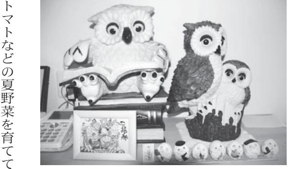
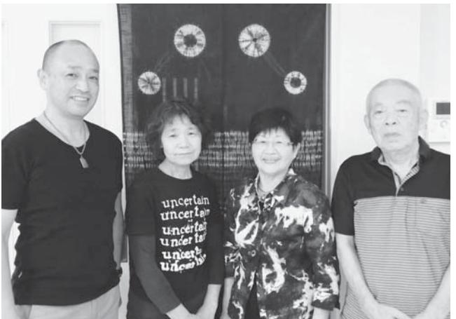
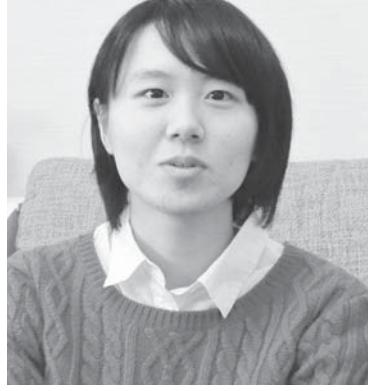

- 浪江町交流館(福島・郡山・いわき)にコミュニティ支援員を配置H28. 5月
	- 住民懇談会開催(全8会場)(~7月) 6月
	- 町内の除染効果について検証を開始 (除染検証委員会開催) 6月
	- 特例宿泊を開始 (帰還支援一時宿泊所開所) 9月
	- 平成28年度浪江町住民意向調査を実施 9月
	- 中心市街地再生に向けた検討を開始 (中心市街地再生計画検討委員会開催) 9月
	- 浪江町町立小・中学校に係る検討委員会開催 10月
	- 浪江町復興計画【第二次】中間とりまとめ 11月
	- 除染検証委員会が検証結果報告書を提出 12月
- 避難指示解除に関する有識者検証委員会フォローアップ会合が報告書を提出H29. 1月
	- 住民懇談会開催(全10会場)(~2月) 1月
	- 浪江町地域防災計画を改定 3月
	- 浪江町復興計画【第二次】を策定 3月
	- 浪江町中心市街地再生計画を策定 3月
	- 帰還困難区域を除き避難指示が解除 3月

# この時期の復興に向けた主な動き ็ඉॠএبੂƫ Ƅƙ

ºƝஇƲDžౢƞ ૌƴƾƛƛƵƞ£ ƨƾƈƛƫơசŷDž եƗƞ

請戸漁港が再開(2月25日)

東日本大震災慰霊碑を建立(3月11日)

まち・なみ・まるしぇ(浪江町仮設商業共同店舗施設)が

オープン(10月27日)

浪江診療所(3月27日)・仮設津島診療所(3月23日)が開所

取材者:地域社会デザイン・ラボ中島・遠藤取材日:2月23日 「平成28年4月広報なみえ掲載」

#### 前を向いて進まなくちゃ

宮城県

震災前、定年後の生活を悠々自適に楽しんでいた遠藤さんご夫妻。郡山市で約2年半避難生活を送った後、現在は娘さんと一緒に宮城県名取市美田園で暮らしています。 ご主人の一衛さんは「浪江に帰りたいけれど、医療や商業施設が整わないと生活が成り立たない」と強調されていました。

|   | に | と | 特 | 方 | ど | の | す | 育 |     | す | な | の | こ | ば | 理 |   | ◆ |
|---|---|---|---|---|---|---|---|---|-----|---|---|---|---|---|---|---|---|
| 私 | も | 、 | 別 | の | 、 | 人 | 。 | 館 | 私 。 |   | る | で | も | 不 | も | 美 | 地 |
| ( | 参 | こ | に | 紹 | プ | し | ジ | の | (   |   | べ | 、 | っ | 安 | 分 | 田 | 域 |
| 益 | 加 | の | 許 | 介 | ー | か | ム | ジ | 一   |   | く | 地 | て | で | か | 園 | の |
| 世 | し | 間 | 可 | で | ル | 利 | の | ム | 衛   |   | 積 | 域 | い | ね | ら | に | 活 |
| さ | ま | は |   | 、 | で |   | 方 |   | さ   |   | 極 | の | る | 。 | な | 来 | 動 |
| ん | し | 「 | を | 避 | 知 | 用 | は | に | ん   |   | 的 | サ | わ | で | い | た | に |
| ) | た | 男 | も | 難 | り | で | 、 | 通 | )   |   | に | ー | け | も | か | ば | 積 |
| は | 。 | の | ら | 中 | 合 | き | 本 | っ | は   |   | 参 | ク | に | 家 | ら | か | 極 |
| 、 |   | 料 | っ | っ | っ | な | 当 | て | プ   |   | 加 | ル | は | の | 不 | り | 的 |
| 郡 |   | 理 | て | て | た | い | は | い | ー   |   | し | な | い | 中 | 安 | の | に |
| 山 |   | 教 | 。 | こ | 地 | ん | 名 | る | ル   |   | て | ど | か | に | と | 頃 | 参 |
| で |   | 室 | そ | と | 元 | だ | 取 | ん | と   |   | い | に | な | 閉 | 言 | は | 加 |
| は |   | 」 | れ | で | の | け | 市 | で | 体   |   | ま | も | い | じ | え | 地 |   |
|   |   |   |   |   |   |   |   |   |     |   |   |   |   |   |   |   |   |

▲名取市美田園のお宅にて、遠藤一衛さん・益世さんご夫妻。

フラダンスの教室に 。 ここに来てからは公民館で 「 どんなサークルがあるか教えてください 」 と尋ねまして、今は編み物とパッチワーク教室に参加しています 。 それからコーラスのサークルにも 。 今日も午前中はコー

ラスの練習があったんですが、ラジオ体操や発声練習など基礎から教えてくれるんですよ 。 この辺には閖上など宮城県内で津波に遭って避難して来た方も多いので、被災した同士がお茶のみしながら気軽に話せる場も多いんです 。 一つに参加すると 「 こういうのもあるよ 」 と別の催しに誘われたりして、少しずつ知り合いが増えました 。 ◆ 浪江の思い出、家のこと私 ( 一衛さん ) は釣りが好きで、よく高瀬川、室原川の渓流へアユやハゼ釣りに行きました 。 釣り仲間だった友人は娘さんと一緒に沖縄に移住しましたが、今も月 2 回ほど電話をくれます 。 向こうでは海釣りはできるけれど川釣りはできない、気兼ねなく話す相手もいないって 。 浪江の家には月 1 回くらい帰ります 。 建物はそのまま残っているんですが、かび臭いし家の中は空っぽだから 2 、 3 時間しかいられない 。 それに一時帰宅しても、近所の人と顔を合わせる機会があまりないのが寂しいです 。 早く浪江に帰りたいと思う反面、帰るとなると一からのやり直しになる 。 実際には難し

| て | 前 | 出 | 住 | ホ | が |   | き      | な | る | 入 | た | た |   | じ | う | 院 | た | い | な | の | 心 | て | 集 | 新  |   | ◆ | れ | い |
|---|---|---|---|---|---|---|--------|---|---|---|---|---|---|---|---|---|---|---|---|---|---|---|---|----|---|---|---|---|
| い | を | や | む | ッ | よ | 離 | り      | ら | の | 居 | い | 情 | 浪 | ゃ | 」 | や | な | と | い | こ | 配 | 情 | ま | 聞  | 浪 | ま | て | か |
| ま | 向 | 人 | こ | と | く | れ | 示      | な | で | し | 。 | 報 | 江 | な | と | 商 | い | 、 | の | と | し | 報 | る | は  | 江 | ち | い | な |
| す | い | と | と | し | 分 | て | し      | い | 、 | よ | ま | を | の | い | い | 店 | と | 帰 | で | 。 | て | 交 | 茶 | 「  | の | の | ま | と |
| 。 | て | の | に | ま | か | み | て      | よ | 二 | う | た | も | 広 | で | う | が | 。 | 還 | 、 | 家 | い | 換 | 話 | 福  | 状 | 将 | す | 、 |
|   | 進 | 絆 | な | す | り | る | い      | う | 重 | か | 避 | っ | 報 | し | 動 | で | 常 | し | 町 | 内 | る | し | 会 | 島  | 況 | 来 | 。 | 半 |
|   | ま | を | っ | 。 | 、 | と | た      | 、 | 三 | 迷 | 難 | と | に | ょ | き | き | 磐 | て | の | は | の | て | に | 民  | を | に |   | 分 |
|   | な | 大 | て | こ | 町 | ふ | だ      | 町 | 重 | っ | 先 | 載 | は | う | も | て | 線 | も | 商 | 車 | は | い | も | 友  | 知 | 向 |   | 半 |
|   | く | 切 | も | の | の | る | け      | の | の | て | の | せ | 生 | か | 活 | 初 | が | 生 | 店 | の | 医 | ま | 毎 | 」。 | り | け |   | 分 |
|   | ち | に | 浪 | 先 | 人 | さ | た      | 方 | 引 | い | 復 | て | 活 | 。 | 発 | め | 復 | 活 | が | 運 | 療 | す | 回 |    | た | て |   | に |
|   | ゃ | し | 江 | 、 | と | と | ら と | 針 | っ | る | 興 | い | に |   | に | て | 旧 | が | 再 | 転 | と | 。 | 顔 | 町  | い |   |   | 気 |
|   | と | つ | の | ど | 話 | の | 。      | を | 越 | 人 | 住 | た | 直 |   | な | 「 | し | 成 | 開 | が | 買 | 皆 | を | の  | の |   |   | 持 |
|   | 思 | つ | 思 | こ | す | 良 |        | は | し | も | 宅 | だ | 結 |   | る | 帰 | 、 | り | し | で | い | さ | 出 | 人  | で |   |   | が |
|   | っ | 、 | い | に | と | さ |        | っ | に | い | に | き | し |   | ん | ろ | 病 | 立 | な | き | 物 | ん | し | が  | 、 |   |   | 揺 |

天野淑子さん(小野田)

取材者:浪江町役場三瓶・鴫原取材日:3月3日 「平成28年4月広報なみえ掲載」

#### 出会った方との絆をこれからも大切にしたい

二本松の仮設住宅で避難生活を送る天野さんは、明るくはつらつとした自治会長さんです。県外に避難されていた時は、強いストレスから引きこもりになってしまったそうですが、心機一転、現在は気の合うご友人たちと洋裁などを楽しみ、震災後に築いた新しい絆を大切にしたいとおっしゃいます。

の団地での一人暮らしとなりました 。 団地では、部屋から出るのが怖くて引きこもるようになり、ストレスで髪が抜け、肌も荒れ、全身のかゆみで眠れない夜が続きました 。 これでは生活ができない、ダメになると思っていたところに、二本松市の旧平石小仮設に入居した伯父から私の分も申し込んだから 8 月にここにおいでと連絡が入りました 。 なかなか荷物をまとめられず、ボーっとしていたんですが、 11 月に準備が整いやっと引っ越すことができました 。 仮設は同じ浪江の人でも知らない人ばかりで、イベントがあっても半年は家から出られなくて、長男のいるいわきに泊まりに行ったり、部屋で小物づくりをして過ごしました 。 そんな生活に転機が訪れたのは、またしても伯父からの話でした 。 自治会で婦人部を立ち上げるから部長をやれと 。 今の状態でなん

で私が … と思い、嫌だと言ったんですが、大堀地区の婦人会長や婦人消防隊長をやっていたからできるだろうということだったのかな 。 12 年 4 月に婦人部長を任され、初めてみんなの顔を覚えて、こんなイベントをやっていたんだ、こんな支援を受けていたんだと知りました 。 私も何かできるのであればと思って、月に 1 回着物のリメーク、洋裁を始めました 。 そのおかげで、気心が知れた友人ができました 。 作品を交流の場で飾っていたら、支援してくれる方 々 がバザーなど催し物で売ってくれたり、古着をくださるようになりました 。 震災がなければずっと仕事をしていたので、大変なことは多かったですが、全国的にこんなにすごい繋がりができたのは良かったことですね 。 1 年後には自治会長となり、まもなく 3 年が経ちます 。 ここでは、班長、役員とは関係なくみんな自分から声を掛けていろいろやってくれます 。 自分だけやるのではなく、一人ひとりが役割を持って協力してくれるので助かっています 。 浪江は、緑も川も海も山も全部持った町だから戻りたいという思いはあります 。 でも、子どもは戻りたがらない 。 壊れたお墓は直しましたが、お墓参りには行っていません 。 先祖が苦労

> して建てた家は、子どもが生まれて育った愛着のある家 。 帰らないと思っても解体にはまだ踏み出せません 。 夏からいわきの復興公営住宅に住むことになりました 。 洋裁を通して絆が深まった友人とは、これから先バラバラに住むようになっても岳温泉に泊まりに行こうと話しています 。 ここで出会った方 々 との縁をこれからも大切にしていきたいと思います 。 ◆ 町民の皆さんへのメッセージ浪江町民として繋がりを持っていた方がいいと思います 。 どこにいても忘れないように、隣組は絶対なくしてはいけないと思います 。 うちの隣組 11 軒はバラバラに避難していますが、年に 1 回泊りがけで会っています 。 みんな楽しみでいつも全員参加です 。 他の地区でもあればいいのにと思います 。

▲笑顔の素敵な天野さん。洋裁の作品と一緒に。

浪江では、救護施設

福島県浪江ひまわり

荘で厨房の仕事をし

ていました 。 会社の

ある那須から、友人

が誘ってくれた群馬

へと避難し、福島で

仕事をしている息子

たちと離れて初めて

小野田浩宗さん(小野田)「平成28年4月広報なみえ掲載」

**特別編** ơƆƆǀࢉႜ§اࣰ

平成23年7月号第1回目のこころ通信で、ヤングプラザスポーツ少年団団長として、熱い思いを語ってくれた小野田さんから、近況をお知らせいただきました。

### 病気の経験と写真業がこれからの道に続いていきます

現在、チームは休団中ですが、生業の写真業と並行して健康と食の大切さを伝えていこうと新たな資格も取り、熱い気持ちで頑張っています。

福島県

◆ 震災後の経験悪夢のような震は、私からも多くました 。 長年の実績地域の友人・知人と幸いな事に家族難生活にも取りあが見え、ふっと我 5 か月後、大きなの生活への不安に極度のストレスでられる思いがしま悪い方向ばかりにい、一時期は気力なったうつ病の発つめの臨時職が忙冬頃、そのうつ病のですが、入れ替症したのが、急性入院治療が必要 」 られた糖尿病でし事

災と原発事故のものを奪いあった仕事、の関わり … 。 が無事で、避えずの方向性に返った震災喪失感と今後さいなまれ、胸が絞め付けした 。 物事を思考してしまも体力も無く症でした 。 3 しくなった初は良くなったわるように発とは言え 「 即と医師に告げた 。 結局は食療法と多くの方 々 のアドバイスを取り入れ、入院せずに改善を図り、奇跡的に 1 か月程で改善の兆しが見え始めた頃、心筋梗塞を発症したのです 。 一時は生死もさまよいましたが、手術と 2 週間の入院で退院でき、現在は元気にしています 。 あの時の 3 つの病気

の経験は、病気や健康ということに無頓着だった私の考えを改めさせるきっかけとなりました 。 ◆ 仕事について現在、 28 年間続けた花卉栽培や稲作の仕事には従事できなくなりました 。 結婚後から本格的に関わった写真業については、社長夫妻が横浜で避難生活を送っていることもあり、浪江店・富岡店共、店舗の再開は難しいと思われます 。 しかし、その一部だった卒業アルバム制作業務の部分は、震災次年度の混乱の最中であっても継続依頼してくださった学校もあり、数校ながら、妻と協力して今も続けています 。 また、町成人式集合写真撮影の仕事も受注させていただいて、なつかしい町民の方 々 と再会の機会としてもありがたく感謝しながら仕事をしています 。 更に最近、昔の写真の修正や引き伸ばしの依頼、震災前に当スタジオで撮影した写真の再作成等の依頼があり、写真に関しての要望について自分達で出来る限りの対応をしていきたいと考えています 。 震災後 5 年の今だからこそ、大切な仕事ではないかと実感しています 。 それから、自分自身が 50 の坂を越えて、アルバム調の自分誌や家族誌等を作りたくなってきました 。 良いものができたら御希望の方 々 におすすめできれば …

とも思っています 。 今後、店舗展開はできなくても皆さんに喜んでいただける卒業アルバム制作や写真作りをしていこうと妻と話しています 。 ◆ これからのこと写真業と並行して、震災後の 3 つの病気の経験から食と健康について考えるようになり、食育指導士と健康管理士の資格を取得しました 。 まだまだ未熟な知識ではありますが、浪江町出身の方 々 を中心に新たに出会った方にも輪を広げながら 「 メンズキッチン 」 のグループを立ち上げ、活動をしています 。 自分の病気の経験と健康や食の知識が少しでも皆さんのお役に立てれば幸いに思っています 。 多くのものを奪った震災でしたが、 5 年を経て、震災による新たな生活環境や生き方が多くの人との出会いを生み出してくれたことに気付きました 。 我が家的にも、娘達はこの春に大学 4 年、社会人 2 年目、中学 3 年と成長し、震災後、世帯別に暮らしていた小野田の両親とは数ヶ月後にまた一緒に暮らすこととなりました 。 震災前とまるっきり同じ生活や仕事の形はできなくても、あの頃に築いていたものをベースに新しい出会いも大切にしながら、前進していきたいと思っています 。

長橋明孝さん(大堀)

取材者:NPO法人ちば市民活動・市民事業サポートクラブ鍋嶋取材日:4月8日 「平成28年5月広報なみえ掲載」

#### 大堀相馬焼への思いを胸に

大堀相馬焼の窯元「明月窯」を先代から引き継ぎ45年。伝統工芸士として、また大堀相馬焼協同組合の元会長として、大堀相馬焼を先導する役割を果たしていた長橋さん。現在は、東京都東雲の公務員住宅に避難し、奥さまと二人で暮らしています。腰を痛めていることもあり、窯元再建の道は見えていませんが、文化センター等が主催する陶芸教室の講師として活躍されています。

◆ うれしい支援震災後、津島後、新潟県栃尾から声をかけて男と一緒に、車目指しました 。 れ、途中のインらったり、本当でした 。 栃尾市類、生活用品なてもらいました避難したので、かったです 。 そ次男から、自分入していたマンいか、との誘いを受け東京に避難し、半年ほどそこにい

どたくさん寄付し

。 着の身着のまま

本当にありがた

◆ ひな人形や干支飾り

震災前は、「 明月窯 」 の窯元

として職人一人とパートの人を

雇い、妻や長男と一緒に毎日忙

しく働いていました 。 湯飲み茶

碗や皿とあわせて、ひな人形や

干支飾りの製作が盛んになり、の後、東京に住む

が住むつもりで購

ションに住まな

人気を得ていました 。 干支飾り

は郵便局の保険加入の景品に採

用となり、干支飾りを揃えるた

めに保険に加入したという人もいたようです 。 伝統を大事にしながら、新しい取組みもしていましたね 。 長男が跡を継いでくれて営業にも力を入れていた時だったので、震災がなかったらという悔しい思いはあります 。 ◆ 陶芸教室の講師としてこの頃、江東区の文化セン

ー等で開催される 「 陶芸

タ

教

した 。 しかし、あまり長くってもと思い、知人が提供しくれた埼玉のマンションに移ました 。 気兼ねなく住める場でしたが、幹線道路沿いで騒がひどく困っていた時に、今んでいる公務員住宅の情報をて移ってきました 。 もう 4 年なりますね 。 長男は今も埼玉マンションで暮らしています 。

に一時避難した

ま

な

て

り

所

音

住

得

に

の

市の 『 大堀会 』

もらい、妻と長

2 台で栃尾市を

車のガソリンが切

ターまで届けても

にたいへんな道中

では、布団や衣

室 」 の講師として、出かけることが増えてきました 。 昨年から始まった 「 はじめての陶芸教室 」 は、 3 回の連続講座で、てびねりから絵付けまで行います 。 同じ施設内に電気窯もあるので便利ですよ 。 人気の講座で、定員の 20 名はすぐに満員になってしまいます 。 土は、名古屋の業者に頼んで取り寄せています 。 大堀の土と同じ組成で、工法を守ればちゃんとした 「 大堀相馬焼 」 になります 。 窯元として事業再開したいのは山 々 ですが、腰を痛めていることもあり、今年 77 歳になる私にとって、一から事業を始めるのはちょっとしんどいです 。 長男の思い次第になると考えています 。 今後のことは、はっきり決められない状況です 。 妻と二人、趣味のそば打ちや陶芸教室の講師役を楽しみに過ごしていけたらと思いますが、一方で浪江に帰れるようになったら、事業を再開したいという思いも変わらずあります 。 浪江の暮らしに代わるものはありません 。

仲谷貴美子さん(井手)

取材者:浪江町役場佐々木・鴫原取材日:4月18日 「平成28年6月広報なみえ掲載」

### もらった命なんだから先のことだけ考えていこう

仲谷さんは、二本松市でお母さんと娘さんとの3人暮らしをしています。楽しみは、震災前から習っていた三味線。猪苗代の先生と一緒に月に1回、老人ホームへ三味線と民謡の慰問を行っています。いろいろあったことを考えていてもしょうがないと、先だけを見ていく生き方にはパワーがあり、周りを元気にする力を持っている太陽のような明るい人です。

震災は、施設で夜ご飯を作り始めた時に起きました 。 とたんに電気が消え、ガス、水道とライフラインは全部だめになり、ひどい揺れのため外に出ろ、という指示で仕事着の半袖のまま外に出ました 。 余震が怖くて中に入れず、 2 時間みんなで体を寄せ合い震えていました 。 ずっとそのままでいることもできなかったので、中に入って非常用の水と食料で夕飯を作り、翌朝のおにぎりを用意しました 。 その時は、明日になれば何とかなるだろうと楽観していました 。 情報が一切なかったから何もわからなかったのです 。 電話も通じず家族の安否がわからないままだったので取りあえず家に帰ることになりまし

▲笑顔が魅力の仲谷さん

浪江では、家で食べる分の野菜を母が育て、私は大熊町の老人介護施設で調理師をしていました 。 家の裏山は山菜やキノコなどが豊富で宝の山でした 。 空気がきれい、四季折 々 の自然があって浪江はいいところばかりでした 。

た 。 外に出てみて初めて周りの状況がわかり愕然としました 。 自宅は築 1 0 0 年以上 。 家族の無事だけを祈り、普段 15 分の道のりを 5 時間かけてたどり着いたのは夜 11 時でした 。 家は大きく崩れましたが幸い母は無事で、それからアクセスホームさくらに通所していた娘を迎えに行き、夜は隣の家でお世話になりました 。 その後、大堀の家から津島の避難所を経て、緊迫した状況の中、東和町の体育館へ 。 食べ物もなくもらった毛布で寒さをしのぎましたが、東和町婦人会の方たちが炊き出しをしてくれて本当にありがたかったです 。 避難所では 80 人程の避難者の中からリーダーを決めて、その方が物資や食品をしっかり分配してくれるなど素晴らしいまとめ役をしてくれたおかげで、約 1 か月間協力しあって穏やかに過ごすことができました 。 二次避難先の猪苗代でもオーナー夫妻がとても良くしてくださり、自分ができることを手伝いながら 4 か月過ごしました 。 8 月に平石仮設へ入居し、ここでも自治会長のリーダーシップのおかげで穏やかに過ごすことができました 。 ただ、心配だったのは母のこと 。 浪江にいた時は民謡大会に

出たり、話すのが好きで毎日バイクで近所に遊びに行っていた元気な母が、震災後は先 々 の不安を抱えて自ら楽しもうという意欲がなくなり、介護認定を受けるようになってしまいました 。 それで、今の状態を保ちいつまでも元気でいてほしいという願いから家を建てることを決意し、昨年の 5 月に二本松市に家を構えました 。 娘が通所しているアクセスホームさくらに歩いていける距離だったことも決め手になりました 。 現在、私は介護との折り合いをつけながら、さくらで送迎の運転手をしています 。 私が仕事などでいない時は、娘が母を見てくれて助かっています 。 また、さくらに通所している子どもの親として、できることはなんでもしようと思い、親の会の会長をしています 。 障がい者を持つ親にとってさくらという施設があることはありがたいこと 。 うまく子どもの能力を引き出して、子どもに合った仕事をさせてくれるのは子どもにとって励みになっています 。 皆さんへお願いがあるとすれば、弱い人を見かけたら声掛けひとつでもしていただけたらと思います 。 これから先、どんな人も協力し合える世の中になってくれればいいなと思います 。

### 小野田順さん(大堀)

取材者:地域社会デザイン・ラボ中島取材日:5月11日 「平成28年6月広報なみえ掲載」

### 浪江の方とおしゃべりするのがなによりの楽しみです

大堀地区の民生委員で、大堀老人会(清流会)の女性部長も務めていた小野田順さん。長男のお嫁さんの実家がある宮城県美里町に家を建て、ご主人・息子さん夫婦・3人のお孫さんとともに家族7人で暮らしておられます。避難中は腰の痛みにも悩まされましたが、手術を受けて全快。浪江の方とも地元の方とも積極的に交流し、活動的にお過ごしです。

▲美里町のご自宅の庭で草花を丹精する小野田順さん

| を 建 て た ん で す 。 | だ ろ う と 覚 悟 を 決 め 、 2 年 前 に 家 | 元 気 な う ち に 大 堀 に 戻 る の は 無 理 | 上 げ 住 宅 に 移 り ま し た が 、 私 ら が | お 世 話 に な り ま し た 。 そ の 後 、 借 | 里 町 に あ る 嫁 の 実 家 に 2 か 月 ほ ど | 会 津 若 松 、 柏 崎 に 避 難 し た 後 、 美 | ま ず 川 俣 に 向 か い 、 そ れ か ら | 日 の 午 後 3 時 頃 で し た 。 | の で 、 家 族 7 人 で 避 難 し た の は 12 | 呼 び か け る 放 送 も 聞 こ え な か っ た | そ の も の の 被 害 は 少 な く 、 避 難 を | ま し た 。 う ち は 地 盤 が 固 い の で 家 | 方 の お 宅 を 回 り 、 安 否 確 認 に 務 め | 揺 れ が 収 ま っ て か ら 独 り 暮 ら し の | て い た の で 、 地 震 が 起 き た 当 日 は | 民 生 委 員 の 役 を お お せ つ か っ | ◆ 現 在 の 自 宅 に 落 ち 着 く ま で |
|--------------------------------------|-------------------------------------------------------------------------|-------------------------------------------------------------------------|-------------------------------------------------------------------------|-------------------------------------------------------------------------|-------------------------------------------------------------------------|-------------------------------------------------------------------------|---------------------------------------------------------------|-----------------------------------------------------|--------------------------------------------------------------------------|-------------------------------------------------------------------------|-------------------------------------------------------------------------|-------------------------------------------------------------------------|-------------------------------------------------------------------------|-------------------------------------------------------------------------|-------------------------------------------------------------------------|---------------------------------------------------------------|---------------------------------------------------------------|
|--------------------------------------|-------------------------------------------------------------------------|-------------------------------------------------------------------------|-------------------------------------------------------------------------|-------------------------------------------------------------------------|-------------------------------------------------------------------------|-------------------------------------------------------------------------|---------------------------------------------------------------|-----------------------------------------------------|--------------------------------------------------------------------------|-------------------------------------------------------------------------|-------------------------------------------------------------------------|-------------------------------------------------------------------------|-------------------------------------------------------------------------|-------------------------------------------------------------------------|-------------------------------------------------------------------------|---------------------------------------------------------------|---------------------------------------------------------------|

|                                      | ど い な い の で 、 浪 江 の 人 が 集 ま る  |
|--------------------------------------|--------------------------------------------------------------------------|
| が 夢 で す ね 。           | 美 里 町 に 避 難 し た 人 は ほ と ん            |
| に も う 1 回 住 ん      | ◆ 浪 江 の 人 と 集 う 幸 福 な 時 間            |
| 住 め る 状 態 に な っ | り で す 。                                                         |
| こ の 先 除 染 が           | は 」 と い う こ と を お 伝 え し た つ も  |
| ま で が 大 変 で す 。 | 識 で は だ め 。 危 機 感 を 持 た な く て  |
| 周 り は 草 木 が 生 い | 「 原 発 は 絶 対 に 安 心 安 全 と い う 意  |
| 行 く た び に 傷 み が | で い い の か な と 思 い ま し た が 、       |
| え ま す が 、 5 年 も | か ら 30 キ ロ 圏 内 な の で 。 私 な ん か |
| 震 災 前 と そ う 変 わ | す 。 今 住 ん で い る 場 所 も 女 川 原 発  |
| 帰 宅 困 難 地 域 と は | ほ し い と 頼 ま れ た こ と も あ り ま       |
| ま す 。 自 分 た ち の | わ れ 、 皆 さ ん の 前 で 体 験 を 話 し て  |
| 宅 し 、 家 の 周 り の | れ な い く ら い で す 。 婦 人 会 に も 誘  |
| 大 堀 に は 月 1           | も 親 切 に し て い た だ き 、 感 謝 し き  |
| ◆ 大 堀 に 1 泊 で も | 私 も 避 難 先 で 地 元 の 方 に と て            |
| い ま す 。                     | し い で す ね 。                                               |
| ん の お 顔 を 見 に 行 | る 方 が だ ん だ ん 増 え て き た の は 嬉  |
| こ れ か ら も 体 が 動 | 聞 く と 「 元 気 だ よ 」 と 言 っ て く れ  |
| 同 士 だ っ た 方 と も | で す が 、 「 お 元 気 で し た か ? 」 と  |
| こ と も あ る し 、 浪 | メ イ ン で 私 は お 手 伝 い と い う 感 じ  |
| か 、 知 っ た 方 と 出 | て い ま す 。 地 区 の 民 生 委 員 さ ん が  |
| ち ゃ ん の お 母 さ      | 居 の 高 齢 の 方 へ の 訪 問 活 動 を 続 け  |
| で 「 小 野 田 先 生      | 区 に 月 1 回 ほ ど 通 い 、 避 難 中 の 独  |
| 保 育 所 に 勤 め て い | に 会 い た く て 、 南 相 馬 市 の 原 町 地  |
| し て ね 。 参 加 す る | ち た い 、 そ し て な に よ り 浪 江 の 人  |
| 新 年 会 な ど い ろ ん | そ ん な 方 の お 役 に 少 し で も 立            |
| い て お り ま す 。 お | 思 い ま す 。                                                    |
| 方 の 集 ま り に も 声 | り 大 変 な 思 い を さ れ た 方 も 多 い と  |
| そ れ か ら 仙 台           | い 経 験 を し ま し た 。 で も 、 私 ら よ  |
| に 出 か け ま し た 。 | 故 で 想 像 も で き な か っ た よ う な 辛  |
| て 、 今 年 の 春 も 中 | 塞 ぎ こ む よ う に な る な ど 、 原 発 事  |
| 回 、 春 ・ 秋 に 旅      | 齢 の 母 は 亡 く な り 、 主 人 も 一 時 は  |
| て い ま す 。 大 堀 の | 避 難 中 の 無 理 も た た っ て か 高            |
| 催 し に は 車 や 電 車 | ◆ 民 生 委 員 と し て 活 動 を 続 け る       |

を使って参加し

清流会では年 2

行を企画してい

ノ沢温泉に旅行

に避難している

をかけていただ

花見、忘年会、

な催しがありま

と、私は浪江で

たことがあるの

でしょ ! 」「 ○ ○

んだよね ! 」 と

会って感激する

江では知らない

話が弾みます 。

くかぎり、皆さ

きたいと思って

泊まりたい

回くらい一時帰

草刈りをしてき

住んでいた家は

いえ見たところ

らない状態に見

住んでいないと

進んでいます 。

茂って家に入る

進み、 1 泊でも

たら、自分の家

でみたい -

それ

ơƆƆǀࢉႜ§اࣰ **再取材シリーズ**

## 木幡サチ子さん(立野)

取材者:NPO法人茨城NPOセンター・コモンズ横田浪江町復興支援員茨城県駐在田中・森取材日:4月27日 「平成28年6月広報なみえ掲載」

#### つくばでもお店やお話会を始めました

木幡さんは、原発災害により、茨城、千葉を経て1年前につくば市に移住。再開したエステサロンを営むかたわら、近隣の避難者の皆さんが集える機会も提供しています。

| 妹 の 家 の あ                     | で 仕 事 を し                     | ど し て い ま                     | 福 島 の 方 の                     | を し た り 、                     | い る 近 所 の                     | を お 願 い し                     | や 浪 江 町 復                     | を 再 開 し た                     | い ま し た 。                     | 東 金 市 の 借                     | え 」 で 紹 介                     | 平 成 25                              | ◆ 2 回 目 の |
|-------------------------------------------|-------------------------------------------|-------------------------------------------|-------------------------------------------|-------------------------------------------|-------------------------------------------|-------------------------------------------|-------------------------------------------|-------------------------------------------|-------------------------------------------|-------------------------------------------|-------------------------------------------|-------------------------------------------|-----------------------|
| る 茨 城 県 つ く ば 市 に | 、 息 子 も 県 外 、 母 は | し た 。 当 時 夫 は 福 島 | 集 ま り に 参 加 す る な | 千 葉 県 内 で 開 か れ る | 方 々 と 交 流 会 や 旅 行 | て 、 千 葉 に 避 難 し て | 興 支 援 員 に も ご 協 力 | り 、 避 難 先 の 市 役 所 | そ こ で エ ス テ サ ロ ン | 上 げ 住 宅 に 避 難 し て | さ れ た 時 は 、 千 葉 県 | 年 4 月 の 「 広 報 な み | 再 出 発           |

▲自宅に併設されたエステサロンの入り口を背にした木幡さん

好きです 。 エス

に喜ばれ、人と

作れる仕事なの

命の地と決め始

の家や田畑のこ

すし、こころは

ります 。 最後は

ですが、今はこ

増やしながら暮

いと思っていま

も福島や浪江町

大事にしていき

たなつながりを作います 。 また、千たように、福島かる方で近くにいる話会をしたいと思城の復興支援員のいただきながら茶ています 。 新聞折紙に大きく取り上徐 々 につくばの方りができてきまし 25 年 4 月 ) の 「 こ様、私は人を元気

震災の時は中学 1 年生で、卒

業式が終わって家に一人でいま

木村郁也さん(権現堂)

取材者:浪江町役場佐々木・鴫原取材日:4月28日 「平成28年6月広報なみえ掲載」

#### 町づくりの力になれるように

は、山、海、川などの自

中学2年生の時(平成23年10月号)に「一番やりたいことはもっと走ること」と話していた木村さんは、この春に高校を卒業し、役場職員として教育委員会事務局に勤務しています。中学1年生から町の代表としてふくしま駅伝に6年間参加し、キャプテン2年目の昨年はアンカーを務めました。 中学・高校と走り続けた木村さんは、今、新たなステージで、新たな目標に向かって走り始めました。

ったと思 ▲いつも笑顔のフレッシュな 18歳です

か

います 。 ずっと剣道をしていた自分が陸上で長距離を始めたきっかけは、小学 6 年生の冬に当時のふくしま駅伝の監督から練習へ参加してみないか

と誘われたことです 。 やってみると楽しくて、中学では陸上部に入り本格的に長距離を始めました 。 高校は、競技力の高い人が集まるところで刺激を受けたいと思い、田村高校体育科に入りました 。 長距離の魅力は、練習した分伸びていくことと、走り終わったあとの達成感です 。 駅伝は一緒に頑張ってきたみんなと喜びを分かち合えるのがいいです 。 高校 2 年生から町の駅伝チームでキャプテンをしていますが、キャプテンらしいことができずにいます 。 昨年の大会は気負わずに走れたのですが、終盤な

|   |   |   |   |   |   | 民 |   | で | 位 | た | 要 | 分 | 遠 | く | に | 負 | き | が | ム |   |  |
|---|---|---|---|---|---|---|---|---|---|---|---|---|---|---|---|---|---|---|---|---|--|
|   |   |   |   |   |   | に | 監 | き | で | 。 | だ | や | の | な | 脱 | わ | ず | 、 | で | 高 |  |
|   |   |   |   |   |   | 見 | 督 | ま | 目 | チ | と | 食 | い | っ | 水 | ず | に | キ | キ | 校 |  |
| だ |   | ま | れ | 果 | が | せ | は | し | 標 | ー | 感 | 事 | て | て | 症 | に | い | ャ | ャ | 2 |  |
| っ | 震 | す | た | を | 、 | た | 、 | た | の | ム | じ | の | い | 、 | 状 | 走 | ま | プ | プ | 年 |  |
| た | 災 | 。 | ら | 見 | 私 |   | 頑 | 。 | 入 | と |   | と | き | ゴ | に | れ | す | テ |   | 生 |  |
| 自 | の |   | い | せ | も | い | 張 |   | 賞 | し | 、 | り | ま | ー | な | た | 。 | ン | テ | か |  |
| 分 | 時 |   | い | て | 少 | と | っ |   | を | て | 課 | 方 | し | ル | り | の | 昨 | ら | ン | ら |  |
| に | に |   | な | 元 | し | 話 | て |   | 果 | は | 題 | な | た | の | 足 | で | 年 | し | を | 町 |  |
| と | 中 |   | と | 気 | で | し | い |   | た | 、 | が | ど | 。 | 時 | の | す | の | い | し | の |  |
| っ | 学 |   | 思 | を | も | て | る |   | す | 町 | 残 | 研 | ペ | は | 感 | が | 大 | こ | て | 駅 |  |
| て | 1 |   | っ | 与 | い | い | 姿 |   | こ | の | り | 究 | ー | 意 | 覚 | 、 | 会 | と | い | 伝 |  |
| 浪 | 年 |   | て | え | い | ま | を |   | と | 部 | ま | が | ス | 識 | が | 終 | は | が | ま | チ |  |
| 江 | 生 |   | い | ら | 結 | す | 町 |   | が | 9 | し | 必 | 配 | が | な | 盤 | 気 | で | す | ー |  |
|   |   |   |   |   |   |   |   |   |   |   |   |   |   |   |   |   |   |   |   |   |  |

然と町の雰囲気が調和していてすごく住みやすかったというイメージがあります 。 風景が良くて、走っていて気持ちが良かった 。 河川敷が好きで良く走りました 。 3 年前に、震災後初めて浪江に帰りました 。 賑わっていた十日市の通りは閑散としていて寂しく、コスモスマラソンの通りの家は壊れていました 。 浪江の良い風景を知っているので 「 そういう町に戻していきたい 」 と、その時に思いました 。 役場職員になりたいと思ったのは、大きく二つの理由があります 。 復興に携わって少しでも役に立ちたいと思ったこと 。 それから、駅伝でお世話になったスタッフに役場職員が多かったので、自分が走るだけでなく選手をサポートしていく立場になれればという思いです 。 今は仕事を始めたばかりで、何でも教えてもらっていますが、雰囲気には徐 々 に慣れてきました 。 これからいろいろなことを覚えていって、皆さんが戻ってきてくれるような町づくりの力になれるように頑張っていきたいと思います 。 また、職員としてだけでなく、町民として積極的に町おこしのイベントにも参加していきたいと思っています 。

# その思いを実現するために、僕は歩みを進める

看護大学を卒業し、今年4月から社会人としての第一歩を踏み出した古農さん。秋田市に住む両親と離れ、福島市での一人暮らしが始まりました。 「大震災の時には怪我をした人や困っている人の役には立てなかったけれど、今の僕なら何かできる。そしてこれからは、もっと」とおっしゃる古農さんの強い思いに、この大きな災害を乗り越え、立ち向かおうとする若者の気概を感じます。

▲ご自宅にて。優しい笑顔がとても素敵でした

| 「 | な 校 が や り 剣 は 道 強 部 く の 感 仲 じ 間 て 、 い 後 て 輩 、「 と の 生 き つ |
|---|-------------------------------------------------------------------------------------------------------------------------------------------|
|   | た と 思 い ま す 。 双 葉 や 秋 田 の 学                                                                        |
|   | 友 人 や 恩 師 に は と て も 恵 ま れ                                                                             |
|   | 出 場 し ま し た 。                                                                                                           |
|   | め ら れ て 入 部 し 、 秋 田 県 大 会 に                                                                        |
|   | 級 生 の お 父 さ ん に 部 活 見 学 を 勧                                                                        |
|   | 道 は 辞 め よ う と し ま し た が 、 同                                                                        |
|   | 高 校 に 通 う こ と に な っ た 時 に 剣                                                                        |
|   | で 一 杯 で す 。 だ か ら 、 秋 田 中 央                                                                        |
|   | し た 。 今 で も 申 し 訳 な い 気 持 ち                                                                        |
|   | 抜 け た ら そ れ が 叶 わ な い 状 況 で                                                                        |
|   | 場 人 数 が ギ リ ギ リ で 、 一 人 で も                                                                        |
|   | の 目 標 を 掲 げ て い る も の の 、 出                                                                        |
|   | に 進 学 。 剣 道 部 は 東 北 大 会 出 場                                                                        |
|   | 級 生 た ち は 県 内 の サ テ ラ イ ト 校                                                                        |
|   | な り 迷 い ま し た 。 双 葉 高 校 の 同                                                                        |
|   | 避 難 先 へ の 転 校 に つ い て は か                                                                             |
|   | い 」                                                                                                                                    |
|   | 「 今 で も 親 密 に 関 わ り 合 い た                                                                             |
|   | ◆ 双 葉 や 秋 田 の 仲 間 や 恩 師 と は 、                                                                   |
|   |                                                                                                                                           |
|   | 様 子 を 見 に 行 っ て い ま す 。                                                                                  |
|   | 暮 ら し で す が 、 父 も 僕 も 時 折 、                                                                        |
|   | し た 。 祖 母 は 今 、 福 島 市 で 一 人                                                                        |
|   | ん な で 秋 田 に 住 む こ と に な り ま                                                                        |
|   | れ 、 父 方 の 祖 母 と 両 親 、 家 族 み                                                                        |
|   | 研 修 に 来 て い た 学 生 た ち と 別                                                                             |
|   | 京 に 向 か う 母 方 の 祖 父 母 や 家 に                                                                        |
|   | と も 考 え て い た よ う で す が 、 東                                                                        |
|   | は 秋 田 市 へ 。 北 海 道 ま で 行 く こ                                                                        |

| と 県 大 手 災 ン や 子 ロ 大 が 持 は 時 技 学 思 こ を 学 好 伝 害 プ 被 ど ス で て 無 は 術 っ 訪 と れ き い 看 、 災 も プ 生 き ば 力 力 を 職 て ね か な な 護 防 体 た ロ の る 、 感 仕 身 い た 業 時 ら 自 ど 学 災 験 ち ジ ん も を 事 に を ま り は 転 幅 会 グ を の ェ に じ っ 感 し 付 す し 選 、 車 広 に ッ 活 保 ク は ゃ と じ か け ん 。 た 役 で く 関 ズ か 養 ト 、 な 寄 ま で る 4 だ に し 日 い り し 秋 関 わ の プ ( き 修 理 年 立 田 わ る 紹 た ロ 被 赤 か 添 た な 行 間 由 つ 県 っ 教 介 防 グ 災 キ 。 え 。 か 期 で で ッ た 内 た 授 活 災 ラ 3 そ る 資 っ 間 し す め や り の 動 キ ム 県 ズ れ こ 格 た 」 た 。 だ の 隣 、 お 、 ャ ) の ク が と を 僕 。 |
|-------------------------------------------------------------------------------------------------------------------------------------------------------------------------------------------------------------------------------------------------------------------------------------------------------------------------------------------------------------------------------------------------------------------------------------------------------------------------------------------------------------------------------------------------------------------------------------------------------------------------------------------------------------------------------------------------------------------------------------------------------------------------------------------------------------------------------------------------------------------------------------------------------------------------------------------------------------------------------------------------------------------------------------------------------------------------------------------------------------------------------------------------------------------------------------------------|
|-------------------------------------------------------------------------------------------------------------------------------------------------------------------------------------------------------------------------------------------------------------------------------------------------------------------------------------------------------------------------------------------------------------------------------------------------------------------------------------------------------------------------------------------------------------------------------------------------------------------------------------------------------------------------------------------------------------------------------------------------------------------------------------------------------------------------------------------------------------------------------------------------------------------------------------------------------------------------------------------------------------------------------------------------------------------------------------------------------------------------------------------------------------------------------------------------|

### 三瓶一樹さん(酒田)

取材者:NPO法人ちば市民活動・市民事業サポートクラブ鍋嶋取材日:5月15日 「平成28年7月広報なみえ掲載」

#### 応援を力に… 浪江町出身のプロボクサーとして

高校時代からプロボクサーを夢見ていた三瓶さんは、東京都品川区五反田にあるワタナベボクシングジムに所属し、プロボクサーとして日々、厳しい練習を重ねています。

力になるのは、家族や友人、同じ福島県出身の人たちの応援だと言います。

◆ プロボクサーへの憧れと震災ボクシングを始めたのは高校生の時です 。 ボクサーを見て 「 格好いいなぁ ! 」 と憧れました 。 授業が終わると電車で 1 時間かけて、いわき市のボクシングジムに通いました 。 高校卒業後いったんは埼玉県の会社に就職したのですが、ボクサーへの夢が諦められず浪江に戻りました 。 コンビニでアルバイトをしながらボクシングジムに通い、プロボクサーを目指していた時に震災にあいました 。 地震の揺れの中、近所の人たちと声を掛けあい、父母と姉、妹と 2 歳の弟の 6 人で津島の体育館に避難しました 。 津島に 1 日いた後、数か所の避難所を経て従妹を頼り練馬に来ました 。

震災後、姉は神奈川の会社に就職して一人暮らし、僕も品川にあるボクシングジムの合宿所住まいなので、避難先のマンションには、父母と大学 1 年の妹、小学 2 年の弟の 4 人が住んでいます 。 浪江の自宅には、一度だけ家族みんなで帰りました 。 長く閉め切っていた家は、ネズミの被害もあり荒れていました 。 酒田は、山側の居住制限区域です 。 父も母も、自宅に帰ることは無理と考えているようです 。 ◆ フェザー級 4 回戦ボーイとして今は、フィットネストレーナーとビル清掃のアルバイトをしながら、プロボクサーとしてワタナベボクシングジムに所属しています 。 ジムには世界チャンピオンの内山高志をはじめ、約 40 名のプロボクサーが所属しています 。 厳しい練習を乗り越えてプロとして活躍している人たちなので、人間的にも尊敬できる人が多く、ジムでの練習は苦になりません 。 4 回戦ボーイとしての僕のリングでの戦績は、 6 戦 3 勝 。 上を目指して、毎朝 5 時から走り込み、 8 時からはアルバイト、夕方 5 時からジムでの練習を続けています 。 ◆ 浪江の仲間夢は、世界で活躍するボク

サーになること 。 プロボクサーになることを反対していた家族も、今では試合のたびに応援に来てくれます 。 福島県浪江町出身という僕のプロフィールを知って、「 同じ福島県出身だから応援するよ ! 」 と言ってくれる人も少なくありません 。 中学や高校の同級生も試合を見に来てくれます 。 東京周辺で暮らす同級生たちとは、試合の時以外にも月に 1 〜 2 回会い、仕事のこと、これからのこと、遠慮なく思ったことを言い合っています 。 東京で新しい友人もできましたが、やっぱり、同じ浪江町で育った仲間とは違います 。 ◆ 大好きな請戸の海震災がなかったら、東京に来て本格的にボクサーを目指すのは、もっと後になったと思います 。 震災は、次の一歩を踏み出すきっかけにもなりました 。 人生は後戻りできません 。 悪い方にばかり考えたくはありません 。 僕が浪江で一番好きなのは 「 請戸の海 」 です 。 山があり、川があり、海があり浪江の風景は僕の自慢です 。 福島県浪江町出身であることを誇りにして、世界的なプロボクサーを目指したいと思います 。 皆さん、応援してください 。

鈴木健一さん(請戸)

取材者:NPO法人市民公益活動パートナーズ古山・松田取材日:5月28日 「平成28年7月広報なみえ掲載」

### ゼロからイチへ。 ここ閖上で新たなスタートを

名取市閖上。津波被害のシンボルとして全国ニュースにもたびたび取り上げられる日和山のすぐ側で、鈴木さんご家族の新たな挑戦が始まっています。 ゆりあげ

閖上地区水産加工団地の完成記念式典(5月26日)を終えた直後、「鈴栄」の真新しい工場に伺いました。敷地内に建てられた別棟の直売所には、新天地で再起を図る 「鈴栄」のニュースを聞いた方なのでしょうか、ご自慢の「ちりめん」を求めに訪れていました。

▲これからに向けて熱い抱負をお話しくださった鈴木

ているとはい

| に て 詩 ◆ す な が 区 対 避 県 し が ま ン と で か 流 ン し し をお話しくださった鈴木 あ 知 「 神 。 で 舞 応 難 へ た 住 し し 思 、 し タ た て 阪 な 神 請 り し 健一さん り ら い 戸 き 子 を 者 向 が む た た い で 、 ー 次 い 収 神 多 戸 、 戸 、 れ か ・ ま の し 第 か 、 静 か あ ま き 家 に 男 る 穫 |
|------------------------------------------------------------------------------------------------------------------------------------------------------------------------------------------------------------------------------------------------------------------------------------------------------------------------------------------------------------------------------------------------------------------------------------------------------------------------------------------------------|
|------------------------------------------------------------------------------------------------------------------------------------------------------------------------------------------------------------------------------------------------------------------------------------------------------------------------------------------------------------------------------------------------------------------------------------------------------------------------------------------------------|

| に 市 の た に 手 水 閖 秋 。 伝 し 産 上 、 2 う ま 加 地 名 年 こ 工 区 取 目 し と | り に 1 わ 知 、 福 3 れ 人 仕 島 年 て か 事 に 4 2 ら を 戻 月 0 誘 | が い 気 、 に 私 で 評 ま 頑 相 入 も 価 し 張 馬 っ 妻 を り の た て も 取 ま 、 り | ◆ ど 双 し の に を ホ 工 ・ 携 て 場 担 い ー わ 郵 の 当 わ ム り 送 借 し き ペ ま す 金 て 地 ー し る | の ら た て 業 の だ い 一 務 避 き た 方 を 難 ま だ 、 始 者 し き 神 め を た 訪 戸 | の メ 時 さ え な 地 ち ー ん 絶 か り カ や 好 域 ら め ー 、 の で 取 ん が 向 機 す 引 加 あ か 会 。 を |
|-----------------------------------------------------------------------------------------------------------------------------------------------|---------------------------------------------------------------------------------------------------------------------------|-----------------------------------------------------------------------------------------------------------------------------------------------|----------------------------------------------------------------------------------------------------------------------------------------------------------------------------------|-----------------------------------------------------------------------------------------------------------------------------------------------|----------------------------------------------------------------------------------------------------------------------------------------------------------------------------------|
|                                                                                                                                               |                                                                                                                           | す 海 戻 辺 す                                                                                                                         | を い 方 ジ た 仕 返 ま の や 。 事 し し 約 地 避                                                                                                | 、 対 。 問 市 職 象 、 が 員 と 見                                                                                      | 工 り い と 避 し 工 ま の 思 難 て 淡 い し 場 し                                                                                                |

団地が造られ、建設に伴う補助金があるという話を聞き、説明会に出席したことがきっかけとなり、工場再建を決心しました 。 事業は無事に採択され、今年の春、自宅も名取市内に移しました 。 この団地には、私ども鈴栄の他に、名取市の 3 社と相馬市の 2 社が新工場を建てましたが、それぞれ扱う食材や加工方法、販路などが異なります 。 私どもは石巻港などに揚がる地元の小魚を使って、小売りにこだわった製品づくりをします 。 よそ者ゆえゼロからのスタートですが、ファンづくりをしながら、地元の食材を活かした新ブランドを作りたい 。 浪江に対する思いは強いですが、今はともかく、この生業を軌道に乗せたいです 。 なりわい

▲直売所の前で、ご家族揃って。妻の典子さん、長女の杏梨さんが出迎えてくださいますよ

 **「鈴栄 」直売所** 〒981-1213 宮城県名取市閖上3丁目90-1 平日・土曜日:10時~16時日曜日・祝日:9時~16時 ※不定休お問い合わせ: 022(393)6303

吉田由美子さん(室原)

取材者:NPO法人市民公益活動パートナーズ古山取材日:6月20日 「平成28年8月広報なみえ掲載」

#### 癒され、励まされるたびに、私もそんな "元気の素"になりたいと思っています

梅雨の晴れ間、阿武隈高原の爽やかな風が心地良い日に、田村市船引町のご自宅にお邪魔しました。 敷地内には、交流拠点にと願って造られた、可愛らしいログハウスのサロン兼手芸店『Iyanbee (いいやんべえ)』があります。

たくさんの人たちの手によって作られたさまざまな作品に囲まれて、訪れた方々がお喋りをしたり、ゆったりした時間を過ごしたりしながら元気になって、「明日も頑張れるよ!」と言ってくれるような場所になったら嬉しいと、吉田さんは話してくださいました。

◆ 3 月 11 日、あの大地震の時はどうしていらっしゃいましたか双葉町の実家で凄まじい揺れに襲われました 。 窓ガラスには亀裂が入り、庭の井戸から水が逆流していました 。 同居する夫の両親が心配になり、急いで戻ろうとしましたが、道が隆起していて 3 時間もかかりました 。 義父母と夫、子どもたち 6 人が住む自宅は築 1 0 0 年以上経つ古い家でしたが、相当丈夫に建てられたのか、それとも室原の地盤が頑丈だったのか、ものが落ちたり、停電になったりしたものの、何ともありませんでした 。 ただテレビもラジオもつかなかったので原発事故のことは全く分からず、 4 日目に訪れた自衛隊の方 々 から避難を告げられました 。 渋る義父を説得し、伊達市保原の叔父の家に 。 既に大勢の親戚が身を寄せていましたので、義父母を預け、夫と私と子どもたちは

▲今、人気の麻紐バック(自作)を手に。 「まもなくイベントなのですが、間に合うかな」 と笑っていらっしゃいました。

| し う 環 楽 て で さ さ し こ が 昨 り 齢 の た の 借 か 境 し 、 の せ と た の 、 年 ま 。 二 上 、 の め 大 ん る の 。 家 2 亡 し 人 げ 元 お ま ら び よ 室 こ が 0 く た を 住 気 か す か り う 原 こ 見 1 な 。 見 宅 に げ 。 な と な を は つ 4 り 義 守 に な で 義 自 し 、 思 、 か 年 ま 母 る 移 り し 父 然 て 静 い ふ り 春 し は た り ま ょ も が い か 出 る ま 、 た 一 め 、 に 私 | て の い 仲 2 ま 間 0 す と 1 。 は 3 親 年 し に く 義 連 父 絡 母 を | 校 う ら 市 に 、 、 で も 介 社 当 通 護 会 分 い の か 暮 ま 資 ら ら し 格 取 す た 取 り つ 。 得 残 も 今 を さ り で 目 | け て た る 方 分 た て く 。 々 。 ま の く だ さ が 驚 で お だ さ ら お い 差 布 さ る に 料 た し 団 い な 、 理 こ 入 が と ま ど 支 や れ 用 し 、 援 鍋 に 意 て た 心 物 や 、 く さ 。 を 資 釜 部 だ れ そ 尽 の 、 屋 | と ぐ ◆ り 在 飯 連 に こ 難 し 坂 友 で 絡 入 の か ま 温 の 人 が 居 船 っ し 泉 こ か あ で 引 た た の と ら り き の で 。 旅 を 「 、 る 家 す 飲 館 お 新 19 。 ア 聞 に 料 に 潟 日 パ か 落 水 3 県 に ー ち も 月 せ 上 移 ト 着 お 19 く |
|---------------------------------------------------------------------------------------------------------------------------------------------------------------------------------------------------------------------------------------------------------------------------------------------------------------------------------------------------------------------------------------------------------------------------------------------------------------------------------------------------------------------------------------------------------------------------------------------------------------------------------------------------------------------------------------|---------------------------------------------------------------------------------------------------------------------------|----------------------------------------------------------------------------------------------------------------------------------------------------------------------------------------------------------------|-------------------------------------------------------------------------------------------------------------------------------------------------------------------------------------------------------------------------------------------------------------------------------------------------------------------------------------------------------------------------------------|--------------------------------------------------------------------------------------------------------------------------------------------------------------------------------------------------------------------------------------------------------------------------------------------------------------------------------------------------------------------------------------------------------------------------|
| 福 た 島 ち に も 戻 高                                                                                                                                                                                                                                                                                                                                                                                                                                                                                                                                                                                                                                                  | が 取 郡 り 山 合 市 っ                                                                                      | れ で も 指 な し そ し い た の て 学 時 よ か                                                                                                                                   | さ 、 ん く 案 衣 に い 近 な し 内 類 は ま 所 を に 人 上 て 越 助 し し 至 の 数                                                                                                                                                                                                                                            | 越 動 が か 風 日 だ 市 し あ れ 呂 ま さ に ま る る も で い し 」 直 ま 有 滞                                                                                                                                                                                                                                                                                      |
| い と ま し す て 。 、 発 信 ▲船引三春ICから田村市方面に向かって し 車で約5分。道路沿いの看板が目印です。 続                                                                                                                                                                                                                                                                                                                                                                                                                                                                                                                                                                                | 軽 く に さ こ 来 ん れ る あ か こ り ら と ま も が す や で が                | こ に を に こ は し 頻 を 口 た 繁 み コ り に な ミ 、 投 さ で イ 稿 ん 宣 ベ し に 伝 ン た                                                   | 売 人 し で を 施 ン し 。 ま は 手 設 ト て 作 し と 芸 で に い 品 た 思 品 教 参 ま は 。 い 店 え 加 す 1 作 、 に た し 。 0 り 今 し り た 浪 0 手 年 た す り                                                                                                | 地 ど に た に ◆ で 、 つ 手 な 『 こ し 開 も く 芸 っ I く の か の り 仲 た y 教 ロ れ づ ま 間 浪 a え グ る く し の 江 n て ハ ハ り た 交 の b く ウ ン が 。 流 方 だ e e                                                                                                       |
| け                                                                                                                                                                                                                                                                                                                                                                                                                                                                                                                                                                                                                                                                                     | り き 、                                                                                                               | 伝 し ト り                                                                                                                                                                                               | 江 点 は 4 ら る 、                                                                                                                                                                                                                                                                                                                                                     | ス ド 好 も の 々 さ                                                                                                                                                                                                                                                                                                                                                                                          |

**『 Iyanbee(いいやんべぇ)』** 田村市船引町春山仲ノ縄419番1 080(5221)1319(吉田さん携帯) http://s.ameblo.jp/iyanbee

』 のことを詳

い

は、散り散り

や親しくなっ

場にするため

ともと手芸な

きで、県内各

メイドのイベ

浪江町の交流

うちに、ここ

集まり易いの

月にオープン

およそ 12 、 3

以上展示、販

のタブレット

、ネット販売

に参加した時

たりしながら

えています 。

たいことはた

どなたでも気

る癒しの空間

たいと思って

### 村井阿理沙さん(棚塩)

取材者:浪江町役場佐々木・鴫原取材日:6月24日 「平成28年8月広報なみえ掲載」

自身も成長して、社会的に還元できる活動にしたい

国際協力機構(JICA)青年海外協力隊の平成28年度1次隊として、カリブ海にあるジャマイカへ2年間派遣される村井さん。 初めての活動に対して不安に感じることはあまりなく、期待度 95%とおっしゃいます。出発を3日後に控えての意欲あふれる気持ち、将来取り組みたいことなどを伺いました。

| べ に っ り 集 新 か 仕 の 、 ン と 転 り 十 な け た 留 て 、 め 薬 事 れ み グ プ 車 ん 日 ぎ こ 開 学 い 年 る と ん ん を リ で ご 市 屋 と し ま に 会 発 海 で な 楽 ク サ 飴 で さ も た し 2 社 の 外 な で し ラ ン を は ん 思 た の た 〜 で 協 み 海 み を プ 食 、 で い で 。 3 海 め 力 え に ま 撮 ラ べ チ 出 の 、 大 回 外 の 隊 焼 行 し っ ザ 、 キ し ア 英 学 ア 営 治 応 そ っ た た へ 高 ン ま ル 語 も メ 業 験 募 ば た 。 り 行 校 ス す バ に ア リ を デ の を こ ま シ き 時 テ 。 イ 不 メ カ し ー き よ と た ョ 、 代 ー 自 リ へ て タ っ く 、 ト 、 ッ 友 は キ | 江 年 の の 思 よ い う 出 に 友 人 と 行 っ て い |
|-------------------------------------------------------------------------------------------------------------------------------------------------------------------------------------------------------------------------------------------------------------------------------------------------------------------------------------------------------------------------------------------------------------------------------------------------------------------------------------------------------------------------------------------------------------------------------------------------------------------------------------------------------------------------------------------------------------------------------------------------------------------------------------------------------------------------------------------------------------------------------------------------------------------------------------------------------------------------------------------------------------|-----------------------------------------------------------------------------------|
|-------------------------------------------------------------------------------------------------------------------------------------------------------------------------------------------------------------------------------------------------------------------------------------------------------------------------------------------------------------------------------------------------------------------------------------------------------------------------------------------------------------------------------------------------------------------------------------------------------------------------------------------------------------------------------------------------------------------------------------------------------------------------------------------------------------------------------------------------------------------------------------------------------------------------------------------------------------------------------------------------------------|-----------------------------------------------------------------------------------|

▲人との交流が好きという村井さん。 聡明で明るい笑顔が素敵でした。

生かしながらどう活

索中です 。

| リ サ イ ク ル 商 品 販 売 な ど の イ ベ ン | が る 活 動 と し て 、 音 楽 、 ア ー ト 、 | ま た 、 現 地 の 方 の 収 益 に つ な | た い と 思 い ま す 。 | 決 策 を 見 つ け る 活 動 を し て い き | か の 問 題 点 も 一 緒 に 探 し 出 し 解 | の 方 と 密 着 し な が ら 、 地 域 の ほ | 請 内 容 に 含 ま れ て い ま す 。 現 地 | 自 体 の 活 性 化 、 資 金 の 調 達 も 要 | N G O と の 活 動 を 通 し て N G O | ゴ ミ に 関 す る 改 善 と 現 地 の | た 。 職 種 は コ ミ ュ ニ テ ィ 開 発 。 | 語 の ジ ャ マ イ カ は 第 一 希 望 で し | 力 と し て 活 か せ て 、 現 地 語 が 英 | こ れ ま で の 仕 事 の 経 験 を 即 戦 | ◆ 活 動 内 容 ・ や り た い こ と |                            | 応 募 し ま し た 。 | 話 す う ち に 背 中 を 押 し て も ら い | が 、 会 社 の 上 司 と 将 来 に つ い て | ら 時 間 は 経 っ て し ま い ま し た | て み た い と 思 い ま し た 。 そ れ か | て 、 自 分 の 力 で こ の 笑 顔 を 作 っ | も た ち の 綺 麗 で 純 粋 な 笑 顔 を 見 | 力 の ド キ ュ メ ン タ リ ー で 、 子 ど | 頃 。 ア フ リ カ を 特 集 し た 国 際 協 | 隊 に 興 味 を 持 っ た の は 中 学 生 の | 由 は あ り ま せ ん 。 青 年 海 外 協 力 |
|-------------------------------------------------------------------------|-------------------------------------------------------------------------|---------------------------------------------------------------|--------------------------------------|--------------------------------------------------------------------|--------------------------------------------------------------------|--------------------------------------------------------------------|--------------------------------------------------------------------|--------------------------------------------------------------------|--------------------------------------------------------------------|----------------------------------------------------------|--------------------------------------------------------------------|--------------------------------------------------------------------|--------------------------------------------------------------------|---------------------------------------------------------------|----------------------------------------------------------|----------------------------|---------------------------------|--------------------------------------------------------------------|--------------------------------------------------------------------|---------------------------------------------------------------|--------------------------------------------------------------------|--------------------------------------------------------------------|--------------------------------------------------------------------|--------------------------------------------------------------------|--------------------------------------------------------------------|--------------------------------------------------------------------|--------------------------------------------------------------------|
| て い ま す 。                                                   | こ と を 忘 れ                                                   | が ら 復 興 に                                         | や 他 の 県 か                | れ ば と 思 い                                              | で き る よ う                                              | し 海 外 と 繋                                              | 江 ・ 双 葉 ・                                              | 復 興 を 進                                                   | た い と 考 え て                                         | 隊 に 興 味 が                                    | し て い き た                                              | く て 質 の 良                                              | 復 職 し 、 発                                              | き る と 思 っ                                         | す る こ と で                                    | ん だ こ と を 活 | 多 い と 思 い ま      | の で 、 教 え る                                         | 身 は 行 政 の 仕                                         | も 楽 し み で 興                                    | 与 え て も ら っ                                         | 学 の 経 験 、 能                                         | 5 年 以 上                                                   | ◆ 帰 国 後 の こ                                         |                                                                    | 動 す る か の 模                                         | 長 と 特 徴 を                                              |

のこと上働いてきたことや留、能力を活かせる機会をらったので、自分の成長で興味があります 。 私自の仕事をしたことがないえることより学ぶことがいます 。 派遣を通して学を活かし、社会的に還元でミッションは完了でっています 。 帰国後は発展途上国に対して安良い薬を届ける活動をたいし、青年海外協力がある人の後押しをしえています 。 進めている途中の浪・福島県には、もう少繋がりを持って活性化うな形で協力していけいます 。 いろいろな国からサポートを受けなに向けて頑張っているれてはいけないと思っいます 。 帰国は 2 年後になりすが、良い形で報告できるよに頑張ってきますので応援よしくお願いします 。

トを開催して住民を巻き込んでの

ま

う

ろ

開発をしてみたいと思っていま

す 。 押しつけではなく、現地の成

志賀みき子さん(樋渡)

取材者:地域社会デザイン・ラボ遠藤取材日:6月24日 「平成28年8月広報なみえ掲載」

#### 床屋にお越しいただいていた皆さま、お元気ですか。 私は那須で頑張っています!

震災前は、樋渡地区で「理容しが」を営んでいた志賀さん。現在は、栃木県那須町に新築した自宅で次男と暮しながら、自宅のすぐ隣に開店した「いなか本舗」で「なみえ焼そば」や定食などを提供しています。震災以後、気になっているのは、床屋に来てくださっていた方々の近況。「みなさん、どこでどんな暮らしをされているのか…」。 離ればなれになった知り合いとの再会を切望していらっしゃいます。

▲「いなか本舗」の店内で、「定食:なみえ焼そばのAコース」を前に

#### **『いなか本舗』**

営業時間:11~14時 (3人以上の予約で時間外も可能) 定休日:月曜、火曜(臨時休業もあり) 栃木県那須郡那須町高久乙594-92 (道の駅「友愛の森」の裏手) 0287(74)5822

> ど 。 店横に

は小川も流

れていま

す 。 この周

辺には、浪

江町や双葉

郡から避難されている方も結構おられます 。 そんな皆さんが気軽にお茶飲みにきて欲しいですし、さらには那須町のお客様との交流も楽しみたいと思っています 。 あとは、自分のボケ防止ですね( 笑 )。 ◆ 二本松市の仮設住宅での暮ら震災後は、川俣町や猪苗代

し町に避難し、長く過ごしたのは二本松市の仮設住宅でした 。 自治会では班長を務めさせていただき、イベントや野菜の販売などを手伝ったりしました 。 浪江の方が住んでいたこともあり、知り合いや友達ができてコミュニケーションが取れていましたよ 。 仮設住宅に住んでいる期間には、同居していた叔母が平成 24 年に、夫が平成 25 年に亡くなりました 。 悲しく寂しい時間が流

> れていきました 。 人と会っている時は笑顔が出ても、一人になるとボーッとして、何か心に穴が開いたような気持ちになるんです 。 でも、夫が亡くなって 3 年 。 悲しんでばかりでなく前を向かなければと思っています 。 ◆ 避難指示解除後への悩みや心配浪江の暮らしでの大切な思い出は、友人夫婦や知人と一緒に、双葉町の石熊山に山小屋を作って楽しんだことです 。 斜面を整地し、しいたけの原木を置き、花見や芋煮会、カラオケなどをしたものです 。 ですが、今は線量が高いので今後も行けるようになるかわかりません 。 一緒に過ごした友人夫婦も今はバラバラ 。 残念です … 。 今後、避難指示解除になってからどうするかについては、悩んでいる状況です 。 隣近所の方は帰るのだろうか、全体でどのくらいの方が戻るのだろうか 。 息子には震災に関わる残務を残したくはない、などといろいろ考えます 。 しばらくは様子を見たいと思っています 。 心配なことはいろいろありますが、この店でいろんな方と語り合い、交流できればうれしいです 。

店は落ち

着いた古民

家風の造り

でテラス席

があり、席

数は 13 席ほ

## 三浦幸子さん(加倉)

取材者:NPO法人市民公益活動パートナーズ古山取材日:6月8日 「平成28年8月広報なみえ掲載」

### 普段のことを普通に。 いつもの暮らしってそんなものですよね。

福島市駅前の商業施設AXC(アックス)の2階で、工房 「ふく福」を営んでいた三浦幸子さんにお話を聞いたのは、ほぼ丸2年前になります。そのお店は、昨年12月にAXCの1階・ニュー福ビルに再オープン。お店やご家庭の様子やこの2年間の変化、そして、これからに向けての思いなどについて伺いました。

◆ 移転されましたが、新しいお店はいかがですか一昨年 11 月、AXC 2 階のお店の契約更新がままならず、福島駅周辺で仕事場を探しました 。 駅西口の事務所で電話番兼サロンのようなことをしながら約 1 年弱 。 幸いなことにニュー福ビル 1 階の路面店を借りることができて、昨年 12 月 14 日に再オープンしました 。 以前のように半年毎の契約ではなく、 5 年間になりましたので、これからはどしっと取り組めます 。 作り手の方 々 は 30 人から 40 人程に増えました 。 遠くは福岡から首都圏、県内はいわきや会津若松、南相馬や福島の方 々 などです 。 洋服の仕立てやリメイ

ク、お直しから手仕事のバッグや服飾小物、手工芸品など、作り手の得意なものに合わせてお願いしています 。 何度もお見えいただくお客さまからのご要望も取り入れながら、確かなものをご提供しています 。 そして、お客さまに満足していただけるよう、グレードの高い商品作りを心がけたいと思っています 。 駅前通りに面したお店になったことで、車椅子の方も気軽にいらっしゃれるようになりましたし、外国の方の来店も増えました 。 特に和風小物や相馬野馬追をモチーフにした飾り物などが人気です 。 近所には、まもなく福島県立医大の研究機関ができるそうで、若い方たちにも立

▲ニュー福ビル1階。路面店となった新しい 「ふく福」の前で。 「気軽にお立ち寄りくださいませ」とのことです。

> **工房「ふく福」** 10時~18時/定休日:日曜日

岡田ミヨ子さん(井手) 「平成28年8月広報なみえ掲載」

◆ 夫は南相馬、私はいわきに暮

います 。

週末には、夫も南相馬の住宅

私

、

せ

す

て

らすことに

必死で車を

かったあの日

なり、途中休

戚がいた横浜

した 。 その後

しました 。 住

ション、アパ

いました 。

夫は、浪江

▲工房の入り口の前で

▲浪江から持ってきた大切なミシン

 **洋服のお直し工房 『ファッションルーム杏』** いわき市平中山字柳町115-1 0246(23)0808

に出させていたじさんとおばささんへ声をかけりがたい思い出があります 。 また町内にある寿し松様にも、知人の紹介で、 1 ヶ月間もギャラリーに作品を飾らせていただいたことがあります 。 ご迷惑もあった

| 願 っ て い ま す 。                                                        | に 、 毎 日 頑 張 っ て い こ う と | も あ り ま す が 、 浪 江 の 想 い を | 望 ん で 、 体 力 の 続 く 限 り 、 心 | お 客 さ ん に 感 謝 し な が ら 、 み | 、 少 し ず つ 仕 事 が で き る こ と |   | す 。 | 、 生 き が い と し て 夢 中 に な れ | 。 好 き な 仕 事 が で き る こ と | 客 さ ん に 少 し で も 喜 ん で い た |  |   |   |   | し て い て 、 会 社 の お 客 さ ん に | 動 も し て い ま し た 。 蕎 麦 打 ち | 耕 田 で の 蕎 麦 づ く り と い っ た | 。 ま た 、 有 志 達 で 桜 の 植 樹 や | 員 を い ろ い ろ と や っ て い ま し | 夫 も 、 消 防 団 を は じ め 地 域 の | 大 る 最 っ ふ う 私 ま に す 労 な き 洋 洋 あ ま 切 、 て ま も に し る 働 後 が と 、 服 は 服 っ す に ま っ い た な な と さ に 毎 、 お に 、 に た 。 お た ま た っ り 自 と れ 、 日 手 役 か か か あ 過 思 り て す 、 も あ 健 を に か 宅 か ら の た ご い 。 も い 早 に 従 の 康 止 立 わ で わ こ 時 し 出 し ま 1 、 業 当 で め て る や る そ の 下 し て す 年 ど 時 る れ っ 仕 、 出 員 過 仕 い 。 さ て が う の 、 ご こ ば 事 と 事 今 逢 ま 経 る し か 方 わ せ と 嬉 が 、 を の い し ち こ ま が ミ お 々 が る し で 再 心 す た ま と う 体 に 会 こ あ い き シ 開 の べ ね す を |
|----------------------------------------------------------------------------------------|----------------------------------------------------------|---------------------------------------------------------------|---------------------------------------------------------------|---------------------------------------------------------------|---------------------------------------------------------------|---|--------|---------------------------------------------------------------|----------------------------------------------------------|---------------------------------------------------------------|--|---|---|---|---------------------------------------------------------------|---------------------------------------------------------------|---------------------------------------------------------------|---------------------------------------------------------------|---------------------------------------------------------------|---------------------------------------------------------------|--------------------------------------------------------------------------------------------------------------------------------------------------------------------------------------------------------------------------------------------------------------------------------------------------------------------------------------------------------------------------------------------------------------------------------------------------------------------------------------------------------------------------------------------------------------------------------------------------------------------------------------------------------------------------------------------------------------------------------------------------------------------------------------------------------------------------------------------------------------------------------------------------------------------------------------------------------------------------------------------------------------------------------------|
|                                                                                        | 社                                                        | 思 胸                                                        | 配                                                             | を                                                             | ん を と                                                   | で | の      | れ                                                             |                                                          | で                                                             |  | る | ン | し |                                                               |                                                               |                                                               |                                                               |                                                               |                                                               | 謝                                                                                                                                                                                                                                                                                                                                                                                                                                                                                                                                                                                                                                                                                                                                                                                                                                                                                                                                                                                                                                    |
| を                                                                                      |                                                          |                                                               |                                                               |                                                               |                                                               |   |        |                                                               |                                                          |                                                               |  |   |   |   |                                                               |                                                               |                                                               |                                                               |                                                               |                                                               |                                                                                                                                                                                                                                                                                                                                                                                                                                                                                                                                                                                                                                                                                                                                                                                                                                                                                                                                                                                                                                      |
| で 感                                                                                 |                                                          |                                                               |                                                               |                                                               |                                                               |   | 。      |                                                               |                                                          |                                                               |  |   |   |   |                                                               |                                                               |                                                               |                                                               |                                                               |                                                               |                                                                                                                                                                                                                                                                                                                                                                                                                                                                                                                                                                                                                                                                                                                                                                                                                                                                                                                                                                                                                                      |
|                                                                                        |                                                          |                                                               |                                                               |                                                               |                                                               |   |        |                                                               |                                                          |                                                               |  |   |   |   |                                                               |                                                               |                                                               |                                                               |                                                               |                                                               |                                                                                                                                                                                                                                                                                                                                                                                                                                                                                                                                                                                                                                                                                                                                                                                                                                                                                                                                                                                                                                      |
| ば ま は す だ お よ で ◆ ふ も 活 休 た 役 え が 支 |                                                          |                                                               |                                                               |                                                               |                                                               |   |        |                                                               |                                                          |                                                               |  |   |   |   |                                                               |                                                               |                                                               |                                                               |                                                               |                                                               |                                                                                                                                                                                                                                                                                                                                                                                                                                                                                                                                                                                                                                                                                                                                                                                                                                                                                                                                                                                                                                      |
| い て                                                                                 |                                                          |                                                               |                                                               |                                                               |                                                               |   |        |                                                               |                                                          |                                                               |  |   |   |   |                                                               |                                                               |                                                               |                                                               |                                                               |                                                               | と 思 い ま す が 、 と て も 感 謝 し て                                                                                                                                                                                                                                                                                                                                                                                                                                                                                                                                                                                                                                                                                                                                                                                                                                                                                                                                                                   |

。

後押を再開することきに来て 3 と物件を見で暮らして近くに娘住んでい孫の世話り、励みに

りつけて、います 。 夫婦達がるので、などもあなって

> 横山輪業の軒先

だきました 。 お

んに商店街の皆

ていただき、あ

走らせ、東京に向 。 道中辺りは暗くみながら、夫の親までたどり着きま、引越しを幾度とまいは団地、マンートとすべて味わ緑化という造園業でいました 。 一時、ずいぶんと葛藤造園建設業協会のしもあって、南相となり兼事も時なかんが、やる ◆ 浪私と、の縫思い 5 日間せとまくらい

業 。 いわ年になやっ 2 人

--

- 務所から帰ってきます 。 に南相馬に向かいますがなか思うようにはいきま 。 離れての事業は大変で体力の続く限り、頑張っしかありません 。 江町での思い出は震災までは、家業の独身時代からしていた
- 
- 
- 
- 製の仕事をして

あの日から5年5か月が経ちます。わが浪江町での思い出がいっ

震災で浪江町がバラバラになりました。こんな事があっていいものか。突然の不安と驚きで、余儀なく避難をしたあの日から、忘れられない想いが悲しみ、悔しさとなって残っています。でも、日に

日に薄れていきそうな想い出の風景となっていきそうです。

の会社を営ん

は廃業も考え

しましたが、

にわたり開催された 「 大

つり 」。 記憶では、 8 年間

は出店させていただき、

お世話になりました 。 大堀相馬

焼という伝統ある行事に参加さ

せていただき光栄でした 。

また、十日市には親戚である皆さんの

馬で事

ました

私は

ます 。

義母と

ぱい。出逢った人達すべてが脳裏に浮かびます。

いわき市内にお暮らしの岡田さんから、近況をお知らせいただきました。

お世話になった、たくさんの方に

お礼の気持ちを伝えたいです

- -
- いましおこせば、 5 月
- 事務洋服た 。 の連休、ふ ◆
	-

- -

渡部德之さん(小丸)

取材者:浪江町役場佐々木・鴫原取材日:6月21日 「平成28年9月広報なみえ掲載」

#### それぞれの事情に合わせていくしかないと思う

浪江では会社に勤めながら田んぼや牛を育てていた渡部さん。

昨年6月に二本松市に家を構え、お母さんと暮らしています。近所に借りた畑で自家用の野菜を育てながら、これからについて模索中です。

◆ 仮設暮らしから今に至るまで旧平石小学校仮設で約 4 年間避難生活をしましたが、その間の 2 年ほどは班長として自治会の手伝いをしました 。 浪江では病気知らずの母でしたが、仮設に来て 2 年目から体調を崩し入院 。 本人は入院が必要なことをなかなか受け入れられない様子でした 。 今は介護認定を受けて、週に 1 回ヘルパーさんに来てもらい、糖尿病に必要な食事管理をしてもらっています 。 家を構えることになったきっかけは、知人の 「 帰還困難区域で帰れないけどこれからどうするの ? 」 という問いかけでした 。 自分のところは除染や整備をしていないので、漠然とこちらで生活するしかない、復興住宅か借上げに住もうかと思っていましたが、その問いかけから、じゃあ、やるか、と心を決めました 。 もちろん、どうやって建てたらいいかという不安はありました 。 でも、家ができて引っ越してから自信がつきました 。 ちょっとずつ近場の人とも馴染んできました 。 去年から畑を借りて、浪江ではやったことがなかった玉ねぎの収穫をしました 。 今は、キュウリ、ナス、

ま

▲幸運を呼ぶふくろうグッズを集めています

マトなどの夏野菜を育てていす 。 母もたまに草むしりなど伝ってくれます 。 何か励みにるといいのですが 。

手

な

#### 今、思うこと

◆ こちらに家を構えたから周りとの付き合いをしていくしかないと思っています 。 みんな事情はそれぞれだから、向こうで生活できる人はいいけど、うちはできないし 。 若い世代が戻る見込みがあればいいんだろうけど、向こうで生活するのは難しいんだろうな、多分 。 これから建設関係の資格を取って、それを活かせるような仕事探しをしていこうと思っています 。

渡部子さん(権現堂)

取材者:地域社会デザイン・ラボ中島取材日:6月28日 「平成28年9月広報なみえ掲載」

### 浪江の皆さんとおしゃべりすることで、元気をもらっています

浪江町では印刷業を営んでいた渡部さんご一家。会津と愛知県豊橋での避難生活を経て、平成23年7月に福島県いわき市に移りました。

現在、茂子さんは市内の復興住宅でご主人・お義母さんとともに3人で暮らし、「なみえ絆いわき会」のメンバーとして、訪問ボランティアを続けています。

◆ 訪問活動 「 ぐるりんこ 」 いわき市に避難した浪江の人たちが集まろうじゃないかということで、平成 24 年 2 月に 「 なみえ絆いわき会 ( 以下、「 絆会 」) が発足しました 。 市内には浪江町民が入居できる仮設住宅がなく、ほとんどの方が借上げに住んでいたので、町の情報も支援もなかなか届かなかったんです 。 それで男性の有志が会を立ち上げ、浪江の人に呼びかけて会員になっていただきました 。 「 絆会 」 の活動の一環として、私を含め 14 人の女性がペアを組んで市内に住む浪江の方のお宅を毎月、訪問しています 。 名前は浪江のバスにちなんで 「 ぐるりんこ 」。 私は鈴木幸子さんとペアを組み、小名浜地区の 50 軒ほどを担当していますが、おしゃ

▲「なみえ絆いわき会」の活動拠点「なみえ交流館」にて。いつも笑顔で活発に活動する渡部さん。

べりしているとすぐに時間が過ぎてしまうので、 3 日間くらいかけて回ります 。 「 ぐるりんこ 」 を始めたばかりの頃は、人と話をする気持ちになれないと言う方もいました 。 でも、やっぱりお顔を見て皆さんのお話に耳を傾けることが大事だよねってメンバーと話し合い、訪問を続けるうちに結果が出てきました 。 話をするうちに涙を流され、最後には笑顔になってくれたり、「 次はいつ来てくれるの 」 と聞かれたりすることもあるし、なにより元気な方が増えました 。 私も、皆さんとおしゃべりすることが生きる張り合いになっています 。 ◆ 思い出は誰にも奪えない浪江では、夫と息子が印刷業を営んでいました 。 原発事故のために印刷機器はすべて使えなくなり、借金だけが残ってしまって 。 家業は廃業せざるを得ないし、年金だけでは暮らしていけない 。 都民一千万人に対して私ら二万人は虫けら扱いじゃないかと、悔しさで胸が苦しくなったこともあります 。 でも、そういう気持ちは封印したんです 。 目をつぶると、震災前の浪江の懐かしい景色しか頭に浮かびません 。 ふるさとの思い出は誰にも奪うことができないってことに気づいたら、怒るのがばかばかしくなっちゃったんです 。 自分の力でできるだけのことはしなくちゃと思って、賠償金を活用してローンを返済し、機械類は専門業者に頼んで処分するといったことを少しずつ進めています 。 1 日 1 ミリずつ前に進んでいる感じですね 。 ◆ 孫たちに伝えたい浪江の良さ気持ちを切り替えられたきっかけの一つは、外国の芸術家さんが東京で開催した写真展です 。 原発事故で無人になった町の記録を残すという趣旨の写真展で、 2 年前、私も頼まれて被写体になりました 。 撮られた時は、なんでこんなことをするんだろうって思いましたが、写真があれば孫たちに 「 ここがお父さんの働いていた場所だよ 」 と伝えられますよね 。 遠い外国の方たちが浪江に目を向けてくれていることにも驚きましたし、自分らも孫たちに浪江の良さが伝えられるよう、浪江に足を運んで家の片づけをするなど、何かしなくてはという気持ちになってきたんです 。 今後については、浪江の状況を見ながらじっくり考えたいですね 。 人とのつながりを大事にし、訪問活動はこの先も長く続けたいと思っています 。

けど、

あり、

思うよ

何かを

30 歳を

ちゃい

した 。

と背中

い物

し、や

◆ お店

られ

朝

パッと

じめの

だ ! 」

年 4 月

助君 )

ニング

く新鮮

渡部直美さん(酒田) 「平成28年9月広報なみえ掲載」

取材者:NPO法人おおむた・わいわいまちづくりネットワーク彌永一般社団法人いなかパイプ佐々倉取材日:7月25日

#### 生きてることに感謝しながら、夢に向かって歩いています

2011年10月の「こころ通信」では、「みかんで福島と愛媛をつなぎたい」と、熱い胸のうちを語ってくださった渡部さんご夫妻。その後、農業や養鶏を続けながら、夫の寛志さんはNPO法人を立ち上げ、被災地の復興・避難者の支え・防災の活動も展開中。今回は、ダイニング雑貨カフェ「はじめのいっぽ」 をオープンされたばかりの直美さんにお話を伺いました。

◆ カフェをやろうと思われたきっかけは、何だったのですか ? 元 々 、お菓子作りが大好きだったんですよ 。 浪江に住んでいた頃、実家のある南相馬で託児所を開いていました 。 私はチャイルドマインダーという資格を持ち、子どもたちと接していたのですが、そこのおやつに私がケーキを焼いていたんですよ 。 愛媛に避難してすぐは子育てと農業を一生懸命やりましたが、長男が産まれてからは、近所の食堂でパートを始めました 。 パートに出始めて 3 年近くが経った時、週に一日だけオープンするケーキ屋さん 「 なおみスイーツ 」 を始めたんです 。 イベントにも出店して、ケーキのファンも増えて、楽しかったですね 。 でも楽しいのは楽しいんです

さいね。 **ダイニング雑貨カフェ 「はじめのいっぽ」** 愛媛県伊予郡松前町鶴吉713-8 089(900)1143

まだ子どもが小さいことも何かひとつに集中したいとうになりました 。「 自分で 。 やるなら好きなこと 。」 過ぎ、夢を早く叶えなくけないという焦りもありま友達も 「 やるなら今だよ 」 を押してくれ、たまたま良件が見つかったので、「 よろう ! 」 と 。 の名前、素敵ですね 。 込めた想いを聞かせてください、ぼんやりしている時に思い浮かんだんです 。「 はいっぽ 。 わ、いいな、これって思いました 。 開店は 28 29 日、 4 歳になる長男 ( 寛の誕生日にしました 。 ダイとしては、毎朝仕入れに行な地元の野菜を使ったランチ、食事をしなくても気軽に飲み物だけでも来店しやすいようなカフェ、ふらっと立ち寄って楽しんでもらえるように可愛い手作り雑貨のお店、この組み合わせです 。 ここは私の夢を叶える場であると同時に、みんなの集まる場所にしたいと思ってます 。 子育て中のママも高齢の方も、避難してきた人も地元

の人も、対象は決めずに、本当に誰もが集まれる場所 。 お店が営業してない時には場所を貸し出して、いろんな体験会などに利用してもらえたら嬉しいです 。 婚活パーティーも面白いですよね 。 ◆ 夢の一歩を踏み出されたばかりですが、そのずっと先のことをお考えでしたら教えてください震災直後、子どもにはひもじい思いをさせました 。 それでも、生きてるって運がいい、生きてるだけでもすごいんだと感じています 。 あの日、避難するときに、飼っていた豚を野に放したんです 。 それが秋になって、見つけたと連絡が来たので、すぐに迎えに行って今も一緒にいますよ 。 震災から 5 年が過ぎて、借家だけれど、家に帰るとホッとします 。 愛媛に愛着を持って暮らしていますが、テレビで福島の映像を見ると、今でも涙が出ますね 。 ここにも海はあるけれど、やっぱり福島の、波のある海が好き 。 福島の梨やりんごが美味しかったな 。 じゃ、福島に戻るのかっていうと … 。 移住も考えています 。 まずは、安心して暮らせるところで子どもたちを育てあげたいです 。 そして、子育てが落ち着いたら、世界中の国を巡りたいな 。 それまで、しっかり働いてお金を貯めなくちゃね 。

カップ。是非一度、足を運んでみてくだ

愛媛県

### 木幡四郎さん(権現堂)

取材者:NPO法人ちば市民活動・市民事業サポートクラブ鍋嶋取材日:8月10日 「平成28年10月広報なみえ掲載」

#### 復興に向かって気持ちを一つにしたい

町田市に避難し、被災当事者団体『サロンFMI会』を立ち上げた木幡四郎さんに、今の暮らしと今後への思いをお聞きしました。

▲優しい笑顔の木幡四郎さん・美智代さんご夫婦

には二晩

した 。 原

故のこと

頭にはな

できるだ

難所生活

担を和ら

うと、仮

イレを作

り、班制度を設けたりしました災害時には、待っているだけは駄目だと思います 。「 こうしうか ! 」 と言い出すことが大です 。 警察の指示を受け津島避難所を出た後、東京に住むどもたちと連絡を取り合い、木、八王子、府中を経て町田避難してきました 。 ◆ 会の立ち上げ同じように町田に避難し、れない東京での暮らしに苦労ている人たちと行き会う中で 『 上

サロンFMI会 』 を立ちした 。 Fは福島、Mは宮は岩手、被災した東北 3 避難している人たちが助

ま

I

ら

い、交流できたら良いと考

| え て                                                   | け 合                                                   | 県 か                                                   | 城 、                                              | 上 げ                                                   | で 、                                                    | 労 し                                                   | 、 慣                                              |                                           |                                                          | 田 に                                                   | 、 栃                                                   | む 子                                                   | 島 の                                                   | 大 事                                                   | し よ                                                   | け で                                                   | た 。                                                   | っ た                                                   | 設 ト                                                   | げ よ                                              | の 負                                              | け 避                                                   | く 、                                                   | な ど                                                   | 発 事                                                   | い ま                                                   | 津 島                                                   | 動 し                                                   | ち と                                                   | に 近                                                   | 津 島                                                    | 難 、                                                   | い の                                                   | 後 は                                                   | す                                                        | 」 と                                                   | し よ                                                   |
|----------------------------------------------------------|----------------------------------------------------------|----------------------------------------------------------|-----------------------------------------------------|----------------------------------------------------------|-----------------------------------------------------------|----------------------------------------------------------|-----------------------------------------------------|-------------------------------------------|----------------------------------------------------------|----------------------------------------------------------|----------------------------------------------------------|----------------------------------------------------------|----------------------------------------------------------|----------------------------------------------------------|----------------------------------------------------------|----------------------------------------------------------|----------------------------------------------------------|----------------------------------------------------------|----------------------------------------------------------|-----------------------------------------------------|-----------------------------------------------------|----------------------------------------------------------|----------------------------------------------------------|----------------------------------------------------------|----------------------------------------------------------|----------------------------------------------------------|----------------------------------------------------------|----------------------------------------------------------|----------------------------------------------------------|----------------------------------------------------------|-----------------------------------------------------------|----------------------------------------------------------|----------------------------------------------------------|----------------------------------------------------------|----------------------------------------------------------|----------------------------------------------------------|----------------------------------------------------------|
| を 販 売 し 、 大 島 や 熊 本 と い | が あ り ま し た 。 ま た 、 手 作 | 会 」 を 開 催 。 4 0 0 名 も の | 郊 の 団 体 と 一 緒 に 「 餅 つ | つ き の 経 験 を 活 か し て 、 東 | 12 月 に は 、 田 舎 で や っ て い | の 出 番 が 増 え て き ま し た 。 | 震 災 か ら 5 年 を 過 ぎ 、 地 | ◆ 会 の 役 割 が 広 が る | 思 っ て い る の で し ょ う か 。 | に し て 避 難 指 示 を 解 除 し よ | 江 町 と い っ た 行 政 は 、 何 を | て し ま い ま す 。 国 や 福 島 県 | れ る 場 所 は な い の で は 、 と | い は あ っ て も 、 ま だ 安 心 し | す 。 い つ か は 帰 り た い と い | 山 を 見 る に つ け 、 不 安 に な | か れ た ま ま の フ レ コ ン バ ッ | 除 染 作 業 が 遅 れ 、 仮 置 き 場 | ま す 。 今 、 帰 れ る 場 所 な の | 避 難 指 示 解 除 が 迫 っ て き | ◆ 避 難 指 示 解 除 に つ い て | あ る の で は と 強 く 思 い ま す | ま っ て 意 見 を 出 し て い く 必 | 通 り ま せ ん 。 福 島 県 と し て | 残 念 で す 。 1 自 治 体 で は 主 | 福 島 県 の 関 わ り が な か っ た | え る 町 民 の 参 加 が あ り ま し | も 参 加 し ま し た 。 1 0 0 人 | た 。 浪 江 町 の 国 会 意 見 書 提 | に 」 と 今 日 ま で 頑 張 っ て き | ず 大 変 で し た が 、「 み ん な の | 初 は 、 パ ソ コ ン 操 作 も ま ま | し て い ま す 。 会 を 立 ち 上 げ | 今 年 度 か ら 自 立 し 、 活 動 を | を 受 け て 運 営 し て い ま し た | 京 ボ ラ ン テ ィ ア セ ン タ ー の | の 団 体 名 で す 。 昨 年 ま で は |
| っ                                                        | り                                                        | 参                                                        | き                                                   | 京                                                        | た                                                         | 昨                                                        | 域                                                   |                                           |                                                          | う                                                        | 根                                                        | 、                                                        | 感                                                        | て                                                        | う                                                        | り                                                        | グ                                                        | に                                                        | か                                                        | て                                                   |                                                     | 。                                                        | 要                                                        | ま                                                        | 張                                                        | の                                                        | た                                                        | を                                                        | 出                                                        | ま                                                        | た                                                         | な                                                        | た                                                        | 継                                                        | が                                                        | 支                                                        | 、                                                        |

い

。

置

の

ま

思

帰

じ

浪

拠

と

で

年

餅

近

大

加

品

た

| み す ま 県 て 意 も の と か そ 、 と 関 ん ら 、 浪 役 し 一 ク あ け イ 「 て 同 ン せ た 込 サ 一 。 た し い 見 担 駅 思 う う 表 が し 。 、 親 江 員 た 戸 が れ で ク 歩 き で バ ん な に め ロ 緒 も か た ま 交 う 」 い 気 す っ に で て 会 人 戚 に 会 っ 。 建 活 ン ば に は を む ま 企 ー 。 関 求 、 。 |
|-------------------------------------------------------------------------------------------------------------------------------------------------------------------------------------------------------------------------------------------------------------------------------------------------------------------------------------------------------------------------------------------------------------------------------------------------------------------------------------------------------------------------------------------|
|-------------------------------------------------------------------------------------------------------------------------------------------------------------------------------------------------------------------------------------------------------------------------------------------------------------------------------------------------------------------------------------------------------------------------------------------------------------------------------------------------------------------------------------------|

◆ 「 こう

東

援

、

続

当

ら

め

し

に

超

が、

が

は

と

が

うか !

言い出

震災直

『 いこい

村 』 に避

その後、

の避難所

所の人た

一緒に移

ました 。

## 田村善孝さん(井手)

取材者:NPO法人市民公益活動パートナーズ古山・松田取材日:8月11日 「平成28年10月広報なみえ掲載」

#### いわきには、大勢の仲間がいて心強いです

震災後に結婚した梓さんと、息子の彪雅君と3人、いわき市内の新しいお家での暮らしが始まっています。 明るい陽射しが差す家の中を、3歳になる彪雅君が活発に走り回っていました。 あずさひゅうが

▲お父さんが大好きなのですね。親子で素敵な笑顔を見せてくださいました。

|                                                                     | を 受 け て い た の で 、 3 月 末 に は |
|---------------------------------------------------------------------|--------------------------------------------------------------------|
|                                                                     | 僕 は 、 震 災 前 に 就 職 先 の 内 定      |
| 思 っ て い ま す 。                                     | く だ さ い                                                   |
| い わ き 市 の 家 で 成 長 す る の だ と  | ◆ 田 村 さ ん の そ の 後 を お 聞 か せ |
| せ ん 。 3 歳 に な る 息 子 も 、 こ の  |                                                                    |
| に 戻 る こ と は 、 今 は 考 え ら れ ま  | に 住 ん で い ま す 。                               |
| 年 以 上 か か る で し ょ う か ら 、 町  | 二 本 松 市 安 達 運 動 場 の 仮 設 住 宅 |
| う に な る ま で に は 、 お そ ら く 10 | に な り ま し た 。 そ の 後 、 二 人 は |
| 浪 江 町 で 安 心 し て 暮 ら せ る よ       | し 、 父 と 祖 父 は 1 年 ほ ど お 世 話 |
| る よ う で す 。                                          | 川 県 相 模 原 市 の 親 戚 の 家 へ 避 難 |
| が 来 て く れ る こ と を 楽 し ん で い  | の 友 人 宅 へ 身 を 寄 せ た 後 、 神 奈 |
| と が 多 い で す ね 。 妻 も 、 み ん な  | た の で 、 福 島 市 松 川 町 に 住 む 父 |
| ( 自 宅 で の 飲 み 会 ) 」 を す る こ  | ま も な く 3 号 機 の 爆 発 が 起 き      |
| と は 、 月 2 〜 3 回 は 「 宅 飲 み       | 島 へ 戻 り ま し た 。                               |
| む 親 し い 友 人 た ち や 浪 江 の 友 人  | で 食 料 な ど を 買 い 求 め 、 再 び 津 |
| よ く 会 い ま す 。 特 に 、 近 所 に 住  | で 移 動 し ま し た 。 リ オ ン ド ー ル |
| や 先 輩 、 後 輩 が 結 構 い る の で 、  | 所 は 既 に い っ ぱ い で 、 川 俣 町 ま |
| き 市 内 に も 、 高 校 野 球 部 の 仲 間  | あ り 、 津 島 へ 向 い ま し た 。 避 難 |
| 勤 務 先 や 協 力 会 社 、 ま た い わ       | 発 事 故 に 伴 う 避 難 の 呼 び か け が |
| い ま す 。                                                    | た と 思 い ま す が 、 防 災 無 線 で 原 |
| 2 時 間 弱 か か り ま す が 、 通 っ て  | を し て い る と 、 5 時 く ら い だ っ |
| し 、転 居 し ま し た 。 会 社 ま で は 約 | 眠 れ ず に 早 起 き し て 犬 の 散 歩      |
| し た が 、 今 年 春 に こ の 家 が 完 成  | ま し た 。                                                   |
| と な り 、 い わ き 市 内 郷 に 移 り ま  | で 、 居 間 を 片 付 け て 雑 魚 寝 を し |
| そ の 後 、 新 潟 か ら 福 島 に 転 勤       | の 晩 は 停 電 ・ 断 水 し て い る 状 況 |
| 生 ま れ ま し た 。                                     | で 、 祖 父 と 二 人 き り で し た 。 そ |
| 合 っ て い た 妻 と 結 婚 し 、 息 子 が  | た 。 夕 方 に 父 と 連 絡 が 取 れ る ま |
| し た 。 私 生 活 で は 、 当 時 付 き       | み 場 も な い ほ ど 散 乱 し て い ま し |
| の ま ま 着 任 し 3 年 間 を 過 ご し ま  | は 落 ち て き た も の な ど で 足 の 踏 |
| 新 潟 県 で 入 社 手 続 き を し て 、 そ  | 家 の 蔵 は 崩 れ 、 平 屋 の 家 の 中      |

山田拓樹さん(牛渡)

取材者:浪江町役場佐々木・鴫原取材日:8月24日 「平成28年10月広報なみえ掲載」

#### 離れていても、浪江町は故郷

公務員を目指し、仙台で大学生活を送っている山田さん。 自らの希望で、インターン先を浪江町役場に選びました。 意欲的に将来へ向けて動いている山田さんに、これからの抱負と浪江町への想いを伺いました。

> ◆ 公

大す

続け

入り

いま

一人

満喫

とは

ので

| 、 す 自 し 暮 、 て 学 大 。 分 て ら 充 い 生 変 大 活 で い し 実 た で 学 や ま な し テ で                                                                                                                                             | り 身 1 務 て ト 市 後 暮 着 階 員 、 と の 、 ら の が を 大 避 ア 桑 し ま 潰 目 学 難 パ 折                                                                                                                                                                                                         | ▲今年成人式を迎えたフレッシュな笑顔 の山田さん                                                                                                                                                                                                                                                                                                                                     |
|----------------------------------------------------------------------------------------------------------------------------------------------------------------------------------------------------------------------------------------------------------------------------------------------------------|----------------------------------------------------------------------------------------------------------------------------------------------------------------------------------------------------------------------------------------------------------------------------------------------------------------------------------------------------------------------|-----------------------------------------------------------------------------------------------------------------------------------------------------------------------------------------------------------------------------------------------------------------------------------------------------------------------------------------------------------------|
| す で ら す ら た ニ は が の な 。 で 時 ス 、 。 友 い 身 は 間 の 中 達 と の の を サ 学 も い 回 楽 過 ー ・ で 高 け り し ご ク き な の さ し ル 校 て い こ を て に と 、 | を ま れ 指 入 先 ー 町 始 祖 て し 学 を ト の た め 母 し 頑 を 変 、 親 が ま の ま 張 機 え 福 せ 、 し 家 っ っ に ま 島 き 浪 た に た て 仙 し 市 宅 江 。 避 た い 台 た の 、 の 難 め ま で 。 ア 二 自 。 、 | は と 行 祖 で 母 業 た ◆ 全 で っ 母 南 と の の 大 震 卒 災 員 し た の 相 兄 報 は 震 業 無 た 帰 と 馬 と 告 、 災 式 事 。 り こ に の を 中 が 当 学 起 日 で 家 の ろ 住 3 し し 族 こ へ む 人 に 卒 き に |

宅の

着の

その

本松

パー

そし

ひと

| 同 じ |                                                                         |
|--------|-------------------------------------------------------------------------|
| 江 町 | れ ば と 思 い ま す 。                                    |
| で も | 忘 れ ず に 、 将 来 へ つ な げ て い け      |
| 張 っ | ン シ ッ プ の 間 に 経 験 し た こ と を      |
| れ      | ま し た 。 こ の 1 週 間 の イ ン タ ー      |
| 戻 る | 町 民 の 方 と 触 れ 合 う 経 験 も で き      |
| き く | ま し た し 、 仮 設 住 宅 を 訪 問 し て      |
| 浪      | で の 業 務 再 開 の 様 子 も 見 学 で き      |
| 切 に | 江 町 内 の 様 子 や 役 場 本 庁 舎                |
| す が | す 浪 。                                                                |
| れ に | と が で き て と て も 充 実 し て い ま      |
| ま し | い る 職 員 さ ん の 様 子 を 感 じ る こ      |
| と 取 | い る こ と が わ か り 、 ま た 働 い て      |
| 高 校 | 思 っ て い た 以 上 に 町 が 復 興 し て      |
| 島 西 | す が 、 実 際 に 町 内 を 見 て 回 る と      |
| 福 島 | 報 が な か な か 入 っ て こ な い の で      |
| 浪 江 | 目 に な り ま す 。 県 外 に い る と 情      |
| 頃 、 | 今 日 で イ ン タ ー ン シ ッ プ 3 日           |
| は 不 | た か ら で す 。                                              |
| 高 校 | の イ メ ー ジ を 明 確 に 持 て る と 思 っ |
| へ の | で 、 公 務 員 と い う 職 業 に つ い て      |
| 生 活 | 自 分 に と っ て と て も 身 近 な 存 在      |
| 震      | い う 特 殊 な 状 況 で は あ り ま す が 、 |
| 楽 し | 場 を 選 ん だ 理 由 は 、 全 町 避 難 と      |
| さ ん | イ ン タ ー ン 先 と し て 浪 江 町 役           |
| 校 生 | め て い ま し た 。                                         |
| 中 学 | 生 の 頃 か ら 公 務 員 に な ろ う と 決      |
| 浪      | て い ま す 。 親 の 勧 め も あ り 中 学      |
| ◆ 思 | 現 在 、 公 務 員 を 目 指 し 勉 強 し           |

小川昌幸さん(権現堂)

取材者:地域社会デザイン・ラボ遠藤取材日:9月1日 「平成28年10月広報なみえ掲載」

#### なみえの皆さんと近況を語り合いたい!

震災前は、浪江駅前の権現堂で理容店を営んでいた小川さん。今年6月に、福島市佐倉下に新築した自宅兼店舗に引っ越されました。

現在は、理容店を夫婦で営み、家族6人で新しい生活を始めておられます。

◆ 仮設住宅の理容店に通って年半理容店は私の代からはじめした 。 お客様は、子どもから高者まで幅広いですが特に中学生ら青年の年代の方たちが多かっですね 。 工夫していたのは待ちいスペース 。 リラックスできるうに配置し、いろんな種類の飲物を置いていました 。 震災直後は、赤宇木、会津松、そして妻の実家がある秋へと避難し、 2 0 1 1 年 4 月福島市にある雇用促進住宅に居することができました 。 入当初は、同じように避難してる浪江の皆さんが 「 私の頭をさぱりしてくれ 」 と自宅を訪問てくれました 。 もちろん理容具はありませんから、湯沸し水器のお湯を使って台所で散をしたことも 。 その後、 2 0 1 年 11 月には福島市飯坂町にあ北幹線第一仮設住宅の理容室で

営業したとして、お客様が来て

くれるのかどうかも想像ができ

ません 。 今は、現在のこの店を

| 年 の 年 代 の 方 た ち が 多 か | で 幅 広 い で す が 特 に 中 学 | 。 お 客 様 は 、 子 ど も か ら | 容 店 は 私 の 代 か ら は じ | 半 | 設 住 宅 の 理 容 店 に 通 っ |
|-----------------------------------------------------|-----------------------------------------------------|-----------------------------------------------------|------------------------------------------------|---|------------------------------------------------|
| っ た                                              | 生 か                                              | 高 齢                                              | め ま                                         |   | て 4                                         |

ま齢かた合よみ若田に入居いっし道温髪 1 る考

営業ができるようになりました 。 今年の 7 月から福島市佐倉下の新店舗で営業を始めましたが、今も週 2 回は仮設に通っています 。 浪江のみなさんがいらっしゃいますからね 。 ◆ 同級生との交流が励みに私は、浪江中学校の同級生たちと 「 羊猿会 」 を結成し、時 々 集まっています 。 名前の通り、昭和 42 年と 43 年生まれの同級生たちです 。 現在のメンバーは約 20 人 。 不思議なもので、お互い大人になってから平成 7 年頃に結成 。 はじめは飲み会がきっかけでした 。 規約もつくり、会費も集めて運営しています 。 飲み会や宿泊の企画の際には、近況を語り合ったり、出来事を報告したり 。 昨年は日光に出かけ、今年は平泉に行く予定です 。 これが楽しみでもあり、ほっとできる大切な時間でもあります 。 現在の店をオープンした時も祝ってくれて、本当に感謝しています 。 ◆ 今後への不安雇用促進住宅に住み、仮設に通って 5 年が過ぎ、あっというまの時間でした 。 これからの浪江の家のことを考えると不安です 。 浪江には、自宅と店舗、そして実家があります 。「 避難指示が解除され戻れるようになった時どうするか 」 はようえんかい

> 妻と一緒に精一杯やっていくしかないと思っています 。 ◆ みんなと近況を語り合いたい現在 「 髪鉄 」 にお越しくだっている方の 90 パーセントは浪江の時にお世話になった方ばかり福島、郡山、いわき、茨城、南相馬などから時間をかけて来てくださいます 。 前回の来店時に話した内容の続きを聞くのが楽しみです 。「 旅行はどうだった ? 「 あの悩みはその後どう ? 」 なんてね 。 私たち夫婦の特徴は 「 普通 」 なこと 。 冗談を言ったり、ツッコミを入れたり、笑い合ったり 。 そんな何気なく近況を話し合えることが楽しみであり幸せです 。 浪江のみなさん、ぜひ来店いただき近況を聞かせてください 。

」

。

**BARBAR髪鉄** 福島市佐倉下字上谷地8-1 080(5225)1288 福島西インターから車で約5分できればご予約してご来店ください

えてもなかなか答えが見

つかりません 。 もし浪江で

熊本優子さん(室原)

取材者:一般社団法人東北圏地域づくりコンソーシアム大泉取材日:9月16日 「平成28年11月広報なみえ掲載」

#### 後ろを振り向かず、今を精一杯生きたい

40数年間、ショッピングセンター「サンプラザ」に勤めてきた熊本さん。町の多くの人が顔なじみでした。 現在は、福島県伊達市の新築の家で、ご主人の一重さんと明るく元気に暮らしています。店のお客様だった皆さんが元気でいらっしゃるかと、気遣っていました。

| 私 な と と 組 定 り 猪 が ね は ま お ガ 住 た い な で も 年 夫 苗 始 。 、 し 客 ラ 震 み 婦 災 ち ま っ し う 後 代 ま そ 全 た 様 ス ま 二 の の ま て た と は 、 り し く 。 を が し 人 日 気 家 し 。 準 室 浦 、 て 頭 そ 安 壊 た と は 持 が ま そ 備 原 和 親 次 に の 全 れ 。 も 、 ち 朽 い こ し で 、 戚 の あ 時 な 、 59 お も ち 、 が て 農 矢 を 日 り は 駐 棚 歳 店 落 て 手 帰 い 家 板 頼 か ま 、 車 が だ に ち い 入 還 た 民 、 っ ら せ 原 場 倒 い っ 込 き れ 困 矢 宿 那 て 避 ん 発 に れ た ま み ま の 難 先 に 須 本 難 で の 誘 る の し 、 す で 区 の 取 と 宮 生 し こ 導 中 で た 何 。 き 域 こ り 移 、 活 た と し 、 、 。 | ◆ ふ さ ぎ 込 ん で い た 3 年 間 |
|----------------------------------------------------------------------------------------------------------------------------------------------------------------------------------------------------------------------------------------------------------------------------------------------------------------------------------------------------------------------------------------------------------------------------------------------------------------------------------------------------------------------------------------------------------------------------------------------------------------------------------------------------------------------------------------------------------------------------------------------------------------------------------------------------------------------------------------------------------------------------------------------------------------------------------------------------------------------------------------------------------------------------------------------------------------------------------------------------------------------------|----------------------------------------------------------|
|----------------------------------------------------------------------------------------------------------------------------------------------------------------------------------------------------------------------------------------------------------------------------------------------------------------------------------------------------------------------------------------------------------------------------------------------------------------------------------------------------------------------------------------------------------------------------------------------------------------------------------------------------------------------------------------------------------------------------------------------------------------------------------------------------------------------------------------------------------------------------------------------------------------------------------------------------------------------------------------------------------------------------------------------------------------------------------------------------------------------------|----------------------------------------------------------|

| ▲小・中学校の同級生だった熊本優子さんと一重 |  |  |
|------------------------|--|--|
| さんご夫妻。山登りも一緒に。         |  |  |

通っています 。 共通の

趣味である山登りにも

チャレンジしていて、

ついこの間も、二人で

北アルプスに登ってき

ました 。 は健康づくりと、夫婦

二人でスポーツジムに

| 大 こ も ま く れ 江 生 く は さ 康 る 幸 ち を 大 切 ほ こ し 過 か の き 家 、 ら を い 二 す さ で 病 ど た に 、 ご ら こ て を 昨 害 人 る 生 を を に 。 湧 始 イ だ た そ の と い 構 年 気 し 今 と 意 痛 き 患 元 主 の 若 い め ブ っ う 人 も こ え 11 持 て で も 欲 感 て い 気 人 で て よ 旅 た ち は と 生 吹 う て 月 み 体 も い し い ま す に は き う 行 ス 思 を っ と か に が て 薬 調 無 頃 ま こ し 。 な 腰 ま と な ポ う 、 切 覚 ら 、 切 、 を を く か し う た り 痛 し い ど ー よ 楽 れ 悟 で 伊 り 生 飲 崩 な た 。 ら ま が た う を ツ う し ま し す 達 替 き む し り 。 し 悪 大 。 元 、 や に く し た 。 市 わ る の て 、 た 化 好 |
|--------------------------------------------------------------------------------------------------------------------------------------------------------------------------------------------------------------------------------------------------------------------------------------------------------------------------------------------------------------------------------------------------------------------------------------------------------------------------------------------------------------------------------------------------------------------------------------------------------------------------------------------------------------------------------------------------------------------------------------------------------------------------------------------------------------------------------------------------------------------------------------------------------------------------------------------------------------------------------------------------------------------------------------------------------------------------------------------------------------------------------------|
|--------------------------------------------------------------------------------------------------------------------------------------------------------------------------------------------------------------------------------------------------------------------------------------------------------------------------------------------------------------------------------------------------------------------------------------------------------------------------------------------------------------------------------------------------------------------------------------------------------------------------------------------------------------------------------------------------------------------------------------------------------------------------------------------------------------------------------------------------------------------------------------------------------------------------------------------------------------------------------------------------------------------------------------------------------------------------------------------------------------------------------------|

の

し

で

浪

こ

な

| け 元 ど 80 に 間 い ◆ ね を 支 。 気 こ 代 歳 支 だ 今 祈 え で で で の を え さ っ て い 暮 方 重 て れ も て く て ら も ね い ま 、 い れ ほ し い て た す 店 ま た し て ら き だ 。 の す お い い っ た き 若 お 。 客 。 て し の ま い 客 様 今 も ゃ 様 で し 頃 は ど い 、 た か の そ う ま 70 。 ら 顔 れ ぞ す 40 代 一 が だ お 。 、 緒 年 思 |
|---------------------------------------------------------------------------------------------------------------------------------------------------------------------------------------------------------------------------------------------------------------------------------------------------------------------------------------------------------------------------------------------------------------------------------------------------------------------------------------------------------------------------------------------------------------------------------------------------------------|
|---------------------------------------------------------------------------------------------------------------------------------------------------------------------------------------------------------------------------------------------------------------------------------------------------------------------------------------------------------------------------------------------------------------------------------------------------------------------------------------------------------------------------------------------------------------------------------------------------------------|

か

う

い

私

◆

れ

健

の

### 今野千代さん(下津島)

取材者:NPO法人市民公益活動パートナーズ古山取材日:9月7日 「平成28年11月広報なみえ掲載」

#### 振り返ると、「この道を選んでよかった」とつくづく思います。これからは、患者さんと出来る限りお会いして、昔話がしたいです。

津島診療所の看護師だった今野さんは、震災直後の医療現場に立ち続け、救命救助に尽力なさいました。当時の様子をいろいろお聞きしましたが、一人も死者を出すものかと果敢に立ち向かった行動力と強靭な精神力に頭が下がります。

平成25年3月に退職され、今は福島市八木田在住。川俣町山木屋でトルコギキョウを栽培する妹さん夫婦を手伝ったり、以前お世話になった患者さん方を訪ねて話をしたり、手芸を楽しむなど、ご自分の時間を大切に過ごされています。

▲昭和47年に看護師となってから41年。浪江町津島診療所には39年間に亘って勤め、地域の人たちを支え続けた今野さん。今がきっと、初めての長いお休みなのでしょうね。

| 3 的 な 月 仮 16 診 日 療 、 所 役 が 場 出 が 来 二 ま 本 し 松 た | 井 の 運 動 場 に 、 よ う や く | ◆ 2 0 1 1 年 9 月 、 二 本 松 | り ま せ ん で し た 。 | れ に な る か と 思 う と 、 涙 が | 共 に 働 い た 先 生 た ち と 今 生 | え た 後 、 夕 方 に 合 流 。 13 年 | 翌 日 、 所 長 と 係 長 と で 診 察 | か 月 お 世 話 に な り ま し た 。 | 針 道 の 叔 母 の 家 に 避 難 し 、 | 娘 、 妹 家 族 な ど 10 人 が 二 本 | 3 月 14 日 の 夜 中 、 実 家 の | る こ と が で き ま し た 。 | ら 、 そ の 後 は 安 心 し て 仕 事 | る な ど の 協 力 を い た だ き | さ ん が 直 接 取 り に 行 っ て く | 島 市 の 業 者 さ ん ま で 役 場 の | 電 話 が 通 じ な い 状 況 の な か | で し た 。 在 庫 が 少 な か っ た | を お 渡 し す る こ と は 苦 渋 の | し た が 、 通 院 患 者 さ ん の 分 | な り 、 土 日 も 開 所 し て 対 応 | 人 で す が 、 あ の 時 は 何 百 人 | 薬 の 処 方 は 、 普 段 な ら ば | ぎ り の 差 し 入 れ が あ り ま し た | か っ た で す ね 。 家 族 か ら も | く れ て 助 か り ま し た 。 あ り | 師 5 、 6 人 が 応 援 に 駆 け 付 | 5 人 の 先 生 方 や 津 島 在 住 の | け て 開 け ま し た 。 町 内 か ら | 長 蛇 の 列 。 医 師 や 職 員 に 声 | に 支 所 に 行 く と 、 診 療 所 の | 夜 遅 く に 自 宅 に 戻 り 、 翌 |
|------------------------------------------------------------------------------------------------------------------|-----------------------------------------------------|----------------------------------------------------------|--------------------------------------|----------------------------------------------------------|----------------------------------------------------------|-----------------------------------------------------------|----------------------------------------------------------|----------------------------------------------------------|----------------------------------------------------------|-----------------------------------------------------------|------------------------------------------------------|------------------------------------------------|----------------------------------------------------------|-----------------------------------------------------|----------------------------------------------------------|----------------------------------------------------------|----------------------------------------------------------|----------------------------------------------------------|----------------------------------------------------------|----------------------------------------------------------|----------------------------------------------------------|----------------------------------------------------------|-----------------------------------------------------|---------------------------------------------------------------|----------------------------------------------------------|----------------------------------------------------------|----------------------------------------------------------|----------------------------------------------------------|----------------------------------------------------------|----------------------------------------------------------|----------------------------------------------------------|-----------------------------------------------------|
| 市 東                                                                                                           | 本 格                                              | 市 油                                                   |                                      | 止 ま                                                   | の 別                                                   | 間 も                                                    | を 終                                                   | 私 は                                                   | 約 1                                                   | 松 市                                                    | 母 や                                               |                                                | を す                                                   | な が                                              | だ さ                                                   | 職 員                                                   | 、 福                                                   | 上 に                                                   | 決 断                                                   | の 薬                                                   | し ま                                                   | に も                                                   | 数 十                                              | 。                                                             | お に                                                   | が た                                                   | け て                                                   | 看 護                                                   | 4 、                                                   | を か                                                   | 前 に                                                   | 早 朝                                              |

| い 福 は で 、 出 運 宅 も 療 浪 な 移 。 温 次 の 弟 。 て ー し 加 ら 全 要 こ | ま す 。 | 島 不 市 便 に で 落 す ち 。 着 何 き と た か い 住 と み 考 慣 え れ | い ま す が 、 膝 と 腰 が 悪 い 私 | 7 月 に 越 し て 以 来 ず っ と 住 | こ の 家 は 末 娘 が 探 し て く | 来 る よ う に な っ た ん で す よ 。 | 行 。 患 者 さ ん た ち が 楽 に 通 | と 診 療 所 を 結 ぶ 巡 回 バ ス | で き る よ う に な り 、 各 仮 設 | 所 」 で は 胃 カ メ ラ や 血 液 検 | 江 町 国 民 健 康 保 険 仮 設 津 島 | そ し て 、 9 月 に 開 設 し た | り ま し た 。 | り 、 休 み も 少 し 取 れ る よ う | 私 は 勤 務 先 に 近 い ア パ ー ト | 泉 「 あ づ ま 館 」 の 一 角 に 移 | 避 難 所 に 移 る と 、 診 療 所 も | 4 月 半 ば 、 町 民 の 方 々 が | 灯 油 を 援 助 し て く れ ま し た 。 | が 、 避 難 所 の 暖 房 に と 営 業 | ま た 、 花 き 栽 培 を し て い る | く れ 、 本 当 に 心 強 か っ た で | ム に 勤 め て い た 若 者 も 手 伝 | た 。 娘 や 富 岡 町 の 特 別 老 人 | し て い た だ け る よ う に な り | 医 療 関 係 の ボ ラ ン テ ィ ア も | 面 的 な 支 援 を 受 け 、 こ の 頃 | 県 か ら は 、 薬 の 手 配 に 対 す | と な り 、 整 備 が 進 め ら れ ま し | で 、 町 の 仮 設 診 療 所 開 設 が | 感 染 の 危 険 が あ り ま し た 。 | も 満 杯 で 、 体 調 を 崩 す 人 が 増 | 和 支 所 内 に 移 転 。 避 難 所 は |
|-------------------------------------------------------------------------------------------------------------------------------------|-------------|----------------------------------------------------------------------------------------------------------------------|----------------------------------------------------------|----------------------------------------------------------|-----------------------------------------------------|---------------------------------------------------------------|----------------------------------------------------------|-----------------------------------------------------|----------------------------------------------------------|----------------------------------------------------------|----------------------------------------------------------|-----------------------------------------------------|-----------------------|----------------------------------------------------------|----------------------------------------------------------|----------------------------------------------------------|----------------------------------------------------------|-----------------------------------------------------|---------------------------------------------------------------|----------------------------------------------------------|----------------------------------------------------------|----------------------------------------------------------|----------------------------------------------------------|----------------------------------------------------------|----------------------------------------------------------|----------------------------------------------------------|----------------------------------------------------------|----------------------------------------------------------|---------------------------------------------------------------|----------------------------------------------------------|----------------------------------------------------------|---------------------------------------------------------------|----------------------------------------------------------|
|                                                                                                                                     |             | て た                                                                                                               | に                                                        | ん                                                        | れ                                                   |                                                               | 院                                                        | も                                                   | 住                                                        | 査                                                        | 診                                                        | 「                                                   |                       | に                                                        | に                                                        | 転                                                        | 岳                                                        | 二                                                   |                                                               | 用                                                        | 義                                                        | す                                                        | っ                                                        | ホ                                                        | ま                                                        | 参                                                        | か                                                        | る                                                        | た 。                                                        | 必                                                        | そ                                                        | え 、                                                        | ど こ                                                   |

昭和28年に豊田美都女さんが開業した「ヘアーサロン美都女」。長年、地元の理容室として親しまれてきました。息子の伸一さん・孝子さんご夫妻、そして孫の将伸さんの三代にわたる理容師一家です。浪江のお客様に支えられて、心機一転、郡山市にヘアーサロンをオープンします。

| た っ く 赤 し 間 ら に さ し 場 。 |
|----------------------------------------------------------|
|----------------------------------------------------------|

右から、伸一さん、孝子さん、美都女さん、将伸さん。

▲ゆっくりおしゃべりできるコーナーも。

| し 伸 て 一 い さ ろ ん い ろ 皆 な さ 話 ん を 、 し う て ち い に か い れ ら |
|-------------------------------------------------------------------------------------------------------------------------------------|
| ま す 。 百 人 百 様 の 悩 み を 背 負 っ                                                                  |
| る て 場 い 所 る で の あ で り 、 た 安 い 心 で し す て ね 話 。 が で き      |
| 孝 子 さ ん 私 達 を 信 頼 し て 下                                                                            |
| さ っ て い る の で 、 心 を 開 い て 話                                                                  |
| を し て い た だ い て い ま す 。                                                                            |
| 伸 一 さ ん そ れ で 、 浪 江 の 人 が                                                                       |
| お し ゃ べ り を し て 心 か ら く つ ろ                                                                  |
| げ る ヘ ア ー サ ロ ン を 再 開 し よ う                                                                  |
| と 思 い た っ た の で す 。 正 直 、 こ                                                                  |
| の 年 齢 に な っ て 、 な じ み の な い                                                                  |
| 土 地 で 再 開 す る の は 、 勇 気 が 必                                                                  |
| 要 で し た 。 で も 、 何 の 挑 戦 も し                                                                  |
| な い で 、 こ の ま ま 人 生 が 終 わ っ                                                                  |
| て い い の か と 、 後 悔 し た く な い                                                                  |
| と 思 っ た の で す 。                                                                                                |
| ◆ 家 族 の 思 い を 一 つ に 再 出 発                                                                       |
| 孝 子 さ ん 昔 の よ う な 気 持 ち に                                                                       |
| な れ る か 不 安 も あ り ま し た が 、                                                                  |
| い い 場 所 に 巡 り 会 っ て 、 こ こ な                                                                  |
| ら ば 大 丈 夫 と 思 い 決 意 し ま し た 。                                                             |
| 将 伸 さ ん 僕 は 、 東 京 で 理 容 師                                                                       |
| の 修 行 を し 、 浪 江 に 戻 っ て か ら                                                                  |
| 1 年 で 震 災 に 遭 い ま し た 。 地 元                                                                  |
| で 生 き て い こ う と 歩 み 始 め た 矢                                                                  |
| 先 だ っ た の で 、 シ ョ ッ ク は 大 き                                                                  |
| か っ た で す 。 い つ 何 が あ る か 分                                                                  |
| か ら な い か ら こ そ 、 こ れ か ら は                                                                  |
| 自 分 ら し い 生 き 方 を 探 し た い と                                                                  |

| す し 族 だ を を は の に 。 で さ 運 。 で し て お お い ん 一 、 ま い 電 待 。 で 度 ま し ま ち 家 く 足 話 ず た | ナ み ロ ー な ン も が を つ ら 目 く お 指 っ し し                               | で も ら え る よ           | ら 伸 い 一 ら さ っ ん し ゃ 時                          | る て 癒 、 し ゆ の っ ヘ く ア り                | ◆ 孝 お 子 茶 さ を ん 飲 ん て                          | ( 族 笑 美 一 )。 都 緒 女 な さ の ん が          | な 仕 援 思 っ 事 し っ た に て て の つ い い も い ま ま 、 て す す                                         |
|------------------------------------------------------------------------------------------------------------------------------------------------------------------------------------------------------|----------------------------------------------------------------------------------------------------------------------|--------------------------------------|------------------------------------------------------------------------------|-------------------------------------------------------------------------|------------------------------------------------------------------------------|------------------------------------------------------------------------------|--------------------------------------------------------------------------------------------------------------------------------------------------------------|
| hairsalonmitome 11月7日オープン 郡山市富久山町八山田字三宝坦31-24 (洋服の青山八山田店・極楽湯郡山店近く) 024(954)5160                                                                                                        | て ゃ ま い べ し ま り た す で 。 。 き お 予 る 茶 約 コ を 制 ー 飲 | う に 、 お 洒 落 な サ | る 間 お を 客 か さ け ん て に 遠 喜 く ん か | ー お サ し ロ ゃ ン べ で り す が 。 で き | で い 話 ね を い し な ま 仕 し 事 ょ を う し | 何 仕 よ 事 り が 幸 あ せ っ だ て ね 、 。 家 | 震 議 よ 。 災 論 。 父 以 を 父 親 降 す 親 の で る と 決 す よ 人 断 か う 生 を ね に や 応 |

--

ơƆƆǀࢉႜ§اࣰ **再取材シリーズ**

> 住む子ども、孫た

考えて、浪江には

を決めました 。

駅の側に家を建て

います 。 家内がい

いし、子どもや孫

駅の近くの方が便

しました 。

とつながっていた

とはどこかでつな

と思います 。 住民

ないんです 。 それ

税金の減免を受け

いう理由ではあり

間、運転免許の更

住所に 「 浪江町井

ありました 。 これ

心底ほっとするん

こで、どんな暮ら

かを知りたくて、

読むのが、今の楽

江とつながってい

るので、いつまで

いと願っています 。

## 山田秀男さん(井手)

取材者:一般社団法人東北圏地域づくりコンソーシアム大泉取材日:9月17日 「平成28年11月広報なみえ掲載」

#### 浪江への思いに揺れながら、新しい暮らしへ

福島県

▲若い頃は手仕事が大好きだった山田さん。刺繍で作った観音像の前で。

前回は平成27年6月号に掲載された山田さん。体の不自由だった奥さんと共に避難をした話をしていただきました。

今回は、いわき市に住む今の暮らしと将来への決断、そして忘れられない浪江への思いについて伺いました。

| て 、 晩 酌 を し て 就 寝 。 一 日 が 長 | 体 操 を し ま す 。 ひ と 風 呂 浴 び | な ら な い よ う に 散 歩 や ダ ン ベ ル | を 読 ん で 、 午 後 か ら 運 動 不 足 に | 朝 起 き て 午 前 中 は ず っ と 新 聞 | ( 笑 )。 | が ら で も 会 話 が で き た の で す が | ま す 。 家 内 が 居 れ ば ケ ン カ し な | 話 し 相 手 の い な い 生 活 を し て い | そ れ か ら 一 人 暮 ら し に な り 、 | は 施 設 に 入 所 し て い ま す 。 | 専 門 的 な 介 護 が 必 要 と な り 、 今 | 長 期 入 院 を し ま し た 。 そ の 後 も 、 | て か ら 、 家 内 が 転 倒 し て 骨 折 し 、 | い わ き 市 の こ の 家 に 引 っ 越 し | ◆ 一 人 暮 ら し |
|--------------------------------------------------------------------|---------------------------------------------------------------|--------------------------------------------------------------------|--------------------------------------------------------------------|---------------------------------------------------------------|--------------|--------------------------------------------------------------------|--------------------------------------------------------------------|--------------------------------------------------------------------|---------------------------------------------------------------|----------------------------------------------------------|--------------------------------------------------------------------|-------------------------------------------------------------------------|-------------------------------------------------------------------------|---------------------------------------------------------------|----------------------------|
|--------------------------------------------------------------------|---------------------------------------------------------------|--------------------------------------------------------------------|--------------------------------------------------------------------|---------------------------------------------------------------|--------------|--------------------------------------------------------------------|--------------------------------------------------------------------|--------------------------------------------------------------------|---------------------------------------------------------------|----------------------------------------------------------|--------------------------------------------------------------------|-------------------------------------------------------------------------|-------------------------------------------------------------------------|---------------------------------------------------------------|----------------------------|

| い の か 短 い の か 、 そ ん な 日 々 の | 家 内 や 関 東 に |
|--------------------------------------------------------------------|----------------------------|
| 繰 り 返 し で す ね 。                               | ち と の こ と を |
| な み え 絆 い わ き 会 ( い わ き 市      | 戻 ら な い 覚 悟 |
| 在 住 の 浪 江 町 民 に よ る 自 治 組      | 今 、 常 磐 線 の |
| 織 ) の 定 例 会 や 、 料 理 教 室 、 体 | る 準 備 を し て |
| 操 の イ ベ ン ト に は 率 先 し て 参 加 | る 施 設 に も 近 |
| し て い ま す 。 こ こ は 浪 江 と 違 っ | と 会 う に も 、 |
| て 近 所 づ き あ い も な い の で 、 親 | 利 な の で 決 断 |
| 族 以 外 の 人 と 話 を す る の は 、 そ |                            |
| の 時 だ け か も し れ な い で す ね 。 | ◆ ず っ と 浪 江 |
|                                                                    | でい                        |
| ◆ 浪 江 に 帰 り た か っ た が                | も 、 浪 江           |
| 東 京 で 生 活 し て い た 5 年 間 を      | が っ て い た い |
| 除 い て 、 ず っ と 浪 江 の 井 手 地 区 | 票 も 移 し た く |
| で 暮 ら し ま し た 。 世 帯 数 約 1 0 | は 高 速 料 金 や |
| 0 戸 の 小 さ な 地 区 で 区 長 な ど 役 | ら れ る か ら と |
| 員 を ず っ と 続 け て き た の で 、 ほ | ま せ ん 。 こ の |
| と ん ど が 顔 見 知 り で し た ね 。      | 新 を し た ら 、 |
| 井 手 地 区 は 帰 還 困 難 区 域 に な っ | 手 」 と 書 い て |
| た の で 、 家 に 戻 る の は あ き ら め | を 見 る と ね 、 |
| ま し た が 、 町 内 の ど こ か に は 住 | で す よ 。           |
| み た い と 思 っ て い ま し た 。           | み ん な が ど      |
| な ぜ 浪 江 に 帰 り た い の か と 自      | し を し て い る |
| 問 自 答 し た け れ ど 、 自 然 が 豊 か | こ こ ろ 通 信 を |
| だ か ら と か 、 人 づ き あ い が あ る | し み で す 。 浪 |
| か ら と い う だ け で な く て 、 そ れ | る 実 感 が 持 て |
| ら 全 部 を ひ っ く る め た 「 空 気 」 | も 続 け て ほ し |
| の よ う な も の が 他 の 町 と は 違 う |                            |
| ん で す ね 。                                              |                            |
| し か し 、 い ろ い ろ 悩 ん だ 末 、      |                            |

### 常盤梨花さん(川添)

取材者:一般社団法人東北圏地域づくりコンソーシアム大泉取材日:9月20日 「平成28年12月広報なみえ掲載」

#### やりたいことで前向きに生きていきたい

◆ 進学・進路に悩んだ頃震災後、母親の実家があっ南相馬に避難し、その後会津郡山を経て、今の本宮の家に居しました 。 親は苦労したといますが、私は高校 2 年生だたので、受験勉強をしたり、路に悩んだり、その時期に経することを普通にやって過ごていました 。 当時は声優に憧ていて、その道の専門学校にむかどうか悩んでいましたが結局会津の短大を選びました在学中から、声優と同じよう声を生かせる司会業の勉強をけ、今は

▲浪江焼麺太国のパンフレットを手に。 司会業では、女性司会者3人によるユニット 「DREAMCOLORS」を組んで活動中。

た、転思っ進験しれ進、 。 に続司会者として活動しています 。 友達同士でも、震災の話はあまりしませんでした 。 友達とはバラバラになりましたが、それは震災が無くても、進学、就職でそれく時期だったからす 。 それに私たちら携帯で連絡を世代なので、会を感じないの ( 笑 )。 ◆ 若い人たちの浪江に愛着を単に生まれ育っません 。 震災前Rするためご当ち上げようといの企画がありまかけられ女子サーとして、振イベントの手伝そういう経験も気になるようにう気持ちが芽生ます 。 現在も浪務局スタッフとの司会や事務サます 。 同じ世代あって何かがでですね 。 若い人える存在でいたます 。

は、中学校かとりあっていたわなくても寂しさかもしれません活動を支えたい感じていますが、たからではありに、浪江町をP地アイドルを立う浪江焼麺太国した 。 私も声を高生プロデューり付けや作詞、いをしました 。 あって、町が元何かしたいといえたのだと思い江焼麺太国の事して、イベントポートをしていの人たちが響ききればうれしいたちの活動を支いなと思ってい

> ◆ 辛くなるほど頑張らない私自身は、震災で自分の人生が変わったとは思っていません 。 震災がなくとも、きっと同じ道を選んでいたと思います 。 だから、「 震災さえなければ 」 と思ったり、逆に 「 震災を乗り越えて頑張りましょう 」 というのも、何か違うような気がしています 。 あくまでも自分のために、自分の生きやすいようにした方がいい 。 辛くなるほど頑張る必要はないんじゃないかと 。 昔、不登校だった時代もあったので、余計にそう思うのかもしれません 。 とにかく、震災にとらわれることなく、前向きに生きていきたいですね 。 自分のやりたいことで生活できたら素晴らしいと思います 。 それは、私にとっては司会の仕事です 。 いろいろな経験を重ねて、司会の価値を高めていきたいですね 。

ぞれの道を行

と思っていま

**特別編** ƗƝſǀŹ£ႜࢉơƆƆǀ

中・高・大学生に「浪江のこころ通信」の原稿を募集したところ、浪江中3年松本さんから応募がありました。 浪江中の魅力と今の気持ちを伝える原稿をご紹介します。

「平成28年12月広報なみえ掲載」

福島県

#### ふるさとを離れている私たちだからこそわかりあえることがある。 浪江中学校に通えてよかった。

▲浪江中の生徒の皆さんが、ストーリーから全て作成した紙芝居「浪江中学校成長物語」と一緒に。

| た | る | し | 驚 |   |   | 「 | 返 | と | 「  | た | い      | し | と |   | 浪      | に |   |  |
|---|---|---|---|---|---|---|---|---|----|---|--------|---|---|---|--------|---|---|--|
| 体 | こ | て | い | は | 島 | 行 | し | 父 | 神  | と | た      | て | 避 | あ | 江      | 伴 | 東 |  |
| 育 | と | く | た | っ | の | く | た | に | 奈  | き | 。      | 神 | 難 | の | 町      | う | 日 |  |
| 館 | に | れ | 。 | き | 学 | な | 。 | 聞 | 川  | 、 | 私      | 奈 | 所 | 日 | に      | 避 | 本 |  |
| 、 | な | 、 | 両 | り | 校 | ら |   | か | の  |   | が      | 川 | を | か | は      | 難 | 大 |  |
| 旅 | っ | 神 | 親 | と | が | 、 |   | れ | 学  |   | 学      | の | 転 | ら | 帰      | … | 震 |  |
| 館 | た | 奈 | は | 言 | い | 浪 |   | た | 校  |   | 校      | 親 | 々 | 私 | っ      | あ | 災 |  |
| を | 。 | 川 | 私 | い | い | 江 |   | 。 | に  |   | へ      | 戚 | と | は | て      | の | そ |  |
| 経 | そ | か | の | 切 | ! | の |   | 私 | 通  |   | 通 う | の | し | 、 | い      | 日 | し |  |
| て | こ | ら | 意 | っ | 」 | … |   | は | う  |   | 時      | 家 | 、 | 津 | な      | か | て |  |
| 、 | か | 福 | 見 | た |   | せ |   | と | か  |   | 期      | に | し | 島 | い 。 | ら | 原 |  |
| 今 | ら | 島 | を | 自 |   | め |   | っ | 。」 |   | と      | 落 | ば | 、 |        | 一 | 発 |  |
| は | 、 | へ | 尊 | 分 |   | て |   | さ |    |   | な      | ち | ら | 川 |        | 度 | 事 |  |
| 仮 | ま | 戻 | 重 | に |   | 福 |   | に |    |   | っ      | 着 | く | 俣 |        | も | 故 |  |
|   |   |   |   |   |   |   |   |   |    |   |        |   |   |   |        |   |   |  |

設住宅で生活している 。 なんと学校は念願の浪江中に通うことができている 。 避難している学校より普通の学校に通った方がいいんじゃない ? と言う人もいた 。 だけど私は、浪江中に通ってとても良かったと思っている 。 なぜだろう … そう考えてみると、浪江中に何らかの魅力があるからかなと思う 。 実は小学校は二本松の学校に通った 。 その学校はとても良い所で、仲良しの友だちもできた 。 だけど私はその友だちと別れて、浪江中に入学することを選んだ 。 そのときに一番強かったのは 「 浪江が好き 」 という気持ちだ 。 今思うと、神奈川でとっさに出た言葉も 「 浪江が好き 」 という気持ちからだったのだと思う 。 自分で決めた浪江中への入学 。 そのときの入学生は 8 人 。 あれから私は中学 3 年生になった 。 仲間は 10 人に増えた 。 そこで気づいた浪江中の魅力を紹介したい 。 まず、生徒数は少ないけれどクラスの絆はどこの学校よりも深いと胸を張って言える 。 全校生は一つの家族みたいでアットホームな雰囲気がある 。 何より全生徒の 「 ふるさと 」 が一緒だということ 。 授業も全校生で浪江町のことを考えたり、震災

当時を思い出して話し合ったりすることもある 。 全校道徳で自分の避難中の出来事を話し合ったときも、今もふるさとを離れている私たちだからこそ、分かりあえるんだなと感じた瞬間がたくさんあった 。 これは、ここ浪江中だからこその授業だと思う 。 こんなことに気づくときも、私が浪江中に通えて良かったと思う瞬間だ 。 私は浪江中が大好きだ 。 毎日が楽しく過ごせて、今がとても幸せだ 。 こんな幸せな日 々 が送れているのは、震災のあの日から継続していただいているたくさんの支援、元気づけてくれた人 々 、避難所として受け入れてくれた自治体、あのとき福島に戻ることを決断してくれた家族、浪江中の先生や仲間たち、本当にたくさんの方 々 のおかげだと思っている 。 私はたくさんの 「 ありがとう 」 を送りたい 。 これからもたくさんの困難があると思う 。 でも、私には支えてくれている人がいる、浪江の仲間がいると思うと、どんな困難も負けずに乗り越えていけると私は思う 。 いつまでも 「 ありがとう 」 の気持ちを忘れずに一生懸命生きていきたい 。

ƗƝſǀŹ£ႜࢉơƆƆǀ ႭƐŹ£ƲdžƝơƆƆǀ ǖȒ½ǽNJȚǥǹȌ½

「那須避難者の会」 (愛称:那須やまなみの会)

会長江川等さん(樋渡)・江川アイさん(樋渡) 山本子さん(北幾世橋)・野幸夫さん(両竹)

取材者:一般社団法人東北圏地域づくりコンソーシアム大泉取材日:10月5日 「平成28年12月広報なみえ掲載」

### 小さなお節介が人をつなぐ

▲左から野幸夫さん、山本子さん、江川アイさん、江川等さん。後ろの暖簾は、アイさんによる染の作品。

那須地域に住む福島県からの避難者の交流を企画・運営する組織「那須避難者の会」は、昨年9月に発足しました。

会長の江川等さんと草木染作家のアイさんご夫妻、那須塩原市内にレストランを構えた野幸夫さん、那須町に住む山本子さんが集まり、浪江からの避難の経緯、今の暮らしと、会の活動について語り合いました。

◆ 浪江から那須までの日 々 山本さん住まいは北幾世橋で、海や山、川も近くにあり、とても良い所でした 。 畑仕事が好きで、野菜を作っていましたね 。 震災の日は、私と夫、母の 3 人で着の身着のままで津島へ逃れ、そこから東和町の体育館に避難しました 。 そして姉の住む千葉県流山市に移り、借上住宅に住みました 。 3 年間で 4 か所転居しましたね 。 流山市でも畑を借りて野菜を育て、知り合いやご近所に配っていました 。 そこから交流が生まれて那須町を紹介してもらい、こちらに移住しました 。 野さん短時間では語りつくせないほどの経験をしました 。 うちは、海に近い両竹地区で食品・雑貨を商っていた 「 菅野商店 」 です 。 私は消防団部長だったので、地震後すぐに出動しました 。 請戸小学校に様子を見に行き、児童が避難したことを確認して、校舎の外に出ました 。 するとゴォーッという音がして、白波が立った黒い壁のような津波が押し寄せてきました 。 消防車を猛スピードで走らせ、田んぼのあぜ道を突っ切り、大平山まで逃げました 。 山裾では、流されてきた人を引き上げて救出

しました 。 夜を徹して消防団活動を行い、翌朝 8 時には残された人の救出作業を予定していましたが、原発事故で果たすことはできませんでした 。 家族と苅野小学校や川俣町の福田小学校に避難し、そこから双葉町の人たちと一緒に、バスでさいたまスーパーアリーナに行きました 。 その後、さいたま市大宮区の借上アパートに移り、姉夫婦の紹介で那須塩原に転居しました 。 江川等さんサイクリングが趣味で、震災の日も請戸の海へ行く予定でした 。 でも、虫の知らせか、行きたくないなぁと思ったんです 。 もし行っていたら、命がなかったかもしれません 。 江川アイさん 「 津波、逃げよ 」 の町防災放送を聞いて、夫と二人で中央公民館に避難しました 。 それが 10 箇所に及ぶ避難生活の始まりでしたね 。 公民館では水・食料の確保や、ラジオ情報を町職員に伝える等のお手伝いをしました 。 翌朝、原発事故の情報を聞き、津島活性化センターに行きましたが、 7 時間余りで 「 福島方面に逃げろ 」 ということになり、川俣南小学校体育館に移動しました 。 3 月 15 日早朝には、渋滞の中 15 時間かけて、千葉県

「

▲那須避難者の会による「お茶会」の集合写真。

|                                                                                                                                                                                                                                                                                                                                        | し に 、 仕 流 事 山 を 市 見 で つ も け 那                                                                                                                                                        | 7 ま 川 月 し 崎 に た 市 来 。 の ま 那 国 し 須 家 た 塩 公 | い た 月 に し 梯 東 つ 、 。 に あ た の 和 き そ 役 な る 。 ペ 文 、 こ 場 っ 娘 そ ン 化 役 に か て や の シ セ 場 4 ら や 姉 後 ョ か ン 草 ン の っ の 、                                                                                           |
|----------------------------------------------------------------------------------------------------------------------------------------------------------------------------------------------------------------------------------------------------------------------------------------------------------------------------------------|--------------------------------------------------------------------------------------------------------------------------------------------------------------------------------------------------------------------------------|-------------------------------------------------------------------------------------------------------|----------------------------------------------------------------------------------------------------------------------------------------------------------------------------------------------------------------------------------------------------------------------------------------------------------------------------------------------------------------------|
| 崎 県 体 被 ま う 「 江 す P 市 の 験 災 レ 川 。 a 、 染 教 者 ス ア p 白 仲 室 交 ト イ a 河 間 を 流 ラ さ s 市 の 開 の ン ん o で 支 い 場 を 私 n 展 援 て を オ は 示 で き つ ー 8 、 | こ 験 た た の を 。 め で と 生 そ 、 、 に か れ 職 人 し し で 場 に ま て 、 に 使 し 、 調 な わ た 自 理 じ れ 。 分 師 め る 27 | 事 す ( で 野 笑 す さ )。 ね ん 。 ず 私 っ が と 苦 自 労     | 暮 た し 行 で ね こ て ら い て や 、 。 も 働 し よ い イ ご 地 っ く て う ま ベ 近 域 て よ い で す ン 所 の い う す 。 ト 付 人 る に け る が 夫 に き と の し な 、 は も 合 も が ま と 私 、 積 い 話 イ し |

船橋市へ行きま

た 。 じっと

ヤなんです

をしたいの

のほか、旅

極的に参加

福島に帰り

はここでも

思っていま

したのは仕

営業だった

のが苦手な

ませんでし

の免許と経

で店を持つ

年には、川崎市、品川区

家に滞在し、 4

と役場と連絡が

あった二本松市

ターに行きまし

木染ができる裏磐

を紹介してもら

月滞在した後、

務員住宅に移り

原市には 25 年の

ね 。

◆ 那須での暮ら

山本さん

私は

| き る 」「 非 情 の フ ェ ン ス 」 等 と | 分 断 の 線 」「 無 念 と 怒 り 」「 生 | き 、 交 流 を 深 め ま し た 。「 海 よ 」 | か ら 多 く の 方 々 に 来 て い た た だ | 神 奈 川 県 、 千 葉 県 、 栃 木 県 内 等 | 原 市 で 開 催 し ま し た 。 福 島 県 、 | を 込 め た 草 木 染 作 品 展 を 那 須 塩 | ク シ マ を 忘 れ な い で ! 」 の 思 い | ほ か 、 28 年 5 月 に は 「 3 ・ 11 フ | 崎 市 、 白 河 市 で 展 示 会 を 行 っ た | 県 の 染 仲 間 の 支 援 で 裏 磐 梯 、 川 | 体 験 教 室 を 開 い て き ま し た 。 他 | 被 災 者 交 流 の 場 を つ く っ た り 、 | 江 川 ア イ さ ん 私 は 、 草 木 染 で 、 | ま す 。 | う レ ス ト ラ ン を オ ー プ ン し て い | 「 P a p a s o n 8 8 8 」 と い |
|----------------------------------------------------------------|------------------------------------------------------------|---------------------------------------------------------------------|--------------------------------------------------------------------|--------------------------------------------------------------------|--------------------------------------------------------------------|--------------------------------------------------------------------|--------------------------------------------------------------------|----------------------------------------------------------------------|--------------------------------------------------------------------|--------------------------------------------------------------------|--------------------------------------------------------------------|--------------------------------------------------------------------|--------------------------------------------------------------------|-------------|--------------------------------------------------------------------|--------------------------------------------------------------------|
|                                                                |                                                            |                                                                     |                                                                    |                                                                    |                                                                    |                                                                    |                                                                    |                                                                      |                                                                    |                                                                    |                                                                    |                                                                    |                                                                    |             |                                                                    |                                                                    |

| に 配 布 し て い ま す 。                               |
|-------------------------------------------------------------------------|
| し て 、 市 の 協 力 を 得 て 避 難 者 宅      |
| は 「 お た よ り 」 と い う チ ラ シ に      |
| 定 し て い ま す 。 イ ベ ン ト の 情 報      |
| ア ー や 、 年 明 け に は 新 年 会 も 予      |
| し 、 11 月 に は い わ き へ の バ ス ツ     |
| た 。 4 月 に は 「 花 見 会 」 を 開 催      |
| き 、 県 内 の 避 難 者 と 交 流 し ま し      |
| に は マ イ ク ロ バ ス で 下 野 市 に 行      |
| 活 動 を 進 め て い ま す 。 28 年 の 春     |
| し 合 っ て イ ベ ン ト の 企 画 を し 、      |
| ば と 思 い ま す 。 8 人 の 役 員 で 話      |
| に 支 え 合 え る つ な が り が で き れ      |
| 世 帯 が 住 ん で い ま す の で 、 互 い      |
| に 、 福 島 県 か ら の 避 難 者 約 1 0 0 |
| ち 上 げ ま し た 。 那 須 塩 原 市 周 辺      |
| 流 組 織 「 那 須 避 難 者 の 会 」 を 立      |
| た 。 そ の つ な が り を 生 か し て 交      |
| む 避 難 者 同 士 の 仲 間 も で き ま し      |
| 江 川 等 さ ん い つ し か 那 須 に 住           |
| ◆ 那 須 避 難 者 の 会 の 活 動                     |
|                                                                         |
| す 。                                                                  |
| 学 見 守 隊 に 入 っ て 活 動 し て い ま      |
| に 立 ち た い と 思 い 、 小 学 校 の 通      |
| い た だ き ま し た 。 私 も 地 域 の 役      |
| り 、 近 所 の 方 に 大 変 親 切 に し て      |
| 民 館 の 集 ま り に 誘 っ て も ら っ た      |
| 江 川 等 さ ん こ こ に 来 て か ら 公           |
| け ま す ね 。                                                   |
| 出 会 い が あ っ て 、 助 け て い た だ      |
| 現 し ま し た 。 動 け ば い ろ い ろ な      |
| 題 し 、 心 情 や 情 景 を 草 木 染 で 表      |

浪江大吉SSB松﨑 智恵さん(権現堂)・平田春美さん(権現堂)

取材者:NPO法人山形の公益活動を応援する会・アミル柴田取材日:10月2日 「平成28年12月広報なみえ掲載」

チームのメンバーが楽しんでプレーできるようサポートしています! メンバーは家族のような大切な存在です

▲メンバーの集合写真 2列目右から2人目が平田春美さん 2列目右から3人目が松﨑智恵さん

ソフトボールチーム「浪江大吉SSB」 の皆さんが、今年も高畠町総合体育大会ソフトボール種目に参加しました。今年で6 回目の参加です。試合後に行われる芋煮会にも参加し、高畠町の皆さんとの交流も楽しみました。今年は参加9名と試合できるぎりぎりの人数での参戦でしたが、例年と変わらない元気なプレーを見せてくれました!

今回は、松﨑智恵さんと平田春美さんにお話をお聞きしました。お二人はチームのマネージャーとしてメンバーの皆さんを見守り、サポートや応援をしています。

| 族 松 皆 﨑 で さ 出 ん 掛 け る 機 会 が 多 く | う ち も 震 災 を 機 | う に な り ま し た 。 | 流 し て 一 緒 に お 墓 参 り を す | は 仙 台 に 避 難 し て い る の で | 浪 江 に 行 っ て い ま す 。 夫 の | 時 期 は 、 夫 の 両 親 と 家 族 揃 | 平 田 さ ん 震 災 後 、 お 墓 参 | て き ま し た 。 | 友 人 も で き て き て 、 だ い ぶ | す 。 で も 徐 々 に 仙 台 で も 新 | か 会 え な い と い う の が つ ら | と て も 近 場 だ っ た の で 、 な | 松 﨑 さ ん 友 達 や 両 親 が 今 | い こ と が あ り ま す 。 | 家 族 が 離 れ て い る と 寂 し く | ど も 浪 江 町 に 暮 ら し て い た の | す 。 震 災 前 は 夫 と 私 の 両 親 | 林 市 と 相 馬 市 を 行 き 来 し て | 市 に 移 り 住 み ま し た 。 現 在 | に 帰 郷 し た い 思 い が あ り 、 | 県 に 移 動 し ま し た 。 夫 は 福 | 町 に 一 時 避 難 し 、 そ こ か ら | 平 田 さ ん 震 災 当 時 は 会 津 | 仙 台 に 移 っ た と い う 感 じ で す | そ こ か ら 高 速 で 行 き や す い の | 町 、 夫 の 両 親 が 二 本 松 市 に | 災 当 時 、 私 の 両 親 が 山 形 県 | い て 知 っ て い る 所 で し た し | ま す 。 私 も 夫 も 学 生 の 時 仙 | 松 﨑 さ ん 今 仙 台 に 暮 ら し | ◆ 今 の 暮 ら し |
|------------------------------------------------------------------------------|---------------------------------|--------------------------------------|----------------------------------------------------------|----------------------------------------------------------|----------------------------------------------------------|----------------------------------------------------------|-----------------------------------------------------|----------------------------|----------------------------------------------------------|----------------------------------------------------------|----------------------------------------------------------|----------------------------------------------------------|-----------------------------------------------------|-------------------------------------------|----------------------------------------------------------|---------------------------------------------------------------|----------------------------------------------------------|----------------------------------------------------------|----------------------------------------------------------|----------------------------------------------------------|----------------------------------------------------------|----------------------------------------------------------|-----------------------------------------------------|---------------------------------------------------------------|---------------------------------------------------------------|----------------------------------------------------------|----------------------------------------------------------|----------------------------------------------------------|----------------------------------------------------------|-----------------------------------------------------|----------------------------|
| な り                                                                       | に 家                          |                                      | る よ                                                   | 、 合                                                   | 両 親                                                   | っ て                                                   | り の                                              |                            | 慣 れ                                                   | し い                                                   | い で                                                   | か な                                                   | ま で                                              |                                           | つ ら                                                   | で 、                                                        | と も                                                   | い ま                                                   | は 館                                                   | 相 馬                                                   | 島 県                                                   | 群 馬                                                   | 坂 下                                              | 。                                                             | で 、                                                        | い て                                                   | 高 畠                                                   | 、 震                                                   | 台 に                                                   | て い                                              |                            |

| 1 15                           | 1 1 | 1 100 1000 |                                             |
|-----------------------------------|--------|---------------|---------------------------------------------|
| 1                                 | 14     | 14            |                                             |
| ಿಗ 15 ﺍﻟﻤﻘﺎﻃﻌﺔ ﺍﻟﻤﺘ 1000 |        |               | ਦੇ ਨੂੰ 1.67 10 1 4.5 1 17 |
|                                   |        |               | 1 9                                      |
|                                   |        |               |                                             |
|                                   |        |               |                                             |

なりました 。 また来年も楽しみ

にしています 。 実は今回、高畠

町長さんが経営している旅館に

たまたま宿泊させていただきま

した 。 旅館の方を通してこれまます 。 福島は味噌で豚ですが、

山形の醤油の甘い味も大好きに

▲「浪江大吉SSB」のヘルメット ▲試合中スコアをつける平田さんと松﨑さん

#### **高畠町の皆さんからメッセージをいただきました**

#### ●高畠町ソフトボール協会会長菅野康雄さん

毎年1年に1回来てもらうこと、楽しみにしています。 浪江の方たちも楽しみにしてくれているようですが、こちらも浪江の皆さんが来るととても明るくなります。浪江の皆さんはとにかく元気がありますね!

大会終了後の芋煮会にも去年一昨年と参加してもらい、今年で3回目です。去年から浪江町のソフトボール協会からも大会の招待を受けていますが、今年は日程が合わず残念ながら参加できなかったので、計画を立ててぜひ参加したいと思っています。

…………………………………………………

#### ●やきとり大吉高畠店店長伊藤健彦さん

今回は参加人数が少し少ないですが、皆さん生活も落ち着いてきたのかなと感じ、良い事だと思っています。毎年いらしてくださる方や5年連続でいらしてくれている方など、皆さんと集まれる場所なので、年に1回お会いできることを楽しみにしています。休みを取れなくなったということは、それぞれの場所で通常の生活に戻ってきているのではないでしょうか。今回見えない顔もあったので、来年はぜひいらしてくださることを楽しみにしています!

での御礼をお伝えできたこともよかったと思います 。 ◆ これからのこと松﨑さん最近は少しずつではあるんですが、私の友人なども今後の生活に向けて動いています 。 距離は離れているんですが、時間を作って会ったり話したりしています 。 今は震災の時の話より、今後こういうふうにしていこうと思うなどの先の話、明るい話したね平田さんいた故う状況ります町なのらうこを出て大切に町で友心待ち

激を受けて私たちも楽しいです 。

今日のメンバーは一番若い子で

25 歳 。 今日も朝一で茨城から駆

けつけてくれたメンバーもいま

す 。

平田さん

感じですね 。 年代がばらばらで

もう皆家族みたいな

をすることが多くなりま 。 ずっといると思って郷に今いられないっていがつらいと思うことがあ 。 思い出がつまった浪江で一日も早く復興してもとを願っています 。 故郷みると、故郷をより一層感じますね 。 いつか浪江人知人と再会できる日をにしています 。

岡田誠さん(高瀬)

取材者:NPO法人市民公益活動パートナーズ古山・松田取材日:11月3日 「平成29年1月広報なみえ掲載」

#### 浪江の町の思い出は? 「いろんなものが結構揃っていて、便利で住み易く、楽しい町でしたよ」

冬でも暖かないわき市に越されてから、まもなく1年。 誠さんは今年4月に発足した全日本歌謡研究会福島地区の副理事長を務めておられます。 カラオケの盛んないわきで、趣味を通じて新たな繋がりが生まれていらっしゃるようです。 また、奥様のトミエさんは、東京に避難していた際に習った日本舞踊を今も続けておられ、いわきに移られた後も活発に活動されています。

な

年

と

区

と

▲岡田誠さん、トミエさんご夫妻

◆

の

|                                           | 震 浪 の 江 前 の 日 家 、 に 身 帰 の 宅 回 し り て の い 物 ま を し 取 | 前 幹 が に 部 福 総 手 島 出 術 医 で を 大 販 終 に 売 え 入 を 、 院 し 妻 し ま は て し た い た ま て 。 た 、 | 、 ら 小 も 高 物 店 資 の の 店 問 頭 い に 合 テ わ ン せ ト が を 多 張 数 | 日 、 お 客 さ ま は も ち ろ ん 、 役 | す て 。 し ま っ た こ と が 、 と て も 残 | 津 ぐ 波 に に 帰 巻 宅 き さ 込 せ ま ま れ し 、 た 1 。 人 帰 亡 宅 く 途 | 配 た だ 。 ろ 当 う 日 と は 思 、 い 家 、 族 従 や 業 家 員 の 全 こ 員 と | 従 地 業 震 員 が も 発 店 生 内 し は ま パ し ニ た ッ 。 ク お 状 客 態 さ | 。 「 私 サ は ン 外 フ 出 ー 中 ズ で 」 、 を 店 営 に ん 戻 で る い 直 ま | 江 プ 町 ラ の ザ シ 」 ン で ボ 、 ル 食 と 料 言 品 わ の れ ス ー た | の し 日 た か 、 あ の 時 、 ど う さ れ て い |
|-------------------------------------------|---------------------------------------------------------------------------------------------------------------------------|-------------------------------------------------------------------------------------------------------------------------------------------------------------------------------------------------|--------------------------------------------------------------------------------------------------------------------------------|---------------------------------------------------------------|-------------------------------------------------------------------------|--------------------------------------------------------------------------------------------------------------------------------|--------------------------------------------------------------------------------------------------------------------------------|--------------------------------------------------------------------------------------------------------------------------------|--------------------------------------------------------------------------------------------------------------------------------|----------------------------------------------------------------------------------------------------------------------|------------------------------------------------------------------------------|
| が し の 男 、 東 の 母 、 | 思 い そ                                                                                                               | な し が 日 た 、                                                                                                                                                                      | 話 た に 。                                                                                                               | し た                                                        | モ 親 さ 戚                                                        | の せ ん 厳                                                                                                               | し 母 た の                                                                                                               | し た                                                                                                                         | 頼 列 り に                                                                                                               | お 過 う ぎ                                                                                                     | 家 た に 。                                                             |

| 方 い 東 せ ま 々 京 て た わ と は く 、 き も と だ 浪 の 交 て さ 江 暮 流 も い に ら を 便 対 し 育 利 す は み で る ど 、 、 思 う 昨 東 い で 年 雲 も す 12 住 聞 か 月 宅 か 。 | な り 域 言 住 、 東 の い 、 母 そ く ま と っ み 再 雲 と ま の 暫 を 逝 し な て 慣 び 住 こ す 後 医 く っ た 。 っ い れ 7 宅 ろ 、 は 大 た 。 て ま た 月 に を 千 通 か こ 東 入 い し 浪 に 経 葉 院 ら と 京 居 た た 江 入 て 県 東 し が に し た が の 院 、 津 て 京 心 行 ま め 、 家 。 東 田 残 く い の し に 立 を 8 京 沼 り 時 た 病 た 、 入 見 月 都 に で に 院 の 。 見 り た に 江 い す 、「 で へ る 禁 い 亡 東 る 。 こ 止 」 長 く す 移 区 長 | 日 た 、 に 。 た さ 戚 ん た の た 厳 。 相 々 。 と な そ メ え の で が こ 重 馬 を 電 う り の モ 渡 安 し 、 と な に 過 話 と な 後 を せ 否 た 院 が 確 2 ご も う が も 母 ず な 。 内 心 認 晩 し 繋 面 ら 三 に 、 ど ス に 配 は お た が 会 足 春 届 職 を ク 入 で も 世 の ら は を の け 員 書 リ る 医 ち 話 で ず 叶 運 私 て の い ー こ 大 ろ に は 、 い ん の も 方 た ニ と に ん な な さ ま だ 実 ら が 直 ン が 向 、家 っ い ぞ せ の 家 い 書 筆 グ で か た 族 か 不 ん で に ま き の 検 き い 後 と 安 で す 世 し 写 メ や 査 ま ま 、 | り に う ぎ に 。 、 入 と に 戻 翌 私 れ し 妻 れ 日 も ず ま は な 、 夕 に し 避 か 私 方 、 た 難 っ は 、 相 が の た 早 そ 馬 、 た の 朝 こ 市 連 め で か に に な に 、 ら 合 住 っ 津 午 店 流 む た 島 後 に し 妹 車 へ 2 行 ま を の 向 時 き |
|---------------------------------------------------------------------------------------------------------------------------------------------------------------------------------------------------------------------------------------------------------------------------------------------------------------------|-------------------------------------------------------------------------------------------------------------------------------------------------------------------------------------------------------------------------------------------------------------------------------------------------------------------------------------------------------------------------------------------------------------------------------------------------------------------------------------------------------------------------------------------------------------------------------------------------------------------------------------------------------------------------------------------------------------------------------------------------------------------------------------------------|-----------------------------------------------------------------------------------------------------------------------------------------------------------------------------------------------------------------------------------------------------------------------------------------------------------------------------------------------------------------------------------------------------------------------------------------------------------------------------------------------------------------------------------------------------------------------------------------------------------------------------------------------------------------------------------------------------------------------------------------------------------------------------------------------------------------------------------------------------------------------------------------------------------------------------------------------|----------------------------------------------------------------------------------------------------------------------------------------------------------------------------------------------------------------------------------------------------------------------------------------------------------------------------------------------------------------------------------------------------------------------------------|
|                                                                                                                                                                                                                                                                                                                     |                                                                                                                                                                                                                                                                                                                                                                                                                                                                                                                                                                                                                                                                                                                                                                                                 |                                                                                                                                                                                                                                                                                                                                                                                                                                                                                                                                                                                                                                                                                                                                                                                                                                                                                                                                               |                                                                                                                                                                                                                                                                                                                                                                                                                                  |

| 思 い こ る な て っ れ こ っ 商 い 、 て か と た 売 ま 繋 い 浪 ら は や す が ま も あ 江 商 。 り す 何 り 町 工 を 。 か ま へ 会 失 で せ の の く 関 ん 思 活 し い わ 。 動 た っ で は で く て す 終 お な | な い 区 偶 し れ い が で の 然 ま ら す 方 に わ せ 暮 。 が も き ん ら 近 い 大 の ね 同 し 所 ら 変 。 て の し 親 じ い 方 て し 住 き 々 、 く 宅 た と と し 地 い 触 て て 内 と れ も い に | え き る て ま か 私 く せ 、 た る ん 今 ち と が も が 、 、 な 住 判 町 か ん 断 の な で も 復 か い 楽 興 踏 た に の ん 家 な 道 切 を | き 越 そ 市 ち れ 人 ま ま し し や や の で ぞ し で て い 孫 息 過 れ た 、 、 わ が 子 ご 暮 。 こ 東 き 来 が し ら の 京 市 て お ま し 家 か を く り し て を ら 見 れ 、 た い 建 通 て る 千 。 ま て い 回 家 葉 私 す る な り を と た 。子 こ が ま と 県 ち ど |                    |
|-----------------------------------------------------------------------------------------------------------------------------------------------------------------------------------------------------------------------------------------------------------------------------------------------------------------------------------------------------------------|----------------------------------------------------------------------------------------------------------------------------------------------------------------------------------------------------------------------------------------------------------------------------------------------------------------------------------------|-----------------------------------------------------------------------------------------------------------------------------------------------------------------------------------------------------------------------------------------|------------------------------------------------------------------------------------------------------------------------------------------------------------------------------------------------------------------------------------------------------------------------------------------------------------------------------------------------------------------------------------------------------------------------------------------------------------|--------------------|
| い か 生 世 い き ら 変 話 と た 、 わ に                                                                                                                                                                                                                                                                                              | 思 合 心 た は っ い 強 地 、                                                                                                                                                                                                                                                                                         | る 筋 り ど か が が う も 見 つ す                                                                                                                                                                                | と ら し 、 内 に も が 3 た 郡 に は で 年 。 山 た そ 3                                                                                                                                                                                                                                                                                                                                                           | ▲トミエさんのお父さまは庭の手入れが |

ご趣味で、庭石の蒐集もなさっていたそうです。浪江から運ばれた庭石のひとつの前で、もうワンカット

◆ あ

ま

浪

「 サン

パー

した

前に

まも

でし

が心

を直

中に

なっ

念で

翌

場か

あり

り、

母

数日

ま地

りに

## 今泉保奈美さん(川添)

取材者:地域社会デザイン・ラボ中島取材日:10月22日 「平成29年1月広報なみえ掲載」

#### 浪江のまちづくりに関わるのが夢です

今泉保奈美さんは現在、大学1年生。

葛尾村を経て福島市内で避難生活を送り、現在は飯坂町に新築したご自宅でご家族とともに元気に暮らしています。

小学校時代から続けている野球に夢中。大学で学んでいる土木建築の知識を生かし、「将来は浪江のまちづくりに役立てたら」と力強い言葉を聞かせてくれました。

◆ 今、夢中になっていること野球です 。 福島県内で唯一の女子硬式野球チーム、郡山市の 「 福島ヴィーナスベースボールクラブ 」 に所属しています 。 中学生から社会人まで年齢を問わず、多世代の人と交流できるのも楽しいです 。 ポジションはセカンドですが、人数が少ないので内野も外野もできるようにしておいてねと言われています 。 自分としては守りより打つほうが楽しいですね 。 毎週土日が練習日 。 郡山まで電車で通うのは結構大変ですし、練習場も毎回変わるので、母の車で送ってもらうこともあります 。 また関東リーグに入っているので、大会が開かれる日は朝 5 時頃、父たちが運転するワゴン車にみんなで乗り合って関東

▲ご自宅の玄関先で、バットの構えを見せてくれる保奈美さん

| て を や 。 っ 私 て が い 元 て 気 本 に 当 学 に 校 よ に | と 転 は 1 校 日 し も て か な く ら 、 学 校 母 は を | れ て ソ た 。 フ の メ ト で ン ボ す バ ー ぐ ル ー に が 部 溶 温 に け か 混 込 く ぜ | 監 れ ま 督 な た に か 転 背 っ 校 中 た す を の る 押 で こ し 迷 と て い に い ま な | 中 の 学 春 中 校 か 1 に ら の 転 避 時 校 難 に し 先 震 ま の 災 し 福 が た 島 起 | ル 込 ツ し ◆ 部 野 野 ま 少 て に 球 い 球 れ 年 入 ・ 、 団 た を り ソ 浪 に 小 始 ま フ め 江 入 4 し ト 中 団 の た た が で し 時 の 。 支 は は て で え ソ 基 す 浪 | 嬉 打 に い チ し っ た ー 勝 か て だ ム っ っ 点 い が た た が て 主 こ で 、 催 入 と す っ 新 す 。 。 た 潟 る 最 時 の 大 後 に 男 会 | 出 て し け 帰 圏 今 く て 深 い っ に れ い い 秋 。 て 出 る ま の の 張 き 発 の す は シ り ま し は が 、 ー 合 す 、 あ 、「 ヤ ズ い 。 夜 り ン ン が 親 応 が 10 中 あ に グ 援 た 時 と で る も す |
|--------------------------------------------------------------------------------------------------|---------------------------------------------------------------------------------------------|----------------------------------------------------------------------------------------------------------------------------------------------------|----------------------------------------------------------------------------------------------------------------------------------------------------|-----------------------------------------------------------------------------------------------------------------------------------------------|------------------------------------------------------------------------------------------------------------------------------------------------------------------------------------------------------------------------------------------------------------------------------------------------|-----------------------------------------------------------------------------------------------------------------------------------------------------------------------------------------------------------------------------------------|----------------------------------------------------------------------------------------------------------------------------------------------------------------------------------------------------------------------------------------------------------------------------------------------------------------------------------------------------|
| か 通 っ っ た て 」 い っ                                                        | 「 休 ソ ん フ だ ト こ                                                        | め 迎 て ま え も し て ら た く っ 。                                                                                      | た し る だ た か き が も 、 、 し                                                                                           | 。 市 き す ・ 、 ぐ 西 中 に 信 2                                                                                      | に フ 礎 。 江 ト を ス で ボ 叩 ポ 暮 ー き ー ら                                                                                                                                                                                                              | に は 子 に 自 本 チ 呼 分 当 ー ん に が ム で                                                                                                                                                            | い く い 一 」 負 る で ら 番 う と 担 の す い 男 思 言 を が 。 子 い っ 楽 か に                                                                                                                                                                                                           |

| で 浪 き 江 た の ら 体 最 育 高 館 で で す 再 ね 会 。 す る こ と が | ん な に 会 え る の を と て も 楽 し | な か な く て 。 だ か ら 成 人 式 で | 江 中 の 仲 間 と 集 ま る 機 会 は な | 緒 に 遊 ん だ り し て い ま す が 、 | 西 信 中 の 友 だ ち と は 今 も よ く | 父 と 力 を 合 わ せ て 新 築 し た い 。 | が 決 ま っ て い ま す が 、 い つ か | は も う 住 め な い 状 態 な の で 解 | に 10 回 く ら い 通 っ て い ま す 。 | 浪 江 に は 、 15 歳 に な っ て か ら | と 思 い ま す 。 | に 少 し で も 貢 献 で き た ら い い | 道 路 を き れ い に す る と か 、 復 | う か わ か ら な い け れ ど 、 例 え | る の が 夢 で す 。 実 現 で き る か | し て 、 浪 江 の ま ち づ く り に 関 | 将 来 的 に は 大 学 で の 学 び を 活 | れ で 土 木 系 を 選 び ま し た 。 | を す る ほ う が 性 に 合 っ て い る 。 | 計 よ り も 体 を 動 か し て 物 づ く | 工 仕 事 が 好 き で 、 デ ザ イ ン ・ | ん で す 。 私 も 子 ど も の 頃 か ら | で い る 家 も 祖 父 が 建 て て く れ | ま す 。 祖 父 が 大 工 で 、 今 、 住 | 大 学 で は 土 木 系 の 勉 強 を し て | 将 来 の 夢 、 故 郷 へ の 思 い |   | る の が 、 家 族 に と っ て も 大 き な |
|----------------------------------------------------------------------------------------------------------------------|---------------------------------------------------------------|---------------------------------------------------------------|---------------------------------------------------------------|---------------------------------------------------------------|---------------------------------------------------------------|--------------------------------------------------------------------|---------------------------------------------------------------|---------------------------------------------------------------|----------------------------------------------------------------|----------------------------------------------------------------|----------------------------|---------------------------------------------------------------|---------------------------------------------------------------|---------------------------------------------------------------|---------------------------------------------------------------|---------------------------------------------------------------|---------------------------------------------------------------|----------------------------------------------------------|--------------------------------------------------------------------|---------------------------------------------------------------|---------------------------------------------------------------|---------------------------------------------------------------|---------------------------------------------------------------|---------------------------------------------------------------|---------------------------------------------------------------|-----------------------------------------------------|---|--------------------------------------------------------------------|
|                                                                                                                      |                                                               | み                                                             | か                                                             | 浪                                                             | 一                                                             |                                                                    | 祖                                                             | 体                                                             |                                                                | 家 年                                                         |                            | な                                                             | 興                                                             | ば                                                             | ど                                                             | わ                                                             | か                                                             |                                                          | そ                                                                  | り                                                             | 設                                                             | 大                                                             | た                                                             | ん                                                             | い                                                             |                                                     | ◆ | 張 り 合 い だ っ た よ う で す 。           |

ơƆƆǀࢉႜ§اࣰ **再取材シリーズ**

## 堀川文夫さん(権現堂)

取材者:高崎経済大学櫻井研究室櫻井取材日:11月4日 「平成29年1月広報なみえ掲載」

#### 浪江で長年積み重ねた経験と信頼。 新たな土地でそれを取り戻すことはもうできない。 自分が今できることを、毎日精一杯取り組むだけです。

堀川さんご夫妻は、震災後避難した静岡県富士市で学習塾を営まれている。塾生へのかかわり方、趣味の社交ダンスや釣りなど、表向きは浪江の時と変わらぬ仕事ぶりや活動ではあっても、思ったようにはならないもどかしさや苦悩が見える。 しかし4年半ぶりの再取材だったが、まちの復興や教育に対する堀川さんの熱い思いは以前のように力強く伝わってきた。

静岡県

▲左から妻の貴子さんと文夫さん。学習塾を兼ねた自宅前で。

震災直後、富士市に避難して最初の 10 か月間過ごした住まいから、現在のところに移り住んで 4 年以上が経過しました 。 ここは持ち家ですが、今もなお 〝 避難中 〞 であるという感覚は変わりません 。 落ち着かない気持ちです 。 でも先のことを描いてもどうにもならないので、まずは 5 年先のことだけを考えようと前進したつもりでしたが、もうその 5 年が経ってしまいますね 。 また次の 5 年を考えなければな

こちらでは震災や原発事故の教訓を伝える語り部としての活動も時折あります 。 本気で受け止めてもらうためには根気強さが必要ですが、何度でも子どもたちには伝えていくつもりです 。 最近の福島の報道などを見ていると、地震や津波、原発や放射能の危険性をきちんと子どもたちに伝えているのかどうか疑問を感じるときがあります 。 あの震災の教訓をしっかりと次の世代に語り伝える責任が私たちにはあると強く思うのです 。 いよいよ帰町の話が始まっていますね 。 私は、浪江町の復興が一つの方向だけを向いていたり、一つの価値観に偏っていたりすることを危惧しています 。 私にも自分なりの考えはありますが、特に福島ではなかなかそのことを口にできない雰囲気があります 。 そのためか、ふり返ると身のほどに合った取り組みだけをしてきた自分にも気づきます 。 そんな自分がもどかしいです 。 ただ、全国に散り散りになった町民の皆さんの思いが本当に多様なものであることはきちんと受け止めてほしいと願っています 。

### 橘光顕さん(幾世橋)

取材者:NPO法人ちば市民活動・市民事業サポートクラブ鍋嶋取材日:12月1日 「平成29年2月広報なみえ掲載」

#### 自分のできることをやっていきたい

高校まで浪江で暮らし、東京での演劇活動を経て、浪江に戻った橘さん。再スタートの道が開けた時に起きた震災。一時は歌うべき歌をなくしましたが、今は、上尾シラコバト団地で立ち上げた「東日本大震災に咲く会ひまわり」の中心で活躍しています。

◆ シンガーソングライターを浪江町から輩出したかった中学時代にギターを始め、友だちとバンドを組んでいました 。 高校までは浪江にいて、大学進学を機に東京で暮らし始め大学在学中から、演劇活動をやっていました 。 日比谷公会堂で主役を演じたこともありましたが、 40 歳の頃、体を壊して浪江に戻りました 。 高校時代には、浪江にも楽器を扱う店が 3 店舗ありましたが、 40 歳で戻った時には 1 店舗も残っていませんでした 。 これでは楽器を始めたくても始められない 。 ギターを始める人の助けになりたい 。 シンガーソングライターを浪江町から輩出できればと思うようになりました 。 様 々 な仕事に就いてお金を貯め、震災の年の春には、弾き語りコース以外に作詞作曲コースを併設する予定でした 。 フローリングの床にして、物はほとんど置かずに、音が響くようにしました 。 今後、浪江に帰

> き ) の作成、護摩だき、タイムカ

プセル作成と毎年、記憶に残る事

業を展開しています 。

◆ 自分ができることをやっていく

震災後、半年くらいはギターを

弾けませんでした 。 弾くべき曲が

なくなってしまったからです 。 震

災から半年たったころ、ギターが

自分を呼んでいる様でした 。 9 月

には曲を書き始め、その後は湧き

出るに任せ、今では 90 曲くらいに

なりました 。 演奏依頼があれば、

出かけてオリジナル曲を披露して

います 。 ここまでがんばれたの

は、人の力だなと思います 。「 誰

も助けてくれない 」 という声を聞

くことがあるけれど、自分ができ

ることをやれば、周囲の人からの

支えの手も出てきます 。 昨年か

ら、団地の夏祭りの実行委員長も

引き受けています 。 埼玉県は、県

内に避難中の被災者用に入居条件

を緩和して、シラコバト団地だけ

でも 50 戸の入居募集を 1 月に行い

ます 。 転入して来た人たちが安心

して暮らせるように、 「 ひまわ

り 」 の活動を続けて行きます 。

▲植樹した河津桜

れるようになっても、生徒は集まらないでしょうね 。 ◆ 沢山の支援物資震災直後、避難指示を受けて津島に避難しましたが、避難所はいっぱいで、川俣に行けと言われました 。 川俣の避難所も入れる可能性は低いと思い、コンビニの駐車場で車中泊 。葛尾村、福島市、会津坂下を経て、埼玉の友人宅にお世話になり、そこで県営住宅の募集を知りました 。 その友人が貸してくれたギターとバックひとつで入居しました 。 避難して来た当初、たまたまテレビの取材を受けた時に 「 部屋は決まったけれど、部屋には何もない 」 と話したところ、沢山の家電製品が集まりました 。 シラコバト団地自治会や私の友人から寄付してもらった日用品も含め、すべて自治会倉庫に置かせてもらい、希望者の部屋まで運びました 。 ◆「 東日本大震災に咲く会ひまわり 」 の立ち上げ岩手や宮城から避難して来た人たちも含めて多い時には、 61 世帯もの人たちがここで暮らしていました 。 震災から 5 年半を過ぎ、今は 22 世帯の人たちが暮らしています 。 避難して来てすぐの 4 月 29 日に、団地の自治会が歓迎会・激励会を開催してくれました 。 物がない、情報がないといった状況の中で、ばらばらでは困りごとも解決できないと、その会に集まった避難者の 15 世帯で会を立ち上げました 。 毎年 3 月 11 日には、団地内で追悼式を執り行っています 。 河津

▲ギターを手に歌う橘さん

中里恵子さん(加倉)

取材者:地域社会デザイン・ラボ遠藤取材日:12月8日 「平成29年2月広報なみえ掲載」

### 家族の助け合いを実感、いつかは食堂を再開できたら!

震災前は、川添北上ノ原地区で「みどり食堂」を営んでいた中里さん。焼きそば、カツ丼、うどんなどが人気メニューでした。震災後は、お客様達が年に1度開いてくれる交流会「みどり会」が楽しみだそうです。平成27年5月からは、栃木県那須塩原市に自宅を新築し住んでおられます。

◆ 震災後は那須町に避難発災後は、津島で 2 日間過ごした後は那須町に移動 。 友人や従業員、親族と 9 人で避難しました 。 昨年、那須塩原市に引っ越すまで、約 5 年半以上那須町を生活の拠点にしてきました 。 現在は、娘と孫と一緒に暮らしています 。 夫は 7 か月間の闘病生活を経て、平成 25 年 5 月に他界 。 孫が時折 「 おじいちゃんは優しかったね 」 と思い出話をしてくれます 。 私の避難生活は、娘や親族が近くにいたり友人に恵まれたので、それほど苦労することはありませんでした 。 ただ、心残りなのは親戚や私の兄弟姉妹がバラバラになってしまったことです 。 浪江に住んでいた

▲自宅のリビングで

| ど 頃 で は 行 家 き が 来 近 を く し 、 て よ い く た お の 茶 で 飲 。 み な | 儲 ろ け ん を な 考 話 え を ず す に る 経 の 営 が し 楽 て し い く ま て |
|-------------------------------------------------------------------------------------------------------------------------------------|--------------------------------------------------------------------------------------------------------------------------------|
| 最 近 は 、 苅 野 の 加 倉 地 区 老 人                                                                       | た ね( 笑 )。 震 災 に あ わ な か                                                                          |
| 会 の 女 性 部 長 を し た り 、 白 河 な                                                                  | ら 、 今 で も 食 堂 を や っ て い                                                                       |
| み え 会 の 会 合 に 参 加 し た り 、 福                                                                  | 思 い ま す 。 店 に 来 て く だ さ                                                                       |
| 祉 大 会 や 研 修 会 に 出 席 し た り し                                                                  | 方 の お 顔 が 懐 か し く 想 い 出                                                                       |
| て 、 浪 江 の 時 の 友 人 た ち と 話 す                                                                  | ま す 。                                                                                                                    |
| の が 楽 し み で す 。                                                                                                |                                                                                                                                |
|                                                                                                                                     | ◆ 避 難 指 示 解 除 後 へ の 想 い                                                                       |
| ◆ 忙 し く も 楽 し か っ た 食 堂 経 営                                                                  | 浪 江 町 苅 野 に あ る 自 宅 は                                                                            |
| 私 は 子 ど も の こ ろ か ら ス ポ ー                                                                       | ビ シ ン な ど の 動 物 た ち に 荒                                                                       |
| ツ が 大 好 き で し た 。 バ レ ー ボ ー                                                                  | れ 、 住 め る 状 態 で は あ り                                                                            |
| ル は 地 域 で 「 苅 野 ク ラ ブ 」 と い                                                                  | ん 。 で す が 、 娘 の 家 が 浪 江                                                                       |
| う チ ー ム を 結 成 し て 楽 し み ま し                                                                  | り 、 そ こ は 住 め そ う な の で                                                                       |
| た 。 町 の 大 会 で 優 勝 し た こ と も                                                                  | に 出 向 い た と き 借 り て 泊 ま                                                                       |
| あ っ た ん で す 。 サ ン プ ラ ザ に                                                                       | ら 、 と 思 っ て い ま す 。 避 難                                                                       |
| あ っ た 運 動 教 室 に も 通 っ て 、 そ                                                                  | 解 除 後 は 、 様 々 な 会 合 が 浪                                                                       |
| こ で 友 人 が た く さ ん で き ま し                                                                       | 開 催 さ れ る こ と に な る で                                                                            |
| た 。 そ の 時 の 運 動 仲 間 か ら 震 災                                                                  | う 。 そ の 時 は 、 浪 江 に 出 向                                                                       |
| 後 に 手 紙 が 来 る こ と も あ り 、 つ                                                                  | 合 に 出 席 し 、 友 人 知 人 と 会                                                                       |
| な が り の 大 切 さ を 感 じ て い る と                                                                  | い ろ ん な 話 が し た い で す ね 。                                                                  |
| こ ろ で す 。                                                                                                               | 食 堂 と い う 仕 事 が 無 く な                                                                            |
| 震 災 前 に 約 18 年 間 経 営 し て い                                                                      | 十 分 な 時 間 が で き た 今 、 な                                                                       |
| た の が 「 み ど り 食 堂 」 で す 。 こ                                                                  | く 体 を 動 か し て 寝 込 ま な い                                                                       |
| こ の 経 営 を 始 め る 時 は 、 飲 食 店                                                                  | に 過 ご し て い ま す 。 で も 、                                                                       |
| を 経 営 し て い る 青 田 さ ん か ら 、                                                                  | 気 持 ち の 中 で は 「 食 堂 を 再                                                                       |
| 調 理 や 経 営 の ノ ウ ハ ウ を 学 び ま                                                                  | き た ら 」 と い う 想 い が あ                                                                            |
| し た 。 そ の 後 、 お 店 を オ ー プ                                                                       | す 。「 応 援 す る よ ! 」 と 言 っ                                                                      |
| ン 。 約 10 日 間 く ら い の 短 い 研 修                                                                 | だ さ る 方 も い ま す 。 再 開 の                                                                       |
| 期 間 で し た ね( 笑 )。 私 は 、 料 理                                                                     | 持 ち な が ら 、 こ れ か ら も 家                                                                       |
| を 作 る こ と は も ち ろ ん の こ と 、                                                                  | 協 力 し 合 っ て 、 自 分 の で き                                                                       |
| 人 と 会 う の も 大 好 き で し た 。 い                                                                  | と を や っ て い き た い と 思 い ま                                                                  |

、

し

た

と

た

れ

ク

さ

せ

あ

江

た

示

で

ょ

会

て

、

べ

う

の

で

ま

く

を

で

こ

。

## 大平美保さん(川添)

取材者:NPO法人市民公益活動パートナーズ古山・松田取材日:12月24日 「平成29年2月広報なみえ掲載」

### 子どもには、いつか、ママが育ったまちを見せたい

震災の年の12月に結婚され、今はいわき市内郷の宮沢団地で、ご主人と2歳になる娘の莉愛ちゃんと3人で暮らしていらっしゃいます。 れあ

陽の光がいっぱいに入るリビングや和室で、莉愛ちゃんは楽しそうに遊んでいました。これからの健やかな成長を心から願わずにはいられません。

◆ 避難中のさまざまな情報は、もっぱら彼や友人知人との携帯でした震災の時、私は 21 歳で、浪江町役場近くの 「 みよし浪江店 」 に勤めており、あの時刻にはお客さまもいなく、遅い昼食を摂っていました 。 その時、 6 号線傍の消防署から避難のアナウンスが流れ、実家に戻りましたが、外側は然程でもないのに、家の中は足の踏み場もないほど物が散乱していました 。 幸いにも水道も電気も止まらなかったので何が起きたのかの状況を知ることができ、両親と弟、家族 4 人で相談し 「 ちょっとでも浪江から離れよう 」 と、その日の夕方には原町まで避難することにしました 。 翌日明け方に一旦家に戻り

▲美保さんと莉愛ちゃん。親子で素敵な笑顔、ありがとうございました。

ましたが、中には入らずに、車にいました 。 サイレンと共に津島への避難を呼びかけていた防災無線の放送を聞き、荷物も持たずに小学校の体育館に行きました 。 そこには友だちがいて、とても嬉しかった

| 出 懸 か で に に で ◆ か 来 夫 入 り っ 命 ら し し は 離 こ ま た っ 探 ず た ま 私 れ と は の で し て し 、 が し が て は 一 団 た す い 、 市 、 た い い 以 寸 地 ね 。 ま 。 わ た 前 不 は よ 内 な 。 す う の か 結 き こ か 便 、 や ア な 婚 へ と ら だ 以 浪 け 前 く パ か し 移 も 住 ー 新 た り あ 江 れ の む ト 居 の 住 り と ど 住 、 こ を が は む 、 い ま と 一 見 12 こ 11 わ 気 い が 生 つ 月 と 月 き に よ |
|-------------------------------------------------------------------------------------------------------------------------------------------------------------------------------------------------------------------------------------------------------------------------------------------------------------------------------------------------------------------------------------------------------------------------------------------------------------------------------------------------------------------------------------------------------------------------------------------------------------------------------------------------------------------------------------------------------------------------------------------|
|-------------------------------------------------------------------------------------------------------------------------------------------------------------------------------------------------------------------------------------------------------------------------------------------------------------------------------------------------------------------------------------------------------------------------------------------------------------------------------------------------------------------------------------------------------------------------------------------------------------------------------------------------------------------------------------------------------------------------------------------|

その頃、両親と弟は本宮市の仮設住宅に入居しましたが、その 1 年後には、父が通っている谷病院にも、本宮駅にも近い場所に家を見つけて移りました 。 その後、弟は結婚し、今は二本松市に住んで、両親を見守ってくれています 。 うちの娘も含めて孫が 3 人になったので、両親にはとても励みになっているようです 。 私は、嫁いだ所がいわき市なので、借上げ住宅も復興公営住宅にも入れないと思っていました 。 でも、母が役場に確認してくれて、入居することができました 。 ここは私のように避難した人たちも多く住んでいるので、気を遣うこともなく、気持ちが楽です 。 浪江町がどんどん復興していくことは嬉しいのですが、反面、悲しくもあります 。 浪江に道の駅が出来ると聞いたので行ってみたいけれども、 2 歳の子どもを連れていく場所ではないように思います 。 また、母として私自身の身体に何かあったらという恐れもありますし、目に見えない怖さを感じます 。 それでも、娘が高校生になる頃には、浪江の町を見せたいと思います 。 普通に行き来できるようになっていて欲しいですね 。

## 横山和佳奈さん(請戸)

取材者:NPO法人市民公益活動パートナーズ古山取材日:1月10日 「平成29年3月広報なみえ掲載」

#### 大変な時に助けてもらったから、今度は私の番だと思っています

横山さんご一家は、郡山市に住んでいらっしゃいます。平成25年7月号に掲載された父の浩志さんは、現在、南相馬市に単身赴任中。普段は母の恵美子さん、和佳奈さん、弟の知明君の3人で暮らしています。

震災当時、小学校6年生だった和佳奈さんは、まもなく大学生になります。

また、18歳選挙権が施行されてから初となる選挙、参議院選挙が行われた時には、新聞社の取材を受けて堂々とご自分の意見を伝えています。(平成28年7月10日県内紙掲載)

今回の取材では、浪江から郡山に避難した後の学校生活や、これからの目標などを中心にお聞きしました。

◆ カウンセラーさんとの出会いが、将来の目標のきっかけに震災の起きた日は、請戸小学校 ( 以下、請戸小 ) 6 年生の卒業式の日の直前でした 。 浪江東中学校への進学のために、制服も注文していましたが、請戸のお店で採寸しただけで一回も着ることなく、両親や弟と共に郡山市に来ました 。 家の近所の郡山市の大規模な中学校に転校したのですが、まず驚いたのが生徒数の多さでした 。 一学年 1 8 0 人って請戸小の全校生徒数より多くないか … って、なにしろ請戸小は 1 0 0 人弱でしたから 。 最初はなかなか慣れなかったですが、クラスの出席番号が近い、私と同じ苗字の子がとてもよくしてくれて、徐 々 に打ち解けました 。 それから、 2 年に進級する時の 「 クラス替

▲センター試験直前のお忙しい時期にもかかわらず、取材を受けてくださいました。 これからの和佳奈さんの人生が、幸多いことをお祈りします。

思っています 。

請戸では考えられなで、戸惑いましたね 。 年・ 3 年の同級生としたくないほど仲良くた 。 には浜通りから 3 人のました 。 担任の先生かンセラーの先生と話してとアドバイスされ、戸惑もカウンセラー室を訪ねそれまでカウンセラーとも知りませんでしたが、生と話をしていくうち学にとても興味を持ちま時に、私自身が自覚してたものの、避難や転校にトレスが蓄積されていたう 。 あのような機会がな今頃は鬱 々 としていたかせん 。 、市内の私立高校の普みました 。 私立ということもあり、本当にいろんな人たちがいました 。 避難をしたことは話題にもなりませんでしたが、浪江の幼稚園で一緒だった男子生徒がいて、卒業までには一声かけてみようと

◆ 大学進学と将来、そして選挙 。 おとなへの一歩を踏み出して推薦で、第一志望だった東北福祉大学総合福祉学部への入学が決まり、仙台で暮らすアパートも見つけました 。 将来は、今ならば熊本などの災害の現場で働くこと 。 あるいは学校でのカウンセリングの仕事を目指したいです 。 また、初めて訪れた選挙の投票所は、おごそかというか清冽な空気を感じ、とても印象的でした 。 両親に 「 選挙は行くべきもの 」 と幼い頃から言われて育ちましたが、選挙がより身近なものに思え、国会中継や街頭演説などを積極的に見聞きするようになりました 。 浪江に対しては、町というより、生まれ育った請戸への思いが強いですが、昨年 8 月に行った時、家があった場所は更地になり、請戸小も未だに入れないままでした 。 辺りの景色も変わり、どんどん知らないところになっていくような気がします 。 この年末に請戸小の仲間と久しぶりにグループ電話で話しました 。 当時、 6 年生の同窓会が久しぶりに実現できたらいいなと思っています 。

え 」 も、

かったの

でも、 2

は、卒業

なりまし

中学校

生徒がい

ら、カウ

みなさい

いながら

ました 。

いう職業

何度か先

に、心理

した 。 同

いなかっ

対するス

のでしょ

ければ、

もしれま

高校は

通科に進

## 木村江美子さん(川添)

取材者:NPO法人くびき野NPOサポートセンター新保取材日:1月18日 「平成29年3月広報なみえ掲載」

## 浪江の思い出が少なくなってしまうのが寂しい新潟県

現在、新潟県の県央地域に位置する燕市で、家族と愛犬と一緒に暮らしている木村江美子さん。今回、近所に住む娘さん家族との生活や浪江への思いなどをお話しいただきました。

×ႜࢉơƆƆǀಧરØơࠣDž৽ƊƙŷƱƌ 平成23年3月11日に発生した東日本大震災、そして福島第一原子力発電所の事故により、故郷を遠く離れて生活を続けている浪江の中学生、高校生、大学生の皆さん。 浪江町で過ごした日々の思い出や、最近の出来事、将来

応募方法等の詳細については、お問い合わせください。

 ・浪江のこころプロジェクト事務局 (浪江町役場復興推進課情報統計係)

の浪江町への想いなどを聞かせてください。

0243(62)4731

▲新潟の冬では珍しい晴れ間の見えた日にお庭で

私自身、浪江に戻りたい気持ちはあるのですが、実際にどうするかは決めかねています 。 今でも浪江のことをよく思い出しますが、孫たちは浪江での記憶がほとんどないようなので寂しいですね 。 孫たちが自立するまで 5 〜 6 年あるので、その間に家族で話し合い決めていければと思っています 。

◆ 今の家族のかたち

震災発生後、郡山や会津を経

て、割と早い段階で新潟県内に

避難してきました 。

現在は、新潟県燕市で空き家

をリフォームした一軒家に、私

の両親と三男の息子と一緒に暮

らしています 。 主人は建築関係

の仕事のため福島の浜通りへ戻

り、長男は千葉県で暮らしてい

るため、家族それぞれ離ればな

れの生活に 。 ですが娘夫婦が近

#### 苦しい避難生活を支え合った仲間は一生の宝物です!

いわき市に避難した浪江町民が立ち上げた「なみえ絆いわき会」。

ǖȒ½ǽNJȚǥǹȌ½

震災後、孤立した状態で暮らしていた町民に必要な情報を届けたり交流イベントを開催したりと、大きな役割を果たしてきました。

中でもユニークなのが女性有志による訪問活動「ぐるりんこ」です。 同会の大波会長と「ぐるりんこ」のメンバー5人にお話をうかがいました。

|         | ▲「ぐるりんこ」の活動メンバー |                                   |  |
|---------|-----------------|-----------------------------------|--|
|         |                 | 左から田村栄子さん、山田美津さん、山田比佐子さん、松本祐子さん、 |  |
| 齋藤美惠子さん |                 |                                   |  |

| に め う ◆「 田 来 先 に ぐ 村 ま が 避 る さ し い 難 り ん た わ し ん 。 き ま 震 こ 浪 だ し 災 隊 江 っ た 直 」 に た が 後 の い の 、 は 結 た で 息 白 成 時 こ 子 河 当 は ち の の 初 忙 ら 勤 ほ | 訪 の い が い に 役 要 も 近 問 く メ の 始 た お 場 だ 多 ま し に ン で ま だ 住 O と か た て 上 バ 7 っ く ま B い っ 家 く り ー 区 た 「 い の う た に れ ま が 域 ん ぐ の 奥 声 の 閉 て す 2 7 で る 地 さ が で じ い 。 人 班 す り 域 ん 自 、 こ ま 1 に 。 ん 周 な 然 訪 も す 辺 ど に 問 り 組 分 い こ 。 で け わ 」 を 女 高 活 が 各 、 き の 回 性 ま 動 ち 15 な 戸 は 活 っ た り も を 人 広 動 て ち 、 必 方 | 「 ま は 会 と に 浪 な し 会 」) 顔 避 江 み た 員 」 を 難 町 え が 数 を 合 中 の 絆 、 80 設 わ の 健 い 今 人 立 せ 友 康 わ は ほ し た 人 診 き 家 ど た の 、 断 会 族 で ん が 知 の ( も ス で き 人 時 以 含 タ す っ の に 下 め ー 。 か 皆 い 、「 千 ト 当 け さ わ 人 し 初 絆 で ま き | 況 の 住 だ 向 ◆ 大 会 で 情 ん け け 波 を し 報 で な の さ 結 た も い か 仮 ん 成 。 入 る っ 設 し 震 り か た 住 い た 災 に も の 宅 わ い の く わ で を き き 年 い か 、 つ で さ の 孤 ら 誰 く は つ 11 立 ず が っ 浪 月 し 、 ど て 江 に た 浪 こ い 町 、 状 江 に た 民 |
|---------------------------------------------------------------------------------------------------------------------------------------------------------------------------------------------------------------------------------------------------------------------------------------------------------------------------------------------------|-----------------------------------------------------------------------------------------------------------------------------------------------------------------------------------------------------------------------------------------------------------------------------------------------------------------------------------------------------------------------------------------------------------------------------------------------------------------------------------------------------------------------------------------------------------------------------------------------------------------------------------------------------------------------------------------------------------------------------------------------|-----------------------------------------------------------------------------------------------------------------------------------------------------------------------------------------------------------------------------------------------------------------------------------------------------------------------------------------------------------------------------------------------------------------------------------------------------------------------------------------------------------|-------------------------------------------------------------------------------------------------------------------------------------------------------------------------------------------------------------------------------------------------------------------------------------------------------------------------------------------------------------------------------------------------------------------------------------------------------------------------------------|
|                                                                                                                                                                                                                                                                                                                                                   |                                                                                                                                                                                                                                                                                                                                                                                                                                                                                                                                                                                                                                                                                                                                               |                                                                                                                                                                                                                                                                                                                                                                                                                                                                                                           |                                                                                                                                                                                                                                                                                                                                                                                                                                                                                     |

| 合 緒 い に も い 全 わ 然 き い に ま 来 せ た ん も で の し の た 、 の 知 で り 。 | す 。 私 た ち 夫 婦 も 息 子 た ち と 一 | ち が 落 ち 着 い て い っ た 気 が し ま | そ の お か げ で 私 も 癒 さ れ 、 気 持 | て く だ さ る 方 も い ら っ し ゃ る 。 | に 行 く と 喜 ん で く れ て 、 感 動 し | 松 本 さ ん そ う そ う 。 で も 会 い | り 来 た り し ち ゃ っ た り 。 | 宅 も 多 い か ら 同 じ と こ ろ を 行 っ た | が な い し 、 表 札 を 出 し て い な い お | 自 家 用 車 で 回 る ん で す が 、 土 地 勘 | て お 宅 を 探 す の が 大 変 で し た ね 。 | 一 軒 一 軒 、 自 分 た ち で 地 図 を 調 べ | 由 は 美 津 さ ん と 一 緒 で す 。 最 初 は | た 。「 ぐ る り ん こ 」 に 加 わ っ た 理 | 世 話 を す る た め に い わ き に 来 ま し | 磐 梯 に 避 難 し た 後 、 娘 夫 婦 の 孫 の | 山 田 比 佐 子 さ ん 私 は 仙 台 、 裏 | た か ら 、 す ぐ に 参 加 し ま し た 。 | 場 の O B で 知 ら な い 仲 で は な か っ | こ 」 の メ ン バ ー は 旦 那 さ ん が 役 | 話 し た か っ た で す し 、「 ぐ る り ん | た の で い わ き に 。 浪 江 の 方 と お | 難 し た 後 、 ア パ ー ト が 見 つ か っ | 山 田 美 津 さ ん 私 は 猪 苗 代 に 避 | た だ い た ん で す 。 | 参 加 し ま せ ん か と 声 を か け て い | 旦 那 さ ん か ら 「 ぐ る り ん こ 」 に | い た と こ ろ に 山 田 比 佐 子 さ ん の | に 立 て る こ と が な い か と 思 っ て | な い で い る の が 辛 く な り 、 お 役 | し く 走 り 回 っ て い た の で 何 も し |
|-----------------------------------------------------------------------------------------------------------------------------------------------|--------------------------------------------------------------------|--------------------------------------------------------------------|--------------------------------------------------------------------|--------------------------------------------------------------------|--------------------------------------------------------------------|---------------------------------------------------------------|-----------------------------------------------------|-------------------------------------------------------------------------|-------------------------------------------------------------------------|-------------------------------------------------------------------------|-------------------------------------------------------------------------|-------------------------------------------------------------------------|-------------------------------------------------------------------------|---------------------------------------------------------------------|-------------------------------------------------------------------------|-------------------------------------------------------------------------|---------------------------------------------------------------|--------------------------------------------------------------------|-------------------------------------------------------------------------|--------------------------------------------------------------------|---------------------------------------------------------------------|--------------------------------------------------------------------|--------------------------------------------------------------------|---------------------------------------------------------------|--------------------------------------|--------------------------------------------------------------------|--------------------------------------------------------------------|--------------------------------------------------------------------|--------------------------------------------------------------------|--------------------------------------------------------------------|--------------------------------------------------------------------|
|-----------------------------------------------------------------------------------------------------------------------------------------------|--------------------------------------------------------------------|--------------------------------------------------------------------|--------------------------------------------------------------------|--------------------------------------------------------------------|--------------------------------------------------------------------|---------------------------------------------------------------|-----------------------------------------------------|-------------------------------------------------------------------------|-------------------------------------------------------------------------|-------------------------------------------------------------------------|-------------------------------------------------------------------------|-------------------------------------------------------------------------|-------------------------------------------------------------------------|---------------------------------------------------------------------|-------------------------------------------------------------------------|-------------------------------------------------------------------------|---------------------------------------------------------------|--------------------------------------------------------------------|-------------------------------------------------------------------------|--------------------------------------------------------------------|---------------------------------------------------------------------|--------------------------------------------------------------------|--------------------------------------------------------------------|---------------------------------------------------------------|--------------------------------------|--------------------------------------------------------------------|--------------------------------------------------------------------|--------------------------------------------------------------------|--------------------------------------------------------------------|--------------------------------------------------------------------|--------------------------------------------------------------------|

▲「ぐるりんこ」の活動を振り返る、田村栄子さん(左)と山田美津さん(右)

▲左から山田比佐子さん、松本祐子さん、齋藤美惠子さん ▲いわき市にばらばらに避難した浪江町民のつなぎ役として尽力した「なみえ絆いわき会」会長の大波大さん

| で 「 な み え 交 流 館 」 で 開 か | 山 田 比 佐 子 さ ん 通 常 は 玄 | に く く な る こ と も あ り ま す 。 | て 止 ま ら な く な り 、 お い と | を 話 し 出 す と 次 か ら 次 に 話 | い る の で し ょ う ね 。 浪 江 の | や は り お 寂 し い 気 持 ち も 抱 | 山 田 美 津 さ ん た だ 高 齢 の | た 方 も 多 い で す し 。 | し 、 今 は 家 を 建 て て 落 ち 着 | 浪 江 の 人 と の つ な が り が で | て 皆 さ ん 明 る く な り ま し た | ま し た 。 で も 時 間 が 経 つ に | が 折 れ そ う に な っ た こ と も | 嫌 だ か ら 脱 い で 」 と 言 わ れ | ん で す が 、「 隣 近 所 に 見 ら れ | の ユ ニ フ ォ ー ム を 着 て 訪 問 | し た ね 。「 ぐ る り ん こ 」 は お | ひ っ そ り 暮 ら し て い る 方 も | て 田 い 村 る さ こ ん と を 初 近 め 所 の の 頃 方 は に 、 隠 避 | ◆ 活 動 の 成 果 、 気 持 ち の 変 化 | く だ さ る の が 嬉 し い で す 。 | 気 が す る 。 あ ち ら も そ う 思 | 行 っ た こ と が な く て も 懐 か | い す た よ ん ね だ 。 よ 浪 っ 江 て で 聞 は く 苅 と 野 、 に 苅 住 | 互 い 気 持 ち が す ご く 通 じ る | で す が 、 浪 江 っ て い う だ け | の な か っ た 方 を お 訪 ね す る | 齋 藤 さ ん 浪 江 で は お 付 き |
|----------------------------------------------------------|-----------------------------------------------------|---------------------------------------------------------------|----------------------------------------------------------|----------------------------------------------------------|----------------------------------------------------------|----------------------------------------------------------|-----------------------------------------------------|-------------------------------------------|----------------------------------------------------------|----------------------------------------------------------|----------------------------------------------------------|----------------------------------------------------------|----------------------------------------------------------|----------------------------------------------------------|-----------------------------------------------------------|----------------------------------------------------------|-----------------------------------------------------------|----------------------------------------------------------|-----------------------------------------------------------------------------------------------------------------|---------------------------------------------------------------|----------------------------------------------------------|----------------------------------------------------------|----------------------------------------------------------|----------------------------------------------------------------------------------------------------------------------|----------------------------------------------------------|----------------------------------------------------------|----------------------------------------------------------|-----------------------------------------------------|
| れ る                                                   | 関 先                                              |                                                               | ま し                                                   | が 出                                                   | こ と                                                   | え て                                                   | 方 は                                              |                                           | か れ                                                   | き た                                                   | ね 。                                                   | つ れ                                                   | あ り                                                   | 、 心                                                   | る と                                                    | す る                                                   | 揃 い                                                    | い ま                                                   | し 難 て し                                                                                                |                                                               |                                                          | っ て                                                   | し い                                                   | 野 ん に で                                                                                                     | ん で                                                   | で お                                                   | わ け                                                   | 合 い                                              |

| 当 に わ メ た る の ◆ 田 現 に 仲 け ン 。 人 と 村 在 あ 良 で バ そ み い さ の り く す ー も ん う ん 心 。 だ そ な が し 機 境 た て い っ も が 浪 会 、 い い わ て 「 集 江 は 今 ご た き 交 ぐ ま に あ 後 縁 だ に 流 る っ い の ま で い 来 が り て た こ り 、 た て な ん 何 時 と な 一 の こ か こ か は か 生 は ん っ 」 を 、 の 本 な た の っ す 町 | 60 た な ね 家 便 は ら 積 会 だ り 。 が 、 っ 代 を に 極 け 、 そ な 車 し く つ 閉 的 た 少 う い の ゃ ら く じ に の し い と 運 る い っ こ 参 は で う い 転 。 ま て も 加 嬉 も 方 っ が で で く り し し 元 の た で も の れ い が て 気 お 事 き 80 方 て こ ち 楽 に 話 情 な 代 は い と な し も く な し 以 わ る で ん ん っ 相 あ て 上 り の す で で て 手 り 足 の あ で 。 い に す 、 の 方 い い 、 | オ ク る 交 春 流 た 長 は く 催 松 り く ん 流 餅 館 1 ら し ケ ラ 本 な し 教 フ で 会 つ 」 時 い の さ り ま 室 ト す を き で 間 で ご ん そ す く 帰 案 な ・ 。 年 大 は ・ う ね ど ガ 他 4 会 「 ら る 内 齋 な 。 い ー に 回 、 絆 い ん を 藤 お ろ デ も く 芋 会 お で お さ 宅 ん ニ 支 ら 煮 」 話 す 渡 は ん な ン 援 い 会 の し が し 「 最 交 グ 員 開 と 主 し 、 し な 後 流 ・ の い い 催 ま 長 、 み に の カ 方 て っ で す い 20 え 回 機 ラ が い た 新 交 っ 。 時 分 |
|--------------------------------------------------------------------------------------------------------------------------------------------------------------------------------------------------------------------------------------------------------------------------------------------------------------------------------------------------------------------------------------------------------------------------------------------------------------------------------------------------------------------------------------------------------------------------------------------------------------------------------|------------------------------------------------------------------------------------------------------------------------------------------------------------------------------------------------------------------------------------------------------------------------------------------------------------------------------------------------------------------------------------------------------------------------------------------------------------------------------------------------------------------------------------------------------------------------------------------------------------------------------------------------------------------------------------------------------------------|-----------------------------------------------------------------------------------------------------------------------------------------------------------------------------------------------------------------------------------------------------------------------------------------------------------------------------------------------------------------------------------------------------------------------------------------------------------------------------------------------------------------------------------------------------------------------------------------------------------------------------------------------------------------------------------------------------------------------------------------------------------------------------------------------------------------------------------------|
|--------------------------------------------------------------------------------------------------------------------------------------------------------------------------------------------------------------------------------------------------------------------------------------------------------------------------------------------------------------------------------------------------------------------------------------------------------------------------------------------------------------------------------------------------------------------------------------------------------------------------------|------------------------------------------------------------------------------------------------------------------------------------------------------------------------------------------------------------------------------------------------------------------------------------------------------------------------------------------------------------------------------------------------------------------------------------------------------------------------------------------------------------------------------------------------------------------------------------------------------------------------------------------------------------------------------------------------------------------|-----------------------------------------------------------------------------------------------------------------------------------------------------------------------------------------------------------------------------------------------------------------------------------------------------------------------------------------------------------------------------------------------------------------------------------------------------------------------------------------------------------------------------------------------------------------------------------------------------------------------------------------------------------------------------------------------------------------------------------------------------------------------------------------------------------------------------------------|

| す こ て - 松 ね い ん 悪 本 ( ま な い さ 笑 す に 事 ん ) 。 い ば 。 い 同 か 方 感 り た で じ ゃ ち す に 。 な か 出 避 っ 会 難 た っ し で た て                                                                                                                                                                                                    | 」 支 ゃ 重 。 の え っ し そ 皆 て た な し さ く 通 く て ん だ り ち 田 に さ 、 ゃ は っ 苦 村 い 本 た し さ け 当 「 い ん ま に ぐ 避 も せ 感 る 難 お ん 謝 り 生 し ん 活 っ よ | 山 ど を ち 問 田 ね 乗 も 活 美 。 せ 年 動 津 て を を さ 車 重 続 ん を ね け 運 て た 気 転 い い 持 す き け ち る ま れ と 以 す ど し 上 し 、 て 、 、 私 は                                                                            | て 続 「 財 、 絆 産 す 役 会 だ る 員 」 と か の の 思 は 方 活 い ま が 動 ま だ 検 を す 決 討 ど 。 ま 中 の 4 っ な よ 月 て ん う 以 な で に 降 す く 継 、 |
|---------------------------------------------------------------------------------------------------------------------------------------------------------------------------------------------------------------------------------------------------------------------------------------------------------------------------------------------------------------------------------------------------------------------------------------------------------------------|--------------------------------------------------------------------------------------------------------------------------------------------------------------------------------------------------------------------------------------------------------------------------------------------------------------------|------------------------------------------------------------------------------------------------------------------------------------------------------------------------------------------------------------------------------------------------------------------------------------------------------------------------------------------------------------|---------------------------------------------------------------------------------------------------------------------------------------------------------------------------------------------------------------------------------------------------------------------------------|
| こ を し ね 尊                                                                                                                                                                                                                                                                                                                                                                                                                                               |                                                                                                                                                                                                                                                                                                                    | に タ う 事 山 も ク 心 故 田 で シ 配 に 比 き ー も 遭 佐 る が あ っ 子 と 使 る た い さ え 。 ら い ん る 低 ど な 帰 制 料 う と 町 度 金 し 思 を が で よ い め い バ う ま ぐ わ ス と す っ き か い 。 | 人 た 訪 け                                                                                                                                                                                                                                                                |
| 方 な す で す て 齋 い 、 。 が 迷 ま 藤 と そ 前 、 っ だ 思 さ れ だ う て ま っ ん ぞ け ち い だ て れ 見 は る 帰 先 い の て 帰 方 町 が ま 立 生 還 も す す 見 場 き 困 多 。 る え や て 難 い 方 な 気 い 区 と し い 持 く 域 思 な ん ち し な い を い か で の ま |                                                                                                                                                                                                                                                                                                                    |                                                                                                                                                                                                                                                                                                                                                            |                                                                                                                                                                                                                                                                                 |