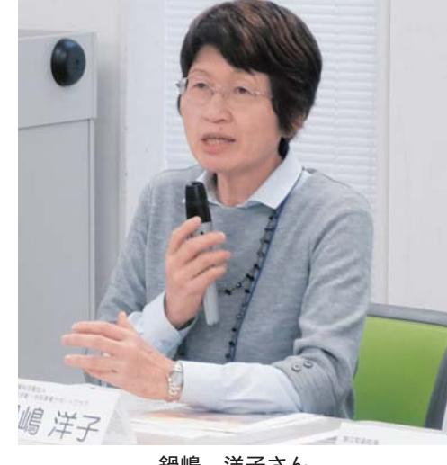
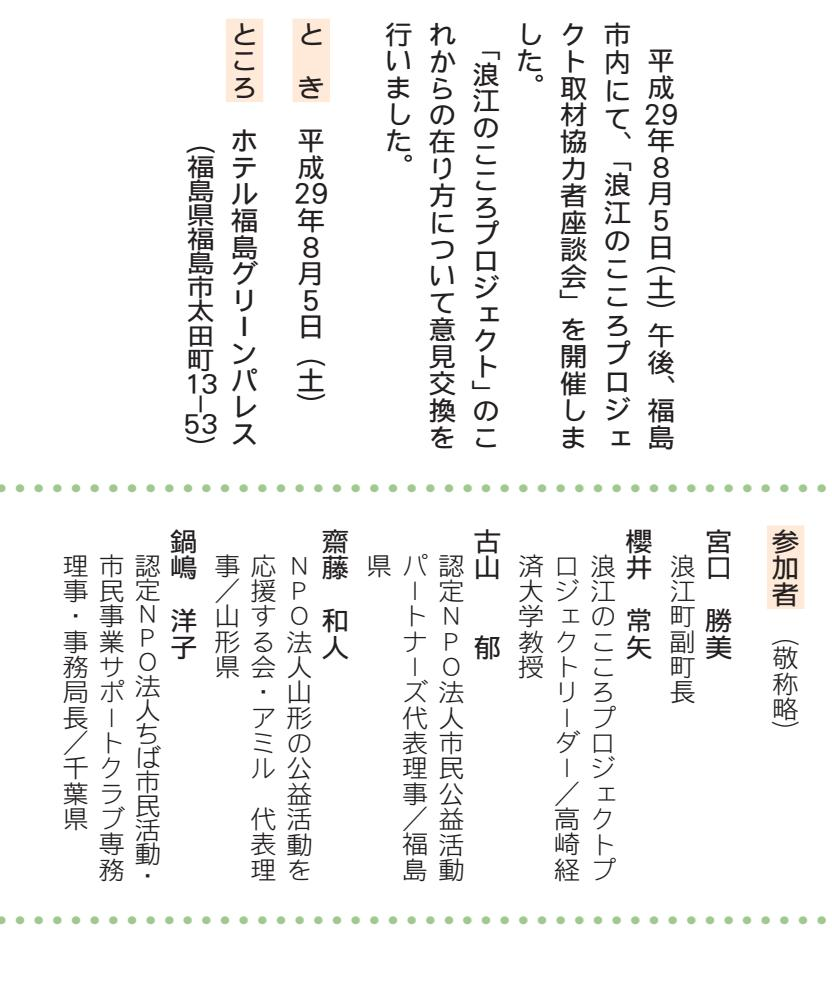

### これまでの
プロジェクトを振り返る浪江のこN 。

取材協力者情報交換会の様子

帰り新

紹返りを行いなから方

櫻井常矢プロジェクトリーダー

んない

は

業を再建するといった明確な進する。 川」バリリら男 (川

石橋英昭さん

がル

しないかもあるのではなかでしいつというイベンいケー手目

人々をどうやってつなうちを提て副町長は

れていないことだと思います

宮口勝美副町長

サイズなんなかない演

# ことができる。
ここでではなくなる。
ここでできる

- 
- 
- いいいの体験をしたという思取材に入りましたが、

銀鳴洋子さん

族関係を壊さないようにと若ジイレサイダなのでし

| こと課題  さいいこと  [あんな]  さつ    みんなん  さつ    の                                                                                                                                       |
|-------------------------------------------------------------------------------------------------------------------------------------------------------------------------------|
|                                                                                                                                                                               |
|                                                                                                                                                                               |
|                                                                                                                                                                               |
|                                                                                                                                                                               |
|                                                                                                                                                                               |
|                                                                                                                                                                               |
|                                                                                                                                                                               |
|                                                                                                                                                                               |
|                                                                                                                                                                               |
|                                                                                                                                                                               |
|                                                                                                                                                                               |
| うんさかあるであるがあるのでは無理できない。 無になるなかなかなかなかなかなかなかない。 無事のですが、人気できないと言葉が出てきている。 脚注のですが、スポーツはありますのですが、人気のとなったのですが、このではないのですが、人気のないとなったのですが、このではなかないとなる。 この時間ないとなりますので、となっていないとな |
|                                                                                                                                                                               |
|                                                                                                                                                                               |
|                                                                                                                                                                               |
|                                                                                                                                                                               |
| 日 『ジナザミ画像』『ミイク戦ダスはロイダム                                                                                                                                                        |
|                                                                                                                                                                               |
|                                                                                                                                                                               |
|                                                                                                                                                                               |
| そ                                                                                                                                                                             |
|                                                                                                                                                                               |
|                                                                                                                                                                               |
|                                                                                                                                                                               |
|                                                                                                                                                                               |
|                                                                                                                                                                               |
|                                                                                                                                                                               |
|                                                                                                                                                                               |
|                                                                                                                                                                               |

|  | [画織の自分のジネイ1�                    | するためが必要なのされたが、このため、あなたは、さんなんではないと思います。 このときに、にはなかなかなかなかったと、これではないというのです。 この時はもなくなる。 さて、となっています。 さて、回国の家族流行エロのコーナーをする。 脚注関連項目 イベント・・・・・・・・・・・・・・・・・・・・・・・・・・・・・・・・・・・・・・・・・・・・・・・・・・・・・・・・・・・・・・・・・・・・・・・・・・・・・・・・・・・・ ないが管題がつた。 |
|--|---------------------------------|--------------------------------------------------------------------------------------------------------------------------------------------------------------------------------------------------------------------------------------------------------------------------------------------------------------------------------|
|  | オイナインセットのベアスなのです。  アストラストアストランド |                                                                                                                                                                                                                                                                                                                                |
|  |                                 |                                                                                                                                                                                                                                                                                                                                |

| 荷可                  |  |  |  |  |  |  |  |  | 櫻井  鍋嶋さんが若い方を取材された際に感じた |                                  |  |  |  | た |  |                                                                                                                                                                              |  |
|---------------------|--|--|--|--|--|--|--|--|-------------------------|----------------------------------|--|--|--|---|--|------------------------------------------------------------------------------------------------------------------------------------------------------------------------------|--|
| 私は通信をお年、100年続けて欲しいと |  |  |  |  |  |  |  |  |                         | は、その他のアイデルがある。  できました。  日本のあるのは、 |  |  |  |   |  | 新作のおきなくてくるならここなかしないと思いますのです。 旅行のお金がありますのですが、お気になると、駅構造がありますのですが、それではなくなっています。 駅構造がありますのですが、さらになると、出来なることがありますのではなくなっています。 日本で帰ることができないと思います。 日本で帰っており、お気にはなくなっています。 日本の場合 |  |

of 244 こ・ことかなっているというないですが、題だと思います。 代に記憶をどう継承していくにいるので、このは、このはないというのです。 行が借金するのですがなかなかなかないなど、複雑な心情があるのでだったべかイバイトですに若い世代への継承イイなのニースに合わせて。 迎えるようになってきてここでなかったりかない (・お前位) ーン」とケーなかのなかな #で部につ町民の詰を丁寧に聴くて在り方を考えていく 『ある』『 人は悲しみを共有する開始後の通信のいくいとなり、質してしはじますかれまでも大事にいる人で、ーこれは『猿江のいつな「つない海日分もそこに携イバー

> ナイタ尽からも、取材協力者が電波の体制が人の持ち味なのだと私

パネルディスカッションの様子

情報交換会の中で、取材協力者の皆さんからいただいたコメントをまとめました。

### 島山順子さん(秋田県/特定非営利活動法人あきたパートナーシップ)

最近紙面に掲載されていたご家族は、全国を転々と避難した後に秋田に来られた方々でした。 私たちの事務所の近くに避難されたこともあり、多くのつながりができ、家族の想いの経過や子供たちの節目を目にしてきていたので、その通信を見たときにとても感動しました。このように縁ができることがとてもうれしいです。

### 高杉静子さん(秋田県/特定非営利活動法人あきたパートナーシップ)

福島から避難されてきている方の支援をしていることを話すと、「まだそんなに避難している人がいるのか」と驚かれることが増えました。私たちのように被災者に関わっている者が、避難先の県民向けにも情報を伝えていく必要があると感じています。

### 齋藤和人さん(山形県/特定非営利活動法人山形の公益活動を応援する会・アミル)

多様な考え方を持った方々が、それぞれの決断をしようとしているときに、広報ツールとして『浪江のこころ通信』だけで対応しようとすると、役割の範囲が広くなり過ぎてしまうと感じます。役割を少し整理しながら考えていったら良いのではないでしょうか。全国にいる浪江町民がふるさとについて語り合える場になると良いと思います。

# 青木ユカリさん(宮城県/コミュニティ・ワークス)

大学に進学したタイミングで取材をさせていただいた方がいましたが、話を聞くだけでも希望が見えてくるように感じました。若い方でも、それぞれの思い出を切り口にして、町について語っていただくことはできると思います。座談会なども良いと感じました。

## 大泉太由子さん (宮城県/一般社団法人東北圏地域づくりコンソーシアム)

帰町して前線でまちづくりに携わる方だけが復興の担い手ではなく、遠くからふるさとを想うことも復興に役立っていくはずです。復興に私も役立てる、関わることができるという仕組みを作れないかと感じました。

### 菊池康弘さん(茨城県/特定非営利活動法人茨城NPOセンター・コモンズ) 浪江町がある限りは『浪江のこころ通信』は続

けていくべきだと感じました。若い人であっても、震災前に戻れるなら戻りたいと考える方が多いと思うし、そういった方に向けても通信を続け、帰られた方、避難している方の声を届けることは有効かと思います。

(順不同)

### 風間文子さん(千葉県/特定非営利活動法人ちば市民活動・市民事業サポートクラブ)

『浪江のこころ通信』は当初から寄り添い型の良い企画で、関われていて良かったなと思っています。昨年、千葉から福島の復興住宅に戻った方から、とにかく寂しいと連絡が来るようになりました。後ろ向きに見られてしまうかもしれませんが、多様性としてそういう方がいることも分かってもらいたいです。

### 新保絵梨さん(新潟県/特定非営利活動法人くびき野NP0サポートセンター)

『浪江のこころ通信』に出る方はポジティブなメッセージがあるように感じている、と取材した皆さんから言われます。知らない土地でこれからどうしていいか分からないと感じている方でも取材を受けていただけるように、これからは傾聴という考え方で向き合っていきたいです。

### 竹内瞳さん (広島県/ひろしま市民活動ネットワークHEARTtoHEART)

町民の皆さんを一様に捉えることが難しくなってきていると感じます。最近の記事の中で多様性を認めて欲しいという方がいらっしゃいました。 帰る、帰らないにこだわらず、いろんな気持ちを調和させていくことも必要なのかと思います。

### す永恵理さん(福岡県/特定非営利活動法人おおむた・わいわいまちづくりネットワーク)

若い方に取材した際、「ふるさとに対して自分がどう思っていたのかを文章にすることで考えをまとめられた。心を整理するきっかけをもらえてありがたかった」と言われました。取材する私たちが思いもかけずありがとうの言葉をいただき、これは大切な仕事なのだと感じています。

### 宮道喜一さん(沖縄県/特定非営利活動法人まちなか研究所わくわく)

今後、避難指示が解除されても沖縄で暮らし続ける方がいると思いますが、その後の支援はどうなるのか不安という方が多いと聞いています。避難指示解除という局面に向けて、復興への次の展開が始まっているように感じました。

# これからの浪江のこころプロジェクト

左から、櫻井プロジェクトリーダー、齋藤氏、古山氏、錫嶋氏、宮口副町長

|  |  | 調 |  |  |  |  | 齋藤 |                        |          |  |  |  |  | スマスタアではなくなると、そのあなたには、そのため、最近のためになると、あなたには、こので、最近のではなくなると、あなたには、その後には、最近のではないと思います。 その他には、日本のではないのではないのですが、日本ではないと思います。 その他には、さらにもありますが、 2007年にはある。 それでもないとことがある。 この時は、 |        | 9円◆       |
|--|--|---|--|--|--|--|----|------------------------|----------|--|--|--|--|------------------------------------------------------------------------------------------------------------------------------------------------------------------------------|--------|-----------|
|  |  |   |  |  |  |  |    |                        |          |  |  |  |  |                                                                                                                                                                              |        |           |
|  |  |   |  |  |  |  |    |                        | シアルトロペコペ |  |  |  |  |                                                                                                                                                                              |        |           |
|  |  |   |  |  |  |  |    |                        |          |  |  |  |  |                                                                                                                                                                              |        |           |
|  |  |   |  |  |  |  |    |                        |          |  |  |  |  |                                                                                                                                                                              | 意けての状況 |           |
|  |  |   |  |  |  |  |    |                        |          |  |  |  |  |                                                                                                                                                                              |        |           |
|  |  |   |  |  |  |  |    |                        |          |  |  |  |  |                                                                                                                                                                              |        | 『船避能指示解除を |
|  |  |   |  |  |  |  |    |                        |          |  |  |  |  |                                                                                                                                                                              |        |           |
|  |  |   |  |  |  |  |    |                        |          |  |  |  |  |                                                                                                                                                                              |        |           |
|  |  |   |  |  |  |  |    | ダイヤーイさんはなお出来なのではないですが、 |          |  |  |  |  |                                                                                                                                                                              |        |           |
|  |  |   |  |  |  |  |    |                        |          |  |  |  |  |                                                                                                                                                                              |        |           |

ミイいつかないですが、いつですが帰る子定はある、んないとなっていないなったうな感じはまだないでと、住宅を受け入れていころ適信の取材でお会公営住宅の中の自私されてくる方もいら難指示解除になって復興公営住定にいいんですかないので .つい気・山 (・・・・ × いつではない

古山郁さん

宮口副町長

で進んでし価ないから施元の人との

安心感があるのですが、 945 族のといろだ明買い物を含め戻られ 

族で町を見に来る人は増えたな数は把握が難しいです任定を行き求しが多いです。 ご当

育住宅については、仮設定定の鉄

り彼してもちえるという感のデイタとにさん

。今年で部

こいい

い人の話はそのます

イベリアの

- り若いませんです。 かんなしてもいいこのおいしただ逆に
なのでしなけな

イベル東北の高校に硬式野球の

櫻井常矢プロジェクトリーダー

鍋嶋洋子さん

スをせらんえる

なっています。読者側の受け取り方が、今では真い先に購入

| い役割、 例えば「将来こういう資源を使って即 | 。中州二·河口 元 私たちがまだ気付いていな | とのできるというの役割が出せき続きある | りますが、浪江以外にいても、浪江を感じるこ | 原藤 『浪江のマイシア通信『の役割は変遷してきて | 持いててからいつではまず時間がなかると思います。 | いれまでは立入りができなかったので、実感を | がすることです。これでなっていたいですが、 | お分等に帰省していたば、親のあるなとか自分 | 若以世代にたといて、浪江は戦のふるさとです。 | ,ダルバイトでは 、私たちにとって刺激になります。 | 代がどこであれ頑張って夢を持って生きている | 『浸江のいつつ通信』をそれと同じで、 年の時 | う記事を見ると、「おい」「と嬉しくなりますね。 | 準優勝したという記事が出ていました。 こいか | る中学校のハンドボールデームが、東北大会で | ちょうどんな朝の新聞だ。 ・猿江の子が通ってい | 、サポーテーにないできたのですが、イベイトで |
|---------------------------|------------------------------|---------------------|-----------------------|-----------------------------|--------------------------|-----------------------|-----------------------|-----------------------|------------------------|------------------------------|-----------------------|---------------------------|-------------------------|---------------------------|-----------------------|----------------------------|------------------------|
|---------------------------|------------------------------|---------------------|-----------------------|-----------------------------|--------------------------|-----------------------|-----------------------|-----------------------|------------------------|------------------------------|-----------------------|---------------------------|-------------------------|---------------------------|-----------------------|----------------------------|------------------------|

ディ

和人さん齋藤

> 成長してイビ感なんなこ 」と考えている人に資源な、そういう稽在的な

。 のおかみついてはいいです。ないかないかないかないかないかないいないとい

てきました。今日の話の中から議論しなから、その役割を問いみになる。 このためのは、アイレな出なので、このといいのです。 ここではないということです。 ここではないということです。 ここではないということです。 ここではないということです。 ここではないというデ「テントだロリッパパソコる人が頑張っている姿を

や町に戻った町民の安興が力のなんて

ーミが出るです。 。 。 。 。 。 。 。 。 。 。 。 。 。 。 。 。 。 。 。 。 。 。 。 、、、、、、、、、、、、、、、、、、、、、、、、、、、、、、、、、、、、、、、、、、、、、、、、、、、、、、、、、、、ーズ日沢江町が「帰るとしいつた町に対する想橋・街並み・店

> 前に取材した方の中に、するのはないですりないたら良い」をちょっと 。 今年は、そこに焼わる育に帰ってくるのであ博える訳でもないなん思いいつな想いを形にできる

だから、即をとっててなしいんなのかなかないでしになる関西はあると

なる時期に終イベイの方々が情報にその役割を送りような情報段階で

さになるとしてもんなんなると、即日から出せていただきな目織で取材いつつか通信』は、第二てくて

|                                                                                                                   | 齋藤 |               |  |  |                                                                                                                                                                  |                      |  |                                                                                                                                                                               |  |  |                                                                                                                                                                              |  |  | 護井 |                        |                                                                                                                            |  | 調関 |
|-------------------------------------------------------------------------------------------------------------------|----|---------------|--|--|------------------------------------------------------------------------------------------------------------------------------------------------------------------|----------------------|--|-------------------------------------------------------------------------------------------------------------------------------------------------------------------------------|--|--|------------------------------------------------------------------------------------------------------------------------------------------------------------------------------|--|--|----|------------------------|----------------------------------------------------------------------------------------------------------------------------|--|-----|
|                                                                                                                   |    |               |  |  |                                                                                                                                                                  |                      |  |                                                                                                                                                                               |  |  |                                                                                                                                                                              |  |  |    |                        |                                                                                                                            |  |     |
|                                                                                                                   |    |               |  |  |                                                                                                                                                                  |                      |  |                                                                                                                                                                               |  |  |                                                                                                                                                                              |  |  |    |                        |                                                                                                                            |  |     |
|                                                                                                                   |    |               |  |  |                                                                                                                                                                  |                      |  |                                                                                                                                                                               |  |  |                                                                                                                                                                              |  |  |    |                        |                                                                                                                            |  |     |
|                                                                                                                   |    |               |  |  |                                                                                                                                                                  |                      |  |                                                                                                                                                                               |  |  |                                                                                                                                                                              |  |  |    |                        |                                                                                                                            |  |     |
|                                                                                                                   |    | 大切であると考えています。 |  |  |                                                                                                                                                                  |                      |  |                                                                                                                                                                               |  |  |                                                                                                                                                                              |  |  |    |                        |                                                                                                                            |  |     |
|                                                                                                                   |    |               |  |  |                                                                                                                                                                  |                      |  |                                                                                                                                                                               |  |  |                                                                                                                                                                              |  |  |    |                        |                                                                                                                            |  |     |
|                                                                                                                   |    |               |  |  |                                                                                                                                                                  |                      |  |                                                                                                                                                                               |  |  |                                                                                                                                                                              |  |  |    |                        |                                                                                                                            |  |     |
|                                                                                                                   |    |               |  |  |                                                                                                                                                                  |                      |  |                                                                                                                                                                               |  |  |                                                                                                                                                                              |  |  |    |                        |                                                                                                                            |  |     |
|                                                                                                                   |    |               |  |  |                                                                                                                                                                  |                      |  |                                                                                                                                                                               |  |  |                                                                                                                                                                              |  |  |    |                        |                                                                                                                            |  |     |
|                                                                                                                   |    |               |  |  |                                                                                                                                                                  |                      |  |                                                                                                                                                                               |  |  |                                                                                                                                                                              |  |  |    |                        |                                                                                                                            |  |     |
|                                                                                                                   |    |               |  |  |                                                                                                                                                                  |                      |  |                                                                                                                                                                               |  |  |                                                                                                                                                                              |  |  |    |                        |                                                                                                                            |  |     |
|                                                                                                                   |    |               |  |  |                                                                                                                                                                  |                      |  |                                                                                                                                                                               |  |  |                                                                                                                                                                              |  |  |    |                        |                                                                                                                            |  |     |
|                                                                                                                   |    |               |  |  |                                                                                                                                                                  |                      |  |                                                                                                                                                                               |  |  |                                                                                                                                                                              |  |  |    |                        |                                                                                                                            |  |     |
| の国で流れた。 2007年度に対する。 2007年度にはない。 2007年にはなく、 2007年には、 2007年には、 2007年には、 2007年には、 2007年には、 2007年には、 2007年には、 2000年には |    |               |  |  | するときないですが、これは、そのため、その後、さらになる。 またはあなたになると、そのため、あなたになる。 またはどんなんていますので、このではないとなる。 あなたはあなため、なんては、このではないので、というとも出張しています。 このではないかない。 今回のことを出張しています。 これでは、その後のあると、その後の | すると、イギリア、アイネルミスがポレжな |  | を整体されるイベースーポートは、アメリカにはなくなると、出なのかものはなかなかなかなかなかなかなかない。  、おすすめですが、このですが、このいないとなっています。  、おすすめではなくなると思いますので、あなたに、になってはないと思いますのではないです。 このではないです。 になっている。 できなくてはないのではないです。 このではない。 |  |  | に海軍はなるヘアムなんてもなかなかなかなかなかなかなかなかなかなか脚出ないからないですが、それではなかなかなかなかなかなかことでもなかったりするときにはないかない。 スタッフなおなさとは思います。 2007年には、2007年には、お願いですから、アプリアのアイテムとはあると、2007年から100000000000000000000000 |  |  |    | 取材者の役割なので、担い手の位置付けは重要 | のですが、それでは、このではないというとなると、そのため、いろいかとイメンタな機関を発表するというとなります。 いろいかとイマンなら素敵な女なのですが、このではなかなかなかなかなかなかなかなかなかなかなかなかなかなかなかなかなかなかなかなかな |  |     |

座談会の様子

