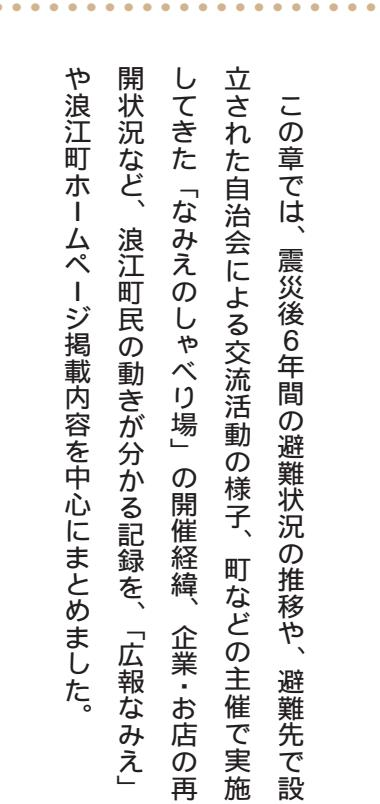

第の記事

記

録

集

全国都道府県別の浪江町民避難状況(平成29年8月末現在)

| 都道府県                | 数 人 | 都道府県           | 人数 | 都道府県        | 人 数 | 都道府県           | く 数 |
|---------------------|--------|----------------|-----|-------------|--------|----------------|--------|
| 北海 道            | 69     | 京 都 東    | 845 | 救 賞 賞 | ಗ      | 香川 鳥       | 5      |
| 青 眞 未         | 42     | 神奈川県           | 436 | 京 都 府 | 29     | 模 県 咲    | 13     |
| 岩 는 賞         | 37     | 新 県 得    | 382 | 大 版 府 | 60     | 高 眞 知    | 5      |
| 官 城 晨         | 856    | link 山 信 | 13  | 年 庫 県 | 22     | 福 眞 网    | 19     |
| 秋 出 賞         | 52     | 眞 石 11   | 26  | 良 楽 賞 | 5      | 佐 त्रण 眞 | ਪੈ     |
| 晨 Ш 光         | 148    | 信 福 井    | 12  | 和歌山県     | 0      | 長 賞 临    | 12     |
| 眞 福 島         | 14.416 | 信 山 製    | 43  | 鳥 眞 取 | 0      | 能 眞 本    | ട      |
| 炭 城 賞         | 1.009  | 長 県 動    | 49  | 島 根 県 | 6      | 大 分 眞    | 5      |
| 栃 木 模         | 477    | 信 版 를    | 15  | 运 賞 Ш | 20     | ਦਿ 崎 鳥   | ு      |
| 群 馬 眞         | 152    | 信 静 贸    | 52  | 広 름 眞 | 10     | 鹿児島県           | 7      |
| 信 埼 ー         | 698    | 信 游 知    | 39  | 眞 Ш      | 0      | 润 縄 賞    | 19     |
| ー 業 眞         | 576    | 1111 重 信 | 5   | 徳 島 県 | 1      | 外 国         | 12     |
| ※福島県の人数は帰町した方を含みます。 |        |                |     |             | ਵਿ     | illa           | 20,722 |

福島県内避難者数

福島県外避難者数

14,416 6,306

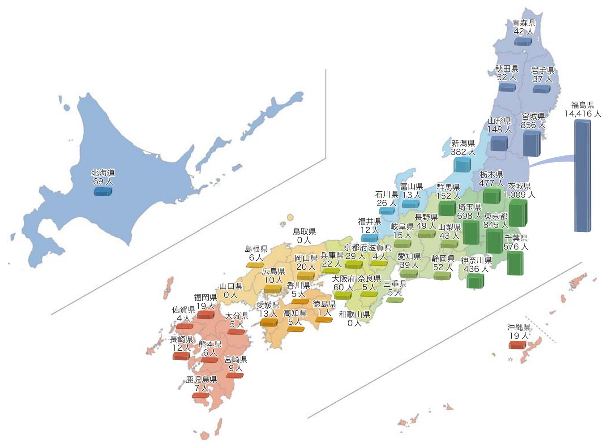

## 福島県内市町村別の浪江町民避難状況(平成29年8月末現在)

| 市町村名               | 数 人 | 市町村名          | 数 人 | 市町村名            | 数 人 | 市町村名           | 人 数 |
|--------------------|--------|---------------|--------|-----------------|--------|----------------|--------|
| 如果 ਜ 福       | 2,948  | 俣 叫 11  | 76     | 111   島 可 | O      | 漫 = 비    | 0      |
| 会津若松市              | 229    | 大 H 村   | 152    | 金山 可        | 1      | 市 비 殿    | 1      |
| 市 都山           | 1,853  | 鏡 石 비   | 14     | 和村 出        | 0      | 111 春 비  | 70     |
| いわき市               | 3,210  | 天 学 村   | 1      | 会津美里町           | 11     | 小 비 出    | 17     |
| 元 目河           | 252    | 1 猫   비 | ব      | 村 世 张     | 146    | ム 盟 비    | 34     |
| 須賀川市               | 152    | 檜枝岐村       | 0      | 泉 崎 村     | 5      | 業 비 শ্রী | 9      |
| 喜多方市               | 27     | 月 見町      | 1      | 鳥 日 柯     | 0      | link ਸ 비 | 1      |
| 相馬市              | 490    | 南会津町          | 11     | 矢 吹 비     | 25     | 11 内 村   | ત      |
| 二本松市               | 1,344  | 北塩原村          | ನ      | 倉 비 相     | ઉ      | 能 大 비    | O      |
| 田村市              | 74     | 西会津町          | 2      | 失 প্লাহ 비 | O      | 葉 비 XX   | ()     |
| 南相馬市            | 2,016  | 料 梯町      | ਪ      | 墙 바          | ನ      | 濃 江 비    | 167    |
| 市 伊達           | 109    | 猪苗代町          | 36     | 厳 JII 村   | ব      | 看 尼斯 柯   | 0      |
| 市 本 日        | 571    | 会津坂下町         | 20     | 石 비          | 8      | 新 地町       | 82     |
| 楽 折 町        | 190    | 川村 湯       | O      | ド JI 村    | ನ      | 飯 館 村    | 0      |
| 見 町 म्मू     | 25     | 비 机 津   | O      | 田村 파        | 1      | 福島県内           | 5      |
| ※浪江町の人数代帰町) ** 古です |        |               |        |                 | ਵ      | 言              | 14,416 |

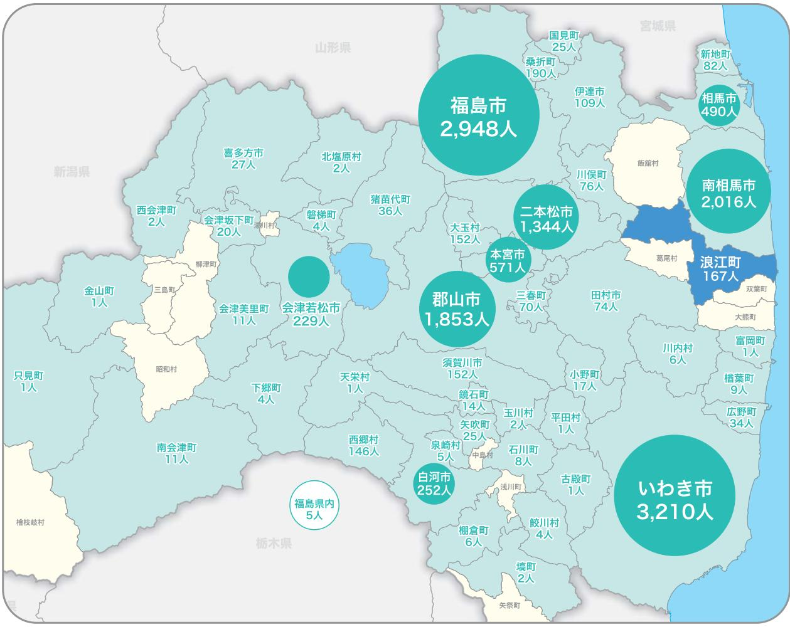

# 福島県内の応急仮設住宅、借上げ住宅、復興公営住宅への
入居者数の推移

|                   |               | 平成24年 | 平成25年 | 平成26年 | 平成27年 | 平成28年 | 平成29年 |       |
|-------------------|---------------|-------|-------|-------|-------|-------|-------|-------|
| 地区名               | 設 名 仮   | 3月    | 3月    | 3月    | 3月    | 3月    | 3月    | 8月    |
|                   | 桑折駅前 第1 工区 | 97    | 87    | 82    | 55    |       |       |       |
| 桑折町               | 桑折駅前 第2工区  | 219   | 178   | 144   | 126   | 60    | 29    | 8     |
|                   | 第3工区 桑折駅前  | 111   | 133   | 111   | 100   | 95    | 48    | 12    |
| 薬                 | 折町 小言     | 427   | 398   | 337   | 281   | 155   | 77    | 20    |
|                   | 郭内公園          | 228   | 200   | 182   | 161   | 135   | 73    | 48    |
|                   | 塩沢農村広場        | 175   | 144   | 116   | 94    | 79    | 46    | 33    |
|                   | 岳下住民センター      | 132   | 118   | 107   | 103   | 94    | 48    | 21    |
|                   | 旧平石小学校        | 148   | 140   | 116   | 107   | 95    | 62    | 38    |
|                   | 安達運動場         | 554   | 512   | 472   | 424   | 370   | 206   | 115   |
| 二本松市              | 建設技術学院跡       | 56    | 40    | 37    | 34    | 27    | 13    | O     |
|                   | 杉田住民センター      | 63    | 59    | 57    | 51    | 42    | 11    | O     |
|                   | 杉内多目的運動広場     | 307   | 285   | 273   | 224   | 187   | 101   | 83    |
|                   | 杉田農村広場        | 121   | 119   | 117   | 99    | 82    | 39    | 25    |
|                   | 大平農村広場        | 144   | 125   | 105   | 86    | 71    | प     | O     |
|                   | 永田農村広場        | 66    | 59    | 56    | 55    | 46    | 19    | 19    |
|  本松市   小計    |               | 1,994 | 1,801 | 1,638 | 1,438 | 1.228 | 622   | 382   |
|                   | 笹谷東部          | 425   | 352   | 339   | 308   | 258   | 193   | 93    |
|                   | 南矢野目          | 422   | 391   | 376   | 333   | 255   | 146   | 91    |
|                   | 北幹線第一         | 397   | 363   | 313   | 283   | 230   | 149   | 104   |
| 福島市               | 森合町           | 34    | 31    | 30    | 22    | 21    | 14    | 13    |
|                   | しのぶ台          | 111   | 116   | 112   | 89    | 78    | 49    | 47    |
|                   | 宮代第一          | 60    | 59    | 54    | 44    | 30    | 20    | 14    |
|                   | 宮代第二          | 43    | 41    | 32    | 27    | 20    | 14    | 8     |
|                   | 旧佐原小学校        | 78    | 69    | 46    | 48    | 48    | 28    | ਪ     |
| 福 를 小言 ក |               | 1,570 | 1,422 | 1,302 | 1,154 | 940   | 613   | 374   |
|                   | 石神第一          | 64    | 59    | 59    | 51    | 40    | 20    | 11    |
|                   | 石神第二          | 51    | 63    | 62    | 52    | 46    | 29    | 14    |
|                   | 栗木平           | 41    | 40    | 35    | 28    | 22    | 15    | ு     |
| 本宮市               | 小田部           | 69    | 63    | 56    | 49    | 37    | 29    | 19    |
|                   | 和田石上          | 25    | 24    | 24    | 17    | 6     | 0     | O     |
|                   | 高木            | 106   | 114   | 110   | 76    | 63    | 35    | 27    |
|                   | 恵向            | 267   | 243   | 230   | 222   | 200   | 130   | 80    |
| 小譜 本 宮市    |               | 623   | 606   | 576   | 495   | 414   | 258   | 160   |
| 相馬市               | 大野台第 8        | 227   | 207   | 200   | 200   | 170   | 111   | 79    |
| 南相馬市              | 八方内           |       | 42    | 97    | 97    | 97    | 57    | 41    |
| 合                 | 를             | 4,841 | 4,476 | 4,150 | 3,665 | 3,004 | 1,738 | 1,056 |

#### 【応急仮設住宅 ● 入居者数の推移】 (各月末の入居者人数)

#### 【借上げ住宅 ● 入居者数の推移】 (各月末の入居者人数)

| 如              | 平成24年 | 平成25年 | 平成26年 | 平成27年 | 平成28年 |        | 平成29年 |
|----------------|-------|-------|-------|-------|-------|--------|-------|
| 区 名         | 3月    | 3月    | 3月    | 3月    | 3月    | 3月     | 8月    |
| 県北             | 3.763 | 3.568 | 2,928 | 2,287 | 1,662 | 1.0999 | 899   |
| 県北(県営)         | 112   | 100   | 85    | 61    | 41    | 24     | 18    |
| 를 北  小計     | 3.875 | 3.668 | 3.013 | 2.348 | 1.703 | 1.123  | 917   |
| いわき            | 1.829 | 1.915 | 1.619 | 1.289 | 911   | 694    | 607   |
| いわき (県営)       | ട     | 11    | 11    | 9.    | ்.    | 6      | പ്    |
| き小計 わ ﺕ | 1,835 | 1,926 | 1,630 | 1,298 | 920   | 700    | 613   |
| 県中             | 1.857 | 1.896 | 1.619 | 1,243 | 877   | 624    | 553   |
| 県南             | 393   | 371   | 299   | 221   | 155   | 113    | 98    |
| 会津             | 517   | 413   | 293   | 205   | 141   | 93     | 85    |
| 南会津            | 8     | 8     | 4     | 3     | 1     | 1      | 1     |
| 相双             | 869   | 1.055 | 999   | 862   | 692   | 511    | 466   |
| 合 illa      | 9,354 | 9,337 | 7,857 | 6.180 | 4.489 | 3,165  | 2,733 |

(注)地区名で(県営)となっているのは、公営住宅への入居を示す。

### 【復興公営住宅 ● 入居開始になった浪江町民の人数】 (平成29年8月末現在)

#### 福島県復興公営住宅

| 所在地   | गु 手机 放 | 抑 名 नि         | 人数 (入居開始時期) |  |
|-------|---------------|----------------------|----------------|--|
|       | 1             | 北信団地                 | 20             |  |
|       | 2             | 笹谷団地                 | 16             |  |
|       | 3             | 飯坂団地                 | 90             |  |
| 福島市 | 4             | 北中央団地                | 68             |  |
|       | 5             | 北沢又団地                | 169            |  |
|       | 6             | (戸建又は2戸1棟) 北沢又2団地 | 103            |  |
|       | 7             | 北沢又2団地 (集合住宅)     | (H30年度後期)      |  |
|       |               | 를 누                  | 466            |  |
|       | 1             | 古川町団地                | 3              |  |
| 会津若松市 | 2             | 年貢町団地                | 4              |  |
|       | 3             | 白虎団地                 | 4              |  |
|       |               | 를                    | 11             |  |
|       | 1             | 日和田団地                | 3              |  |
|       | 2             | 富田団地 1 号棟            | 1              |  |
|       | 3             | 富田団地2号棟              | 5              |  |
|       | 4             | 東原団地 1 号棟            | 5              |  |
|       | 5             | 東原団地2号棟              | 18             |  |
|       | 6             | 八山田団地2号棟             | 54             |  |
| 郡山市   | 7             | 八山田団地3号棟             | 39             |  |
|       | 8             | 柴宮団地57号棟             | 20             |  |
|       | 9             | 柴宮団地59号棟             | 6              |  |
|       | 10            | 安積団地17・18号棟          | 4              |  |
|       | 11            | 守山駅西団地               | 55             |  |
|       |               | 를                    | 210            |  |
|       | 1             | 湯長谷団地                | 19             |  |
|       | 2             | 下神自団地                | 103            |  |
|       | 3             | 八幡小路団地               | 0              |  |
|       | 4             | 家ノ前団地                | 41             |  |
|       | 5             | 宮沢団地                 | 78             |  |
|       | 6             | 大原団地                 | 8              |  |
|       | 7             | 高萩団地                 | 42             |  |
| いわき市  | 8             | 四ツ倉団地                | (H29.10.1)     |  |
|       | 9             | 勿来酒井団地(戸建)           | (H29年度後期)      |  |
|       | 10            | 中原団地                 | 48             |  |
|       | 11            | (集合住宅) 勿来酒井団地     | (H29年度後期)      |  |
|       | 12            | 北好間団地                | (H29年度後期)      |  |
|       | 13            | 泉本谷団地                | (H29年度後期)      |  |
|       | 14            | 磐崎団地                 | (H29年度後期)      |  |
|       | 15            | 平赤井団地                | (H29.10.1)     |  |
|       |               | 着                    | 339            |  |

| 所在地   | गु 出 数 | 名 नु 出 | 人数 (入居開始時期) |  |  |
|-------|--------------|--------------|----------------|--|--|
|       | 1            | 南湖南団地        | 8              |  |  |
| 白河市 | 2            | 白坂団地         | 8              |  |  |
|       |              | 를            | 16             |  |  |
|       | 1            | 根柄山団地        | 144            |  |  |
|       | 2            | 石倉団地         | 284            |  |  |
| 二本松市  | 3            | 表団地          | 57             |  |  |
|       | 4            | 若宮団地         | 46             |  |  |
|       |              | 를 누          | 531            |  |  |
|       | 1            | 石崎北団地        | 0              |  |  |
| 田村市 | 2            | 石崎南団地        | 6              |  |  |
|       |              | 를            | 6              |  |  |
|       | 1            | 北原団地         | 316            |  |  |
|       | 2            | 上町団地         | 73             |  |  |
| 南相馬市  | 3            | 南町団地         | 213            |  |  |
|       | 4            | 牛越団地         | 51             |  |  |
|       | 5            | 西町団地         | 48             |  |  |
|       |              | 를            | 701            |  |  |
| 川俣町 | 1            | 壁沢団地         | 24             |  |  |
|       |              | 着十           | 24             |  |  |
| 三春町   | 1            | 平沢団地         | 7              |  |  |
|       |              | 信            | 7              |  |  |
| 広野町   | 1            | 下北道団地        | (H29.10.1)     |  |  |
|       |              | 름+           | 0              |  |  |
|       | 2,311        |              |                |  |  |

| 市町村営復興公営住宅   |          |              |     |  |  |  |
|---------------|----------|--------------|-----|--|--|--|
| 所在地           | गु 地数 | 和 名 नि | 人数  |  |  |  |
| 本宮市         | 1        | 下田园地         | 40  |  |  |  |
|               | ನ        | 吹上団地         | 25  |  |  |  |
|               | 3        | 树形団地         | 35  |  |  |  |
|               |          | 름+           | 100 |  |  |  |
| 桑折町           | 1        | 桑折駅前団地(1期)   | 72  |  |  |  |
|               | 2        | 桑折駅前団地(2期)   | 68  |  |  |  |
|               |          | 를            | 140 |  |  |  |
| 大玉村         | 1        | 横堀平団地        | 2   |  |  |  |
|               |          | 를 누          | 2   |  |  |  |
| 合 를 242 |          |              |     |  |  |  |

福島県復興公営住宅 + 市町村営復興公営住宅入居開始人数 2,553名

## 応急仮設住宅、借上げ住宅、復興公営住宅等の自治会の活動

#### 【応急仮設住宅自治会の状況】 (平成29年8月末現在)

|      | 立地市町村           |              | 自治会名            | 設立年月日        | 考 備 |
|------|-----------------|--------------|--------------------|--------------|--------|
|      | 桑折町           |              | 桑折駅前応急仮設住宅自治会      | 平成23年 8 月28日 | H28解散  |
|      |                 |              | 郭内公園応急仮設住宅自治会      | 平成23年11月28日  | H28解散  |
|      | 塩沢農村広場応急仮設住宅自治会 | 平成23年 9 月20日 |                    |              |        |
|      |                 |              | 岳下住民センター応急仮設住宅自治会  | 平成23年11月18日  | H28解散  |
|      |                 |              | 旧平石小学校応急仮設住宅自治会    | 平成23年11月30日  | H28解散  |
|      |                 |              | 安達運動場応急仮設住宅自治会     | 平成23年10月 1 日 |        |
|      | 二本松市         |              | 建設技術学院跡応急仮設住宅自治会   | 平成23年10月21日  | H28解散  |
|      |                 |              | 杉田住民センター応急仮設住宅自治会  | 平成23年 9 月20日 | H28解散  |
|      |                 |              | 杉内多目的運動広場応急仮設住宅自治会 | 平成23年11月24日  | H28解散  |
|      |                 |              | 杉田農村広場応急仮設住宅自治会    | 平成23年10月 1 日 | H28解散  |
|      |                 |              | 大平農村広場応急仮設住宅自治会    | 平成23年 9 月28日 | H28解散  |
|      |                 |              | 永田農村広場応急仮設住宅自治会    | 平成23年10月 7 日 | H28解散  |
|      |                 |              | 笹谷東部応急仮設住宅自治会      | 平成23年 9 月15日 | H28解散  |
|      |                 | ਜ ਹਿ         | 南矢野目応急仮設住宅自治会      | 平成23年10月 8 日 | H28解散  |
|      |                 |              | 北幹線第一応急仮設住宅自治会     | 平成23年10月 1 日 | H28解散  |
| 福    | 島               |              | 森合町応急仮設住宅自治会       | 平成23年10月 3 日 | H27解散  |
|      |                 |              | しのぶ台応急仮設住宅自治会      | 平成23年10月18日  | H27解散  |
|      |                 |              | 宮代応急仮設住宅自治会        | 平成23年10月15日  | H27解散  |
|      |                 |              | 旧佐原小学校応急仮設住宅自治会    | 平成23年10月 5 日 | H28解散  |
|      | 石神第一応急仮設住宅自治会   | 平成23年11月7日   |                    |              |        |
|      |                 |              | 石神第二応急仮設住宅自治会      | 平成23年11月16日  | H28解散  |
|      |                 |              | 栗木平応急仮設住宅自治会       | 平成23年11月15日  | H28解散  |
| 本    | 官               | 市            | 小田部応急仮設住宅自治会       | 平成23年10月17日  | H28解散  |
|      |                 |              | 和田石上応急仮設住宅自治会      | 平成23年11月 1 日 | H28解散  |
|      |                 |              | 高木応急仮設住宅自治会        | 平成23年11月 9 日 | H28解散  |
|      |                 |              | 恵向応急仮設住宅自治会        | 平成23年10月14日  |        |
| 相    | 馬               | 市            | 大野台第8応急仮設住宅自治会     | 平成24年 4 月12日 |        |
| JIII | 俣               | 町            | 中山工業団地応急仮設住宅自治会    | 平成23年12月22日  | H28解散  |
|      | 南相馬市         |              | 八方内応急仮設住宅自治会       | 平成25年 9 月26日 | H28解散  |

※設立年月日は、会則の施行日

に尋を閉じました。

10月12日、相馬市大野台第8応急仮設住宅において、自治会主催によるなみえ復興祭2013秋が開催されました。
 当日は天気にも恵まれ、馬場町長とのお茶会をはじめ、出店にはなみえ焼

そばや同仮設に入居されている町民の方々が作ったおこわや漬物、野菜、ラフトなど多くのものが並びました。

 集会所前のステージでは、アーティストの皆さんによるライブや抽選会な
どイペントが多数催されました。 町民の方や相馬市周辺にお住いの方など約 500名の方が来場し、同仮設集会所前の会場は多くの人々で賑わいました。
 自治会長の小松さんは、「皆さんが楽しみながら幹を深め、希望を感じる
ことができたと思います。」と避難中でありながらも前向きに進もうとする

姿勢と復興祭の成功に対する言葉を述べられました。 復興祭の最後には、来場された皆さんに、同仮設へ物資の支援をしてくだ
っている熊本県の大嵐屋さんからリンゴジュースが配られ、大盛況のうち

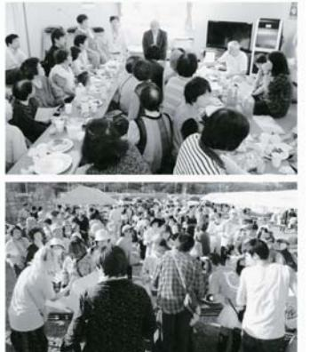

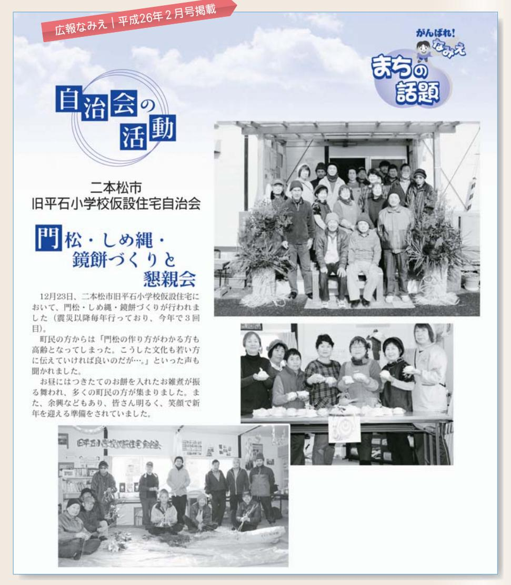

| 立地市町村 立地都道府県 | 組 織 名              | 主な対象エリア                             | 発足年月日         | 備 考 |
|-----------------|--------------------------|-------------------------------------|---------------|--------|
| 楽 折町        | 桑折駅前団地自治会                | 桑折災害公営住宅桑折駅前団地に 人居する浪江町民         | 平成27年 8 月 1 日 |        |
|                 | 福島市浪江自治会                 | 福島市春日町 (福島第3小学校西側地区)             | 平成24年 2 月15日  |        |
|                 | 福島中央浪江町自治会               | 福島市方木田、八木田、野田、中 央町、八島田、泉、森合、笹谷   | 平成24年 2 月20日  |        |
|                 | 福島地区なみえ交流会               | 福島市地区およびその近隣                        | 平成24年 6 月27日  |        |
| 島 福 市     | 雇用促進住宅信夫宿舍自 治会        | 福島市雇用促進住宅信夫宿舎                       | 平成24年11月1日    | H27解散  |
|                 | 県営住宅飯坂団地自治会              | 県営復興公営住宅飯坂団地居住者 (浪江町民以外も含む)      | 平成27年10月31日   |        |
|                 | 北中央団地自治会                 | 北中央団地(復興公営住宅)居住 ਜੋਧਾ             | 平成28年12月11日   |        |
|                 | 浪江二本松会                  | 福島県内外                               | 平成24年6月1日     | H28解散  |
|                 | 二本松コスモス会                 | 二本松市内                               | 平成25年 1 月24日  |        |
| 二本松市            | 県営根柄山団地自治会               | 根柄山団地(復興公営住宅)居住 者                | 平成29年 3 月 5 日 |        |
|                 | 県営石倉団地自治会                | 石倉団地(復興公営住宅)居住者                     | 平成29年 3 月17日  |        |
|                 | 本宮吹上団地自治会                | 吹上団地居住者                             | 平成28年 9 月28日  |        |
| 本宮市           | 下田第二市営住宅自治会              | 下田第二市営住宅居住者                         | 平成28年12月 1 日  |        |
|                 | 树形第二市営住宅自治会              | 树形第二市営住宅居住者                         | 平成28年12月12日   |        |
| 大玉村           | コスモス南達会                  | 南達地方(大玉村、本宮市等) 近隣                   | 平成25年 9 月 4 日 |        |
| 트 都 ਜ     | 郡山コスモス会                  | 郡山市内および近隣                           | 平成25年 2 月16日  |        |
| 須賀川市            | 須賀川コスモス会                 | 須賀川市内および近隣                          | 平成25年 4 月24日  |        |
| 自河市           | 浪江ネットワークしらかわ             | 白河地方、那須地域                           | 平成24年 1 月12日  |        |
| 会津若松市           | 会津地方なみえ会                 | 会津地方、その近郊                           | 平成24年 4 月19日  |        |
|                 | なみえ絆いわき会                 | いわき市、その近郊                           | 平成24年 2 月 5 日 |        |
|                 | 湯長谷団地24号棟自治会             | 県営復興公営住宅湯長谷団地24号 棟入居者(浪江町民以外も含む) | 平成27年 7 月12日  |        |
| いわき市            | 浪江町下神自団地自治会              | 県営復興公営住宅下神白団地に居 住する浪江町民          | 平成27年 8 月 2 日 |        |
|                 | 県営住宅宮沢団地自治会              | 宮沢団地(復興公営住宅)居住者                     | 半成29年 4 月 1 日 |        |
| 南相馬市            | なみえ相双会                   | 南相馬近隣                               | 平成24年 8 月18日  | H28解散  |
|                 | 東雲の会                     | 国家公務員宿舍東雲住宅住民 (浪江町民以外も含む会)       | 平成23年 9 月16日  |        |
| 東京都           | サロンFMI会                  | 東京都町田市周辺                            | 半成25年 7 月10日  |        |
| 新 潟県         | コスモス会                    | 新潟県柏崎市内                             | 平成24年 3 月 5 日 |        |
|                 | いい仲間つく浪会 (つくば圏浪江町民の会) | つくば市ならびに近隣市町村を含 む茨城県南地域          | 半成24年 4 月10日  |        |
| 茨城県           | 浪江ネットワークひたち なか・東海     | 茨城県ひたちなか市、東海村内                      | 平成27年 3 月18日  |        |

## 【借上げ住宅、復興公営住宅等の自治会の状況】 (平成29年8月末現在)

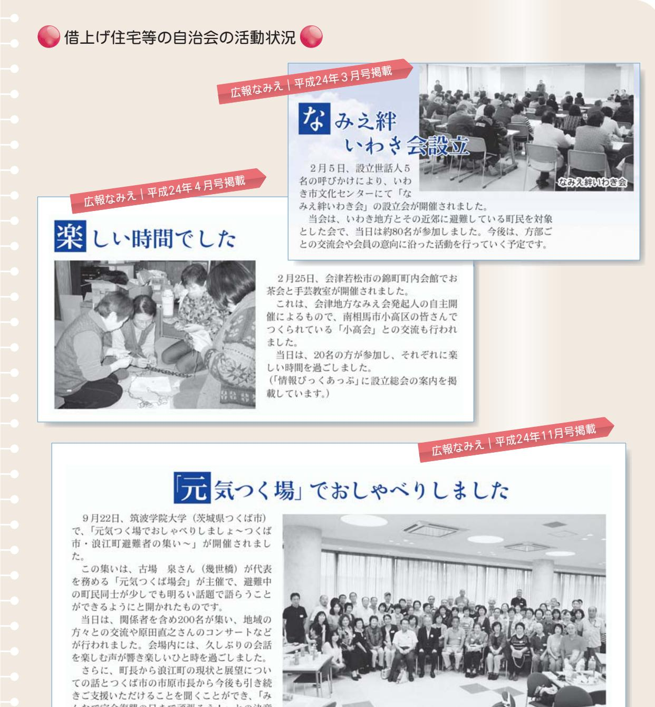

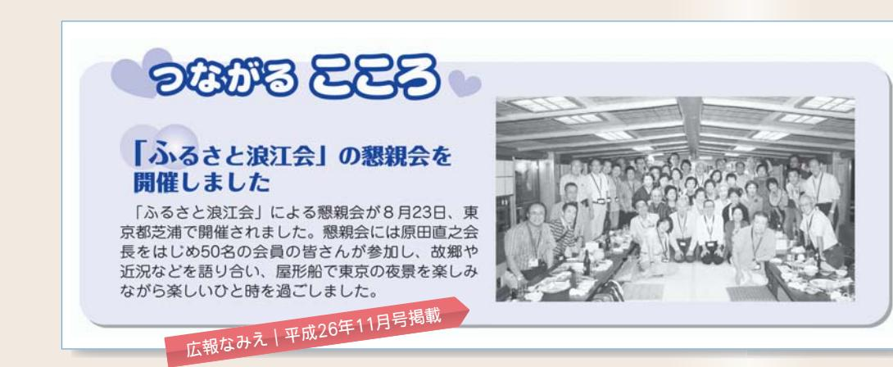

#### - 

--

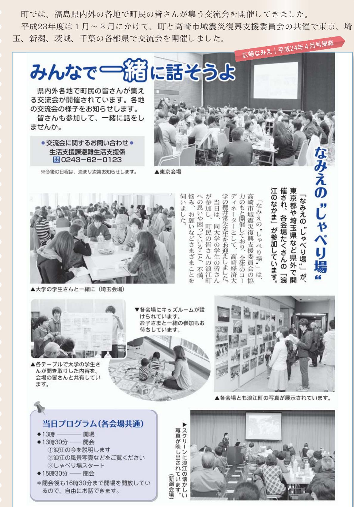

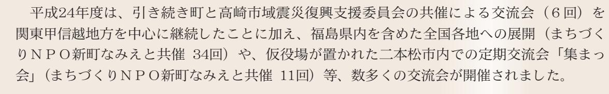

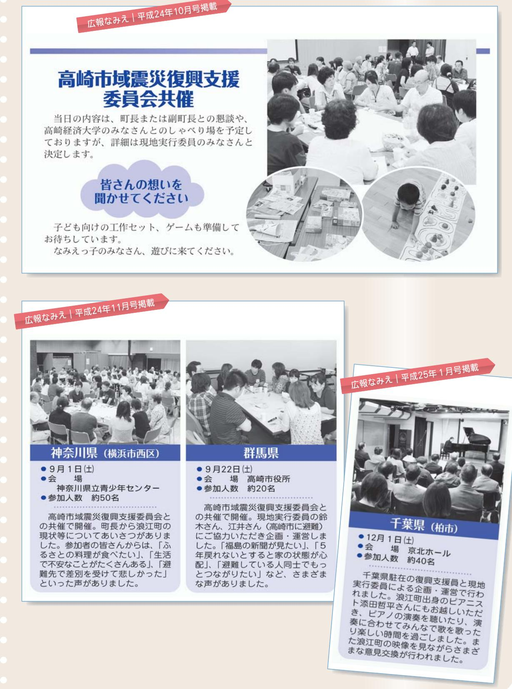

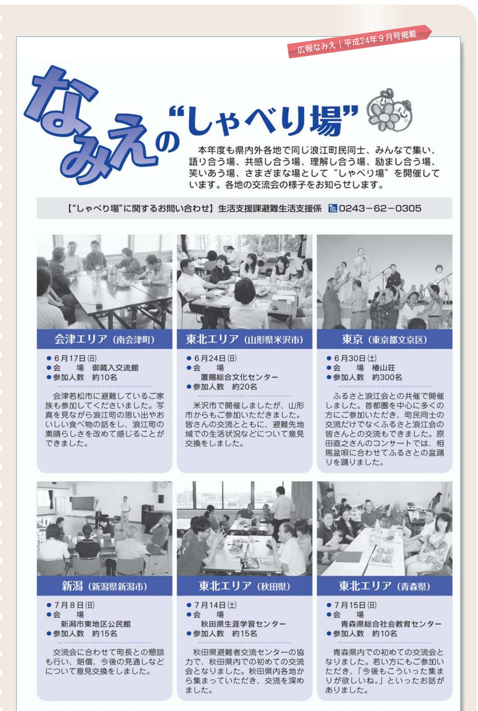

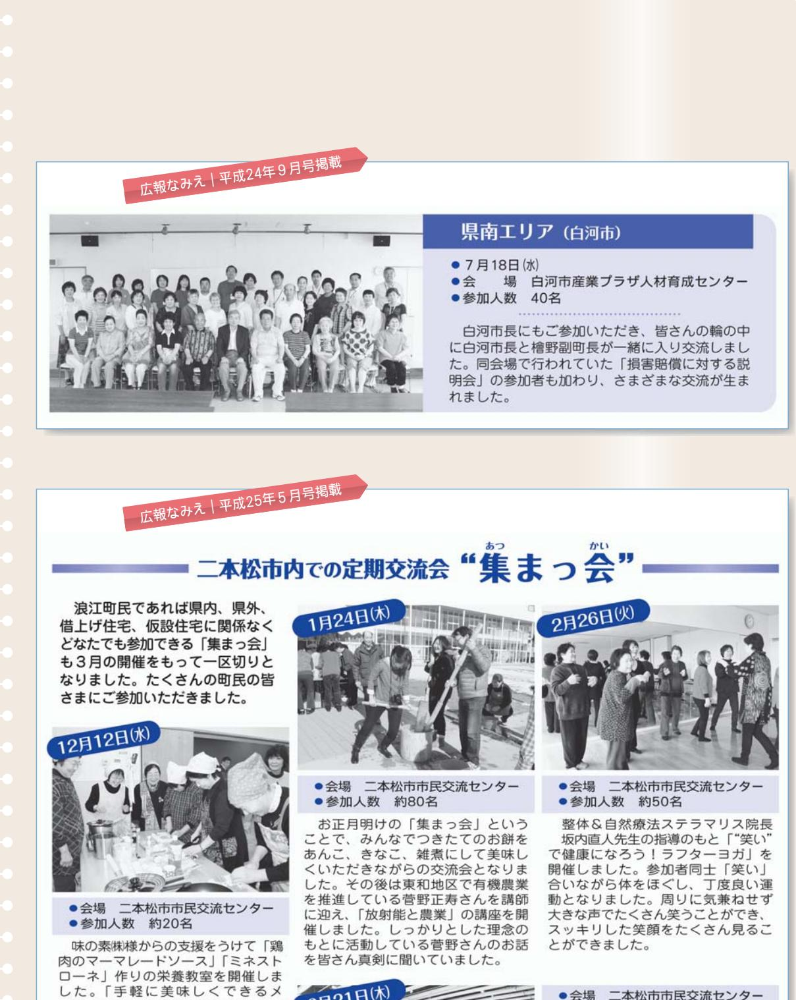

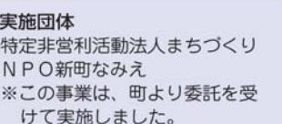

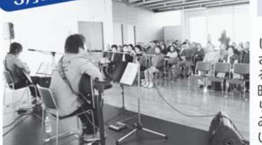

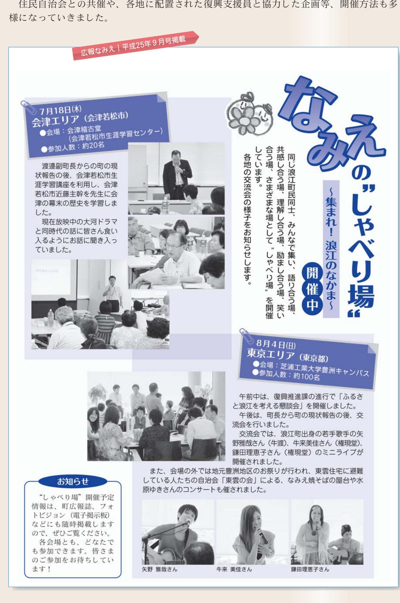

平成25年度以降も、町主催の「なみえの"しゃべり場"」は継続して開催されています。

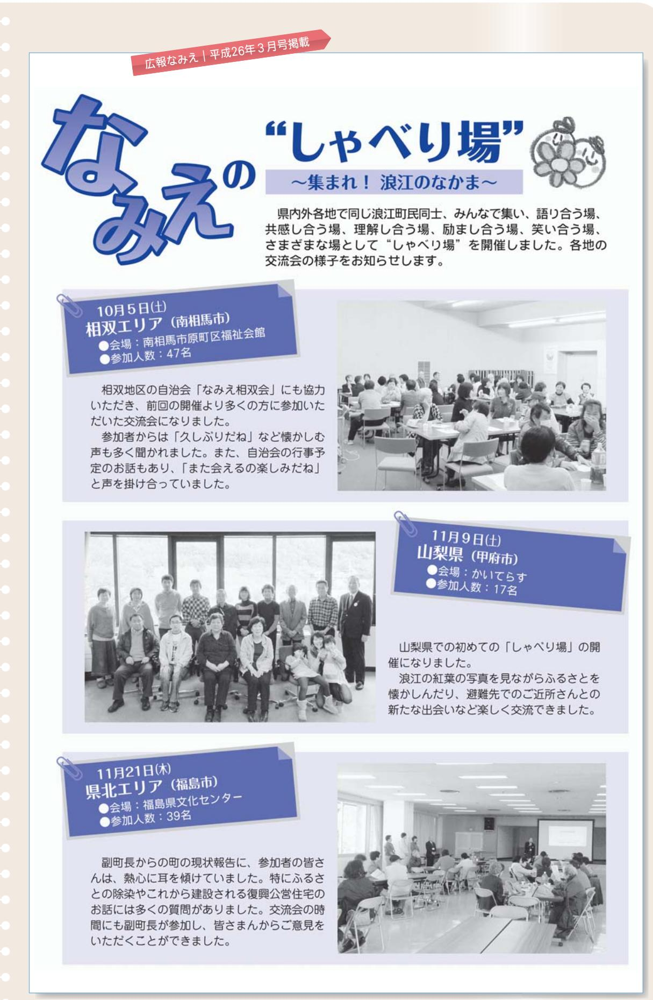

広報なみえ|平成26年3月号掲載

県南地域の自治会「なみえネットワーク白河」との共催で開催しました。 自治会の女性部で構成される「白河コスモス会」によるズンドコ節の披露や副会長の歌声披露もありの、盛りだくさんの内容でした。

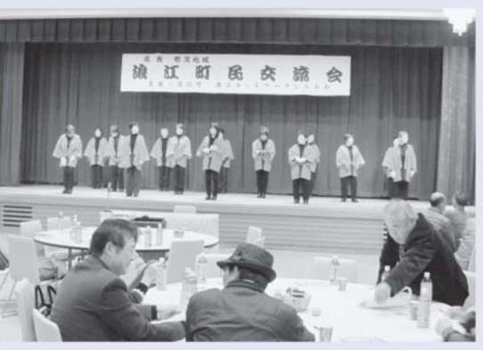

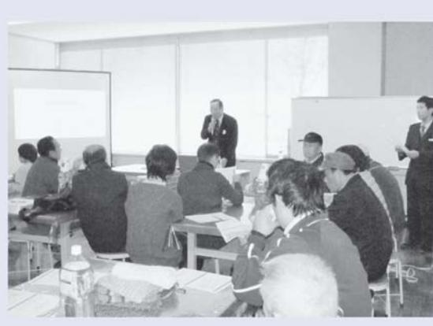

11月30日(土) 茨城県 (那珂市) ●会場:那珂市中央公民館 ●参加人数:29名

初めての茨城県県北地方での開催となりました。「交流会に参加するのは初めて」という方もいらっしゃいました。 参加者は少なめでしたが、副町長との懇談で様々なご意見を交わすことができました。

2月8日(土) 宮城県(名取市) 成宗 (石本)
●会場:イオンモール名取
●参加人数:26名
●参加人数:26名

「イオン心をつなぐプロジェクト」の支援により、ショッピングセンター内のホールで開催しました。

当日はあいにく大雪の天気でしたが、前回の交流会より多くの方に参加いただきました。 副町長による町の現状報告の後、これからの町の姿を皆さんで熱心にお話されていました。

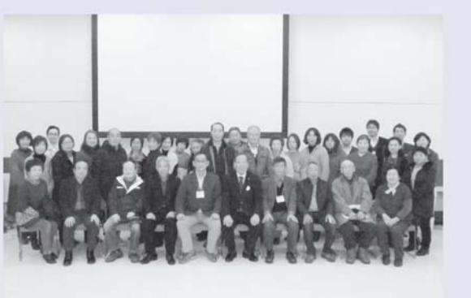

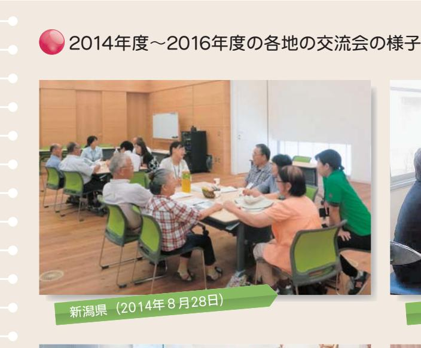

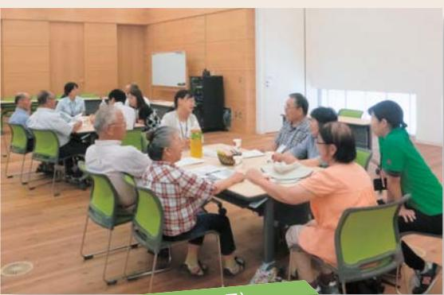

新潟県(2014年8月28日)

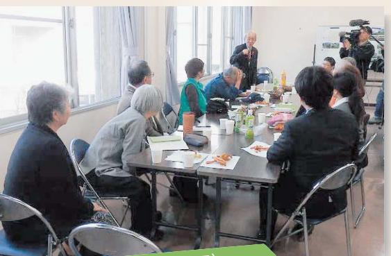

長野県(2014年11月10日)

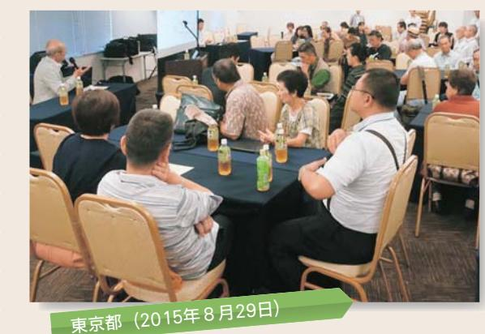

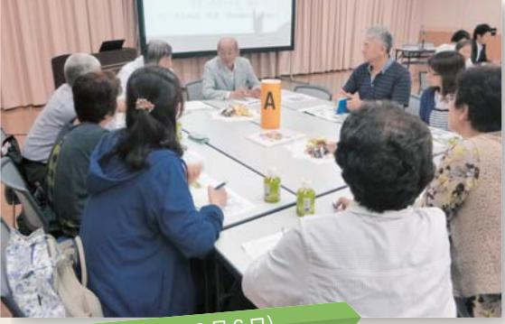

宮城県(2015年9月6日)

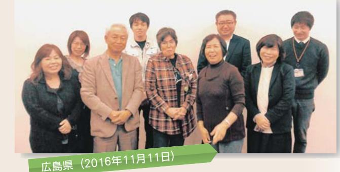

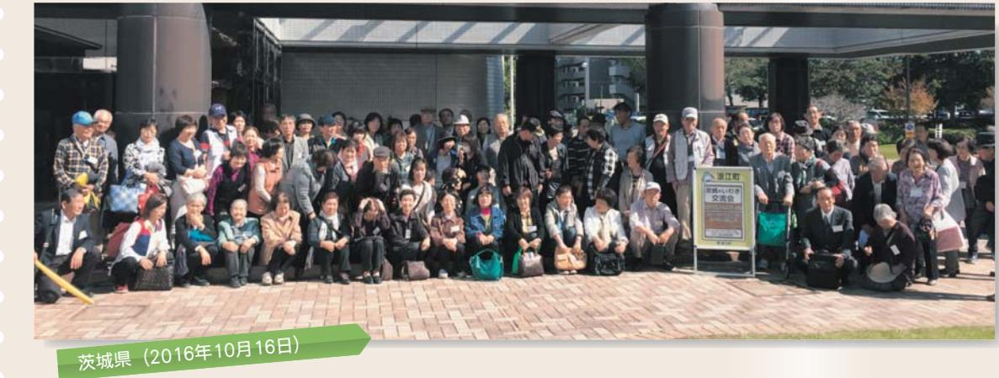

--

## 浪江町内で営業している事業所・お店(平成29年8月18日現在)

| 業 名 喜 所  | 代表者氏名    | 郵便番号     | 住 所                                       | 話 富        | FAX        |
|-------------------|----------|----------|----------------------------------------------|---------------|--------------|
| টি                |          |          |                                              |               |              |
| 會津鉄建工業㈱           |          | 979-1525 | (仮事務所) 浪江町大字高瀬字堀内26-1                     |               |              |
|                   | 利光 猪巻 | 976-0053 | (相馬本社) 福島県相馬市小野字小野迫89-12                  | 0244-35-1536  | 0244-26-3482 |
|                   |          | 979-1525 | (本社) 浪江町大字高瀬字西原73                         |               |              |
| あおいの鉄工所           | 古田 明洋 | 979-2453 | (仮事務所) 福島県南相馬市鹿島区小池善徳242 鹿島工業団地HOPE 1 | 0244-46-2061  |              |
| アクツ電機             | 阿久津雅信    | 979-1521 | 浪江町大字権現堂字上蔵役目24-5                            | 090-8781-1206 |              |
|                   |          | 979-1532 | (本社) 浪江町大字極渡字南町36                         | 0240-34-5165  | 0240-34-2382 |
| 朝田木材産業株式会社        | 英洋 朝田 | 960-8252 | (福島営業所) 福島県福島市御山字一本木56-9                  | 090-1493-4254 | 024-529-6253 |
|                   |          | 135-0061 | (東京営業所) 東京都江東区豊洲6-2-31 4003号              | 080-3337-5165 |              |
|                   |          | 979-1513 | (本社) 浪江町大字幾世橋字一里檀96                       |               |              |
| ㈱アップル引越セン ター福島 | 石田 全史 | 979-1513 | (事務所) 浪江町大字幾世橋字斉藤屋敷40-1                   | 0240-23-5910  |              |
|                   |          | 963-8052 | (郡山営業所) 福島県郡山市八山田2丁目161-1                 | 024-933-7647  |              |
| あぶくま信用金庫 浪江支店  | 阿部 高浩 | 979-1521 | 浪江町大字権現堂字新町33                                | 0240-35-2171  | 0240-34-5526 |
|                   |          | 979-1525 | 浪江町大字高瀬字小高瀬廻172-1                            | 0120-127-002  | 0240-23-6631 |
| 有阿部衛生社            | 阿部 永子 |          |                                              | 0240-34-2650  |              |
| ALSOK福島㈱ 浪江営業所 | 吉田裕一    |          | 979-1513   浪江町大字幾世橋字芋頭29-1                   | 0240-34-5197  |              |
|                   |          | 979-1521 | (本社) 浪江町大字権現堂字上蔵役目16-3                    | 0240-34-5556  | 0240-35-5280 |
|                   | 泉田 裕章 | 975-0061 | (仮事務所) 福島県南相馬市原町区大木戸字北 内原48-1          | 0244-26-8856  | 0244-26-8857 |
| ㈱インテリアしんがい        | 新谷保基    | 979-1521 | 浪江町大字権現堂字町場71-5                              | 0240-35-3865  |              |
|                   |          |          |                                              | 090-8784-7622 |              |
| 大和田商店             |          | 979-1531 | 浪江町大字川添字前畑2                                  | 0240-35-2516  |              |
|                   | 大和田和雪    |          |                                              | 090-8423-2424 |              |

| 新 名 를 所    | 代表者氏名            | 郵便番号     | 住 所                                     | 富 証        | FAX        |
|---------------------|------------------|----------|--------------------------------------------|---------------|--------------|
| か                   |                  |          |                                            |               |              |
| ㈱叶屋                 |                  | 979-1521 | (浪江SS) 浪江町大字権現堂字新町80                    | 0240-34-6111  | 0240-35-3166 |
|                     | 出 経道          | 979-1531 | (セルフなみえ) 浪江町大字川添字蔵西47-1                 |               |              |
| (自観光タクシー            | 渡邊 俊己         | 979-1531 | 浪江町大字幾世橋字田中前63-1                           | 0240-35-4125  | 0240-35-4127 |
| た                   |                  |          |                                            |               |              |
| ㈱さくら不動産             | 本城 일          | 979-1521 | 浪江町大字権現堂字本城12-1                            | 0240-35-4527  | 0240-35-4527 |
| 住設メンテサービス           | 木幡 敏政         | 979-1505 | 浪江町大字苅宿字鹿畑37-2                             | 090-3368-4654 | 0243-24-7212 |
| 食事処いふ・新妻荘           | 新妻 泰          | 979-1531 | 浪江町大字川添字佐野39-3                             | 0240-34-1650  |              |
|                     |                  | 979-1531 | (浪江営業所) 浪江町大字川添字北川原4-3                  |               |              |
| 合同会社職人館             | 小島 康成         | 972-8318 | (本社) 福島県いわき市常磐関船町堀田6                    | 0246-42-4646  | 0246-42-4683 |
|                     |                  | 979-1513 | (本社) 浪江町大字幾世橋字大添21                      |               |              |
| 常磐菱農㈱               | 高野 一英         | 975-0038 | (原町営業所) 福島県南相馬市原町区日の出町 189-1         | 0244-22-5631  |              |
| 旬鈴木新聞舗              | 鈴木裕次郎            | 979-1521 | 浪江町大字権現堂字反町7                               | 0240-35-2032  | 0240-34-4510 |
|                     | 阿部 展才         | 979-1521 | (本社) 浪江町大字権現堂字蛭子町3-2                    | 0240-35-3258  | 0240-34-6841 |
| 相双電気機               |                  | 975-0018 | (仮事務所) 福島県南相馬市原町区北町161-2 北町エイトハイツ8号室 | 0244-26-3562  | 0244-26-3564 |
| た                   |                  |          |                                            |               |              |
|                     | 下河邉行高            | 979-1521 | (本社) 浪江町大字権現堂字矢沢町50                     |               |              |
| ㈱ダイイチ               |                  | 979-2453 | (南相馬事務所) 福島県南相馬市鹿島区小池善徳 241-1        | 0244-26-8538  |              |
| 株式会社大地              | 覧 日           | 979-1521 | 浪江町大字権現堂字寺畑22-8                            |               |              |
| 田河ブロック建業            | 敏行 田河         | 979-1532 | 浪江町大字樋渡字南町1                                | 080-2565-2269 |              |
| 田河輪業商会              | 田河一良            | 979-1521 | 浪江町大字権現堂字本城41                              | 090-1809-7969 |              |
|                     |                  | 979-1521 | (浪江事業所) 浪江町大字権現堂字北深町42                  |               |              |
| 偵龍美工業               | 矢口龍彦            | 979-1513 | (浪江営業所) 浪江町大字幾世橋字一里檀96                  |               |              |
|                     |                  | 970-8026 | (いわき事業所) 福島県いわき市平字中町23-4                | 0246-38-8847  | 0246-38-8897 |
| 東邦銀行浪江支店 · 双葉支店 | 辺見   芳郎 (支店長) | 979-1513 | 浪江町大字幾世橋字芋頭27-1                            | 0240-34-2166  | 0240-34-5183 |
| 東北土木株               | 鈴木仁根            | 979-1531 | 浪江町大字川添字中上ノ原120-1                          |               |              |
| とんかつしが             | 志賞 誠一         | 979-1521 | 浪江町大字権現堂字新町45-5                            |               |              |

| 業 名 를 所    | 代表者氏名          | 郵便番号     | 住 所                            | 証 富                                      | FAX        |
|---------------------|----------------|----------|-----------------------------------|---------------------------------------------|--------------|
| な                   |                |          |                                   |                                             |              |
| 有限会社永橋電器            | 洋平 永橋       | 979-1521 | 浪江町大字権現堂字順礼川原21- 2-101         | 090-7790-6765                               |              |
| ㈱浪江新聞販売セン ター     |                |          | 浪江町大字権現堂字下続町11-3                  | 0240-25-8580                                | 0240-25-8581 |
|                     | 林 富士雄       | 979-1521 |                                   | 090-4636-0283                               |              |
| ㈱ナミエ設備              | 鈴木貞夫          | 979-1504 | 浪江町大字酒田字東三丁目17-2                  | 0240-35-3540                                | 0244-26-9978 |
| 浪江町商工会              | 雄一 原田       | 979-1521 | 浪江町大字権現堂字下川原9-1                   | 0240-35-3321                                | 0240-34-3698 |
| 浪江町復興事業協同 組合     | 鈴木仁根          | 979-1513 | 浪江町大字幾世橋字芋頭4-2                    | 0240-23-5788                                | 0240-34-5489 |
| ㈱ニーズ                | 三瓶  浩徳         | 960-0103 | (本社) 福島県福島市本内字南街道下1番 圳 1    | 024-552-5831                                | 024-552-5834 |
|                     |                | 979-1513 | (仮浪江営業所) 浪江町大字幾世橋字六反田4-1       | 0240-35-5833                                | 0240-35-5834 |
| 日化ボード㈱              | 英信 朝日       | 979-1512 | 浪江町大字北幾世橋字北原16                    | 0240-35-2546                                | 0240-35-2547 |
| NPO法人 ネクストライン  |                | 979-1521 | 浪江町大字権現堂字下馬洗田1-6                  | 070-5326-5563 080-2009-8118 (ぐるっとなみえ) |              |
| ਫਿ                  |                |          |                                   |                                             |              |
|                     |                | 979-1513 | (浪江営業所) 浪江町大字幾世橋字斉藤屋敷79-1      | 0240-34-3206                                | 0240-34-3314 |
| 株式会社八研技工            | ਵਿੱ 模       | 975-0027 | (営業所) 福島県南相馬市原町区北高平京塚 287-9 | 0244-26-9122                                |              |
|                     |                | 979-1513 | (本社) 浪江町大字幾世橋字一里檀96            |                                             |              |
| 東日本農重機流通㈱           | 石田全史          | 979-1513 | (事務所) 浪江町大字幾世橋字斉藤屋敷40-1        | 0240-23-5859                                | 0240-23-5860 |
| 福島さくら農業協同 組合浪江支店 | 山田和男 (支店長) | 979-1521 | 浪江町大字権現堂字下続町18-3                  | 0240-34-2121                                | 0240-34-4022 |
| 福島民友新聞株式会 社      | 五阿弥宏安          | 979-1521 | 浪江町大字権現堂字矢沢町68-1                  | 0240-25-3626                                | 0240-25-3628 |
| 藤本建設株式会社            | 藤本信咲          | 979-1521 | 浪江町大字権現堂字本城6-1                    |                                             |              |
| るたば復興生コン            | 永田             | 979-1525 | 浪江町大字高瀬字小高瀬苑17-1                  | 0240-23-6222                                | 0240-23-6223 |
| 双葉不動産㈱              | 全史 石田       | 979-1521 | 浪江町大字権現堂字上続町18-2                  | 0240-35-2950                                | 0240-24-0777 |
| 双葉不動産建設㈱            |                | 979-1521 | (本社) 浪江町大字権現堂字上続町18-2          |                                             |              |
|                     | 慎一 石田       | 963-8023 | (仮事務所) 福島県郡山市緑町3-10            | 024-983-4851                                |              |
| ヘアーカット髪優            | 吉田ミサ子          |          | 979-1504   浪江町大字酒田字上原29-4         | 080-5568-9849                               |              |

| 業 名 를 所            | 代表者氏名    | 郵便番号     | 住 所                                 | 言 話                      | FAX          |
|-----------------------------|----------|----------|----------------------------------------|-----------------------------|--------------|
| 言                           |          |          |                                        |                             |              |
| 松本畳店                        | 松本 秀夫 | 979-1521 | 浪江町大字権現堂字中川原18                         | 090-4634-0767               |              |
| 株式会社まるあい                    | 金澤 文隆 | 979-1513 | 浪江町大字幾世橋字六反田7-2 (まち・なみ・まるしぇミッセなみえ内) | 090-2847-5907               |              |
| 45                          |          |          |                                        |                             |              |
| 八島運送自                       | 林 蔵   | 979-1525 | 浪江町大字高瀬字穴田3                            | 090-4636-0283               | 0240-35-2892 |
| த்                          |          |          |                                        |                             |              |
| ローソノン 浪江町役場前店 (旧幾世橋店) |          | 979-1513 | 浪江町大字幾世橋字芋頭4-1                         | 0240-24-0037                |              |
| ローソノン 浪江下加倉店             | 植杉泰介    | 979-1536 | 浪江町大字加倉字下加倉108-2                       | 0240-35-1112                |              |
| わ                           |          |          |                                        |                             |              |
| ㈱渡辺商店 (梅田商店)             | 渡辺 寿亮 | 979-1521 | (本社) 浪江町大字権現堂字新町20-13               | 0240-35-3116                | 0240-35-3117 |
|                             |          | 960-8204 | (福島事務所) 福島県福島市岡部字当木前58              | 024-533-1418                | 024-533-1418 |
| (旬ワタナベ装商                    |          | 979-1512 | (浪江事業所) 浪江町大字北幾世橋字中谷地31             | 0240-23-6821                |              |
|                             | 覧 渡部  | 975-0015 | (本社) 福島県南相馬市原町区国見町2丁目 87-3       | 0244-26-9773   0244-26-9774 |              |

## 【まち・なみ・まるしぇのお店】

| 車 業所名                   | 代表者氏名    | 郵便番号     | 住 所                     | 電話          | FAX |
|------------------------------|----------|----------|----------------------------|--------------|-----|
| ローソンS 浪江町まち・なみ・ まるしえ店 |          | 979-1513 | 浪江町大字幾世橋字六反田7-2            | 0240-34-1166 |     |
| 渡辺政雄家具店 ホームセンター部          | 渡邉泰彦    | 979-1513 | 浪江町大字幾世橋字六反田7-2            | 0240-34-1133 |     |
| ミッセなみえ (浪江町商工会)           | 原田雄-    |          | 979-1513   浪江町大字幾世橋字六反田7-2 | 0240-34-1012 |     |
| キッチン・グランマ                    | 渡邉りえ子    | 979-1513 | 浪江町大字幾世橋字六反田7-2            | 0240-34-1007 |     |
| カフェコスモス                     | 洋子 高野 | 979-1513 | 浪江町大字幾世橋字六反田7-2            | 0240-34-1000 |     |
| ウォッシュキャンプ 浪江              | 松原 正明 | 979-1513 | 浪江町大字幾世橋字六反田7-2            | 0240-34-7267 |     |
| 浪江焼麺大国 アンテナショップ           | 阿久津雅信    | 979-1513 | 浪江町大字幾世橋字六反田7-2            | 0240-34-7260 |     |
| リラクア                         | 松原 蔵  |          | 979-1513   浪江町大字幾世橋字六反田7-2 | 0240-34-7257 |     |
| 海鮮和食処くろさか                    | 黒坂千潮    | 979-1513 | 浪江町大字幾世橋字六反田7-2            | 0240-34-7250 |     |
| せんたくじゃぶじゃぶ hopeonegroup | 下河邊行高    | 979-1513 | 浪江町大字幾世橋字六反田7-2            | 0240-34-7235 |     |