# **福島国際研究教育機構(F-REI)の活動状況について**

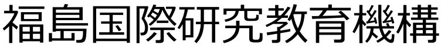

FukushimaInstituteforResearch, EducationandInnovation (F-REI)

令和6年6月18日

## **福島国際研究教育機構(F-REI)(令和5年4月1日設立)の概要**

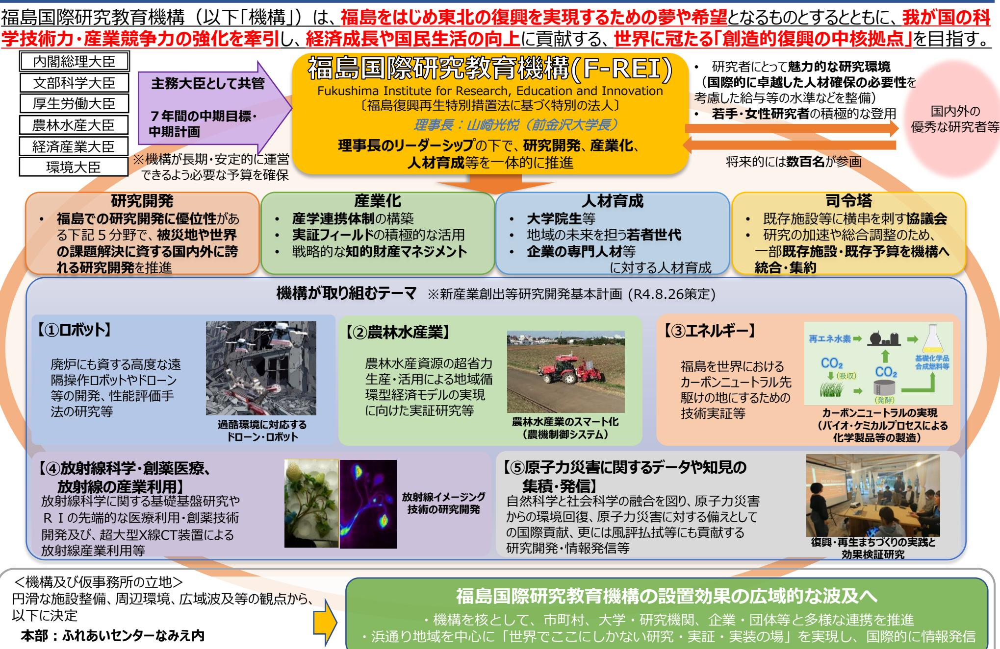

**本施設:浪江町川添地区**

## **F-REIロードマップ(イメージ)**

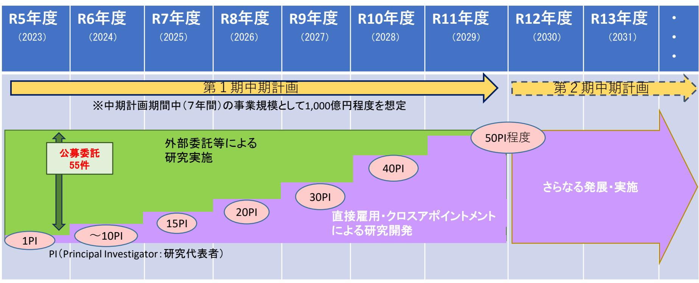

施設整備

復興庁設置期間内での順次供用開始を目指すこととし、さらに可能な限りの前倒しに努める

- ➣ 施設基本計画のとりまとめ、都市計画手続き
	- ➣ 基本・実施設計、用地取得(用地取得予定面積:概ね14 ha)
		- ➣ 造成工事
			- ➣ 建設工事 →竣工後順次供用開始

## **立地予定地の概況**

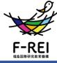

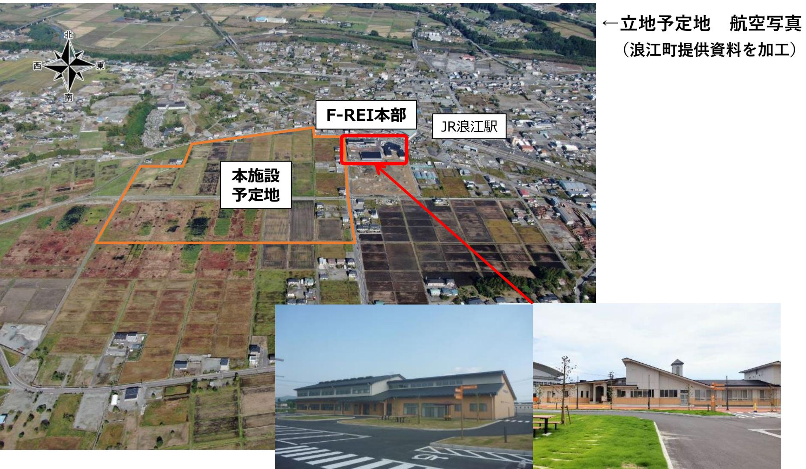

「ふれあい福祉センター」、「ふれあい交流センター」の一部を借用。

## **F-REIの骨太の方針**

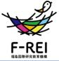

### **政府文書等を踏まえつつ、F-REIとしての研究課題の設定に当たっての方針をまとめたもの**

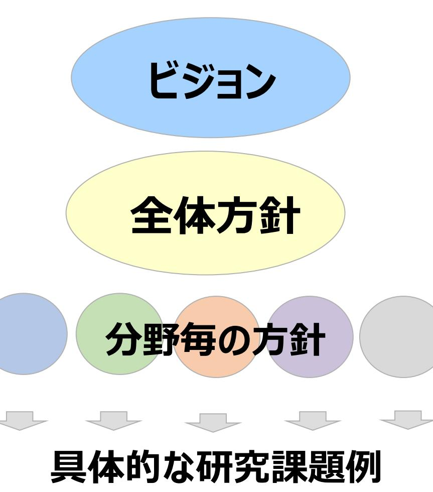

## **【ビジョン】**

- F-REIは、福島をはじめ東北の復興を実現し、夢や希望となる創造的復興の中核拠点となって、世界水準の研究推進とその研究成果の社会実装・産業化をリードし、我が国の産業競争力を世界最高水準に引き上げ、経済成長と国民生活の向上に貢献する。その実現に向け、骨太の研究基本方針に基づく研究課題を推進する。
## **【全体方針】**

- 福島の複合災害からの創造的復興のフラグシップを掲げるF-REIの研究基盤として、放射線科学(核物理学、放射化学、放射線環境科学、核医学・創薬、電子デバイスなど)の利活用や放射能汚染環境の動態計測に関する研究課題を基盤に据えながら、ロボット・ドローン技術や次世代農林漁業及びクリーンエネルギーなど福島浜通りの産業創生を牽引する最先端研究を推進し、日本を代表する世界水準の研究拠点形成を目指す。
## **【分野毎の方針】と【具体的な研究課題例】**

分野毎に設定

## **主な研究開発の内容**

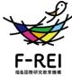

#### F-REIにおいて、中期目標、中期計画等を踏まえながら、**日本や世界の抱える課題、地域の現状等を勘案し、福島の優位性を発揮できる以下の5分野を基本とした研究開発を実施**する。

#### **各分野の主な事業**

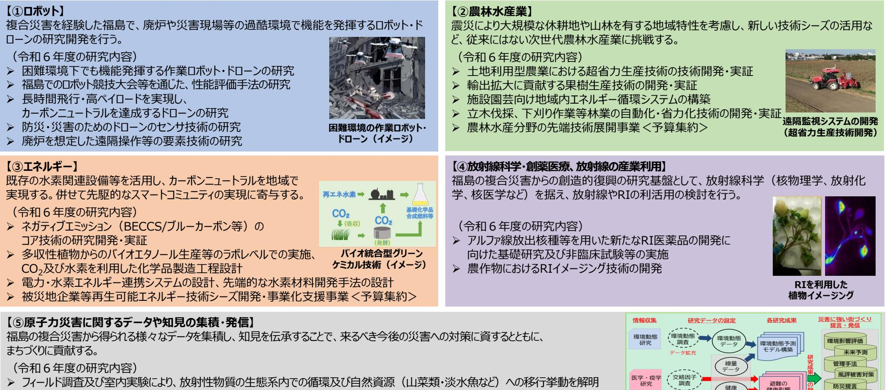

- 放射性物質の環境中での挙動を再現・予測する数値モデルを精緻化
- 被災者・コミュニティ・被災地域等の再生・創生研究、人材交流・地域活動をリードする人材の育成、それらの実装化に向けたネットワークや様々な研究者等が関わるハブ機能の構築
- 「福島の経験」から得たデータや知見を集積し、医学的、自然科学的、社会科学的視点から検証するとともに、その検証結果を取りまとめ、原子力災害への備えを提言

## **研究体制の構築(PI獲得戦略)**

- ・PI級等の研究者の処遇(高水準の給与を可能とする体系)
### ・PIの評価

- ・PI獲得戦略
	- 世界の科学技術の水準・動向を常に把握する組織・機能の整備と維持
	- 国内の他機関(国際卓越研究大学やWPIなど)の処遇の動向を常に把握
	- 処遇に対するPI自身の満足度を常に把握
	- 毎年評価と処遇への反映時にヒアリングを実施

ユニットの構成イメージ

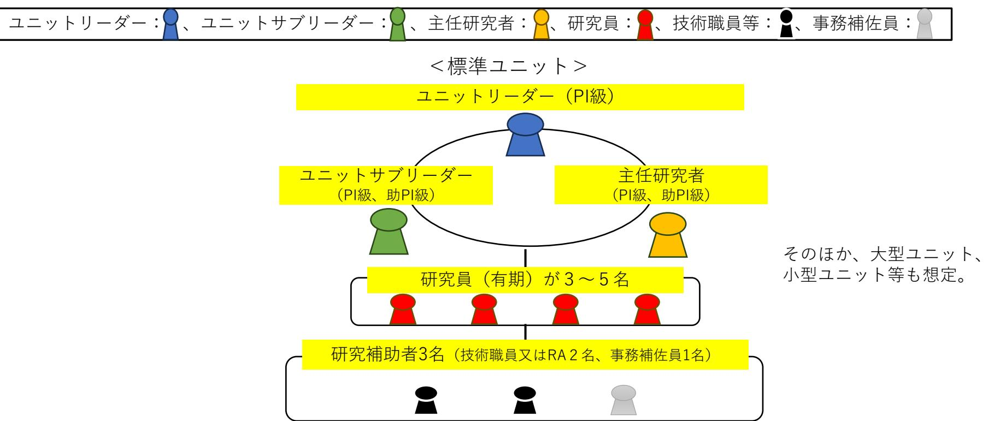

## **ユニットリーダーの紹介**

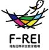

| 分野 | ユニット名 | ユニットリーダー()は兼務先 |
| --- | --- | --- |
| ロボット分野 | 遠隔操作研究ユニット | 大西公平(慶應義塾大学特任教授) |
|  | 実際に触る感覚(力触覚)を伝送す |  |
|  | る技術を活用し、過酷環境において、 | 東京大学大学院修了(工学博士) |
|  | 実働に供与できる作業効率と信頼性 | 慶應義塾大学理工学部にて教育と研究に従事 |
|  | を高めた遠隔操作技術の研究開発を | 同大ハプティクス研究センターセンター長 |
|  | 行う | 同大新川崎先端研究教育連携スクエア特任教授 |
|  | 自律化・知能化・群制御研究ユ | 富塚誠義(カリフォルニア大学バークレー教授) |
|  | ニット |  |
|  | ロボットの自律性を高度化するため、 | 慶應義塾大学大学院修士課程修了 |
|  | AI等を用いた知能化、複数のロボッ | マサチューセッツ工科大学にてPhD(工学博士)を取得 |
|  | トを協調的に制御する技術の研究開 | カリフォルニア大学バークレー校にて教育と |
|  |  | 研究に従事 |
|  | 発を行う |  |
| 農林水産業分 | 土壌・植物マルチダイナミクス研 | 二瓶直登(福島大学教授)(R6.7 就任予定) |
| 野 | 究ユニット |  |
|  | 土壌環境と植物栄養の相互の影響を | 東北大学大学院博士前期課程修了 |
|  | 多面的に探求し、作物の収量拡大と | 福島県農業総合センターに勤務し、東京大学 |
|  | 農業の継続性向上を実現する | 大学院農学生命科学研究科修了(農学博士) |
|  |  | 現在は福島大学食農学類にて教育と研究に従事 |
| 原子力災害に | 放射生態学ユニット | 青野辰雄(専任) |
| 関するデー | 放射性物質の植物や淡水魚等への移 |  |
| タ・知見の集 | 行や蓄積に関する室内実証実験によ | 近畿大学大学院化学研究科修了(理学博士) |
| 積・発信分野 | る現象の理解を踏まえ、これらに関 | 国立研究開発法人量子科学技術研究開発機構 |
|  | 与する因子の探索から、移行や蓄積 | 放射線総合研究所福島再生支援研究部にて |
|  | 量の低減化の方策について検討を行 | 環境動態研究に従事 |
|  | う。 |  |

※ユニットリーダーの下にユニットサブリーダー、研究員等を今後配置予定

**F-REIの機能(産業化)**

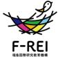

**F-REIにおける研究開発を、福島をはじめ東北の復興に結び付けるためには、広く企業や関係機関を巻き込みながら、実用化や新産業創出に着実につなげていく。**

## **【昨年度までの取組】**

**東邦銀行との包括連携協力(R6.1.25)**

・基本合意書に基づいて、互恵的な連携協力を進め、F-REIの認知度向上、地元企業とのネットワーク構築、研究成果の社会実装などを推進する。

・㈱東邦銀行が持っている地元企業との強力なネットワークを活かし、まずは双方に関する情報発信を積極的に行い、長期的な観点では研究成果を踏まえた事業化を進めていくなど、F-REIの取組がより地元に貢献できるように取り組みたい。

### **産学官ネットワーク・セミナー(R5.10.12)**

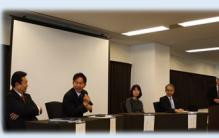

東北の復興を見据え、東北の企業他を巻き込んだ産学官の連携体制構築の機会とするため、F-REIとの連携を含めた産学官連携や産業化について、トークセッション等を実施。

### **市町村座談会**

市町村座談会は、研究開発・産業化・人材育成の取組における広域連携体制の構築を図るため、市町村や住民、企業・団体等、多様な主体と対話する場として実施しているもの。令和5年度は浜通り地域等15市町村において実施。

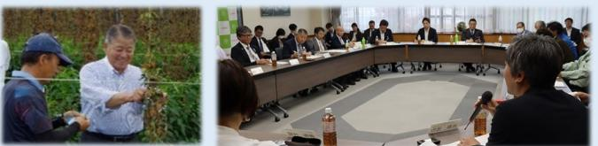

## **【今年度以降の取組】**

### **産学官ネットワーク・セミナー**

実証研究の見通しなど研究内容を共有し、参画を希望する **企業等とのネットワークを構築** 等。(令和7年2月開催を想定)

### **市町村座談会**

#### 〇**浜通り地域 2回程度**

- ・市町村別ではなく**テーマ別(ロボット・ドローン、農林水産業等)**での開催を想定。
#### 〇**中通り・会津地方 4回**

・令和6年 7月県中地域(郡山市) ・令和6年10月(予定) 県北地域(福島市) ・令和6年11月(予定) 会津地域(会津若松市) ・令和7年 1月(予定) 県南地域(白河市)

### **研究実証フィールドの確保、地域企業とのマッチング**

**・**他の地域ではできない実証等を可能とするため、大胆な規制緩和を推進し**未利用地等も活用しながら、実証フィールドを確保**する。

・企業誘致やビジネスマッチング、起業・創業支援などの取組とも連携して機構発ベンチャー企業等に限らず**企業等と緊密に連携して共同研究や技術移転等を実施**し、**産業集積の形成に向けた取組を推進**していく。

## **F-REIの機能(人材育成)**

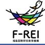

**イノベーションを創出し、新たな産業基盤の構築を通じて、立地地域等をはじめとする福島や東北の創造的復興を実現し、ひいては世界の課題解決を目指すために、立地地域等において様々な分野の研究者や技術者を育成する体制を構築する。**

## **【昨年度までの取組】**

### **F-REIトップセミナー**

福島県内の⼤学、⾼等専⾨学校、⾼等学校の学⽣・⽣徒を対象に、最先端の科学技術の魅⼒と可能性、学ぶことの重要性と未来をどう築くか、F-REIの役割と将来像などをテーマに、F-REIトップ陣によるセミナーを開催。 令和5年度は16回実施。

### **エフレイ・サイエンスラボ**

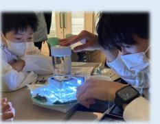

F-REIの研究者の指導の下、⾼専⽣の企画による ⼩中学⽣向けの学びの場を開催。(霧箱による放射線可視化と⾝の回りのものの放射線計測等の実験実習)(R6.1.8)

### **東北大学との連携大学院(連携講座)の設置**

 東北⼤学医学系研究科と放射⽣態学ユニット内への連携講座 (放射線環境⽣体医学連携講座)設置に関する協定を締結。 (R6.3.8)

### **その他**

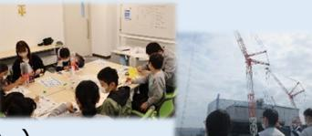

 ・体験学習会(科学実験教室(R5.10.15)) ・専門教育・リカレント教育(現地訪問型研修(R6.3.28)) ・出前授業(福島高専(R5.10.26)、早稲田大学(R5.11.15))など

## **【今年度以降の取組】**

 **・継続して実施。**(福島大学(R6.5.13)、会津大学(R6.5.28)、福島工業高等専門学校(R6.6.11、12)は開催済み。 F-REI協議会の構成機関について実施予定。)

**・**県内高校向けには、F-REI研究者が**STEAM教育等の出前授業**をイノベ機構の事業を通じて実施予定。(10回程度)

### **連携大学院制度の拡充**

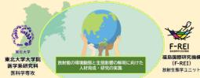

10

講座設置済みの**東北大(医学系)では、学生受け入れ・指導に着手**。 今後、研究チームの編成状況に併せて、近隣のみならず**様々な大学との連携を目指し検討**を行っていく。

### **エフレイ・サイエンスラボ**

**小中学生の親子を対象**に、**「放射線実験+科学実験教室」と「ロボット・ドローン体験教室**(WRSプレ大会の宣伝を兼ねる)**」**(8月実施予定)

### **サマースクール**

高校・大学生を対象に、**将来の研究者となるための研究体験**を行うサマースクールについて、今年度は、他機関(JAXA、AIST、QST、OIST等)の実施状況調査等と一部試行を行う。

### **その他**

 ・専門人材教育:**地元企業の技術実装のための専門人材教育**を実施する。 ・その他、各種依頼に基づいた講演、出前授業等を実施予定。

## **F-REIの機能(司令塔)**

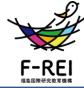

**F-REIのリーダーシップの下で、既存施設や大学等の各機関が福島において取り組む新たな産業の創出等に資する研究開発に関する計画等を持ち寄り、協議会での議論を通じて、研究開発力を結集するための目標やビジョンの共有を図る。**

## **【昨年度までの取組】**

### **F-REI協議会の組織・運営**

各WGでの議論・決定等を踏まえた、新産業創出等研究開発施策の実施に関する司令塔機能の発揮を図る。7府省庁、福島県、浜通り地域等15市町村、大学、研究機関等の35の構成員が参画。

・第1回協議会於:大熊町(R5.5.10) ・第1回広域連携WG於:楢葉町(R5.9.27) ・第1回研究開発等WG(オンライン)(R5.12.8)

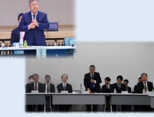

### **連携協力に関する基本合意書等の締結**

研究開発等のF-REIのミッションを円滑に進めるとともに、F-REI設置の効果を広域的に波及させるため、研究開発・人材育成等における連携、双方の資源を有効的に活用した協働活動等、締結先に応じた協定を締結。令和5 年度は9つの機関と締結。

福島高専(R5.4.1)、福島県立医大(R5.4.5)、いわき市(R5.4.15)、福島大学(R5.5.17)、浪江町(R5.5.29)、会津大学(R5.5.30)、南相馬市(R5.9.1)、東邦銀行(R6.1.25)、

東北大学(R6.3.8)

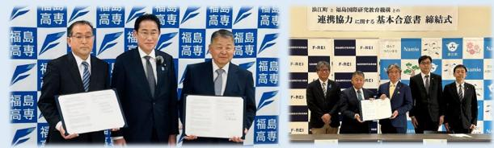

## **【今年度以降の取組】**

### **F-REI協議会の組織・運営**

令和6年7月頃に第2回広域連携WG、8月頃に第3回協議会を開催予定。

### **連携協力に関する基本合意書等の締結**

### **今年度、新たに5件以上締結することを目指す**。

(東北をはじめ広く国内や海外の機関も含む) 学校法人昌平黌(東日本国際大学等)(R6.6.7)と基本合意、福島県・イノベ機構(R6.6.14)と三者包括連携協定をそれぞれ締結。

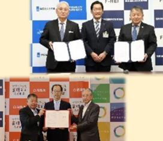

11

### **放射性物質の環境動態研究に関する統合**

・日本原子力研究開発機構(JAEA)廃炉環境国際共同研究センタ(CLADS) ・国立環境研究所(NIES)福島地域協働研究拠点

⇒R7年4月三春町に所在する環境動態研究部分をF-REIに統合予定。

### **福島ロボットテストフィールド(RTF)の統合**

ロボット分野を中心とするF-REIの研究開発、産業化、人材育成に関する機能をRTFに付加することにより、RTFの更なる発展・活用を目指す。

⇒R7年4月の統合にむけて、基本合意書を締結(R6.6.14)

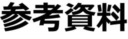

## **福島国際研究教育機構(F-REI)の組織体制について**

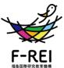

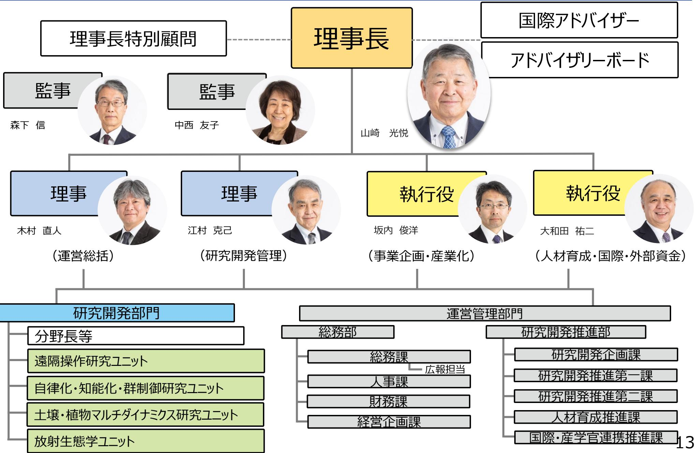

## **国際アドバイザー**

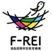

#### **概要**

国際アドバイザーは、理事長の求めに応じて、機構の業務について国際的ネットワーク形成、国際的プレゼンス向上、その他の国際的観点から助言するもの。

| (アルファベット順) |  |  |  |
| --- | --- | --- | --- |
|  | スヴァンテ・リンドクヴィスト | スヴァンテ・リンドクヴィスト博士は、科学技術史学の国際的に著名な研究者で、スウェーデン王 |  |
|  |  | 立アカデミー会長(2009-2012)や、スウェーデン王宮府長官(2010-2018)を務めました。ま |  |
|  |  | たスウェーデンのストックホルムにノーベル博物館を創設し、初代館長を11年間にわたり務めまし |  |
|  | 博士 | た。日本とスウェーデンの学術交流にも大きく寄与しており、日本学士院客員も務めています。 |  |
|  | ライムント・ | ライムント・ノイゲバウアー博士は、ドイツに拠点を置き世界をリードする応用研究機関であるフラ |  |
|  |  | ウンホーファー研究機構の理事長(2012-2023)を務めました。 |  |
|  | ノイゲバウアー | ノイゲバウアー博士はドレスデン工科大学で機械工学を学び、フラウンホーファー工作機械・成 |  |
|  |  | 形技術研究所長(1994-2012)やケムニッツ工科大学(TUChemnitz)工作機械・ |  |
|  | 博士 | 生産過程研究所所長(2000-2012)を務めました。 |  |
|  |  | ノイゲバウアー博士は、2022年からドイツ首相未来評議会委員を務めています。 |  |
|  | フィオナ・ | フィオナ・レイモン博士は原子力分野において30年間にわたり戦略的・運用上の貢献をしてき |  |
|  |  | ました。化学・工学の専門家として英王立工学アカデミー、英王立化学協会、及び英国立原 |  |
|  | レイモン | 子力研究所のフェローを務めています。国際原子力会議において、定期的に基調講演を行っ |  |
|  |  | ているほか、経済協力開発機構/原子力機関(OECD/NEA)運営委員会副議長も務めてい |  |
|  | 博士 | ます。また、科学における参加の多様性拡大を長年支援し、原子力分野における女性や障 |  |
|  |  | 害者などの参加の取組を先導しています。 |  |
|  | スブラ・ | スブラ・スレッシュ博士は、材料科学・工学、機械工学、生物工学及び健康科学技術の分野 |  |
|  |  | における国際的に著名な研究者であり、米国国立科学財団(NSF)の長官(2010- |  |
|  | スレッシュ | 2013)を務めました。スレッシュ博士のリーダーシップの下、NSFのプログラムやイニシアチヴによ |  |
|  | 博士 | り、米国は科学・工学の最先端にあって、次世代の科学者・工学者を育成し、経済成長とイ |  |
|  |  | ノベーションを進展させました。また、スレッシュ博士はカーネギーメロン大学学長(2013- |  |
|  |  | 2017)及び南洋工科大学学長(2018-2022)を歴任しました。 | 14 |

## **アドバイザリーボード**

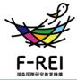

15

#### **概要**

アドバイザリーボードは、F-REIが委嘱したアドバイザーより、大所・高所からの助言等をいただき、F-REIの運営や各研究開発等の参考とするもの。

|  |  | 実施状況 | アドバイザー |
| --- | --- | --- | --- |
|  | 4名のアドバイザーを令和5年7月に委嘱(任期2年) | 令和5年10月13日第1回アドバイザリーボード(於:東京) |  |
|  |  | 令和6年2月21日第2回アドバイザリーボード(於:浪江町) |  |
| 和彦(いしむら | 石村かずひこ) | 【実施予定】 |  |
| 産業技術総合研究所理事長 |  | 令和6年7月23日第3回アドバイザリーボード(於:東京) |  |
|  |  | 直近の概要 |  |
| 恭介(ながた | 永田きょうすけ) | 令和6年2月21日第2回アドバイザリーボード(於:浪江町) |  |
|  |  | F-REIから最近の動向等についてご説明を行ったのち、研究5 |  |
|  | 筑波大学長 | 分野の方針等について、アドバイザーとの活発な意見交換を通 |  |
|  |  | じて有意義なご助言をいただいた。 |  |
|  | 原山優子(はらやまゆうこ) | アドバイザリーボードの前後にはアドバイザーの方々に浜通り地 |  |
|  |  | 域の施設等を視察いただき、地域に対する理解を深めていただ |  |
|  | 東北大学名誉教授 | いた。 |  |
| (やまな | 山名元はじむ) |  |  |
|  | 原子力損害賠償・廃炉等支援機構理事長 |  |  |

## **理事長特別顧問**

#### **概要**

理事長特別顧問は、理事長の求めに応じて、機構の業務について、それぞれのご知見・ご経験に基づいた情報を助言するもの。

| (五十音順) |  |  |  |  |
| --- | --- | --- | --- | --- |
|  |  |  | 1990 | ハーバード大学MBA(経営学修士)取得 |
|  |  |  | 1996 | マッキンゼー日本支社パートナー(役員) |
|  |  | なんばともこ | 1999 | 株式会社ディー・エヌ・エー設立、代表取締役社長(~2011) |
|  |  | 南場智子 | 2015~ | 横浜DeNAベイスターズ球団オーナー(~現在) |
|  |  |  | 2017~ | 株式会社ディー・エヌ・エー代表取締役会長(~現在) |
|  |  |  | 2021~ | 日本経済団体連合会副会長(~現在) |
|  |  |  | 1978 | 長崎大学医学部卒業 |
|  |  |  | 1990 | 長崎大学医学部附属原爆後障害医療研究施設教授 |
|  |  |  | 2011 | 福島県立医科大学副学長兼放射線医学県民健康管理センター長 |
|  |  |  |  | (同センター長~2013.3) |
|  | やました | しゅんいち山下俊一 | 2013 | 長崎大学理事・副学長(~2017.9) |
|  |  |  | 2018~ | 福島県立医科大学理事長特別補佐・副学長(〜現在) |
|  |  |  | 2019 | 量子科学技術研究開発機構高度被ばく医療センター長 |
|  |  |  |  | (~2021.3) |
|  |  |  | 2021 | 同機構量子生命・医学部門放射線医学研究所長(〜2023.3) |

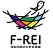

## **分野長・副分野長**

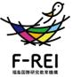

**概要**

分野長、副分野長は、各分野における研究開発を戦略的に推進していくため、各分野において専門的知見を有する外部の研究者を分野長及び副分野長として任命しているもの。

分野長

担当する分野における研究課題を具体化し、研究の進め方等に係る調整・管理を行い、また、将来のF-REIの研究グループの確保に向けた調整など、研究に関する総括的な業務を行う。

 副分野長副分野長は分野長を補佐し、また、分野長とは異なる専門的知見に基づく研究課題の調整等を行う。

|  | 【分野長】野波健蔵(のなみけんぞう) |
| --- | --- |
|  | 一般社団法人日本ドローンコンソーシアム会長 |
| ロボット | 【副分野長】松野文俊(まつのふみとし) |
|  | 大阪工業大学工学部電子情報システム工学科特任教授 |
| 農林水産業 | 【分野長】佐々木昭博(ささきあきひろ) |
|  | 東京農業大学総合研究所参与(客員教授) |
|  | 【副分野長】荒尾知人(あらおともひと) |
|  | 元農業・食品産業技術総合研究機構中央農業研究センター所長 |
| エネルギー | 【分野長】矢部彰(やべあきら) |
|  | 新エネルギー・産業技術総合開発機構技術戦略研究センターフェロー |
|  | 【副分野長】秋田調(あきたしらべ) |
|  | 一般社団法人電力中央研究所名誉特別顧問 |
|  | 【副分野長】錦谷禎範(にしきたによしのり) |
|  | 早稲田大学ナノライフ創新研究機構ナノテクノロジー研究所招聘研究員 |
|  | 【分野長】片岡一則(かたおかかずのり) |
|  | 公益財団法人川崎氏産業振興財団ナノ医療イノベーションセンター長 |
| 放射線科学 | 【副分野長】山下俊一(やましたしゅんいち) |
| ・創薬医療 | 福島県立医科大学副学長 |
|  | 【副分野長】茅野政道(ちのまさみち) |
|  | 量子科学技術研究開発機構理事 |
| 原子力災害に関するデータや | 【副分野長】大原利眞(おおはらとしまさ) 一般社団法人日本環境衛生センターアジア大気汚染研究センター所長 |
| 知見の集積・発信 |  |

- 
- 
- 
- 

- 
- 

- 
- 
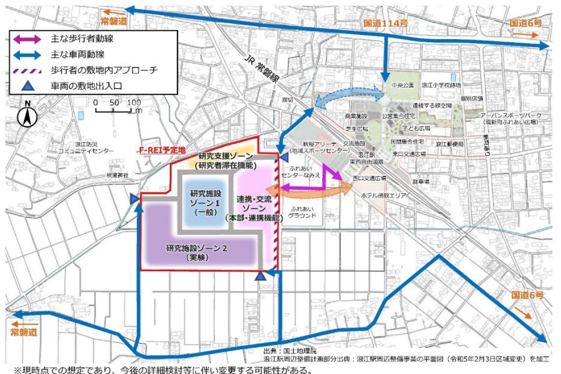

| ゾーン名 |  | 主な施設 |
| --- | --- | --- |
| 連携・交流ゾーン | 本部施設 | 管理・運営を担うための施設 |
|  | 本部機能支援施設 | F-REI関係者の研究活動・職務を支援するともに、F-REIの活動や研究成果を広報・展示するための施設 |
|  | 図書・情報施設 | 研究者等が文献調査を行うほか、研究データの保管等のためのサー |
|  |  | バーを設置するための施設 |
|  | 講堂 · ホール施設 | 研究成果の発表や人材育成のための講義、見学者等の来訪者への |
|  |  | 情報発信等を行うための施設 |
| 研究支援ゾーン | 短期宿泊施設 | 連携大学院制度による大学院生や共同研究等のためのボストドクター等が一時的に滞在するための施設 |
| 研究施設ゾーン1 | 研究実験施設 | F-REI研究者や共同研究者等が目常的に滞在し、研究活動を行う |
|  |  | ための施設 |
| 研究施設ゾーン2 | 固有実験施設 | F-REI研究者や共同研究者等が高度な研究活動を行うための施設 |
| - | その他 | 中央監視施設や廃棄物処理施設、受変電施設等を想定 |

