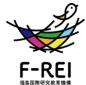

# **福島国際研究教育機構(F-REI)の研究開発について**

FukushimaInstituteforResearch, EducationandInnovation (F-REI)

令和6年6月18日

## **F-REIの骨太の方針**

### **政府文書等を踏まえつつ、F-REIとしての研究課題の設定に当たっての方針をまとめたもの**

### **【ビジョン】**

- F-REIは、福島をはじめ東北の復興を実現し、夢や希望となる創造的復興の中核拠点となって、世界水準の研究推進とその研究成果の社会実装・産業化をリードし、我が国の産業競争力を世界最高水準に引き上げ、経済成長と国民生活の向上に貢献する。その実現に向け、骨太の研究基本方針に基づく研究課題を推進する。
### **【全体方針】**

- 福島の複合災害からの創造的復興のフラグシップを掲げるF-REIの研究基盤として、放射線科学(核物理学、放射化学、放射線環境科学、核医学・創薬、電子デバイスなど)の利活用や放射能汚染環境の動態計測に関する研究課題を基盤に据えながら、ロボット・ドローン技術や次世代農林漁業及びクリーンエネルギーなど福島浜通りの産業創生を牽引する最先端研究を推進し、日本を代表する世界水準の研究拠点形成を目指す。
### **【分野毎の方針】と【具体的な研究課題例】**

分野毎に設定

### **ロボット分野**

### 【骨太の方針】

耐放射線性、耐水性、耐熱性などを備えた**高機動性**を有するロボットの開発、**自律制御、群制御**などを実現するための**知能研究**、生物がもつ感覚機能などを高める機能拡張研究などを行う。それらの成果を活用して、廃炉や災害時、宇宙空間などの過酷環境下で稼働できる**高機動性ロボット**の開発、高ペイロードで長時間飛行が可能な**高機能ドローン**の開発、**自律移動型ロボット**の開発などを推進する。

### **福島で研究開発を行う視点**

- 複合災害を経験した福島で、廃炉や自然災害時に起因する過酷環境で機能を発揮するロボット・ドローンの研究開発を行う。(過酷環境ロボティクスの研究開発)
	- 福島第一原発の廃炉に貢献するロボット研究
	- 複合災害を経験した福島だからこそ、災害時に機能を発揮できるロボット研究
	- 阿武隈山地など森林資源を有する福島での林業の自動化に資するロボット研究
- 過酷環境ロボティクスの実現に必須となる基盤技術を確立する
	- 耐環境・高機動化技術
	- 高度知能化技術
	- 機能拡張技術
	- 性能基準、標準化、認証

耐放射線性、耐水性、耐熱性などを備えた**高機動性**を有するロボットの開発、**自律制御、群制御**などを実現するための**知能研究**、生物がもつ感覚機能などを高める機能拡張研究などを行う。それらの成果を活用して、廃炉や災害時、宇宙空間などの過酷環境下で稼働できる**高機動性ロボット**の開発、高ペイロードで長時間飛行が可能な**高機能ドローン**の開発、**自律移動型ロボット**の開発などを推進する。

### **農林水産業分野**

### 【骨太の方針】

農林漁業**作業の完全自動化・ロボット化・スマート化**などによる超省力化・超効率化と、森林資源の有効活用などにより**多収益・大規模モデル確立**によって地域循環型経済モデルの構築を目指す。一方で、RIトレーサー活用による**品種改良**、**有機栽培**、**汚染土壌改良**に関する基礎研究を推進する。

### **福島で研究開発を行う視点**

- 震災により大規模な休耕地や山林を有する地域特性を考慮し、従来発想を超えた次世代農林水産業に挑戦する。
	- 全自動化を見据えた次世代のスマート農業・林業・漁業の研究
	- 福島の農林水産現場を実証地とすることで、早期実用化と優位性確保が可能な研究の推進
	- モモ・ナシ等の果物等の高付加価値化、復興牧場と連携した耕畜連携、鳥獣害対策等
	- 環境変動対応に対応した高付加価値化のための戦略研究
- 次世代の農林水産において核となる基盤技術を確立する
	- 高度スマート化を支えるセンシング技術、AI、自動化技術
	- 土壌・植物マルチダイナミクス研究|化学性、物性、微生物とそのマルチオミクス解析機能を武器とする
	- 生物機能研究|光合成や有用物質生産に関する研究
	- 農林水産経済学

### **農林水産業分野の研究俯瞰イメージ**

農林漁業**作業の完全自動化・ロボット化・スマート化**などによる超省力化・超効率化と、森林資源の有効活用などにより**多収益・大規模モデル確立**によって地域循環型経済モデルの構築を目指す。一方で、RIトレーサー活用による**品種改良**、**有機栽培**、**汚染土壌改良**に関する基礎研究を推進する。

## **エネルギー分野**

### 【骨太の方針】

福島を日本のカーボンニュートラル先駆けの地とするために、**再生可能エネルギー**を中心に、**エネルギー製造**、**貯蔵**、**輸送**、**利用**に関わる研究開発を行い、そのなかで社会実装を目指しての**リスク評価**、**法規制**、 **技術基準の策定**なども課題とする。**水素・アンモニア**などを使ったエネルギー活用、**CO2回収**やエネルギー源としての利用などに関する研究を推進する。再生可能エネルギーの活用をベースとすることでカーボンニュートラル、さらにはネガティブエミッションが実現可能なことを実証し、その展開によりサステナブルな社会の実現に貢献する。

### **福島で研究開発を行う視点**

- 福島を日本にのカーボンニュートラル先駆けの地とするための研究を地域特性を考慮して進める
	- カーボンニュートラル実現のための藻類・植物によるネガティブエミッションの研究
	- バイオマスからのカーボンフリー燃料製造の研究
	- 水素の地産地消利用による水素エネルギーネットワークシステムの研究
- カーボンニュートラル地域の実現を支える基盤技術を確立する
	- 大型藻類の種苗生成・大規模養殖方法の開発とCO2固定能評価技術
	- 小型FT(フィッシャー・トロプシュ)合成技術
	- 水素製造、貯蔵のための電極、電解質材料、水素吸蔵合金技術
	- 水素利用の安全性評価・国際標準化

## **エネルギー分野の研究(俯瞰イメージ)**

福島を日本のカーボンニュートラル先駆けの地とするために、**再生可能エネルギー**を中心に、**エネルギー製造**、**貯蔵**、**輸送**、**利用**に関わる研究開発を行い、そのなかで社会実装を目指しての**リスク評価**、**法規制**、 **技術基準の策定**なども課題とする。**水素・アンモニア**などを使ったエネルギー活用、**CO2回収**やエネルギー源としての利用などに関する研究を推進する。再生可能エネルギーの活用をベースとすることでカーボンニュートラル、さらにはネガティブエミッションが実現可能なことを実証し、その展開によりサステナブルな社会の実現に貢献する。

### 【骨太の方針】

ウエル・ビーイングへの貢献を目指して、**放射線利用**に関する基礎研究に加えて、**医療**のみならず農業、工業分野での**産業利用**を見据えた技術開発を推進する。医療分野では放射線トレーサを利用した**診断技術の開発**や、放射線標識化合物による**がん標的薬の開発**、農業および工業分野では放射線を利用した**計測科学研究**と技術開発を推進する。

### **福島で研究開発を行う視点**

- 他分野との連携による成果の地域への展開を視野に入れ、放射線科学の有用性が広く認知される研究開発を進めることで、福島ならではの拠点形成を目指す
	- RIを活用したがんならびにその他疾患の診断・治療薬の探索(非臨床試験)
	- RIイメージングによるモモなどの福島特産農作物の付加価値向上
	- 放射線・RI特性を活用したロボットやエネルギー等の産業分野への貢献
- 福島ならではの研究を推進するための施設整備と基盤技術の確立を行う
	- 特徴ある研究施設(加速器や実験環境)の整備
	- ナノテラス等他の研究施設との連携による研究領域補完
	- 放射線・RI製造技術、品質標準化
	- 品質標準化、規制緩和の検討

### **放射線科学・創薬医療分野の研究(俯瞰イメージ)**

ウエル・ビーイングへの貢献を目指して、**放射線利用**に関する基礎研究に加えて、**医療**のみならず農業、工業分野での**産業利用**を見据えた技術開発を推進する。医療分野では放射線トレーサを利用した**診断技術の開発**や、放射線標識化合物による**がん標的薬の開発**、農業および工業分野では放射線を利用した**計測科学研究**と技術開発を推進する。

### **原子力災害に関するデータ・知見の集積・発信分野**

### 【骨太の方針】

原子力災害の被災地において**自然環境や地域社会について調査と分析**を行い、地域の安全性を高めるための**科学的知見の蓄積と発信**を行う。あわせてF-REIの研究成果を活かして、地域の活性化とコミュニティの合意形成を推進することで、**人々が共生するレジリエントなまちづくりに貢献**する。

### **福島で研究開発を行う視点**

- 複合災害を経験した浜通りの創造的復興に資するために複合的な取り組みを行う
	- 環境動態研究の成果をもとに、なりわいの回復のための安全性についての検討と発信
	- F-REIの活動成果を産業化と地域の活性化につなげる研究
	- コミュニティの合意形成とレジリエントなまちづくりのための研究
- 新たな地域創成に資する自然科学と社会科学を研究の基盤に
	- 放射能環境動態計測とアセスメント
	- 浜通り地域の社会構造や地域特性の分析
	- データの集積・アーカイブ・AIを活用した分析
	- 交流のためのハブの整備と教育プログラムの開発

### **原子力災害に関するデータ・知見の集積・発信分野の研究(俯瞰イメージ)**

原子力災害の被災地において**自然環境や地域社会について調査と分析**を行い、地域の安全性を高めるための**科学的知見の蓄積と発信**を行う。あわせてF-REIの研究成果を活かして、地域の活性化とコミュニティの合意形成を推進することで、**人々が共生するレジリエントなまちづくりに貢献**する。

## **F-REIの研究開発の特長**

## 福島の課題を分野の力を合わせて解決

- 5つの異なる分野を有し、その連携が行えることが機構の強みとなる
- 研究開発と産業化を両輪とした取組により我が国の産業競争力を世界最高水準に
	- 研究成果を活かした地域活性化に貢献
- アプリケーションとそれを支える基盤技術研究の相互作用で持続可能な研究推進

- ・研究ユニットリーダの採用、委託研究の追加公募により、必要な研究領域・機能を拡充
#### 第一分野(ロボット)

#### ◆応用技術領域

困難環境の課題を解決する「空間エージェント網」の研究教育

- 実施体制空間エージェント網研究コンソーシアム(東北大学(代表機関)、情報通信研究機構、広島大学、筑波大学、制御システムセキュリティーセンター)
実施予定期間令和11年度まで(ただし実施期間中の各種評価等により変更があり得る)

アクティブ聴覚を備えた複数ロボット・ドローン協調による要救助者探索技術の構築

実施体制ドローン聴覚コンソーシアム(東京工業大学(代表機関)、熊本大学、産業技術総合研究所)

実施予定期間令和6年10月頃まで

要救助者探査のためのロボット嗅覚の開発

- 実施体制嗅覚ロボットコンソーシアム(信州大学(代表機関)、千葉大学、慶應義塾大学)
実施予定期間令和6年度末まで

煙が充満した環境における熱画像からの三次元環境地図生成

- 実施体制大阪工業大学
実施予定期間令和6年6月末まで

DXを加速させる革新的森林内飛行と3次元解析技術の確立

実施体制DXを加速させる革新的森林内飛行と3次元解析技術の確立コンソーシアム(千葉大学(代表機関)、日本分析センター)

実施予定期間令和5年度末まで

環境放射能動態調査のための水中ロボットの開発とその応用に関する研究

- 実施体制福島大学
実施予定期間令和11年度まで(ただし実施期間中の各種評価等により変更があり得る)

#### 第一分野(ロボット)

#### ◆基盤技術領域

高耐放射線(メガグレイ級)イメージセンサの研究開発

実施体制ラドハードSiC集積回路研究開発コンソーシアム(広島大学(代表機関)、産業技術総合研究所、量子科学技術研究開発機構)

実施予定期間令和9年度まで(ただし実施期間中の各種評価等により変更があり得る)

耐放射線性に優れたダイヤモンド半導体の要素技術開発

- 実施体制廃炉ロボット・宇宙用耐放射線ダイヤモンドデジタル集積回路の要素技術開発コンソーシアム(北海道大学(代表機関)、産業技術総合研究所、大熊ダイヤモンドデバイス株式会社、福島工業高等専門学校)
実施予定期間令和11年度まで(ただし実施期間中の各種評価等により変更があり得る)

フィールドロボット等の市場化・産業化に向けた性能評価手法の標準化事業

実施体制日刊工業新聞社

実施予定期間令和7年度まで(ただし実施期間中の各種評価等により変更があり得る)

ロボットスマートプログラミング環境を用いたロボット開発環境と人材育成に向けた研究

実施体制会津大学

実施予定期間令和11年度まで(ただし実施期間中の各種評価等により変更があり得る)

#### 第二分野(農林水産業)

#### ◆アプリケーション開発・実証型委託研究

超省力的なPDCA型スマート稲作の体系化及び稲作の完全自動化に向けて開発が必要な技術の調査

- 実施体制超省力型スマート稲作体系化コンソーシアム(農業・食品産業技術総合研究機構(代表機関)、東京大学、ヤンマーアグリ株式会社、株式会社M2Mクラフト)
- 実施予定期間令和11年度まで(ただし実施期間中の各種評価等により変更があり得る)

モモ及びナシに関する輸出対応型果樹生産技術の開発及び実証

- 実施体制果樹福島実証コンソーシアム(農業・食品産業技術総合研究機構(代表機関)、福島県農業総合センター、神奈川県農業技術センター、福島大学、京都大学、筑波大学)
- 実施予定期間令和11年度まで(ただし実施期間中の各種評価等により変更があり得る)
- イノシシ捕獲を先端技術で高効率化する被害対策システムおよび超指向性超音波による野生動物の検知・サル撃退技術の構築・実証
- 実施体制先端技術を活用した鳥獣害対策コンソーシアム(農業・食品産業技術総合研究機構(代表機関)、兵庫県立大学、鳥羽商船高等専門学校、株式会社アイエスイー、東京工業大学、株式会社トレスバイオ研究所、三重県、福島県)
- 実施予定期間令和11年度まで(ただし実施期間中の各種評価等により変更があり得る)
- 施設園芸等における再生可能エネルギーを活用した循環システムの構築
- 実施体制HCU施設園芸コンソーシアム(産業技術総合研究所(代表機関)、農業・食品産業技術総合研究機構、国際農林水産業研究センター、東京大学、株式会社水循環エンジニアリング、株式会社武田鉄工所)
- 実施予定期間令和11年度まで(ただし実施期間中の各種評価等により変更があり得る)

大規模牧場を核とした耕畜連携のための技術開発及び実証

- 実施体制化学肥料・化学農薬に頼らない耕畜連携に資する技術の開発・実証のコンソーシアム(東北大学(代表機関)、福島大学、新潟大学、福島県、農研機構、産業技術総合研究所、全酪連酪農技術研究所)
実施予定期間令和11年度まで(ただし実施期間中の各種評価等により変更があり得る)

※公募、選定等を経て契約締結に至ったもの ※6月18日時点公表ベース

#### ◆アプリケーション開発・実証型委託研究(つづき)

未利用資源等からのセルロース抽出の低コスト化とプラスチック代替素材の研究

- 実施体制未利用資源等からのセルロースの低コスト抽出とプラスチック代替新素材としての活用コンソーシアム(東北大学(代表機関)、福島大学、苫小牧工業高等専門学校、トレ食株式会社)
実施予定期間令和11年度まで(ただし実施期間中の各種評価等により変更があり得る)

福島浜通り地域等の農林水産業の未来デザイン

実施体制福島浜通り地域等の農林水産業の未来デザインコンソーシアム(福島大学(代表機関)、PwCコンサルティング合同会社)

実施予定期間令和7年度まで(ただし実施期間中の各種評価等により変更があり得る)

福島の果実の超貯蔵による新しい価値創造の実現

実施体制北海道大学

実施予定期間令和11年度まで(ただし実施期間中の各種評価等により変更があり得る)

プラズマ農業技術の開発と福島県浜通りでの実装

- 実施体制プラズマ農業技術の開発と福島県浜通りでの実装コンソーシアム(東北大学(代表機関)、福島県農業総合センター浜地域農業再生研究センター)
- 実施予定期間令和11年度まで(ただし実施期間中の各種評価等により変更があり得る)

全自動無人林業システムの開発に向けた下刈り作業機械の遠隔自動運転システムの研究開発・実証

実施体制下刈機械自動化コンソーシアム(住友林業株式会社、東京電機大学、株式会社ギガソーラー、株式会社東日本計算センター、遠野興産株式会社、株式会社エム・シー・エフ、(公財) 福島イノベーション・コースト構想推進機構、合同会社ビスペル)

実施予定期間令和11年度まで(ただし実施期間中の各種評価等により変更があり得る)

#### 第二分野(農林水産業)

#### ◆基盤技術開発型委託研究

- 土壌低分子有機物の植物栄養学的影響の解明
- 実施体制土壌低分子有機物の植物栄養学的影響の解明コンソーシアム(福島大学(代表機関)、理化学研究所、京都大学、東京大学、北海道大学、筑波大学)
- 実施予定期間令和11年度まで(ただし実施期間中の各種評価等により変更があり得る)
- 高感度香気検知デバイス、光/音響センシング技術に基づく果実成分及び状態予測技術の開発
- 実施体制産業技術総合研究所
- 実施予定期間令和11年度まで(ただし実施期間中の各種評価等により変更があり得る)
- 果樹のスマート農業化と育成センサーの開発
- 実施体制スマート果樹栽培コンソーシアム(産業技術総合研究所(代表機関)、福島県農業総合センター)
- 実施予定期間令和11年度まで(ただし実施期間中の各種評価等により変更があり得る)
- ICT利用による鳥獣モニタリング・被害低減の実現に関する技術開発
- 実施体制東京大学
- 実施予定期間令和6年度まで(ただし実施期間中の各種評価等により変更があり得る)
- 極端気象に適応する次世代型ハウス環境制御技術の開発
- 実施体制次世代型ハウス環境制御コンソーシアム(福島大学(代表機関)、岡山大学、岐阜大学)
- 実施予定期間令和11年度まで(ただし実施期間中の各種評価等により変更があり得る)
- 福島から世界へ発信する新しいコンセプトの牛乳房炎ワクチンの開発
- 実施体制新コンセプト牛乳房炎ワクチンコンソーシアム(農業・食品産業技術総合研究機構(代表機関)、日本全薬工業株式会社)
- 実施予定期間令和11年度まで(ただし実施期間中の各種評価等により変更があり得る)

#### 第三分野(エネルギー)

| ◆藻類によるCO2固定(ブルーカーボン) |
| --- |

バイオエコノミーに対応した海藻類の大量養殖コア技術の研究開発と福島県沿岸における生産拠点形成の実証研究

実施体制海藻類の大量養殖コア技術研究開発コンソーシアム(理研食品株式会社(代表機関)、理化学研究所、長崎大学)

実施予定期間令和9年度まで(ただし実施期間中の各種評価等により変更があり得る)

大型藻類を介した「CCU技術」の開発と福島での社会実装に向けた研究

実施体制RebornFukushimaSeaコンソーシアム(三重大学(代表機関)、京都工芸繊維大学、京都大学、Bio-energy株式会社)

実施予定期間令和10年度まで(ただし実施期間中の各種評価等により変更があり得る)

ネガティブエミッションコア技術研究(海藻のメタン発酵の高度化、副生成物の活用)

実施体制浜通りブルーカーボンによるネガティブエミッションシステムの構築のためのコンソーシアム(東北大学(代表機関)、鹿島建設技術研究所)

実施予定期間令和11年度まで(ただし実施期間中の各種評価等により変更があり得る)

ゲノム編集による高効率CO2固定海藻の作出と海藻の多角的利用等に関する研究

実施体制 「バイオエコノミー創出を狙ったゲノム編集による海藻エリート株ならびに製鉄プロセス利用におけるBECCS相当技術の開発」共同研究機関(日本製鉄(代表機関)、金属系材料研究開発センター)

実施予定期間令和11年度まで(ただし実施期間中の各種評価等により変更があり得る)

#### 第三分野(エネルギー)

#### ◆植物・森林バイオマスによる**CO2**固定

ソルガムに含まれる有用物質の活用やバイオブタノール製造の技術開発に関する研究

- 実施体制ソルガム利活用コンソーシアム(三重大学(代表機関)、大阪公立大学)
実施予定期間令和11年度まで(ただし実施期間中の各種評価等により変更があり得る)

顕微授精法を用いた高効率CO2固定化植物の研究

実施体制交雑植物コンソーシアム (東京都立大学(代表機関)、鳥取大学、国際農林水産業研究センター、国立遺伝学研究所)

実施予定期間令和11年度まで(ただし実施期間中の各種評価等により変更があり得る)

水稲のCO2固定機能の高速評価手法等の開発

- 実施体制福島発ネガティブエミッション農業実現に向けた水稲のCO2固定機能強化技術の開発コンソーシアム(岡山大学(代表機関)、福島大学、東京農工大学、理化学研究所、山形大学、東北大学、東海国立大学機構)
実施予定期間令和11年度まで(ただし実施期間中の各種評価等により変更があり得る)

浜通り地域のバイオマス資源を活用したネガティブエミッション技術の実証研究

実施体制浜通り地域の資源を利活用した高効率・循環型ネガティブエミッション・地産地消システムコンソーシアム(福島大学(代表機関)、常磐共同火力株式会社)

実施予定期間令和11年度まで(ただし実施期間中の各種評価等により変更があり得る)

#### 第三分野(エネルギー)

#### ◆バイオマス活用カーボンフリー燃料製造

バイオ統合型グリーンケミカルプロセスによるCO2資源化

実施体制東京大学

実施予定期間令和11年度まで(ただし実施期間中の各種評価等により変更があり得る)

#### ◆小型水素利用システム**/**水素社会のエネルギー分析と有効性評価

福島浜通り地域における水素エネルギーネットワークモデル構築とモデル実現に向けた水電解水素製造システム開発

実施体制電力中央研究所

実施予定期間令和11年度まで(ただし実施期間中の各種評価等により変更があり得る)

カーボンニュートラルを実現する水素エネルギーネットワークの研究開発

実施体制CN水素コンソーシアム(東京大学(代表機関)、東北大学、京都大学)

実施予定期間令和11年度まで(ただし実施期間中の各種評価等により変更があり得る)

#### 第四分野(放射線科学・創薬医療)

#### ◆ 基盤領域

加速器を活用した有用RIの製造技術開発

実施体制理化学研究所

実施予定期間令和11年度まで(ただし実施期間中の各種評価等により変更があり得る)

アスタチン安定供給に向けた製造技術の開発

実施体制福島県立医科大学

実施予定期間令和11年度まで(ただし実施期間中の各種評価等により変更があり得る)

大学・機関連携による有用RI製造技術開発

実施体制F-REIでのRI製造コンソーシアム(大阪大学(代表機関)、量子科学技術研究開発機構、東北大学、東京大学、新潟大学)

実施予定期間令和11年度まで(ただし実施期間中の各種評価等により変更があり得る)

#### ◆ 応用領域

RIを用いた革新的セラノスティクスの実現に向けた研究開発

実施体制アドバンストセラノスティクス共同研究機関(東京大学(代表機関)、理化学研究所、東京工業大学、千代田テクノル)

実施予定期間令和11年度まで(ただし実施期間中の各種評価等により変更があり得る)

福島復興を加速する多機関連携による放射性薬剤の研究開発

実施体制画期的なアルファ線核種標的治療薬の開発コンソーシアム(福島県立医科大学(代表機関)、大阪大学、量子科学技術研究開発機構)

実施予定期間令和11年度まで(ただし実施期間中の各種評価等により変更があり得る)

植物RIイメージング研究拠点の形成と応用研究の展開

実施体制植物RIイメージングコンソーシアム(量子科学技術研究開発機構(代表機関)、東京大学、筑波大学、東北大学サイクロトロン・ラジオアイソトープセンター、東海国立大学機構名古屋大学高等研究院及び名古屋大学アイソトープ総合センター、北海道大学、東京農業大学、近畿大学、高知大学IoP共創センター、株式会社プランテックス)

実施予定期間令和11年度まで(ただし実施期間中の各種評価等により変更があり得る)

※公募、選定等を経て契約締結に至ったもの ※6月18日時点公表ベース

23

#### 第五分野(原子力災害に関するデータや知見の集積・発信)

#### ◆ 基盤領域

- 環境中の放射性物質の動態への人間活動の影響・移行抑制対策の効果の評価手法開発
- 実施体制日本原子力研究開発機構
- 実施予定期間令和6年度まで(ただし実施期間中の各種評価等により変更があり得る)
- 原子力災害に関するデータや知見の集積・発信(放射性物質の魚類への取込・排出メカニズム)
- 実施体制原子力災害に関するデータや知見の集積・発信(放射性物質の魚類への取込・排出メカニズム)コンソーシアム (国立大学法人福島大学(代表機関)、国立大学法人京都大学)
- 実施予定期間令和11年度まで(ただし実施期間中の各種評価等により変更があり得る)
- 福島浜通り地域における復興・再生まちづくり研究
- 実施体制福島浜通り地域における復興・再生まちづくり研究コンソーシアム(東北大学(代表機関)、福島大学)
- 実施予定期間令和11年度まで(ただし実施期間中の各種評価等により変更があり得る)
- 原子力災害を踏まえたまちづくりの課題と復興モデルに関する研究
- 実施体制福島工業高等専門学校
- 実施予定期間令和11年度まで(ただし実施期間中の各種評価等により変更があり得る)
- 原子力災害に関するデータや知見の集積・発信(大規模災害とデータサイエンス)
- 実施体制大規模災害とデータサイエンス研究コンソーシアム (国立大学法人東京大学(代表機関)、公益財団法人福島イノベーション・コースト構想推進機構東日本大震災・原子力災害伝承館、株式会社サーベイリサーチセンター)
- 実施予定期間令和11年度まで(ただし実施期間中の各種評価等により変更があり得る)
- コミュニティ&コミュニケーションの場の創出に関わる実践研究
- 実施体制東京大学
- 実施予定期間令和11年度まで(ただし実施期間中の各種評価等により変更があり得る)

※公募、選定等を経て契約締結に至ったもの ※6月18日時点公表ベース

課題解決型地域教育プログラムの開発・実装・発信に関わる実践研究

実施体制福島ラーニング・コミュニティハブ・コンソーシアム(宇都宮大学(代表機関)、福島工業高等専門学校)

実施予定期間令和11年度まで(ただし実施期間中の各種評価等により変更があり得る)

#### ◆ 応用領域

- 原子力災害に関するデータや知見の集積・発信(原子力災害医療科学)
- 実施体制原子力災害医療科学分野における福島の知見の集積と国内外への情報発信コンソーシアム (国立大学法人長崎大学(代表機関)、国立大学法人福井大学、国立大学法人福島大学、公益財団法人福島イノベーション・コースト構想推進機構東日本大震災・原子力災害伝承館)
- 実施予定期間令和11年度まで(ただし実施期間中の各種評価等により変更があり得る)
- 原子力災害に関するデータや知見の集積・発信(子どもと親のメンタルヘルス)
- 実施体制福島学院大学

実施予定期間令和11年度まで(ただし実施期間中の各種評価等により変更があり得る)

原子力災害に関するデータや知見の集積・発信(次世代甲状腺検査法および人材育成法の開発)

実施体制福島県立医科大学

- 実施予定期間令和11年度まで(ただし実施期間中の各種評価等により変更があり得る)
世界の地域像をリードする福島浜通り地域のまちづくり実践研究

- 実施体制東京大学
実施予定期間令和11年度まで(ただし実施期間中の各種評価等により変更があり得る)

