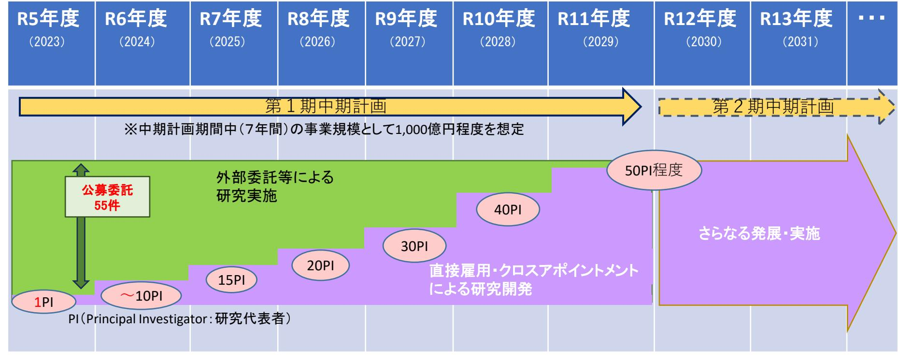
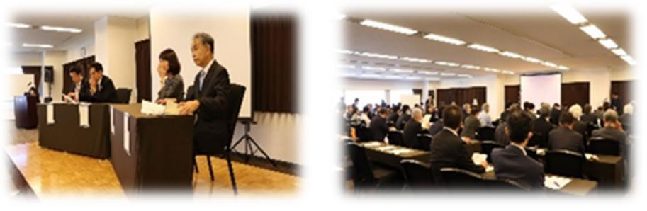
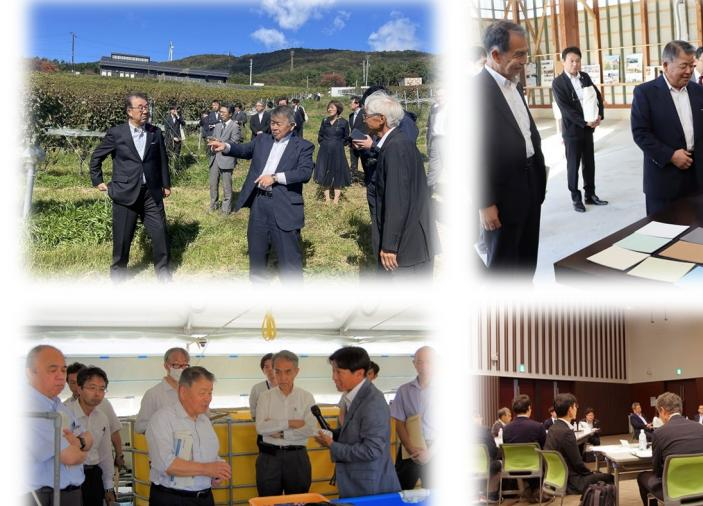
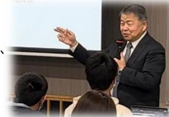
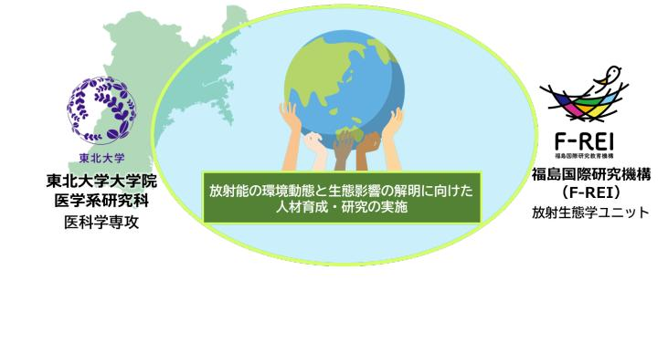
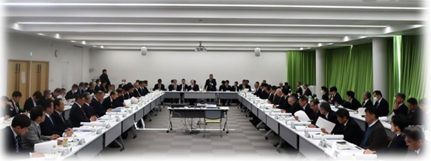
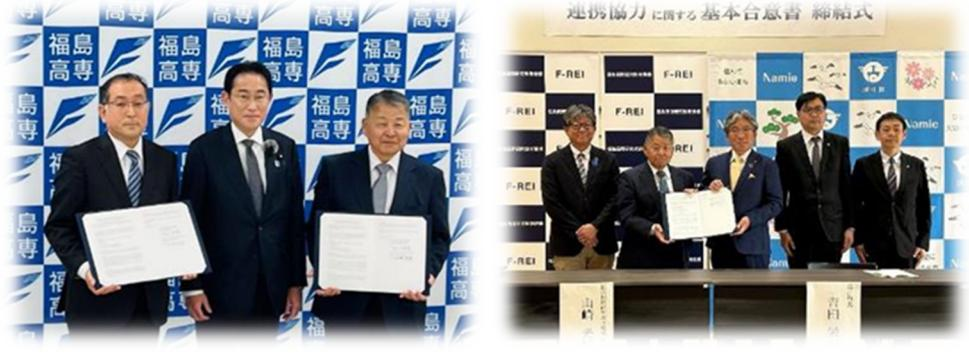
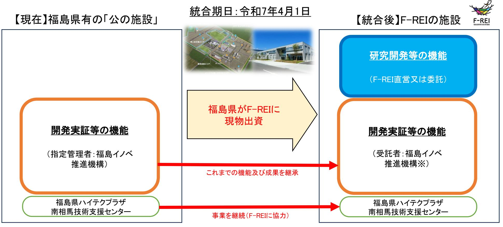
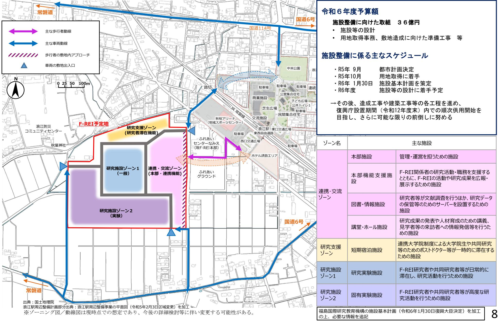

# **F-REIにおける研究開発の進捗状況等について**

# 令和6年6月福島国際研究教育機構(F-REI)

## **研究開発の進捗状況と見通し**

#### F-REIは、日本や世界の抱える課題、地域の現状等を勘案し、その実施において福島の優位性を発揮できる5分野を基本として取り組む。

#### 【現状】

○各分野を戦略的に推進するため、4名の分野長及びそれを補佐する7名の副分野長を任命。各分野長の下で委託研究先の選定等を進めた。 ○5分野27テーマの委託研究について、順次研究委託先を公募し、選定・協議の上、55件の委託研究開始。

| <代表機関名(コンソーシアム参加機関)>※黒:R5中に契約、青:R6に入り契約 | ① | ロボット分野 | <公募テーマ名等> |  |
| --- | --- | --- | --- | --- |
| ●困難環境下でのロボット・ドローン活用促進に向けた研究開発事業 | (1) 災害現場など困難環境での活用が見込まれる強靭なロボット・ドローン技術の | ・東北大学(NICT、広島大学、筑波大学、制御システムセキュリティセンター) |  |  |
| 研究開発 | (2) 多数のロボット・ドローンによる協調作業を実現する技術の研究開発 | ・東京工業大学(熊本大学、産総研) | ・会津大学 |  |
| (3) 湖沼、森林内などでの調査に対応するロボット・ドローンの研究開発 | ・千葉大学(日本分析センター) | ・福島大学 | ●フィールドロボット等の市場化・産業化に向けた性能評価手法の標準化事業 | ・㈱日刊工業新聞社 |
| ●防災・災害のためのドローンのセンサ技術研究開発事業 | ・信州大学(千葉大学、慶応義塾大学) | ・大阪工業大学 | ●廃炉向け遠隔技術高度化及び宇宙産業への応用事業 | ・広島大学(産総研、量研機構) |
| ・北海道大学(産総研、大熊ダイヤモンドデバイス㈱、福島高専) |  |  |  |  |
| 1 |  |  |  |  |

R6に追加公募を実施中:(1)土地利用型農業における超省力生産技術の技術開発・実証、(9)林業の自動化に資する技術開発・実証(提案公募型募集)

#### **③ エネルギー分野**

#### ●ネガティブエミッションのコア技術の研究開発・実証事業

| (1) 植物のCO2固定及びネガティブエミッションへの利用に関する研究開発と実証 | ・三重大学(大阪公立大学) |
| --- | --- |
|  | ・東京都立大学(鳥取大学、国際農林水産業研究センター、国立遺伝学研究所) |
|  | ・岡山大学(福島大学、東京農工大学、理化学研究所、山形大学、東北大学、名古屋大学) |
|  | ・福島大学(常磐共同火力㈱) |
| (2) 藻類のCO2固定及びネガティブエミッションへの利用に関する研究開発と実証 | ・理研食品㈱(理化学研究所、長崎大学) |
|  | ・三重大学(京都工芸繊維大学、京都大学、Bio-energy㈱) |
|  | ・日本製鉄㈱(金属系材料研究開発センター) |
|  | ・東北大学(鹿島建設㈱) |
| ●バイオ統合型グリーンケミカル技術の研究開発事業 | ・東京大学 |
| ●水素エネルギーネットワークの構築事業 | ・電力中央研究所 |
|  | ・東京大学(東北大学、京都大学) |

| ④ー1 放射線科学・創薬医療分野 |  |
| --- | --- |
| ●加速器を活用したRIの安定的かつ効率的な製造技術の開発 | ・大阪大学(量研機構、東北大学、東京大学、新潟大学) |
|  | ・福島県立医大 |
|  | ・理化学研究所 |
| ●RIで標識した診断・治療薬に関する研究開発 | ・福島県立医大(大阪大学、量研機構) |
|  | ・東京大学(理化学研究所、東京工業大学、㈱千代田テクノル) |
| ●農作物の生産性向上等に資するRIイメージング技術の開発等事業 | ・量研機構(東京大学、筑波大学、東北大学、名古屋大学、北海道大学、近畿大学、 |
|  | 東京農業大学、高知大学、㈱プランテックス) |
| ④ー2 放射線の産業利用分野 |  |
| ●超大型X線CT装置等を活用した産業のデジタル化技術の開発等に関する | ・CPE技術研究組合 |
| 調査研究事業 |  |

| ⑤ 原子力災害に関するデータや知見の集積・発信 |  |  |  |
| --- | --- | --- | --- |
| ●環境中の放射性物質の動態への人間活動の影響・移行抑制対策効果の | ・日本原子力研究開発機構 |  |  |
| 評価手法開発事業 |  |  |  |
| ●原子力災害からの復興に向けた課題の解決に資する施策立案研究事業 | ・長崎大学(福井大学、福島大学、伝承館) | ・福島学院大学 |  |
|  | ・東京大学(伝承館、㈱サーベイリサーチセンター) | ・福島県立医大 |  |
|  | ・福島大学(京都大学) |  |  |
| ●まちづくり研究及びラーニング・コミュニティハブ整備事業 |  |  |  |
| (1) 福島浜通り地域におけるまちづくり研究 | ・東北大学(福島大学) | ・東京大学 |  |
|  | ・福島高専 |  |  |
| (2) 福島浜通り地域におけるラーニング・コミュニティハブの整備 | ・東京大学 |  |  |
|  | ・宇都宮大学(福島高専) |  | 2 |

## **研究開発の進捗状況と見通し**

## **<研究実施体制>**

### 【今後の取組】

・令和6年度以降は、外部委託等による研究開発について、その進捗状況及び成果を踏まえて統廃合しつつ、段階的に直営の研究グループによる研究体制に移行予定。

・クロスアポイントメントを積極的に活用しつつ、国内外の優秀な研究者をPIとして選考又は公募により採用する方針。 (現行の委託研究とは別テーマの研究も開始予定。)

# **地元への広域波及効果を高める取組(① 産業化)**

F-REIにおける研究開発を、福島をはじめ東北の復興に結び付けるためには、広く企業や関係機関を巻き込みながら、実用化や新産業創出に着実につなげていく必要がある。国や地方公共団体が取り組む産業化施策と緊密に連携を図るほか、産業創出の分野で活動する外部の機関・関係者の知見を活用するための連携等を積極的に行う。

### 【現状】

#### **ネットワーク形成のためのセミナー等の開催**

- ① 第1回F-REI産学官ネットワーク・セミナー(R5.1.13) 会場:虎ノ門ヒルズ森タワー参加者:112社等278名(うち122名は会場参加)
- ② F-REI設立記念シンポジウム(R5.4.15) 会場:いわきワシントンホテル参加者:約600名(うち258名は会場参加)
- ③ 第2回F-REI産学官ネットワーク・セミナー(R5.10.12) 会場:TKPガーデンシティ仙台ホール参加者:76社等156名(うち113名は会場参加)

#### **シーズ・ニーズを把握するための市町村座談会の開催**

R5年度中に、浜通り地域等15市町村すべてで開催。 市町村ごとに、農業、工業、商業等の様々な現場に伺い、経営者等からF-REIに対する多様なニーズや研究開発のシーズを聞き取るほか、市町村長等との直接対話を通じ、地域の産業構造や課題を把握。

## 【今後の取組】

- ・産学官ネットワーク・セミナーは、2~3回程度開催を計画。
- ・市町村座談会は、中通り・会津地方において地域ごとに4回程度開催を計画。浜通り地域等15市町村においては、テーマ別(研究分野別)で 2回程度開催を計画。 4

# **地元への広域波及効果を高める取組(② 人材育成)**

イノベーションを創出し、新たな産業基盤の構築を通じて、福島や東北の創造的復興を実現し、ひいては世界の課題解決を目指すためには、まずは、F-REIにおいて様々な分野の研究者や技術者を育成し、多くの人材が長期にわたり復興をリードし、技術革新を通じて社会変革を成し遂げていくことが重要。

### 【現状】

F-REIが地域に密着し長期的に発展していくため、小中高校生等が先端的な研究・学術分野に触れる多様な機会を設け、地域の未来を担う若者世代を対象とした連続的な人材育成を進める。

#### **○F-REIトップセミナーの開催**

福島県内の大学、高校等の学生・生徒を対象として、最先端の科学技術の魅力、学ぶことの重要性などをテーマに、F-REI役員陣によるセミナーを開催。 福島大学、会津大学、福島県立医大、東日本国際大、福島高専相馬高校、会津学鳳中学校・高校、会津高校、小高産業技術高校安積高校、ふたば未来学園高校、福島高校、磐城高校、原町高校

### **○エフレイ・サイエンスラボ**

エフレイ研究者の指導の下、高専生の企画による小中学生向けの学びの場を開催(R6.1.8) (霧箱による放射線可視化と放射線計測等の実験実習)

#### **○親子わくわく科学実験教室**

小学生と保護者を対象に、科学を身近に感じてもらうための実験教室を開催(R5.10.15)

連携大学院制度等により、F-REIの研究者による研究指導など、大学院生や大学生等を対象とした人材育成を進める。

### **○東北大学との連携大学院(連携講座)の設置**

東北大学大学院医学系研究科に令和6年度から「放射性環境生体医学連携講座」を設置し、F-REIの研究者が東北大学大学院のポスドク、大学院生を指導。 10月からの指導開始に向けて準備中。

### 【今後の取組】

○F-REIと連携協定を結んだ福島大学、会津大学、福島県立医大、福島高専ではF-REIトップセミナーを継続開催。

○県内高校に対しては、(公財)福島イノベ機構が実施する小中高生向けの出前授業プログラムの一環として実施予定(10回程度)。

○小中学生向けでは親子参加型の科学実験教室を引き続き計画(2回程度)。

# **地元への広域波及効果を高める取組(③ 司令塔)**

F-REIは、福島における新たな産業の創出等に資する研究開発の進捗状況の把握等の協議等を行うため、新産業創出等研究開発協議会 (F-REI協議会)を組織し、研究開発における役割分担の明確化や重複の排除等により、福島全体で最適な研究開発体制を構築する。

### 【現状・今後の取組】

#### **F-REI協議会の組織・運営**

F-REI協議会の第1回会合をR5年5月10日に大熊町で開催し、第2回会合をR6年1月12日に富岡町で開催。

(構成員)F-REI、福島県知事、福島大、福島県立医大、会津大、福島高専、AIST、NARO、QST、JAEA、NIES、内閣府、復興庁、文科省、厚労省、農水省、経産省、環境省、浜通り地域等15市町村長、イノベ機構

R6年度は2回程度開催を見込み、初回はR6年8月5日に双葉町での開催を予定。

#### **連携協力に関する基本合意書等の締結**

F-REIと大学・高専、関係自治体、企業などとの間で、研究開発・人材育成等における連携、双方の資源を有効に活用した協働活動等、締結先に応じた基本合意書(MOU)等を締結。

> 福島高専(R5.4.1:岸田総理の立ち合い)、福島県立医大(R5.4.5) いわき市(R5.4.15)、福島大学(R5.5.17)、浪江町(R5.5.29) 会津大学(R5.5.30)、南相馬市(R5.9.1)、東邦銀行(R6.1.25)

#### **施設統合**

#### **環境動態研究関係**

次の施設における放射性物質の環境動態研究に係る部分についてF-REIに統合。

- ① 量子科学技術研究開発機構(QST)放射線医学研究所福島再生支援研究部福島研究分室、いわき出張所→R5年4月1日F-REIに統合(放射生態学ユニット)
- ② 日本原子力研究開発機構(JAEA)廃炉環境国際共同センター(CLADS)

R7年4月三春町に所在する環境動態研究部分をF-REIに統合予定

- ③ 国立環境研究所(NIES)福島地域協働研究拠点
#### **福島ロボットテストフィールド関係**

ロボット分野における研究開発成果の産業化のための実証等をより効果的・効率的に行えるようにする観点から、福島県が設置している福島ロボットテストフィールド(RTF)のF-REIへの統合に関し、福島県と協議に取り組む。 R7年4月の統合について、R6年6月14日に基本合意書を締結 6

## 福島ロボットテストフィールドの福島国際研究教育機構への統合(イメージ)

RTF統合の基本的な考え方 (令和6年6月14日福島県・F-REIの基本合意書より)

本統合は、(中略)RTFのこれまでの機能及び成果をF-REIが継承するとともに、ロボット分野を中心とするF-REIの研究開発、産業化、人材育成に関する機能をRTFに付加することにより、RTFの更なる発展・活用を目指すために行われるものである。このため、F-REIは、統合後のRTFについて、世界に類を見ない開発実証拠点としての機能を維持・発展させつつ、F-REIとし必要な研究開発や実証等の拠点として活用するものとする。また、F-REIは、福島県の協力の下、RTFの活用を通じて、世界水準の研究とその成果の社会実装・産業化を進め、RTFを利用する企業・研究機関との共同研究等によりその成果の最大化を目指す。あわせて、福島県は、F-REIが統合後のRTFを円滑かつ効果的に運営することができるよう、F-REIと緊密な連携を図るものとする。

※1 当分の間、現行の指定管理業務の内容を踏まえ、委託(当初の委託期間はR7~R11年度までの5年間とし、R9年度に見直し等を協議 ※2 入居企業等については、従前どおり審査し、継続的に入居を許可 ※3 利用企業等については、F-REIとの利用調整を図りながら、利用を許可

## (参考)福島国際研究教育機構の本施設整備について

