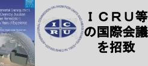

### 新産業創出等研究開発基本計画の概要①(考え方) [令和4年8月26日内閣総理大臣決定]

# 福島復興再生特別措置法(平成24年法律第25号)第90条第1項に基づき、内閣総理大臣が、福島復興再生基本方針に即して定める新産業創出等研究開発等施策の推進に関する基本的な計画。

# **我が国の現状**

- 〇我が国は、バブル崩壊後、経済再生に取り組んできたが、グローバルな競争環境等が激変する中で、**30年以上にわたる長期停滞から脱することができずにいる**。 この停滞を今こそ打破し、イノベーションを軸とした思い切った成長政策を通じて**経済成長を実現し、大変革を進めていかねばならない**。
〇デジタル改革やグリーン成長戦略など、課題解決に向けた政策を推進しているが、我が国が国際競争で再び優位性を発揮するためには、こうした政策を総動員し、**地位の顕著な低下が指摘される科学技術力を、短期間で世界トップレベルに引き上げ、日本再生の原動力としていく必要がある**。

# **福島からはじめる意義**

- 〇原子力災害の被害を最も大きく受けた福島においては、これから復興・再生が本格的に始まる時期となる。
- 〇福島イノベーション・コースト構想による先行的な取組により、福島ロボットテストフィールドや福島水素エネルギー研究フィールドなど、これからのイノベーションの起点となる技術の蓄積が始まっている。
- 〇廃炉や放射性物質による汚染などの課題を解決し、さらに強みとなる領域を開拓し、発信・普及していくことを通して、日本そして世界の課題解決にも貢献できる。

### 〇**機構が中核となって行う取組を、新しい日本を創るリーディングプロジェクトと位置付け、国の総力を挙げて推進していく**。

# **機構が中核的な役割を担うために行う取組**

### **【国によるリーダーシップ】**

- 機構の柔軟かつ大胆な運営を確保するためのトップマネジメントを強化するとともに、省庁の縦割りを排して政府一丸となってこれを支援する体制を整備する。
- イノベーションの創出には、中長期を見据えた研究開発が不可欠であり、安心して研究に専念できるよう、組織的かつ財源的にも長期・安定的な運営体制を構築する。 復興庁の総合調整機能の下で、復興財源等を活用することにより、可能な限り速やかかつ円滑な機構の立ち上げに取り組む。

# **【中長期の研究開発を支援する体制整備】**

複数年にわたる研究開発等を円滑に実施するため、予算単年度主義の弊害を排し、様々な手法を用いて、長期・安定的な財政基盤を確保する。

- 復興庁の設置期間終了後にあっても、複数省庁を束ね、横串を刺して総合調整の役割を果たす司令塔機能を引き続き政府内に確保する。
## **【実証や社会実装の推進】**

- 研究成果の社会実装等を進め、産業構造や社会システムの転換につながるイノベーションを起こし、その循環により国内外の資金や人材を呼び込む。
- 福島にしかない多様な実証フィールド等を最大限活用するとともに、他の地域ではできない実証等を可能とする規制改革を推進する。

## **【研究人材の確保・育成】**

- 成果や能力に応じた柔軟な給与等の水準、研究補助者の確保を含む充実した研究環境、若手や女性などの研究者が活躍しやすい環境等を実現する。
- 多くの人材が技術革新をリードし社会改革を成し遂げることが重要であるため、連携大学院制度の活用や、高等専門学校との連携、小中高校生向けの教育プログラムの開発を行い、地域の未来を担う若者世代等の人材育成も進めていく。
- **1 ⇒ 有力な研究者や起業家が集結し、イノベーションの創出が自律的に加速する好循環を形成新しい時代を夢見る研究者、起業家が福島の地に集い、実証・実装の成果を各地に展開することで国全体の成長につなげる**

# **施策の推進のための方針**

### **【官民の資源集中によるイノベーションの創出】**

- 公的資金を呼び水とした民間資金の動員などの取組を推進する
- 機構に係る研究のスピンオフにより創業した事業者への出資をはじめ、地域の創業支援事業と連携して科学技術を核とした創業を支えるエコシステム環境を整備する
- 機構の事業は、復興に取り組む地域全体に資する広域的な取組であることが重要である

# **【機構の機能発揮のための基盤構築】**

- 国内外の大学や研究機関等を集積させるため、福島県等が主体的に取り組むまちづくりと緊密に連携し、機構の施設整備を推進する
- 研究開発の中で障害となる規制に対し、機構において研究者や企業等からの要望を集約し国等に提案するなど、実地に即した規制緩和を推進する
- DX等に対応した研究環境を整備するとともに、研究開発機器等の外部利用を積極的に推進することで好循環を創出する
- 国際的な機関とも連携しながら国内外の知見も集積し、世界で活躍する優秀な研究者が柔軟に参画できる研究環境を整備する等

# **機構の各機能について**

| (1)研究開発機能 | (2)産業化機能 |
| --- | --- |
| ○ ①ロボット、②農林水産業、③エネルギー、④放射線科学・創薬医療、 | ○ 機構発ベンチャーへの出資、企業との共同研究を可能とする産学連携体 |
| 放射線の産業利用、⑤原子力災害に関するデータや知見の集積・発信の | 制を構築する。 |
| 5分野の研究開発を実施する(詳細は次頁)。 | ○ 最先端の設備や実証フィールド等の活用、大胆な規制緩和等により、 |
|  | 国内外の関係者の参画を推進する。 |
|  | ○ 戦略的な知的財産マネジメント等により、研究者のインセンティブを確保 |
|  | する。 |
| (3)人材育成機能 | (4)司令塔機能 |
| ○ 我が国が強みをもつ研究分野をリードする大学との連携大学院制度を活 | ○ 協議会を組織し、福島県内の既存施設等の取組に横串を刺す司令塔 |
| 用する。また、国際原子力機関(IAEA)等と連携し、廃炉の現場にも貢 | としての機能を最大限に発揮する。 |
| 献し得る国際研究者を育成する。 | ○ ロボット分野に包含される航空宇宙や、エネルギー、放射線科学・創薬 |
| ○ 地元の産業界・地方公共団体・大学・高等専門学校等と連携する。小中高 | 医療等の技術分野は、我が国の今後の優位性に寄与し得る。経済安全 |
| 校生等が先端的な研究や科学技術に触れる多様な機会を設ける。 | 保障の観点からも、研究資源の配分、セキュリティの実施等について戦略 |
|  | 的に判断する。 |
| ○ クロスアポイントメント制度等を活用し、AIやデータサイエンス等にも精 |  |
| 通した次世代人材を育成する。 | ○ 研究の加速や総合調整を図る観点から、基本構想の内容に沿って既存 |
|  | 施設の施設統合及び予算集約を行う。 |
|  | 2 |

廃炉作業の着実な推進を支え、災害現場等の過酷環境下や人手不足の産業現場等でも対応が可能となるよう、ロボット等の研究開発を行う。

### (研究開発の内容)

- ○高い専門性・信頼性を必要とする廃炉作業ロボットについて、触覚フィードバック等の遠隔操作技術を導入し、システムの概念実証を実施し、その後、実用化に向けた試作機の開発を目指す。
- ○ドローンに搭載可能な水素ガスタービン等の研究開発や福島RTF等を活用した実証により、長時間飛行・高重量積載を実現し、カーボンニュートラルを達成する水素ドローンの実証機を開発する。

### 遠隔操作ロボット

# **【①ロボット】 【②農林水産業】**

スマート農業やカーボンニュートラル等を通じた地域循環型経済モデルの構築を目指し、超省力・低コストな持続性の高い農林水産業に向けた実証研究を行う。

### (研究開発の内容)

- ○複数ほ場を自律的に移動・作業する自動走行トラクタや地産地消型エネルギーシステム、農林水産資源の循環利用等の実証研究を行い、地域循環型経済モデルのプロトタイプの提示を目指す。
- ○農林水産資源の開発のための有用性評価等に係るデータ基盤を整備し、その後、大学、民間企業等との共同研究による製品開発等の実用化プロジェクトを実施する。

複数ほ場を自律的に移動、作業する農機制御システム

### 加工業務用野菜、薬用作物、バイオマス作物

## **【③エネルギー】**

福島を世界におけるカーボンニュートラル先駆けの地とする。

### (研究開発の内容)

- ○水素エネルギーネットワークを構築するため、電力を水素として高効率に貯蔵・利用するシステム等を開発し、その後、地域内水素エネルギー制御システムを開発する。
- ○ネガティブエミッションのコア技術となる、大規模なCO2吸収に資する植物・藻類等のポテンシャル評価、性能・生産性向上等及び利用技術の研究開発を行う。

- 早生、CO2大量吸収等の機能を付与した植物生産(BECCS)
### **【④放射線科学・創薬医療、放射線の産業利用】**

オールジャパンの研究推進体制の構築と放射線科学に関する基礎基盤研究やRIの先端的な医療利用・創薬技術開発及び放射線産業利用を実現する。

### (研究開発の内容)

- ○アルファ線放出核種等を用いた新たなRI医薬品の開発等を行う。また、加速器を利用したRIの製造技術など創薬医療分野における世界最先端の研究開発を一体的に推進する。
- ○自動車等の大型部品等を丸ごと計測し、効率的にデジタル化して活用する技術の開発に向け、超大型X線CTの開発、CT画像の高画質化及びそのシミュレーション適用のための技術開発に取り組む。

世界初のガントリー式超大型X線CT装置

## **【⑤原子力災害に関するデータや知見の集積・発信】**

自然科学と社会科学の研究成果等の融合を図り、原子力災害からの環境回復、原子力災害に対する備えとしての国際貢献、更には風評払拭等にも貢献する。

ネットワーク (水素製造施設)

### (研究開発の内容)

- ○放射性物質の環境動態の解明や将来予測のため、放射性物質の移行等に関する予測モデルを開発し、生態系への影響評価など社会的課題の検討に資する基盤的なデータや知見の提供を行う。

**3**

