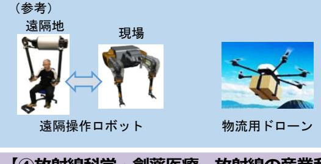
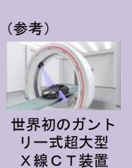
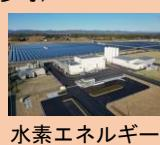
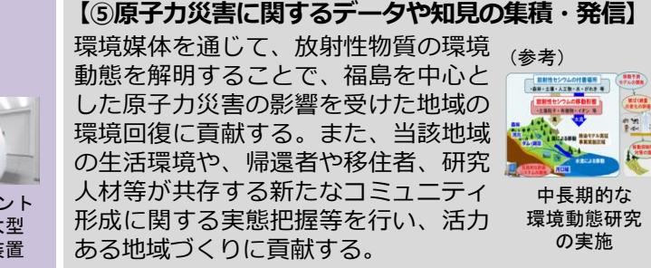
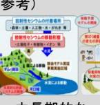

# 福島国際研究教育機構の中期目標の概要①

## **政策体系における法人の位置付け及び役割**

- 「福島国際研究教育機構基本構想」(令和4年3月29日復興推進会議決定)において、福島イノベーション・コースト構想を更に発展させ、司令塔となる中核的な拠点として、機構を設立することで、研究開発や産業化、人材育成の動きを加速させていくこととされている。
- 機構の取組は、機構の本施設の立地近接地域だけでなく、復興に取り組む地域全体にとって「創造的復興の中核拠点」として実感され、福島をはじめ東北の復興を実現するための夢や希望となるものでなければならない。
- 機構は、国及び福島県・市町村並びに大学その他の研究機関、企業、関係機関等と連携して、機構設置の効果が広域的に波及し、地域の復興・再生に裨益するよう取組を進めるものとする。
- 機構の効果は地域の垣根を越えて波及し、オールジャパンでのイノベーションの創出、科学技術力・産業競争力の強化、経済成長、さらには国民生活の向上に貢献することが期待される。
- 機構は、省庁の縦割りを排した総合的かつ安定的な支援体制や理事長の明確なビジョンと強いリーダーシップの下で、福島の優位性を発揮できる、①ロボット、②農林水産業、③エネルギー、④放射線科学・創薬医療、放射線の産業利用、⑤原子力災害に関するデータや知見の集積・発信の5分野を基本とした研究開発に取り組むとともに、研究開発成果の産業化・社会実装や人材育成・確保等についても、その主要な業務として行うものとする。
- 機構は、福島に既に立地している研究施設等の取組について横串を刺す調整機能を持った司令塔としての役割を持つものとする。
- なお、第一期中期目標期間においては、「基盤作りと存在感の提示」に重点を置くこととし、機構の施設が整備されるまでの間も、たゆむことなく復興に貢献できるよう、取組を進めるものとする。

| Ⅰ.中期目標の期間令和5年4月~令和12年3月(7年間) | Ⅲ.研究開発等業務の運営の効率化に関する事項 |
| --- | --- |
| Ⅱ.新産業創出等研究開発の成果の最大化その他の研究開発等業務の | 1.大学や他の研究機関との連携 |
|  | 研究開発や産業化、人材育成等のパートナーとして、福島や全国の大学、教育機 |
| 質の向上に関する事項 | 関、研究機関、企業等との効果的な広域連携を進める。 |
| 国内外に誇れる研究開発を推進し、その産業化、人材育成・確保に取り組むととも | 2.効果的・効率的なマネジメント体制の確立 |
| に、福島県内での活動、実証フィールド等の活用、様々な主体との連携を適切に行い、 |  |
|  | 理事長を中心としたトップマネジメントに基づき、戦略的かつ柔軟に研究開発等 |
| 機構の設置効果が広域的に波及するよう取組を進める。 | 並びに福島の課題把握及び地域との協働等を進めることができる体制を構築する。 |
| 1.研究開発に関する事項 | 3.経費等の合理化・効率化 |
| (i) 研究開発(※詳細は次頁) | 経費の合理化・効率化、調達の合理化及び契約の適正化を図る。 |
| 日本や世界の抱える課題、地域の現状等を勘案し、福島の優位性を発揮できる5分 |  |
| 野の基礎・応用研究を進め、併せて機構ならではの分野融合研究に取り組む。 | Ⅳ.財務内容の改善に関する事項 |
| (ii) 研究開発環境の整備 | 外部資金の獲得なども段階的・計画的に進めながら、世界水準の研究を実施するた |
| 外部供用も視野に入れた施設・設備等の整備を進めるとともに、50程度の研究グ | めに必要な研究資金を確保する。 |
| ループによる研究体制を目指して、魅力的な研究開発環境の整備を図る。 |  |
| (iii) 研究開発に係る情報収集等 | Ⅴ.その他研究開発等業務の運営に関する重要事項 |
| 研究開発を行うにあたり、福島の復興・再生に貢献する研究開発のニーズや科学技 | 1.施設及び設備に関する事項 |
| 術の進展等、必要な情報の収集を行う。 | 国が行う機構の当初の施設整備と緊密に連携しながら、その進捗に合わせ、研究 |
| 2.産業化に関する事項 | 機器など設備面における研究開発環境の整備を図る。 |
| 企業が積極的かつ柔軟に機構の活動に参画できる産学連携体制を構築する。機構の | 2.人事に関する事項 |
| 活動や研究成果等について国民に向けてわかりやすく広報活動を行う。戦略的な知 | 若手や女性などの多様な人材の確保を図るとともに、成果や能力に応じた柔軟な |
| 的財産マネジメントや先端技術の事業化経験等を有する専門人材の確保に取り組む。 | 給与水準等を設定する。 |
| 3.人材育成・確保に関する事項 | 3.認知度の向上や多様なパートナーシップの構築に関する事項 |
| (i) 人材育成 | 情報発信等による機構の認知度の向上や多様なパートナーシップの構築に努める。 |
| 機構において研究者や技術者を長期にわたって連続的に養成する観点から、大学院 | 4.規制緩和に向けた取組に関する事項 |
| 生等や地域の未来を担う若者世代、企業人材等の人材育成を進める。 | 研究開発の進捗に応じて、実地に即した規制緩和に向けた検討を進める。 |
| (ii) 人材確保 | 5.情報システムの整備及び管理に関する事項 |
| クロスアポイントメント等により、国内外の優れた研究人材の確保を図る。 | 政府の方針を踏まえ、情報システムの適切な整備及び管理を行う。 |

福島国際研究教育機構の中期目標の概要②

農林水産資源の超省力生産・活用を核とした環境負荷の低い地域循環型経済モデルの構築に向け、農林漁業者や民間企業等の参画の下で未利用地等を活用した実証研究に取り組む。また、研究の展開と並行して、生産現場レベルでの実証を実施することで、福島浜通り地域等の農林水産業のスマート化を後押しするなど、短期的にも営

## **< 機構が実施する研究開発5分野の目標 >**

以下の内容を基本に取り組む。ただし、福島の復興・再生の進捗に応じた研究開発のニーズや科学技術の進展等を踏まえ、柔軟に取組を実施する。

農再開等の課題解決に貢献できるよう取り組む。

## **【①ロボット】**

福島ロボットテストフィールド等を活用して、廃炉に資する高度な遠隔技術や、過酷環境を含めた様々な環境下での使用を想定したロボット、ドローンをはじめとした次世代空モビリティ等に関する研究開発に取り組む。

## **【④放射線科学・創薬医療、放射線の産業利用】**

放射線及び放射性同位元素の利用に関する基礎基盤研究を軸として、医療分野はもとより、工業・農業を含む多様な分野への成果の応用を見据え、一体的に研究開発を進める。特に、創薬医療分野においては、がん治療への応用をはじめとする放射線の先端的医学利用や先端的な創薬技術開発等に取り組む。

- アルファ線放出核種により前立腺がんが寛解
(参考)

**【②農林水産業】**

### 複数ほ場を自律的に移動、作業する農機制御システム **◇放射線科学・創薬医療 ◇放射線の産業利用** 超大型X線CT装置の詳細設計や画像処理基盤技術の研究開発及び現物データ利活 (参考) (参考) 加工業務用野菜、薬用作物、バイオマス作物

用へ向けた検討を行い、我が国の新たなものづくりのプラットフォーム形成に貢献する。

**【③エネルギー】**

再生可能エネルギーや水素を地産地消で面的に最大限活用するネットワークを形成するとともに、未利用地等を有効活用したネガティブエミッション技術の研究開発等に取り組むことにより、福島を世界におけるカーボンニュートラルの先駆けの地とする。

(参考)

ネットワーク (水素製造施設)

早生、CO2大量吸収等の機能を付与した植物/海藻等生産(BECCS・ブルーカーボン)

○ 特措法第115条の規定に基づき、主務大臣は、毎事業年度の終了後、機構の研究開発等業務の実績に関する評価を行う必要があることから、中期目標の策定に併せて、評価軸及び関連指標等を別に定めることとする。

- **<関連指標>** ○ その設定に当たっては、機構の役割や研究開発等業務の目標、国が行う施設整備の状況等を踏まえ、真に評価すべき事項を適切に評価できる基準となるよう留意する。
## **<評価軸>**

- 福島における新たな産業創出及び我が国の科学技術力・産業競争力の強化に資する観点から、研究テーマの立案・検討・マネジメントが適切に進められているか。 実証フィールドの活用など福島における優位性を生かし、福島をはじめ東北の被災地、ひいては日本や世界の課題の解決に資する研究開発成果を創出できているか。
- 研究開発成果のわかりやすい普及及びその活用が促進できているか。
- 大学院生等、地域の未来を担う若者世代、企業の専門人材等を対象とした人材育成が適切に進められているか。
- 「基盤作りと存在感の提示」に資する取組が適切に進められているか。 等
- 研究開発成果の内容
- 研究テーマの設定・継続の適切性
- 研究開発の進捗管理の状況
- 研究開発成果のわかりやすい普及及び活用促進に係る取組の実績
- 大学院生等、地域の未来を担う若者世代、企業の専門人材等を対象とした人材育成の推進状況
- 研究人材の雇用状況
- 大学、研究機関、教育機関、企業等との広域連携の実績
- 県内での活動や実証フィールド等の活用等の実績等

