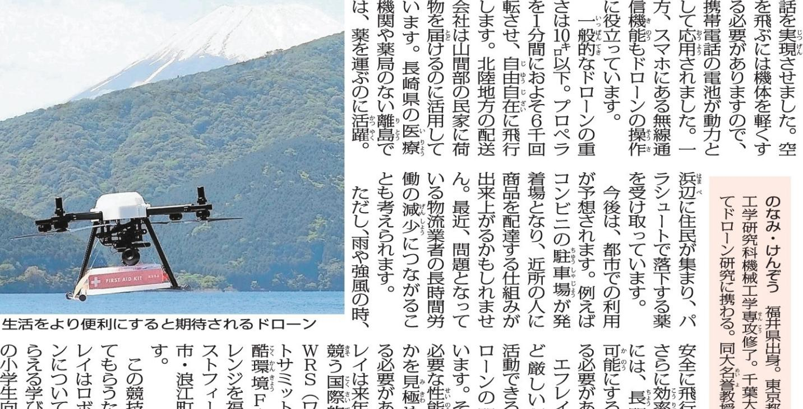

| 4 ° of off ニイ |
| --- |
| g ប ក្នក がかかるという。 ことなるなど、 模 るため、 以上が出したの出版。 『芝の産業 |
| 肥達外炎書放助、 暦の |
| 、中国のアイテム、 始めたのは山年はど前。 TI |
| 『ローンが注目を集め |
| パン 行体 約3年間、 くーロデ] 人が乗らな 0 ਰ੍ #ミイターゲーム # |
| 、1日のここは全国の第二次第の第9章。 1月 TL |
| 子力災害に関するテータの集積・発信 05 |
| 業のつけています。 の数は観料学を有しな業作の同梱 |
| 伊しする機関です。友象はのロビスシノしの豊林な産 |
| 題災と東京電力閣島第一度発華放分のの傍興を参 |
| 日三 題社社人才為會議團體現在教育機構 エフレイ) は科学を発展させ、東日本大 ગ તેમ F |
| 放な VE 1 の生活をさらい便利にす ロボット分野長 તમે ど 700万彩票 三日 7 健康先生 の研究者に、科学の魅力を教えてもらいます。 9 后 200 ています。小壁示軽 工ネルギーが長持ちする けどことです。 一を起きすと期待さ |

## 未来 う 空飛び交 間近

同大名誉教授

。

生活をより便利にする 期待される 蔵 ローNOK C い環境の カありま の開発を : 分子 町の分で で

