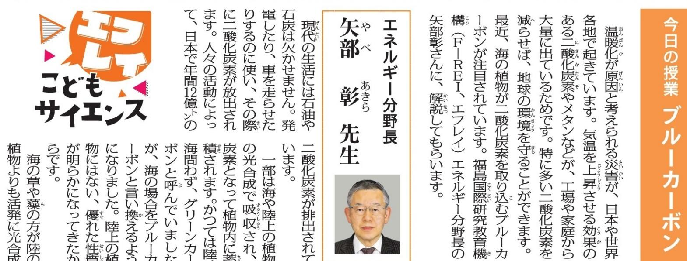
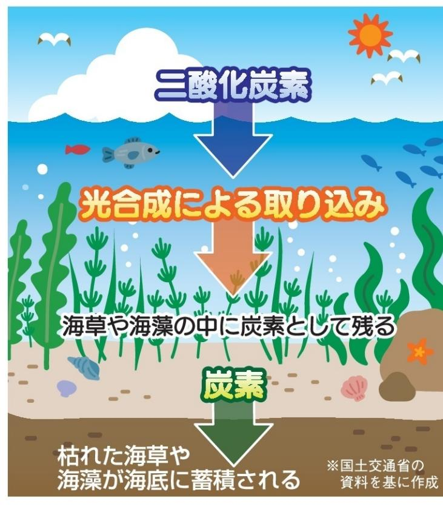

## 海の草 求 藻が光合成

| される |  |  |  |
| --- | --- | --- | --- |
| ※国土交通省の 資料を基に作成 |  |  |  |
| いろ努力しています。 | of At CH | 1 H L 12017777 |  |
| 理要 れず 一般 | おお日能 12nd | 间 128 OL 471-782-177 |  |
| 取温暖化花防 | ત્ત્વ 1120 | 0128 # HOOL ° 0 |  |
| 1 al i 方式 | 7 トランクを動けす | に 10107164441 |  |
| の原因 150 9 | は食 45 | 470 た 『炭素は屈 |  |
| 20022 1) | 調 11 < | t °o l こ 45 し1階用 |  |
| LL Potott 一 9 2 | 00 11세 | 殿化炭素を取り込み |  |
| 養殖にも挑戦し SN | 開除元 に疲れば | え成長し、たくさん |  |
| TTONSTO EAH- 0 | 490 67778 | 1777年度最高的 |  |
| 500 次全国有数の養 殖産 | 中 苗 C 1 |  | n |
| ららに、相馬市の松山 | 時ずる方法を研究 | 하다가 になるでし 101822 タイ |  |
| ○) 技術戦略 | 開発機構 ्री में में स्थान के बाह्य के बाह्य के बाद में होती होती होती होती होती होती होती. हाली के बाद में होती होती होती होती. हाली होती होती होती है कि होती है कि होती है कि होती ZEDD | べ深のジ 性な > निर्मान | 10 |
| ਰੀਕਿਸ NI | 1 宇院博士課程修 HH 研究開発法人 o | is 、 to |  |
| 横浜市出身。東京工大 | (2)484 · 123 | of i 8 日本は海 12 火田市 | 40ND |

