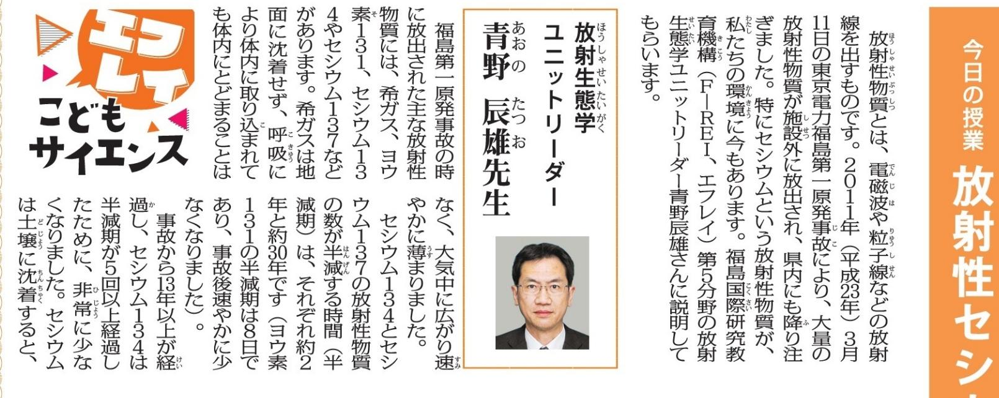
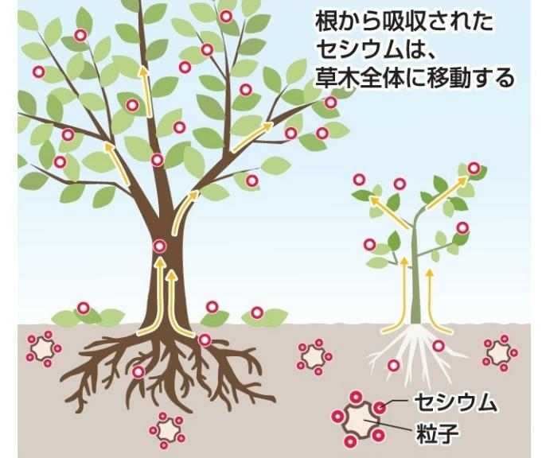

## 粒に付きやす DT

## 親子でワクワク科学実験 来月10日、福島高専で

小学生に放射線などを説 明する親子でワクワク 実験は8月10日、いわき の福島高専で催されます。 エフレイ、量子科学技術研 究開発機構(QST)の主 催。

高専の学生が指導者 ります。放射線が通って 筋を観察する実験、 ンのプログラミングな 予定しています。保護 対象に放射線の知識の に向けた座談会も開き す。

4年~6年生と保護者の 30組程度が 受講できま す。無料。 申し込みは 専用QRコ 申し込みの ドから申 QRコード し込む。

