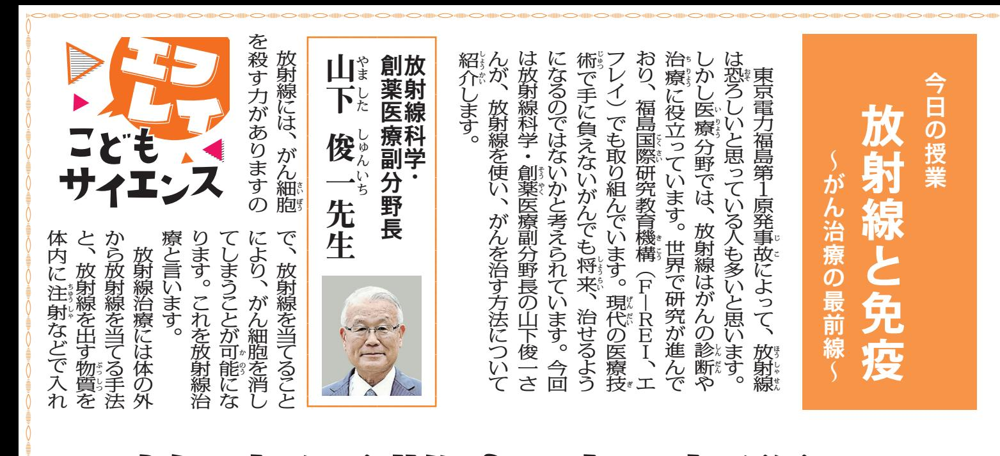

椯 椯 椯 椯 椯 椯 椯 椯 椯 椯 椯 椯 椯 椯 椯 椯 椯 椯 椯 椯 椯 椯 椯 椯 椯 椯 椯 椯 椯 椯 椯 椯 椯 椯 椯 椯 椯

る 方 法 が あ り ま す 。 エ フ

こ の ア ル フ ァ 線 を 出 す

も あ り ま す 。 免 疫 と は ウ

イ ル ス や 細狹狨 菌狱猷 の み な ら

り

線

つ

を

う

し

効狷狪

射

用

ら

う

特 定 の 元 素 を ど の よ う

レ イ が 注 目 し て い る の は

## **克服へ 治療困難な病**

椯 椯 椯 椯 椯 椯 椯 椯 椯 椯 椯 椯 椯 椯 椯 椯 椯 椯 椯 椯 椯 椯

| で | が | は | し | 活 | 素猁 | う | き | が | ま | 病猗猫 | 後 | 狪 | す | 上 | て | 用 | ) | 放 | 特 | る | ん | ざ | 者 | 起 | 状狼猫 |  |  |  |  |  |  |  |  |  |  |  |  |  |  |  |  |  |  |  |  |  |  |  |  |  |
| --- | --- | --- | --- | --- | --- | --- | --- | --- | --- | --- | --- | --- | --- | --- | --- | --- | --- | --- | --- | --- | --- | --- | --- | --- | --- | --- | --- | --- | --- | --- | --- | --- | --- | --- | --- | --- | --- | --- | --- | --- | --- | --- | --- | --- | --- | --- | --- | --- | --- | --- |
| 。 | 手 | い | し | ア | 射 | に | か | 細 | ま | で | 狪 | き | が | に | ま | た | ス | 線 | 、 | ら | 胞 | な | す | に | 悪 |  |  |  |  |  |  |  |  |  |  |  |  |  |  |  |  |  |  |  |  |  |  |  |  |  |
| 使 | す | 薬 | タ | を | ア | で | に | 部 | 。 | く | 化 | う | 。 | の | チ | 出 | ル | す | 効狷狪 | 分 | な | い | し |  |  |  |  |  |  |  |  |  |  |  |  |  |  |  |  |  |  |  |  |  |  |  |  |  |  |  |
| と | ア | 開 | ン | す | フ | 。 | 果狯 | に | ぜ | の | て | 、 | ル | 発 | な | 特 | ァ | が | 転猊猷 | な | が | 体 |  |  |  |  |  |  |  |  |  |  |  |  |  |  |  |  |  |  |  |  |  |  |  |  |  |  |  |  |
| 副 | フ | を | ど | 定 | 線 | 期 | 移狨 | ら | 特猌狳 | の | 作 | ァ | 目 | ( | の | と | 待 | し | ば | 徴猅猫 |  |  |  |  |  |  |  |  |  |  |  |  |  |  |  |  |  |  |  |  |  |  |  |  |  |  |  |  |  |  |
| 用 | 線 | 指 | を | 元狶猷 | い | で | た | さ | 、 | 狪 |  |  |  |  |  |  |  |  |  |  |  |  |  |  |  |  |  |  |  |  |  |  |  |  |  |  |  |  |  |  |  |  |  |  |  |  |  |  |  |  |
| 疫独狱 | す | 適猊狱 | 物 | で | を | フ | る | す | 研 | よ | に | ま | 。 | 切狿猈 | 質 | す | 組 | ァ | 性狿狨 | 。 | う | 、 | を | 究 | た | な | が | 。 | み | 線 | 質狻猈 | が | に | が |  |  |  |  |  |  |  |  |  |  |  |  |  |  |  |  |
| 活狯猇 | が | 、 | の | 」 | エ | 合 | を | の | ん | 運 | ん | 性狿狨 | 進 | 放 | か | 運 | フ | わ | 出 | あ | 細 | ぶ | 細 |  |  |  |  |  |  |  |  |  |  |  |  |  |  |  |  |  |  |  |  |  |  |  |  |  |  |  |
| 化狯 | め | 射 | を | び | レ | せ | す | る | 胞 | か | 胞 | さ | ら | 線 | 調 | 役 | イ | れ | 特 | 物 | だ | に | だ |  |  |  |  |  |  |  |  |  |  |  |  |  |  |  |  |  |  |  |  |  |  |  |  |  |  |  |
| せ | れ | 治 | べ | 「 | は | ば | 定 | 質 | け | つ | け | る | て | 療 | て | と | 、 | 良 | の | と | に | い | に |  |  |  |  |  |  |  |  |  |  |  |  |  |  |  |  |  |  |  |  |  |  |  |  |  |  |  |
| 長猅猫 | い | は | い | し | ど | い | 元 | ア | 集 | て | 届猌猍 | 狪 | ま | ま | 所狻猫 | 免猥猷 | ま | て | の | 訳猳狵 | 素 | ル | 、 | く |  |  |  |  |  |  |  |  |  |  |  |  |  |  |  |  |  |  |  |  |  |  |  |  |  |  |
| れ | し | す | 線 | な | か | に | 治 | が | を | 除猒猂 | ず | し | が | る | を | 手狻猩 | っ | 放 | す | う | 当 | く | 、 | こ |  |  |  |  |  |  |  |  |  |  |  |  |  |  |  |  |  |  |  |  |  |  |  |  |  |  |
| い | よ | こ | 正 | 段猄猷 | た | 射 | こ | ま | て | 仕 | が | れ | で | り | と | し | と | 病 | 線 | と | く | 、 | 組 | ん | ま |  |  |  |  |  |  |  |  |  |  |  |  |  |  |  |  |  |  |  |  |  |  |  |  |  |
| す | 豊猪猃 | で | く | な | を | は | が | 働 | 薬 | み | 細 | で | やました | しゅんいち | 長崎市出身 | 。 | 長崎大医学部卒 | 。 | 。 | か | 皆猣猎 | 理献 | り | 克狷狳 | 、 | で | け | と | で | 胞 | 治 | 狶猷 | 狺狨 | 狵猷 | 狷狳 | 狹狨 | 猅猫狪 |  |  |  |  |  |  |  |  |  |  |  |  |  |
| に | さ | 解狯狨 | ま | 服猙狳 | が | き | ば | 免 | す | な | 現 | 在 | 、 | 福島医大副学長兼 | 国 | 際 | 交流センター長 | 。 | 長崎大理 | 療 | な | ん | し | す | す | ん | ま | 、 | 疫 | 。 | ど | 狲 | 狼猩猈 | 狱 | 狷狪 | 猟狪 | 狻猧 | 狿猷 | ・事 | 副学長 | 、 | 量子科学技 | 術 | 研究開発機 | 構 | 放 | 射 | 線 | 医学研究 | が |
| る | の | 、 | 。 | る | の | す | 病 | の | 放 | も | 猰狱 | 猏猷 | 狹狨 | 難猤狾 | 所長などを歴 | 任 | 兕歳。 | 。 | と | 暮狳 | 活 | 放 | 有猪狪 | よ | 。 | 気 | 二 | 射 | 取 | 狯 |  |  |  |  |  |  |  |  |  |  |  |  |  |  |  |  |  |  |  |  |

椮椯椮椮椮椮椮椮椮椮椮椮椮椮椮椮椮椮椮椮椮椮椮椮椮椮椮椮椮椮椮椮椮

