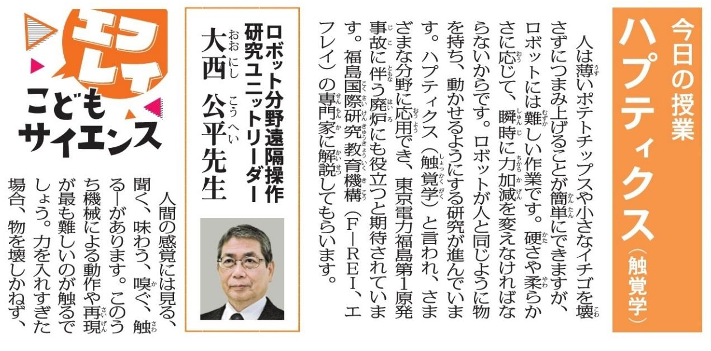

## 町 加減 ロ や のプロ L H

| 人が操作(手元側) | 数メートルから | ロボットは人と |
| --- | --- | --- |
| 数百キロメートル |  | 同じ動作(遠隔側) |
| AJ |  |  |
| デバイス/ | BREADE |  |
| コントロールチップ |  |  |
| ロボットの感触が人に伝わる |  |  |
| 遠隔側のロボットが触った感覚を手元側で鮮明に感じることができる |  |  |

に 連の動 月22 権で同

> 研究と 応大理三

 石など UHイズ 配 の 

飛び旅 さす ア国志 ○

