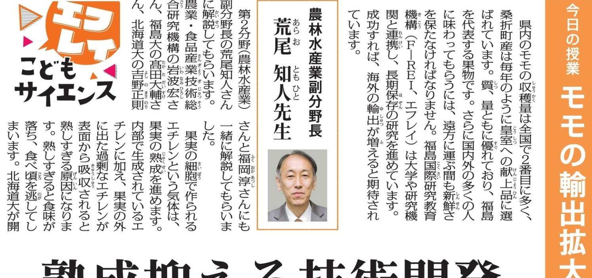

## 熟成抑える技術開発 エチレ 2CO2+2H2O C2H4+302 退大は民間 ら分解 方又を水 サイト

た県内の手

さるの動画で

駅とした

シリカ (二酸化ケイ素)

どこに研究を辞 出なくなん 業 · 食品産 ーズン いって 切究機構と目 らめのおだ いら悟になっ どんせみ 校卒向 す。加えて みついついつき のモザが近 ンを分解する を知える効 和4)年度の輪 り配置を軽 果肉分硬。 スできまし です。 この つい パートリー 保存技術 の発生量 障局のモデ NISHA

