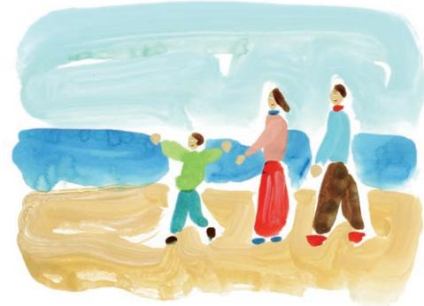

#### **福島国際研究教育機構(F-REI: エフレイ)**

**FukushimaInstituteforResearch, EducationandInnovation**

〒979-1521 福島県双葉郡浪江町大字権現堂字矢沢町6-1 ふれあいセンターなみえ内TEL: 0240-41-9970 | E-mail: madoguchi.h5x@f-rei.go.jp | https://www.f-rei.go.jp/

道の駅なみえ●

JR浪江駅

浪江町●

至いわき

6

## **世界の夢や希望となる**

福島・東北に生まれた復興への夢や希望が、世界の人々の夢や希望になる。これは、今からすこし先の、未来の話です。

福島県浜通り地域に活動の拠点をおくF-REI(エフレイ)。ここには、福島ならではの研究開発や、福島にしかない実証フィールドなど、福島という地に魅力を感じた研究者や起業家たちが集い、イノベーションの創出に向けて、世界トップ水準の研究に取り組んでいます。 森林や田畑は、ロボットやドローンによって人々が大変な作業をすることなく適切に管理されています。管理が行き届いた森林はたくさんの水を蓄え、その水が山から地下水となって川へゆっくり流れ出ます。流れ出す水が農地をうるおし、ゆたかな農産物を育みます。 F-REIの研究から生まれた成果は、新しい産業を生み出すとともに、これまでに地域に根付いた企業やベンチャー企業などの起業家と結びつくことで、新たな成長産業を生み出していきます。そして、その環境に惹かれて、さらに多くの人々がこの地に定着し、笑顔と賑わいに溢れています。こうした福島・東北の未来の姿は、震災からの復興のシンボルとして、世界中の人々の夢や希望になっていることでしょう。

こうした未来は、すぐには実現できないかもしれませんが、私たちの挑戦は始まっており、これからも復興の先を見据えて挑戦を続けていきます。

*FukushimaInstituteforResearch, EducationandInnovation*

# 福島国際研究教育機構

F-REIは、「福島復興再生特別措置法」という法律に基づいて、2023年4月に国が設立した特別な法人です。福島県浜通りの浪江町 (なみえまち)に本部を置き、浜通り地域を中心とした広域にわたるフィールドを活動の拠点として、世界でここにしかない研究・実証・社会実装の場をつくろうとしています。

#### **創造的復興の中核拠点**

F-REIは、福島をはじめ東北の復興を実現するための夢や希望となることを目指して誕生しました。福島の課題に立ち向かい、復興への道とその先の未来を切り拓くためには、産業や社会のしくみを転換できるイノベーションが必要で、そのイノベーションの創出には、将来を見据えた研究開発が不可欠です。

F-REIは研究者たちが国内外に誇れる研究開発に取り組めるように世界水準の環境を整え、研究から生まれた成果を福島・東北の復興に結びつけていきます。さらに、その効果を広く波及させ、日本の「科学技術力」と「産業競争力」を世界トップレベルへと牽引することにより、福島から世界へ、復興の取組を日本の成長へ、つなげていきます。

#### **4つの機能**

F-REIには大きく4つの機能があり、まず起点となるのが**「研究開発」**です。福島の優位性を発揮できる研究分野を見定め、世界トップ水準の研究開発を実施していきます。2つ目は、**「産業化」**。研究から生まれた成果を社会へ実装し、イノベーションや地域の新たな

産業を創出します。3つ目は、**「人材育成」**。 F-REIの事業をとおして若手研究者や企業の専門人材を育成するとともに、地域の子どもたちへの教育活動をとおして次世代を担う人材を育みます。そして4つ目は**「司令塔」**と呼ばれる機能です。創造的復興の中核を担う拠点として、復興に向けた関係機関のさまざまな活動を横串でつなぎ、大きな推進力を生み出します。

(くわしくはP7-8でご紹介します)

#### **5つの研究分野**

世界でも類を見ない複合的な災害を経験した福島だからこそ、優位性を発揮できる研究があります。**「ロボット」「農林水産業」 「エネルギー」「放射線科学・創薬医療、**

**放射線の産業利用」「原子力災害に関するデータや知見の集積・発信」**。F-REIはこの5つを研究分野として定め、世界トップ水準の研究開発を実施していきます。 (くわしくはP9-10でご紹介します)

### **広い地域とつながり、効果を広げる**

福島・東北では、復興に向けた活動がさまざまなかたちで紡がれてきました。福島イノベーション・コースト構想の取組など、これまでの活動を大切にしながら、F-REIがそれらをさらに発展させ、横串となって広域連携を進めることで、研究開発の成果を広く波及させ、復興の先に生まれる未来を、日本全国へ、そして世界へと広げていきます。 (P13で主な関係機関の施設をご紹介します)

# **世界で最も先端的で、最もひらかれた場所をめざして。**

F-REIの初代理事長という任を拝命することは、私にとって大きな決断でした。その覚悟を決めるために、時間をかけて福島県浜通りを視察させてもらい、報道を通して伝わってくる復興の知らせと、現地の実状とのあいだに乖離があることが分かってきました。

地域外への避難が長く続いたことなどから、人口減少や産業の担い手不足、広大な未活用地など、中長期的に取り組むべき課題が、ここにはまだまだ残されています。岸田内閣総理大臣から任命状をいただいた時、"身の引き締まる思い"というのはこういう時に使う言葉なのだなと改めて感じ、自分の残りの一生をぜんぶ懸けてもいいと決意しました。

我 々 はこれから福島・東北に根ざし、 「F-REIは面白いな」と思ってくれる仲間を国内外から集めて、世界トップ水準の研究開発に取り組んでいきます。まずはこの地域に環境をしっかりと整備して研究成果をあげることが第一歩ですが、その成果によって地域に産業が起こり、地域のなかに人材が育ち、ゆくゆくは地元出身の人たちが研究者や研究支援者となって活躍していく。そんな拠点づくりをめざしています。

研究施設も閉ざされた場所ではなく、敷地内で地元の人たちが犬と散歩をしていたり、子どもたちの実験教室がひらかれたり、研究者たちも積極的に外へ出て行って地域の人々と一緒になってまちづくりにかかわったり。ここに集う人たちの人生がゆたかな彩り

にあふれ、一人ひとりが「おらがエフレイ」と誇りをもって言える場所に育ってほしいと願っています。

そしてこれは、私の個人的な願いではありますが、例えばアメリカの人々が西海岸での暮らしを夢見るように、福島県浜通りがいつか、「常磐カリフォルニア」と呼ばれ、日本一住みたい地域として人々の憧れになってくれることを強く望んでいます。

「あの時F-REIが始まったから、今がある」。 未来を生きる人たちが、そんな風に思ってくれる活動をめざして、一つひとつ成果を積み上げ、福島・東北のため、日本のために貢献できるよう全身全霊で取り組んでまいります。皆様のご支援ご協力をお願い申し上げます。

**福島国際研究教育機構(F-REI)理事長山崎光悦(やまざき・こうえつ)**

富山県出身。1976年、金沢大学大学院工学研究科修士課程修了。1982年、工学博士(大阪大学)。材料力学や設計工学の研究者として、1994年に金沢大学工学部教授。理事・副学長を経て、2014年に金沢大学長就任。2022年、金沢大学特別顧問、復興庁参与。2023年から福島国際研究教育機構(F-REI)理事長(現任)。

# **F-REI 4つの機能**

# *1* **研究開発**

### **日本を代表する研究基盤をつくり、国内外に誇れる研究開発を進める**

福島ならではの優位性を発揮できる5つの研究分野において、世界トップ水準の研究開発を実施します。世界でも類を見ないほどの複合的な災害を経験した福島に、日本を代表する世界水準の研究拠点をつくりあげ、「創造的復興の中核拠点」として、福島・世界の課題の解決と産業創生につながる研究に取り組みます。

| 5つの研究分野 |
| --- |
| ロボット |
| 農林水産業 |
| エネルギー |
| 放射線科学・創薬医療、放射線の産業利用 |
| 原子力災害に関するデータや知見の集積・発信 |

### 分野ごとに方針を立て、社会課題の解決に資する、国内外に誇れる研究開発を実施する

# *2* **産業化**

#### **研究開発の成果を新しい産業の創出に結びつける**

研究開発から生まれた成果を、福島県浜通り地域を中心としたフィールドを活かして実証を行い、新しい産業の創出、そして福島・東北の復興に結びつけます 。企業や大学、関係機関と連携し、国や地方公共団体が取り組む産業化施策とも連携をはかります。

#### **産業化に向けた取組**

企業との共同研究などができる産学連携体制の構築広域なフィールドを活かした実証・社会実装戦略的な知的財産マネジメント方針の策定セミナー開催などを通じた企業・研究者との連携ネットワークの形成地域のシーズ・ニーズを把握するための市町村との対話の場など

研究開発の成果を社会実装し、イノベーションや新たな成長産業を生み出す

F-REIは、「研究開発」「産業化」「人材育成」「司令塔」という4つの機能を併せ持っています。そして、これらの機能を複合的に結びつけることで、福島・東北の課題を解決へ導くとともに、研究成果から生まれるイノベーションを活かして日本の産業競争力を世界最高水準に引き上げ、国内外に効果を波及させていきます。

# *3* **人材育成** *4* **司令塔**

### **地域や学校、企業とともに、次世代を担う人材を育てる**

F-REIが地域に根ざし、復興の先の未来に貢献していくために、次世代を担う若者や地域の子どもたちに向けた人材育成に取り組みます。大学院や大学・高等専門学校と連携した人材育成をはじめ、小中高生向けの特色ある実験教室やセミナーの実施、研究に必要な技術者の長期的な育成などを効果的に推進します。

#### **人材育成に向けた取組**

F-REIの持つ最先端の研究開発機能を通じた大学院生の研究指導地元高校生や高専生、大学生が最先端の研究開発を体験する実地研修小中学生向けの科学教育や出前授業を通じた未来の人材育成企業人材・社会人向けの専門教育やリカレント教育

研究開発や産業化を担い、長期にわたり復興をリードしていくF - REIの若手研究者を育成する体制を地元地域に構築する

### **関係機関の活動に横串を刺し、推進力と波及効果を生み出す**

これまで福島・東北で先行的に進められてきた復興に向けた活動を大切にしながら、F-REIが関係機関の連携を推進する役割を担うことで、大きな推進力を生み出します。新産業創出等研究開発協議会(F-REI協議会)を組織して、F-REI設置の効果が広域的に広がるように、協議会を運営していきます。

**司令塔としての主な役割**

F-REI協議会の組織・運営大学や高専、自治体や企業との連携協力施設の統合などによる研究開発体制の全体最適化福島県内にある既存施設の連携推進の調整

など

#### など

「研究開発」「産業化」「人材育成」の機能を最大限に発揮できるように関係機関と連携し、復興への推進力と広域的な波及効果を生み出す

**F-REI 5つの研究分野**

福島の優位性を発揮できる5つの研究分野において、世界トップ水準の研究開発を実施していきます。さらに、分野を越えてそれぞれの研究成果を融合させ、発展させていくことで、「創造的復興の中核拠点」として、世界に誇れる研究開発をリードしていきます。

## *1* **ロボット**

### **過酷な環境でも活躍できる、ロボットやドローンをつくる**

複合災害を経験した福島で、廃炉や自然災害が発生した時の過酷な環境のもとで力を発揮できるロボットやドローンの研究開発を行います。耐放射線性や耐水性、耐熱性をそなえ、人が立ち入れない場所でも自律的・機動的に動作できるロボットや、水素を活用したクリーンで高性能なドローンなどの開発をめざします。

## *2* **農林水産業**

### **森林や田畑に再び息を吹きこみ、自然と産業を元気にする**

震災の後、大規模な休耕地や人の手が行き届かない山林が残る福島。ロボットによる農林水産作業の完全自動化・スマート化をはじめ、木質バイオマスのエネルギーや新素材としての活用など、多収益、大規模モデルの確立によって、自然と経済のゆたかな循環をめざします。

*3* **エネルギー**

## **カーボンニュートラルを地域で実現、持続可能なコミュニティを育む**

福島をカーボンニュートラル先駆けの地へ。再生可能エネルギーを中心に、水素エネルギーなどの製造から貯蔵、輸送、利用まで広く研究開発を行い、社会実装を目指してリスク評価や技術基準の策定に必要な研究にも取り組みます。植物や海藻類を活かしたCO₂の吸収・固定、水素社会に向けたスマートコミュニティの実現にも貢献していきます。

*4* **放射線科学・創薬医療、放射線の産業利用**

### **最先端のがん治療や農業・工業に放射線科学を活かす**

放射線科学を、複合災害からの創造的復興につながる研究基盤として据え、その利活用について検討を進めます。放射性同位体(RI)を医療に応用し、がん等の診断薬・治療薬の研究開発を行います。また、放射線やRIを農業や工業にも展開して、新たな技術の開発などに取り組みます。

*5* **原子力災害に関するデータや知見の集積・発信**

**福島だから得られるデータや知見を世界へ向けて発信する**

森林の植生や土壌など、放射能汚染からの回復にかかる環境動態の計測をはじめ、福島の地で得られるさまざまなデータを集積し、知見を伝承することで、今後の災害への対策につなげます。 さらに、社会科学的な知見も活かしながら災害に強い活気あるこれからのまちづくりに寄与していきます。

# **森林からつながる、資源の、ゆたかな循環。**

長引く避難生活や、産業の担い手不足によって、福島に残されていた広大な森林や田畑。すこし先の未来では、ロボットやドローンたちの活躍によって、再び活用されています。

ロボットが成長した樹木を伐採し、水素エネルギーで走行する自動運転のモビリティによって運ばれた木材は、新しい素材やエネルギーに、また農業用の肥料へ生まれ変わり、再生可能な資源として活かされています。森林は、適切に管理されることで、健全になり、小さな伱間が沢山ある保水力の高い土壌が作られます。すると、森に降った雨はこの土壌を通って地中深くに浸透し、蓄えられ、地下水となって川へゆっくり流れ出ます。この地下水は、農業にも利用され、また海へと流れ込みます。さらに、ドローンを活用した植林により森林に新たな生命を吹き込み、また適切な管理を行うことで木々を育て、再び成長した樹木が活用されることで、「伐って、使って、植えて、育てる」という資源の循環利用が広がっていきます。

さらに、このような資源の循環は福島だけでなく、豊富な森林をもつ日本では、さまざまな地域で取り入れることができるため、再生資源大国への道を拓くことができます。

# **「放射線」を理解し、福島の経験を活かす。**

原子力災害に見舞われた福島だからこそ、できること、そしてやるべきことがあります。「放射線」を正しく理解して有効に活用することや、この経験から得られた知見を未来へとつなげていくことがF-REIの役割の一つです。「放射線」をうまく使いこなすことで、現代の医療では治すのが難しい病気を治せるようにしたり、果物や野菜などの農産物の生育のしくみを明らかにして、今よりおいしい農産物を作れるようにしたり、さまざまな形で人々のウェルビーイングな暮らしの実現に貢献していきます。

さらに、福島が、どのように複合的な災害からの復興を遂げていくのか。その道のりを記録し、発信していくことは、世界の人々にとって大きな学びにつながります。放射性物質による汚染からの回復など自然科学的なデータはもちろん、地域のコミュニティがどのように再生と発展に取り組んでいくのかという社会科学的な知見も、これからの未来を生きる人たちにとって大きな財産となっていきます。

### **主な関係機関の施設**

福島イノベーション・コースト構想による福島ロボットテストフィールドや福島水素エネルギー研究フィールドの取組など、福島ではこれまでも、復興の先を見据えた先行的な研究開発が進められてきました。F-REIはその中核拠点として、F-REI協議会を設置するなど、関係機関の施設と綿密な連携をはかり、取組の効果を全国へと広域的に波及させていきます。

**福島国際研究教育機構(F-REI)** 主な研究施設等大学・高校等その他施設等 ※JAEA:日本原子力研究開発機構

2023年4月に発足したF-REIは、2030年3月までの7年間にわたる第1期中期計画を定めています。研究代表者を中心とした「研究開発」の体制づくり、施設の整備などを進めるとともに、企業との共同研究や創業支援などの「産業化」機能、そして、連携大学院や次世代を担う若者に向けたセミナーなどを通して「人材育成」機能を発揮し、中長期を見据えて活動を発展させていきます。

**施設基本計画**

※現時点での想定であり、今後の詳細検討等に伴い変更する可能性がある。

2024年現在、F-REIは福島県浪江町にある「ふれあいセンターなみえ」の一部を借用し、活動しています。今後、国が2030年度末までを目標に、浪江駅の西側に施設を整備する予定です。

