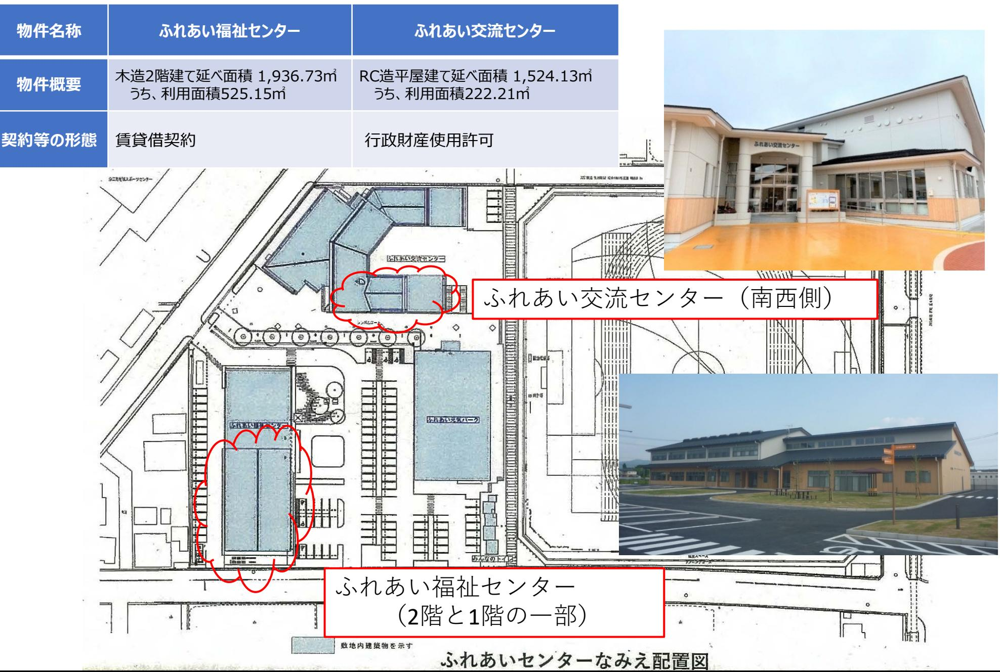
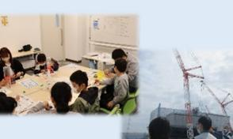

# **F-REIの事業紹介**

## ~未来を拓く科学技術力・産業競争力の拠点を目指して~

2024年12月16日

## **福島国際研究教育機構(F-REI)(令和5年4月1日設立)の概要**

# **研究開発の進捗状況と見通し**

## **<研究実施体制>**

### 【今後の取組】

・令和6年度以降は、外部委託等による研究開発について、その進捗状況及び成果を踏まえて統廃合しつつ、段階的に直営の研究グループによる研究体制に移行予定。

・クロスアポイントメントを積極的に活用しつつ、国内外の優秀な研究者をPIとして選考又は公募により採用する方針。 (現行の委託研究とは別テーマの研究も開始予定。)

# **F-REI本部について**

# **立地予定地の概況**

「ふれあい福祉センター」、「ふれあい交流センター」の一部を借用。

# **福島国際研究教育機構(F-REI)の組織体制について**

# **国際アドバイザー**

#### **概要**

国際アドバイザーは、理事長の求めに応じて、機構の業務について国際的ネットワーク形成、国際的プレゼンス向上、その他の国際的観点から助言するもの。

| (アルファベット順) |  |  |  |
| --- | --- | --- | --- |
|  | スヴァンテ・リンドクヴィスト | スヴァンテ・リンドクヴィスト博士は、科学技術史学の国際的に著名な研究者で、スウェーデン王 |  |
|  |  | 立アカデミー会長(2009-2012)や、スウェーデン王宮府長官(2010-2018)を務めました。ま |  |
|  |  | たスウェーデンのストックホルムにノーベル博物館を創設し、初代館長を11年間にわたり務めまし |  |
|  | 博士 | た。日本とスウェーデンの学術交流にも大きく寄与しており、日本学士院客員も務めています。 |  |
|  | ライムント・ | ライムント・ノイゲバウアー博士は、ドイツに拠点を置き世界をリードする応用研究機関であるフラウンホーファー研究機構の理事長(2012-2023)を務めました。 |  |
|  | ノイゲバウアー | ノイゲバウアー博士はドレスデン工科大学で機械工学を学び、フラウンホーファー工作機械・成 |  |
|  |  | 形技術研究所長(1994-2012)やケムニッツ工科大学(TUChemnitz)工作機械・ |  |
|  | 博士 | 生産過程研究所所長(2000-2012)を務めました。 |  |
|  |  | ノイゲバウアー博士は、2022年からドイツ首相未来評議会委員を務めています。 |  |
|  | フィオナ・ | フィオナ・レイモン博士は原子力分野において30年間にわたり戦略的・運用上の貢献をしてき |  |
|  |  | ました。化学・工学の専門家として英王立工学アカデミー、英王立化学協会、及び英国立原 |  |
|  | レイモン | 子力研究所のフェローを務めています。国際原子力会議において、定期的に基調講演を行っ |  |
|  |  | ているほか、経済協力開発機構/原子力機関(OECD/NEA)運営委員会副議長も務めてい |  |
|  | 博士 | ます。また、科学における参加の多様性拡大を長年支援し、原子力分野における女性や障 |  |
|  |  | 害者などの参加の取組を先導しています。 |  |
|  | スブラ・ | スブラ・スレッシュ博士は、材料科学・工学、機械工学、生物工学及び健康科学技術の分野 |  |
|  |  | における国際的に著名な研究者であり、米国国立科学財団(NSF)の長官(2010- |  |
|  | スレッシュ | 2013)を務めました。スレッシュ博士のリーダーシップの下、NSFのプログラムやイニシアチヴによ |  |
|  |  | り、米国は科学・工学の最先端にあって、次世代の科学者・工学者を育成し、経済成長とイ |  |
|  | 博士 | ノベーションを進展させました。また、スレッシュ博士はカーネギーメロン大学学長(2013- |  |
|  |  | 2017)及び南洋工科大学学長(2018-2022)を歴任しました。 | 7 |

# **アドバイザリーボード**

### **概要**

アドバイザリーボードは、F-REIが委嘱したアドバイザーより、大所・高所からの助言等をいただき、F-REIの運営や各研究開発等の参考とするもの。

| アドバイザー | 実施状況 |
| --- | --- |
| 4名のアドバイザーを2023年7月に委嘱(任期2年) | 令和5年10月13日第1回アドバイザリーボード(於:東京) |
| 石村和彦(いしむらかずひこ) | 令和6年2月21日第2回アドバイザリーボード(於:浪江町) |
|  | 令和6年7月23日第3回アドバイザリーボード(於:東京) |
| 産業技術総合研究所理事長 |  |
|  | 直近の概要 |
| 永田恭介(ながたきょうすけ) | 令和6年7月23日第3回アドバイザリーボード(於:東京) |
| 筑波大学長 |  F-REIから最近の動向等についてご説明を行ったのち、研究5分野の方針等について、アドバイザーとの活発な意見交換を通じて有意 |
|  | 義なご助言をいただいた。 |
| 原山優子(はらやまゆうこ) |  |
| 東北大学名誉教授 |  |
| 山名元 (やまなはじむ) |  |
| 原子力損害賠償・廃炉等支援機構理事長 |  |

## **理事長特別顧問**

### **概要**

理事長特別顧問は、理事長の求めに応じて、機構の業務について、それぞれのご知見・ご経験に基づいた情報を助言するもの。

| (五十音順) |  |  |  |
| --- | --- | --- | --- |
|  |  | 1990 | ハーバード大学MBA(経営学修士)取得 |
|  |  | 1996 | マッキンゼー日本支社パートナー(役員) |
|  | なんばともこ | 1999 | 株式会社ディー・エヌ・エー設立、代表取締役社長(~2011) |
|  | 南場智子 | 2015~ | 横浜DeNAベイスターズ球団オーナー(~現在) |
|  |  | 2017~ | 株式会社ディー・エヌ・エー代表取締役会長(~現在) |
|  |  | 2021~ | 日本経済団体連合会副会長(~現在) |
|  |  | 1978 | 長崎大学医学部卒業 |
|  |  | 1990 | 長崎大学医学部附属原爆後障害医療研究施設教授 |
|  |  | 2011 | 福島県立医科大学副学長兼放射線医学県民健康管理センター長 |
|  |  |  | (同センター長~2013.3) |
|  | やましたしゅんいち山下俊一 | 2013 | 長崎大学理事・副学長(~2017.9) |
|  |  | 2018~ | 福島県立医科大学理事長特別補佐・副学長(〜現在) |
|  |  | 2019 | 量子科学技術研究開発機構高度被ばく医療センター長 |
|  |  |  | (~2021.3) |
|  |  | 2021 | 同機構量子生命・医学部門放射線医学研究所長(〜2023.3) |

# **分野長・副分野長**

10

### **概要**

分野長、副分野長は、各分野における研究開発を戦略的に推進していくため、各分野において専門的知見を有する外部の研究者を分野長及び副分野長として任命しているもの。

 分野長担当する分野における研究課題を具体化し、研究の進め方等に係る調整・管理を行い、また、将来のF-REIの研究グループの確保に向けた調整など、研究に関する総括的な業務を行う。

 副分野長副分野長は分野長を補佐し、また、分野長とは異なる専門的知見に基づく研究課題の調整等を行う。

| ロボット | 【分野長】野波けんぞう) | 健蔵(のなみ |  |
| --- | --- | --- | --- |
|  | 一般社団法人日本ドローンコンソーシアム会長 |  |  |
|  | 【副分野長】松野ふみとし) | 文俊(まつの |  |
|  | 大阪工業大学工学部電子情報システム工学科特任教授 |  |  |
| 農林水産業 | 【分野長】佐々木あきひろ) | 昭博(ささき |  |
|  | 東京農業大学総合研究所参与(客員教授) |  |  |
|  | 【副分野長】荒尾ともひと) | 知人(あらお |  |
|  | 元農業・食品産業技術総合研究機構中央農業研究センター所長 |  |  |
| エネルギー | 【分野長】矢部 | 彰(やべあきら) |  |
|  | 新エネルギー・産業技術総合開発機構技術戦略研究センター |  | フェロー |
|  | 【副分野長】秋田しらべ) | 調(あきた |  |
|  | 一般社団法人電力中央研究所名誉特別顧問 |  |  |
|  | 【副分野長】錦谷よしのり) | 禎範(にしきたに |  |
|  | 早稲田大学ナノライフ創新研究機構ナノテクノロジー研究所 |  | 招聘研究員 |
| 放射線科学・ | 【分野長】片岡かずのり) | 一則(かたおか |  |
|  | 公益財団法人川崎市産業振興財団ナノ医療イノベーションセンター長 |  |  |
|  | 【副分野長】山下しゅんいち) | 俊一(やました |  |
|  | 福島県立医科大学 | 副学長 |  |
| 創薬医療 | 【副分野長】茅野まさみち) | 政道(ちの |  |
|  | 量子科学技術研究開発機構 | 前理事 |  |
|  | 【副分野長】絹谷せいご) | 清剛(きぬや |  |
|  | 金沢大学副学長 |  |  |
| 原子力災害に関するデータや知 | 【副分野長】大原としまさ) | 利眞(おおはら |  |
| 見の集積・発信 | 一般社団法人日本環境衛生センターアジア大気汚染研究センター |  | 所長 |

# **ユニットリーダー**

| 分野 | ユニット名 | ユニットリーダー()は兼務先 |
| --- | --- | --- |
| ロボット分野 | 遠隔操作研究ユニット | 大西公平(慶應義塾大学特任教授) |
|  | 実際に触る感覚(力触覚)を伝送する | 東京大学大学院修了(工学博士) |
|  | 技術を活用し、過酷環境において、実 | 慶應義塾大学理工学部にて教育と研究に従事 |
|  | 働に供与できる作業効率と信頼性を高 | 同大ハプティクス研究センターセンター長 |
|  | めた遠隔操作技術の研究開発を行う | 同大新川崎先端研究教育連携スクエア特任教授 |
|  | 自律化・知能化・群制御研究ユニット | 富塚誠義(カリフォルニア大学バークレー校教授) |
|  | ロボットの自律性を高度化するため、 | 慶應義塾大学大学院修士課程修了 |
|  | AI等を用いた知能化、複数のロボッ | マサチューセッツ工科大学にてPhD(工学博士)を取得 |
|  | トを協調的に制御する技術の研究開発 | カリフォルニア大学バークレー校にて教育と |
|  | を行う | 研究に従事 |
|  | 燃料電池システム研究ユニット | 飯山明裕(山梨大学特任教授) |
|  | 長時間飛行・高ペイロードを実現し、 | 東京大学大学院修了(工学博士) |
|  | かつカーボンニュートラルの実現にも | 日産自動車株式会社総合研究所燃料電池研究所長 |
|  | 貢献する、燃料電池システムを用いた | として燃料電池の開発に従事 |
|  | 小型ドローンの研究開発を行う | 現在は山梨大学大学院総合研究部工学域物質科学系 |
|  |  | (水素・燃料電池ナノ材料研究センター)特任教授 |
|  |  | として教育と研究に従事 |
|  |  | 同大水素・燃料電池ナノ材料研究センター長 |
| 農林水産業分野 | 土壌・植物マルチダイナミクス研究ユ | 二瓶直登(福島大学教授) |
|  | ニット |  |
|  | 土壌環境と植物栄養の相互の影響を多 | 東北大学大学院博士前期課程修了 |
|  | 面的に探求し、作物の収量拡大と農業 | 福島県農業総合センターに勤務し、東京大学 |
|  | の継続性向上を実現する | 大学院農学生命科学研究科修了(農学博士) |
|  |  | 現在は福島大学食農学類にて教育と研究に従事 |

※ユニットリーダーの下にユニットサブリーダー、研究員等を今後配置予定 11

| 分野 | ユニット名 | ユニットリーダー()は兼務先 |
| --- | --- | --- |
| エネルギー分野 | 水素エネルギーシステム安全科学ユ | 迫田直也(九州大学大学院工学研究院機械工学部門准教授) |
|  | ニット |  |
|  | 地産地消の水素エネルギーシステムを | 慶應義塾大学大学院理工学研究科博士課程修了(博士(工学)) |
|  | 構築し、社会実装を目指すためのリス | 九州大学水素材料先端科学研究センター |
|  | ク評価を行うことにより、水素エネル | 物性研究部門長 |
|  | ギーシステムの安全確保に必要な研究 | 九州大学大学院工学研究院機械工学部門にて |
|  | 開発等を行う。 | 教育と研究に従事 |
| 放射線科学・ | 植物イメージング研究ユニット | 河地有木(量子科学技術研究開発機構上席研究員/プロジェ |
| 創薬医療分野 |  | クトリーダー) |
|  | 生体内の物質動態を捉えて植物の栄養 | 筑波大学大学院物理研究科修了(博士(理学)) |
|  | 生理の理解を深め、農作物の生産性向 | 国立循環器病センター研究所、日本原子力研 |
|  | 上・高付加価値化に資する放射線を活 | 究開発機構等を経て、現在は国立研究開発法 |
|  | 用したイメージング研究を展開する | 人量子科学技術研究開発機構にて量子バイオ |
|  |  | 基盤研究部のRIイメージングプロジェクトのリーダー |
|  | 放射線基盤技術開発ユニット | 高橋浩之(東京大学教授) |
|  | 新規の放射線検出、分析技術など、放 | 東京大学大学院工学系研究科修了(博士(工学)) |
|  | 射線の計測・イメージングの基盤技術 | 東京大学教授大学院工学系研究科附属総合研究 |
|  | を高度化し、独自性の高い技術を開発 | 機構プロジェクト部門にて教育と研究に従事 |
|  | する |  |
| 原子力災害に関 | 放射生態学ユニット | 青野辰雄(専任) |
| するデータ・知 | 放射性物質の植物や淡水魚等への移行 | 近畿大学大学院化学研究科修了(理学博士) |
| 見の集積・発信 | や蓄積に関する室内実証実験による現 | 国立研究開発法人量子科学技術研究開発機構 |
| 分野 | 象の理解を踏まえ、これらに関与する | 放射線総合研究所福島再生支援研究部にて |
|  | 因子の探索から、移行や蓄積量の低減 | 環境動態研究に従事 |
|  | 化の方策について検討を行う。 |  |

※ユニットリーダーの下にユニットサブリーダー、研究員等を今後配置予定 12

# **F-REIの骨太の方針**

## **政府文書等を踏まえつつ、F-REIとしての研究課題の設定に当たっての方針をまとめたもの**

# **【ビジョン】**

- F-REIは、福島をはじめ東北の復興を実現し、夢や希望となる創造的復興の中核拠点となって、世界水準の研究推進とその研究成果の社会実装・産業化をリードし、我が国の産業競争力を世界最高水準に引き上げ、経済成長と国民生活の向上に貢献する。その実現に向け、骨太の研究基本方針に基づく研究課題を推進する。
## **【全体方針】**

- 福島の複合災害からの創造的復興のフラグシップを掲げるF-REIの研究基盤として、放射線科学(核物理学、放射化学、放射線環境科学、核医学・創薬、電子デバイスなど)の利活用や放射能汚染環境の動態計測に関する研究課題を基盤に据えながら、ロボット・ドローン技術や次世代農林漁業及びクリーンエネルギーなど福島浜通りの産業創生を牽引する最先端研究を推進し、日本を代表する世界水準の研究拠点形成を目指す。
## **【分野毎の方針】と【具体的な研究課題例】**

(次頁以降に記載)

## **F-REI(福島)で研究開発を行う視点**

- 複合災害を経験した福島で、廃炉や自然災害時に起きる過酷環境で機能を発揮するロボット・ドローンの研究開発を行う。
## **分野の方針**

- 耐放射線性、耐水性、耐熱性などを備えた**高機動性**を有するロボットの開発、**自律制御、群制御**などを実現するための**知能化研究**、生物がもつ感覚機能などを高める機能拡張研究などを行う。それらの成果を活用して、廃炉や災害時、宇宙空間などの過酷環境下で稼働できる**高機動性ロボット**の開発、高ペイロードで長時間飛行が可能な**高機能ドローン**の開発、**自律移動型ロボット** の開発などを推進する。
## **具体的な研究課題例**

- 困難環境下でのロボット・ドローン活用促進に向けた研究開発
- 長時間飛行・高ペイロードを実現し、カーボンニュートラルを達成するドローンの研究開発
- フィールドロボット等の市場化・産業化に向けた性能評価手法の標準化
- 防災・災害のためのドローンのセンサ技術研究開発
- 廃炉向け遠隔技術高度化及び宇宙分野への応用

**困難環境の作業ロボット・ドローン(イメージ)**

## **F-REI(福島)で研究開発を行う視点**

- 震災により大規模な休耕地や山林を有する地域特性を考慮し、従来発想を超えた次世代農林水産業に挑戦する。従来発想を超えた新しい技術シーズの活用も行う。
## **分野の方針**

- 農林漁業**作業の完全自動化**・**ロボット化**・**スマート化**などによる超省力化・超効率化と、森林資源の有効活用などにより**多収益**・**大規模モデル確立**によって地域循環型経済モデルの構築を目指す。一方で、RIトレーサー活用による**品種改良**、**有機栽培**、 **汚染土壌改良**に関する基礎研究を推進する※。
## **具体的な研究課題例**

- 超省力的な土地利用型農業生産技術に向けた技術開発・実証
- 輸出対応型果樹生産技術の開発・実証
- 先端技術を活用した鳥獣被害対策システムの構築・実証
- 施設園芸におけるエネルギー循環利用技術体系の構築と実証
- 化学肥料・化学農薬に頼らない耕畜連携に資する技術の開発・実証
- 未利用農林業資源を活用した新素材の開発
- 福島浜通りの農林業復興の将来方向性に関する研究
- 林業のスマート化、自動化に関する研究この他、福島浜通り地域における研究開発、産業化、人材育成等を一体的に推進するため、民間団体等からの提案に基づいた研究開発を実施。

**小型トラクターの無人走行の様子**

**鳥獣による農作物被害**

## **F-REI(福島)で研究開発を行う視点**

- 既存の水素関連設備等を活用し、カーボンニュートラルを地域で実現する。合わせて先駆的なスマートコミュニティの実現に寄与する。
## **分野の方針**

- 福島を日本のカーボンニュートラル先駆けの地とするために、**再生可能エネルギー**を中心に、**エネルギー製造**、**貯蔵**、**輸送**、**利用**に関わる研究開発を行い、そのなかで社会実装を目指しての**リスク評価**、**法規制**、**技術基準の策定**なども課題とする。**水素・アンモニア**などを使ったエネルギー活用、**CO2回収**やエネルギー源としての利用などに関する研究を推進する。再生可能エネルギーの活用をベースとすることでカーボンニュートラル、さらにはネガティブエミッションが実現可能なことを実証し、その展開によりサステナブルな社会の実現に貢献する。
## **具体的な研究課題例**

- ネガティブエミッションを実現するコア技術開発早生かつCO2を大量吸収する植物生産技術、海藻類のCO2固定機能を活かしたブルーカーボン開発、その回収・貯留付きバイオマス発電(BECCS)
- バイオ統合型グリーンケミカル技術開発CO2還元能力の高い触媒開発,多収性植物・発酵微生物を組合わせた高効率CO2回収濃縮型バイオプロセス
- 水素社会の実現を目指した水素エネルギーネットワークの構築と実証再生可能エネルギーを利用した水素エネルギーを電力系統と連携して利用するためのシステム設計及び最先端材料開発技術の研究開発

<b>バイオ統合型グリーンケミカル技術(イメージ)

## **F-REI(福島)で研究開発を行う視点**

- 福島の複合災害からの創造的復興の研究基盤として、放射線科学(核物理学、放射化学、放射線環境科学、核医学・創薬、電子デバイスなど)を据え、その利活用の検討を行う。
## **分野の方針**

- ウエル・ビーイングへの貢献を目指して、**放射線利用**に関する基礎研究に加えて、**医療**のみならず農業、工業分野での**産業利用** を見据えた技術開発を推進する。医療分野では放射線トレーサーを利用した**診断技術の開発**や、放射線標識化合物による**がん標的薬の開発**、農業および工業分野では放射線を利用した**計測科学研究**と技術開発を推進する。
## **具体的な研究課題例**

- 医療や農業等の応用先を見据えた放射性核種の安定的かつ効率的な製造技術の開発
- RIを適切な場所(がん細胞など)に特異的に送達する化合物や技術(薬物送達システム(DDS: DrugDeliverySystem))の開発
- 農作物の生産性向上や安全な作物生産に資するRIイメージング技術の開発
- RIの活用を促進するためのフィージビリティ調査
- 超大型X線CTシステム技術の検討

**RIを利用した植物イメージング**

## **F-REI(福島)で研究開発を行う視点**

- 複合災害を経験した浜通りの創造的復興に資するために複合的な取り組みを行う。
- 新たな地域創成に資する自然科学と社会科学を研究の基盤とする。

## **分野の方針**

- 原子力災害の**被災地**において**自然環境**や**地域社会**について**調査**と**分析**を行い、地域の**安全性**を高めるための**科学的知見**の**蓄積**と**発信**を行う。あわせてF-REIの研究成果を活かして、地域の活性化と**コミュニティの合意形成を推進**することで、**人々が共生するレジリエントなまちづくりに貢献**する。
## **具体的な研究課題例**

- 放射性物質の環境動態研究
- 関連機関、地域に存在する関連データの集積とデータベース化
- 複合災害に関する社会科学的知見との融合による情報の高付加価値化
	- 環境影響評価、将来予測、防災のための伝承
- ワークショップや国際連携による提言と発信
- 地域と一体となった長期的復興・再生まちづくりへの展開

**原子力災害に関するデータや知見の集積・発信**

**F-REIの機能(産業化)**

**F-REIにおける研究開発を、福島をはじめ東北の復興に結び付けるためには、広く企業や関係機関を巻き込みながら、実用化や新産業創出に着実につなげていく。**

## **【昨年度までの取組】**

 **東邦銀行との包括連携協力(R6.1.25)** ・基本合意書に基づいて、互恵的な連携協力を進め、F-REIの認知度向

上、地元企業とのネットワーク構築、研究成果の社会実装などを推進する。

・㈱東邦銀行が持っている地元企業との強力なネットワークを活かし、まずは双方に関する情報発信を積極的に行い、長期的な観点では研究成果を踏まえた事業化を進めていくなど、F-REIの取組がより地元に貢献できるように取り組みたい。

## **産学官ネットワーク・セミナー(R5.10.12)**

東北の復興を見据え、東北の企業他を巻き込んだ産学官の連携体制構築の機会とするため、F-REIとの連携を含めた産学官連携や産業化について、トークセッション等を実施。

## **市町村座談会**

市町村座談会は、研究開発・産業化・人材育成の取組における広域連携体制の構築を図るため、市町村や住民、企業・団体等、多様な主体と対話する場として実施しているもの。令和5年度は浜通り地域等15市町村において実施。

## **【今年度以降の取組】**

## **産学官ネットワーク・セミナー**

実証研究の見通しなど研究内容を共有し、参画を希望する **企業等とのネットワークを構築** 等。(令和7年3月開催を想定)

### **市町村座談会**

#### 〇**浜通り地域 2回程度**

市町村別ではなく**テーマ別(ロボット・ドローン、農林水産業等)**での開催を想定。

・令和6年12月18日ロボット分野(南相馬市) ・令和6年度中農林水産業分野(予定)

#### 〇**中通り・会津地方 4回**

・令和6年 7月18日県中地域(郡山市) ・令和6年10月15日県北地域(福島市) ・令和6年11月18日会津地域(会津若松市) ・令和7年 2月 5日県南地域(白河市)

### **研究実証フィールドの確保、地域企業とのマッチング**

**・**他の地域ではできない実証等を可能とするため、大胆な規制緩和を推進し**未利用地等も活用しながら、実証フィールドを確保**する。

・企業誘致やビジネスマッチング、起業・創業支援などの取組とも連携して機構発ベンチャー企業等に限らず**企業等と緊密に連携して共同研究や技術移転等を実施**し、**産業集積の形成に向けた取組を推進**していく。 19

# **F-REI産学官ネットワーク・セミナー**

産学官ネットワークセミナーは、東北の復興を見据え、東北の企業他を巻き込んだ産学官の連携体制構築の機会とするため、F-REIとの連携を含めた産学官連携や産業化について、トークセッション等を実施するもの。

**第2回F-REI産学官ネットワークセミナーの概要**

〇主催:F-REI・東北経済連合会

- ○日時:令和5年10月12日(木)13:30~16:00
- ○会場:TKPガーデンシティ仙台ホール

○参加者:民間企業、団体、大学、地元自治体等より、76社等156名 〇実施内容: (うち、延べ23社等43名はオンライン参加)

## **・第一部講演**

産学官連携・産業化をテーマとして若生氏、海老原氏、小池氏を講師としてお招きし、沿革と現在の取り組みについて、御講演いただいた。

①若生裕俊富谷市長

- 「『住みたくなるまち日本一』を目指して
~100年間ひとが増え続けるまち村から町へ町から市へ~」

- ②海老原城一AiCTコンソーシアム代表理事 「スマートシティ会津若松の挑戦」
- ③小池美穂株式会社マテリアル・コンセプト代表取締役CEO 「ベンチャーにおける産学官連携の必要性」

## **・第二部トークセッション**

講師3名にF-REI江村理事を加え、佐々木モデレータの司会のもと、これからの産学官連携・産業化及びF-REIに対する期待について御議論いただいた。

~これからの産学官連携と産業化ビジョン、F-REIへの期待~

- 〇パネリスト:①若生市長
②海老原代表理事 ③小池代表取締役CEO ④江村克己F-REI理事

〇モデレータ:佐々木啓一宮城大学学長

【実施済み】 第1回:令和5年1月13日第2回:令和5年10月12日 **スケジュール**

山崎理事長開会挨拶

会場の様子

# **市町村座談会について**

市町村座談会は、研究開発・産業化・人材育成の取組における広域連携体制の構築を図るため、市町村や住民、企業・団体等、多様な主体と対話する場として実施しているもの。

令和6年度は、F-REI設置の効果を浜通り地域等だけではなく、復興に取り組む地域全体に広域的に波及させるため、浜通り地域等に加え、中通り、会津でも実施する。

| 座談会の概要 | 令和6年度開催予定 |
| --- | --- |
|  市町村長のほか、地域で活躍する人材や企業等との直接対話 |  浜通り地域等 2回程度 |
|  多様なシーズやニーズを把握するための現地視察や意見交換 | 市町村別ではなくテーマ別での開催を予定 |
|  | ・令和6年12月18日ロボット分野(南相馬市) |
|  | ・令和6年度中農林水産業分野(予定) |
| ー座談会のプログラム(例)ー |  |
|  |  中通り・会津 4回 |
| ・(F-REIの取組紹介を含めた)講演 | ・令和6年 7月18日県中地域(郡山市) |
| ・地域の関係者との座談会 |  |
|  | ・令和6年10月15日県北地域(福島市) |
| ・地域の先進的な企業等を現地視察、意見交換(2~3か所程度) | ・令和6年11月18日会津地域(会津若松市) |
|  | ・令和7年 2月 5日県南地域(白河市) |
| 令和5年度開催実績 |  |

| 令和5年6月20日 | いわき市 | 令和5年11月 |  | 6日 | 飯舘村 |
| --- | --- | --- | --- | --- | --- |
| 7月 5日 | 南相馬市 |  | 11月17日 |  | 楢葉町 |
| 7月27日 | 葛尾村 |  | 12月 | 4日 | 大熊町 |
| 8月 9日 | 浪江町 |  | 12月19日 |  | 相馬市 |
| 8月29日 | 田村市 | 令和6年 | 1月18日 |  | 川俣町 |
| 9月29日 | 広野町 |  | 1月30日 |  | 双葉町 |
| 10月11日 | 富岡町 |  |  |  |  |
| 10月17日 | 川内村 |  |  |  |  |
| 10月23日 | 新地町 |  |  |  |  |

# **F-REIの機能(人材育成)**

**イノベーションを創出し、新たな産業基盤の構築を通じて、立地地域等をはじめとする福島や東北の創造的復興を実現し、ひいては世界の課題解決を目指すために、立地地域等において様々な分野の研究者や技術者を育成する体制を構築する。**

## **【昨年度までの取組】**

## **F-REIトップセミナー**

福島県内の⼤学、⾼等専⾨学校、⾼等学校の学⽣・⽣徒を対象に、最先端の科学技術の魅⼒と可能性、学ぶことの重要性と未来をどう築くか、F-REIの役割と将来像などをテーマに、F-REIトップ陣によるセミナーを開催。 令和5年度は16回実施。

## **エフレイ・サイエンスラボ**

F-REIの研究者の指導の下、⾼専⽣の企画による ⼩中学⽣向けの学びの場を開催。(霧箱による放射線可視化と⾝の回りのものの放射線計測等の実験実習)(R6.1.8)

## **東北大学との連携大学院(連携講座)の設置**

 東北⼤学医学系研究科と放射⽣態学ユニット内への連携講座 (放射線環境⽣体医学連携講座)設置に関する協定を締結。 (R6.3.8)

## **その他**

 ・体験学習会(科学実験教室(R5.10.15)) ・専門教育・リカレント教育(現地訪問型研修(R6.3.28)) ・出前授業(福島高専(R5.10.26)、早稲田大学(R5.11.15))など

## **【今年度以降の取組】**

## **F-REIトップセミナー**

 **・継続して実施。**(福島大学(R6.5.13)、会津大学(R6.5.28)、福島工業高等専門学校(R6.6.10、11)、福島県立医科大学(R6.6.19))のF-REI協議会の構成機関について開催。併せて、県外版トップセミナーとして、山形大学(R6.10.17)で実施。

**・**県内高校向けには、F-REI研究者が**STEAM教育等の出前授業**をイノベ機構の事業を通じて実施中。(相馬高校(R6.7.2, 2件)、原町高校(R6.7.5)、磐城高校(R6.8.2)、小高産業技術高校(R6.11.18))。(10回程度)

### **連携大学院制度の拡充**

講座設置済みの**東北大(医学系)では、学生**

**受け入れ・指導に向け**募集中。今後、研究チームの編成状況に併せて、近隣のみならず**様々な大学との連携を目指し検討**を行っていく。

## **F-REIサイエンスラボ**

**小中学生の親子を対象**に、**「ドローンプログラミング教室**(WRSプレ大会の宣伝を兼ねる)**」**(R6.8.9)**と「親子でワクワク科学実験」**(R6.8.10)

**サマースクール**

高校・大学生を対象に、**将来の研究者となるための研究体験**を行うサマースクールについて、今年度は、他機関(JAXA、AIST、QST、OIST等)の実施状況調査等と一部試行を行う。

## **その他**

 ・専門人材教育:**地元企業の技術実装のための専門人材教育**を実施する。 ・その他、各種依頼に基づいた講演(Joshikai(R6.7.28))、出前授業等を実施予定。(福島医大(R6.7.10)、東北大学(R6.10.24)、福島高専(R6.11.7)、弘前大学 (R6.11.12)で出前講義を実施) 22

# **F-REIトップセミナー**

福島の創造的復興と発展を中長期的に支える地域の未来を担う若者世代等を対象とした人材育成の取組の一環として、新産業創出等研究開発協議会の4機関を対象に、F-REI役員が自らの経験を通じて研究者としてのやりがいなどを伝えるもの。

| トップセミナーの概要 | 実施対象 |  |
| --- | --- | --- |
| ○開催時期:令和6年5月~6月 | 〇実施対象: |  |
|  |  | 新産業創出等研究開発協議会の4機関 |
| ○講師:山崎光悦理事長ほかF-REIの役員 |  |  |
|  | スケジュール |  |
| 〇実施内容: | 【実施済み】 |  |
|  | 5月13日 | 福島大学 (江村理事) |
| 以下に関する講義を実施 | 5月30日 | 会津大学 (山崎理事長) |
| ➢自身の経験を通じた研究者としてのやりがい | 6月10日 | 福島工業高等専門学校① (森下監事) |
| ➢最先端の科学技術の魅力と可能性 | 6月11日 | 福島工業高等専門学校② (森下監事) |
|  | 6月19日 | 福島県立医科大学 (大和田執行役) |
| ➢学ぶことの重要性と未来をどう築くか |  |  |
| ➢F-REIの役割と将来像等 |  |  |

# **連携大学院制度を活用した人材育成の取組**

連携大学院制度は、大学と機構が協力し、機構における先端科学の研究開発機能を活用しながら学位を付与することで高度な専門知識や技術を持つ研究者を育成する制度。

### **これまでの取り組み**

- 令和6年3月8日に東北大学大学院医学系研究科と 「放射線環境生体医学連携講座」の設置に関する協定を締結。
### **連携講座の概要**

- 環境物質の生体影響に知見のある医療人材の育成・放射性物質を含む種々の環境物質が、人々の健康に与える影響とそのメカニズムの研究、さらに災害関連疾患の予防や治療にあたる医療人材を育成。
- 放射線や種々の環境物質と生体応答の関係の研究推進・発展
- ・研究シーズの発掘から信頼できるデータに基づいた一般市民の放射能への不安感の払しょく、そして復興へ。

## **F-REIサイエンスラボ**

小中学生やその親子を対象に、科学技術に触れる多様な機会(体験学習会)を提供し、地域の未来を担う若者世代の人材育成を図るため実施しているもの。

| WorldRobotSummit 2025 | エフレイ・QSTサイエンスラボ |  |
| --- | --- | --- |
| F-REIサイエンスラボ 「ドローンプログラミング教室」 | ╴夏休み応援企画、親子でワクワク科学実験╶ |  |
| ○目的:浜通り地域を中心とした小中学生を対象として、WRS2025F | ○目的:県内外の小学校4~6年生の親子を対象に、夏休みの思い出づく |  |
| REI過酷環境チャレンジにあわせて、体験型のロボティックス教育の機会を作 | りや自由研究に役立ててもらおうと、国立研究開発法人量子科学技術研究開 |  |
| り、ロボットエンジニア・研究者の楽しさを伝えるもの。今年度は科学技術、ロ | 発機構(QST)と共同で科学実験教室を開催。 |  |
| ボットエンジニア・研究者への興味を向上させるため、ドローンプログラミング教 | 後援:復興庁、文部科学省、福島県、福島県教育委員会、いわき市、いわき市教育委員会、 |  |
|  | 国立研究開発法人日本原子力研究開発機構(JAEA)、国立研究開発法人国立環境研究所(NIES) |  |
| 室を試行的に実施。 |  |  |
|  |  開催日:令和6年8月10日(土) |  |
|  開催日:令和6年8月9日(金) |  会場:福島工業高等専門学校(福島高専) |  |
|  会場:福島ロボットテストフィールド |  参加者:県内外の小学校4~6年生とその保護者33組(65名) |  |
|  参加者:小学生19名 |  指導者:福島高専生12名(科学コミュニケーター本田隆行氏がアテンド) |  |
|  内容: |  内容:ドローンのプログラミング、レゴでソーラーカー作り、 |  |
| <座学>ドローン活用用途、仕組み、構造、プログラミングに関する説明 | 霧箱作成と放射線の観察・測定実験 |  |
| <体験>プログラミング、ドローン操作体験 | ※保護者向けのサイエンストーク(座談会)も同時開催 |  |
|  |  | 25 |

# **F-REIの機能(司令塔)**

**F-REIのリーダーシップの下で、既存施設や大学等の各機関が福島において取り組む新たな産業の創出等に資する研究開発に関する計画等を持ち寄り、協議会での議論を通じて、研究開発力を結集するための目標やビジョンの共有を図る。**

## **【昨年度までの取組】**

### **F-REI協議会の組織・運営**

各WGでの議論・決定等を踏まえた、新産業創出等研究開発施策の実施に関する司令塔機能の発揮を図る。7府省庁、福島県、浜通り地域等15市町村、大学、研究機関等の35の構成員が参画。

・第1回協議会於:大熊町(R5.5.10) ・第1回広域連携WG於:楢葉町(R5.9.27) ・第1回研究開発等WG(オンライン)(R5.12.8) ・第2回協議会於:富岡町(R6.1.12)

### **連携協力に関する基本合意書等の締結**

研究開発等のF-REIのミッションを円滑に進めるとともに、F-REI設置の効果を広域的に波及させるため、研究開発・人材育成等における連携、双方の資源を有効的に活用した協働活動等、締結先に応じた協定を締結。令和5 年度は9つの機関と締結。

福島高専(R5.4.1)、福島県立医大(R5.4.5)、いわき市(R5.4.15)、福島大学(R5.5.17)、浪江町(R5.5.29)、会津大学(R5.5.30)、南相馬市(R5.9.1)、東邦銀行(R6.1.25)、東北大学(R6.3.8)

## **【今年度以降の取組】**

### **F-REI協議会の組織・運営**

第2回広域連携WG(R6.7.2)、第3回協議会(R6.8.5)を開催。

### **連携協力に関する基本合意書等の締結**

#### **今年度、新たに5件以上締結することを目指す**。

(東北をはじめ広く国内や海外の機関も含む)

・学校法人昌平黌(東日本国際大学等)(R6.6.7)と基本合意書を締結。 ・福島県・イノベ機構(R6.6.14)と三者包括連携協定をそれぞれ締結。 ・量子科学技術研究開発機構(QST)(R6.7.23)と包括協定を締結。 ・米国パシフィック・ノースウェスト国立研究所(PNNL)(R6.10.3)と連携及び協力に係る覚書を締結。

### **放射性物質の環境動態研究に関する統合**

・日本原子力研究開発機構(JAEA)廃炉環境国際共同研究センター(CLADS) ・国立環境研究所(NIES)福島地域協働研究拠点

⇒R7年4月の統合にむけて、基本協定等を締結。(R6.7.8)

## **福島ロボットテストフィールド(RTF)の統合**

ロボット分野を中心とするF-REIの研究開発、産業化、人材育成に関する機能をRTFに付加することにより、RTFの更なる発展・活用を目指す。

⇒R7年4月の統合にむけて、基本合意書を締結。(R6.6.14)

# **新産業創出等研究開発協議会(協議会)について**

### **協議会の概要**

- 福島復興再生特別措置法第109条の規定に基づき、新産業創出等研究開発等施策の実施に関し必要な協議を行うため、組織されたもの。
- 協議会等の議論を通じ、研究開発における役割分担の明確化や重複の排除等により、福島全体で最適な研究開発体制を構築するなど、既存施設等の取組に横串を刺す司令塔としての機能を最大限に発揮する。

| 協議会の組織 | 令和6年度開催実績 |
| --- | --- |
|  | 令和6年7月2日第2回広域連携WG(於:広野町) |
| 協議会 | 8月5日第3回協議会(於:双葉町) |
| ・各WGでの議論・決定等を踏まえた、新産業創出等研究開発施策 | 【第3回協議会概要】 |
| の実施に関する司令塔機能の発揮を図る | F-REIから令和6年度計画、活動状況及び研究開発等について報告した |
| ・7府省庁、福島県、浜通り地域等15市町村、大学、研究機関等 | 後、F-REIと一緒に進めていただけるような福島浜通り等地域の復興に資す |
| の35の構成員が参画 | る取組、イノベーションの創出に関する取組等について構成員による活発な意 |
|  | 見交換が行われた。 |
| 広域連携ワーキング | 令和5年度開催実績 |
| グループ(WG) | 令和5年5月10日第1回協議会(於:大熊町) |
| ・研究開発・産業化・人材育成の取組におけるF-REIを核とした | 令和5年9月27日第1回広域連携WG(於:楢葉町) |
| パートナーシップによる広域連携体制の構築を図る・福島県、浜通り地域等15の市町村等が参画 | 令和5年12月8日第1回研究開発等WG(オンライン) |
|  | 令和6年1月12日第2回協議会(於:富岡町) |
| 研究開発等ワーキング |  |
| グループ(WG) |  |
| ・研究開発等における諸課題についての議論を実施 |  |
| ・大学、研究機関等が参画 |  |

# **連携協力に関する基本合意書(MOU)等の締結**

研究開発等の機構のミッションを円滑に進めるとともに、機構設置の効果を広域的に波及させるため、福島や全国の大学、教育機関、研究機関、企業、市町村等との効果的な広域連携を進めることとし、基本合意書(MOU)や包括連携協定等を締結。

**連携協力に関する基本合意書等の概要**

### 〇内容

研究開発・人材育成等における連携、双方の資源を有効的に活用した協働活動等、締結先に応じた協定を締結。

〇締結先一覧

| 締結日 | 締結先 |
| --- | --- |
| 令和5年4月1日 | 福島高専 |
| 令和5年4月5日 | 福島県立医科大学 |
| 令和5年4月15日 | いわき市 |
| 令和5年5月17日 | 福島大学 |
| 令和5年5月29日 | 浪江町 |
| 令和5年5月30日 | 会津大学 |
| 令和5年9月1日 | 南相馬市 |
| 令和6年1月25日 | 株式会社東邦銀行 |
| 令和6年3月8日 | 東北大学 |
| 令和6年6月7日 | 学校法人昌平黌(東日本国際大学など) |
| 令和6年6月14日 | 福島県(福島ロボットテストフィールドの統合に関して) |
| 令和6年6月14日 | 福島県、福島イノベーション・コースト構想推進機構 |
| 令和6年7月8日 | 福島県、JAEA、NIES(環境創造センターにおける連携協力に関して) |
| 令和6年7月23日 | 量子科学技術研究開発機構 |
| 令和6年10月3日 | 米国パシフィック・ノースウェスト国立研究所(PNNL) |

福島県、イノベ機構との連携協力

PNNLとの連携協力

# **F-REI令和5年度委託研究**

#### 第一分野(ロボット)

フィールドロボット等の市場化・産業化に向けた性能評価手法の標準化事業

実施体制日刊工業新聞社

実施予定期間令和7年度まで(ただし実施期間中の各種評価等により変更があり得る)

困難環境の課題を解決する「空間エージェント網」の研究教育

実施体制空間エージェント網研究コンソーシアム(東北大学(代表機関)、情報通信研究機構、広島大学、筑波大学、制御システムセキュリティーセンター、大阪大学)

実施予定期間令和11年度まで(ただし実施期間中の各種評価等により変更があり得る)

アクティブ聴覚を備えた複数ロボット・ドローン協調による要救助者探索技術の構築

実施体制ドローン聴覚コンソーシアム(東京工業大学(代表機関)、熊本大学、産業技術総合研究所)

実施予定期間令和6年10月頃まで

ロボットスマートプログラミング環境を用いたロボット開発環境と人材育成に向けた研究

実施体制会津大学

実施予定期間令和11年度まで(ただし実施期間中の各種評価等により変更があり得る)

DXを加速させる革新的森林内飛行と3次元解析技術の確立

実施体制DXを加速させる革新的森林内飛行と3次元解析技術の確立コンソーシアム(千葉大学(代表機関)、日本分析センター)

実施予定期間令和11年度末まで(ただし実施期間中の各種評価等により変更があり得る)

環境放射能動態調査のための水中ロボットの開発とその応用に関する研究

実施体制福島大学

実施予定期間令和11年度まで(ただし実施期間中の各種評価等により変更があり得る)

### 第一分野(ロボット)

要救助者探査のためのロボット嗅覚の開発

実施体制嗅覚ロボットコンソーシアム(信州大学(代表機関)、千葉大学、慶應義塾大学)

実施予定期間令和6年度末まで

煙が充満した環境における熱画像からの三次元環境地図生成

- 実施体制大阪工業大学
実施予定期間令和6年6月末まで

高耐放射線(メガグレイ級)イメージセンサの研究開発

実施体制ラドハードSiC集積回路研究開発コンソーシアム(広島大学(代表機関)、産業技術総合研究所、量子科学技術研究開発機構)

実施予定期間令和9年度まで(ただし実施期間中の各種評価等により変更があり得る)

廃炉向け耐放射線性に優れたダイヤモンド半導体の要素技術開発

実施体制廃炉ロボット・宇宙用耐放射線ダイヤモンドデジタル集積回路の要素技術開発コンソーシアム(北海道大学(代表機関)、産業技術総合研究所、大熊ダイヤモンドデバイス株式会社、福島工業高等専門学校)

実施予定期間令和11年度まで(ただし実施期間中の各種評価等により変更があり得る)

#### 第二分野(農林水産業)

超省力的なPDCA型スマート稲作の体系化及び稲作の完全自動化に向けて開発が必要な技術の調査

- 実施体制超省力型スマート稲作体系化コンソーシアム(農業・食品産業技術総合研究機構(代表機関)、東京大学、ヤンマーアグリ株式会社、株式会社M2Mクラフト)
- 実施予定期間令和11年度まで(ただし実施期間中の各種評価等により変更があり得る)

高感度香気検知デバイス、光/音響センシング技術に基づく果実成分及び状態予測技術の開発

実施体制産業技術総合研究所

実施予定期間令和11年度まで(ただし実施期間中の各種評価等により変更があり得る)

果樹のスマート農業化と育成センサーの開発

実施体制スマート果樹栽培コンソーシアム(産業技術総合研究所(代表機関)、福島県農業総合センター)

実施予定期間令和11年度まで(ただし実施期間中の各種評価等により変更があり得る)

モモ及びナシに関する輸出対応型果樹生産技術の開発及び実証

- 実施体制果樹福島実証コンソーシアム(農業・食品産業技術総合研究機構(代表機関)、福島県農業総合センター、神奈川県農業技術センター、福島大学、京都大学、筑波大学)
実施予定期間令和11年度まで(ただし実施期間中の各種評価等により変更があり得る)

ICT利用による鳥獣モニタリング・被害低減の実現に関する技術開発

実施体制東京大学

実施予定期間令和6年度まで(ただし実施期間中の各種評価等により変更があり得る)

イノシシ捕獲を先端技術で高効率化する被害対策システムおよび超指向性超音波による野生動物の検知・サル撃退技術の構築・実証

実施体制先端技術を活用した鳥獣害対策コンソーシアム(農業・食品産業技術総合研究機構(代表機関)、兵庫県立大学、鳥羽商船高等専門学校、株式会社アイエスイー、東京工業大学、株式会社トレスバイオ研究所、三重県、福島県)

実施予定期間令和11年度まで(ただし実施期間中の各種評価等により変更があり得る)

#### 第二分野(農林水産業)

施設園芸等における再生可能エネルギーを活用した循環システムの構築

- 実施体制HCU施設園芸コンソーシアム(産業技術総合研究所(代表機関)、農業・食品産業技術総合研究機構、国際農林水産業研究センター、東京大学、株式会社水循環エンジニアリング、株式会社武田鉄工所)
実施予定期間令和11年度まで(ただし実施期間中の各種評価等により変更があり得る)

極端気象に適応する次世代型ハウス環境制御技術の開発

実施体制次世代型ハウス環境制御コンソーシアム(福島大学(代表機関)、岡山大学、岐阜大学、岩手県農業研究センター)

実施予定期間令和11年度まで(ただし実施期間中の各種評価等により変更があり得る)

大規模牧場を核とした耕畜連携のための技術開発及び実証

- 実施体制化学肥料・化学農薬に頼らない耕畜連携に資する技術の開発・実証のコンソーシアム(東北大学(代表機関)、福島大学、新潟大学、福島県、農研機構、産業技術総合研究所、全酪連酪農技術研究所)
実施予定期間令和11年度まで(ただし実施期間中の各種評価等により変更があり得る)

未利用資源等からのセルロース抽出の低コスト化とプラスチック代替素材の研究

- 実施体制未利用資源等からのセルロースの低コスト抽出とプラスチック代替新素材としての活用コンソーシアム(東北大学(代表機関)、福島大学、苫小牧工業高等専門学校、トレ食株式会社)
- 実施予定期間令和11年度まで(ただし実施期間中の各種評価等により変更があり得る)

福島浜通り地域等の農林水産業の未来デザイン

- 実施体制福島浜通り地域等の農林水産業の未来デザインコンソーシアム(福島大学(代表機関)、PwCコンサルティング合同会社)
実施予定期間令和7年度まで(ただし実施期間中の各種評価等により変更があり得る)

#### 第二分野(農林水産業)

土壌低分子有機物の植物栄養学的影響の解明

- 実施体制土壌低分子有機物の植物栄養学的影響の解明コンソーシアム(福島大学(代表機関)、理化学研究所、京都大学、東京大学、北海道大学、筑波大学、東北大学、東京農工大学)
- 実施予定期間令和11年度まで(ただし実施期間中の各種評価等により変更があり得る)

プラズマ農業技術の開発と福島県浜通りでの実装

- 実施体制プラズマ農業技術の開発と福島県浜通りでの実装コンソーシアム(東北大学(代表機関)、福島県農業総合センター浜地域農業再生研究センター)
- 実施予定期間令和11年度まで(ただし実施期間中の各種評価等により変更があり得る)

福島の果実の超貯蔵による新しい価値創造の実現

- 実施体制果実の超保存コンソーシアム(北海道大学(代表機関)、福島大学)
- 実施予定期間令和11年度まで(ただし実施期間中の各種評価等により変更があり得る)

福島から世界へ発信する新しいコンセプトの牛乳房炎ワクチンの開発

- 実施体制新コンセプト牛乳房炎ワクチンコンソーシアム(農業・食品産業技術総合研究機構(代表機関)、日本全薬工業株式会社、福島県)
- 実施予定期間令和11年度まで(ただし実施期間中の各種評価等により変更があり得る)

全自動無人林業システムの開発に向けた下刈り作業機械の遠隔自動運転システムの研究開発・実証

- 実施体制下刈機械自動化コンソーシアム(東京電機大学(代表機関)、株式会社ギガソーラー、株式会社東日本計算センター、遠野興産株式会社、株式会社エム・シー・エフ、福島県ハイテクプラザ、合同会社ビスペル、住友林業株式会社)
実施予定期間令和11年度まで(ただし実施期間中の各種評価等により変更があり得る)

#### 第三分野(エネルギー)

ソルガムに含まれる有用物質の活用やバイオブタノール製造の技術開発に関する研究

実施体制ソルガム利活用コンソーシアム(東北大学(代表機関)、三重大学、大阪公立大学)

実施予定期間令和11年度まで(ただし実施期間中の各種評価等により変更があり得る)

顕微授精法を用いた高効率CO2固定化植物の研究

実施体制交雑植物コンソーシアム (東京都立大学(代表機関)、鳥取大学、国際農林水産業研究センター、国立遺伝学研究所)

実施予定期間令和11年度まで(ただし実施期間中の各種評価等により変更があり得る)

水稲のCO2固定機能の高速評価手法等の開発

- 実施体制福島発ネガティブエミッション農業実現に向けた水稲のCO2固定機能強化技術の開発コンソーシアム(岡山大学(代表機関)、福島大学、東京農工大学、理化学研究所、山形大学、東北大学、東海国立大学機構)
実施予定期間令和11年度まで(ただし実施期間中の各種評価等により変更があり得る)

浜通り地域のバイオマス資源を活用したネガティブエミッション技術の実証研究

実施体制浜通り地域の資源を利活用した高効率・循環型ネガティブエミッション・地産地消システムコンソーシアム(福島大学(代表機関)、常磐共同火力株式会社)

実施予定期間令和11年度まで(ただし実施期間中の各種評価等により変更があり得る)

### 第三分野(エネルギー)

バイオエコノミーに対応した海藻類の大量養殖コア技術の研究開発と福島県沿岸における生産拠点形成の実証研究

- 実施体制海藻類の大量養殖コア技術研究開発コンソーシアム(理研食品株式会社(代表機関)、理化学研究所、長崎大学)
実施予定期間令和9年度まで(ただし実施期間中の各種評価等により変更があり得る)

大型藻類を介した「CCU技術」の開発と福島での社会実装に向けた研究

- 実施体制RebornFukushimaSeaコンソーシアム(三重大学(代表機関)、京都工芸繊維大学、京都大学、Bio-energy株式会社)
実施予定期間令和10年度まで(ただし実施期間中の各種評価等により変更があり得る)

ネガティブエミッションコア技術研究(海藻のメタン発酵の高度化、副生成物の活用)

- 実施体制浜通りブルーカーボンによるネガティブエミッションシステムの構築のためのコンソーシアム(東北大学(代表機関)、鹿島建設技術研究所)
- 実施予定期間令和11年度まで(ただし実施期間中の各種評価等により変更があり得る)

ゲノム編集による高効率CO2固定海藻の作出と海藻の多角的利用等に関する研究

- 実施体制 「バイオエコノミー創出を狙ったゲノム編集による海藻エリート株ならびに製鉄プロセス利用におけるBECCS相当技術の開発」共同研究機関(日本製鉄(代表機関)、金属系材料研究開発センター)
実施予定期間令和11年度まで(ただし実施期間中の各種評価等により変更があり得る)

バイオ統合型グリーンケミカルプロセスによるCO2資源化

実施体制東京大学

実施予定期間令和11年度まで(ただし実施期間中の各種評価等により変更があり得る)

福島浜通り地域における水素エネルギーネットワークモデル構築とモデル実現に向けた水電解水素製造システム開発

実施体制電力中央研究所

実施予定期間令和11年度まで(ただし実施期間中の各種評価等により変更があり得る)

カーボンニュートラルを実現する水素エネルギーネットワークの研究開発

- 実施体制CN水素コンソーシアム(東京大学(代表機関)、東北大学、京都大学)
実施予定期間令和11年度まで(ただし実施期間中の各種評価等により変更があり得る)

### 第四分野(放射線科学・創薬医療、放射線の産業利用)

加速器を活用した有用RIの製造技術開発

実施体制理化学研究所

実施予定期間令和11年度まで(ただし実施期間中の各種評価等により変更があり得る)

アスタチン安定供給に向けた製造技術の開発

実施体制福島県立医科大学

実施予定期間令和11年度まで(ただし実施期間中の各種評価等により変更があり得る)

大学・機関連携による有用RI製造技術開発

実施体制F-REIでのRI製造コンソーシアム(大阪大学(代表機関)、量子科学技術研究開発機構、東北大学、東京大学、新潟大学)

実施予定期間令和11年度まで(ただし実施期間中の各種評価等により変更があり得る)

RIを用いた革新的セラノスティクスの実現に向けた研究開発

実施体制アドバンストセラノスティクス共同研究機関(東京大学(代表機関)、理化学研究所、東京工業大学、千代田テクノル)

実施予定期間令和11年度まで(ただし実施期間中の各種評価等により変更があり得る)

福島復興を加速する多機関連携による放射性薬剤の研究開発

- 実施体制画期的なアルファ線核種標的治療薬の開発コンソーシアム(福島県立医科大学(代表機関)、大阪大学、量子科学技術研究開発機構)
- 実施予定期間令和11年度まで(ただし実施期間中の各種評価等により変更があり得る)

植物RIイメージング研究拠点の形成と応用研究の展開

- 実施体制植物RIイメージングコンソーシアム(量子科学技術研究開発機構(代表機関)、東京大学、筑波大学、東北大学サイクロトロン・ラジオアイソトープセンター、東海国立大学機構名古屋大学高等研究院及び名古屋大学アイソトープ総合センター、北海道大学、東京農業大学、近畿大学、高知大学IoP共創センター、株式会社プランテックス)
実施予定期間令和11年度まで(ただし実施期間中の各種評価等により変更があり得る)

超大型X線CT装置等を活用した産業のデジタル化技術の開発等に関する調査研究事業

実施体制サイバー・フィジカル・エンジニアリング技術研究組合

実施予定期間令和5年度末まで

#### 第五分野(原子力災害に関するデータや知見の集積・発信)

環境中の放射性物質の動態への人間活動の影響・移行抑制対策の効果の評価手法開発

実施体制日本原子力研究開発機構

実施予定期間令和6年度まで(ただし実施期間中の各種評価等により変更があり得る)

福島浜通り地域における復興・再生まちづくり研究

- 実施体制福島浜通り地域における復興・再生まちづくり研究コンソーシアム(東北大学(代表機関)、福島大学)
実施予定期間令和11年度まで(ただし実施期間中の各種評価等により変更があり得る)

世界の地域像をリードする福島浜通り地域のまちづくり実践研究

実施体制東京大学

実施予定期間令和11年度まで(ただし実施期間中の各種評価等により変更があり得る)

原子力災害を踏まえたまちづくりの課題と復興モデルに関する研究

実施体制福島工業高等専門学校

実施予定期間令和11年度まで(ただし実施期間中の各種評価等により変更があり得る)

コミュニティ&コミュニケーションの場の創出に関わる実践研究

- 実施体制コミュニティ&コミュニケーションの場の創出に関わる実践研究コンソーシアム(東京大学(代表機関)、公益財団法人福島イノベーション・コースト構想推進機構東日本大震災・原子力災害伝承館)
- 実施予定期間令和11年度まで(ただし実施期間中の各種評価等により変更があり得る)

課題解決型地域教育プログラムの開発・実装・発信に関わる実践研究

実施体制福島ラーニング・コミュニティハブ・コンソーシアム(宇都宮大学(代表機関)、福島工業高等専門学校)

実施予定期間令和11年度まで(ただし実施期間中の各種評価等により変更があり得る)

#### 第五分野(原子力災害に関するデータや知見の集積・発信)

原子力災害に関するデータや知見の集積・発信(原子力災害医療科学)

- 実施体制原子力災害医療科学分野における福島の知見の集積と国内外への情報発信コンソーシアム (国立大学法人長崎大学(代表機関)、国立大学法人福井大学、国立大学法人福島大学、公益財団法人福島イノベーション・コースト構想推進機構東日本大震災・原子力災害伝承館)
- 実施予定期間令和11年度まで(ただし実施期間中の各種評価等により変更があり得る)
- 原子力災害に関するデータや知見の集積・発信(子どもと親のメンタルヘルス)
- 実施体制福島学院大学
- 実施予定期間令和11年度まで(ただし実施期間中の各種評価等により変更があり得る)
- 原子力災害に関するデータや知見の集積・発信(大規模災害とデータサイエンス)
- 実施体制大規模災害とデータサイエンス研究コンソーシアム (国立大学法人東京大学(代表機関)、公益財団法人福島イノベーション・コースト構想推進機構東日本大震災・原子力災害伝承館、株式会社サーベイリサーチセンター)
- 実施予定期間令和11年度まで(ただし実施期間中の各種評価等により変更があり得る)
- 原子力災害に関するデータや知見の集積・発信(次世代甲状腺検査法および人材育成法の開発)
- 実施体制次世代甲状腺検査法および人材育成法の開発コンソーシアム (公立大学法人福島県立医科大学(代表機関)、国立大学法人山梨大学、国立大学法人長崎大学)
- 実施予定期間令和11年度まで(ただし実施期間中の各種評価等により変更があり得る)

原子力災害に関するデータや知見の集積・発信(放射性物質の魚類への取込・排出メカニズム)

- 実施体制原子力災害に関するデータや知見の集積・発信(放射性物質の魚類への取込・排出メカニズム)コンソーシアム (国立大学法人福島大学(代表機関)、国立大学法人京都大学、福島県(水産海洋研究センター、水産資源研究所、内水面水産試験場))
- 実施予定期間令和11年度まで(ただし実施期間中の各種評価等により変更があり得る)

# **F-REIを核とした浜通り地域等との広域連携による効果波及について**

### **(基本的考え方)**

- 福島国際研究教育機構の事業は、本施設の立地近接地域だけでなく、復興に取り組む地域全体(浜通り→福島県全域→被災地全体) にとって「創造的復興の中核拠点」として実感され、その効果はさらに全国へと**広域的に波及**するものでなければならない
- まずは、機構が取り組む5分野に関連する**既存の研究拠点や教育機関等のシーズ**だけでなく、地域における**機構への期待や具体的なニーズ**を、様々な**対話を通じて丁寧に把握**していく
- それを踏まえ、機構を核として、地域の市町村や住民、企業・団体等との間で様々な形の**パートナーシップで連携**することが重要
- **浜通り地域等を中心に、**機構の施設の中だけでなく、**施設の外も含めて広域的なキャンパスとしてとらえ、「世界でここにしかない多様な研究・実証・社会実装の場」を実現し、国際的に情報発信する**
- これにより、地域における産業の集積、人材の育成、暮らしやすいまちづくり等を進め、福島・東北の創造的復興、さらには日本創生を牽引するものとする

### **(機構を核としたパートナーシップによる事業展開のイメージ例)**

## 福島国際研究教育機構研究費令和6年度予算額 99億円(令和5年度予算額 126億円)

- 
- 
- 
- 

- 
- 

- 
- 

| ゾーン名 |  | 主な施設 |
| --- | --- | --- |
| 連携・交流ゾーン | 本部施設 | 管理・運営を担うための施設 |
|  | 本部機能支援施設 | F-REI関係者の研究活動・職務を支援するともに、F-REIの活動や研究成果を広報・展示するための施設 |
|  | 図書・情報施設 | 研究者等が文献調査を行うほか、研究データの保管等のためのサーバーを設置するための施設 |
|  | 講堂・ホール施設 | 研究成果の発表や人材育成のための講義、見学者等の来訪者への |
|  |  | 情報発信等を行うための施設 |
| 研究支援ゾーン | 短期宿泊施設 | 連携大学院制度による大学院生や共同研究等のためのボストドクター等が一時的に滞在するための施設 |
| 研究施設ゾーン1 | 研究実験施設 | F-REI研究者や共同研究者等が目常的に滞在し、研究活動を行う |
|  |  | ための施設 |
| 研究施設ゾーン2 | 固有実験施設 | F-REI研究者や共同研究者等が高度な研究活動を行うための施設 |
| - | その他 | 中央監視施設や廃棄物処理施設、受変電施設等を想定 |

