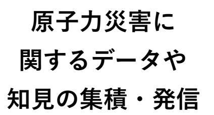
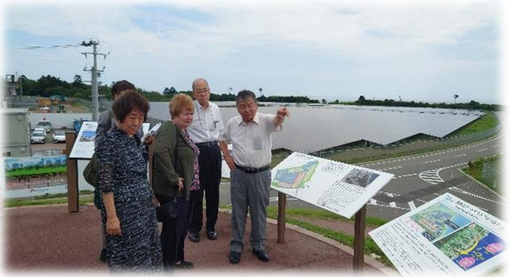
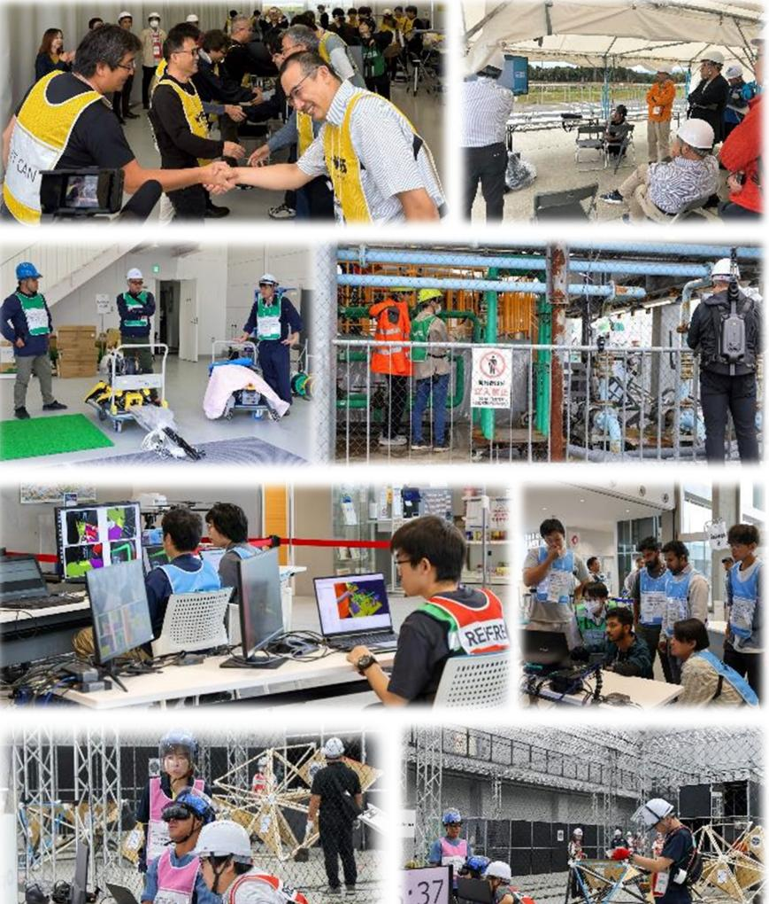

# **F-REIの最近の動き (令和6年4月~)**

#### 福島国際研究教育機構

FukushimaInstituteforResearch, EducationandInnovation (F-REI)

### **F-REI設立後の出来事(令和6年4月~6月)**

| 4月 1日 | 令和6年度の年度計画及び助成等業務実施計画を公表 | 5 |
| --- | --- | --- |
| 4月 1日 | 副分野長(放射線科学・創薬医療分野)の決定 | 6 |
| 4月25日 | 令和6年度研究公募(農林水産業分野)を開始 | 7 |
| 5月 1日 | 副分野長(原子力災害に関するデータや知見の集積・発信分野)の決定 | 8 |
| 5月13日 | F-REIトップセミナーの開催(福島大学) | 9 |
| 5月28日 | F-REIトップセミナーの開催(会津大学) | 10 |
| 6月 7日 | 学校法人昌平黌(東日本国際大学など)と基本合意書を締結 | 11 |
| 6月10日~11日 | F-REIトップセミナーの開催(福島工業高等専門学校) | 12 |
| 6月14日 | 福島県と福島ロボットテストフィールドの統合に関する基本合意書を締結 | 13 |
| 6月14日 | 福島イノベーション・コースト構想推進機構、福島県と包括連携協定を締結 | 14 |
| 6月19日 | F-REIトップセミナーの開催(福島県立医科大学) | 15 |

## **F-REI設立後の出来事(令和6年7月~8月)**

| 7月 2日 | 第2回広域連携ワーキンググループの開催 | 16 |
| --- | --- | --- |
| 7月 8日 | 福島県、JAEA、NIESと基本協定及び実施協定を締結 | 17 |
| 7月10日 | 出前講義の実施(福島県立医科大学) | 18 |
| 7月10日 | 国際アドバイザーとの意見交換を実施 | 19 |
| 7月18日 | F-REI市町村座談会の開催(県中地域) | 20 |
| 7月23日 | QSTと連携協力協定を締結 | 21 |
| 7月23日 | 第3回アドバイザリーボードの開催 | 22 |
| 7月25日~26日 | 国際アドバイザーとの意見交換を実施 | 23 |
| 7月27日~29日 | JoshikaiinFukushima 2024で特別講演を実施 | 24 |
| 7月2日~8月2日 | F-REI出前授業の開催 | 25 |
| 8月5日 | 第3回新産業創出等研究開発協議会の開催 | 26 |
| 8月9日 | ドローンプログラミング教室の開催 | 27 |
| 8月10日 | 夏休み応援企画、親子でワクワク科学実験の開催 | 28 |

## **F-REI設立後の出来事(令和6年9月以降)**

| 9月20日 | F-REIの調査事業の公募を開始 | 29 |
| --- | --- | --- |
| 10月3日 | 米国パシフィック・ノースウェスト国立研究所(PNNL)と覚書の署名式を実施 | 30 |
| 10月4日~5日 | WRS過酷環境F-REIチャレンジプレ大会を開催 | 31 |
| 10月15日 | F-REI市町村座談会の開催(県北地域) | 32 |
| 10月17日 | 第1回F-REI"春風秋霜"次世代スタートアップセミナーの開催 | 33 |
| 10月24日 | 出前講義の実施(東北大学) | 34 |
| 11月7日 | 出前授業の実施(福島工業高等専門学校) | 35 |
| 11月12日 | 出前講義の実施(弘前大学) | 36 |
| 11月18日 | 出前授業の実施(小高産業技術高校) | 37 |
| 11月18日 | F-REI市町村座談会の開催(会津・南会津地域) | 38 |
| 11月24日 | 国際アドバイザーとの意見交換を実施 | 39 |
| 11月25日 | F-REI・ICRP国際ワークショップを開催 | 40 |
| 12月2日 | 副分野長(放射線科学・創薬医療分野)の決定 | 41 |

#### **令和6年4月1日(月) 令和6年度の年度計画及び助成等業務実施計画を公表**

4月1日、福島復興再生特別措置法の規定に基づき、令和6年度の研究開発等業務の運営に関する計画(年度計画)及び助成等業務に係る実施計画(助成等業務実施計画)を公表しました。

中期目標で掲げられた「基盤づくりと存在感の提示」に向け、令和6年度における計画を達成できるよう、しっかりと取り組んでまいります。

○年度計画https://www.f-rei.go.jp/assets/contents/2024_annual_plan.pdf

○助成等業務実施計画https://www.frei.go.jp/assets/contents/Implementation_Plan_for_Grant_of_Subsidies_and_Other_Activities_2024.pdf

### **令和6年4月1日(月) 副分野長(放射線科学・創薬医療分野)の決定**

4月1日、分野長・副分野長に就任している9名に加え、新たに、放射線科学・創薬医療分野において専門的知見を有する外部の研究者1名に副分野長に就任いただくことといたしました。

- **・創薬医療**

【副分野長】**茅野政道**(ちのまさみち) 量子科学技術研究開発機構理事

#### **令和6年4月25日(月) 令和6年度研究公募(農林水産業分野)を開始**

4月25日、委託研究により実施する研究開発課題(農林水産業分野)について公募を開始しました。令和6年度においては、農林水産業のより高度なスマート化の実現により、労働力不足の解決を図る委託研究事業を実施します。

○公募テーマ令和6年度「福島国際研究教育機構における農林水産研究の推進」事業 (1)事業テーマ:土地利用型農業における超省力生産技術の技術開発・実証 (2)事業テーマ:林業の自動化に資する技術開発・実証(提案公募型募集)

○今後のスケジュール(予定)

- 
- 
- ・企画提案書受付締め切り 6月28日(金)

・公募開始 4月25日(木)

- ・公募説明会 5月 7日(火)
	-

#### **令和6年5月1日(水) 副分野長(原子力災害に関するデータや知見の集積・発信分野)の決定**

5月1日、分野長・副分野長に就任している10名に加え、新たに、原子力災害に関するデータや知見の集積・発信において専門的知見を有する外部の研究者1名に副分野長に就任いただくことといたしました。

| 【副分野長】大原利眞(おおはらとしまさ) |
| --- |
| 一般社団法人日本環境衛生センター |
| アジア大気汚染研究センター所長 |

#### **令和6年5月13日(月) F-REIトップセミナーの開催(福島大学)**

5月13日、今年度最初のトップセミナーを福島大学で開催しました。

江村理事が講師を務め、演題を「これからの社会とそこで活躍する人材を目指して~AIの進展や気候変動など変化の激しい時代を生き抜くために~」とし、修士課程(博士前期課程)の 1年生約100名を対象に行いました。

江村理事は、社会情勢と日本の立ち位置・課題について言及され、「これからの時代には、基板的な能力や人間力を磨く必要がある。自らのやりたいこと、実現したいことを見出し、学び続けることで役立つ人材であり続けてください。」と学生へメッセージを伝えていました。

#### **令和6年5月28日(火) F-REIトップセミナーの開催(会津大学)**

5月28日、今年度2回目のトップセミナーを会津大学で開催しました。

山崎理事長が講師を務め、演題を「コンピュータ理工学部の皆さんへ~これからどう過ごす?大学ライフのススメ~」とし、コンピュータ理工学部1年生約240名を対象に行いました。

山崎理事長は、「人よりも積極的にいろいろな経験を積み、フィールドワークやインターンシップ、留学などによって、未来のリーダーとなるために知恵と現場力を養うことが大切である。」と話されました。

#### **令和6年6月7日(金) 学校法人昌平黌(東日本国際大学など)と基本合意書を締結**

6月7日、学校法人昌平黌(東日本国際大学など)とF-REIとの連携協力に関する基本合意書を締結しました。

今後、この基本合意書に沿って、包括的な連携協力を進め、双方の資源を有効に用いるなど互恵的な連携協力を進めていきます。

また、当日は記念イベントとして、東日本国際大学生による報告会と、F-REI理事長講演会を開催しました。

#### **令和6年6月10日(月)~11日(火) F-REIトップセミナーの開催(福島工業高等専門学校)**

#### 6月10日、11日、トップセミナーを福島工業高等専門学校で開催しました。

森下監事が講師を務め、1日目は演題を「建築構造の振動制御研究」とし、電気電子システム工学科、都市システム工学科3年生約80名を対象に行いました。 2日目は演題を「ロボットの知能化~ChatGPT」とし、機械システム工学科、化学・バイオ工学科、ビジネスコミュニケーション学科3年生約120名を対象に行いました。

森下監事は、これまでご自身が携わってきた研究内容を紹介し、研究の楽しさを伝えるとともに、「今回の受講生の中からF-REIに加える研究者が出てくることを楽しみにしている。特定分野での最先端研究を進めて、一緒に福島復興を後押ししましょう。」と生徒へメッセージを送っていました。

#### **令和6年6月14日(金) 福島県と福島ロボットテストフィールドの統合に関する基本合意書を締結**

6月14日、福島県と福島ロボットテストフィールドの統合に関する基本合意書を締結しました。

本統合は、RTFのこれまでの機能及び成果をF-REIが継承するとともに、ロボット分野を中心とするF-REIの研究開発、産業化、人材育成に関する機能をRTFに付加することにより、RTFの更なる発展・活用を目指すために行われるものです(統合期日:令和7年4月1日)。

#### **令和6年6月14日(金) 福島イノベーション・コースト構想推進機構、福島県と包括連携協定を締結**

6月14日、F-REI、公益財団法人福島イノベーション・コースト構想推進機構、福島県の3者が包括連携協定を締結しました。

今後、この包括連携協定に沿って、互恵的な連携協力を進めていきます。

### **令和6年6月19日(水) F-REIトップセミナーの開催(福島県立医科大学)**

6月19日、トップセミナーを福島県立医科大学で開催しました。

大和田執行役が講師を務め、演題を「私の研究とF-REI(エフレイ)」とし、医学部3年生約 140名を対象に行いました。

大和田執行役は、ご自身の研究テーマ(脂質摂取と神経疾患の関連)の紹介やF-REIで進めている研究課題を説明し、「医学の進歩は研究とイノベーションによって生まれる」「是非F-REIの研究者を目指してほしい」と学生に話されました。

#### **令和6年7月2日(火) 第2回広域連携ワーキンググループの開催**

7月2日、第2回広域連携ワーキンググループ (WG)を広野町で開催いたしました。

WGには、復興庁、福島県、浜通り地域等 15市町村、福島イノベーション・コースト構想推進機構が参加し、会議では、F-REIから研究開発の進捗状況、産業化、人材育成等の取組を報告、福島県及びF-REIから市町村座談会について報告、各構成員から広域連携に関する取組について説明等があった後、意見交換を行いました。

#### **令和6年7月8日(月) 福島県、JAEA、NIESと基本協定及び実施協定を締結**

7月8日、福島県、JAEA、NIESと環境創造センターにおける連携協力に関する基本協定及び実施協定を締結しました。

本協定は、F-REI基本構想(令和4年3月29日復興推進会議決定) において、放射性物質の環境動態研究の一体的・総合的推進を図る観点から、JAEAとNIESとが三春施設において行っている環境動態研究をF-REIに統合するとされていたことに関する協定であり、4者が密接な連携の下で各機関の人材、知見等を活用することにより、環境創造センターにおける福島県の環境回復及び環境創造への取組を推進することを目的としています(統合期日:令和7年4月1日) 。

#### **令和6年7月10日(水) 出前講義の実施(福島県立医科大学)**

7月10日、福島県立医科大学の医学部1年生(韓国からの留学生を含む)133名に出前講義(会場:双葉町産業交流センター)を実施しました。

江村理事が講師を務め、演題を「福島の創造的復興を目指して ~F-REIの取り組みと福島県立医大医学部の皆さんへの期待~」として講義しました。

江村理事から「学び続けることで役立つ人材であり続けてほしい。将来さらに成長した皆さんにお目にかかるのを楽しみにしています!」と学生にエールを送りました。

#### **令和6年7月10日(水) 国際アドバイザーとの意見交換を実施**

7月10日、山崎理事長は、米国に拠点を置くF-REI国際アドバイザーのスブラ・スレッシュ博士を訪問しました。

山崎理事長からスレッシュ博士に対しF-REIの事業を説明し、理解を深めていただくとともに、F-REIを国際的な研究拠点にするための方途等について意見交換を実施しました。また、山崎理事長からスレッシュ博士に、今後の継続的な協力をお願いしました。

F-REIは引き続き国際アドバイザーから適切な助言を得つつ、国際化に向けた取り組みを進めてまいります。

#### **令和6年7月18日(木) F-REI市町村座談会の開催(県中地域)**

7月18日、F-REI市町村座談会(県中地域)を郡山市で開催しました。

本座談会は、6月14日に締結した「福島国際研究教育機構、福島イノベ構想推進機構及び福島県による包括連携協定」に基づき、福島県主催の「イノベ構想参画促進セミナー」と合同で開催したものです。 座談会では、山崎理事長から「F-REIの創造的復興への挑戦」をテーマに講演を行った後、県中地域の市町村、企業・団体等を代表する方々から「科学技術や産業で考える、ふくしま(県中地域)の未来」のテーマのもと多くの貴重なご意見をいただきました。

また、翌日は、デンソー福島(株)、ふくしま医療機器開発支援センター及び福島県林業研究センターを訪問し、視察及び意見交換を行いました。

#### **令和6年7月23日(火) QSTと連携協力協定を締結**

7月23日、国立研究開発法人量子科学技術研究開発機構(QST)とF-REIは連携協力に関する包括協定を締結しました。

今後、この協定に基づいて、互恵的な連携協力を進めていきます。

#### **令和6年7月23日(火) 第3回アドバイザリーボードの開催**

7月23日、今年度最初の開催となる第3回アドバイザリーボードを開催いたしました。

アドバイザリーボードには、石村和彦産業総合技術研究所理事長(オンライン)、永田恭介筑波大学長、原山優子東北大学名誉教授、山名元原子力損害賠償・廃炉等支援機構理事長のアドバイザー 4名と山崎理事長をはじめ、役員、執行役、分野長、副分野長等が出席しました。

初めに、F -REIに関する最近の動向等についてご説明を行ったのち、研究 5分野の方針等についてアドバイザーとの活発な意見交換を通じて有意義なご助言をいただきました。

#### **令和6年7月25日(木)~26日(金) 国際アドバイザーとの意見交換を実施**

7月25日、26日、国際アドバイザーのフィオナ・レイモン博士が来日し、F-REI本部で意見交換を行いました。

F-REI側からレイモン博士に対し、直近のF-REIの活動状況を説明し理解を深めていただくとともに、レイモン博士からは、英国における原子力分野での研究の状況やジェンダーバランスの実現の重要性等を講演いただきました。その後F-REIを国際的な研究拠点にするための方途等について活発な意見交換が行われました。

また、レイモン博士に福島ロボットテストフィールド、福島水素エネルギー研究フィールド等を視察いただき、地域に対する理解を深めていただきました。

#### **令和6年7月27日(土)~29日(月) JoshikaiinFukushima 2024で特別講演を実施**

7月27日~29日、原子力損害賠償・廃炉等支援機構 (NDF)の主催で、F-REIが後援、協力している「国際メンタリングワークショップJoshikaiinFukushima 2024」が双葉町で開催されました。

F-REI委託事業を担当している東京大学大学院農学生命科学研究科の小林奈通子准教授が、F-REI客員研究員(ゲストリサーチフェロー)として、ポスターセッションの発表などを行いました。また、28日(日)には、F-REIの山崎理事長が特別講演を実施しました。

参加された福島県内を中心とした理工系分野に関心のある女子高校生や海外の女子生徒は、理工系への進学や就職などのキャリア形成、将来への不安や悩みが解消され、より明るい未来をイメージできていたようでした。

#### **令和6年7月2日(火)~8月2日(金) F-REI出前授業の開催**

F-REIでは今年度から(公財)福島イノベーション・コースト構想推進機構と連携して高校生向けの出前授業を実施しています。

F-REIの分野長・副分野や研究者、各委託研究先の研究者が講師となり、将来、F-REIの研究者となり得る人材の裾野を広げることを目的として、地域の未来を担う若者世代に対して科学の楽しさを伝える活動をしています。

7月2日(火)相馬高校講師:荒尾副分野長

7月2日(火)相馬高校講師:金子純一准教授 (北海道大学)

7月5日(金)原町高校講師:大和田執行役

8月2日(金)磐城高校講師:大西ユニットリーダー

#### **令和6年8月5日(月) 第3回新産業創出等研究開発協議会の開催**

8月5日、第3回新産業創出等研究開発協議会を双葉町で開催しました。

会議では、平木大作復興副大臣にもご臨席いただき、F-REIからは令和6年度計画、活動状況及び研究開発等について報告した後、F-REIと一緒に進めていただけるような福島浜通り等地域の復興に資する取組、イノベーションの創出に関する取組等について構成員による活発な意見交換が行われました。

また、協議会終了後、開催地である双葉町による「双葉町の復興をけん引する中野地区復興産業拠点」 の現地視察が行われました。

#### **令和6年8月9日(金) ドローンプログラミング教室の開催**

8月9日、F-REIサイエンスラボドローンプログラミング教室を福島ロボットテストフィールドで開催しました。

今回、WorldRobotSummit (WRS)における人材育成の一環として行われたもので、当日は福島県内から19名の児童に参加いただき、ドローンの活用用途や空を飛ぶしくみ、構造、プログラミングについて学び、児童は自らプログラミングをして実際にドローンを飛ばしました。

初めは思うようにドローンを飛ばすことができなかった児童も、プログラミングを試行錯誤するうちに上手にドローンを飛行させることができていました。

#### **令和6年8月10日(土) 夏休み応援企画、親子でワクワク科学実験の開催**

8月10日、夏休み応援企画、親子でワクワク科学実験をいわき市(福島高専)で開催しました。

本企画は、対象を小学校4~6年生の親子とし、夏休みの思い出づくりや自由研究に役立ててもらおうと、国立研究開発法人量子科学技術研究開発機構(QST)と共同で開催したものです。

当日は親子70組(140名)以上からご応募いただき、抽選で選ばれた県内外33組(65名) の親子にご参加いただき、福島高専の学生さんや科学コミュニケーターの本田隆行さんと一緒に、ドローンのプログラミングやレゴでソーラーカー作り、霧箱作成と放射線の観察実験などを行いました。

#### **令和6年9月20日(金) F-REIの調査事業の公募を開始**

9月20日、令和6年度「放射線科学・創薬医療分野の研究開発を基盤とした分野横断的な取組に向けた可能性調査」事業の公募を開始しました。

本事業では、放射線科学・創薬医療分野における研究開発を、分野横断的な取組に発展させるなど、新たな視点で挑戦的な研究開発を拡充していくための可能性調査を実施します。

○今後のスケジュール(予定)

- ・募集期間:令和6年9月20日(金)~令和6年10月25日(金)
- ・契約候補者の選定審査:令和6年11月
- ・契約候補者の決定通知:令和6年11月~12月
- ・委託契約の締結:令和6年12月

#### **令和6年10月3日(木) 米国パシフィック・ノースウェスト国立研究所(PNNL)と覚書の署名式を実施**

10月3日、米国パシフィック・ノースウェスト国立研究所(PNNL)との連携及び協⼒に係る覚書の署名式を行いました。

また、署名式の際に、アシュビー研究所長(Dr. Ashby, LaboratoryDirector) からPNNLの事業紹介がありました。

その他、日本での滞在期間(9月30日~10月 3日)において、浜通り地域の施設(中間貯蔵施設、東京電力福島第一原子力発電所、福島ロボットテストフィールド、福島水素エネルギー研究フィールド(FH2R))を視察いただきました。

#### **令和6年10月4日(金)~5日(土) WRS過酷環境F-REIチャレンジプレ大会を開催**

10月4日と5日に、福島ロボットテストフィールド(南相馬市)で「WRS過酷環境F-REIチャレンジ」のプレ大会を開催しました。

「WRS過酷環境F-REIチャレンジ」は、災害対応に役立つロボットやドローン、プラントやトンネルの災害予防技術を開発促進するための国際競技会です。国内外のチームが技術力を競います。

プレ大会は、2025年10月に開催される「WRS2025 過酷環境F-REIチャレンジ(本大会)」に向けて、関係機関や地域の協力を得ることや、競技方式と審査ルールを確認することを目的に行われ、4つの競技が実施されました。

※令和6年度「新産業創出等研究開発事業(フィールドロボット等の市場化・産業化に向けた性能評価手法の標準化事業)」の一環として実施しました。

#### **令和6年10月15日(火) F-REI市町村座談会の開催(県北地域)**

10月15日、F-REI市町村座談会(県北地域)を福島市で開催しました。

本座談会は、福島県主催の「イノベ構想参画促進セミナー」と合同で開催したものです。 座談会では、山崎理事長から「F-REIの創造的復興への挑戦」と題し講演を行った後、県北地域の市町村、企業・団体等を代表する方々から「科学技術や産業で考える、ふくしま(県北地域)の未来」のテーマのもと多くの貴重なご意見をいただきました。

また、翌日は、福島県農業総合センター果樹研究所、北芝電機株式会社及び沖マイクロ技研株式会社を訪問し、視察及び意見交換を行いました。

#### **令和6年10月17日(木) 第1回F-REI"春風秋霜"次世代スタートアップセミナーの開催**

10月17日、第1回F-REI"春風秋霜"次世代スタートアップセミナーを山形大学で開催しました。

本セミナーは、トップセミナー同様に県外の大学生に向けて、F-REIの福島県外での知名度向上や未来を担う若者世代等を対象とした人材育成の取組の一環として、F-REIの役員等が講師となり、最先端の科学技術の魅力と可能性等を学生へ伝えるものです。

第1回は、山崎理事長が講師を務め、演題を「山形大学工学部高分子・有機材料工学科のみなさんへ ~これからどう過ごす?大学ライフのススメ~」とし、工学部高分子・有機材料工学科1年生約120名を対象に行いました。

山崎理事長は、大学生活の中で何を学び、どのように自己を磨いていくかについてのアドバイスをするとともに、自分自身の個性を意識し、教養を深め高い倫理観と人間基礎力を磨き人間力を向上させることの重要性やインターンシップや留学を通じて将来に必要な知識や実践力を身につけることの大切さなどを説きました。

#### **令和6年10月24日(木) 出前講義の実施(東北大学)**

10月24日、東北大学・川内キャンパスで、教育学部、法学部、経済学部、理学部、医学部、工学部の学生約80名に出前講義を実施しました。

大和田執行役が講師を務め、演題を「創造的復興の中核拠点F-REI」と題して、F-REIの紹介やご自身の専門分野について講義しました。

受講した学生からは「F-REIの名前は聞いたことはあるが、改めてF-REIの目指すべき姿や福島復興における役割を理解できた。」との感想が聞かれました。

#### **令和6年11月7日(木) 出前授業の実施(福島工業高等専門学校)**

11月7日、福島工業高等専門学校(福島高専)で、化学・バイオ工学科2年生約40名にキャリア教育に関する出前授業を実施しました。

本出前授業は、福島高専の取組であるキャリア教育に関する特別活動にF-REIから講師を派遣したものとなります。

中西監事が講師を務め、これまでの多彩なキャリアを積んできた経験と当時の社会背景を語る中で、女性として、また研究者として何を感じ、考えたのか、さらにその経験がどのように後のキャリアにつながったのかを振り返りました。 また、特に海外を経験することから得るものはとても大きなものであることや、放射線は通常見ることが出来ない多くのものを見ることが出来ること、それ以外にも放射線の性質を利用して出来るものが幅広くあることなどについてもお話ししました。

#### **令和6年11 月12日(火) 出前講義の実施(弘前大学)**

11 月12 日、弘前大学の学生約140名と青森県立田名部高校生 4名に出前講義をを実施しました。

本出前講義は、弘前大学の教養教育科目 「持続可能な開発目標SDGs -原子力災害の理解-」の一環として実施したものとなります。

西山総務部長が講師を務め、東日本大震災から13年が経って福島県浜通り地域の現状がどのようになっているのかや、F -REIの取組について紹介しました。

#### **令和6年11月18日(月) 出前授業の実施(小高産業技術高校)**

11月18日、小高産業技術高校で、産業革新科3 年生約20名に出前講義を実施しました。

矢部エネルギー分野長が講師を務め、「人間生活とエネルギー・環境への影響~2050年にカーボンニュートラルを実現し地球温暖化問題を克服するために~」をテーマとして、地球温暖化の原因、エネルギー技術・地球環境技術の全体俯瞰、カーボンニュートラルの実現に向けた技術開発などについて、最先端の研究内容も交えながら授業を展開しました。

矢部分野長は、「数十年かかっても実現させたい大きな目標を持ってコツコツと積み上げて努力して、実現してほしい」と生徒へメッセージを送りました。

### **令和6年11月18日(月) F-REI市町村座談会の開催(会津・南会津地域)**

11月18日、F-REI市町村座談会(会津・南会津地域)を会津若松市で開催しました。

本座談会は、福島県主催の「イノベ構想参画促進セミナー」と合同で開催したものです。 座談会では、山崎理事長から「F-REIの創造的復興への挑戦」と題し講演を行った後、会津・南会津地域の市町村、企業・団体等を代表する方々から「科学技術や産業で考える、ふくしま(会津・南会津地域)の未来」のテーマのもと多くの貴重なご意見をいただきました。

また、翌日は、マツモトプレシジョン株式会社、スマートシティAiCT及び福島県ハイテクプラザ会津若松技術支援センターを訪問し、視察及び意見交換を行いました。

#### **令和6年11 月24日(日) 国際アドバイザーとの意見交換を実施**

11 月24日、国際アドバイザーのライムント・ノイゲバウアー博士、スブラ・スレッシュ博士が来日し、F -REIの役員等と意見交換を行いました。

F-REI側から両博士に対し、直近のF -REIの活動状況を説明し理解を深めていただくとともに、ノイゲバウアー博士からは理事長を務めたフラウンホーファー研究機構でのイノベーションを進める取組について、スレッシュ博士からは米国国立科学財団(NSF)の長官や学長のキャリアを通じたご経験についてご講演いただきました。その後F -REIを国際的な研究拠点にするための方途等について活発な意見交換が行われました。

また、翌日は、浜通り地域の施設等を視察いただき、地域に対する理解を深めていただきました。

#### **令和6年11月25日(月) F-REI・ICRP国際ワークショップを開催**

11月25日、国際放射線防護委員会(ICRP)とともに、F-REI・ICRP国際ワークショップ「福島復興と放射線防護」を福島県いわき市で開催しました。

本ワークショップは、復興研究の促進や国際人材交流などを目的に開催しました。また、ICRP委員にF-REIや浜通りの復興状況を知っていただいたことで、本国や所属組織での広報効果が期待されます。

当日はオンライン参加者を含め約130名の参加を得ました。F-REIから福島復興に向けたF-REIの取り組みにつき講演し、ICRPから2名の専門家が放射線防護に関するICRP勧告につき講演しました。講演に引き続き、総合討論が実施されました。

### **令和6年12月2日(月) 副分野長(放射線科学・創薬医療分野)の決定**

12月2日、分野長・副分野長に就任している11名に加え、新たに、放射線科学・創薬医療分野において専門的知見を有する外部の研究者1名に副分野長に就任いただくことといたしました。

## **世界に冠たる 「創造的復興の中核拠点」へ**

