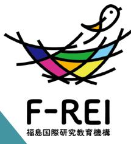

# **F-REIのこれまでの活動実績 (令和5年度)**

#### 福島国際研究教育機構

FukushimaInstituteforResearch, EducationandInnovation (F-REI)

## **F-REI設立後の出来事(令和5年4月)**

| 4月1日 | 福島国際研究教育機構設立 | 7 |
| --- | --- | --- |
| 4月1日 | 福島高専との基本合意書の締結 | 8 |
| 4月5日 | F-REI福島医大研究分室の開所式 | 9 |
| 4月5日 | 福島医大との基本合意書の締結 | 10 |
| 4月7日 | 中期計画及び助成等業務実施計画の認可 | 11 |
| 4月14日 | F-REI国際アドバイザーの決定 | 12 |
| 4月15日 | F-REIいわき出張所の開所式 | 13 |
| 4月15日 | いわき市との基本合意書の締結 | 14 |
| 4月15日 | F-REI設立記念シンポジウムの開催 | 15 |
| 4月19日 | ICRU国際シンポジウム開催 | 16 |
| 4月28日 | 令和5年度の年度計画及び助成等業務実施計画を公表 | 17 |

### **F-REI設立後の出来事(令和5年5月~6月)**

| 5月1日 | アドバイザリーボードのメンバーの決定 | 18 |
| --- | --- | --- |
| 5月8日 | 理事長特別顧問の決定 | 19 |
| 5月10日 | 第1回新産業創出等研究開発協議会の開催 | 20 |
| 5月17日 | 福島大学との基本合意書の締結 | 21 |
| 5月17日 | 第1回F-REIトップセミナーの開催(福島大学) | 22 |
| 5月26日 | 東北経済連合会産業経済委員会での講演 | 23 |
| 5月29日 | 浪江町との基本合意書の締結 | 24 |
| 5月30日 | 会津大学との基本合意書の締結 | 25 |
| 5月30日 | 第2回F-REIトップセミナーの開催(会津大学) | 26 |
| 6月13日 | 第3回F-REIトップセミナーの開催(相馬高校) | 27 |
| 6月20日 | 市町村座談会の開催(いわき市) | 28 |
| 6月30日 | 第4回F-REIトップセミナーの開催(会津学鳳高校・中学校) | 29 |

### **F-REI設立後の出来事(令和5年7月~8月)**

| 7月4日 | 第5回F-REIトップセミナーの開催(会津高校) | 30 |
| --- | --- | --- |
| 7月5日 | 市町村座談会の開催(南相馬市) | 31 |
| 7月13日 | 第6回F-REIトップセミナーの開催(小高産業技術高校) | 32 |
| 7月14日 | 分野長・副分野長の決定 | 33 |
| 7月27日 | 市町村座談会の開催(葛尾村) | 34 |
| 8月3日 | F-REIロゴマーク選考委員会を開催 | 35 |
| 8月9日 | 市町村座談会の開催(浪江町) | 36 |
| 8月29日 | 市町村座談会の開催(田村市) | 37 |
| 8月31日 | 第7回F-REIトップセミナーの開催(安積高校) | 38 |

## **F-REI設立後の出来事(令和5年9月~10月)**

| 9月1日 | 南相馬市との基本合意書の締結 | 39 |
| --- | --- | --- |
| 9月12日 | 第8回F-REIトップセミナーの開催(ふたば未来学園高校) | 40 |
| 9月25日 | 第9回F-REIトップセミナーの開催(福島工業高等専門学校) | 41 |
| 9月26日 | 第10回F-REIトップセミナーの開催(福島工業高等専門学校) | 42 |
| 9月27日 | 第1回広域連携ワーキンググループの開催 | 43 |
| 9月29日 | 市町村座談会の開催(広野町) | 44 |
| 10月4日 | 第11回F-REIトップセミナーの開催(福島県立医科大学) | 45 |
| 10月4日 | 第12回F-REIトップセミナーの開催(福島高校) | 46 |
| 10月11日 | 市町村座談会の開催(富岡町) | 47 |
| 10月12日 | 第2回F-REI産学官ネットワーク・セミナーの開催 | 48 |
| 10月13日 | 第1回アドバイザリーボードの開催 | 49 |
| 10月15日 | 科学実験教室の開催 | 50 |
| 10月17日 | 市町村座談会の開催(川内村) | 51 |
| 10月23日 | 市町村座談会の開催(新地町) | 52 |
| 10月26日 | 出前授業の実施(福島工業高等専門学校) | 53 4 |

### **F-REI設立後の出来事(令和5年11月~12月)**

| 11月6日 | 市町村座談会の開催(飯舘村) | 54 |
| --- | --- | --- |
| 11月7日 | 第13回F-REIトップセミナーの開催(東日本国際大学) | 55 |
| 11月15日 | 出前授業を実施(早稲田大学) | 56 |
| 11月17日 | 市町村座談会の開催(楢葉町) | 57 |
| 11月21日 | 教職員への講演会の実施(福島工業高等専門学校) | 58 |
| 11月24日 | F-REI説明会の実施(会津大学) | 59 |
| 11月24日 | 第14回F-REIトップセミナーの開催(福島大学) | 60 |
| 11月26日~12月1日 | 国際アドバイザーとの意見交換を実施 | 61 |
| 12月1日 | 第15回F-REIトップセミナーの開催(磐城高校) | 62 |
| 12月4日 | 市町村座談会の開催(大熊町) | 63 |
| 12月7日 | 第16回F-REIトップセミナーの開催(原町高校) | 64 |
| 12月19日 | 市町村座談会の開催(相馬市) | 65 |
| 12月26日 | F-REI説明会の実施(県北・相双地区) | 66 |

## **F-REI設立後の出来事(令和5年1月~3月)**

| 1月 8日 | エフレイ・サイエンスラボ(体験講座)の開催 | 67 |
| --- | --- | --- |
| 1月12日 | 第2回新産業創出等研究開発協議会の開催 | 68 |
| 1月12日 | F-REIロゴマーク最優秀作品の発表について | 69 |
| 1月18日 | 市町村座談会の開催(川俣町) | 70 |
| 1月25日 | 株式会社東邦銀行との包括連携協力協定書の締結 | 71 |
| 1月30日 | 市町村座談会の開催(双葉町) | 72 |
| 2月 1日 | 双葉地方町村議会議員研修会での講演 | 73 |
| 2月21日 | 令和5年度第2回アドバイザリーボードの開催 | 74 |
| 2月23日 | エフレイ・フォーラムの開催 | 75 |
| 3月 8日 | 東北大学との基本合意書の締結 | 76 |
| 3月 8日 | 東北大学と連携大学院(連携講座)を設置 | 77 |
| 3月28日 | 放射性物質の分析人材育成(現地訪問型研修)を開催 | 78 |

#### **令和5年4月1日(土) 福島国際研究教育機構設立**

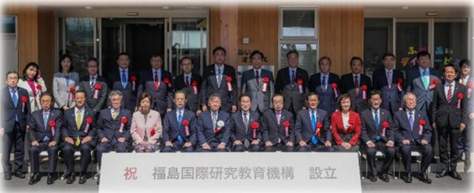

7

福島国際研究教育機構(略称:F-REI)は、福島復興再生特別措置法に基づき、令和5年4月1日に設立された特殊法人です。福島をはじめ東北の復興を実現するための夢や希望となるものとするとともに、我が国の科学技術力・産業競争力の強化を牽引し、経済成長や国民生活の向上に貢献する、世界に冠たる 「創造的復興の中核拠点」を目指しています。

同日、浪江町ふれあい福祉センターで開所式を行い、岸田首相や渡辺復興大臣らが出席しました。

(1)F-REIのミッション福島をはじめ東北の復興を実現するための夢や希望となるものであるとともに、我が国の産業競争力を世界最高の水準に引き上げ、経済成長や国民生活の向上に貢献する、世界に冠たる「創造的復興の中核拠点」を目指すことにあります。 (2)世界水準の研究推進と成果の社会実装・産業化F-REIでは、福島や世界の課題解決を現実のものとするため、研究開発を行うのみならず、研究成果の社会実装・産業化や人材育成についてもその主要な業務として取り組みます。あわせて、福島に既に立地している研究施設等の取組について横串を刺す調整機能を持った司令塔としての役割も果たしてまいります。 (3)創造的復興の中核拠点F-REI設置の効果が広域的に波及するよう、地域の市町村や住民、企業・団体等との間で様々な形のパートナーシップで連携し、F-REIの施設の中だけでなく、施設の外も含めて広域的な実証研究フィールドととらえ、「世界でここにしかない多様な研究・実証・社会実装の場」を実現し、国際的に情報発信してまいります。

#### **令和5年4月1日(土) 福島高専との基本合意書の締結**

4月1日、福島工業高等専門学校 (福島高専)との間において連携協力に関する基本合意書を締結しました。

今後、この基本合意書に基づき、研究開発、人材育成等に関する連携協力を進めてまいります。

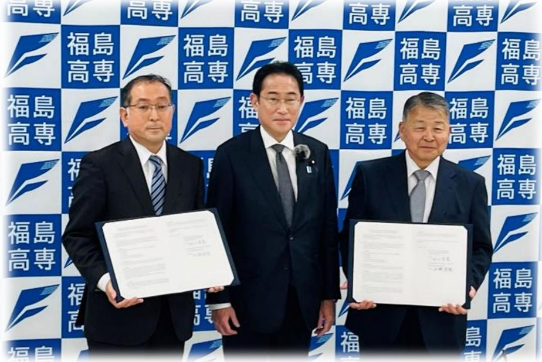

#### **令和5年4月5日(水) F-REI福島医大研究分室の開所式**

4月5日、F-REI福島医大分室の開所式を開催しました。

F-REI福島医大研究分室は、F-REIとして最初の研究組織である放射生態学ユニットが置かれます。F-REIの第1期中期目標期間である7年の間に、研究グループを50まで増やし、研究開発体制を充実していく計画です。

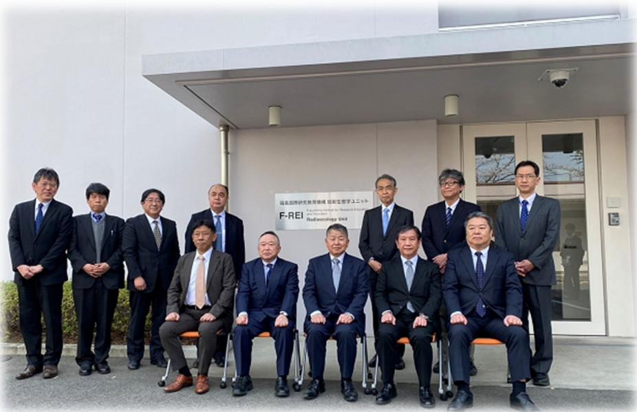

#### **令和5年4月5日(水) 福島医大との基本合意書の締結**

4月5日、福島医科大学とF-REIとの連携協力に関する基本合意書を締結しました(2件目)。

これは、相互の研究開発、人材育成等の充実を図っていくことを目的とするものであり、今後、この基本合意書に沿って、互恵的な連携協力を進めていきます。

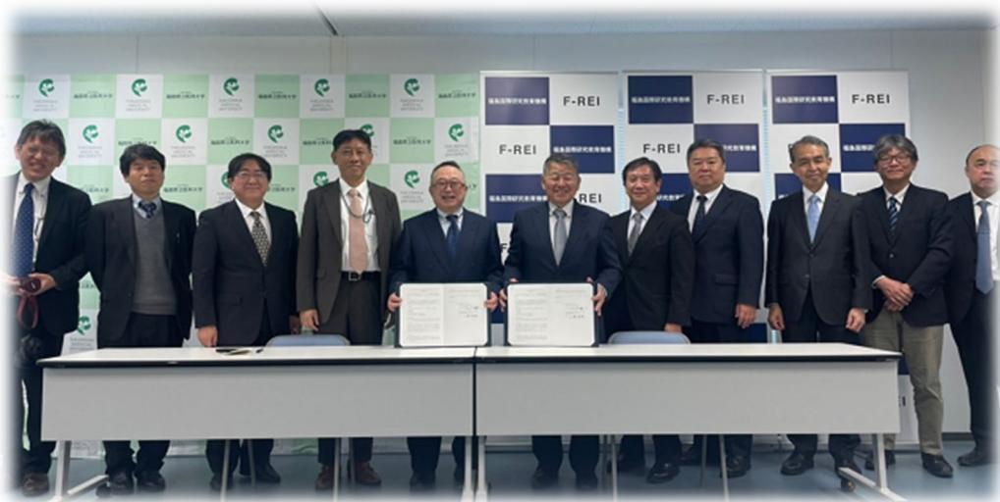

#### **令和5年4月7日(金) 中期計画及び助成等業務実施計画の認可**

4月7日、F-REIの中期計画及び助成等業務実施計画が主務大臣から認可されました。中期計画は、令和11年度までの7年間における中期目標を達成するための計画です。

第一期となる本中期目標期間においては、「基盤作りと存在感の提示」に重点を置くこととし、機構の施設が整備され、その活動が本格的に軌道に乗ることが見込まれる第二期中期目標期間(令和12年度~令和18年度)を見据えながら、たゆむことなく復興に貢献できるよう、取組を進めます。

### **令和5年4月14日(金) F-REI国際アドバイザーの決定**

4月14日、国際的な知見を有する外部有識者からF-REIの運営等に関しご助言をいただくため、4名の外国人有識者に国際アドバイザーとしてご就任いただきました。

今後、国際アドバイザーからのご意見等を踏まえつつ、F-REIの国際連携や国際的な発信を一層推進してまいります。

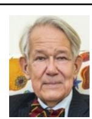

スヴァンテ・リンドクヴィスト博士Dr. SvanteLindqvist

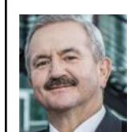

ライムント・ノイゲバウアー博士

Prof.ReimundNeugebauer前フラウンホーファー研究機構理事長

元スウェーデン王立科学アカデミー会長

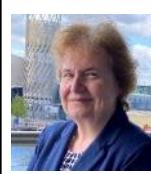

レイモン博士Dr. FionaRayment英国立原子力研究所フェロー

スレッシュ博士

フィオナ・

Dr. SubraSuresh

前南洋工科大学長、元カーネギーメロン大学長

#### **令和5年4月15日(土) F-REIいわき出張所開所式**

4月15日、F-REIいわき出張所開所式が行われました。これは、量子科学技術研究開発機構(QST)が保有していたいわき出張所を、F-REIが引き継ぐこととなったものです。

今後、いわき市などとも協議をしながら、 「F-REIの様々な活動の情報発信の場」 など有効な活用を検討していきます。

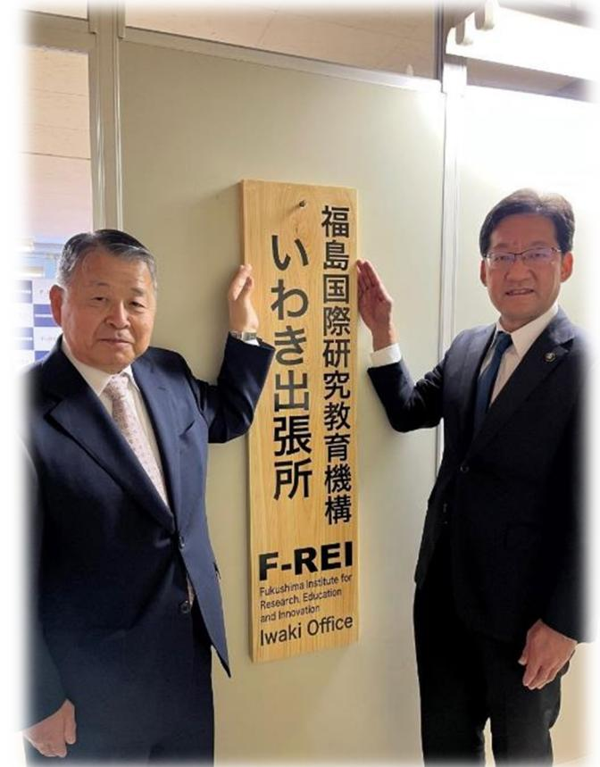

#### **令和5年4月15日(土) いわき市との基本合意書の締結**

4月15日、F-REIいわき出張所開所式の開催にあわせ、いわき市とF-REIとの連携協力に関する基本合意書を締結しました(3件目)。

これに基づき、いわき市との間で双方の資源を有効的に活用した協働活動を推進してまいります。

#### **令和5年4月15日(土) F-REI設立記念シンポジウムの開催**

4月15日、福島県をはじめ国内外の方々に、F-REIの役割、機能、今後の活動計画等を国内外に発信するため、F-REI設立記念シンポジウムを主催いたしました。

国内外の関係者をお招きし、同時にオンライン配信を行うことによって、F-REIの取り組み・方向性を知っていただく重要なキックオフとなりました。

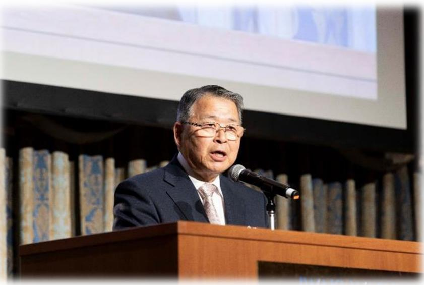

#### **令和5年4月19日(水) ICRU国際シンポジウム開催**

4月19日、国際放射線単位測定委員会 (ICRU)の委員をお招きし、ICRU国際シンポジウムを開催いたしました。

山崎理事長によるF-REIの事業紹介、6 名の有識者の方々からテーマに沿った詳細な講演、総合討論が行われました。

※シンポジウムについては、福島国際研究教育機構(F-REI)、産業技術総合研究所計量標準総合センター(NMIJ/AIST)、国際放射線単位測定委員会(ICRU)の三者主催の形式により開催されました。

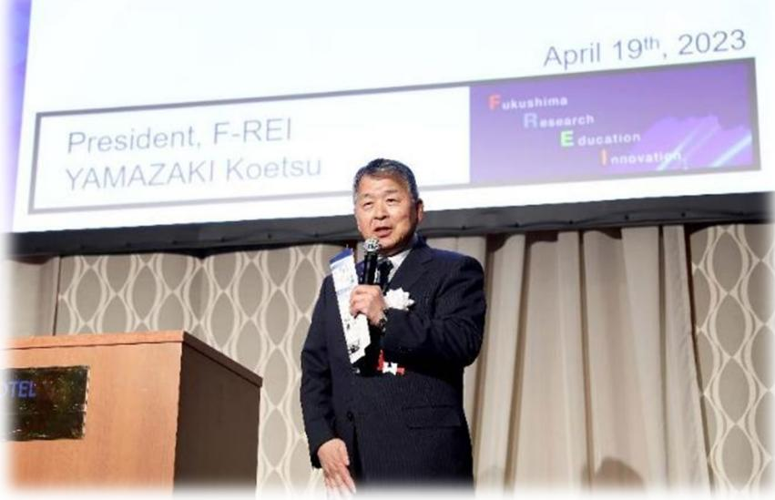

#### **令和5年4月28日(金) 令和5年度の年度計画及び助成等業務実施計画を公表**

4月28日、福島復興再生特別措置法の規定に基づき、令和5年度の研究開発等業務の運営に関する計画(年度計画)及び助成等業務に係る実施計画 (助成等業務実施計画)を公表しました。

中期目標で掲げられた「基盤づくりと存在感の提示」に向け、設立初年度における計画を達成できるよう、しっかりと取り組んでまいります。

○年度計画

https://www.f-rei.go.jp/assets/contents/2023_annual_plan_.pdf

○助成等業務実施計画https://www.frei.go.jp/assets/contents/Implementation_Plan_for_Grant_of_Subsidies_and_Other_Activities.pdf

### **令和5年5月1日(月) アドバイザリーボードのメンバーの決定**

5月1日、アドバイザリーボードのメンバーとして出席し、F-REIの運営全般や、各事業の状況等について、幅広い見地に立った大所・高所からのご助言をいただくため、4名の有識者にアドバイザーとしてご就任いただくこととなりました。

今後、アドバイザーからのそれぞれのご知見・ご経験に基づく情報やご助言等を踏まえつつ、F-REIの活動の各方面への展開に向けて、一層推進してまいります。

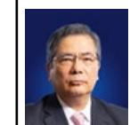

石村和彦(いしむらかずひこ) 産業技術総合研究所理事長永田恭介(ながたきょうすけ) 筑波大学長、国立大学協会会長原山優子(はらやまゆうこ) 元総合科学技術・イノベーション会議常勤議員

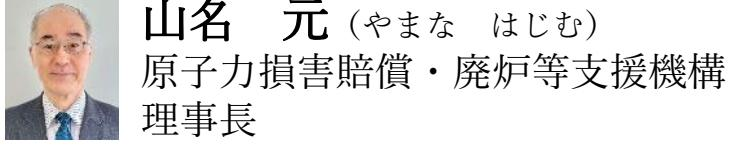

#### **令和5年5月8日(月) 理事長特別顧問の決定**

5月8日、広い業務を的確に実施していくため、外部有識者によるアドバイザー体制の一環として、2名の有識者に理事長特別顧問としてご就任いただくことといたしました。

今後、理事長特別顧問それぞれのご知見・ご経験に基づく情報やご助言等を踏まえつつ、 「創造的復興の中核拠点」を目指し、各種の取組を推進してまいります。

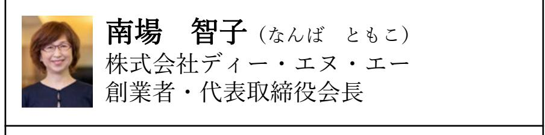

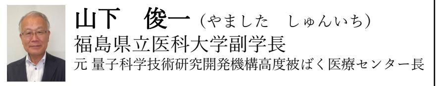

#### **令和5年5月10日(水) 第1回新産業創出等研究開発協議会の開催**

5月10日、第1回新産業創出等研究開発協議会を大熊町で開催しました。

復興庁など7府省庁や県、浜通り地域等 15市町村、大学、研究機関など35団体で構成され、会合では、協議会運営要領やワーキンググループの設置、中期目標及び中期計画等、当面のスケジュールについて確認しました。

第2回会合は9月以降の開催を予定しており、F-REIの事業全般について、様々な関係機関で協議し、研究開発や広域連携など進めてまいります。

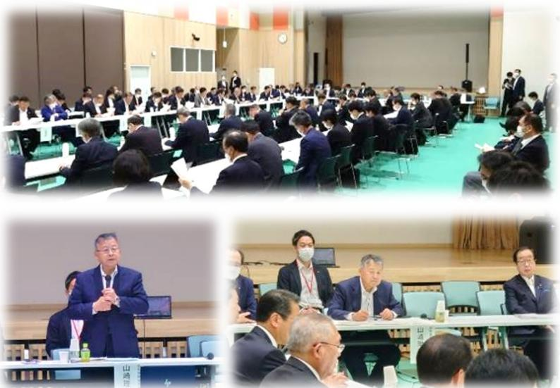

#### **令和5年5月17日(水) 福島大学との基本合意書の締結**

5月17日、福島大学とF-REIとの連携協力に関する基本合意書を締結しました (4件目)。

今後、この基本合意書に沿って、包括的な連携協力を進め、両者間で進めている先行研究に加え、福島をはじめ東北の復興を実現するための研究開発や人材育成等を加速してまいります。

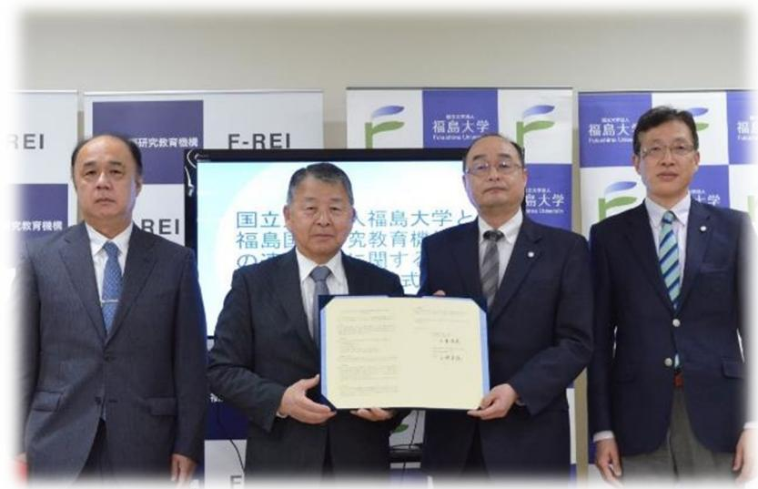

### **令和5年5月17日(水) 第1回F-REIトップセミナーの開催(福島大学)**

5月17日、第1回F-REIトップセミナーを福島大学で開催しました。

本セミナーは、福島の創造的復興と発展を中長期的に支える地域の未来を担う若者世代等を対象とした人材育成の取組の一環として、F-REIの役員等が講師となり、最先端の科学技術の魅力と可能性等を学生・生徒へ伝えるものです。

第1回は、講師は理事長の山崎光悦が務め、演題を「福島大学食農学類の皆さんへ ~これからどう過ごす?大学ライフのススメ~」とし、福島大学食農学類1年生の約100名を対象に行いました。今後も県内各地で順次開催してまいります。

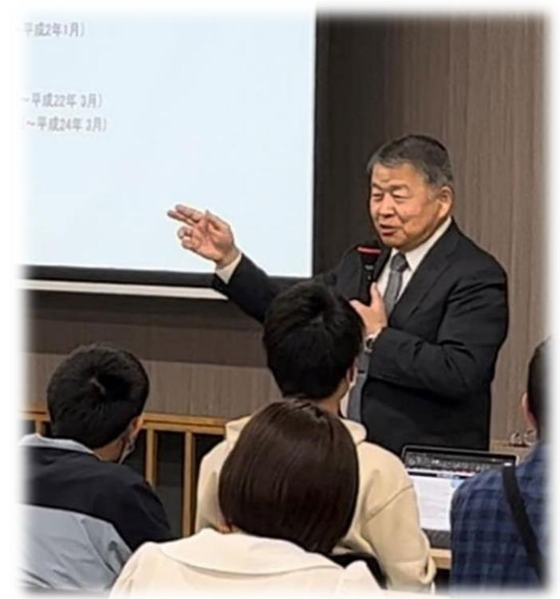

#### **令和5年5月26日(金) 東北経済連合会産業経済委員会での講演**

5月26日、東北経済連合会産業経済委員会が仙台で開催され、山崎理事長が講演しました。

東北経済連合会は、主として東北6県・新潟の計7県において経済活動を展開している企業、団体など約800社を超える会員で構成する総合経済団体であり、東北の復興と発展に向けた活動を行っています。

今回、演題を「創造的復興福島国際研究教育機構(F-REI)の取り組み~世界最高水準の研究推進と成果の社会実装・産業化~」とし、現地、オンラインで参加した本会員企業経営者などの約100 名に対して、F-REIの事業紹介や最近の活動報告等を行いました。

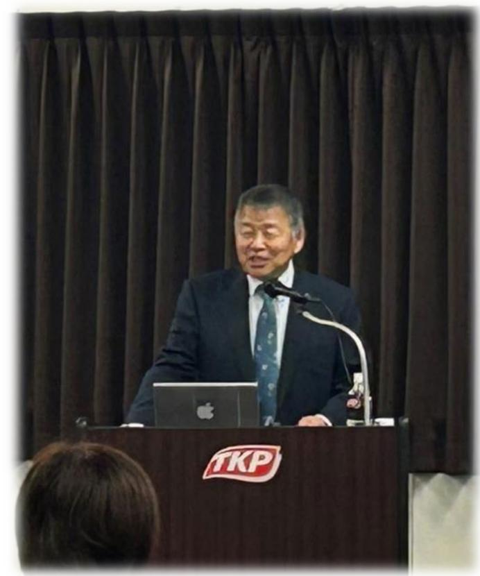

#### **令和5年5月29日(月) 浪江町との基本合意書の締結**

5月29日、浪江町とF-REIとの連携協力に関する基本合意書を締結しました (全体では5件目、自治体としては2件目)。

これに基づき、浪江町との間で双方の資源を有効的に活用した協働活動を推進してまいります。

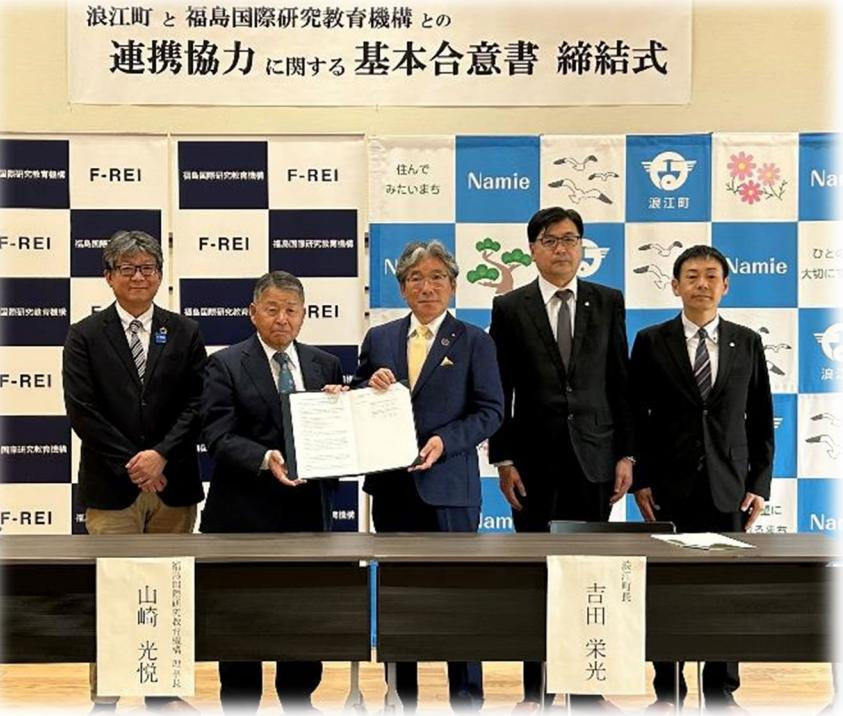

#### **令和5年5月30日(火) 会津大学との基本合意書の締結**

5月30日、会津大学とF-REIとの連携協力に関する基本合意書を締結しました (6件目)。

今後、この基本合意書に沿って、包括的な連携協力を進め、会津大学には国際的な教育・研究環境が整備されており、非常に有用な連携となることを期待しています。

#### **令和5年5月30日(火) 第2回F-REIトップセミナーの開催(会津大学)**

5月30日、第2回F-REIトップセミナーを会津大学で開催しました。

第2回は、講師は理事長の山崎光悦が務め、演題を「会津大学コンピュータ理工学部の皆さんへ ~これからどう過ごす?大学ライフのススメ ~」とし、会津大学コンピュータ理工学部1年生などの約240名を対象に行いました。

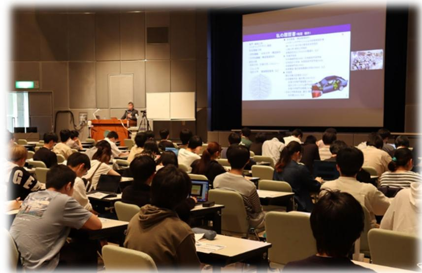

#### **令和5年6月13日(火) 第3回F-REIトップセミナーの開催(相馬高校)**

6月13日、第3回F-REIトップセミナーを相馬高校で開催しました。

第3回は、講師は執行役の大和田裕二が務め、演題を「私の研究とF-REI(エフレイ)」とし、相馬高校2年生の約160名を対象に行いました。

大和田執行役からは自身の専門分野である解剖学、神経科学での教育・研究の経験を踏まえ、受講者に対して"教育、研究、イノベーションの重要性"を説き、受講した高校生は熱心に話を聞いていました。

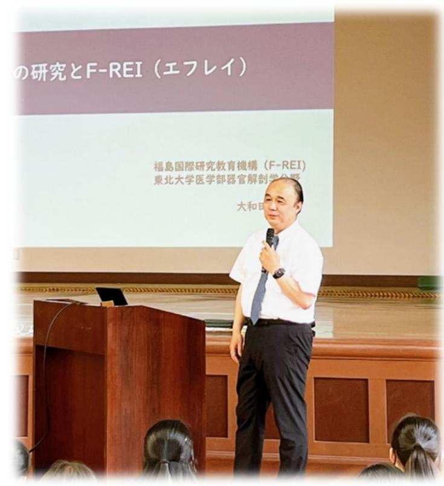

#### **令和5年6月20日(火) 市町村座談会の開催(いわき市)**

6月20日、第1回目となる市町村座談会をいわき市で実施いたしました。

座談会に先立ち、市内の農業法人、エネルギー関連の企業を訪問し、視察及び意見交換を行ったほか、座談会では、地域で活躍されている方々や企業等の経営者等にご参加いただき、多くのご意見をいただきました。

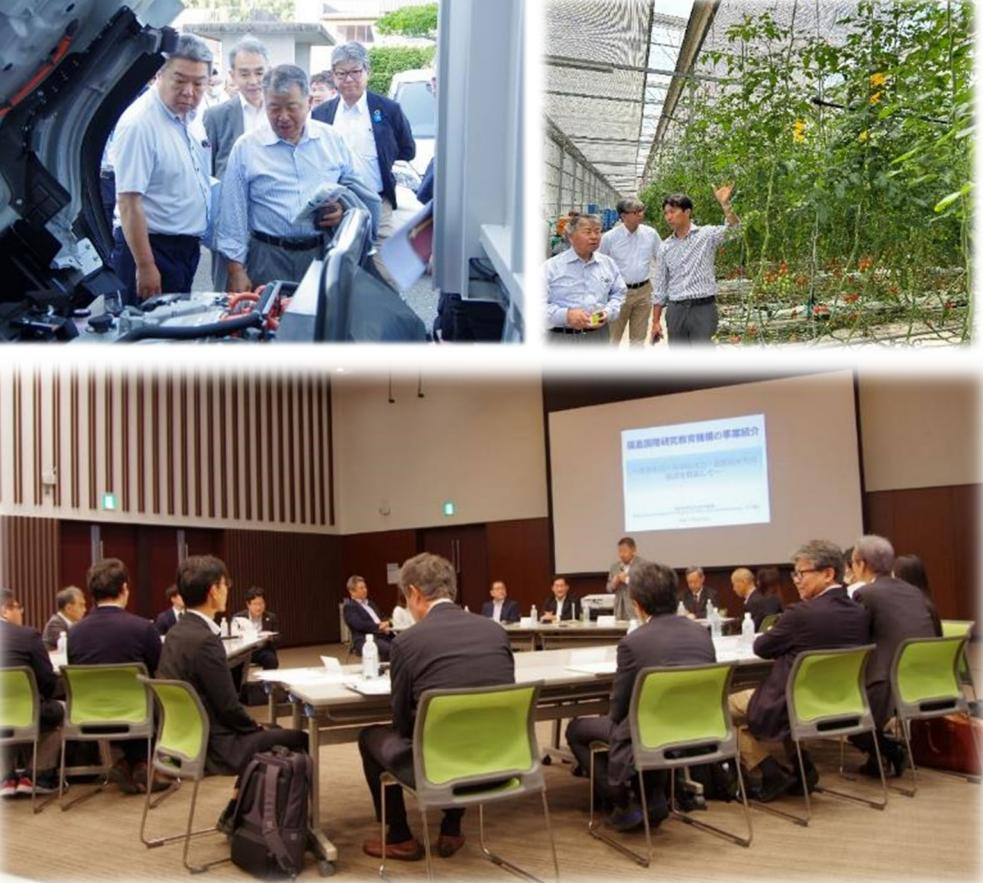

#### **令和5年6月30日(金) 第4回F-REIトップセミナーの開催(会津学鳳中学校・高校)**

6月30日、第4回のトップセミナーを会津学鳳中学校・高校で開催しました。

講師を執行役の大和田祐二、演題を「私の医学研究とF-REI(エフレイ)」とし、中学校3 年生、高校全学年を対象に行いました。

受講した約680名の生徒からは、「医学の話が聞けて面白かった。」や「説明が分かりやすかった。」などの感想が聞かれ、中学生にも分かりやすいように工夫した医学の話が大変好評でした。

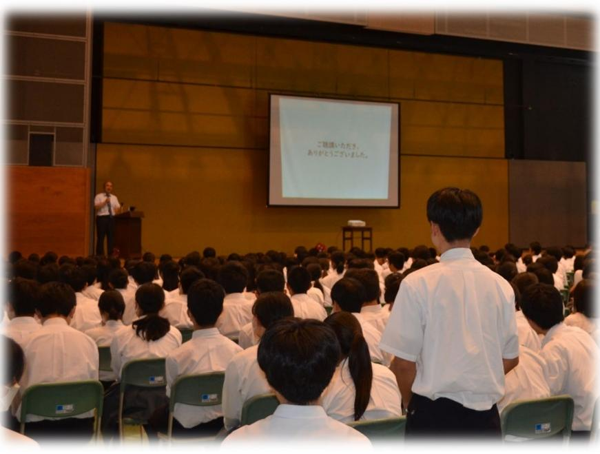

#### **令和5年7月4日(火) 第5回F-REIトップセミナーの開催(会津高校)**

7月4日、第5回のトップセミナーを会津高校で開催しました。

講師は監事の中西友子が務め、演題は「植物の謎:私の歩んできた道」とし、2年生約240 名を対象に行いました。

中西監事からは自身の経歴や研究成果が紹介され、受講した生徒が進路などを考えるきっかけとなっていました。講演後に質問をする生徒もいて、講演内容への関心の高さがうかがえました。

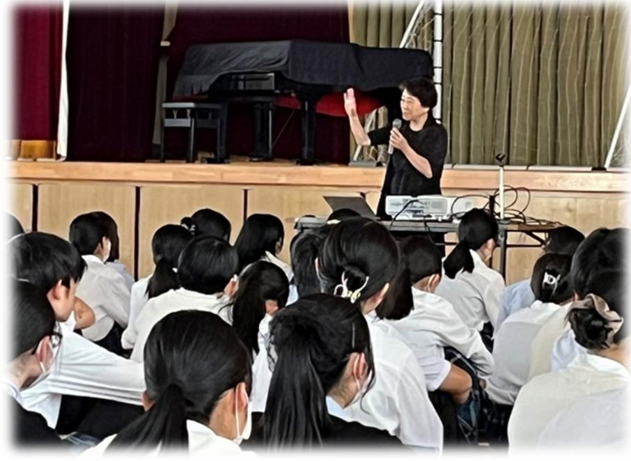

#### **令和5年7月5日(水) 市町村座談会の開催(南相馬市)**

7月5日、第2回目となる市町村座談会を南相馬市で実施いたしました。

座談会に先立ち、市内の農業法人、ワクチンを製造する企業、ロボット関連企業を訪問し、視察及び意見交換を行ったほか、座談会では、地方創生に向けて事業構想を学ぶ南相馬市プロジェクト研究員の方から多くのご意見をいただきました。

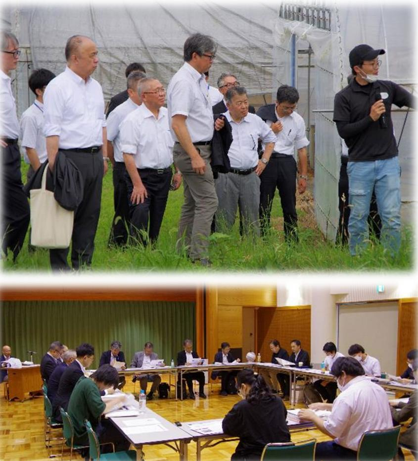

#### **令和5年7月13日(木) 第6回F-REIトップセミナーの開催(小高産業技術高校)**

7月13日、第6回のトップセミナーを小高産業技術高校で開催しました。

講師は監事の森下信が務め、演題は「福島国際研究教育機構目指すロボット研究」として、 2年生約100名を対象に行いました。

森下監事からは、「残念ながら我が国のロボット研究は世界最先端からは周回遅れにあり、F-REIではそれを挽回するために最先端ロボット研究を進めたいと考えている。将来的に、皆さんに研究を進める手伝いをしていただきたい。」 との熱いメッセージを送っていました。

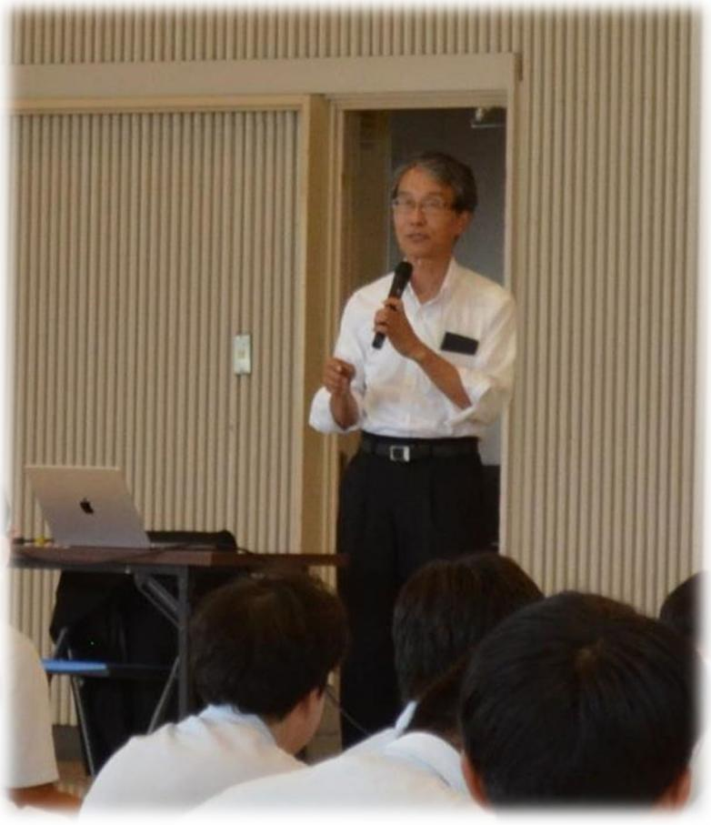

### **令和5年7月14日(金) 分野長・副分野長の決定**

7月14日、各分野における研究開発を戦略的に推進していくため、各分野において専門的知見を有する外部の研究者9 名を分野長、副分野長に就任いただくことといたしました 。

分野長は、担当する分野における研究課題を具体化し、研究の進め方等に係る調整・管理を行い、また、将来のF-REIの研究グループの確保に向けた調整など、研究に関する総括的な業務を行います。 副分野長は分野長を補佐し、また、分野長とは異なる専門的知見に基づく研究課題の調整等を行います 。

|  | 【分野長】野波健蔵(のなみけんぞう) |
| --- | --- |
| ロボット | 一般社団法人日本ドローンコンソーシアム会長 |
|  | 【副分野長】松野文俊(まつのふみとし) |
|  | 大阪工業大学工学部電子情報システム工学科特任教授 |
|  | 【分野長】佐々木昭博(ささきあきひろ) 東京農業大学総合研究所参与(客員教授)、 |
| 農林水産業 | 元農業・食品産業技術総合研究機構副理事長 |
|  | 【副分野長】荒尾知人(あらおともひと) |
|  | 元農業・食品産業技術総合研究機構中央農業研究センター所長 |
|  | 【分野長】矢部彰(やべあきら) 新エネルギー・産業技術総合開発機構 |
|  | 技術戦略研究センターフェロー |
|  | 【副分野長】秋田調(あきたしらべ) |
| エネルギー | 一般財団法人電力中央研究所名誉特別顧問 |
|  | 【副分野長】錦谷禎範(にしきたによしのり) |
|  | 早稲田大学ナノライフ創新研究機構 |
|  | ナノテクノロジー研究所招聘研究員 |
| 放射線科学 | 【分野長】片岡一則(かたおかかずのり) 公益財団法人川崎市産業振興財団 |
|  | ナノ医療イノベーションセンター長 |
| ・創薬医療 | 【副分野長】山下俊一(やましたしゅんいち) |
|  | 福島県立医科大学副学長、元量子科学技術研究開発 |
|  | 機構高度被ばく医療センター長 |

#### **令和5年7月27日(木) 市町村座談会の開催(葛尾村)**

7月27日、第3回目となる市町村座談会を葛尾村で実施いたしました。

座談会に先立ち、村内の酪農家、農業法人、エビの陸上養殖を行う企業を訪問し視察及び意見交換を行ったほか、座談会では、地域で活躍されている方々や企業等の経営者のほか、大学の先生にもご参加いただき、多くのご意見をいただきました。

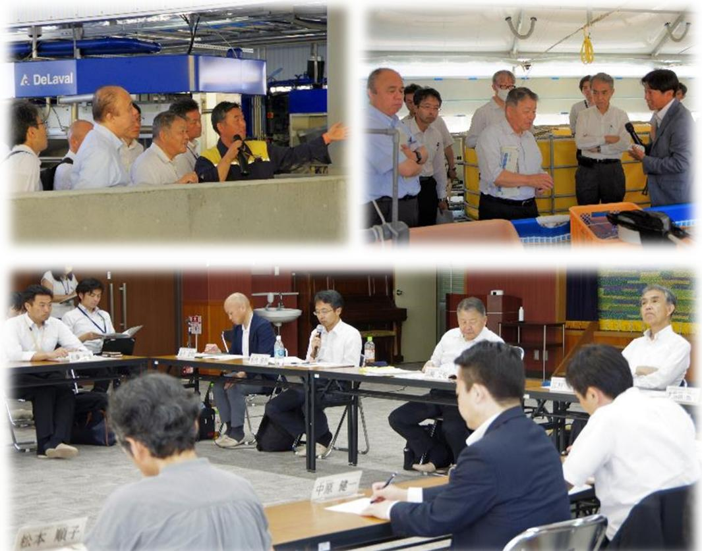

#### **令和5年8月3日(木) F-REIロゴマーク選考委員会を開催**

8月3日、全国から応募いただいたF-REIロゴマーク125作品の中から選考を進めるため、第1回選考委員会を開催しました。

選考委員には、山崎理事長の他、浜通り地域等をはじめとする福島県ゆかりの、デザイン関係の経験豊かな 5名の方に参画をお願いしました。

福島の創造的復興の中核拠点を目指すF-REIを象徴するものとしてふさわしいロゴマークを選考してまいります。

岡部兼芳(おかべたかよし) はじまりの美術館館長

加賀美子(かがよしこ) デザイナー、地域おこし協力隊

瀬川彩那(せがわあやな) 高校生

西山里佳(にしやまりか) Marutt株式会社代表

馬場立治(ばばたつはる) アートディレクター、PlanVie株式会社代表取締役

山崎光悦(やまざきこうえつ) 福島国際研究教育機構理事長

#### **令和5年8月9日(水) 市町村座談会の開催(浪江町)**

8月9日、第4回目となる市町村座談会を浪江町で実施いたしました。

座談会に先立ち、水素エネルギー実証施設、農業法人、集成材製造施設、コンクリート製品製造企業を訪問し視察及び意見交換を行ったほか、座談会では、地域で活躍されている方々、小中学校の校長のほか、まちづくり団体の方にもご参加いただき、多くのご意見をいただきました。

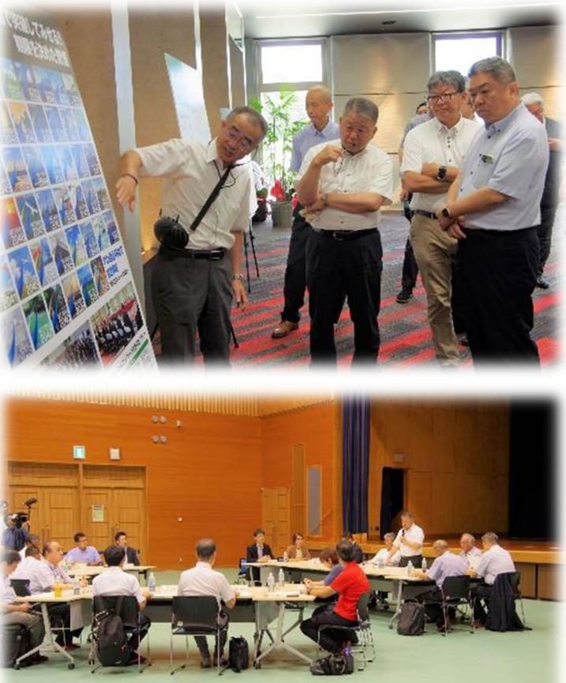

#### **令和5年8月29日(火) 市町村座談会の開催(田村市)**

8月29日、第5回目となる市町村座談会を田村市で実施いたしました。

座談会に先立ち、植物工場、森林組合、ピーマン、ホップ生産農家、バイオマス発電所を訪問し視察及び意見交換を行ったほか、座談会では、地域で活躍されている方々、立地企業の代表の方々、地元高校の先生と生徒にもご参加いただき、多くのご意見をいただきました。

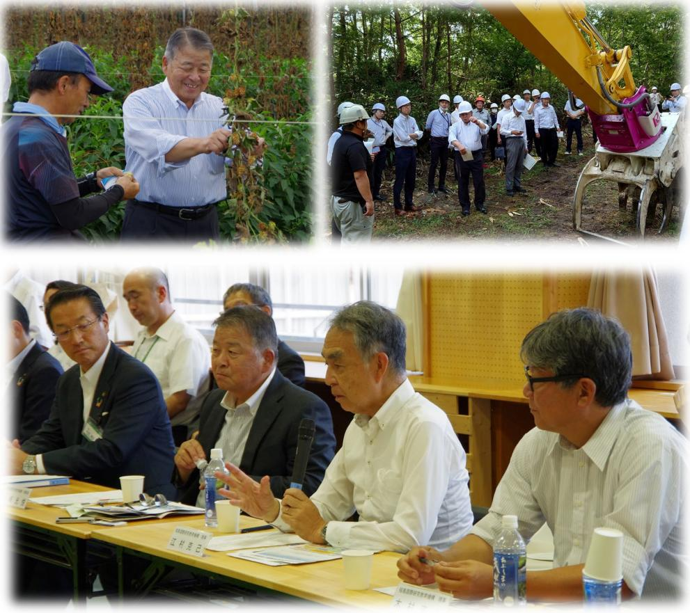

#### **令和5年8月31日(木) 第7回F-REIトップセミナーの開催(安積高校)**

8月31日、第7回のトップセミナーを安積高校で開催しました。

講師は執行役の大和田祐二が務め、演題を 「私の医学研究とF-REIが目指すもの」とし、 2年生を中心とした約40名を対象に行いました。

大和田執行役からはこれまでの自身の経験を踏まえ、「医学の進歩は研究とイノベーションによって生まれる。物事を懐疑的にみる視点も必要だ。」と伝え、最後には「様々な経験が皆さんの将来の糧となります。高校生活を楽しんでください。」とのメッセージを送っていました。

#### **令和5年9月1日(金) 南相馬市との基本合意書の締結**

9月1日、南相馬市とF-REIとの連携協力に関する基本合意書を締結しました(全体では 7件目、自治体としては3件目)。これに基づき、南相馬市との間で双方の資源を有効的に活用した協働活動を推進してまいります。

また、基本合意書の締結に先立ち、南相馬市主催の「福島イノベーション・コースト構想の推進に関する勉強会」において、山崎理事長が講演を行い、県立小高産業技術高校の生徒をはじめ約200名の市民に向けてF -REIの概要等について説明を行いました。

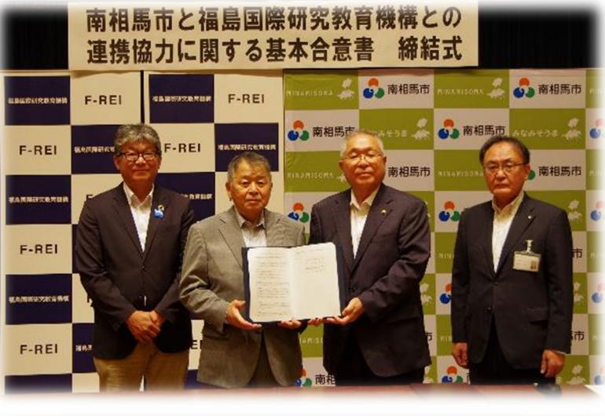

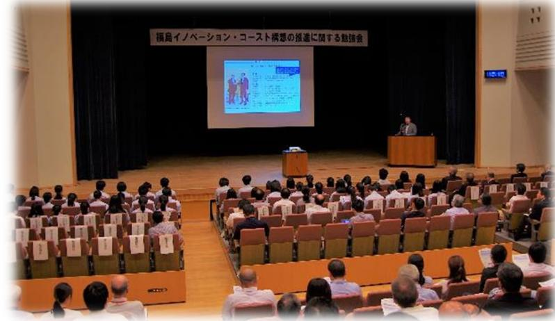

#### **令和5年9月12日(火) 第8回F-REIトップセミナーの開催(ふたば未来学園高校)**

9月12日、第8回のトップセミナーをふたば未来学園高校で開催しました。

講師は理事長の山崎光悦が務め、演題を「ふたば未来学園高校のみなさんへ ~未来のリーダーとなるために~」とし、ふたば未来学園高校2年生の約130名を対象に行いました。考え抜く力の重要性などを説くとともに、「後悔がないように頑張れ!」とエールを送りました。

また、トップセミナーに先立って、同会場にて、福島県高等学校教育研究会理科部会第75回総会並びに令和5年度研究大会が開催され、福島県内高校の理科教員の先生方(約80名)に対して、理事長の山崎光悦が「これからの高校理科教育が目指すべき方向は?」の演題で講演し、高校理科教育の目指すべき方向を考えるきっかけとしていただきました。

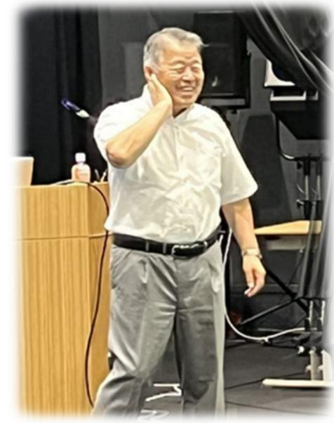

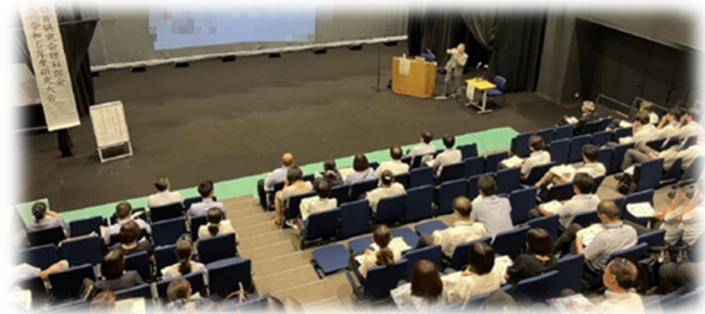

#### **令和5年9月25日(月) 第9回F-REIトップセミナーの開催(福島工業高等専門学校)**

9月25日、第9回のトップセミナーを福島工業高等専門学校で開催しました。

講師は監事の森下信が務め、演題を「福島国際研究教育機構ロボットの知能化研究」とし、機械システム工学科と電気電子システム工学科の3年生の約70名を対象に行いました。

森下監事からは「人まねや流行ではなく、独自に新しい領域を切り開く姿勢が重要だ」との話があり、活発な質疑応答も行われ、盛況のうちに終えました。

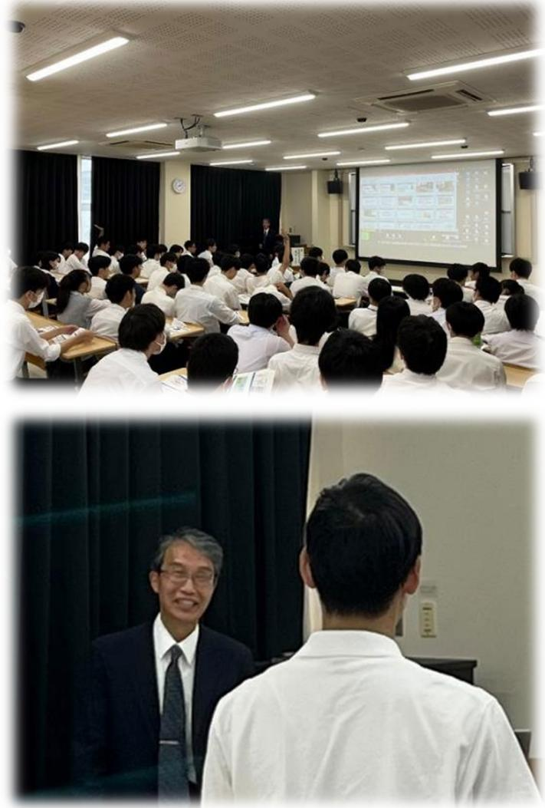

#### **令和5年9月26日(火) 第10回F-REIトップセミナーの開催(福島工業高等専門学校)**

9月26日、第10回のトップセミナーを福島工業高等専門学校で開催しました。

講師は理事長の山崎光悦が務め、演題を 「21世紀を生き抜く諸君に伝えたいこと~ 福島工業高等専門学校の皆さんへ~」とし、化学・バイオ工学科、都市システム工学科、ビジネスコミュニケーション学科の3年生の約 120名を対象に行いました。

山崎理事長からは、"高専で学ぶことの重要性"や、"科学技術の可能性"の話があり、受講した生徒にとって今後の進路を考える良いきっかけになりました。

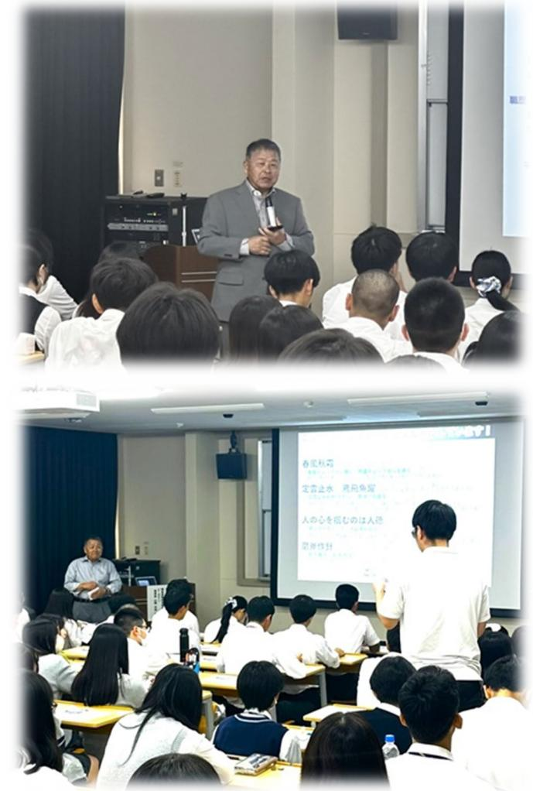

#### **令和5年9月27日(水) 第1回広域連携ワーキンググループの開催**

9月27日、第1回広域連携ワーキンググループ(WG)を開催いたしました。 このWGでは、研究開発、産業化、人材育成等の効果が広域的に波及するよう、福島浜通り地域等を中心とする市町村等による様々な形でのパートナーシップによる連携等について調査及び検討を行います。

第1回目となるWGは、楢葉町で開催し、復興庁から概算要求、施設整備についての御報告、F-REIから研究公募の状況についての報告、広域連携に関する取組について説明等があった後、意見交換を行いました。 43

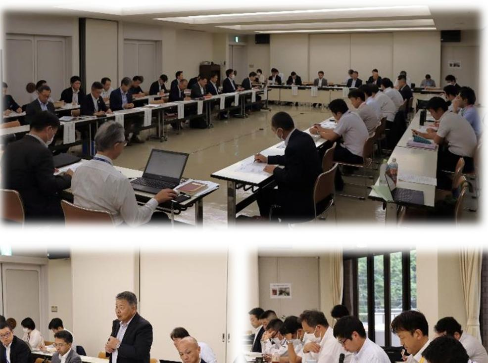

#### **令和5年9月29日(金) 市町村座談会の開催(広野町)**

9月29日、第6回目となる市町村座談会を広野町で実施いたしました。

座談会に先立ち、火力発電所、バナナ栽培施設、大学のサテライト研究室を訪問し視察及び意見交換を行ったほか、座談会では、地域で活躍されている方々、立地企業の代表の方々、東京大学と福島高専の教授にもご参加いただき、多くのご意見をいただきました。

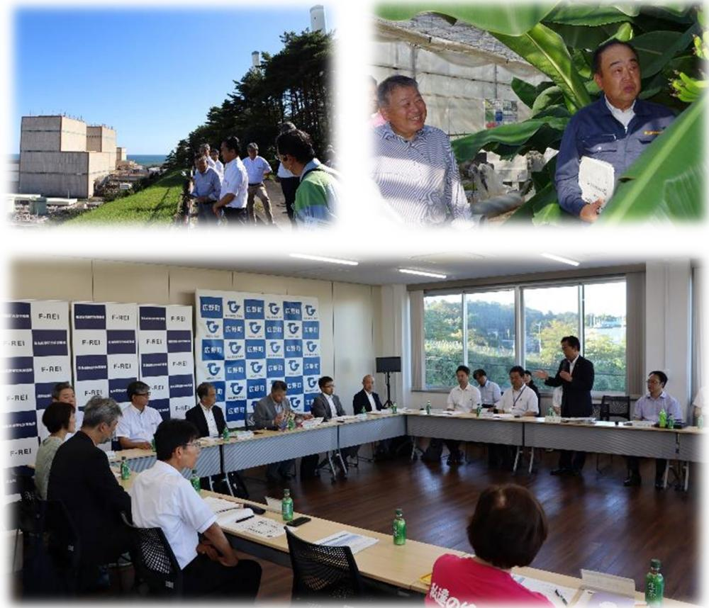

#### **令和5年10月4日(水) 第12回F-REIトップセミナーの開催(福島高校)**

10月4日、第12回のトップセミナーを福島高校で開催しました。

講師は執行役の大和田裕二が務め、演題を 「私の医学研究とF-REI」とし、約50名の医学コースを希望する1年生が熱心に耳を傾けていました。

大和田執行役は、医学の進歩は研究とイノベーションによって生まれることなどを説き、「経験(新しい出来事や友人・教師との出会い) が皆さんの将来の糧となります。高校生活をエンジョイしてください!」とメッセージを伝えました。 和やかな雰囲気の中、生徒からは次々と質疑がなされ、好評のうちに終えました。

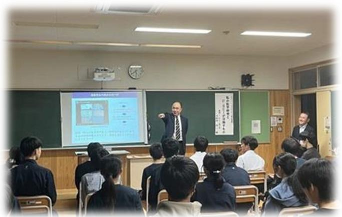

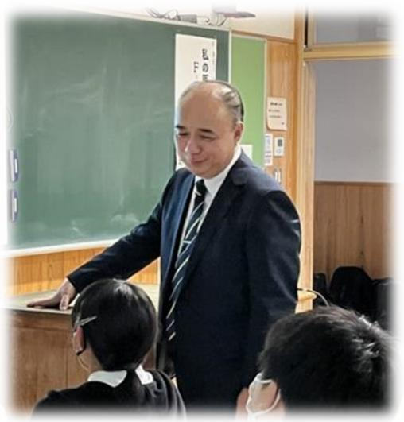

#### **令和5年10月4日(水) 第11回F-REIトップセミナーの開催(福島県立医科大学)**

10月4日、第11回のトップセミナーを福島県立医科大学で開催しました。

講師は監事の中西友子が務め、演題を 「アイソトープと放射線は新しい研究を拓く素晴らしいツール」とし、1年生の約180名を対象に行いました。

中西監事は自身の専門分野である、植物生理学に関する研究内容を紹介され、放射線は研究の重要なツールであるとも話されて、放射線利用の可能性について言及していました。最先端の研究に触れることができ、学生にとって良い刺激となりました。

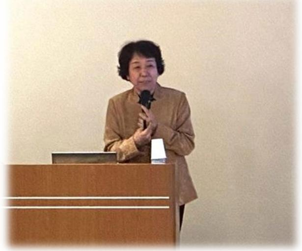

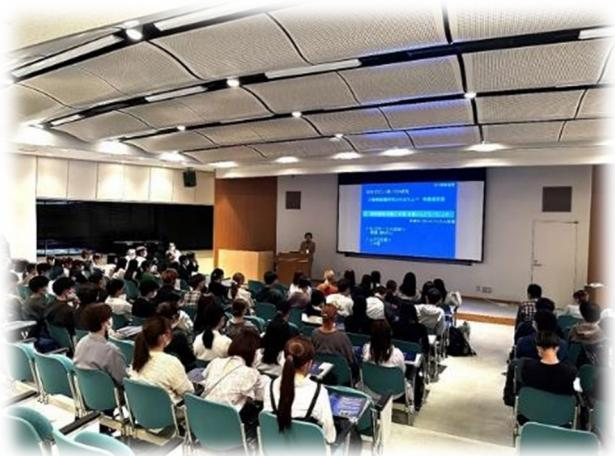

#### **令和5年10月11日(水) 市町村座談会の開催(富岡町)**

10月11日、第7回目となる市町村座談会を富岡町で実施いたしました。

座談会に先立ち、廃炉関連製品製造企業、木材(パネルログ)製造企業を訪問し視察及び意見交換を行ったほか、座談会では、地域で活躍されている方々、立地企業の方々、東京農工大の教授にご参加いただき、多くのご意見をいただきました。

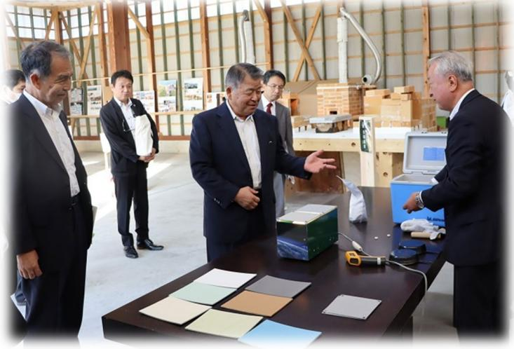

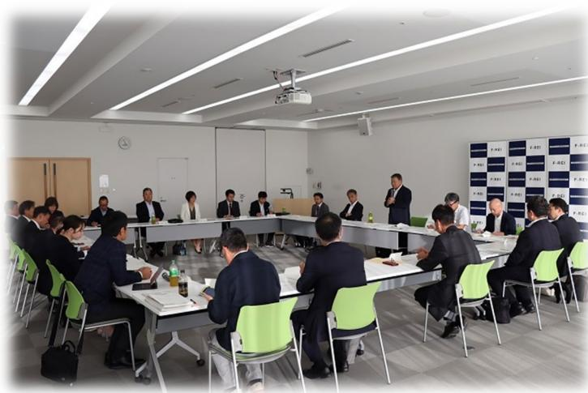

#### **令和5年10月12日(木) 第2回F-REI産学官ネットワーク・セミナーの開催**

10月12日、東北の復興を見据え、東北の企業他を巻き込んだ産学官の連携体制構築の機会とするため、仙台で本セミナーを開催しました。

産学官連携・産業化をテーマとして、3名の講師(若生氏、海老原氏、小池氏)※にご講演いただきました。また、トークセッションでは、佐々木氏※をモデレータに迎え、講師3名に江村理事を加えて、これからの産学官連携・産業化及びF-REIに対する期待についてご議論いただきました。

※モデレータ:佐々木啓一(宮城大学長) ※講師:若生裕俊(富谷市長)、海老原城一(AiCTコンソーシアム代表理事)、小池美穂(株式会社マテリアル・コンセプト代表取締役CEO)

当日は、オンライン参加を含めて156名の民間企業、団体、大学、地元自治体等の方々にご参加いただき、「F-REIの発信力をもっと高めていくべきである。」といったご意見をいただきました。

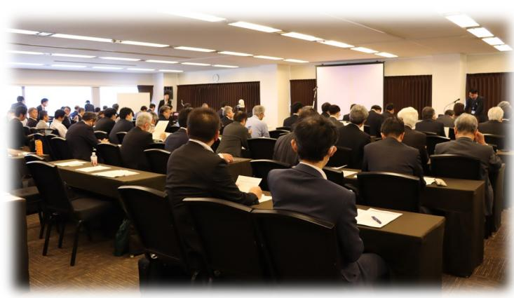

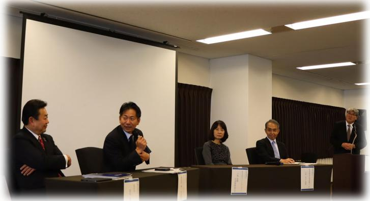

#### **令和5年10月13日(金) 令和5年度第1回アドバイザリーボードの開催**

10月13日、令和5年度第1回アドバイザリーボードを開催しました。

F-REIで初めての開催となる今回は、アドバイザーとして、石村和彦産業総合技術研究所理事長、永田恭介筑波大学長、原山優子東北大学名誉教授が対面で、山名元原子力損害賠償・廃炉等支援機構理事長がオンラインで、それぞれご参加いただきました。F-REIからは山崎理事長をはじめ、役員、執行役、分野長、副分野長等が出席しました。

初めに、F-REI側からF-REIの取組紹介を行ったのち、研究活動の方向性や、拠点形成のあり方等についてアドバイザーとの活発な意見交換を通じて有意義なご助言をいただきました。

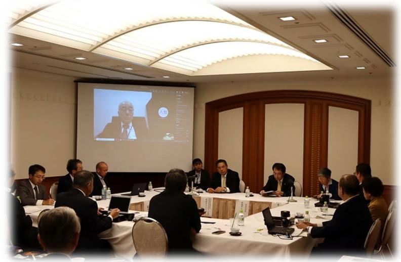

#### **令和5年10 月15日(日) 科学実験教室の開催**

10 月15日、「親子わくわく科学実験教室」 と題し、実験教室を開催いたしました。

当日は、浜通りを中心に県内各地から 6 組 18名の親子にご参加いただき、網倉優子先生と一緒にペットボトルロケットを自作しました。その後、ロケットに水を入れて打ち上げると、子供たちから歓声が上がり、次はより飛距離を伸ばそうと試行錯誤しておりました。 打ち上げ後、本物のロケットも何度も失敗しそのたびに改良され作り上げられていくものだと先生から教えられると、子供たちは真剣に聞き入っていた様子でした。

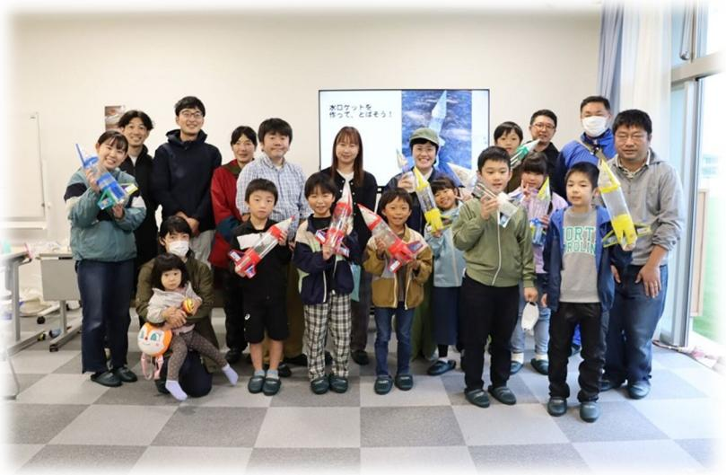

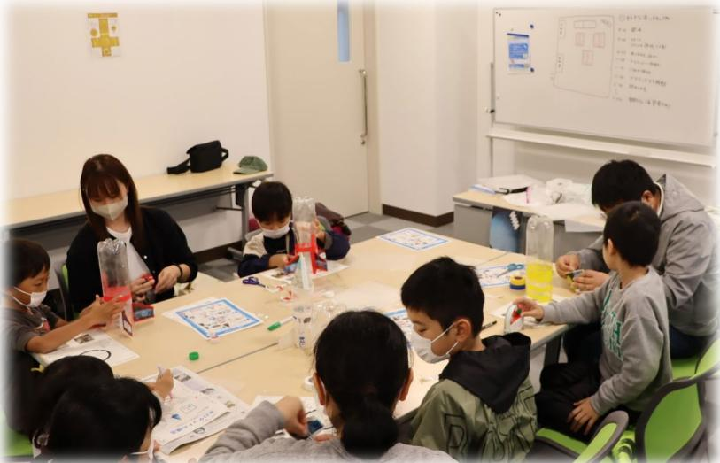

#### **令和5年10月17日(火) 市町村座談会の開催(川内村)**

10月17日、第8回目となる市町村座談会を川内村で実施いたしました。

座談会では、地域で活躍されている方々、立地企業の方々、まちづくり団体の方にご参加いただき多くのご意見をいただきました。 また、座談会のほか、ワイナリー、建設機械部品製造企業を訪問し視察及び意見交換も行いました。

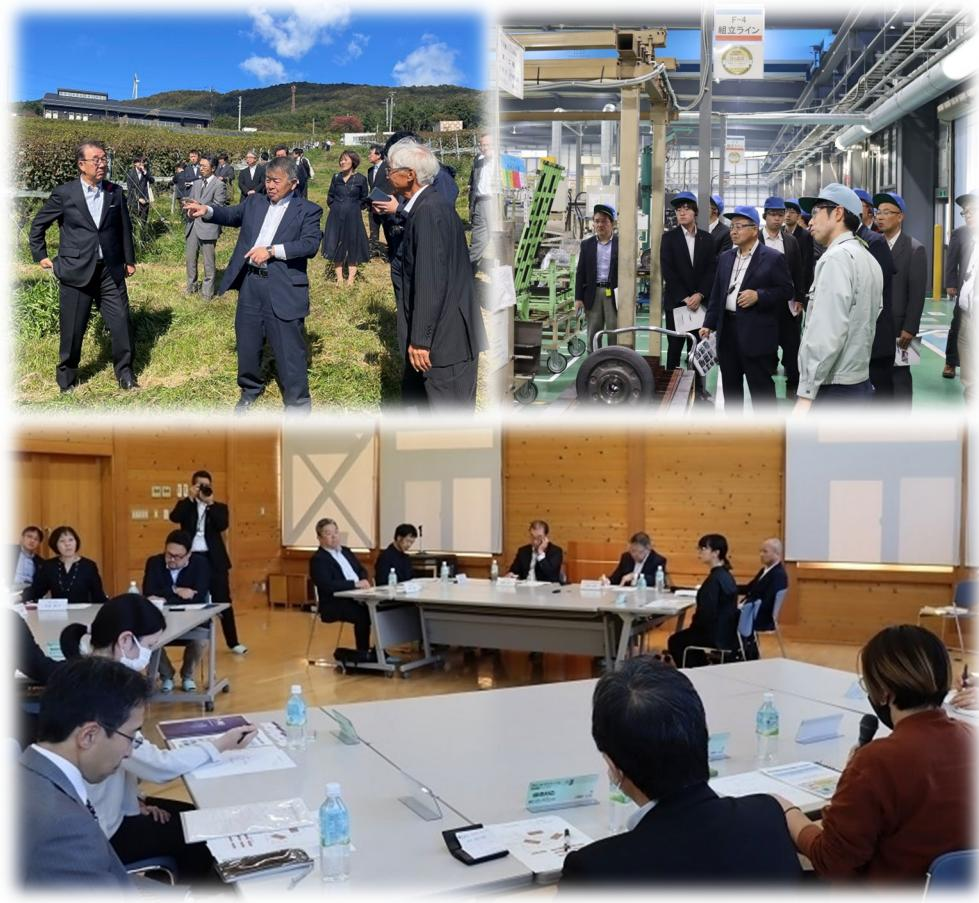

#### **令和5年10月23日(月) 市町村座談会の開催(新地町)**

10月23日、第9回目となる市町村座談会を新地町で実施いたしました。

座談会に先立ち、天然ガス発電所、樹脂製品製造工場を訪問し視察及び意見交換を行ったほか、座談会では、地域で活躍されている方々、立地企業の方々にご参加いただき、多くのご意見をいただきました。

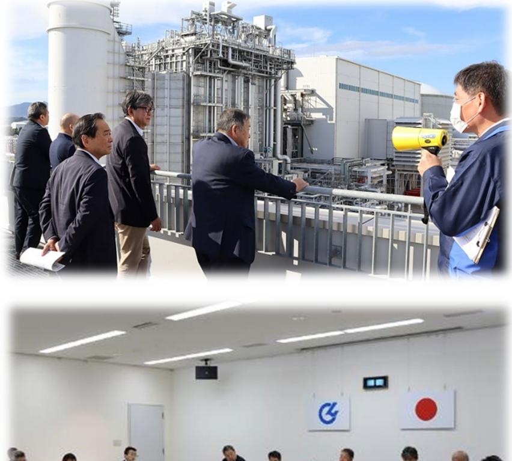

### **令和5年10月26日(木) 出前授業の実施(福島工業高等専門学校)**

10月26日、キャリア教育に関する出前授業を福島工業高等専門学校(福島高専)で実施しました。

本出前授業は、福島高専の今年度からの新しい取組であるキャリア教育に関する特別活動にF-REIから講師を派遣したものとなります。

講師は監事の森下信が務め、演題を「「キャリア =将来」について考えよう」とし、機械システム工学科2年生の約40名を対象に講義しました。 「何のために仕事をするのか」や「学生としての 「今」が将来にどうのように結びつくか」などについてお話ししました。

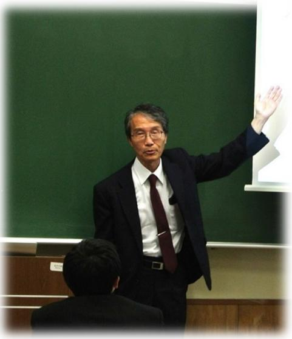

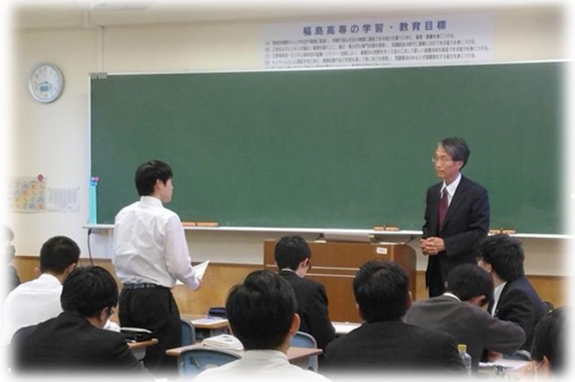

#### **令和5年11月6日(月) 市町村座談会の開催(飯舘村)**

11月6日、第10回目となる市町村座談会を飯舘村で実施いたしました。

座談会に先立ち、金属製品等製造企業、木質バイオマス発電所を訪問し視察及び意見交換を行ったほか、座談会では、地域で活躍されている方々、地方創生に取り組まれてる企業の方々にご参加いただき、多くのご意見をいただきました。

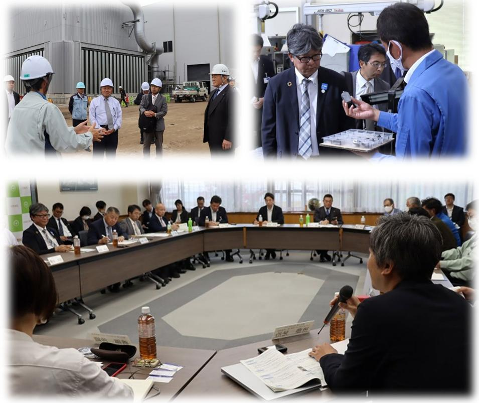

#### **令和5年11月7日(火) 第13回F-REIトップセミナーの開催(東日本国際大学)**

11月7日、第13回のトップセミナーを東日本国際大学で開催しました。

講師は理事長の山崎光悦が務め、演題を「東日本国際大学のみなさんへ ~未来のリーダーとなるために~」とし、経済経営学部、健康福祉学部の2年生約60名を対象に行いました。

山崎理事長は、自身の専門分野である材料力学、計算力学、シミュレーション工学などに関する研究内容を紹介され、最先端の科学技術力の魅力と可能性等について学生に伝えていました。講演の最後には、「未来のリーダーとなるために、人よりも積極的に様々な経験を積んでください」とエールを送っていました。

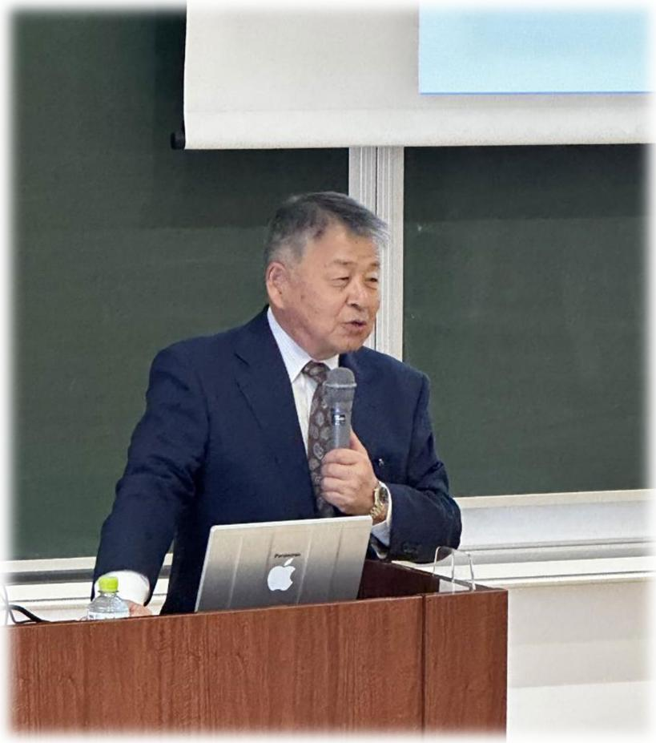

#### **令和5年11 月15日(水) 出前授業の実施(早稲田大学)**

11 月15日、「福島県浜通り地域での魅力的な取組を知る」をテーマとした出前授業を早稲田大学早稲田キャンパスで実施しました。

本出前授業は、公益財団法人福島イノベーション・コースト構想推進機構(イノベ機構)と連携して実施したものとなります。福島県浜通り地域等を、自分の夢ややりたいことを実現する場として考えるきっかけとなることなどを期待して実施しました。

F-REIからの講師は総務部長の金子忠利が務め、早稲田大学法学部の 3年生などの約 130名に講義しました。

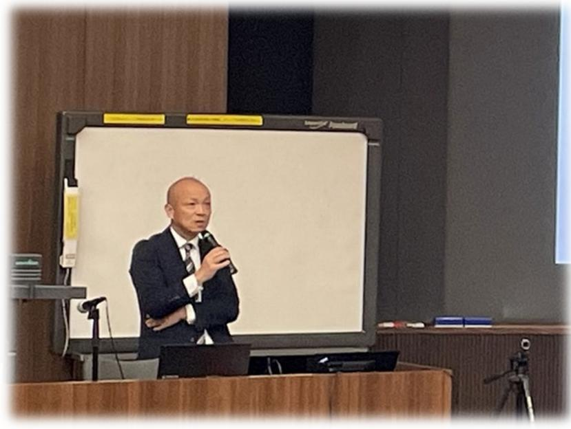

#### **令和5年11月17日(金) 市町村座談会の開催(楢葉町)**

11月17日、第11回目となる市町村座談会を楢葉町で実施いたしました。

座談会に先立ち、JAEA楢葉遠隔技術開発センター、甘藷貯蔵施設を訪問し視察及び意見交換を行ったほか、座談会では、地域で活躍されている方々、立地企業の方々、まちづくり団体の方にご参加いただき、多くのご意見をいただきました。

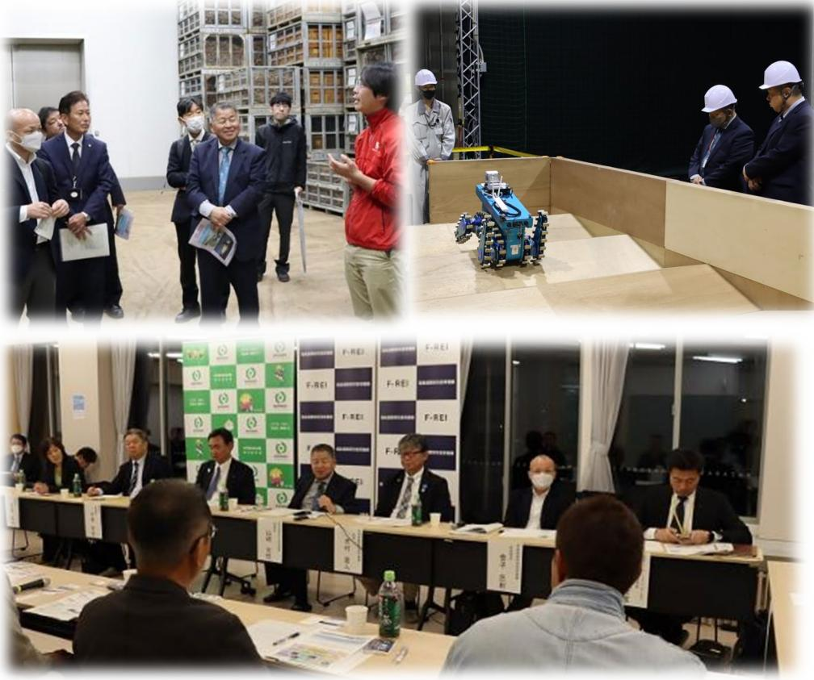

#### **令和5年11月21日(火) 教職員への講演会の実施(福島工業高等専門学校)**

11月21日、福島工業高等専門学校(福島高専)において、同教職員を対象にした講演会を実施しました。

理事長の山崎光悦が「大学改革の経験を基盤に福島国際研究教育機構設立への挑戦」 と題して、F-REI設立の経緯や概要、今後の計画、そして、福島高専に期待することなどについて語りました。

本講演会は、今年4月1日に締結した研究開発や人材育成等に関する連携協力に関する基本合意書に基づいた取組の一環として実施したもので、教職員約60名がF-REIとのさらなる連携協力の可能性について熱心に考えられていました。

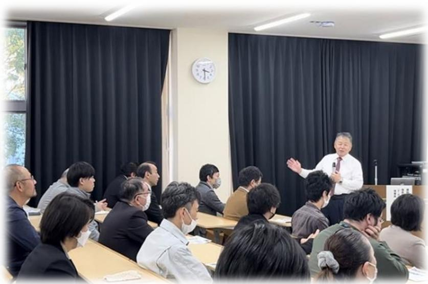

#### **令和5年11月24日(金) 会津大学の学生等へのF-REI説明会の実施**

11月24日、会津大学、ふたば未来学園高等学校の学生約40名(インド、インドネシア、ガンビア、カンボジア、コンゴ民主共和国、ミャンマー、中国、ドイツからの留学生を含む。)を対象としたF-REI説明会(会場:浪江防災コミュニティセンター)を開催しました。今回は、会津大学のふくしま未来創造プログラムの一部として実施したものとなります。

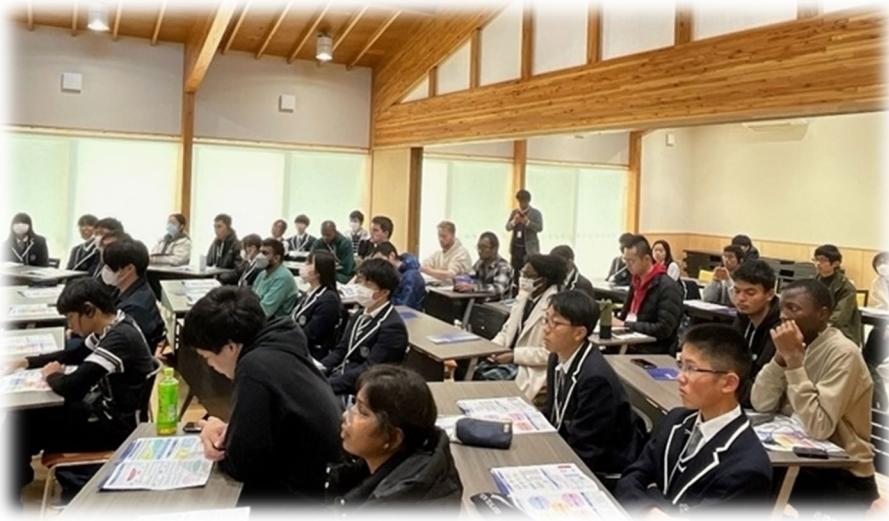

大塚人材育成推進課長が、F-REIの概要や現在の活動などを説明し、参加者からは「外国人研究者はどのように採用するのか」「外国人研究者はどの程度の割合になるのか」「F-REIはどのような組織と連携していくのか」「F-REIをなぜ福島に置くことになったのか」など、次々に質問が出て、活発な質疑がなされました。

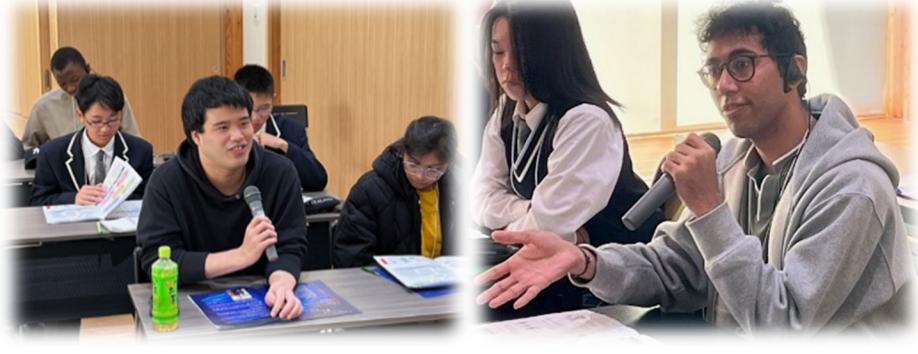

#### **令和5年11月24日(金) 第14回F-REIトップセミナーの開催(福島大学)**

11月24日、第14回のトップセミナーを福島大学で開催しました。福島大学では第1回トップセミナー(5月17日開催/対象:食農学類)に引き続き、2回目の開催となります。

講師は理事の江村克己が務め、演題を「イノベーションを担う人材になろう! ~学生時代にチャレンジして欲しいこと~」とし、共生システム理工学類の1年生約170名を対象に行いました。

江村理事は、光通信技術の研究者としての経験を踏まえ、イノベーションとは何か、イノベーションを担う人材となるため、これからの時代に磨くべき素養とは何かについて話をされ、講演の最後には、 「学生時代を有効に使い、自らやりたいこと、実現したいことを見出し、学び続けることで役立つ人材であり続けてください」とエールを送っていました。

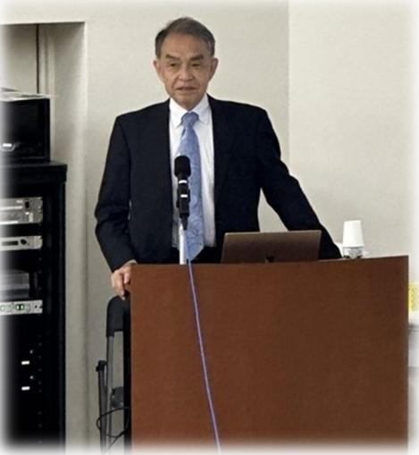

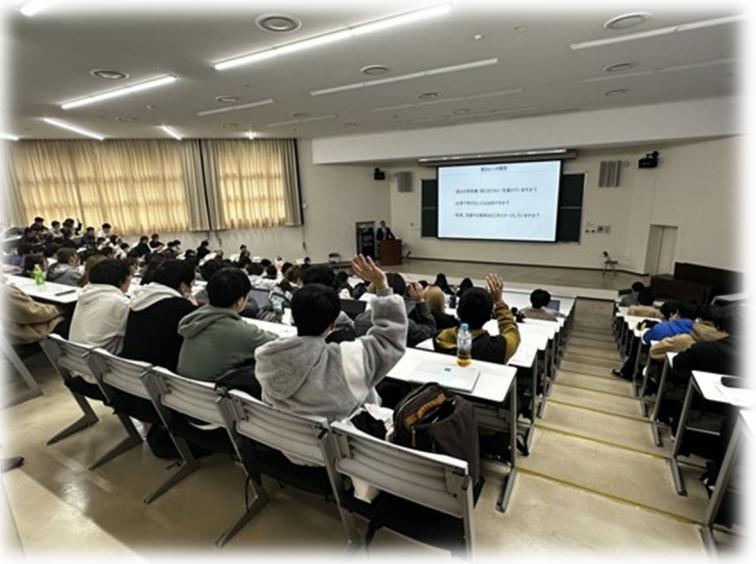

### **令和5年11月26日(日)~12月1日(金) 国際アドバイザーとの意見交換を実施**

11月26日から12月1日にかけて、山崎理事長は欧州に出張し、F-REI国際アドバイザー4名のうち欧州に拠点を置く3名(フィオナ・レイモン博士(英国)、ライムント・ノイゲバウアー博士(ドイツ)、スヴァンテ・リンドクヴィスト博士(スウェーデン))をそれぞれ訪問しました。

山崎理事長から各国際アドバイザーに対しF-REIの事業を詳細に説明し、理解を深めていただくとともに、F-REIを国際的な研究拠点にするための方途等について意見交換を実施しました。また、山崎理事長から各国際アドバイザーに、今後の継続的な協力をお願いしました。

F-REIは引き続き国際アドバイザーから適切な助言を得つつ、国際化に向けた取り組みを進めてまいります。

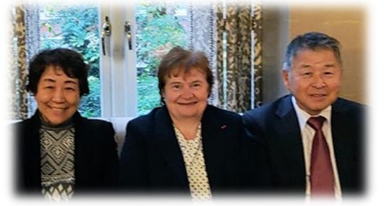

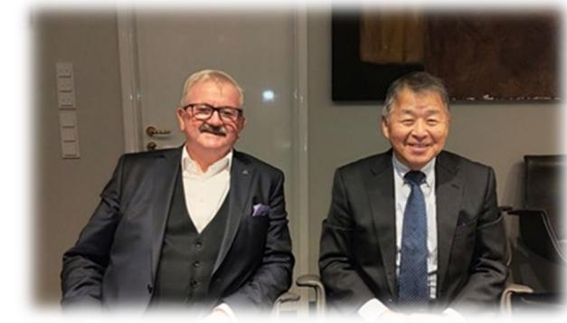

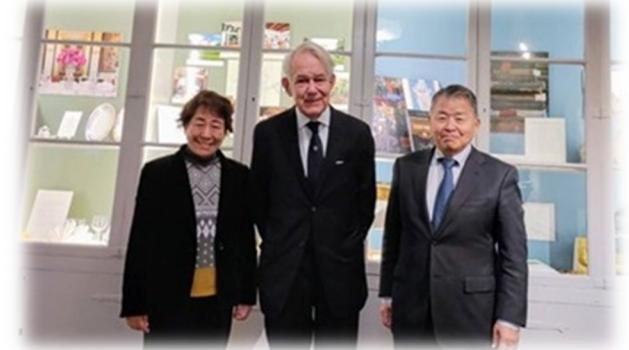

### **令和5年12月1日(金) 第15回F-REIトップセミナーの開催(磐城高校)**

12月1日、第15回のトップセミナーを磐城高校で開催しました。

講師は監事の森下信が務め、演題を「機械工学~医工学最先端研究」とし、普通科2年生約280名を対象に行いました。

森下監事は、人工知能や医工学などの最先端研究について紹介し、「皆さんが貢献できる分野は数多くある。いろいろな分野に興味を持ってください。」と生徒へ話していました。講演終了後には活発な質疑応答が行われ、受講された生徒にとって自らの将来像を考えるきっかけになりました。

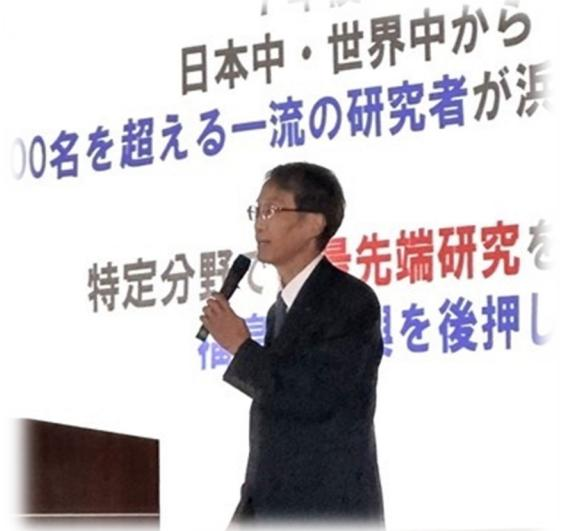

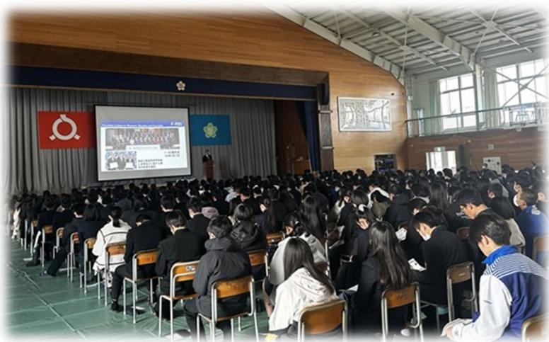

#### **令和5年12月4日(月) 市町村座談会の開催(大熊町)**

12月4日、第12回目となる市町村座談会を大熊町で実施いたしました。

座談会に先立ち、大熊インキュベーションセンター、学び舎ゆめの森を訪問し視察及び意見交換を行ったほか、座談会では、地域で活躍されている方々、立地企業の方々、大熊町に関係する大学の方々にご参加いただき、多くのご意見をいただきました。

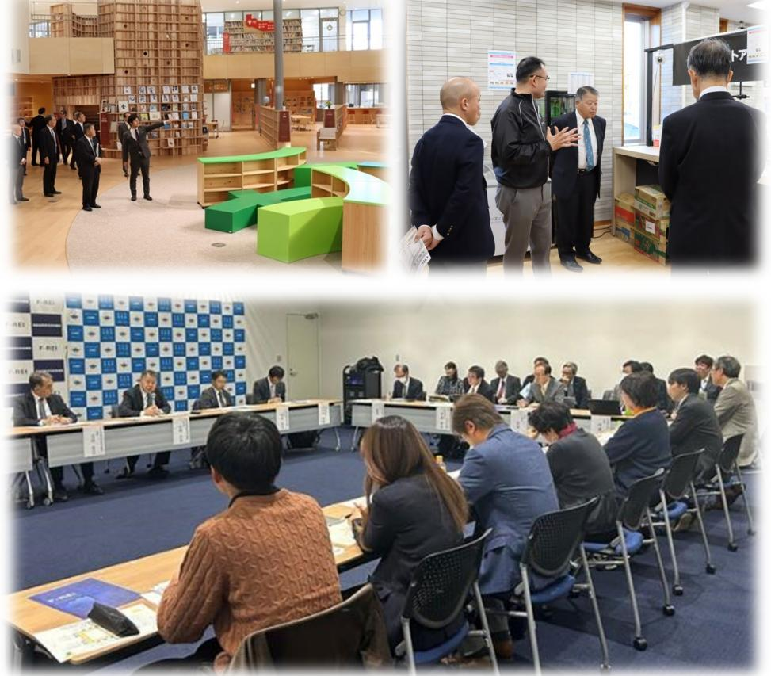

### **令和5年12月7日(木) 第16回F-REIトップセミナーの開催(原町高校)**

12月7日、第16回のトップセミナーを原町高校で開催しました。

講師は執行役の大和田祐二が務め、演題を 「私の医学研究とF-REI」とし、普通科2年生約140名を対象に行いました。

大和田執行役は、「医学の進歩は研究とイノベーションによって生まれる」「将来、福島あるいは世界を担う人材になっていただきたい」と話され、受講された生徒にとって今後の進路を考えるきっかけになりました。

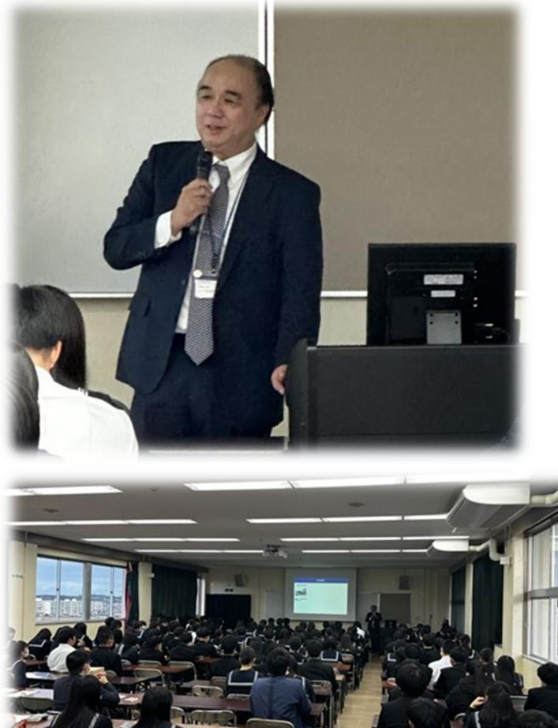

#### **令和5年12月19日(火) 市町村座談会の開催(相馬市)**

12月19日、第13回目となる市町村座談会を相馬市で実施いたしました。

座談会に先立ち、そうまIHIグリーンエネルギーセンターとアグリ・コア株式会社を訪問し、視察及び意見交換を行ったほか、座談会では、地域で活躍されている方々にご参加いただき、多くのご意見をいただきました。

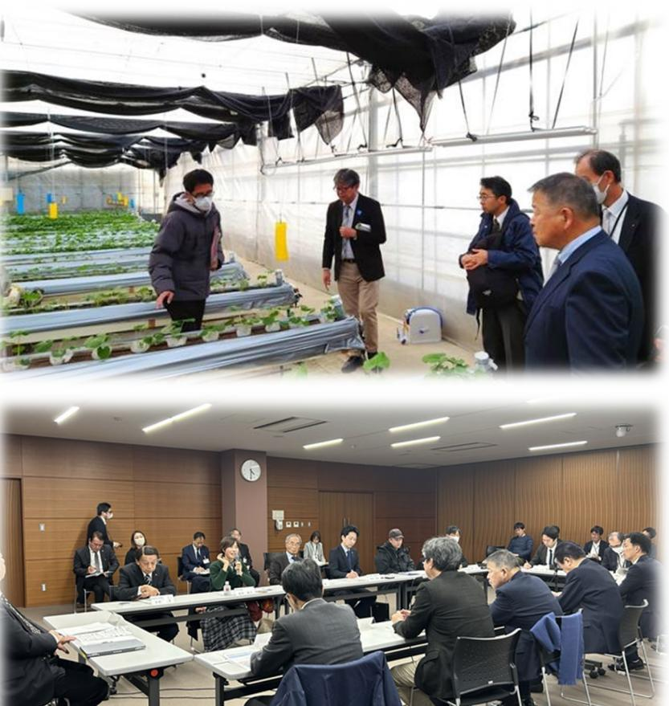

#### **令和5年12月26日(火) 県北・相双地区の自然科学系部活動の高校生へのF-REI説明会の実施**

12月26日、県北・相双地区の高校の自然科学系部活動部員約20名を対象としたF-REI説明会 (会場:双葉町産業交流センター)を開催しました。

今回は、福島イノベーション・コースト構想推進機構様の協力の下、福島県高等学校文化連盟自然科学専門部県北・相双支部生徒研修会の一部として実施したものとなります。

大塚人材育成推進課長が、F-REIの概要や将来の展望、高校生に期待することなどを説明しました。

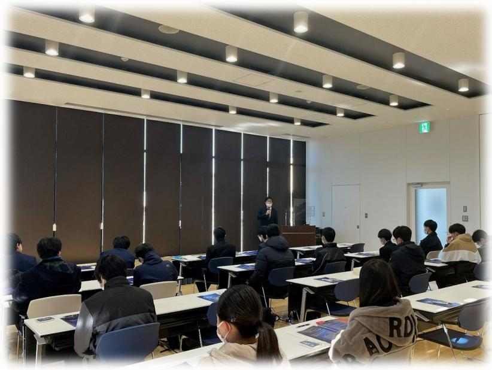

#### **令和6年1月8日(月・祝) エフレイ・サイエンスラボ(体験講座)の開催**

1月8日、エフレイ・サイエンスラボ「放射線をさがせ」 (体験講座)をいわき市で開催しました。

この体験講座は、エフレイによる地域の未来を担う若者世代の人材育成の取組の一環として、開催したものです。

当日は、10名の小学生と保護者にご参加いただき、4 名の高専生(福島高専)の指導の下で、放射線計測器を用いて身の回りのもの(食品、塩、肥料など)に含まれる天然の放射性物質から出る放射線を計測しました。 また、霧箱による放射線可視化の実験では、高専生が事前に霧が発生する条件やコツを自ら考えた上で小学生の指導にあたり、参加した小学生全員が霧箱で放射線の通った跡を実際に見ることができ、小学生からは歓声が上がっていました。

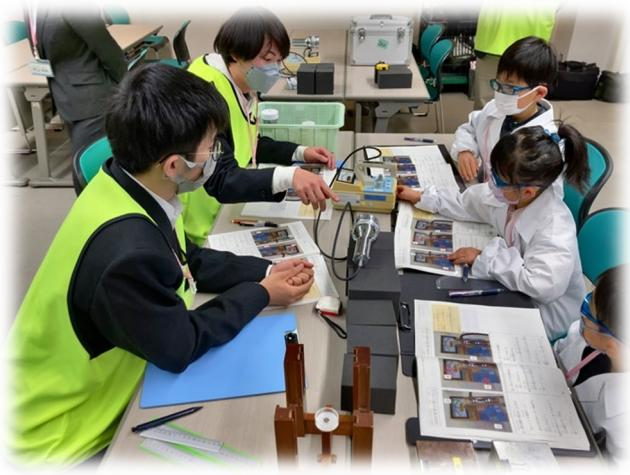

#### **令和6年1月12日(金) 第2回新産業創出等研究開発協議会の開催**

1月12日、第2回新産業創出等研究開発協議会を富岡町で開催しました。

協議会には、F-REI、復興庁、福島県、研究機関、関係機関、浜通り地域等15市町村の35の構成員が参画しています。

会議では、平木大作復興副大臣にもご臨席いただき、F-REIの活動状況、各ワーキンググループの開催内容についてF-REIから、令和6年度予算概算決定及び施設整備の状況について復興庁から報告した後、市町村座談会等を通じて得られた課題等について、構成員による活発な意見交換が行われました。

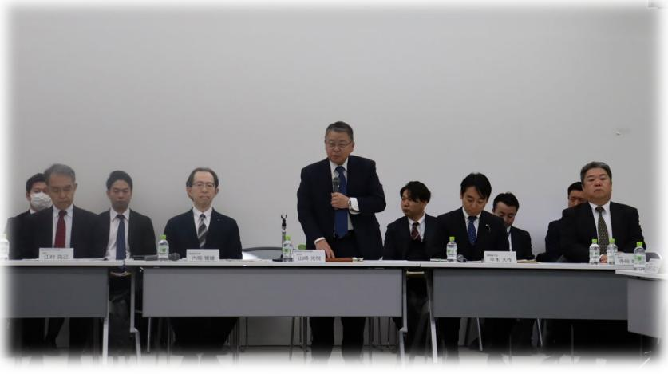

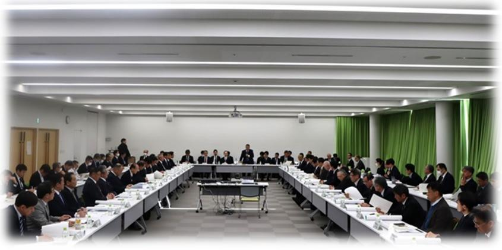

#### **令和6年1月12日(金) F-REIロゴマーク最優秀作品の発表について**

F-REIのロゴマークの募集は、昨年4月21日から 6月30日の期間にかけて行われ、全国125名の方からの応募があり、有識者による委員で構成される審査委員会や、一般からの意見募集等を踏まえ、高橋絢香(たかはしあやか)さんのデザインを最優秀作品として決定しました。

F-REIのロゴマーク最優秀作品の決定に伴い、 1月12日、富岡町文化交流センター学びの森において、表彰式を開催し、表彰状の授与やロゴマークの紹介、記念撮影等をとり行いました。

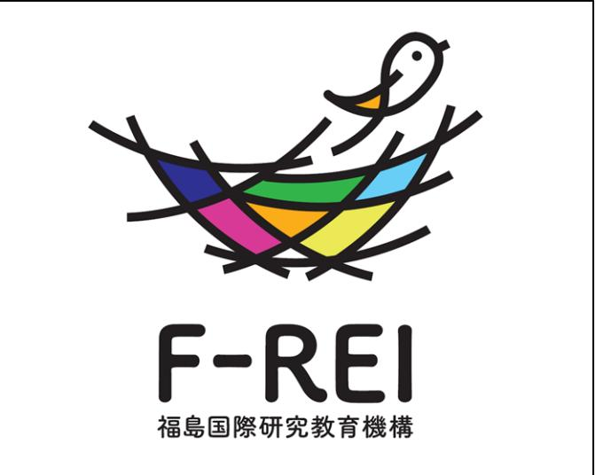

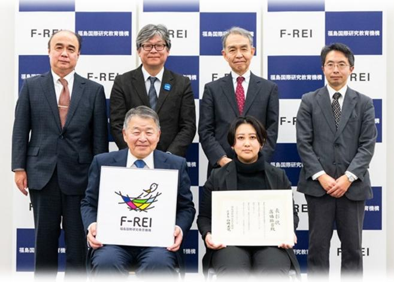

#### **令和6年1月18日(木) 市町村座談会の開催(川俣町)**

1月18日、第14回目となる市町村座談会を川俣町で実施いたしました。

座談会に先立ち、ベルグ福島株式会社とアサヒ通信株式会社を訪問し、視察及び意見交換を行ったほか、座談会では、立地企業の方々、地域で活躍されている方々にご参加いただき、多くのご意見をいただきました。

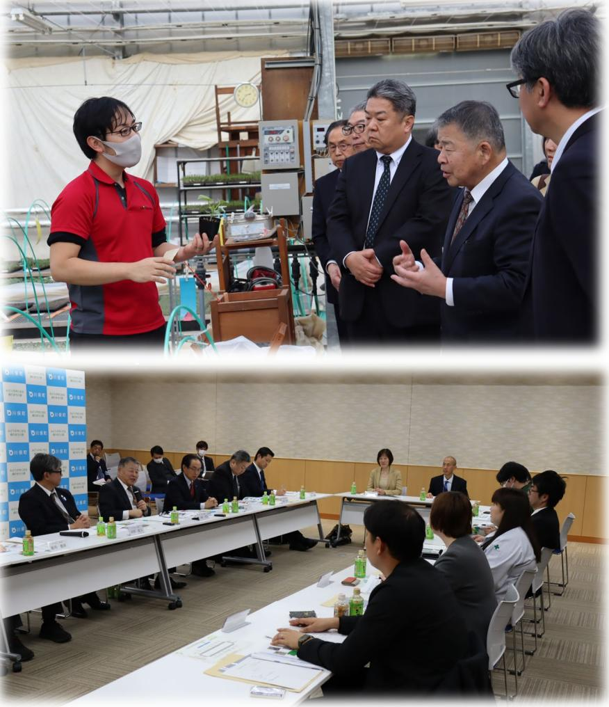

#### **令和6年1月25日(木) 株式会社東邦銀行との包括連携協力協定書の締結**

1月25日、株式会社東邦銀行とF-REIとの連携協力に関する協定書を締結しました(全体では8件目、企業としては1件目)。

今後、この協定に基づいて、互恵的な連携協力を進め、F-REIの認知度向上、地元企業とのネットワーク構築、研究成果の社会実装などを推進してまいります。

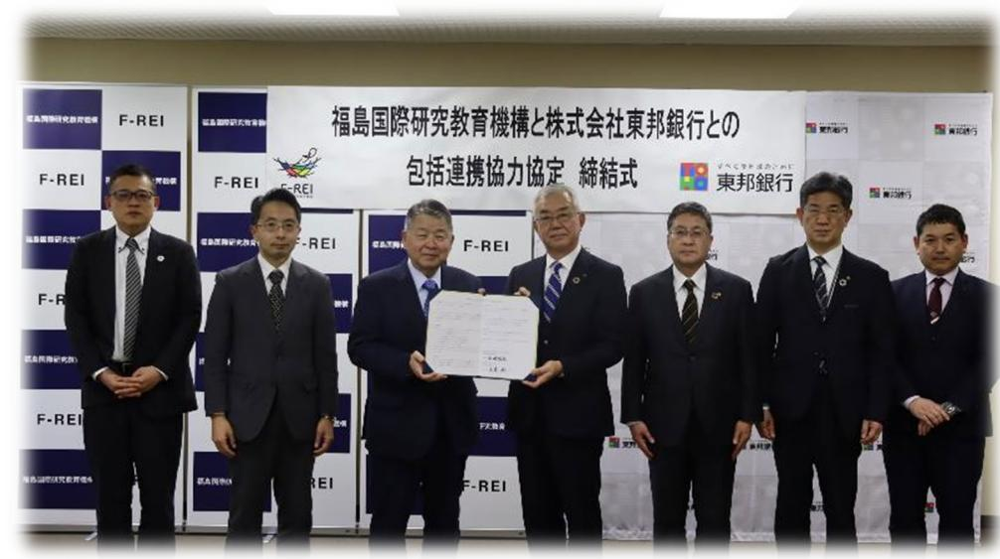

#### **令和6年1月30日(火) 市町村座談会の開催(双葉町)**

1月30日、第15回目となる市町村座談会を双葉町で実施いたしました。

今回は、株式会社アルメディオ、株式会社WorldLink & Company、浅野撚糸株式会社を訪問し、視察及び意見交換を行いました。

今回が、今年度計画していた浜通り地域等15市町村での座談会の締めくくりとなりました。

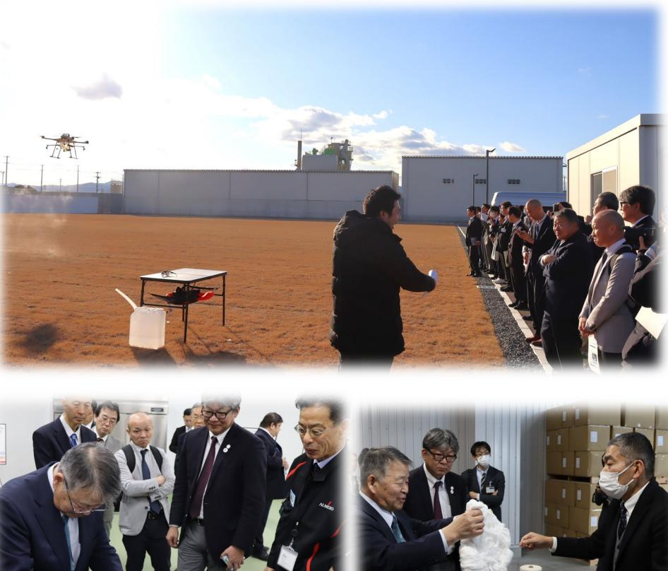

#### **令和6年2月1日(木) 双葉地方町村議会議員研修会での講演**

2月1日、双葉地方町村議会議員研修会において、同議会議員の方々に対して、理事長の山崎光悦が講演しました。

演題を「大学改革の経験を基盤に福島国際研究教育機構設立への挑戦」とし、F-REI設立の経緯や概要、これまでの活動や今後のビジョン、そして、F-REIと双葉地方の更なる連携等を念頭に理事長が思い描く浜通りの将来像などについて語りました。

本講演会は、町村議会議員としての一層の資質向上と今後の双葉郡の復興・再生に係る政策形成能力の向上に資するため実施されたもので、参加された双葉地方の町村議会議員や町村長等約100名の方々は、理事長のお話に熱心に耳を傾けられていました。

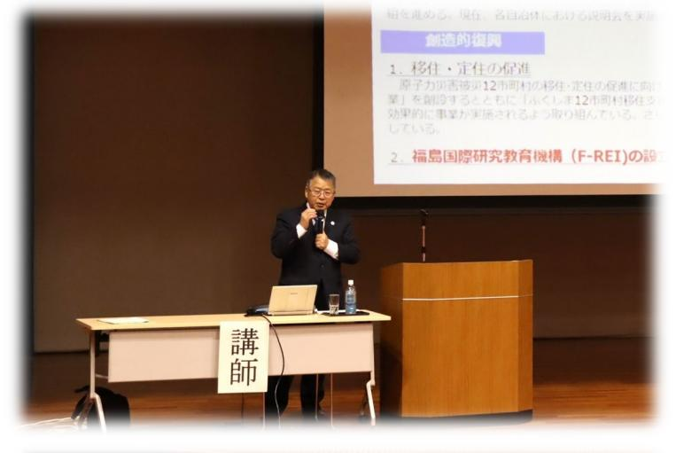

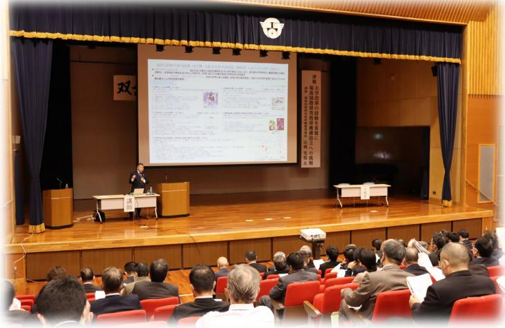

#### **令和6年2月21日(水) 令和5年度第2回アドバイザリーボードを開催**

2月21日、令和5年度第2回アドバイザリーボードを開催しました。

アドバイザリーボードには、4名のアドバイザーとF-REIの役員等が出席しました。初めに、F-REIに関する最近の動向等についてご説明を行ったのち、研究5分野の方針等についてアドバイザーとの活発な意見交換を通じて有意義なご助言をいただきました。

また、アドバイザリーボードの前後にはアドバイザーの方々に浜通り地域の施設等を見学いただき、地域に対する理解を深めていただきました。

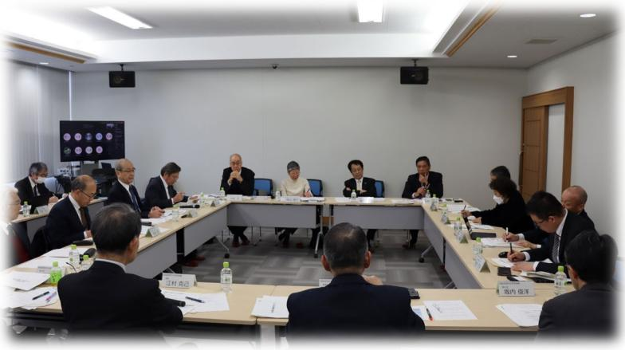

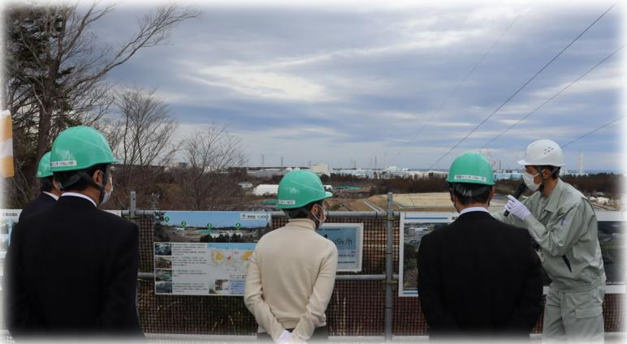

#### **令和6年2月23日(祝・金) エフレイ・フォーラムの開催**

2月23日、いわき市で、エフレイ初となるエフレイ・フォーラム-環境動態評価を活かしたまちづくり-を開催しました。

本フォーラムでは「環境動態評価を活かしたまちづくり」をテーマに、復興・再生まちづくりに向けたエフレイの活動と森林などの環境中の放射性物質の動きに関する研究成果等を報告するとともに、パネルディスカッションにおいて地域社会や研究・教育機関等で活動をされている方々とエフレイが果たす役割や期待することについて、熱く議論が交わされました。

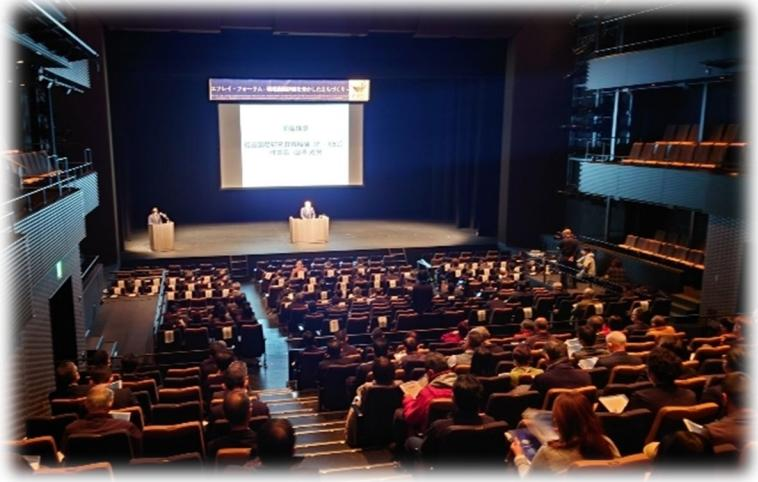

#### **令和6年3月8日(金) 東北大学との基本合意書の締結**

3月8日、東北大学とF-REIとの連携協力に関する基本合意書を締結しました(9件目)。

今後、この基本合意書に沿って、包括的な連携協力を進め、双方の資源を有効に用いるなど互恵的な連携協力を進めていきます。

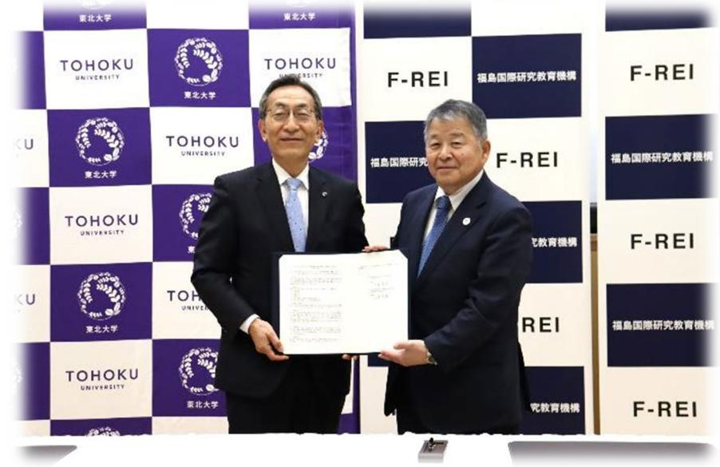

#### **令和6年3月8日(金) 東北大学と連携大学院(連携講座)を設置**

3月8日、東北大学とF-REIは教育・研究協力に関する協定書を締結しました(連携大学院としては1件目)。

この協定書に基づき、令和6年4月、同大大学院医学系研究科医科学専攻に連携大学院「放射線環境生体医学連携講座」 を開設し、放射線物質を含む種々の環境物質が人々の健康に与える影響の研究開発に当たる人材育成を進めます。

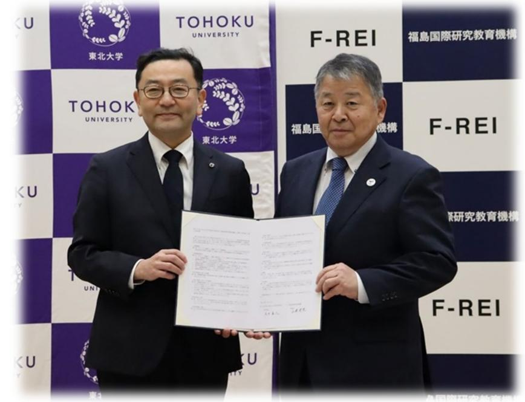

#### **令和6年3月28日(木) 放射性物質の分析人材育成(現地訪問型研修)を開催**

3月28日、放射性物質の分析人材育成 (現地訪問型研修)を開催しました。

この研修は、放射性物質の分析業務に従事する人材の裾野を広げることを目的に開催したもので、当日は、廃炉関連企業9名、小高産業技術高校5名、その他2名の16名の方にご参加いただき、福島第一原子力発電所、JAEA大熊分析・研究センター、JAEA廃炉環境国際共同センターを訪問し、廃炉作業の進捗状況や放射性物質の分析業務について学びました。

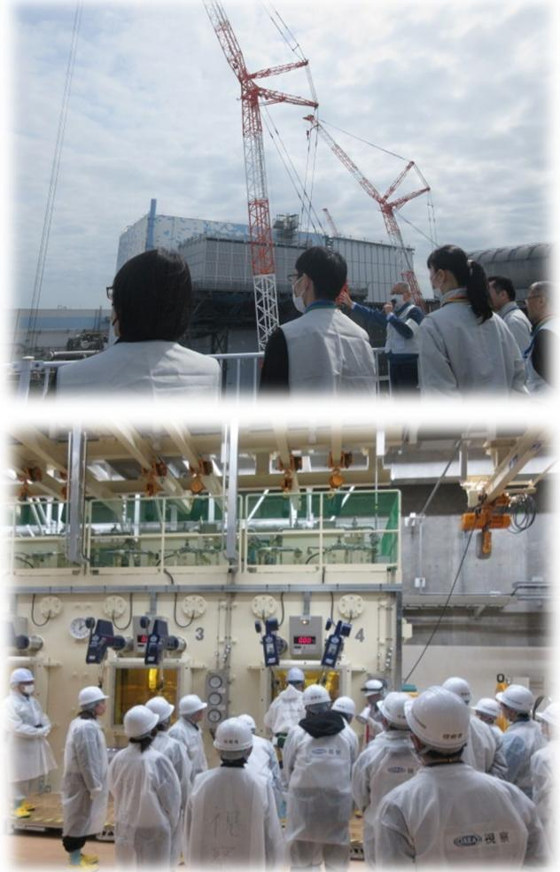

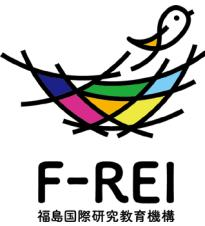

**世界に冠たる 「創造的復興の中核拠点」へ**

