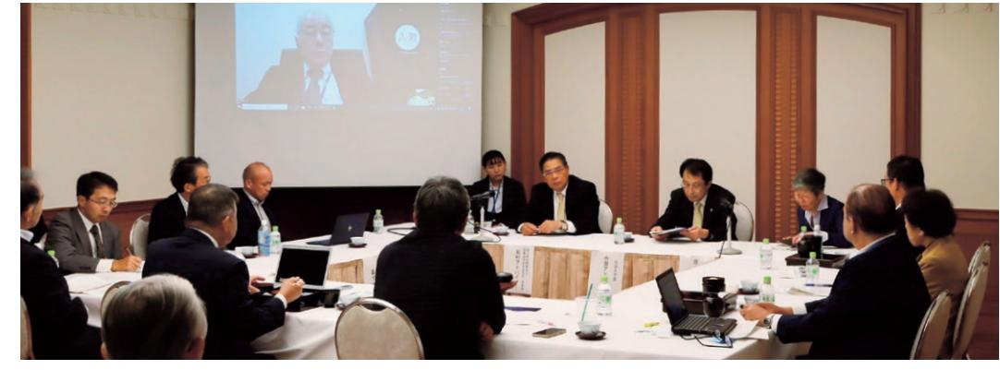
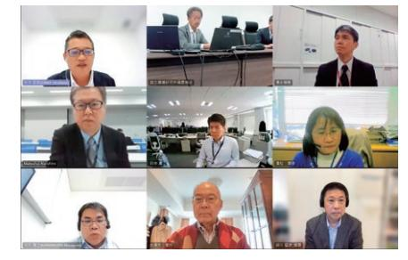
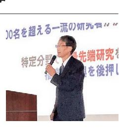
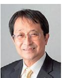
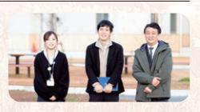

# **FukushimaInstituteforResearch, EducationandInnovation**

〒979-1521 福島県双葉郡浪江町大字権現堂字矢沢町6-1 ふれあいセンターなみえ内TEL: 0240-41-9970 | E-mail: madoguchi.h5x@f-rei.go.jp | https://www.f-rei.go.jp/

|
|  |

#### **2023年4 月 - 2024年3月**

福島国際研究教育機構

# **創造的復興の中核拠点**

F-REIは、福島をはじめ東北の復興を実現するための夢や希望となることをめざして誕生しました。福島の課題に立ち向かい、復興への道とその先の未来を切り拓くためには、産業や社会のしくみを転換できるイノベーションが必要で、そのイノベーションの創出には、将来を見据えた研究開発が不可欠です。

F-REIは研究者たちが世界最先端の研究開発に取り組める世界水準の環境を整え、そこから生まれる成果を福島・東北の復興に結びつけていきます。さらに、その効果を広く波及させ、「日本の科学技術力」と「産業競争力」を世界トップレベルへと牽引し、経済の再生と日本全体の成長につなげていきます。

研究開発から生まれた成果を、福島県浜通りを中心とした広域なフィールドを活かして実証・実装し、イノベーショ

これまで福島・東北で先行的に進められてきた復興に向けた活動を大切にしながら、F-REIが関係機関の連携を推進する役割を担うことで、大きな推進力を生み出します。

**司令塔**

**産業化**

**F-REIは、次の4つの機能を併せ持ち、これらの機能を複合的に結びつけることで、国内外に効果を波及させていきます。**

ンと新しい産業の創出に結びつけます。

# **4つの機能**

# **研究開発 1 2**

世界でも例を見ないほどの複合的な災害を経験した福島。この地だからこそ優位性を発揮できる5つの研究分野を定めて、世界最先端の研究を推進します。

**人材育成**

復興の先に未来を広げるために、大学院や大学・高等専門学校との連携や、小中高生に向けた実験教室やセミナーをはじめ、次世代を担う人材の育成に取り組みます。 **3 4**

# **5つの研究分野**

# **福島だからやるべき研究、福島だからできる研究を見定め、 5つの研究分野において、世界最先端の研究を進めます。**

| 1 | ロボット | 複合災害を経験した福島で、廃炉や災害現場等の過酷環境で機能を発揮するロボット・ドローンの研究開発を行います。 |
| --- | --- | --- |
| 2 | 農林水産業 | 震災により大規模な休耕地や山林を有する地域特性を考慮し、 |
|  |  | 新しい技術シーズの活用など、従来にはない次世代農林水産業に挑戦します。 |
| 3 | エネルギー | 既存の水素関連設備等を活用し、カーボンニュートラルを地域で実現します。 |
|  |  | 併せて先駆的なスマートコミュニティの実現に寄与します。 |
| 4 | 放射線科学・創薬医療、 | 福島の複合災害からの創造的復興の研究基盤として、放射線科学(核物理学、 |
|  | 放射線の産業利用 | 放射化学、核医学など)を据え、放射線やRIの利活用の検討を行います。 |
| 5 | 原子力災害に関するデータ | 福島の複合災害から得られる様々なデータを集積し、知見を伝承することで、 |
|  | や知見の集積・発信 | 来るべき今後の災害への対策に資するとともに、まちづくりに貢献します。 |

# 未来を見つめ、前を向いて、走り続けた 1 年間。

# **理事長山崎光悦**

F-REI(エフレイ)は、「福島復興再生特別措置法」という法律にもとづいて国が設立した特殊法人です。その初代理事長という任を務めることは、私にとって大きな決断でした。覚悟を決めるために福島県浜通りを視察させてもらい、報道を通して伝わってくる復興の知らせと、現地の実状に乖離があることが分かってきました。「ここには、自分にもやれること、やらなくてはならないことがある」という想いが湧き、残りの一生をぜんぶ懸けてもいいと決意しました。首相官邸を訪問し、岸田総理から任命状をいただいた時は、"身の引き締まる思い" というのはこういう時に使う言葉なのだなと改めて感じました。

2023 年 4 月 1 日、福島県浜通りの浪江町で開所式を行い、F-REIはその日からまさに一から全て手探りで前を見て走り続け、1年間が経過しました。

この1年間、私たちF-REIを支えてくださった全ての関係者の方々、応援していただいた全ての皆様方に改めて心より感謝申し上げます。設立から1年という機会を捉えて、 「1 年のあゆみ」と題した、我々の活動の一端をご紹介する冊子としてまとめました。

F-REIが掲げる 4 つの機能を軸に、私たちは日々活動を展開しています。「研究開発」においては、すでに在籍している研究者が研究を進めるとともに、2024 年度にかけて一定の研究人員が揃いつつあり、世界最高水準の研究開発に取り組める環境を、一歩ずつ着実に整備しています。「産業化」においては、福島県内の各市町村をまわって座談会な

どをひらき、さまざまな産業に携わる方々と直に話し合いを重ねながら地域の現状やニーズを把握し、我々が目指すべき方向を見定めることができました。3つ目の「人材育成」 では、2024 年 3 月に東北大学との連携協定を結び、医学系の研究科との大学院連携をはじめ、若手人材を中心として福島・東北に新たな研究基盤を根づかせようとしています。 さらに、福島の高等教育機関を訪問してトップセミナーをひらき、次世代を担うみなさんへのメッセージや科学技術の面白さを伝えてきました。そして、「司令塔」機能においては、関係施設との連携をはかるとともに、環境動態研究の施設統合等を進めることで、福島全体で一枚岩となって、大きな推進力を生み出したいと考えています。

F-REIが担うミッションは、一朝一夕に達成できるようなものではありませんが、一つひとつ活動を積み上げ、福島・東北のため、日本ひいては世界のために貢献できるよう、全身全霊で取り組んでまいります。

今後とも、御理解・御支援の程、改めてお願い申し上げます。

### **福島国際研究教育機構(F-REI)/理事長**

**山崎光悦(やまざき・こうえつ)**

富山県出身。1976年、金沢大学大学院工学研究科修士課程修了。1982 年、工学博士(大阪大学)。材料力学や設計工学の研究者として、1994年に金沢大学工学部教授。理事・副学長を経て、2014年に金沢大学長就任。2022年、金沢大学特別顧問、復興庁参与。2023年から福島国際研究教育機構(F-REI)理事長(現任)。

# **2023年4月1日**

# **F-REI開所式**

F-REIは、福島復興再生特別措置法に基づいて設立された特殊法人です。開所式には、岸田内閣総理大臣をはじめ、渡辺復興大臣、小島復興副大臣、竹谷復興副大臣、太田経済産業副大臣、内堀福島県知事、浜通り地域等15市町村長等がご臨席くださいました。

開所式では、主催者を代表して山崎理事長が、創造的復興の中核拠点として福島や東北の復興に貢献する決意を表明。挨拶に代えさせていただきました。

F-REIは、福島をはじめ東北の復興を実現するための、夢や希望となるものであるとともに、活動を通じて我が国の科学技術力の強化をけん引し、イノベーションの創出によって、産業構造の変革を推進していきます。また、その過程で我が国の産業競争力を世界最高の水準に引き上げ、経済成長や国民生活の向上に貢献する、世界に冠たる「創造的復興の中核拠点」を目指します。

# **2023年4月5日**

# **F-REI福島医大研究分室の開所式**

# **放射生態学ユニットの研究**

放射性物質が植物や淡水魚等へどのように移行、蓄積するのか、ラボスケールで実証実験しています。実験を通して現象への理解を深めつつ、これらに関与する因子の探索や、移行の抑制、蓄積量を低減するための方策を見出すことが研究の目的です。同時に、移行の抑制や蓄積量の低減化の評価結果を用いたリスクコミュニケーションを通じて、情報発信を進めます。

# **2023年4月15日**

# **F-REI設立記念シンポジウム(いわき市)**

F-REIの役割やビジョンを国内外に向けて広くPRし、学会や産業界との連携を推進、取組を加速させることを目的に、シンポジウムを開催しました。岸田内閣総理大臣をはじめ、ラファエル・マリアーノ・グロッシー国際原子力機関(IAEA)事務局長、ジュリア・ロングボトム駐日英国大使、ペールエリック・へーグベリ駐日スウェーデン大使からビデオメッセージをいただき、渡辺復興大臣、小島復興副大臣、竹谷復興副大臣及び内堀福島県知事にご臨席いただきました。

シンポジウムでは、山崎理事長によるF-REIの事業紹介、ヴァンサン・グレゴワール国際放射線単位測定委員会(ICRU)委員長及び浅川智恵子日本科学未来館館長による講演、地元企業による活動紹介や地元学生・生徒による発表、山崎理事長と地元企業、地元学生・生徒とのトークセッションを行いました。

福島県立医科大学の敷地内に、福島医大研究分室を置き、F-REIとして最初の研究組織である放射生態学ユニットが始動しました。同ユニットは、これまで量子科学技術研究開発機構(QST)放射線医学研究所の分室にて行われていた研究を引き継ぐ形で設置されたもので、当日は福島県立医科大学の竹之下理事長、QSTの星野理事など、関係者立ち合いのもと、開所式が執り行われました。これを皮切りに、F-REIの第1期中期目標期間である7年の間に、研究グループを50程度まで増やし、研究開発体制を充実させていく計画です。

# **2023年5月10日**

# **第1回新産業創出等研究開発協議会を開催(大熊町)**

新産業創出等研究開発協議会は、福島復興再生特別措置法第109条の規定に基づき、新産業創出等研究開発等施策の実施に関し必要な協議を行うため、開催されるものです。協議会には、F-REI、関係府省庁、福島県、研究機関、関係機関、浜通り地域等15市町村等の35の構成員により組織されています。

第1回は、渡辺復興大臣にもご臨席いただき、協議会運営要領及びワーキンググループの設置について決定したほか、F-REI中期計画、年度計画等の報告、構成員による意見交換を行いました。

会議では、各団体からF-REIに関連する取組等について報告があったほか、F-REIが果たすべき役割等に対する期待をいただき、議論が交わされました。

また、協議会に先立ち、開催地である大熊町の吉田淳町長の案内で、開校に向けて建設が進む「学び舎ゆめの森」等の現地視察を実施しました。

# **F-REIの骨太の方針が決定**

政府文書等を踏まえながら、F-REIの研究課題を設定する上で基盤となる方針をまとめました。 今後もこのビジョンと全体方針を土台としながら、分野毎の研究方針や具体的な研究課題の設定を行っていきます。

# **ビジョン**

- 福島をはじめ東北の復興を実現し、夢や希望となる創造的復興の中核拠点となる
- 世界水準の研究推進とその研究成果の社会実装・産業化をリードする
- 産業競争力を世界最高水準に引き上げ、日本経済と国民の暮らしに貢献する

#### **全体方針**

放射線科学の利活用や放射能汚染環境の動態計測に関する研究課題を基盤に、ロボット・ドローン技術や次世代農林漁業及びクリーンエネルギーなど福島浜通りの産業創生を牽引する最先端研究を推進する。

# **2023年7月7日~**

# **2023年度の研究公募を開始**

各分野、以下のテーマにて、2023 年度の研究公募を行いました。

## **ロボット分野**

- 困難環境下でのロボット・ドローン活用促進に向けた研究開発事業・災害現場など困難環境での活用が見込まれる強靭なロボット・ドローン技術の研究開発・多数のロボット・ドローンによる協調作業を実現する技術の研究開発・湖沼、森林内などでの調査に対応するロボット・ドローンの研究開発
- フィールドロボット等の市場化・産業化に向けた性能評価手法の標準化事業
- 長時間飛行・高ペイロードを実現し、カーボンニュートラルを達成するドローンの研究開発事業
- 防災・災害のためのドローンのセンサ技術研究開発事業
- 廃炉向け遠隔技術高度化及び宇宙分野への応用事業

# **農林水産業分野**

- 農林水産研究の推進事業
- ・土地利用型農業における超省力生産技術の技術開発・実証・輸出対応型果樹生産技術の開発・実証
- ・先端技術を活用した鳥獣被害対策システムの構築・実証・施設園芸におけるエネルギー循環利用技術体系の構築と実証
- ・化学肥料・化学農薬に頼らない耕畜連携に資する技術の開発・実証
- ・未利用農林水産資源を活用した新素材の開発
- ・福島浜通り地域等の農林水産業復興の将来方向性に関する研究
- ・福島浜通り地域等の農林水産業復興に資する研究事業

# **エネルギー分野**

- ネガティブエミッションのコア技術の研究開発・実証事業・植物のCO₂固定及びネガティブエミッションへの利用に関する研究開発と実証・藻類のCO₂固定及びネガティブエミッションへの利用に関する研究開発と実証
- バイオ統合型グリーンケミカル技術の研究開発事業
- 水素エネルギーネットワーク構築に関する研究開発事業

# **放射線科学・創薬医療、放射線の産業利用分野**

- 加速器を活用したRIの安定的かつ効率的な製造技術の開発
- 農作物の生産性向上や持続可能な作物生産に資するRIイメージング技術の開発及び導き出される生産方法の実証
- RIで標識した診断・治療薬に関する研究開発
- 超大型X線CT装置等を活用した産業のデジタル化技術の開発等に関する調査研究事業

## **原子力災害に関するデータや知見の集積・発信分野**

- 環境中の放射性物質の動態への人間活動の影響・移行抑制対策効果の評価手法開発事業
- 原子力災害からの復興に向けた課題の解決に資する施策立案研究事業
- 福島浜通り地域におけるまちづくり研究及びラーニング・コミュニティハブ整備事業・福島浜通り地域におけるまちづくり研究
- ・福島浜通り地域におけるラーニング・コミュニティハブの整備

過酷環境に対応するドローン・ロボット

農林水産業のスマート化 (農機制御システム)

カーボンニュートラルの実現 (バイオ・ケミカルプロセスによる化学製品等の製造)

復興・再生まちづくりの実践と効果検証研究

# **2023年9月27日**

# **第1回広域連携ワーキンググループを開催(楢葉町)**

「東日本大震災及び原子力災害の被害を受けた福島浜通り地域等において、30年後の社会を見据えた未来課題の解決を目指すこと」及び「F-REIと地域の市町村等が連携して地域の魅力を創出し、福島をはじめ東北の創造的復興に寄与すること」を目的に、新産業創出等研究開発協議会に広域連携ワーキンググループ (WG)を設置しました。WGには、F-REI、復興庁、福島県、浜通り地域等15市町村、福島イノベーション・コースト構想推進機構が参画し、F-REIが取り組む新産業

創出等の研究開発、産業化、人材育成等の効果が広域的に波及するよう、福島浜通り地域等を中心に、様々な形で市町村等とのパートナーシップによる連携等について調査・検討を行います。

第1回は、復興庁から概算要求、施設整備についての報告、F-REIから研究公募の状況についての報告、広域連携に関する取組についての説明の後、構成員による意見交換を行いました。

# **2023年10月12日**

# **第2回F-REI産学官ネットワーク・セミナーを開催(仙台市)**

企業等を巻き込んだ産学官の連携体制を構築すること、つながりを生む機会を創出することを目指して、産学官ネットワーク・セミナーを実施しており、F-REIを含めた産学官連携や産業化について、トークセッション等を行っています。

第2回は、「産学官連携・産業化」をテーマとし、一般社団法人東北経済連合会との共催で開催しました。東北に拠点を置く企業を中心に156名の方にご参加いただき、第1部として、これまでの産学官連携・産業化の

取組について、富谷市長/若生裕俊氏、AiCTコンソーシアム代表理事/海老原城一氏、株式会社マテリアル・コンセプト代表取締役CEO/小池美穂氏からご講演いただきました。また、第2部では宮城大学長・佐々木啓一氏をモデレーターに迎え、第1部の講師3名にF-REIの江村理事を加えた4名のパネリストによるトークセッションが行われ、これからの産学官連携・産業化及びF-REIに対する期待について議論していただきました。

# **2023年10月13日**

# **第1回アドバイザリーボードを開催(東京)**

アドバイザリーボードは、アドバイザーからF-REIの運営全般や各事業の状況等について、大所高所からのご助言をいただくため、開催するものです。

第1回は、石村和彦アドバイザー、永田恭介アドバイザー、原山優子アドバイザーが対面で、山名元アドバイザーはオンラインで参加し、F-REIからは山崎理事長をはじめ、役員、執行役、分野長、副分野長等が出席しました。

**2023年11月26日~12月1日**

**欧州拠点の国際アドバイザーと意見交換を実施 (英国、ドイツ、スウェーデン)**

山崎理事長が欧州に出張し、欧州に拠点を置く3名の国際アドバイザー:フィオナ・レイモン博士(英国)、ライムント・ノイゲバウアー博士(ドイツ)、スヴァンテ・リンドクヴィスト博士(スウェーデン)を訪問しました。

訪問時には、山崎理事長がそれぞれの国際アドバイザーに対してF-REIの事業を詳細に説明し、活動に対する理解を深めていただくとともに、F-REIを国際的な

初めに、F-REI側から取組紹介を行ったのち、研究活動の方向性や、拠点形成のあり方等についてアドバイザーとの活発な意見交換を実施しました。我が国の科学技術力・産業競争力の強化を牽引し、経済成長や国民生活の向上に貢献するというF-REIのミッション達成に向けた、貴重なご助言を多数いただきました。

研究拠点にするための方途等について、活発な意見交換を行いました。また、山崎理事長から国際アドバイザーに向けて、今後の来日等を含め、継続的な協力等も依頼しました。国際アドバイザーからの適切な助言、サポートのもと、F-REIの活動を推進していくことを改めて確認する機会となりました。

# **2023年12月8日**

# **第1回研究開発等ワーキンググループを開催(オンライン)**

研究開発等ワーキンググループ(WG)は、福島における新たな産業の創出、国際競争力の強化に資する研究開発・環境の整備、成果の普及、人材の育成・確保等の施策に関する関係機関の連携等について、検討を行うものです。第1回はリモートで開催し、復興庁から概算要求、施設整備についての報告、F-REIと各構成員から研究開発等の状況報告、意見交換を行いました。

# **2024年1月12日**

# **第2回新産業創出等研究開発協議会を開催(富岡町)**

第2回は、平木復興副大臣にもご臨席いただき、F-REIの活動状況や各ワーキンググループ開催内容についてF-REIから報告、令和6年度予算概算決定及び施設整備の状況について復興庁から報告した後、F-REIで実施した市町村座談会や広域連携ワーキンググループを通じて得られた課題等について、構成員による意見交換を行いました。

# **2024年1月12日**

# **F-REIロゴマーク最優秀作品決定**

F-REIでは、令和5年4月21日から6月30日の期間にかけて、ロゴマークの公募を行いました。全国125 名の方から応募されたロゴマークデザインに対しては、有識者による委員で構成される審査委員会の意見と、一般から寄せられたご意見等を踏まえて審査を実施しました。

その結果、高橋絢香さんのデザインが、最優秀作品として選出されました。わくわく感や親しみやすさにあふれ、斬新でオリジナリティがあり意欲的・挑戦的な作品であることが高く評価されました。併せて、F-REIのロゴマーク最優秀作品の決定に伴う表彰式を開催し、表彰状の授与やロゴマークの紹介、記念撮影等をとり行いました。

「F-REIが生まれた歴史と人々の想いが、未来につながっていくこと」が、このロゴマークのコンセプトです。個性ある6色で彩られている鳥の巣は、福島県を中心とした東北6県を、今まさに世界へと羽ばたこうとしている鳥は福島県の県鳥である「キビタキ」をモチーフに、デザインされています。

**2024年2月21日**

**第2回アドバイザリーボードを開催 (浪江町)**

第2回は、F-REI側からF-REIに関する最近の動向等について説明を行ったのち、研究5分野の方針等についてアドバイザーとの活発な意見交換を行い、有意

# **2024年2月23日**

**エフレイ・フォーラム ―環境動態評価を活かしたまちづくり― を開催(いわき市)**

エフレイ・フォーラムは、F-REIの活動や研究成果を報告するとともに、F-REIの役割等について議論を行うものです。

今回は、「環境動態評価を活かしたまちづくり」をテーマに、復興・再生まちづくりに向けたF-REIの活動と森林などの環境中の放射性物質の動きに関する研究成果等を報告しました。加えて当日は、パネルディスカッションも実施し、地域社会や研究・教育機関等で活動をされている方々とともに、F-REIが果たす役割やF-REIの今後に期待することなどについて、熱く議論を交わしました。

義なご助言をいただきました。また、アドバイザーの方々に浜通り地域の施設等も視察いただき、地域に対する理解を深めていただきました。

# **連携協力に関する基本合意書(MOU)等の締結**

**F-REIでは地域と一体となって活動を進めるために、福島県内の市町村、福島県に拠点を置く企業、大学・高校などの教育機関と基本合意書等を締結しています。 基本合意書等の締結により協力の輪を広げ、F-REIの認知度の向上や活動内容に対する理解を促進し、ともに福島の未来をつくっていくためのネットワークの構築を進めていきます。**

# *2023*

**福島工業高等専門学校との基本合意書を締結**

福島工業高等専門学校と、基本合意書を締結しました。相互の研究開発、人材育成等に関する連携協力を進めていきます。

# *4/5* **福島県立医科大学との基本合意書を締結**

福島県立医科大学と、基本合意書を締結しました。相互の研究開発、人材育成等に関する連携協力を進めていきます。

# *4/15* **いわき市との基本合意書を締結**

いわき市と、基本合意書を締結しました。情報交換、情報発信などについて、双方の資源を有効的に活用した協働活動を進めていきます。

# *5/17* **福島大学との基本合意書を締結**

福島大学と、基本合意書を締結しました。相互の研究開発、人材育成等に関する連携協力を進めていきます。

# *5/29* **浪江町との基本合意書を締結**

浪江町と、基本合意書を締結しました。情報交換、情報発信などについて、双方の資源を有効的に活用した協働活動を進めていきます。

# *5/30* **会津大学との基本合意書を締結**

会津大学と、基本合意書を締結しました。相互の研究開発、人材育成等に関する連携協力を進めていきます。

# *9/1* **南相馬市との基本合意書を締結**

南相馬市と、基本合意書を締結しました。情報交換、情報発信などについて、双方の資源を有効的に活用した協働活動を進めていきます。

# *2024*

# *1/25* **株式会社東邦銀行との包括連携協力協定書を締結**

株式会社東邦銀行と、包括連携協力協定書を締結しました。F-REIの認知度向上、地元企業とのネットワーク構築、研究成果の社会実装等に関する互恵的な連携協力を進めていきます。

# *3/8* **東北大学との基本合意書/教育・研究協力に関する協定書を締結**

東北大学と、基本合意書を締結しました。研究開発、人材育成等に関する連携協力を進めていきます。加えて教育・研究協力に関する協定書も締結し、同大大学院医学系研究科医科学専攻に連携大学院「放射線環境生体医学連携講座」を設置しました。F-REIとしての連携大学院第一号の取組となります。今後、両機関で連携して大学院生の教育、研究指導等の人材育成を進めていきます。

川俣町

田村市

飯舘村

葛尾村

川内村

いわき市

新地町

相馬市

南相馬市

浪江町

双葉町

大熊町

富岡町

楢葉町

広野町

# **市町村座談会**

**F-REIが行う研究開発・産業化・人材育成の取組における広域連携体制の構築を図るため、市町村や住民、企業・団体等、多様な主体と対話する場として、市町村座談会を浜通り地域等15市町村で実施しました。**

[6月20日/いわき市]農業法人(トマト)、エネルギー関連企業への視察を行い、座談会を実施しました。

[7月5日/南相馬市]農業法人(主にブロッコリー)、ワクチンを製造する企業、ロボット関連企業の現地視察を行い、座談会を実施しました。

[7月27日/葛尾村]酪農家、農業法人(花き)、エビの陸上養殖を行う企業の現地視察を行い、座談会を実施しました。

[8月9日/浪江町]農業法人(花き)、集成材製造施設、コンクリート製品製造企業の現地視察を行い、座談会を実施しました。

[8月29日/田村市]植物工場、森林組合、ピーマン・ホップ生産農家、バイオマス発電所の現地視察を行い、座談会を実施しました。

施設、大学のサテライト研究室の現地視察を行い、座談会を実施しました。

[10月11日/富岡町]廃炉関連製品製造企業、木材(パネルログ)製造企業の現地視察を行い、座談会を実施しました。

[10月17日/川内村]ワイナリー、建設機械部品工場の現地視察を行い、座談会を実施しました。

[10月23日/新地町]天然ガス発電所、樹脂製品製造工場の現地視察を行い、座談会を実施しました。

[11月6日/飯舘村]金属製品等製造企業、木質バイオマス発電所の現地視察を行い、座談会を実施しました。

[9月29日/広野町]火力発電所、バナナ栽培

[11月17日/楢葉町]遠隔操作機器開発実証施設、甘藷貯蔵施設の現地視察を行い、座談会を実施しました。

[12月4日/大熊町]インキュベーション施設、認定こども園・義務教育学校の現地視察を行い、座談会を実施しました。

[12月19日/相馬市]スマートコミュニティ実証施設、わさび栽培施設の現地視察を行い、座談会を実施しました。

[1月18日/川俣町]植物ワクチン工場、ワイヤーハーネス・ケーブル製造工場の現地視察を行い、座談会を実施しました。

[1月30日/双葉町]ナノマテリアル製造工場、ドローン整備工場、撚糸製造施設の現地視察を行い、座談会を実施しました。

**トップセミナー**

**F-REIでは、福島の創造的復興と発展を中長期的に支える地域の未来を担う若者世代等を対象とした人材育成の取組の一環として、F-REIの役員等が講師となり、最先端の科学技術の魅力と可能性等を学生・生徒へ伝えるトップセミナーを行っています。**

# **2023年5月17日**

# **福島大学/講師:山崎理事長**

「 福島大学食農学類の皆さんへ~これからどう過ごす?大学ライフのススメ~」を演題に、1 年生の約100名に向けたセミナーを行いました。

# **2023年5月30日**

**会津大学/講師:山崎理事長**

「会津大学コンピュータ理工学部の皆さんへ~これからどう過ごす?大学ライフのススメ~」を演題に、1年生など約240名に向けたセミナーを行いました。

# **2023年6月13日**

**相馬高校/講師:大和田執行役**

2年生約160名に向けて、大和田執行役の専門分野である解剖学、神経科学に根差した"教育、研究、イノベーションの重要性"を伝えました。

# **2023年6月30日**

**会津学鳳中学校・高校/講師:大和田執行役**

「私の医学研究とF-REI」を演題に、中・高生約680名に向けたセミナーを実施しました。生徒からは「おもしろかった」「分かりやすかった」という感想をいただきました。

# **2023年7月4日**

**会津高校/講師:中西監事**

「植物の謎:私の歩んできた道」 を演題に、2年生約240名に向けたセミナーを実施しました。 講演後、積極的に質問する生徒もおり、関心の高さがうかがえました。

# **2023年7月13日**

# **小高産業技術高校/講師:森下監事**

「福島国際研究教育機構目指すロボット研究」を演題に、2年生約100名に向けたセミナーを実施しました。ロボット研究の未来について、熱いメッセージを伝えました。

| 2023年8月31日 |
| --- |
| 安積高校/講師:大和田執行役 |
| 「私の医学研究とF-REIが目指 |
| すもの」を演題に、2年生など |
| 約40名に向けたセミナーを実 |
| 施し、次世代のイノベーション |
| を支える生徒たちへのメッセー |
| ジを伝えました。 |

## **2023年9月12日**

**ふたば未来学園高校/講師:山崎理事長**

「ふたば未来学園高校のみなさんへ~未来のリーダーとなるために~ 」を演題に、2年生約 130名に向けたセミナーを実施し、「考え抜く力」の重要性などを伝えました。

| 5月17日 | 福島大学 | 会津高校 7月4日 |
| --- | --- | --- |
| 5月30日 | 会津大学 | 7月13日小高産業技術高校 |
| 6月13日 | 相馬高校 | 8月31日安積高校 |
| 6月30日 | 会津学鳳中学校・高校 | 9月12日ふたば未来学園高校 |

# **2023年9月25日**

# **福島工業高等専門学校/講師:森下監事**

「福島国際研究教育機構ロボットの知能化研究」を演題に、機械システム工学科と電気電子システム工学科の3年生約70名に向けてセミナーを実施し、活発な質疑応答も行われました。

# **2023年9月26日**

**福島工業高等専門学校/講師:山崎理事長**

「21世紀を生き抜く諸君に伝えたいこと~福島工業高等専門学校の皆さんへ~」を演題に、化学・バイオ工学科、都市システム工学科、ビジネスコミュニケーション学科の3年生約120名を対象に実施しました。

| 2023年10月4日 |
| --- |
| 福島県立医科大学/講師:中西監事 |
| 「アイソトープと放射線は新し |
| い研究を拓く素晴らしいツー |
| ル」を演題に、1年生約180名 |
| に向けて、放射線利用の可能 |
| 性などを伝えました。 |

# **2023年10月4日**

# **福島高校/講師:大和田執行役**

「私の医学研究とF-REI」を演題に、1年生約50名に向けてセミナーを実施しました。「経験が将来の糧となる」など、次世代を担う生徒たちにエールを送りました。

| 9月25日 | 福島工業高等専門学校 |
| --- | --- |
| 9月26日 | 福島工業高等専門学校 |
| 10月4日 | 福島県立医科大学 |
| 10月4日 | 福島高校 |

| 11月7日 | 東日本国際大学 |
| --- | --- |
| 11月24日 | 福島大学 |
| 12月1日 | 磐城高校 |
| 12月7日 | 原町高校 |

# **2023年11月7日**

**東日本国際大学/講師:山崎理事長**

「東日本国際大学のみなさんへ ~未来のリーダーとなるために~」 を演題に、経済経営学部、健康福祉学部の2年生約60名に向けて、先端科学技術の魅力と可能性等を伝えました。

# **2023年11月24日**

**福島大学/講師:江村理事**

「イノベーションを担う人材になろう!~学生時代にチャレンジして欲しいこと~」を演題に、共生システム理工学類の1年生約170名に向けて、光通信技術の研究者としてのメッセージを伝えました。

# **2023年12月1日**

**磐城高校/講師:森下監事**

「機械工学~医工学最先端研究」を演題に、2年生約280名を対象に、人工知能や医工学などの最先端研究について紹介しました。

# **2023年12月7日**

# **原町高校/講師:大和田執行役**

「私の医学研究とF-REI」を演題に、2年生約140名に向けたセミナーを実施しました。「将来、福島や世界を担う人材になってほしい」などのメッセージを伝えました。

# **理事長・理事・執行役・監事**

# **理事長山崎光悦**

1976 金沢大学大学院工学研究科修士課程修了 1982 工学博士(大阪大学) 1994 金沢大学工学部教授 2014 金沢大学長

# **理事(研究開発管理) 江村克己**

1982 東京大学大学院工学系研究科修士課程修了 1992 工学博士(東京大学) 2016 日本電気株式会社取締役執行役員常務兼CTO 2022 日本電気株式会社シニアアドバイザー 2023 現職

2022 金沢大学特別顧問 2022 復興庁参与 2023 現職

## 1989 東北大学医学部卒業(医師免許) 1996 東北大学大学院医学系研究科医学履修課程修了(医学博士) 2006 山口大学大学院医学系研究科教授 2015 東北大学大学院医学系研究科教授 2020 東北大学総長特別補佐 2023 現職 **執行役(事業企画・産業化) 坂内俊洋執行役(人材育成・国際・外部資金) 大和田祐二**

1978 東京大学大学院理学系研究科博士課程修了(理学博士) 2001 東京大学大学院農学生命科学研究科教授

2014 内閣府原子力委員会委員 2016 東京大学名誉教授・特任教授 2019 星薬科大学長(現名誉教授)

1998 コロンビア大学SchoolofInternationalandPublicAffairs卒業(MPA:行政管理学修士)

1992 東京大学理学部化学科卒業

**理事(運営総括) 木村直人**

2022 文部科学省審議官

2023 現職

2023 現職

1983 東京大学大学院工学系研究科博士課程修了(工学博士) 1997 横浜国立大学工学部教授 2015 横浜国立大学理事・副学長 2020 横浜国立大学名誉教授 2021~ 新潟県立大学理事 2023 現職

# **分野長・副分野長**

# **国際アドバイザー**

## **スヴァンテ・リンドクヴィストノーベル博物館創設者**

スヴァンテ・リンドクヴィスト博士は、科学技術史学の国際的に著名な研究者でスウェーデン王立アカデミー会長 (2009-2012)や、スウェーデン王宮府長官(2010-2018) を務めました。またスウェーデンのストックホルムにノーベル博物館を創設し、初代館長を11年間にわたり務めました。日本とスウェーデンの学術交流にも大きく寄与してお

#### **フィオナ・レイモンOECD/NEA運営委員会副議長**

り、日本学士院客員も務めています。

フィオナ・レイモン博士は原子力分野において30年間にわたり戦略的・運用上の貢献をしてきました。化学・工学の専門家として英王立工学アカデミー、英王立化学協会、及び英国立原子力研究所のフェローを務めています。国際原子力会議において、定期的に基調講演を行っているほか、経済協力開発機構/原子力機関(OECD/NEA)運営委員会副議長も務めています。また、科学における参加の多様性拡大を長年支援し、原子力分野における女性や障害者などの参加の取組を先導しています。

# **国内アドバイザー**

#### **石村和彦産総研理事長**

1979 東京大学大学院工学系研究科修士課程修了

- 2008 旭硝子(現AGC)代表取締役兼社長執行役員
- 2015 旭硝子代表取締役会長(~2021) 2018~ 一般社団法人経済同友会副代表幹事
- 2020~ 国立研究開発法人産業技術総合研究所 (産総研)理事長
- 2021~ 産総研最高執行責任者兼務

# **原山優子東北大学名誉教授**

- 1996 ジュネーブ大学教育学博士課程修了(教育学博士) 1997 ジュネーブ大学経済学博士課程修了(経済学博士) 2002 東北大学大学院工学研究科教授 2013 総合科学技術・イノベーション会議常勤議員(~2018) 2013~ 東北大学名誉教授
- 2020 理化学研究所理事(~2022)

# **理事長特別顧問**

## **南場智子株式会社ディー・エヌ・エー代表取締役会長**

1999 株式会社ディー・エヌ・エー設立代表取締役社長(~2011) 2017~ 株式会社ディー・エヌ・エー代表取締役会長 2021~ 日本経済団体連合会副会長

# **ライムント・ノイゲバウアーフラウンホーファー研究機構前理事長**

ライムント・ノイゲバウアー博士は、ドイツに拠点を置き世界をリードする応用研究機関であるフラウンホーファー研究機構の理事長(2012-2023)を11年間にわたり務めました。ドレスデン工科大学で機械工学を学び、フラウンホーファー工作機械・成形技術研究所長(1994-2012)やケムニッツ工科大学(TUChemnitz)工作機械・生産過程研究所所長(2000-2012)を務めました。2022年からドイツ首相未来評議会委員を務めています。

# **スブラ・スレッシュ米国NSF元長官**

スブラ・スレッシュ博士は、材料科学・工学、機械工学、生物工学及び健康科学技術の分野における国際的に著名な研究者であり、米国国立科学財団( NSF )の長官 (2010-2013)を務めました。スレッシュ博士のリーダーシップの下、NSFのプログラムやイニシアチヴにより、米国は科学・工学の最先端にあって、次世代の科学者・工学者を育成し、経済成長とイノベーションを進展させました。また、カーネギーメロン大学長(2013-2017)及び南洋工科大学長 (2018-2022)を歴任しました。

# **永田恭介筑波大学長**

| 1981 東京大学薬学研究科博士課程修了 |
| --- |
| 1985 国立遺伝学研究所分子遺伝研究系助手 |
| 1991 東京工業大学生命理工学部助教授 |
| 2001 筑波大学基礎医学系教授 |
| 2013~ 筑波大学長 |

# **山名元**

| NDF理事長 |
| --- |

| 1981 東北大学大学院工学研究科博士課程修了 |
| --- |
| (工学博士) |
| 2002 京都大学原子炉実験所 |
| バックエンド工学研究部門教授 |
| 2013 国際廃炉研究開発機構(IRID)理事長(~2014) |
| 2015~ 原子力損害賠償・廃炉等支援機構(NDF)理事長 |

#### **山下俊一福島県立医科大学副学長**

2013 長崎大学理事・副学長(~2017) 2018~ 福島県立医科大学理事長特別補佐・副学長 2021 量子科学技術研究開発機構量子生命・医学部門放射線医学研究所長(~2023)

※文中の肩書は、すべて掲載当時のものです。

| 2023年 |  |
| --- | --- |
| 4月1日 | F-REI開所式 |
| 4月1日 | 福島工業高等専門学校との基本合意書を締結 |
| 4月5日 | F-REI福島医大研究分室の開所式 |
| 4月5日 | 福島県立医科大学との基本合意書を締結 |
| 4月7日 | 中期計画及び助成等業務実施計画の認可 |
| 4月14日 | 国際アドバイザーの決定 |
| 4月15日 | F-REIいわき出張所の開所式 |
| 4月15日 | いわき市との基本合意書を締結 |
| 4月15日 | F-REI設立記念シンポジウムを開催(いわき市) |
| 4月19日 | ICRU国際シンポジウム |
|  | 「福島復興と放射線計測」を開催(いわき市) |
| 4月28日 | 令和5年度の研究開発等業務の運営に関する |
|  | 計画(年度計画)の届出 |
| 5月1日 | 国内アドバイザーの決定 |
| 5月8日 | 理事長特別顧問の決定 |
| 5月10日 | 第1回新産業創出等研究開発協議会を開催 |
|  | (大熊町) |
| 5月17日 | 福島大学との基本合意書を締結 |
| 5月17日 | F-REIトップセミナーを開催(福島大学) |
| 5月29日 | 浪江町との基本合意書を締結 |
| 5月30日 | 会津大学との基本合意書を締結 |
| 5月30日 | F-REIトップセミナーを開催(会津大学) |
| 6月13日 | F-REIトップセミナーを開催(相馬高校) |
| 6月20日 | 市町村座談会を開催(いわき市) |
| 6月29日 | ドイツ出張(理事長ほか: |
| ~7月4日 | フラウンホーファー研究機構本部等を訪問) |
| 6月30日 | F-REIトップセミナーを開催 |
|  | (会津学鳳中学校・高校) |
| 7月4日 | F-REIトップセミナーを開催(会津高校) |
| 7月5日 | 市町村座談会を開催(南相馬市) |
| 7月7日 | 「農林水産研究の推進」委託事業の公募開始 |
| 7月13日 | F-REIトップセミナーを開催 |
|  | (小高産業技術高校) |
| 7月14日 | 分野長、副分野長の決定 |
| 7月27日 | 市町村座談会を開催(葛尾村) |
| 7月28日 | 「バイオ統合型グリンケミカル技術の研究開発」 |
|  | 委託事業の公募開始 |

| 7月28日 | 「ネガティブエミッションのコア技術の |
| --- | --- |
|  | 研究開発・実証」委託事業の公募開始 |
| 8月2日 | 「フィールドロボット等の市場化・産業化に |
|  | 向けた性能評価手法の標準化事業」委託事業の |
|  | 公募開始 |
| 8月4日 | 「廃炉向け遠隔技術高度化及び宇宙分野への |
|  | 応用事業」委託事業の公募開始 |
| 8月4日 | 「困難環境下でのロボット・ドローン活用促進に |
|  | 向けた研究開発事業」委託事業の公募開始 |
| 8月4日 | 「環境中の放射性物質の動態への人間活動の |
|  | 影響・移行抑制対策効果の評価手法開発」 |
|  | 委託事業の公募開始 |
| 8月4日 | 「原子力災害からの復興に向けた課題の解決に |
|  | 資する施策立案研究」委託事業の公募開始 |
| 8月4日 | 「福島浜通り地域におけるまちづくり研究及び |
|  | ラーニング・コミュニティハブ整備事業」 |
|  | 委託事業の公募開始 |
| 8月8日 | 「農作物の生産性向上や持続可能な作物生産に |
|  | 資するRIイメージング技術の開発及び導き |
|  | 出される生産方法の実証」委託事業の公募開始 |
| 8月9日 | 市町村座談会を開催(浪江町) |
| 8月10日 | 「水素エネルギーネットワーク構築に関する |
|  | 研究開発」委託事業の公募開始 |
| 8月29日 | 市町村座談会を開催(田村市) |
| 8月30日 | 「超大型X線CT装置等を活用した産業の |
|  | デジタル化技術の開発等に関する |
|  | 調査研究事業」委託事業の公募開始 |
| 8月31日 | F-REIトップセミナーを開催(安積高校) |
| 9月1日 | 南相馬市との基本合意書を締結 |
| 9月1日 | 「防災・災害のためのドローンのセンサ技術研究 |
|  | 開発事業」委託事業の公募開始 |
| 9月12日 | 県内高校理科教員向け講演会を実施 |
|  | (ふたば未来学園高校) |
| 9月12日 | F-REIトップセミナーを開催(ふたば未来学園高校) |
| 9月15日 | 「加速器を活用したRIの安定的かつ効率的な |
|  | 製造技術の開発」委託事業の公募開始 |
| 9月25日 | F-REIトップセミナーを開催 |
|  | (福島工業高等専門学校) |

| 9月26日 | F-REIトップセミナーを開催 |
| --- | --- |
|  | (福島工業高等専門学校) |
| 9月27日 | 第1回広域連携ワーキンググループを開催 |
|  | (楢葉町) |
| 9月29日 | 市町村座談会を開催(広野町) |
| 10月1日 | 米国出張(理事長ほか:米国パシフィック・ |
| ~10月7日 | ノースウェスト国立研究所(PNNL)等を訪問) |
| 10月4日 | F-REIトップセミナーを開催(福島県立医科大学) |
| 10月4日 | F-REIトップセミナーを開催(福島高校) |
| 10月4日 | 「長時間飛行・高ペイロードを実現し、 |
|  | カーボンニュートラルを達成するドローンの |
|  | 研究開発事業」委託事業の公募開始 |
| 10月11日 | 市町村座談会を開催(富岡町) |
| 10月12日 | 第2回F-REI産学官ネットワーク・セミナーを開催 |
|  | (仙台市) |
| 10月13日 | 第1回アドバイザリーボードを開催(東京) |
| 10月15日 | 親子わくわく科学実験教室を開催(浪江町) |
| 10月17日 | 市町村座談会を開催(川内村) |
| 10月23日 | 市町村座談会を開催(新地町) |
| 10月26日 | 出前授業を実施(福島工業高等専門学校) |
| 11月6日 | 市町村座談会を開催(飯舘村) |
| 11月7日 | F-REIトップセミナーを開催(東日本国際大学) |
| 11月10日 | 「RIで標識した診断・治療薬に関する研究開発」 |
|  | 委託事業の公募開始 |
| 11月15日 | 出前授業を実施(早稲田大学) |
| 11月17日 | 市町村座談会を開催(楢葉町) |
| 11月21日 | 福島高専教職員向け講演会を実施 |
|  | (福島工業高等専門学校) |
| 11月24日 | 会津大学の学生等にF-REI説明会を実施 |
|  | (浪江町) |
| 11月24日 | F-REIトップセミナーを開催(福島大学) |
| 11月26日 | 欧州出張(理事長ほか:欧州拠点の |
| ~12月1日 | 国際アドバイザーと意見交換を実施) |
| 12月1日 | F-REIトップセミナーを開催(磐城高校) |
| 12月4日 | 市町村座談会を開催(大熊町) |
| 12月7日 | F-REIトップセミナーを開催(原町高校) |
| 12月8日 | 第1回研究開発等ワーキンググループを開催 |
|  | (オンライン) |

| 12月19日 | 市町村座談会を開催(相馬市) |
| --- | --- |
| 12月26日 | 県北・相双地区の自然科学系部活動の高校生に |
|  | F-REI説明会を実施(双葉町) |
| 2024年 |  |
| 1月8日 | 高専生の企画による小中学生の学びの場 |
|  | (体験講座:エフレイ・サイエンスラボ |
|  | 「放射線をさがせ」)を開催(いわき市) |
| 1月12日 | 第2回新産業創出等研究開発協議会を開催 |
|  | (富岡町) |
| 1月12日 | F-REIロゴマーク最優秀作品決定 |
| 1月18日 | 市町村座談会を開催(川俣町) |
| 1月25日 | 株式会社東邦銀行との包括連携協力協定書を |
|  | 締結 |
| 1月30日 | 市町村座談会を開催(双葉町) |
| 2月21日 | 第2回アドバイザリーボードを開催(浪江町) |
| 2月23日 | エフレイ・フォーラムー環境動態評価を |
|  | 活かしたまちづくりーを開催(いわき市) |
| 3月1日 | ユニットリーダー(PI)の公募開始 |
|  | (ロボット分野・エネルギー分野) |
| 3月8日 | 東北大学との基本合意書/教育・連携協力に |
|  | 関する協定書を締結 |
| 3月28日 | 現地訪問型研修 |
|  | (放射性物質の分析人材育成)を実施 |

## **江村克己理事(研究開発管理)**

分野長、副分野長、委託先の研究者をはじめとする多くの方々との議論により、F-REIの研究開発が目指すべきところを明確にしました。同じ頂を目指す仲間をさらに増やしながら地域に価値をもたらすための取り組みを着実に進めます。

### **坂内俊洋執行役(事業企画・産業化)**

令和5年度、日経平均株価がバブル期最高値を超え、日本初の月面着陸が成功しました。F-REIが設立されたこの年度から福島をはじめわが国は元気になった、と後に多くの国民に振り返ってもらえるようになればいいなと思います。

## **森下信監事(非常勤)**

幕末に活躍した多くの秀才の精神的支柱となった儒学者・佐藤一斎が、言志四録に残した言葉のなかに、「一燈を提げて暗夜を行く暗夜を憂うる勿れ只一燈を頼め」とあります。200年程前のことばが生きています。

#### **木村直人理事(運営総括)**

4月に活動を始めて以来、ドタバタの中、あっという間の1年間でした。我々の活動は歩みが遅いように見えますが、小さな積み重ねが必ずや大きな形となってお見せできる日が来ます。その日を楽しみにお待ちください!

## **大和田祐二執行役(人材育成・国際・外部資金)**

F-REIから望む美しい阿武隈の山波は、昔の景色そのままです。しかしながらこの1年で、町と人の復興は、まさに道半ばだと痛感しました。F-REIが 1日も早く地域に根付き、復興のお役に立てるよう頑張ります。

## **中西友子監事(非常勤)**

浪江町に腰を据え始めて1年。まだ仮住まいですが、関係者皆一丸となって努力してきた結果、F-REIは何とか形が見えてきたところです。これからの本格的な稼働に向けてさらに邁進していきたいと思っております。

# **「***F-REI 1***年のあゆみ」広報チーム/編集後記**

「エフレイ」ってなに?ここからの出発でしたが、早いもので1年が経ちました。 そして「みんなが憧れる存在(場所)になってみせる」の熱い想いでこれからも進みます。 我々のこれからの活動にどうぞご期待ください!(編集委員:田中、川口、松葉)

