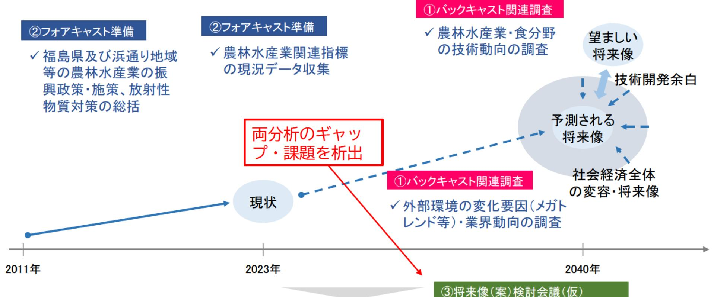

# 【調査研究概要】

今後20〜30年後の福島浜通り地域の農業 - 畜産業・林業・漁業・水産業を取り巻く情勢やグローバル全体・日本全体のマクロ的な変化を踏まえて、福島浜通り地域等の農林水産業の将来像を定義し、農業・畜産業・林業・漁業・水産業の産業振興や新産業の創出に向けて研究開発が求められる農林水産業分野の技術について考察する。

社会全体の将来的な変容(技術ニーズ調査)に基づくバックキャストの予測と現状を起点とするシミュレーションによるフォアキャストの予測を分析する。その上で前提にとらわれない福島浜通り地域の農林水産業の将来像・方向性を示し、浜通り地域の将来的な農林水産業を踏まえたテクノロジーニーズの整理と技術活用・普及に対する地域の適否を整理する。(様々な分野の有識者等との意見交換等を踏まえ、将来像(案)を考察する。)
