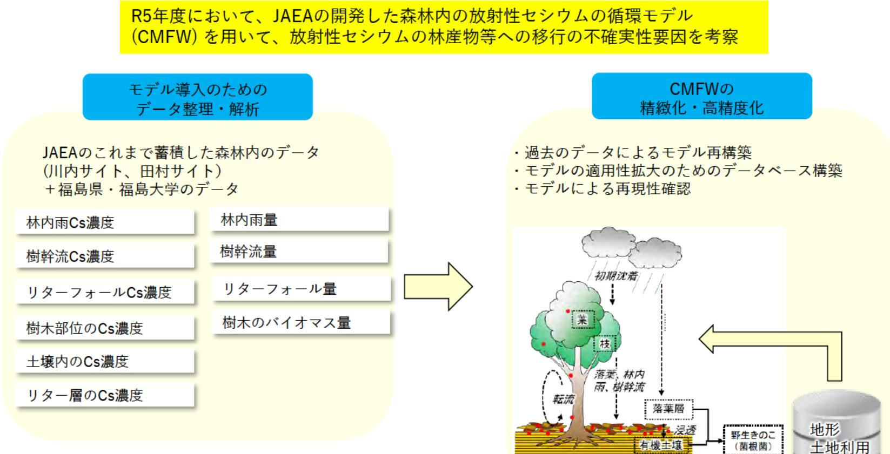

# 環境中の放射性物質の動態への人間活動の影響・移行抑制対策効果の評価手法開発

## 事業概要

森林等の陸域に沈着した放射性物質への避難解除後の人間活動による影響を評価し、その動きの抑制対策の妥当性を評価可能にし、福島復興に向けた安全安心なまちづくりに貢献するため、これまでJAEAが事故以来取得してきた森林内のデータを整理・解析することにより、物質循環モデルの精緻化・高精度化を図る。

R5年度において、JAEAの開発した森林内の放射性セシウムの循環モデル（CMFW）を用いて、放射性セシウムの林産物等への移行の不確実性要因を考察

### モデル導入のためのデータ整理・解析

JAEAのこれまで蓄積した森林内のデータ（川内サイト、田村サイト）+福島県・福島大学のデータ

林内雨Cs濃度
林内雨量
樹幹流Cs濃度
樹幹流量
リターフォールCs濃度
リターフォール量
樹木部位のCs濃度
木のバイオマス量
土壌内のCs濃度
リター層のCs濃度

### CMFWの精緻化・高精度化

- 過去のデータによるモデル再構築
- モデルの適用性拡大のためのデータベース構築
- モデルによる再現性確認
