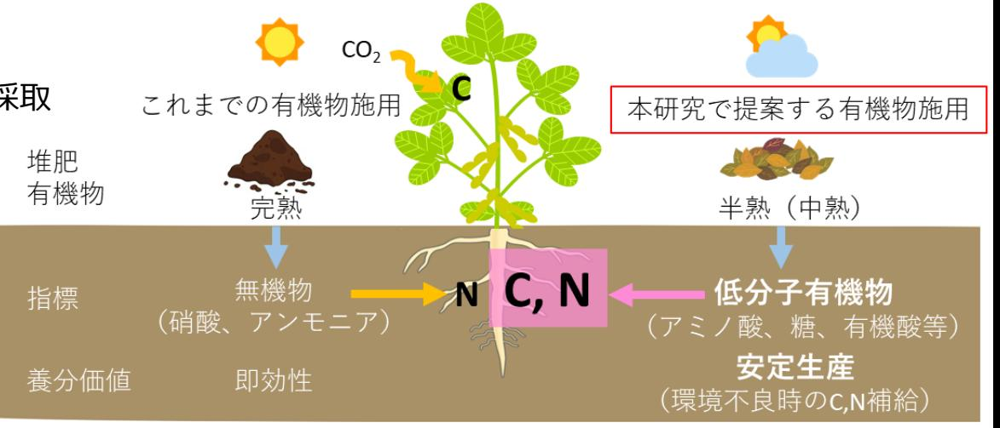

# 土壌低分子有機物の植物栄養学的影響の解明 事業概要

F-REI

| 募集課題名 | 第２分野 令和５年度「福島国際研究教育機構における農林水産研究の推進」委託事業 テーマ（５）化学肥料・化学農薬に頼らない耕畜連携に資する技術の開発・実証 |
|--------------|------------------------------------------------------------------------------------------------------------------------------------------|
| 研究実施者 | 二瓶 直登（土壌低分子有機物の植物栄養学的影響の解明コンソーシアム（福島大学（代表機関）、理化学研究所、京都大学、東京大学、北海道大学、筑波大学、東北大学、東京農工大学）） |
| 実施予定期間 | 令和１１年度まで（ただし実施期間中の各種評価等により変更があり得る） |

## 【背景・目的】

- 放射能汚染:福島県浜通りでは除染として**表土剥取り**を実施
- 現代農業 :化成肥料依存で**土壌劣化**(世界の33%は劣化, FAO)
  
  有機物施用による**作土層の 回復**(土作り)が急務
- 有機物施用:効果が千差万別で、**経験と勘**に頼る難しさ
- 有機物評価:有機物は分解し低分子有機物、無機物となる養分 評価は、無機物の量による評価が基本  
  
  植物は低分子有機物を利用する報告もあり、 **新たな視点**で有機物の養分価値を評価

土壌の**低分子有機物**が植物の養分(C,N源)となるか、どのような条件下で**その効果が高い**かを検証

## 【研究方法(手法・方法)】

- 福島県内の堆肥連用圃場、慣行圃場等から土壌を採取
- 光、温度等環境条件を変えて作物栽培
- 作物生育に影響を与える土壌の低分子有機物、微生物叢等の要因を多面的に解明
- 植物が利用する低分子有機物の吸収代謝を解明
- 低分子有機物を活かした栽培法の開発

## 【期待される研究成果】

- 有機物施用の科学的な根拠を示し、肥沃度の新指標の提示による有機農業の拡大につなげる
- 安定生産を目的とした堆肥の施用法開発し、適正な有機物の投入量による環境保全に寄与する

