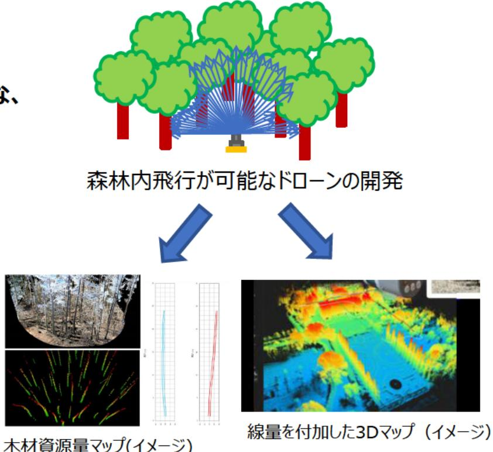

# DXを加速させる革新的森林内飛行と3次元解析技術の確立 事業概要

| 募集課題名 | ロボット分野 令和5年度「困難環境下でのロボット・ドローン活用促進に向けた研究開発」委託事業　テーマ(3)湖沼、森林内などでの調査に対応するロボット・ドローンの研究開発  | F-REI |
| --- | --- | --- |
| 研究実施者 | 加藤 顕(DXを加速させる革新的森林内飛行と3次元解析技術の確立(国立大学法人千葉大学(代表機関)、公益財団法人日本分析センター) |  |
| 実施予定期間 | 令和11年度まで(ただし実施期間中の各種評価等により変更があり得る) |  |

## 背景・目的

急峻な傾斜地が多く、林道等の整備が不十分な日本の森林環境では、ロボット等の利用により作業を自動化することに多くの課題がある。本事業では、障害物が多く、正確なGPS情報の取得が難しい森林内で飛行可能なドローンを開発するとともに、木材資源量や放射線量の把握が可能な計測機器をドローンに搭載することで高効率に3次元マップを作成できるシステムを構築する。

## 研究方法(手法・方法)

- 障害物が多く、正確なGPS情報取得が困難な森林内でも飛行可能な、軽量化・小型化されたドローンの開発
- レーザーを搭載したドローンで樹木情報を収集し、森林の高精細な3次元マップの作成
- 線量計を搭載したドローンで森林内の放射線量を測定し、その情報を用いて線量分布マップを作成

## 【期待される研究成果】

3次元マップでデータを整備することでデジタルツイン実現等のDX化が推進され、森林環境での作業自動化に貢献できる。

