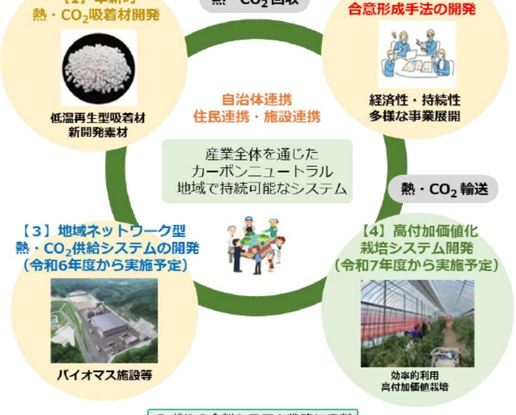

# 施設園芸における再生可能エネルギーを活用した循環システムの構築と実証

| 募集課題名 | 第2分野 令和5年度「福島国際研究教育機構における農林水産研究の推進」委託事業　テーマ(4)施設園芸におけるエネルギー循環利用技術体系の構築と実証 |  F-REI|
| --- | --- | --- |
| 研究実施者 | 鈴木 正哉(HCU施設園芸コンソーシアム(産業技術総合研究所(代表機関)、農業・食品産業技術総合研究機構、国際林水産業研究センター、東京大学、株式会社水循環エンジニアリング、株式会社武田鉄工所) |  |
| 実施予定期間 | 令和11年度まで (ただし実施期間中の各種評価等により変更があり得る) |

## 【背景・目的】

浜通り地域を中心とする農林水産業の再興と、我が国の農林水産業が直面する化石燃料燃焼によるCO-排出量の低減を目標に、飯舘村に建設される木質バイオマス発電所から排出される熱・COの施設園芸利用を核とした、地産地消型エネルギーシステムの実証研究と全国展開可能な地域循環型経済モデルのプロトタイプ構築を目指す。

## 【研究方法(手法・方法)】

バイオマス燃料の燃焼により排出される排ガスを利用し、吸着剤を用いて熱・CO2を輸送し、施設園芸に活用する地産地消型エネルギーシステムを構築する。

エネルギー効率の観点のみならず、経済性評価および自治体での合意形成を含めた、持続性を有する総合的な地域循環型経済モデルを構築する。

研究グループと自治体・住民連携
再生可能エネルギーを活用した循環システム

【1】革新的熱・CO2吸着材開発

【2】経済性評価　合意形成手法の開発

【3】地域ネットワーク型熱・CO2供給システムの開発（令和6年度から実施予定）

【4】高付加価値化栽培システム開発（令和7年度から実施予定）

連携・施設連携産業全体を通じたカーボンニュートラル

## 【期待される研究成果】

- 吸脱着量に優れ、吸着した水分を低温度帯(40℃~100℃)で乾燥(再生)が可能なCO~吸着材の開発
- 操作性や費用対効果に優れ、迅速に普及が可能な地域ネットワーク型熱・CO。供給システムを構築
- 環境配慮・地域エネルギーの有効利用と高収益化を両立した施設園芸体系の確立
- あらゆる運転(利用)を想定したシミュレーションを実施し、公共施設での熱供給など幅広い経済性評価を行い、本システムの普及に寄与するガイドラインを作成。

