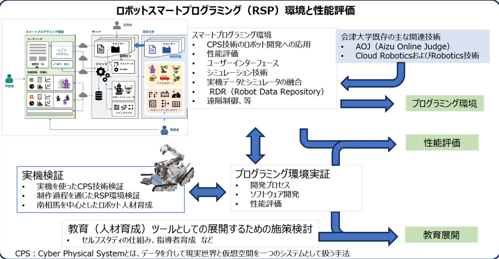

# ロボットスマートプログラミング環境を用いたロボット開発環境と人材育成に向けた研究

## 事業概要

本事業では、ロボット開発のためのスマートプログラミング環境およびロボットの性能評価手法の研究を行い、実機での検証も含めたロボットスマートブログラミング環境を構築し、ロボットソフトウェア開発及び性能評価へ本手法が有効である事を実証するとともに、ロボット関連人材育成のために教育ツールとしても展開するため必要な施策検討を行う。

ロボットスマートプログラミング（RSP）環境と性能評価

スマートプログラミング環境

- CPS技術のロボット開発への応用
- 性能評価
- ユーザーインターフェース
- シミュレーション技術
- 実機データとシミュレータの融合
- RDR (Robot Data Repository)
- 遠隔制御、等

会津大学既存の主な関連技術

- AOJ (Aizu Online Judge)
- Cloud RoboticsおよびRobotics技術

実機検証

- 実機を使ったCPS技術検証
- 制作過程を通じたRSP環境検証
- 南相馬を中心としたロボット人材育成

プログラミング環境実証

- 開発プロセス
- ソフトウェア開発
- 性能評価

