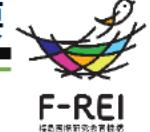
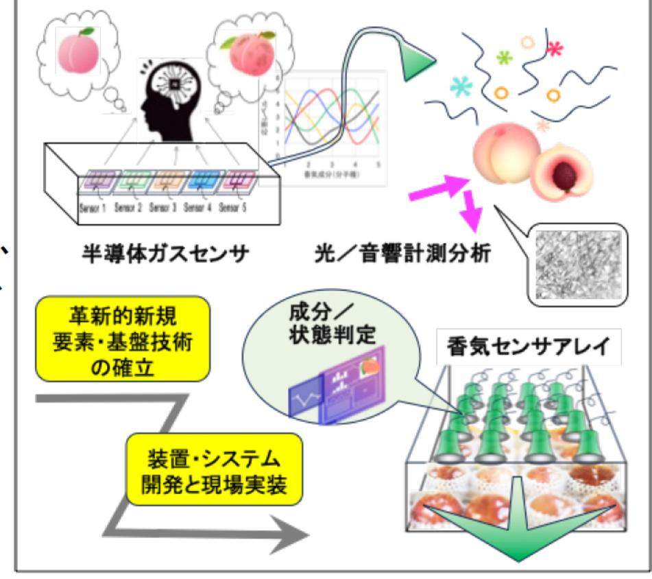

# 高感度香気検知デバイス・光/音響センシング技術に基づく果実成分/状態予測技術の開発 事業概要

| 募集課題名 | 農林水産業分野 令和5年度「福島国際研究教育機構における農林水産研究の推進」委託事業 | F-REI |
| --- | --- | --- |
|  | テーマ(2)輸出対応型果樹生産技術の開発・実証 |  |
| 研究実施者 | 福田 隆史 (国立研究開発法人 産業技術総合研究所) |  |
| 実施予定期間 | 令和11年度まで(ただし実施期間中の各種評価等により変更があり得る) |  |

## 【背景・目的】

福島の『モモ』は福島県果樹農業振興計画における重点品目であり、長年にわたり全国2位の生産量を誇る。ただし、輸出対応とブランド価値向上のためには、従来の品質評価項目に加え、より多項目で精度の高い管理が望まれ、新技術の開発が必要である。

## 【研究方法(手法・方法)】

本研究では、高感度な香気成分センサや光/音響分析技術などに基づく新規の非破壊成分/状態分析技術の開発に取り組む。 また、それらの手法を利用して収穫後の果実品質の変化に関するデータの蓄積に取り組む。そして、マルチモーダルセンシング※を通じて蓄積されるデータに基づく、品質変化予測用AIシステムの開発を目指す。それらの基盤要素技術の統合と 輸出に対応できる果実を選抜する2次選果装置の開発を通じて、より高度な品質評価・管理の実現や現場実装というチャレンジングな課題に挑む。

※複数のセンサーを集積し、一度に複数の項目の測定を行うこと

## 【期待される研究成果】

- 従来にない新規の非破壊成分/状態分析技術の確立
- 先進技術による高度な品質管理の実現を通じた福島の『モモ』ブランド価値の向上

