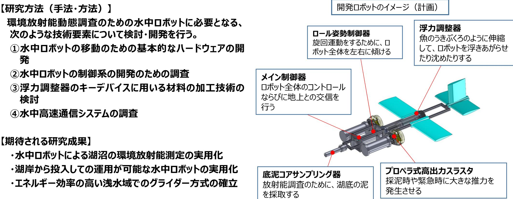

# 環境放射能動態調査のための水中ロボットの開発と実証 事業概要

| 募集課題名 | ロボット分野 令和5年度「困難環境下でのロボット・ドローン活用促進に向けた研究開発事業」委託事業 テーマ(3)湖沼、森林内などでの調査に対応するロボット・ドローンの研究開発 |
|--------------|------------------------------------------------------------------------------------------------------------------------------------------|
| 研究実施者 | 高橋隆行(国立大学法人 福島大学) |
| 実施予定期間 | 令和11年度まで(ただし実施期間中の各種評価等により変更があり得る) |

## 【背景・目的】

湖沼の環境放射能動態調査のための水中ロボットを開発することにより、環境放射能の動態把握の効率化を実現する。

## 【研究方法（手法・方法）】

環境放射能動態調査のための水中ロボットに必要となる、
次のような技術要素について検討・開発を行う。
①水中ロボットの移動のための基本的なハードウェアの開発
②水中ロボットの制御系の開発のための調査
③浮力調整器のキーデバイスに用いる材料の加工技術の検討
④水中高速通信システムの調査

## 【期待される研究成果】

- 水中ロボットによる湖沼の環境放射能測定の実用化
- 湖岸から投入しての運用が可能な水中ロボットの実用化
- エネルギー効率の高い浅水域でのグライダー方式の確立

## 開発ロボットのイメージ（計画）

ロール姿勢制御器
旋回運動をするために、ロボット全体を左右に傾ける

浮力調整器
魚のうきぶくろのように伸縮して、ロボットを浮きあがらせたり沈めたりする

メイン制御器
ロボット全体のコントロールならびに地上との交信を行う

底泥コアサンプリング器
放射能調査のために、湖底の泥を採取する

プロペラ式高出力スラスタ
採泥時や緊急時に大きな推力を発生させる

