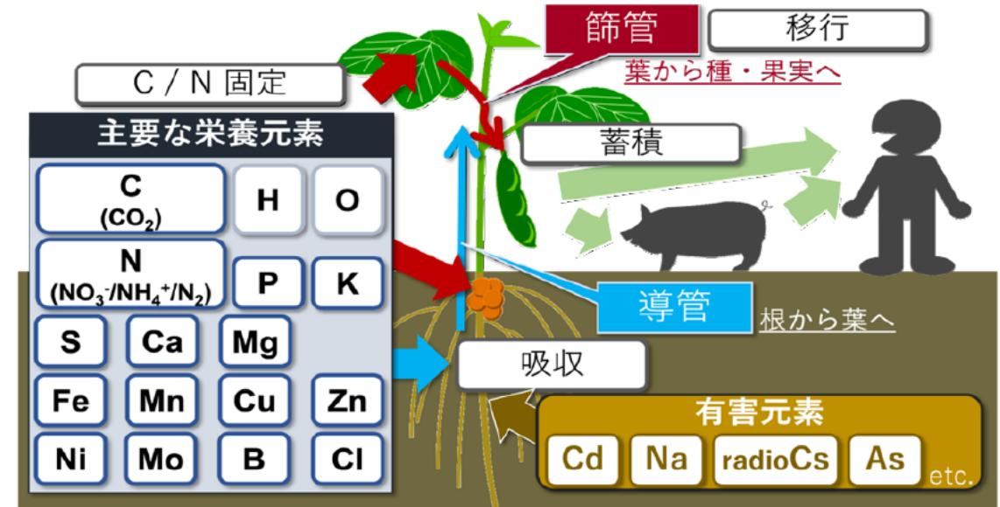

# 植物RIイメージング研究拠点の形成と応用研究の展開 事業概要

| 募集課題名 | 令和5年度「農作物の生産性向上や持続可能な作物生産に資するRIイメージング技術の開発及び導き出される生産方法の実証」 F-REI |
| --- | --- |
| 研究実施者 | 河地 有木(植物RIイメージングコンリーシアム(量子科学技術研究開発機構(代表機関)、東京大学、筑波大学、東北大学 サイクトロン・ラジオアイソトープセンター、東海国立大学機構名古屋大学高等研究院及び名古屋大学アイソトープ総合センター、北海道大学、東京農業大学、近畿大学、高知大学IoP共創センター、株式会社プランテックス) ) |
| 実施予定期間 | 令和11年度まで (ただし実施期間中の各種評価等により変更があり得る) |

## 【背景・目的】

放射性同位元素(RI)をトレーサとして、元素の流れを把握することで、農作物の生産性向上等に資するメカニズムを解明し、その生産方法を実証する。

## 【研究方法(手法・方法)】

植物体内での物質動態を高精度に可視化するための植物RIイメージング技術の基盤を構築し、植物栄養学研究を推進することで、植物体内での栄養元素や有害元素の輸送メカニズムの解明する。

また、その成果を用い、農作物の栽培技術開発や品種改良による新たな作物の開発を行い、農業現場において実証試験を実施する。

## 【期待される研究成果】

高収量及び高品質な作物の栽培方法の構築や品種改良に資する基礎知見の獲得。

