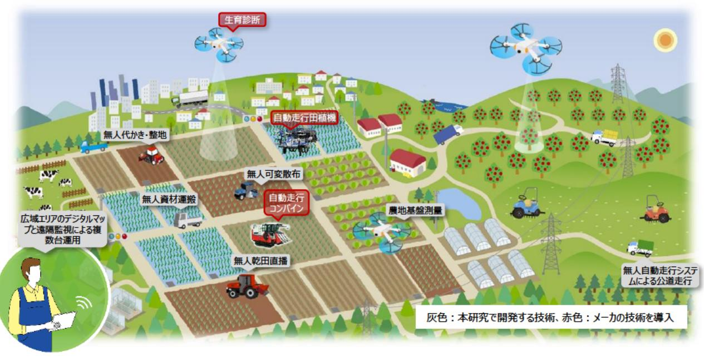

# 超省力的なPDCA型スマート稲作の体系化・完全自動化に向けた研究 事業概要

| 募集課題名 | 農林水産業分野 令和5年度「福島国際研究教育機構における農林水産研究の推進」委託事業 テーマ(1) 土地利用型農業における超省力生産技術の技術開発・実証 | F-REI |
| --- | --- | --- |
| 研究実施者 | 八谷 満(超省カ型スマート稲作体系化コンソーシアム(農研機構(代表機関)、東京大学、ヤンマーアグリ株式会社、株式会社M2Mクラフト) |  |
| 実施予定期間 | 令和11年度まで (ただし実施期間中の各種評価等により変更があり得る) |  |

## 【背景・目的】

福島を含めた国内の水田稲作における喫緊の課題である担い手不足や水田の大規模化への対応のため、複数ほ場を自律的に移動・作業する完全無人自動走行システムを構築する。加えて、システムの運用面でも省力化・自動化を図るため、ドローンを活用する技術開発を行い、実用化に向けた実証を実施する。

## 【研究方法(手法・方法)】

- "遠隔監視"型無人自動走行システムを開発するとともに、稲作の一貫体系 「経営・栽培管理-施肥一耕起・整 地・代かき-移植-追肥-収穫」の各工程のスマート農機間のデータ連携によりPDCA型農業を実現する。
- 開発したPDCA型農業の現地実証を実施し、農作業の投下労働時間、生産コスト、品質のばらつきの低減を実現するための技術開発・実証を行う。

## 【期待される研究成果】

- 水田稲作の全工程の自動化
- 最先端のスマート稲作一貫体系の実用化モデルケースとして、スマート農業技術実装化の仕組み構築に寄与

"遠隔監視"型無人自動走行システムを開発し、福島での実証試験によりスマート稲作一貫体系を構築

