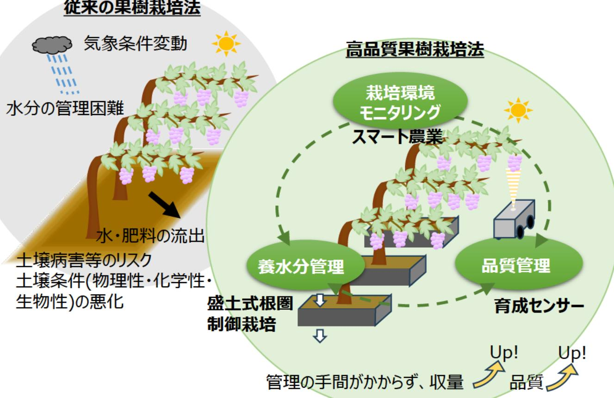

# 育成センサーの開発と果樹栽培のスマート農業化に関する研究 事業概要

| 募集課題名 | 農林水産業分野 令和5年度「福島国際研究教育機構における農林水産研究の推進」委託事業 テーマ(2)輸出対応型果樹生産技術の開発・実証| F-REI |
| --- | --- | --- |
| 研究実施者 | 古川 祐光(スマート果樹栽培コンソーシアム(産業技術総合研究所(代表機関)、福島県農業総合センター) |  |
| 実施予定期間 | 令和11年度まで (ただし実施期間中の各種評価等により変更があり得る) |  |

## 【背景・目的】

本研究においては、ブドウをターゲットとして、果樹栽培のスマート農業化を実現する栽培法とセンサー開発を実施することで、データ駆動型栽培制御による高品質果樹栽培技術の構築を目指す。

## 【研究方法(手法・方法)】

樹の生育・果実成熟状況をモニタリングするため、果樹に適した新たなセンサー(育成センサー)を開発する。検出データを栽培管理にフィードバックするため、環境制御しやすい盛土式根圏制御栽培を導入し、品種、肥培管理法、水分管理、ハウス内の高温対策の検討・改良などの研究を行う。

### 従来の果樹栽培法

気象条件変動
水分の管理困難
水・肥料の流出
土壌病害等のリスク
土壌条件（物理性・化学性・生物性）の悪化

### 高品質果樹栽培法

栽培環境
モニタリング
スマート農業

養水分管理
盛土式根圏
制御栽培

品質管理
育成センサー

## 【期待される研究成果】

- 果樹栽培におけるスマート農業化の実現
- 高品質果実の栽培技術の確立

