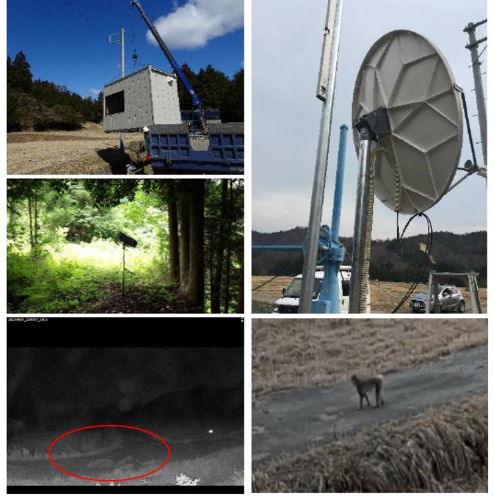

# ICT利用による鳥獣モニタリング・被害低減の実現に関する技術開発(FS研究)事業概要

| 募集課題名 | 農林水産業分野 令和5年度「福島国際研究教育機構における農林水産研究の推進」委託事業 テーマ(3) 先端技術を活用した鳥獣被害対策システムの構築・実証 | F-REI |
| --- | --- | --- |
| 研究実施者 | 小林 博樹(東京大学) |  |
| 実施予定期間 | 令和6年度まで(ただし実施期間中の各種評価等により変更があり得る) |  |

## 【背景・目的】

鳥獣被害対応では、担い手不足と作業負荷が課題となっている。イノシシ及びサルの獣害対策をターゲットに、限られた人手による効率的な対策を、ICTの利用により実現する。

## 【研究方法(手法・方法)】

本研究では、イノシシ及びサルを、人による見回りや自動撮影カメラではなく、一部の個体に装着したデバイス(Audio-IoT)を利用して、モニタリングする。未装着の動物も含めたモニタリング及び鳥獣から発せられる鳴き声等をVirtual Realityの刺激として再現することにより、威嚇や誘引する技術開発を目指すとともに、浜通り地域を含む国内数か所において実証を行う*。

※本事業はFeasibility Studyとして実施する。

## 【期待される研究成果】

- ICTの利用による野生のイノシシ及びサルの行動モニタリングと行動コントロール
- 省力的獣害対策の実現

