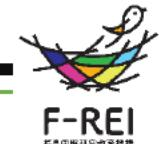
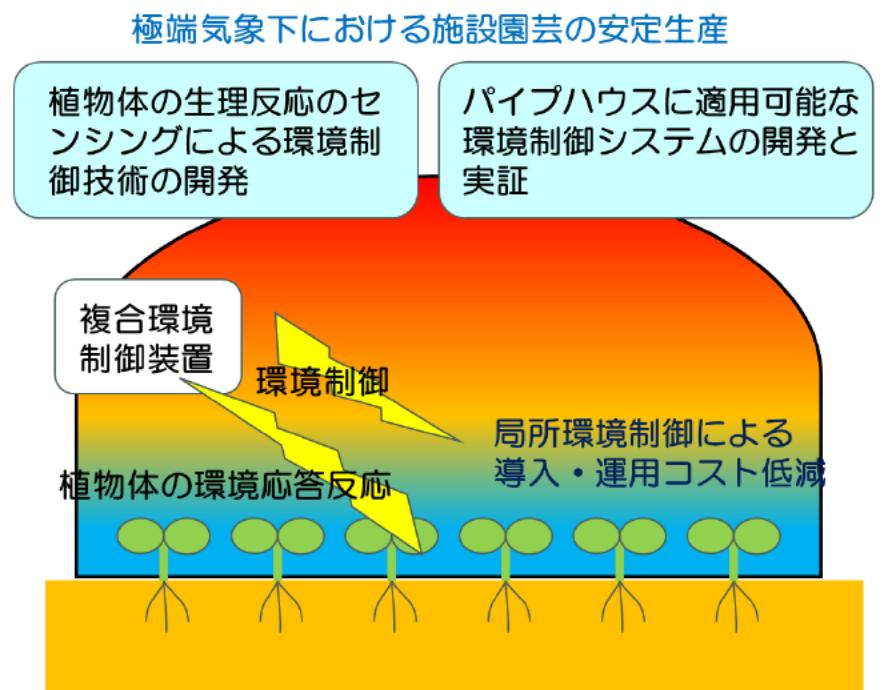

# 極端気象に適応する次世代型ハウス環境制御技術の開発 事業概要

| 募集課題名 | 第2分野 令和5年度「福島国際研究教育機構における農林水産研究の推進」委託事業 テーマ(4)施設園芸におけるエネルギー循環利用技術体系の構築と実証 |
| --- | --- |
|研究実施者| 深山陽子(次世代型八ウス環境制御コンソーシアム(福島大学(代表機関)、岡山大学、岐阜大学、岩手県農業研究センター))|
|実施予定期間 |令和11年度まで (ただし実施期間中の各種評価等により変更があり得る)|

## 【背景・目的】

農業生産に影響を及ぼす極端な猛暑等の気象(極端気象)に対応可能な持続性のある施設園芸を実現するための技術開発および実証を行う。

## 【研究方法(手法・方法)】

植物生理反応のセンシングを行い、その指標に基づく環境制御技術の開発を行う。なお、植物体の水分状態を表す水ボテンシャルはリアルタイム計測ができないため、それに代わる指標を設定することを研究対象とする。 また、八ウス全体ではなく局所的に環境制御することで効果を高め、導入・運用コストの低減を図る。

## 【期待される研究成果】

- 従来とは異なる、植物自体から得られる環境応答反 応のセンシングによる極端気象に対応可能な次世代型環境制御技術の開発。
- パイプハウスは国内で最も普及しており、パイプハ ウスを対象とする環境制御システムを開発することで施設園芸の高度化に貢献。
- パイプハウスを利用した施設栽培において、猛暑な どの極端気象下でも安定した生産が可能で、導入・運用コストを抑えた環境制御システムの開発・実証。

開発する次世代型ハウス環境制御システム(イメージ)

