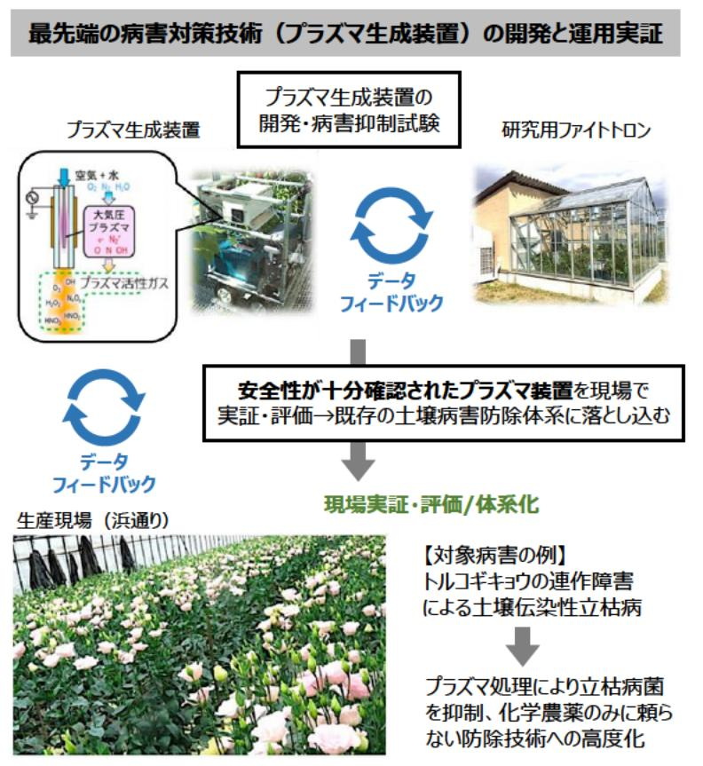

# プラズマ農業技術の開発と福島県浜通りでの実装 事業概要

|募集課題名| 農林水産業分野 令和5年度「福島国際研究教育機構における農林水産研究の推進」委託事業 真正 報題名 テーマ(8)福島浜通り地域等の農林水産業復興に資する研究事業(提案公募型募集)|
|---|---|
|研究実施者|高橋 英樹(ブラズマ農業技術の開発と福島県浜通りでの実装コンソーシアム(東北大学(代表機関)、福島県農業総合センター 浜再生研究センター) )|
|実施予定期間| 令和11年度まで (ただし実施期間中の各種評価等により変更があり得る)|

## 【背景・目的】

福島県浜通り地域ではトルコギキョウの一大産地が形成されているが、連作等による立枯病の発生が問題となっている。本研究では、トルコギキョウの立枯病をモデルに、病害対策に先端的なプラズマ技術を導入することで、化学農薬の使用を低減し、かつ経済的な方法での高品質花き等の安定生産を実現する。

## 【研究方法(手法・方法)】

各種プラズマ生成装置試作機の病害抑制効果を、栽培温室等において試験し、装置の開発・改良とプラズマ処理条件(安全性を含む)の最適化を図る。改良した装置に対しては農業現場での実証試験による効果検証と、これを組み込んだ防除体系の確立を行う。

- 十壌殺菌型、植物免疫活性化型・空間殺菌型などの空気プラズマ牛成装置 を開発・改良し、処理条件を最適化する。
- 開発した装置について、浪江町などのトルコギキョウ栽培施設の病害防除 体系に導入し、病害抑制の現地実証を実施する。
- 各空気プラズマ牛成装置の防除への利用における経済性評価を実施する。

※プラズマは殺菌作用を持つほか、ブラズマにより生成される活性分子種を植物が感知することにより、植物免疫誘導などを制御できることが実験的に証明されている。

### 最先端の病害対策技術（プラズマ生成装置）の開発と運用実証

プラズマ生成装置の開発・病害抑制試験

安全性が十分確認されたプラズマ装置を現場で実証・評価 → 既存の土壌病害防除体系に落とし込む

現場実証・評価 / 体系化
【対象病害の例】
トルコギキョウの連作障害による土壌伝染性立枯病

プラズマ処理により立枯病菌を抑制、化学農薬のみに頼らない防除技術への高度化

## 【期待される研究成果】

- 1. プラズマ技術による土壌病害防除法の確立
- 2. トルコギキョウなど花き施設栽培の病害防除で利用可能なプラズマ生成装置の開発と社会実装
- 3. 病害防除体系へのブラズマ技術導入による農薬使用量・使用回数の低減

