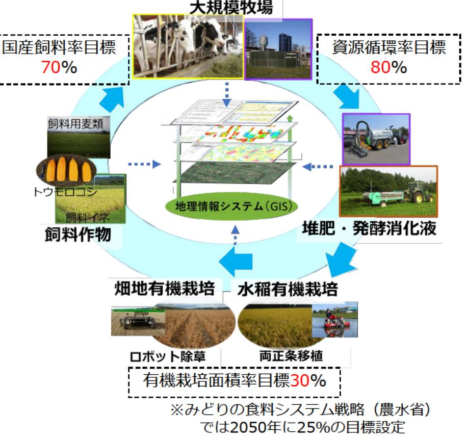

# 地域循環型の耕畜連携システムの開発および実証 事業概要

| 募集課題名 | 農林水産業分野 令和5年度「福島国際研究教育機構における農林水産研究の推進」委託事業 テーマ（5）化学肥料・化学農薬に頼らない耕畜連携に資する技術の開発・実証 |
|--------------|------------------------------------------------------------------------------------------------------------------------------------------|
| 研究実施者 | 大谷隆（化学肥料・化学農薬に頼らない耕畜連携に資する技術の開発・実証のコンソーシアム 島大学、新潟大学、福島県、農研機構、産業技術総合研究所、全酪連酪農技術研究所） |
| 実施予定期間 | 令和11年度まで（ただし実施期間中の各種評価等により変更があり得る） |

## 【背景・目的】

営農再開が進められている福島浜通りの平坦地を中心に、大規模牧場を核とした畜産と耕種経営の飼料・有機物の循環システムを構築するとともに、ロボット技術を導入した耕種経営での有機栽培体系を確立する。

## 【研究方法(手法・方法)】

大規模牧場を核とした化学肥料・化学農薬に頼らない耕畜連携システムを確立するため、下記の技術開発および実証を行う。

(1)正確な位置情報に基づくロボット除草技術の導入と、 デジタルデータを用いた移植水稲栽培技術の開発を実施し、 有機栽培体系を開発・実証する。

(2) 化学肥料に頼らない飼料生産体系を、発酵消化液の成分分析センサ、近赤外分光法による土壌診断技術を開発することで確立し、大規模牧場に国産飼料高度利用飼養技術として実装する。

(3)地理情報システム(GIS)を導入し、各実施課題の成果の統合と経済性評価を行う。

## 【期待される研究成果】

- 水稲および畑作物の省力有機栽培技術の開発。
- 化学肥料に頼らない飼料生産体系および国産飼料高度利用飼養技術の開発。
- 地域資源循環型営農システムの確立。

