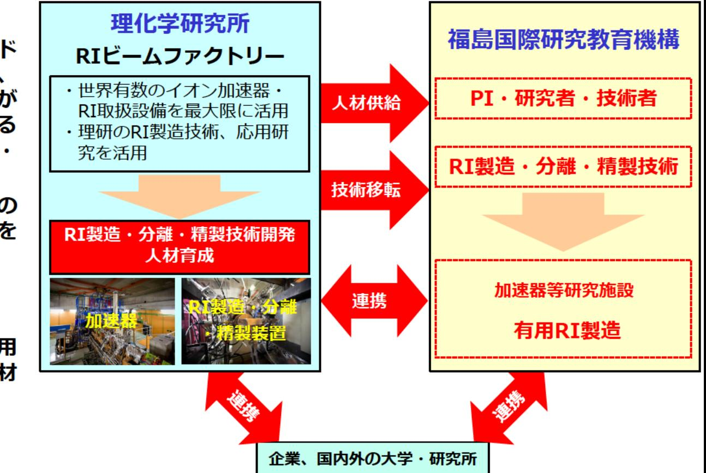

# 加速器を活用した有用RIの製造技術開発 事業概要

F-REI

| 募集課題名 | 令和5年度「加速器を活用したRIの安定的かつ効率的な製造技術の開発」 |
|--------------|--------------------------------------------------------------------------|
| 研究実施者 | 羽場宏光（理化学研究所） |
| 実施予定期間 | 令和11年度まで（ただし実施期間中の各種評価等により変更があり得る） |

## 【背景・目的】

理化学研究所が所有する世界有数の研究設備やこれまでの研究実績を最大限に活用し、創薬医療・農業・工業分野等において有用なRIの製造技術開発を行うとともに、将来、F-REIにて即戦力となるRI製造人材を育成する。

## 【研究方法(手法・方法)】

新規の治療用RIとして日本が世界をリードして研究を進めているアスタチン-211の他、創薬医療・農業・工業分野等において利用が期待されF-REI独自の研究テーマとなり得る有用なRIを、安全、高効率、高純度に製造・分離・精製する技術の開発を行う。

また、F-REIの加速器の運転・保守、RIの製造・分離・精製、放射線管理を担う人材をOJT教育により育成する。

## 【期待される研究成果】

創薬医療・農業・工業分野等において有用なRIの製造技術の開発及びRI製造を担う人材の育成。

