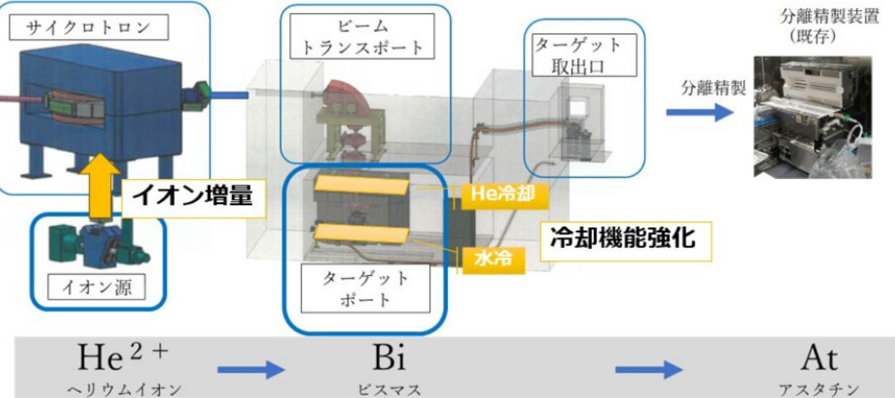

# アスタチン安定供給に向けた製造技術の開発 事業概要

| 募集課題名 | 令和5年度「加速器を活用したRIの安定的かつ効率的な製造技術の開発」 |
|--------------|--------------------------------------------------------------------------|
| 研究実施者 | 髙橋和弘（福島県立医科大学） |
| 実施予定期間 | 令和11年度まで（ただし実施期間中の各種評価等により変更があり得る） |

## 【背景・目的】

医療用RI(放射性同位元素)として今後の需要の高まりが期待されるアスタチン-211を安定供給するための製造技術開発を行う。

## 【研究方法(手法・方法)】

アスタチン-211の安定供給のために、ビーム電流の大強度化による製造量の増 加に関連する技術開発を行う。

具体的には、ビーム照射の大強度化による反応熱を抑えるためにターゲットの冷却機能を強化する。また、アスタチン-211の製造に必要なイオンを容易に生成可能なイオン源を導入するための設計等を行う。

## 【期待される研究成果】

東日本地域の研究機関等へのアスタチン-211の安定供給の実現

(図) 加速器(サイクロトロン)に付随するイオン源とビームを照射させるターゲット
