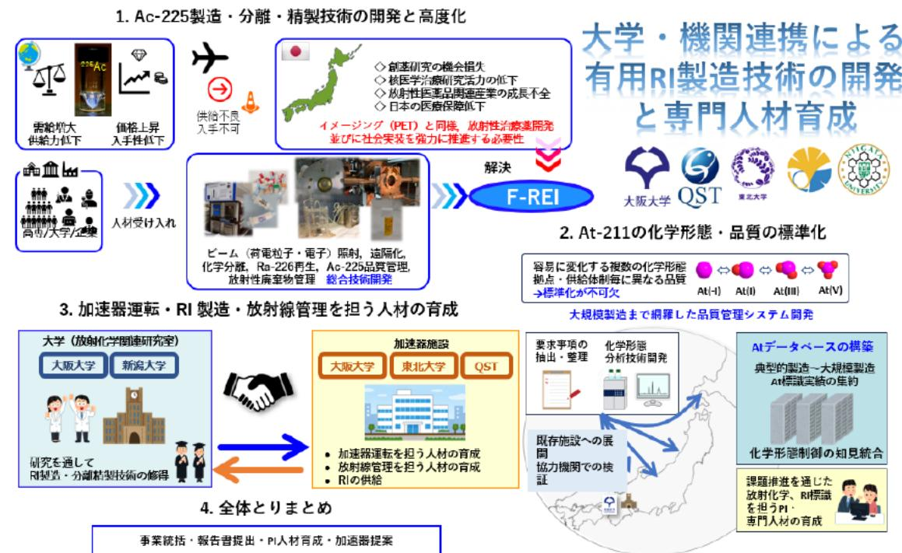

# 大学・機関連携による有用RI製造技術開発 事業概要

| 募集課題名 | 令和5年度「加速器を活用したRIの安定的かつ効率的な製造技術の開発」 |
|--------------|--------------------------------------------------------------------------|
| 研究実施者 | 髙橋和弘（福島県立医科大学） |
| 実施予定期間 | 令和11年度まで（ただし実施期間中の各種評価等により変更があり得る） |

## (背景・目的)

アクチニウム-225(Ac-225)やアスタチン-211(At-211)といった有用なRIの安定的かつ効率的な製造技術を確立するとともに、その製造技術に必要な専門人材を育成する。

## 【研究方法(手法・方法)】

・Ac-225の原料のラジウム-226 (Ra-226) は希少であることを踏まえ、Ac-225を安全かつ効率的に製造・分離・精製するための技術開発を行う。

・At-211は反応性が高く、環境により様々な化学形態をとり得ることを踏まえ、At-211の品質の標準化を目指し、At-211の化学分析や測定手法の性能確認等を行う。

・研究開発を通じて、加速器の保守・管理・運転、RI製造・分離・精製、放射線管理等を担う人材を育成する。

## 【期待される研究成果】

- Ac-225の製造・分離・精製技術の高度化
- At-211の品質管理の確立
- 有用RIの製造で即戦力となる専門人材の育成

