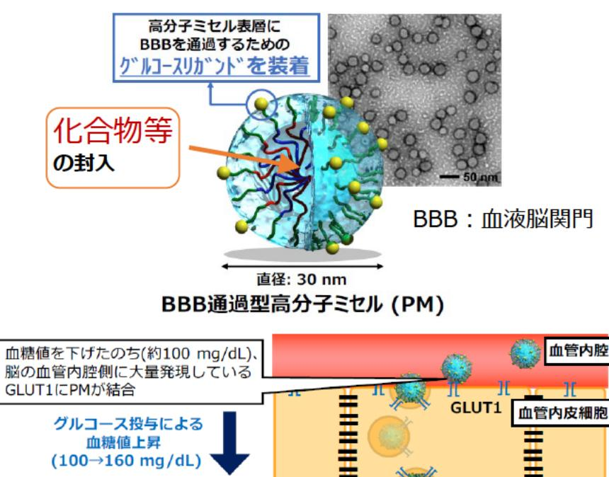

# RIを用いた革新的セラノスティクスの実現に向けた研究開発 事業概要

| 募集課題名 | 令和5年度「RIで標識した診断・治療薬に関する研究開発」委託事業 | F-REI |
| --- | --- | --- |
| 研究実施者 | 高橋 浩之(アドバンストセラノスティクス共同研究機関(東京大学(代表機関)、理化学研究所、東京工業大学、千代田テクノル) |  |
| 実施予定期間 | 令和11年度まで (ただし実施期間中の各種評価等により変更があり得る) |  |

## 【背景・目的】

従来では治療が困難な脳腫瘍などの疾患を対象として、多段階の原子核反応を起こすRI(放射性同位元素)とナノミセル*を組み合わせた革新的なセラノスティクス(診断と治療を一体的に行う手法)を実現する。

※ナノミセル:内包した薬物を運搬するためのナノサイズの粒子

## 【研究方法(手法・方法)】

脳腫瘍などの疾患の標的分子に特異的に作用する抗体やペプチドを開発し、多段階の原子核反応を起こすRIとともに内包したナノミセルを開発する。

また、これまでシングルフォトン放出画像診断法(SPECT) に活用されてきたインジウム-111 (In-111)などから放出される2本のv線を同時計測する新たな撮像システムを開発する。

あわせて、国内外のRI関連の専門家とのワークショップ、現場実習、講義受講等を通じて、放射性薬剤の研究開発における研究人材を育成する。

## 【期待される研究成果】

- 革新的セラノスティクスの実現
- 放射性薬剤の研究開発における研究人材の育成

血糖値を下げたのち（約100mg/dL）、脳の血管内側に大量発現しているGLUT1にPMが結合

グルコース投与による血糖値上昇（100 → 160mg/dL）

GLUT1のリサイクリングに連動して、PMが脳実質内に能動輸送

化合物等を封入したナノミセル及び体内での動態
