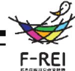
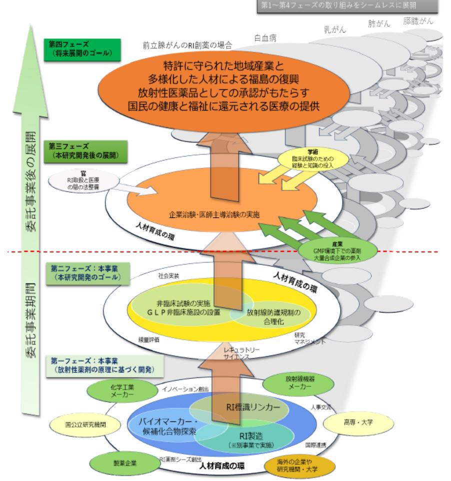

# 福島復興を加速する多機関連携による放射性薬剤の研究開発 事業概要

F-REI

| 募集課題名 | F-REI 令和5年度「RIで標識した診断・治療薬に関する研究開発」 委託事業 |
| --- | --- |
| 研究実施者 | 織内 昇(画期的なアルファ線核種標的治療薬の開発コンソーシアム(福島県立医科大学(代表機関)、大阪大学、量子科学技術研究開発機構) |
| 実施予定期間 | 令和11年度まで (ただし実施期間中の各種評価等により変更があり得る) |

## 【背景・目的】

福島の復興の加速及び産業創出に寄与するため、がんの診断・治療に用いる画期的な放射性医薬品の開発を目指すとともに、F-REIの将来を担う研究人材を育成する。

## 【研究方法(手法・方法)】

既存の治療法や他のモダリティと比較して、RI(放射性同位元素)を用いた診断・治療に優位性や経済合理性が見込まれるがん種を選定し、バイオマーカーや創薬候補化合 物を多様な手法を用いて探索するとともに、RI標識化合物の設計・合成や非臨床試験を実施する。

また、線量評価や放射線防護規制に関わるレギュラト リーサイエンスなど放射性薬剤の研究開発に必要な視点をもった研究人材を育成する。

## 【期待される研究成果】

- 創薬シーズの臨床応用
- 放射性薬剤の研究開発における研究人材の育成

放射性薬剤の研究開発を通じたシームレスな社会展開のイメージ
