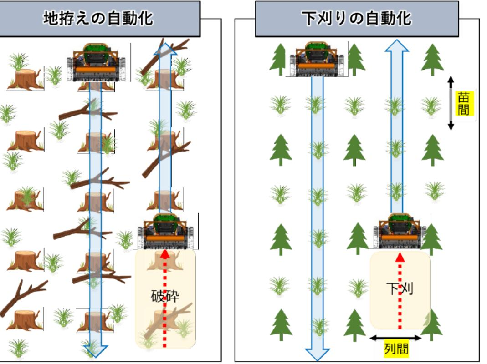

# 全自動無人林業システムの開発に向けた下刈り作業機械の遠隔自動運転システムの研究開発・実証 事業概要

| 募集課題名 | 農林水産業分野 令和5年度「福島国際研究教育機構における農林水産研究の推進」委託事業 テーマ(8) 福島浜通り地域等の農林水産業復興に資する研究事業 |
| --- | --- |
| 研究実施者 | 岩瀬 昭美 下刈機械自動化コンソーシアム(東京電機大学(代表機関)、株式会社ギガソーラー、株式会社東日本計算セン ター、遠野興産株式会社、株式会社エム・シー・エフ、合同会社ビスペル、福島県八イテクブラザ、住友林業株式会社) |
| 実施予定期間 | 令和11年度まで (ただし実施期間中の各種評価等により変更があり得る) |

## 【背景・目的】

日本の林業では、伐採後に苗木を植える準備(地存え)や植付後に草を刈る作業(下刈り)を行う作業者が減少するー方、造林作業の機械化が遅れている。本事業では地拓え・下刈りの自動化、遠隔操作技術を開発、提案する。

## 【研究方法(手法・方法)】

①地存えの自動化に向けた技術開発

伐採跡地の伐根や残された枝の破砕を機械によって行うための条件や遠隔・自動操作に必要な条件を整理し、自動化操作を検証する。

②下刈りの自動化に向けた技術開発

下刈りの機械化・自動化に向け、適した植付本数密度、苗間及び列間、機械が走行するルートについて比較・検討した上で、自動化操作を検証する。

【期待される研究成果】

- 地存え・下刈りについて、遠隔地からの操作による現地での作業自動化を実現する。
- 地存え・下刈り機械の自動化、遠隔操作についてのガイドラインを策定する。

