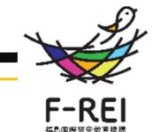
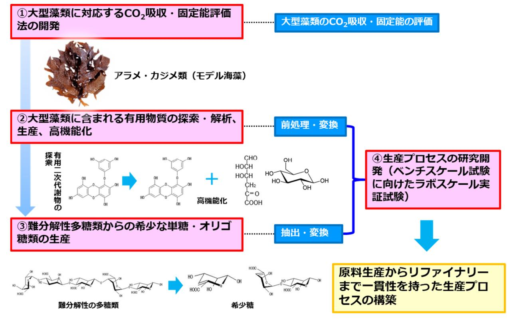

# ⼤型藻類による「CCU技術」の開発と福島での社会実装に向けた研究 事業概要

F-REI

|募集課題名 |エネルギー分野 令和5年度「ネガティブエミッションのコア技術の研究開発・実証」委託事業 テーマ(2)藻類のCO 2固定及びネガティブエミッションへの利⽤に関する研究開発と実証|
|---|---|
|研究実施者|柴⽥ 敏⾏(Reborn Fukushima Seaコンソーシアム(三重⼤学(代表機関)、京都⼯芸繊維⼤学、京都⼤学、Bioenergy株式会社))|
|実施予定期間|令和10年度まで(ただし実施期間中の各種評価等により変更があり得る)|

## 【背景・⽬的】

**⼤型藻類のCO2吸収・固定能をより簡便に評価できる⽅法を開発するとともに、⼤型藻類に含まれる有⽤な物質を有 効利⽤するための⽣産プロセスを構築する。**

## 【研究⽅法(⼿法・⽅法)】

- ① ⾮破壊分析でフィールド調査にも活⽤可能な CO2吸収・固定能評価法を開発する。
- ② ⼤型藻類に含まれるマリンポリフェノール Ⓡ(フロロタ ンニン類)など有⽤な代謝物質を探索・解析するとともに、⽔溶性、安定性、輸送性等を付加する。 「マリンポリフェノール Ⓡ」は、国⽴⼤学法⼈三重⼤学の登録商標です。
- ③ 難分解性の多糖類を酵素反応により単分⼦化する ことにより、希少価値の⾼い単糖やオリゴ糖を抽出・⽣産する技術を開発する。
- ④ 単糖類等の抽出条件をLCA(※)を考慮した最適化を図り、ラボスケールの実証試験を⾏う。 ※ライフサイクルアセスメント(LCA)︓製品のライフサイクル全体(原料採取-⽣産-消費-廃棄)における環境負荷を定量的に評価する⼿法。

## 【期待される研究成果】

- フィールド調査にも活⽤できる⼤型藻類のCO2吸収・固定能評価法の確⽴と測定技術の普及
- ⼤型藻類に含まれる有⽤な代謝物質や希少糖を有 効利⽤し、かつ廃棄物の排出削減に寄与する⽣産プロセスの構築

