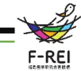
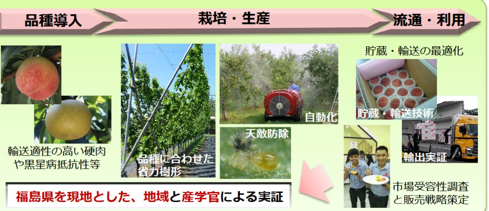

# モモ及びナシに関する輸出対応型果樹生産技術の開発及び実証 事業概要

F-REI

| 募集課題名 | 農林水産業分野 令和5年度「福島国際研究教育機構における農林水産研究の推進」委託事業 テーマ(2)輸出対応型果樹生産技術の開発・実証 |
|--------------|------------------------------------------------------------------------------------------------------------------------------------------|
| 研究実施者 | 岩波 宏(果樹福島実証コンソーシアム(農研機構(代表機関)、福島県農業総合センター、福島大学、神奈川県農業技術センター、京都大学、筑波大学) |
| 実施予定期間 | 令和11年度まで (ただし実施期間中の各種評価等により変更があり得る) |

## 【背景・目的】

わが国有数の果樹産地である福島県の果樹生産基盤の安定化と輸出拡大に貢献するため、福島県をフィールドとして、実需ニーズの高いモモおよびナシ新品種の新たな生産体系を構築・実証する。

## 【研究方法(手法・方法)】

福島のモモ及びナシの輸出拡大のため、輸出需要が見込める高品質な新品種を浜通りの現地圖場等に導入し、経験が浅くても取り組みやすい省力樹形での栽培体系を構築・実証する。また生産した果実の東南アジアでの嗜好性、ニーズ、 市場受容性を調査し、栽培技術、貯蔵/流通技術開発ヘフィードバックする。以上の取組により得られる成果を福島から全国展開することを目指す。

## 【期待される研究成果】

- 輸送適性の高いモモ新品種の省力樹形と輸出相手国に適応した防除体系の開発
- モモ新品種の貯蔵・輸送特性と高品質輸出体系の唯立
- 黒星病抵抗性等のナシ新品種の省力樹形の開発
- 輸出想定国でのニーズ把握とこれにマッチした果実の生産技術の体系化

