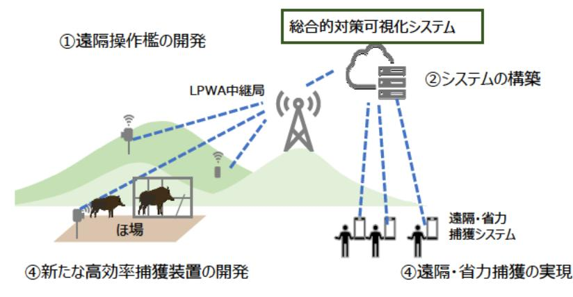
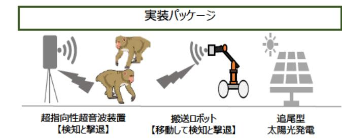

# 先端技術を用いたイノシシ・サルによる獣害低減化研究 事業概要

| 募集課題名 | 農林水産業分野 令和5年度「福島国際研究教育機構における農林水産研究の推進」委託事業 テーマ(3)先端技術を活用した鳥獣被害対策システムの構築・実証 |
|---|---|
| 研究実施者 | 研究代表者名 竹内 正彦 (先端技術を活用した鳥獣害対策コンソーシアム(農研機構(代表機関)、兵庫県立大学、鳥羽商船高等専門学校、(株)アイエスイー、東京工業大学、トレスバイオ研究所(株)、三重県、福島県) |
| 実施予定期間 | 令和11年度まで (ただし実施期間中の各種評価等により変更があり得る) |

## 【背景・目的】

浜通り地域では、震災後、野生動物が増加し、農作物の獣害 が営農再開の障壁となっている。また、獣害対策にあたる従事者の帰還が進んでおらず、自治体からの要請等に応じて避難先から出向いて対応している場合も多い。本研究ではイノシシとサルを対象に、省力かつ効果的な獣害対策技術の開発と実証を行う。

## 【研究方法(手法・方法)】

1.イノシシ捕獲を先進的な遠隔操作技術等で効率化し、労働力不足に対応する被害対策システム構築、実証する。
2.指向性が非常に高い、超音波を用いてサルの検知、追尾と嫌悪刺激を与える撃退手法を開発、実証する※。

※令和7年度までfeasibility studyとして実施。

1. イノシシ捕獲を高効率化する被害対策システムの構築・実証

  1遠隔操作檻の開発　２システムの構築　３新たな高効率捕獲装置の開発　４遠隔・省力捕獲の実現

2. 超指向性超音波場を用いたサルの撃退手法の開発・実証

  1検知技術の確立 2嫌悪刺激発生技術の開発 3 検知・撃退日ボットの開発、現地実証 4 現地実証

## 【期待される研究成果】

- 総合的対策可視化システムの活用により、イノシシによる獣害対策の労力削減と捕獲効率向上を実現
- 世界初の超音波場嫌悪刺激によるサルの撃退手法の実証と実用化
