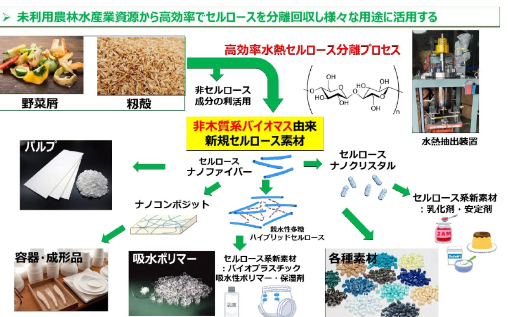

# 未利用資源等からのセルロース抽出の低コスト化とプラスチック代替素材の研究 事業概要

| 募集課題名 | 農林水産業分野 令和5年度「福島国際研究教育機構における農林水産研究の推進」委託事業 テーマ(6)未利用農林水産業資源を活用した新素材の開発 | F-REI |
|---|---|---|
| 研究実施者 | 藤井 智幸(未利用資源等からのセルロースの低コスト抽出とプラスチック代替新素材としての活用コンソーシアム(東北大学 (代表機関)、福島大学、苫小牧工業高等専門学校、トレ食株式会社)) | |
| 実施予定期間 | 令和11年度まで (ただし実施期間中の各種評価等により変更があり得る) ||

## 【背景・目的】

地域の未利用資源の活用を、環境に配慮した生産・処理プロセスにより福島浜通りで実現するため、本事業では、地域の未利用資源(野菜残渣、粉殻)を原料に、水熱処理※によりセルロースを製造し、石油由来のプラスチックを 代替できる性質を持つ素材の開発とその量産化技術体系の確立・実用化をおこなう。

※水熱処理は反応において水しか使わない環境調和型プロセスであり、反応と抽出を同時に行うことができる。

## 【研究方法(手法・方法)】

野菜由来のセルロースやペクチンは木質系バイオマス由来と比べ、幅広い素材への利用が期待できる。本事業では、水熱処理等を組み込んだ複合システムを改良し、効率よく原料中のセルロース複合化状態から副成分を分離する。さらに、同システムから製造した非木質系植物由来セルロースナノファイバーから、ナノクリスタル、架橋 セルロース及びセルロース・ペクチンハイブリッド架橋素材等新素材を製造する技術を確立する。

## 【期待される研究成果】

- 非大質系バイオマス由来のセルロース素材の低コスト生産プロセスの構築と新規セルロース素材の開発
- 地域資源活用人材の育成

