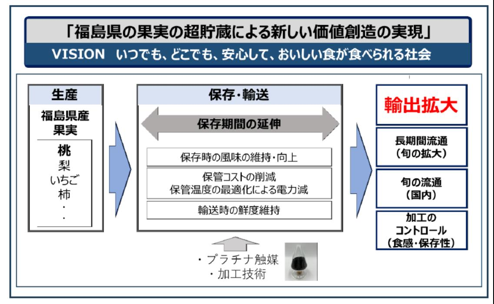

# 福島の果実の超貯蔵による新しい価値創造の実現 事業概要

| 募集課題名 | 農林水産業分野 令和5年度「福島国際研究教育機構における農林水産研究の推進」委託事業 テーマ（8）福島浜通り地域等の農林水産業復興に資する研究事業 |
|--------------|------------------------------------------------------------------------------------------------------------------------------------------|
| 研究実施者 | 吉野 正則 果実の超保存コンソーシアム（北海道大学（代表機関）、福島大学） |
| 実施予定期間 | 令和11年度まで（ただし実施期間中の各種評価等により変更があり得る） |

## 【背景・目的】

果実は旬の時期が短く、収穫後も短期間で味の劣化、腐敗が生じ長期の保存が困難である。本研究では福島の果実の長期保管を実現する研究開発を実施し、安定した供給体制を構築することで、海外への輸出拡大を実現する。

## 【研究方法(手法・方法)】

- 保管時の風味変化を防ぐ新しい研究開発
  
  福島の果実を対象に、保存時における風味変化の原因物質を酸化分解等の方法で原因物質を除去するプロセスを開発する。また、乾燥果実の保存期間中の品質変化を予測する技術を開発する。
- プラチナ触媒を用いた果実・野菜等の保存研究、実証
  
  プラチナ触媒による低温エチレン除去技術を活用し、果実の過度の熟成や腐敗の原因となるエチレンを除去し、保管期間を延長する実証を福島県内の生産地、果実倉庫等において実施する。

## 【期待される研究成果】

- 福島の果実の保存長期化
- 福島の果実の加工コントロールの実現(食感、保存性)

「福島県の果実の超貯蔵による新しい価値創造の実現」

VISION いつでも、どこでも、安心して、おいしい食が食べられる社会

