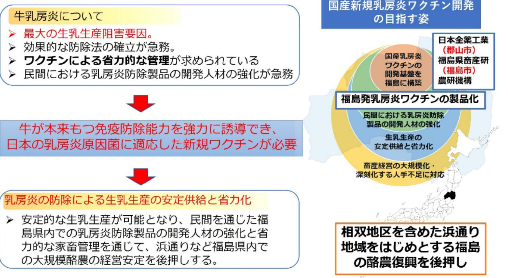

# 福島から世界へ発信する新しいコンセブトの牛乳房炎ワクチンの開発

| 募集課題名 | 農林水産業分野 令和5年度「福島国際研究教育機構における農林水産研究の推進」委託事業 テーマ（8）福島浜通り地域等の農林水産業復興に資する研究事業（提案公募型募集） |
|--------------|------------------------------------------------------------------------------------------------------------------------------------------|
| 研究実施者 | 大崎慎人（新コンセプト牛乳房炎ワクチンコンソーシアム（農研機構（代表機関）、日本全薬工業（株）、福島県） |
| 実施予定期間 | 令和11年度まで（ただし実施期間中の各種評価等により変更があり得る） |

## 【背景・目的】

福島県内の略農は、東日本大震災以降、大きな影響を受け、生乳生産量は約7割まで減少した。乳房炎は最大の生乳生産阻害要因であり、本事業では、牛が本来もつ免疫防除能力を利用し乳房炎原因菌に効果的な新規ワクチンの開発を目指す。あわせて当該ワクチンによる省力的な管理技術の開発や乳房炎防除製品の開発人材の育成を目指す。

## 【研究方法(手法・方法)】

国産乳房炎ワクチン開発のための基盤技術の確立に向けて、新規のワクチン評価系の構築、ワクチン製剤組成の設計・最適化、粘膜免疫と全身免疫を誘導するワクチン有効性試験、Target product profileの実現に向けたプロトタイプワクチンの実証試験を行う。

## 【期待される研究成果】

- 福島発の新規ワクチンによる乳房炎被害の低減を通じた、安定的な安全で高品質な生乳生産
- 相双地区を含めた浜通り地域をはじめとする福島の酪農復興

## 牛乳房炎について

＞ 最大の生乳生産阻害要因。
＞ 効果的な防除法の確立が急務。
▶ ワクチンによる力的な管理が求められている
▶ 民間における乳房炎防除製品の開発人材の強化が急務

牛が本来持つ免疫防除能力を協力に誘導でき、日本の乳房炎原因菌に適応した新規ワクチンが必要

乳房炎の防除による生乳生産の安定供給と省力化
▶ 安定的な生乳生産が可能となり、民間を通じた福島県内での乳房炎防除製品の開発人材の強化と省力的な家畜管理を通じて、浜通りなど福島県内での大規模酪農の経営安定を後押しする。

相双地区を含めた浜通り地域をはじめとする福島の酪農復興を後押し

