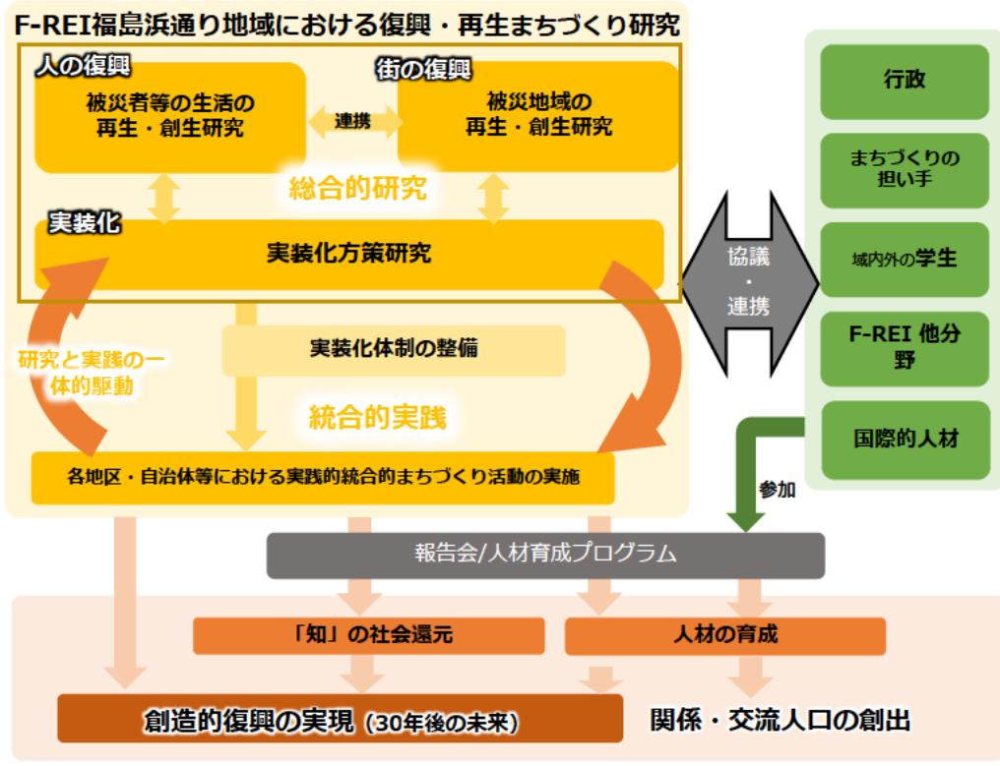

# 福島浜通り地域における復興・再生まちづくり研究 事業概要

| 募集課題名 | 原子力災害に関するデータや知見の集積・発信分野 令和5年度「福島浜通り地域におけるまちづくり研究及びラーニング・コミュニティハブ整備」委託事業 テーマ（1）福島浜通り地域におけるまちづくり研究 |
|--------------|------------------------------------------------------------------------------------------------------------------------------------------|
| 研究実施者 | 姥浦道生（福島浜通り地域における復興・再生まちづくり研究コンソーシアム（東北大学（代表機関）、福島大学） |
| 実施予定期間 | 令和11年度まで（ただし実施期間中の各種評価等により変更があり得る） |

## 【背景・目的】

30年後の社会を見据えた未来課題の解決及び地域の魅力創出に向け、創造的復興に資するまちづくり(都市工学、都市計画、都市行政学等の研究領域)に関する研究を行うとともに、地域をフィールドとする研究プログラムに大学院生等を参画させることにより人材育成を行う。

## 【研究方法(手法・方法)】

### (1)まちづくり研究

被災者等の生活及び被災地域の再生・創生に向けた研究(住民生活、コミュニティ、土地利用、建築等)を行うとともに、まちづくりの実装化に向けた課題の把握等のための研究を行う。

### (2) 実装化体制の整備

まちづくり研究に必要な研究の体制等を構築するとともに、福島浜通り地域のまちづくり関係者と協議する体制の在り方ついて検討する。

### (3)人材育成

実践的な研究者、まちづくりに関与する実務家、学生等の人材育成を行うとともに、海外の研究者や学生との交流も図る。

## 【期待される研究成果】

- 持続可能な住民主導のまちへの寄与
- 人材育成プログラムや研究報告会の実施等による関係・交流人口の創出

