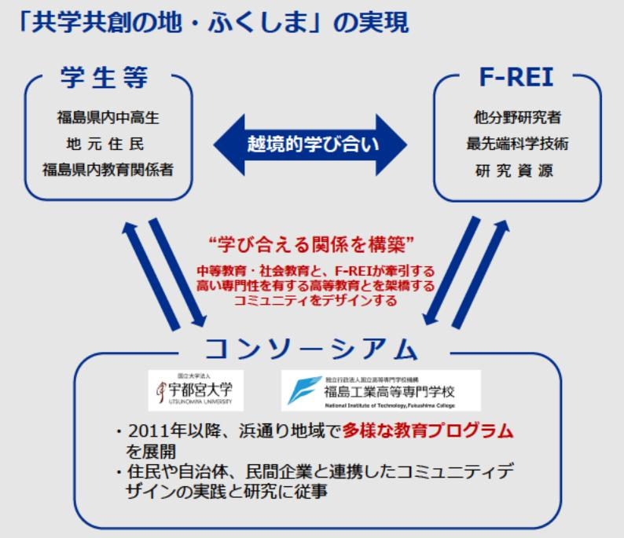

# 課題解決型地域教育プログラムの開発・実装・発信に関わる実践研究 事業概要

F-REI

| 募集課題名 | 原子力災害に関するデータや知見の集積・発信分野 令和5年度「福島浜通り地域におけるまちづくり研究及びラーニング・コミュニティ八ブ整備」 委託事業 テーマ(2)福島浜通り地域におけるラーニング・コミュニティハブの整備 |
|---|---|
| 研究実施者 | 石井 大一郎(福島ラーニング・コミュニティバブ・コンソーシアム(宇都宮大学(代表機関)、福島工業高等専門学校)) |
| 実施予定期間 | 令和11年度まで(ただし実施期間中の各種評価等により変更があり得る) |

## 【背景・目的】

福島浜通り地域内外の学生や住民とF-REIの研究者が学び合い、将来の地域の担い手となる若者による未来課題の解決を実現する。

## 【研究方法(手法・方法)】

- 中等教育の現状とニーズを把握し、教育ブログラムを開発・検証するための、関係者(市町村教育委員会、中学校、高等学校、高専等)が 集う研究会の開催
- 中高生・高専生向けの国際的かつ独自色あふれる地域教育プログラムの開発・実装
  - ・ウェルビーイングのための科学技術を考える「STEAMカフェ」の実施
  - ・F-REI研究の理解とF-REI研究者との交流を深める学生参加型の「STEAMカフェ」の実施

## 【期待される研究成果】

- 福島浜通り独自の地域教育プログラムの開発
- 科学的素養を持った人材育成
- 教育プログラムを支えるラーニングコミュニティ・リーダーの育成

## 「共学共創の地・ふくしま」の実現

学生等

- 福島県内中高生
- 地元住民
- 福島県内教育関係者

越境的学び合い

F-REI

- 他分野研究者
- 最先端科学技術
- 研究資源

コンソーシアム

- 宇都宮大学
- 福島工業高等専門学校

- 2011年以降、浜通り地域で多様な教育プログラムを展開
- 住民や自治体、民間企業と連携したコミュニティデザインの実践と研究に従事

“学び合える関係を構築”

中等教育・社会教育と、F-REIが牽引する高い専門性を有する高等教育とを架橋するコミュニティをデザインする

